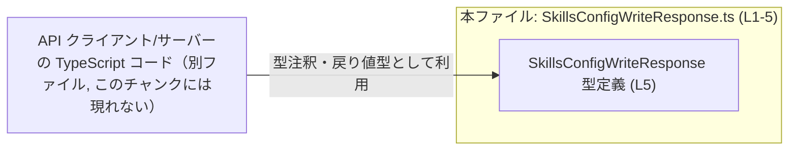
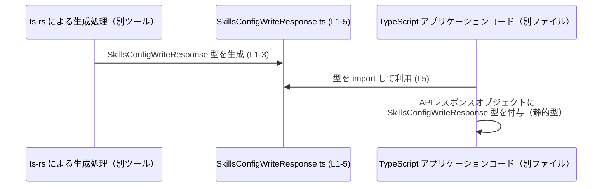

# app-server-protocol/schema/typescript/v2/SkillsConfigWriteResponse.ts コード解説

## 0. ざっくり一言

- `SkillsConfigWriteResponse` という **レスポンス用のオブジェクト型エイリアス**（`{ effectiveEnabled: boolean }`）を 1 つだけ公開する、自動生成された TypeScript 型定義ファイルです（`SkillsConfigWriteResponse.ts:L1-5`）。

---

## 1. このモジュールの役割

### 1.1 概要

- このファイルは、ツール **ts-rs** によって自動生成された TypeScript の型定義ファイルです（コメントより、`SkillsConfigWriteResponse.ts:L1-3`）。
- `SkillsConfigWriteResponse` 型として、`effectiveEnabled: boolean` という 1 つのプロパティを持つオブジェクト型のエイリアスを提供します（`SkillsConfigWriteResponse.ts:L5-5`）。
- コメントで「手で編集しないこと」が明示されており、このファイルはビルド時に再生成される成果物として扱われることが分かります（`SkillsConfigWriteResponse.ts:L1-3`）。

### 1.2 アーキテクチャ内での位置づけ

コードから直接分かる事実は次のとおりです。

- このモジュールは他のモジュールを **import していません**（`SkillsConfigWriteResponse.ts:L1-5`）。
- `export type SkillsConfigWriteResponse = ...` により、他の TypeScript ファイルからインポートされる **公開型** を 1 つ提供します（`SkillsConfigWriteResponse.ts:L5-5`）。
- パス `app-server-protocol/schema/typescript/v2/` から、プロトコル（サーバーとのやりとり）のスキーマ定義群の一部であると考えられますが、このチャンクだけでは利用箇所や呼び出し元は特定できません。

想定される依存関係（※依存元はこのチャンクには登場しません）を図示すると、次のようになります。



### 1.3 設計上のポイント

- **自動生成コード**  
  - 先頭コメントで `// GENERATED CODE! DO NOT MODIFY BY HAND!` とあり、自動生成であることと、手動編集禁止であることが明示されています（`SkillsConfigWriteResponse.ts:L1-1`）。
  - 2 行目のコメントで、生成元ツールとして `ts-rs` が示されています（`SkillsConfigWriteResponse.ts:L3-3`）。
- **型のみ、ロジックなし**  
  - 関数やクラス、変数定義はなく、型エイリアスのみが定義されています（`SkillsConfigWriteResponse.ts:L5-5`）。
  - 実行時の処理・エラーハンドリング・並行処理などのロジックは一切含まれません。
- **厳密なプロパティ構造**  
  - `effectiveEnabled` は `boolean` 型の **必須プロパティ** として定義されています（`SkillsConfigWriteResponse.ts:L5-5`）。
  - オプショナル（`?`）やユニオン型は使われておらず、構造はシンプルです。

---

## 2. 主要な機能一覧

このモジュールが提供するのは、次の 1 つの公開型です。

- `SkillsConfigWriteResponse` 型定義: プロパティ `effectiveEnabled: boolean` を持つオブジェクト型のエイリアス（`SkillsConfigWriteResponse.ts:L5-5`）

※ 名前から「スキル設定書き込みのレスポンス」を表すと推測できますが、用途の詳細はこのチャンクからは確定できません。

---

## 3. 公開 API と詳細解説

### 3.1 型一覧（構造体・列挙体など）

| 名前 | 種別 | 役割 / 用途 | 定義位置 |
|------|------|-------------|----------|
| `SkillsConfigWriteResponse` | 型エイリアス（オブジェクト型） | プロパティ `effectiveEnabled: boolean` を持つオブジェクト型に別名を付けたものです。名前からレスポンス用の型と考えられますが、用途の詳細はコードからは分かりません。 | `SkillsConfigWriteResponse.ts:L5-5` |

#### フィールド構造

- `effectiveEnabled: boolean`（`SkillsConfigWriteResponse.ts:L5-5`）  
  - 真偽値を保持する必須プロパティです。
  - オプショナル指定や `null` 許容などはされていません。

### 3.2 関数詳細（最大 7 件）

- このファイルには **関数・メソッドの定義は存在しません**（`SkillsConfigWriteResponse.ts:L1-5`）。
- したがって、関数詳細テンプレートに従って説明すべき公開関数はありません。

### 3.3 その他の関数

- 補助関数やラッパー関数も含め、**関数は 1 つも定義されていません**（`SkillsConfigWriteResponse.ts:L1-5`）。

---

## 4. データフロー

このファイル自体は型定義のみで、実行時の処理は含みません。ただし、一般的な利用シナリオとしては、次のような **型レベルのデータフロー** が考えられます（利用側コードはこのチャンクには現れません）。

1. サーバー側（おそらく Rust）に `SkillsConfigWriteResponse` に対応する構造体があり、ts-rs によって TypeScript 型が生成される（`SkillsConfigWriteResponse.ts:L1-3`）。
2. TypeScript 側の API クライアント／サーバーコードが、この型をインポートして戻り値や変数の型注釈に利用する（`SkillsConfigWriteResponse.ts:L5-5`）。
3. 実行時には JSON などのレスポンスがオブジェクトとして扱われ、そのオブジェクトが `SkillsConfigWriteResponse` 型だと **仮定して** 使用されます（型はコンパイル時のみ有効）。

この関係を簡単なシーケンス図で表すと次のようになります。



> 注: `Gen` および `App` に相当するコードやツールは、このチャンクには含まれていません。上記はコメントとファイルパスからの一般的な利用イメージです。

---

## 5. 使い方（How to Use）

### 5.1 基本的な使用方法

このファイル自身には利用例は含まれていませんが、一般的な TypeScript コードからの使い方の一例を示します。  
※ 以下は **あくまで利用イメージ** であり、このリポジトリ内の実在コードを示すものではありません。

```typescript
// SkillsConfigWriteResponse 型をインポートする例                  // 型定義ファイルから型のみインポートする
import type { SkillsConfigWriteResponse } from "./SkillsConfigWriteResponse"; // 相対パスはプロジェクト構成に合わせて調整

// API 呼び出しの戻り値として SkillsConfigWriteResponse を利用する例
async function writeSkillsConfig(/* 引数などは任意 */): Promise<SkillsConfigWriteResponse> { // 戻り値を SkillsConfigWriteResponse と宣言
    const res = await fetch("/api/v2/skills-config", {                               // API エンドポイントに POST
        method: "POST",
        // body などのパラメータは省略
    });

    const json = await res.json();                                                   // JSON をパース（型は any）
    // 実際にはここでバリデーションを行うことが望ましい
    return json as SkillsConfigWriteResponse;                                        // SkillsConfigWriteResponse であると型アサーション
}
```

#### TypeScript 特有の安全性と注意点

- `SkillsConfigWriteResponse` は **コンパイル時の型** なので、`fetch().json()` の戻り値が本当に `{ effectiveEnabled: boolean }` かどうかは **実行時には検証されません**。
- 未検証の外部入力をそのまま `as SkillsConfigWriteResponse` で扱うと、`effectiveEnabled` が実際には `boolean` でない場合にもコンパイルは通ってしまい、実行時エラーやバグの原因になります。

### 5.2 よくある使用パターン

1. **API クライアント関数の戻り値型として利用**  
   - 例（概要）: `function saveSkillsConfig(...): Promise<SkillsConfigWriteResponse> { ... }`
   - 効果: API 呼び出しの利用側で `response.effectiveEnabled` が boolean として補完・型チェックされます。

2. **状態管理（Redux, zustand 等）の型として利用**  
   - 例:  

     ```typescript
     type SkillsState = {
         writeResponse?: SkillsConfigWriteResponse; // 直近のレスポンスを保持
     };
     ```

   - 状態オブジェクトに格納するレスポンスの形を型として保証できます。

### 5.3 よくある間違い

以下は一般的に起こり得る誤用例と、その修正例です。

```typescript
// 誤りの例: any のまま扱ってしまう
async function badExample(): Promise<void> {
    const res = await fetch("/api/v2/skills-config");
    const json = await res.json();                          // json の型は any
    // json.effectiveEnabled を boolean だと信じて使うが、型安全性がない
    if (json.effectiveEnabled) {                            // effectiveEnabled プロパティの有無や型が保証されない
        // ...
    }
}

// 正しい方向性の例: SkillsConfigWriteResponse 型を使う
import type { SkillsConfigWriteResponse } from "./SkillsConfigWriteResponse";

async function betterExample(): Promise<void> {
    const res = await fetch("/api/v2/skills-config");
    const json: unknown = await res.json();                 // まず unknown として受ける

    // ここで json の構造をチェックするカスタムバリデーションを行うなどして、
    // SkillsConfigWriteResponse であることを確認するのが安全
    const typed = json as SkillsConfigWriteResponse;        // 例では簡略化して as を使用

    if (typed.effectiveEnabled) {                           // boolean として安全に扱える（コンパイル時）
        // ...
    }
}
```

### 5.4 使用上の注意点（まとめ）

- **実行時型チェックは行われない**  
  - TypeScript の型はコンパイル時のみ有効であり、`effectiveEnabled` が実行時に本当に `boolean` かどうかは別途検証が必要です。
- **外部入力のバリデーションが重要**  
  - ネットワークや外部サービスからのレスポンスにこの型を適用する場合、**不正な JSON**（プロパティ欠落・型不一致）に注意が必要です。
- **プロパティは必須**  
  - 型定義上、`effectiveEnabled` は必須プロパティです（`SkillsConfigWriteResponse.ts:L5-5`）。  
    オブジェクトリテラルをこの型として定義する場合、プロパティを省略するとコンパイルエラーになります。
- **並行性やスレッド安全性は関係しない**  
  - このファイルは型定義のみのため、並行処理やスレッド安全性に関する懸念はありません。

---

## 6. 変更の仕方（How to Modify）

### 6.1 新しい機能を追加する場合

- コメントで明示されている通り、このファイルは **「手で編集しない」** 前提の自動生成コードです（`SkillsConfigWriteResponse.ts:L1-3`）。
- 新しいフィールドを追加したい場合や構造を変更したい場合は、**生成元（おそらく Rust 側の型定義や ts-rs の設定）を変更する必要があります**。  
  生成元の具体的な場所や名前はこのチャンクには現れないため、「どのファイルか」は不明です。

変更の一般的な手順イメージ:

1. ts-rs が参照している元の Rust 型（またはスキーマ定義）にフィールドを追加・変更する。
2. ts-rs のコード生成プロセスを実行し直す。
3. 本ファイルが再生成され、新しい構造を反映した `SkillsConfigWriteResponse` 型が出力される。

### 6.2 既存の機能を変更する場合

- **このファイルを直接書き換えることは推奨されません**（`SkillsConfigWriteResponse.ts:L1-3`）。
- 直接編集すると:
  - 次回の自動生成で変更が上書きされる。
  - サーバー側（Rust 等）の型定義との不整合が発生する可能性がある。
- 型契約（contract）としての前提:
  - クライアント側コードは「`effectiveEnabled` が必ず存在し boolean 型である」ことを前提に書かれている可能性があります。
  - これを生成元で変更する場合は、**利用箇所すべての影響を確認**する必要があります。

#### テストについて

- このファイル自体は型定義のみであるため、通常は直接テスト対象にはしません。
- 代わりに次のようなテストが考えられます（このチャンクには現れませんが、一般論として）:
  - サーバー側との **シリアライズ／デシリアライズの整合性テスト**。
  - 実際の API レスポンスが `SkillsConfigWriteResponse` 型に適合するかどうかのバリデーションテスト。

#### パフォーマンス面

- 型定義だけのファイルであり、実行時コストは発生しません。
- コンパイル時の型チェックにのみ関係し、スケーラビリティへの影響はごく小さいと考えられます。

---

## 7. 関連ファイル

このチャンクには他ファイルへの参照がないため、正確な関連ファイルは特定できません。ただし、コメントとファイルパスから次のような関係が想定されます。

| パス / 種別 | 役割 / 関係 |
|-------------|------------|
| Rust 側の元型定義ファイル（具体的なパスは不明） | ts-rs が参照し、この TypeScript 型 `SkillsConfigWriteResponse` を生成する元の構造体定義が存在すると考えられます（コメントより、`SkillsConfigWriteResponse.ts:L3-3`）。 |
| `app-server-protocol/schema/typescript/v2/` 配下の他の `.ts` ファイル（このチャンクには現れない） | 同じく ts-rs によって生成された、他のリクエスト／レスポンス用の型定義群であると推測されます。 |
| API クライアント／サーバーの TypeScript コード（別ディレクトリ、詳細不明） | `SkillsConfigWriteResponse` 型を import して利用する実処理コードが存在すると考えられますが、このチャンクからは場所や名前は分かりません。 |

以上のように、このファイルは **型契約を共有するための、自動生成された単純な TypeScript 型定義** であり、ロジックやエラー処理・並行性は別の層（生成元や利用側コード）で扱われる構造になっています。
