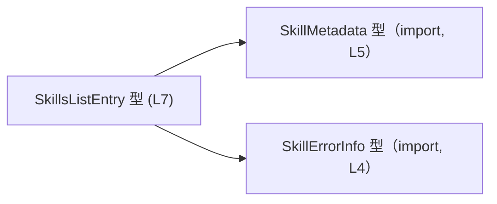
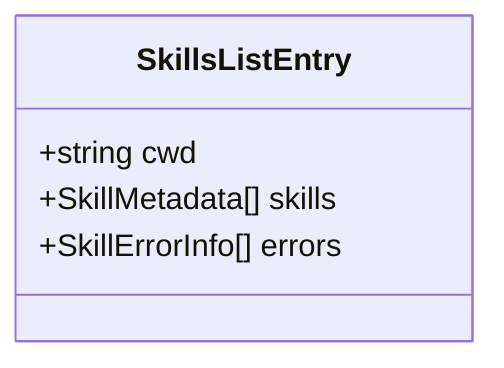
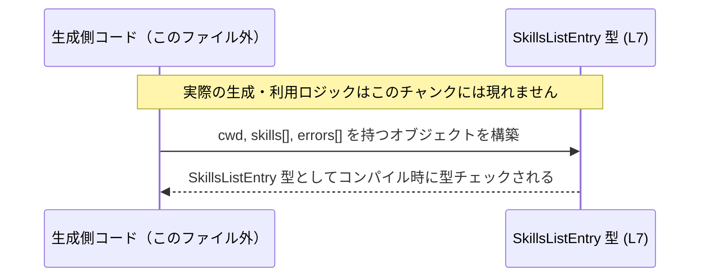

# app-server-protocol/schema/typescript/v2/SkillsListEntry.ts コード解説

## 0. ざっくり一言

このファイルは、スキル一覧の1件分を表す TypeScript のオブジェクト型 `SkillsListEntry` を定義する、**スキーマ用の型定義ファイル**です（生成コードであり、手動編集禁止）  
（`app-server-protocol/schema/typescript/v2/SkillsListEntry.ts:L1-3, L7-7`）。

---

## 1. このモジュールの役割

### 1.1 概要

- このモジュールは、スキル関連情報をリスト形式で扱う際の **「1エントリの形」** を表現するための型を提供します（`SkillsListEntry` 型、`L7-7`）。
- 具体的には、文字列 `cwd` と、`SkillMetadata` 型の配列、`SkillErrorInfo` 型の配列を 1つのオブジェクトにまとめる役割を持ちます（`L7-7`）。
- ファイル自体は **ts-rs による自動生成コード** であり、手作業での編集は想定されていません（`L1-3`）。

### 1.2 アーキテクチャ内での位置づけ

このモジュールは **スキーマ層** の一部として、他のコードから参照される「型定義専用モジュール」です。

- 依存関係:
  - `SkillErrorInfo` 型に依存（`import type` による参照、`L4-4`）
  - `SkillMetadata` 型に依存（`import type` による参照、`L5-5`）
- 提供するもの:
  - これら2つの型を組み合わせた `SkillsListEntry` 型（`L7-7`）

このファイル内部の依存関係を示す簡易図です。



> 説明: `SkillsListEntry` は `SkillMetadata` と `SkillErrorInfo` の配列をフィールドとして保持するオブジェクト型として定義されています。

`SkillsListEntry` がどのモジュールから利用されているか（例: サーバー・クライアント・シリアライザなど）は、このチャンクからは分かりません。

### 1.3 設計上のポイント

- **生成コード**  
  - 「GENERATED CODE」「Do not edit」と明示されており（`L1-3`）、手動編集ではなくツール（ts-rs）側の定義を変更する前提の設計です。
- **データ専用・状態やロジックを持たない**  
  - `export type` による**型エイリアス**のみで、関数やクラス、メソッドは定義されていません（`L7-7`）。
- **参照のみの依存（import type）**  
  - `import type` により型情報だけを参照しており、実行時に不要な依存関係を持たない形になっています（`L4-5`）。
- **配列での多件保持**  
  - スキル情報とエラー情報をそれぞれ配列 (`Array<SkillMetadata>`, `Array<SkillErrorInfo>`) で表現し、多数の要素をまとめて扱えるようになっています（`L7-7`）。

---

## 2. 主要な機能一覧

このモジュールが提供する機能（=公開データ型）は 1つのみです。

- `SkillsListEntry`: スキル情報1件分のデータ構造を表すオブジェクト型  
  （フィールド: `cwd: string`, `skills: Array<SkillMetadata>`, `errors: Array<SkillErrorInfo>`）（`L7-7`）

※ `cwd` が何を意味するかはコード上に説明がありませんが、名前からは「current working directory」を表す可能性が考えられます。ただし、**コメントや追加情報は無いため断定はできません**。

---

## 3. 公開 API と詳細解説

### 3.1 型一覧（構造体・列挙体など）

#### このファイルで定義される型

| 名前               | 種別                           | 役割 / 用途                                                                                           | 定義位置 |
|--------------------|--------------------------------|--------------------------------------------------------------------------------------------------------|----------|
| `SkillsListEntry`  | 型エイリアス（オブジェクト型） | スキル一覧の 1 エントリ分の情報をまとめるデータ構造。`cwd` と `skills` 配列、`errors` 配列を持つ。 | `app-server-protocol/schema/typescript/v2/SkillsListEntry.ts:L7-7` |

`SkillsListEntry` のフィールド構造（コードから読み取れる情報）は以下の通りです（`L7-7`）。

- `cwd: string`
- `skills: Array<SkillMetadata>`
- `errors: Array<SkillErrorInfo>`

#### このファイルが依存する型（定義は別ファイル）

| 名前             | 種別       | 役割 / 用途（推測を含む）                                                                                           | 定義位置 |
|------------------|------------|----------------------------------------------------------------------------------------------------------------------|----------|
| `SkillErrorInfo` | （不明）   | スキル関連のエラー情報を表す型と考えられますが、このチャンクには定義が無く詳細は不明です。                         | 定義ファイルは `./SkillErrorInfo`（相対パス）だが、このチャンクには現れません。 (`L4-4`) |
| `SkillMetadata`  | （不明）   | スキルのメタデータ（名前・ID・説明など）を表す型と考えられますが、同様に詳細はこのチャンクからは分かりません。 | 定義ファイルは `./SkillMetadata`（相対パス）だが、このチャンクには現れません。 (`L5-5`) |

> `SkillErrorInfo` / `SkillMetadata` の具体的なフィールド構成や挙動は、**別ファイルを参照しない限り不明**です。

### 3.2 関数詳細（最大 7 件）

このファイルには **関数・メソッドの定義は一切存在しません**（`L1-7` のいずれにも `function` / `=>` による関数宣言はありません）。

そのため、関数詳細テンプレートに従って説明できる対象はありません。

### 3.3 その他の関数

- 該当なし（関数定義が存在しないため、このセクションに列挙すべき関数はありません）。

---

## 4. データフロー

### 4.1 構造内部のデータ関係

`SkillsListEntry` のオブジェクト内部でのデータ構造を図示します。



> 説明: 1つの `SkillsListEntry` は文字列 `cwd` と、2種類の配列 (`skills`, `errors`) を持つシンプルなコンテナとして定義されています（`L7-7`）。

### 4.2 典型的なライフサイクル（概念図）

このファイルにはデータの生成や送受信を行うコードはありません。そのため、**実際にどのようなモジュール間でやり取りされるかは不明**です。

ここでは、「この型がどのように使われうるか」の抽象的なイメージ図のみを示します（具体的なモジュール名や処理内容は、このチャンクからは読み取れません）。



- `P` はこの型を利用する任意のコード（サーバー／クライアント／ユーティリティなど）を抽象的に表しています。
- この図は **TypeScript の型チェック上の関係のみ** を示し、具体的な処理フローは示していません。

---

## 5. 使い方（How to Use）

### 5.1 基本的な使用方法

このモジュールは `SkillsListEntry` 型をエクスポートしているだけなので、基本的な利用は **「型としてインポートして変数や引数の型注釈に使う」** 形になります。

#### 例: `SkillsListEntry` 型の値を構築して使う

```typescript
// SkillsListEntry 型と、その依存型を型としてインポートする                // 実行時には出力されない型専用の import
import type { SkillsListEntry } from "./SkillsListEntry";                 // このファイル自身を別モジュールから参照する想定
import type { SkillMetadata } from "./SkillMetadata";                     // スキルのメタデータ型（詳細はこのチャンクには現れない）
import type { SkillErrorInfo } from "./SkillErrorInfo";                   // スキルエラー情報型（詳細不明）

// 他の場所で定義された SkillMetadata / SkillErrorInfo の配列があると仮定する // 具体的な中身はこのファイルからは分からない
declare const skillMetadataList: SkillMetadata[];                         // コンパイル時に型だけ保証される
declare const errorList: SkillErrorInfo[];                                // 同上

// SkillsListEntry 型のオブジェクトを構築する                               // 3つのプロパティを持つオブジェクトリテラル
const entry: SkillsListEntry = {                                          // ここで型チェックが行われる
    cwd: "/path/to/project",                                              // cwd プロパティ: string 型
    skills: skillMetadataList,                                            // skills プロパティ: SkillMetadata[] 型
    errors: errorList,                                                    // errors プロパティ: SkillErrorInfo[] 型
};

// entry を他の処理に渡して利用する                                       // どのように利用されるかはこのファイルからは分からない
console.log(entry.cwd);                                                   // string なので文字列として扱える
```

この例のポイント:

- `import type` を使うことで、コンパイル時専用の依存関係として `SkillsListEntry` を利用できます（実行時バンドルに含めない用途）。
- `SkillsListEntry` は **純粋なデータコンテナ** なので、構築は単なるオブジェクトリテラルです。

### 5.2 よくある使用パターン

1. **関数の引数型として利用**

```typescript
import type { SkillsListEntry } from "./SkillsListEntry";                 // 型としてのインポート

// SkillsListEntry を受け取って何らかの処理を行う関数                     // 実際の処理内容は別途実装
function handleSkillsEntry(entry: SkillsListEntry) {                      // entry は型安全にアクセスできる
    // cwd に基づいてログ出力を行うなどの処理が想定されるが、             // ここでは具体的な意味はコードからは分からない
    console.log("cwd:", entry.cwd);                                       // string 型として扱える
    console.log("skills count:", entry.skills.length);                    // SkillMetadata[] として length にアクセス
    console.log("errors count:", entry.errors.length);                    // SkillErrorInfo[] として length にアクセス
}
```

1. **配列として複数エントリを扱う**

```typescript
import type { SkillsListEntry } from "./SkillsListEntry";                 // 型インポート

// SkillsListEntry の配列を受け取る関数                                   // スキル一覧全体を扱うイメージ
function processSkills(entries: SkillsListEntry[]) {
    for (const entry of entries) {                                        // 各エントリを順に処理
        // cwd, skills, errors を利用して何らかの集計や表示を行う         // 具体的な処理はこのチャンクからは不明
        console.log(entry.cwd, entry.skills.length, entry.errors.length);
    }
}
```

### 5.3 よくある間違い

#### 1. 型に合わない値を入れる（コンパイルエラー）

```typescript
import type { SkillsListEntry } from "./SkillsListEntry";

// 間違い例: cwd を number にしてしまう                                  // cwd は string 型として定義されている（L7）
const badEntry: SkillsListEntry = {
    // @ts-expect-error: Type 'number' is not assignable to type 'string'.
    cwd: 123,                                                             // コンパイルエラーになる
    skills: [],                                                           // 型は OK
    errors: [],                                                           // 型は OK
};
```

#### 2. 必須プロパティを省略する（コンパイルエラー）

```typescript
import type { SkillsListEntry } from "./SkillsListEntry";

// 間違い例: errors プロパティを省略してしまう                           // errors は必須プロパティ（? が付いていない）(L7)
const incompleteEntry: SkillsListEntry = {
    // @ts-expect-error: Property 'errors' is missing in type ...
    cwd: "/path/to/project",                                              // OK
    skills: [],                                                           // OK
};
```

### 5.4 使用上の注意点（まとめ）

- **必須プロパティの未設定**  
  - `cwd`, `skills`, `errors` はすべて必須プロパティであり、`?` が付いていないため省略できません（`L7-7`）。
- **配列が空でも型的には問題なし**  
  - `skills` / `errors` は `Array<...>` 型なので、空配列 `[]` でも型上は有効です。
  - 「空が許されるかどうか」はビジネスロジック側の問題であり、この型定義からは読み取れません。
- **実行時のバリデーションは別途必要**  
  - TypeScript の型はコンパイル時のみ有効であり、実行時に自動的なチェックは行われません。
  - 外部データ（JSON など）から `SkillsListEntry` を構築する場合は、**別途バリデーション処理が必要**です。
- **スレッド安全性／並行性**  
  - この型はただのデータ構造であり、並行性やミューテーションに関する仕様は一切持ちません。
  - JavaScript / TypeScript の通常のオブジェクトと同様、同じインスタンスを複数箇所で共有する場合の管理は利用側の責任になります。

---

## 6. 変更の仕方（How to Modify）

### 6.1 新しい機能（フィールド）を追加する場合

このファイルは ts-rs による生成コードであり、**コメントにより手動編集禁止と明示されています**（`L1-3`）。  
そのため、`SkillsListEntry` にフィールドを追加したい場合でも、**このファイルを直接書き換えるべきではありません**。

一般的な手順（コメントから読み取れる範囲の推測を含む）:

1. 元定義の場所を特定する  
   - コメントによると、このファイルは `[ts-rs](https://github.com/Aleph-Alpha/ts-rs)` によって生成されています（`L3-3`）。
   - 通常、ts-rs は Rust の構造体などから TypeScript 型を生成しますが、**どの Rust ファイルかはこのチャンクからは分かりません**。
2. Rust 側（またはスキーマ定義側）で `SkillsListEntry` に対応する構造体・型を修正する  
   - 例: Rust の `struct SkillsListEntry { ... }` にフィールドを追加する等（あくまで一般的な ts-rs の使い方であり、このリポジトリ固有の構成は不明）。
3. ts-rs のコード生成処理を再実行し、TypeScript 側のファイルを再生成する  
   - これにより、本ファイルの `SkillsListEntry` 定義が自動的に更新されることが期待されます。

### 6.2 既存の機能を変更する場合

同様に、`cwd` / `skills` / `errors` の型や名前を変更したい場合も **直接編集ではなく元定義を変更する必要があります**。

変更時に注意すべき点（コードから読み取れる範囲）:

- **契約（Contract）**
  - `cwd` は `string` として期待されているため（`L7-7`）、別の型（例: `number`）に変えると多くの利用箇所でコンパイルエラーが発生する可能性があります。
  - `skills` / `errors` は配列として使われているため（`L7-7`）、単一要素に変えると `length` などに依存しているコードとの契約が崩れる可能性があります。
- **影響範囲の確認**
  - 型定義ファイルは広範囲で import されていることが多いため、変更前にリポジトリ全体で `SkillsListEntry` を検索し、利用箇所の影響範囲を確認する必要があります。
  - ただし、**具体的な利用箇所やテストコードはこのチャンクには現れないため、ここからは特定できません**。
- **テスト**
  - スキーマ変更に伴い、シリアライズ／デシリアライズや API レスポンス形式が変わる場合があります。
  - 対応するテスト（存在する場合）は、**元定義と利用側コードの両方**を合わせて更新する必要がありますが、どのテストが関連するかはこのチャンクからは分かりません。

---

## 7. 関連ファイル

このモジュールと密接に関係するファイル（このチャンクから推定できる範囲）は次の通りです。

| パス                                                          | 役割 / 関係                                                                                                                           |
|---------------------------------------------------------------|----------------------------------------------------------------------------------------------------------------------------------------|
| `app-server-protocol/schema/typescript/v2/SkillErrorInfo.ts`  | `SkillErrorInfo` 型の定義が存在すると考えられるファイル。`SkillsListEntry` の `errors` フィールドの要素型として利用される（`L4-4`）。 |
| `app-server-protocol/schema/typescript/v2/SkillMetadata.ts`   | `SkillMetadata` 型の定義が存在すると考えられるファイル。`SkillsListEntry` の `skills` フィールドの要素型として利用される（`L5-5`）。  |
| ts-rs による元定義（Rust 側など、パス不明）                  | コメントから、このファイルは ts-rs により自動生成されていることが分かるが（`L3-3`）、元の定義ファイルの場所はこのチャンクからは不明。 |

> 補足: 実際にどのコードから `SkillsListEntry` が import されているか、またどのテストがこの型を検証しているかは、この1ファイルだけからは判断できません。
