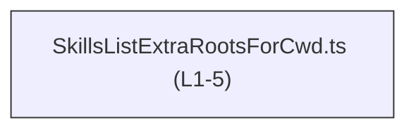
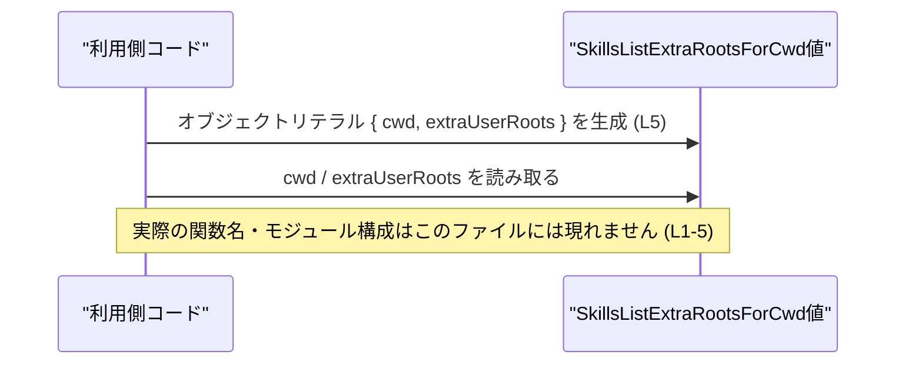

# app-server-protocol\schema\typescript\v2\SkillsListExtraRootsForCwd.ts コード解説

---

## 0. ざっくり一言

`SkillsListExtraRootsForCwd` という **1 つの型エイリアス**を定義するだけの、自動生成された TypeScript スキーマファイルです。  
カレントディレクトリと、追加のユーザールート（文字列配列）をまとめて表現します。

- 根拠: 自動生成コメントおよび型定義  
  `app-server-protocol\schema\typescript\v2\SkillsListExtraRootsForCwd.ts:L1-3, L5-5`

---

## 1. このモジュールの役割

### 1.1 概要

- このモジュールは、`SkillsListExtraRootsForCwd` という型を通じて  
  「`cwd`（current working directory）」と「`extraUserRoots`（追加のルートパス群）」を 1 つのオブジェクトとして扱うための **型情報** を提供します。
- コメントにより、`ts-rs` ツールによって **Rust 側の定義から自動生成された型定義ファイル** であることが示されています（一般的に ts-rs はその用途のツールです）。

**根拠**

- 自動生成コメント  
  `// GENERATED CODE! DO NOT MODIFY BY HAND!`  
  `// This file was generated by [ts-rs]...`  
  `app-server-protocol\schema\typescript\v2\SkillsListExtraRootsForCwd.ts:L1-3`
- 型エイリアス定義  
  `export type SkillsListExtraRootsForCwd = { cwd: string, extraUserRoots: Array<string>, };`  
  `app-server-protocol\schema\typescript\v2\SkillsListExtraRootsForCwd.ts:L5-5`

### 1.2 アーキテクチャ内での位置づけ

このファイルは以下のような位置づけになっています。

- TypeScript 側から見て、「スキーマ層（schema/typescript/v2）」に属する **単独の型定義モジュール** です。
- import 文や他モジュールへの参照は一切なく、他のコードには **型を export するだけ** のモジュールです（依存方向は「他モジュール → この型」になります）。



**根拠**

- ファイル内容に `import` / `require` 等が存在しない  
  `app-server-protocol\schema\typescript\v2\SkillsListExtraRootsForCwd.ts:L1-5`

### 1.3 設計上のポイント

- **自動生成ファイル**  
  - 冒頭コメントに「GENERATED CODE」「Do not edit this file manually」とあり、人手で編集しない前提になっています。  
    `app-server-protocol\schema\typescript\v2\SkillsListExtraRootsForCwd.ts:L1-3`
- **純粋なデータ型定義**  
  - 関数やクラスは一切なく、`export type` によるオブジェクト型のみ定義されています。  
    `app-server-protocol\schema\typescript\v2\SkillsListExtraRootsForCwd.ts:L5-5`
- **状態やエラーハンドリングを持たない**  
  - 実行ロジックが存在しないため、内部状態やエラー処理・並行性に関する設計はこのモジュールには登場しません。

---

## 2. 主要な機能一覧

このファイルが提供する「機能」は、実行処理ではなく **型情報の提供** に限定されます。

- `SkillsListExtraRootsForCwd` 型:  
  - `cwd` と `extraUserRoots` をフィールドに持つオブジェクト構造を表す型エイリアスです。  
  - 根拠: `export type SkillsListExtraRootsForCwd = { cwd: string, extraUserRoots: Array<string>, };`  
    `app-server-protocol\schema\typescript\v2\SkillsListExtraRootsForCwd.ts:L5-5`

---

## 3. 公開 API と詳細解説

### 3.1 型一覧（構造体・列挙体など）

| 名前                         | 種別         | フィールド                       | 役割 / 用途の解釈（型名・フィールド名から） |
|------------------------------|--------------|----------------------------------|----------------------------------------------|
| `SkillsListExtraRootsForCwd` | 型エイリアス | `cwd: string`<br>`extraUserRoots: Array<string>` | カレントディレクトリと、追加のユーザー・ルートパスの配列を 1 つのオブジェクトとして扱うための型 |

**根拠**

- 型エイリアス定義  
  `export type SkillsListExtraRootsForCwd = { cwd: string, extraUserRoots: Array<string>, };`  
  `app-server-protocol\schema\typescript\v2\SkillsListExtraRootsForCwd.ts:L5-5`

> 補足: 「何のための cwd / extraUserRoots か」という用途自体は、このファイル単体からは特定できません。上記の用途説明は **フィールド名の自然な読み取り** に基づくものであり、厳密な仕様はこのチャンクには現れていません。

#### フィールド詳細・契約（Contracts）

| フィールド名      | 型                | 意味の読み取り | 契約・期待される前提（この型から読み取れる範囲） |
|-------------------|-------------------|----------------|-------------------------------------------|
| `cwd`             | `string`          | current working directory を表す文字列と解釈できる | 必ず `string`。`null` や `undefined` は許容されない（型レベル）。 |
| `extraUserRoots`  | `Array<string>`   | 追加のルートパスを文字列の配列で持つと解釈できる   | 要素は `string` のみ。空配列は可能（型としては禁止されていない）。 |

- 型が `cwd: string` となっているため、呼び出し側は `cwd` に対して `string` 以外を代入するとコンパイルエラーになります。
- `extraUserRoots: Array<string>` も同様に、配列であり、要素型は `string` に限定されます。

**エッジケース（型レベル）**

- `cwd`:
  - 空文字 `""` も `string` なので型チェック上は許容されます。妥当かどうかは利用側ロジックに依存します（このファイルからは不明）。
- `extraUserRoots`:
  - 空配列 `[]` は型として有効です。
  - `"not-an-array"` のような値を代入すると、TypeScript の型チェックでエラーになります。

### 3.2 関数詳細（最大 7 件）

このファイルには **関数・メソッドは 1 つも定義されていません**。

- Meta 情報: `functions=0`（ユーザー指定）  
- ファイル内容にも `function`, `=>`, `class` 等の関数定義は存在しません。  
  `app-server-protocol\schema\typescript\v2\SkillsListExtraRootsForCwd.ts:L1-5`

したがって、

- エラー発生条件 (`Result` / `Promise` など)  
- panic / 例外の条件  
- パフォーマンス・並行性の観点  

はこのモジュール単体では発生しません。

### 3.3 その他の関数

- なし（補助関数・ラッパー関数等も定義されていません）。  
  `app-server-protocol\schema\typescript\v2\SkillsListExtraRootsForCwd.ts:L1-5`

---

## 4. データフロー

このモジュールは **型定義のみ** を提供し、実行時の処理フローは含みません。そのため、確認できるデータフローは次のような **抽象的な型レベルの流れ** にとどまります。

1. TypeScript コードのどこかで `SkillsListExtraRootsForCwd` 型が import される。
2. `{ cwd, extraUserRoots }` という形のオブジェクトが、この型として生成・利用される。
3. そのオブジェクトが関数の引数や戻り値、シリアライズ対象などとして別の層へ渡される（具体的な渡し先はこのファイルからは不明）。

以下は、「利用側コード」と「SkillsListExtraRootsForCwd 型の値」の関係を **抽象的に** 表したシーケンス図です（特定の関数名・モジュール名は、このファイルには現れません）。



---

## 5. 使い方（How to Use）

### 5.1 基本的な使用方法

この型を利用する典型的な流れは、以下のように「型注釈付きのオブジェクト」として扱うことです。

```typescript
// SkillsListExtraRootsForCwd 型をインポートする
// 実際の import パスは、プロジェクト構成に合わせて調整する必要があります。
import type { SkillsListExtraRootsForCwd } from "./SkillsListExtraRootsForCwd";

// SkillsListExtraRootsForCwd 型の値を作成する
const roots: SkillsListExtraRootsForCwd = {
    cwd: "/home/user/project",                 // カレントディレクトリを表す文字列
    extraUserRoots: [                          // 追加のユーザールートの配列
        "/home/user/.config/skills",
        "/opt/shared/skills"
    ],
};

// roots.cwd や roots.extraUserRoots をそのまま他の処理に渡せる
console.log(roots.cwd);
console.log(roots.extraUserRoots.join(", "));
```

- `cwd` に `number` などを代入すると、TypeScript の型チェックでエラーになります。
- `extraUserRoots` に `string` ではなく `string[]` 以外（例: `null` や `string` 単体）を代入した場合も、同様にコンパイルエラーになります。

### 5.2 よくある使用パターン

#### パターン 1: 関数の引数として使う

```typescript
import type { SkillsListExtraRootsForCwd } from "./SkillsListExtraRootsForCwd";

// SkillsListExtraRootsForCwd 型を受け取る関数の例
function configureRoots(config: SkillsListExtraRootsForCwd) {
    // config.cwd や config.extraUserRoots を使用する
    console.log("cwd:", config.cwd);                     // string として扱える
    console.log("extra roots:", config.extraUserRoots);  // string[] として扱える
}

// 呼び出し例
configureRoots({
    cwd: "/workspace",
    extraUserRoots: ["/workspace/user", "/workspace/shared"],
});
```

- 利用側にとっては、「`cwd` と `extraUserRoots` が必ず存在し、型も固定されている」ことを前提に処理を書けます。

#### パターン 2: API レスポンスやメッセージの型として使う

```typescript
import type { SkillsListExtraRootsForCwd } from "./SkillsListExtraRootsForCwd";

// スキーマ型を返す非同期関数の例
async function fetchRoots(): Promise<SkillsListExtraRootsForCwd> {
    // 実装例は省略。この型を返すことだけが契約となる。
    return {
        cwd: "/workspace",
        extraUserRoots: [],
    };
}
```

- `Promise<SkillsListExtraRootsForCwd>` のように、非同期処理の結果型としても使用できます。

### 5.3 よくある間違い

#### 間違い例 1: `extraUserRoots` を配列にしない

```typescript
import type { SkillsListExtraRootsForCwd } from "./SkillsListExtraRootsForCwd";

// 間違い: extraUserRoots に string を直接入れている
const badConfig: SkillsListExtraRootsForCwd = {
    cwd: "/workspace",
    // TypeScript エラー: 型 'string' を型 'string[]' に割り当てることはできません。
    extraUserRoots: "/workspace/user",
};
```

#### 正しい例

```typescript
const goodConfig: SkillsListExtraRootsForCwd = {
    cwd: "/workspace",
    extraUserRoots: ["/workspace/user"],  // 要素が string の配列
};
```

#### 間違い例 2: 必須フィールドを省略する

```typescript
import type { SkillsListExtraRootsForCwd } from "./SkillsListExtraRootsForCwd";

// 間違い: cwd フィールドを省略している
const badConfig2: SkillsListExtraRootsForCwd = {
    // Property 'cwd' is missing ... というエラーになる
    extraUserRoots: [],
};
```

- この型では `cwd` も `extraUserRoots` も **オプションではなく必須** です（`?` が付いていない）。

### 5.4 使用上の注意点（まとめ）

- **編集禁止**  
  - 冒頭コメントにあるとおり、「GENERATED CODE」「Do not edit this file manually」と明記されています。  
    型定義を変更したい場合は、元となる Rust 側の定義（ts-rs の入力）を更新し、再生成する必要があると考えられます。  
    （元定義ファイルの場所は、このチャンクからは分かりません。）  
    `app-server-protocol\schema\typescript\v2\SkillsListExtraRootsForCwd.ts:L1-3`
- **型の契約**  
  - `cwd` は常に `string`、`extraUserRoots` は常に `string[]` という契約になっており、`null`・`undefined` や他の型は許容されません。
- **バリデーションは別レイヤー**  
  - このファイルはバリデーションロジックを持たないため、「文字列として正しいが、実際は存在しないディレクトリ」や「権限のないパス」などのチェックは別のコードで行う必要があります。

---

## 6. 変更の仕方（How to Modify）

### 6.1 新しい機能を追加する場合

このファイルは自動生成されるため、**直接変更することは前提とされていません**。

一般的な ts-rs の運用を踏まえると、機能追加の手順は次のようになります（元定義の具体的な場所は、このチャンクには現れていません）:

1. Rust 側の対応する構造体（ts-rs の入力）にフィールドを追加・変更する。  
   - 例: `cwd` / `extraUserRoots` に新フィールドを追加する等。
2. ts-rs のコード生成を再実行し、TypeScript 側の型定義ファイルを再生成する。
3. TypeScript 側で新しいフィールドを使うコードを追加する。

> 注意: 上記は ts-rs というツールの一般的な利用パターンに基づく説明であり、**このリポジトリ内で実際にどう運用されているかは、このチャンクからは判断できません。**

### 6.2 既存の機能を変更する場合

- **影響範囲**  
  - `SkillsListExtraRootsForCwd` 型を import している全ての TypeScript コードが影響を受けます。
  - 具体的にどのファイルが import しているかは、このチャンクには現れていません。
- **契約の確認ポイント**
  - `cwd` の型を変更する場合（例: `string` → `string | null` 等）、それを前提としているコードが正常に動くか確認する必要があります。
  - `extraUserRoots` の型を変更する場合も同様です。
- **テスト**
  - このファイルと直接結びついたテストコードは、このチャンクには存在しません。  
    型を変更した場合、関連するユニットテストや統合テスト（もしあれば）で型整合性を再確認する必要があります。

---

## 7. 関連ファイル

このチャンクには、具体的な関連ファイル名や import 経路は一切記載されていません。そのため、厳密に「このファイルと密接に関係するファイル」を特定することはできません。

推測可能な範囲を整理すると、次のようになります（いずれも **このチャンクには現れない** 情報です）:

| パス（推測） | 役割 / 関係（推測） |
|--------------|---------------------|
| Rust 側の構造体定義ファイル | ts-rs の入力として、対応する Rust 構造体が定義されている可能性が高いが、パス・型名は本チャンクからは不明。 |
| `schema/typescript/v2` 配下の他ファイル | 同じスキーマバージョン v2 の別型定義を含むと考えられるが、内容は不明。 |
| この型を import しているアプリケーションコード | `SkillsListExtraRootsForCwd` 型を利用している実装コード。どのファイルが該当するかは本チャンクからは分からない。 |

---

### Bugs / Security / Performance 等（補足まとめ）

- **Bugs**  
  - 実行ロジックがないため、このファイル単体に起因するランタイムバグはありません。
  - ただし、型定義が実際のデータ構造とずれている場合、コンパイルは通ってもランタイムの期待値とずれる可能性があります（その整合性は ts-rs と元定義側に依存します）。
- **Security**  
  - `cwd` や `extraUserRoots` に格納される文字列は、パスとして扱われる可能性が高く、利用側でパス検証や権限チェックを適切に行う必要があります。ただし、その処理はこのファイルには含まれません。
- **Performance / Scalability**  
  - 型定義のみのため、このファイル自体がパフォーマンスに与える影響はありません。
- **Observability**  
  - ログ出力やメトリクス収集などの仕組みは一切含まれていません。観測可能性は、あくまでこの型を利用する側のコードに依存します。
