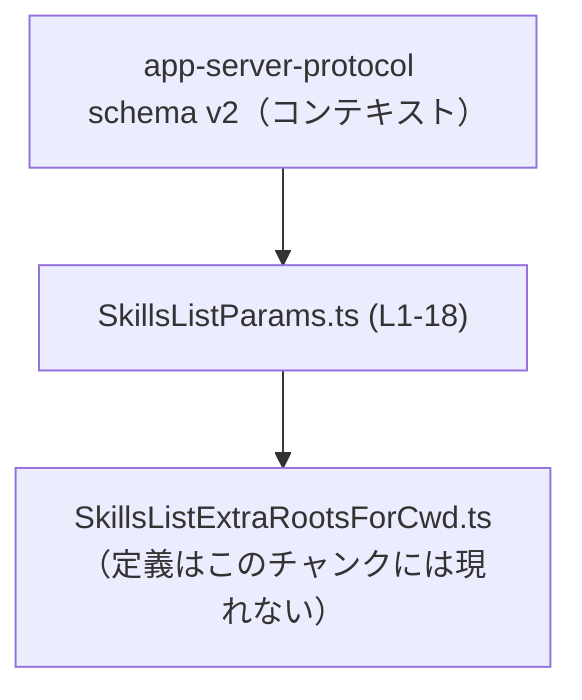
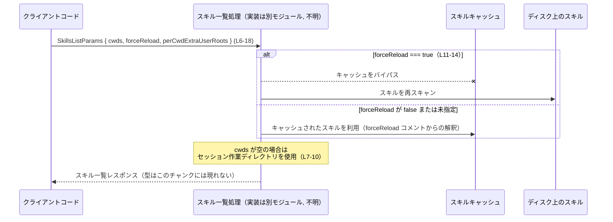

# app-server-protocol\schema\typescript\v2\SkillsListParams.ts

## 0. ざっくり一言

`SkillsListParams` は、スキル一覧を取得する処理に渡すパラメータを表現する TypeScript 型エイリアスです。  
スキャン対象ディレクトリやキャッシュ利用有無などを指定するための、プロトコル用データ構造になっています（`SkillsListParams.ts:L6-18`）。

---

## 1. このモジュールの役割

### 1.1 概要

- このモジュールは、スキル一覧取得処理のための **入力パラメータ** を表現する型を提供します。
- 型名とコメントから、スキル情報をディスクからスキャンし、キャッシュを用いるかどうかを制御するために利用されるパラメータであると読み取れます（`SkillsListParams.ts:L6-18`、`L11-14`）。
- クライアントとサーバー間の **プロトコル・スキーマ** として使われることを意図した、自動生成 TypeScript コードです（`SkillsListParams.ts:L1-3`）。

### 1.2 アーキテクチャ内での位置づけ

- ファイルパスとコメントから、`app-server-protocol` の TypeScript スキーマ（v2）の一部であり、アプリケーションサーバーとクライアント間の通信で共有される型と解釈できます。
- このファイル自身はデータ構造のみを定義し、実際のスキルスキャン処理やキャッシュ処理は別モジュールに実装されます（このチャンクには登場しません）。

依存関係（このチャンクから分かる範囲）を Mermaid で表現します。



### 1.3 設計上のポイント

- **自動生成コード**  
  - 冒頭コメントに「GENERATED CODE! DO NOT MODIFY BY HAND!」とあり、`ts-rs` による自動生成であることが明記されています（`SkillsListParams.ts:L1-3`）。
  - 仕様変更は元の Rust 側定義を変更して再生成する前提になっています。
- **純粋なデータ型**  
  - 関数やメソッドは一切定義されておらず（メタ情報でも `functions=0`）、状態を持たない不変データ構造として使われます（`SkillsListParams.ts:L6-18`）。
- **オプショナルなパラメータ設計**  
  - すべてのプロパティ（`cwds`, `forceReload`, `perCwdExtraUserRoots`）がオプショナル (`?`) であり、呼び出し側が必要なものだけを指定できる設計です（`SkillsListParams.ts:L10`, `L14`, `L18`）。
- **キャッシュ制御フラグ**  
  - `forceReload` により「スキルキャッシュをバイパスしてディスクから再スキャンする」挙動が切り替わることがコメントで示されています（`SkillsListParams.ts:L11-14`）。

---

## 2. 主要な機能一覧

このファイルは型定義のみですが、機能的な観点から整理すると次のようになります。

- スキャン対象ディレクトリ指定: `cwds` プロパティで、スキルをスキャンするカレントディレクトリ候補を配列で指定する（`SkillsListParams.ts:L7-10`）。
- デフォルト動作（セッションカレントディレクトリ）指定: `cwds` が空の場合に、セッションの作業ディレクトリを利用する、という仕様をコメントで明示（`SkillsListParams.ts:L7-9`）。
- キャッシュ利用制御: `forceReload` でスキルキャッシュをバイパスし、ディスクから再スキャンするかどうかを切り替える（`SkillsListParams.ts:L11-14`）。
- CWDごとの追加スキャンルート指定: `perCwdExtraUserRoots` で、各 CWD に対するユーザースコープの追加ルートを指定できる（`SkillsListParams.ts:L15-18`）。

---

## 3. 公開 API と詳細解説

### 3.1 型一覧（構造体・列挙体など）

このチャンクに現れる型・シンボルの一覧です。

| 名前 | 種別 | 役割 / 用途 | 定義箇所 | 備考 |
|------|------|-------------|----------|------|
| `SkillsListParams` | 型エイリアス（オブジェクト型） | スキル一覧取得処理に渡されるパラメータ集合。CWD、キャッシュ制御、追加ルート情報を含む。 | `SkillsListParams.ts:L6-18` | 自動生成 (`ts-rs`)。全プロパティがオプショナル。 |
| `SkillsListExtraRootsForCwd` | 型（詳細不明） | 1つの CWD に対する「ユーザースコープの追加ルート」を表す型。`perCwdExtraUserRoots` 配列の要素型として利用される。 | インポートのみ: `SkillsListParams.ts:L4` | 実際の定義は `./SkillsListExtraRootsForCwd` にあり、このチャンクには現れません。 |

`SkillsListParams` の各プロパティの詳細です。

| プロパティ名 | 型 | 必須/任意 | 説明 | 根拠 |
|--------------|----|-----------|------|------|
| `cwds` | `Array<string>` | 任意（`?`） | スキャン対象となる CWD（カレントワーキングディレクトリ）候補の一覧。コメントによると「空の場合は、現在のセッションの作業ディレクトリがデフォルトとして用いられる」と記述されています。 | 宣言とコメント: `SkillsListParams.ts:L7-10` |
| `forceReload` | `boolean` | 任意 | `true` の場合、スキルキャッシュをバイパスし、スキルをディスクから再スキャンすることがコメントで示されています。`false` または未指定の場合は、通常のキャッシュ利用が行われると解釈できます。 | 宣言とコメント: `SkillsListParams.ts:L11-14` |
| `perCwdExtraUserRoots` | `Array<SkillsListExtraRootsForCwd> \| null` | 任意 | CWD ごとの追加スキャンルートを表す配列。コメントでは「Optional per-cwd extra roots to scan as user-scoped skills」とあり、ユーザースコープのスキルとして扱う追加ルートの定義と読み取れます。`null` も許容される点が特徴です。 | 宣言とコメント: `SkillsListParams.ts:L15-18` |

### 3.2 関数詳細（最大 7 件）

このファイルには関数・メソッドは定義されていません（メタ情報 `functions=0`、コード上でも関数定義は存在しません）。  
そのため、関数詳細テンプレートに基づく解説対象はありません。

### 3.3 その他の関数

- 該当なし（このチャンクには関数やメソッドが一切登場しません）。

---

## 4. データフロー

コメントに基づき、`SkillsListParams` がどのように利用されるかの典型的なデータフローを、概念レベルで示します。実際の API 名や戻り値の型はこのチャンクには登場しないため「不明」と明記します。

### 処理の要点（テキスト）

1. クライアント側コードが、スキル一覧取得のために `SkillsListParams` オブジェクトを構築します（`SkillsListParams.ts:L6-18`）。
2. そのオブジェクトがプロトコルを通してアプリケーションサーバーに送信されます（プロトコルの具体的な実装はこのチャンクには現れません）。
3. サーバー側のスキル一覧処理は:
   - `cwds` が空の場合（未指定または空配列）に、セッションの作業ディレクトリをスキャン対象とする（コメントからの仕様: `SkillsListParams.ts:L7-10`）。
   - `forceReload` が `true` の場合、スキルキャッシュをバイパスしてディスクから再スキャンする（`SkillsListParams.ts:L11-14`）。
   - `perCwdExtraUserRoots` が指定されていれば、CWD ごとの追加ルートもスキャン対象に含める（`SkillsListParams.ts:L15-18`）。
4. スキャン結果（スキル一覧）がクライアントに返却されます（戻り値の型やフィールドはこのチャンクには現れません）。

### シーケンス図（概念）



※ `Server`, `Cache`, `Disk` などは、コメントに現れる「skills cache」「disk」からの概念的な構成要素であり、具体的な型・モジュール名はこのチャンクには現れません。

---

## 5. 使い方（How to Use）

### 5.1 基本的な使用方法

最小限の利用例として、すべてのプロパティを省略してデフォルト動作に任せるパターンです。  
この場合、コメントによると CWD はセッションの作業ディレクトリが使用されます（`SkillsListParams.ts:L7-9`）。

```typescript
// スキル一覧のパラメータ型をインポートする
import type { SkillsListParams } from "./SkillsListParams";          // SkillsListParams.ts を指す

// デフォルト設定でスキル一覧を取得したい場合の例
const params: SkillsListParams = {                                   // すべてのプロパティがオプショナルなので空オブジェクトでも OK
    // cwds を省略 → コメントによると「空の場合はセッション CWD を利用」（L7-10）
    // forceReload も省略 → キャッシュをバイパスしない通常動作と解釈できる（L11-14）
    // perCwdExtraUserRoots も省略 → 追加ルートなし
};

// ここで params を、実際のスキル一覧 API 呼び出しに渡す（API 名はこのチャンクには現れない）
// const skills = await listSkills(params);
```

### 5.2 よくある使用パターン

#### 複数 CWD を明示してスキャンする

```typescript
import type { SkillsListParams } from "./SkillsListParams";

const params: SkillsListParams = {
    cwds: [                                                     // スキャン対象CWDを明示的に指定（L10）
        "/workspace/project-a",                                 // 1つ目の CWD
        "/workspace/project-b",                                 // 2つ目の CWD
    ],
    forceReload: false,                                         // キャッシュを利用（forceReload コメント L11-14 からの解釈）
};
```

#### キャッシュをバイパスしてフルスキャンする

```typescript
import type { SkillsListParams } from "./SkillsListParams";

const params: SkillsListParams = {
    cwds: ["/workspace/project-a"],                             // 対象 CWD を 1 つ指定
    forceReload: true,                                          // キャッシュをバイパスしディスクから再スキャン（L11-14）
    perCwdExtraUserRoots: [],                                   // 追加ルートはなし（空配列も許容される型：L18）
};
```

#### CWD ごとの追加ルートを指定する（型だけを利用する例）

`SkillsListExtraRootsForCwd` の具体的な形はこのチャンクには登場しないため、値の構築自体はここでは抽象的に示します。

```typescript
import type { SkillsListParams } from "./SkillsListParams";
import type { SkillsListExtraRootsForCwd } from "./SkillsListExtraRootsForCwd";

const extra: SkillsListExtraRootsForCwd[] = [
    // ここで SkillsListExtraRootsForCwd 型に従ったオブジェクトを構築する
    // （具体的なフィールドは別ファイルに定義され、このチャンクからは分からない）
];

const params: SkillsListParams = {
    cwds: ["/workspace/project-a"],
    perCwdExtraUserRoots: extra,                                // CWD ごとの追加ルートを指定（L15-18）
};
```

### 5.3 よくある間違い

この型を利用する際に起こりやすい誤用パターンと、その修正例です。

```typescript
import type { SkillsListParams } from "./SkillsListParams";

declare const params: SkillsListParams;

// 誤り例（strictNullChecks を有効と仮定）:
// cwds はオプショナルなので undefined かもしれないが、直接 map を呼んでいる
// const normalized = params.cwds.map(path => path.trim());

// 正しい例: デフォルト値を用意してから利用する
const normalized = (params.cwds ?? [])                          // cwds が undefined の場合は空配列を使う
    .map(path => path.trim());
```

```typescript
// perCwdExtraUserRoots は「undefined」「null」「配列」の3通りになりうる（L18）
declare const params: SkillsListParams;

// 誤り例:
// null の可能性を考慮していない
// const extraCount = params.perCwdExtraUserRoots.length;

// 正しい例: null と undefined の両方を考慮する
const extraRoots = params.perCwdExtraUserRoots ?? [];           // null/undefined の場合は空配列にフォールバック
const extraCount = extraRoots.length;
```

### 5.4 使用上の注意点（まとめ）

- **オプショナルプロパティの扱い**  
  すべてのプロパティがオプショナル (`?`) であり、`undefined` を取り得ます（`SkillsListParams.ts:L10`, `L14`, `L18`）。  
  利用側では `??`（Null 合体演算子）やオプショナルチェーンを使うなどして、`undefined` を必ず考慮する必要があります。
- **`perCwdExtraUserRoots` の `null` 取り得る点**  
  型として `Array<SkillsListExtraRootsForCwd> \| null` を許容しており（`SkillsListParams.ts:L18`）、`undefined` と `null` の二種類の「無」を取り得ます。両者を区別するか、`??` でまとめて扱うかを明確にする必要があります。
- **キャッシュバイパスのコスト**  
  `forceReload: true` はキャッシュをバイパスしてディスクから再スキャンすることを意味します（`SkillsListParams.ts:L11-14`）。  
  大量のスキルや遅いストレージ環境では、パフォーマンス上のコストが高くなる可能性があります。
- **TypeScript の型安全性と実行時の乖離**  
  この型はコンパイル時のチェックを提供しますが、JSON など外部入力から生成されたオブジェクトは実行時に型違反を含む可能性があります。実行時バリデーションの有無はこのチャンクからは分かりません。

---

## 6. 変更の仕方（How to Modify）

### 6.1 新しい機能を追加する場合

このファイルは `ts-rs` による自動生成ファイルであり、「手で編集しないこと」が明示されています（`SkillsListParams.ts:L1-3`）。そのため、ここに直接コードを追加するのは適切ではありません。

一般的な変更の入口（このチャンクから分かる範囲）は次のとおりです。

1. Rust 側の元定義を変更する  
   - `ts-rs` は通常、Rust の `struct` や `enum` に `#[ts(export)]` などの属性を付けて TypeScript を生成します。  
   - `SkillsListParams` に対応する Rust の型定義の場所や名前はこのチャンクには現れませんが、そちらを変更するのが正しい経路になります。
2. `ts-rs` で TypeScript を再生成する  
   - 元定義を変更した後、コード生成プロセスを再実行して `SkillsListParams.ts` を再生成します。

### 6.2 既存の機能を変更する場合

`SkillsListParams` の意味や契約を変更する場合も、同様に元となる Rust 側定義を変更する必要があります。

変更時に意識すべきポイント（このチャンクから読み取れる範囲）は次のとおりです。

- **後方互換性**  
  - `cwds` が空のときに「セッション作業ディレクトリにフォールバックする」という仕様（`SkillsListParams.ts:L7-9`）や、`forceReload` がキャッシュバイパスを意味する仕様（`SkillsListParams.ts:L11-14`）は、既存クライアントに依存されている可能性があります。
- **null と undefined の扱い**  
  - `perCwdExtraUserRoots` に `null` を許容している点（`SkillsListParams.ts:L18`）は、プロトコル上の約束事になっている可能性があります。単純に `Array<...>` のみに変更すると、古いクライアントとの互換性に影響が出るおそれがあります。
- **利用箇所の再確認**  
  - 実際に `SkillsListParams` を利用している箇所（サーバー側のスキル一覧処理、クライアント側の呼び出しコードなど）はこのチャンクには登場しないため、別途コードベース全体での参照を検索し、影響範囲を確認する必要があります。

---

## 7. 関連ファイル

このモジュールと密接に関係するファイル・コンポーネント（このチャンクから分かる範囲）です。

| パス / 名称 | 役割 / 関係 |
|------------|------------|
| `app-server-protocol\schema\typescript\v2\SkillsListExtraRootsForCwd.ts` | `import type { SkillsListExtraRootsForCwd } from "./SkillsListExtraRootsForCwd";` により参照される型の定義ファイルです（`SkillsListParams.ts:L4`）。`perCwdExtraUserRoots` プロパティの要素型として利用されます。 |
| Rust 側の `SkillsListParams` 相当の型（ファイルパス不明） | 冒頭コメントにあるように、この TypeScript ファイルを生成するための Rust 定義が存在します（`SkillsListParams.ts:L1-3`）。プロトコルスキーマの元定義として位置づけられます。 |
| スキル一覧取得 API 実装（モジュール名・パス不明） | `SkillsListParams` を引数として受け取り、実際に「skills cache」や「disk」からスキルをスキャンする処理を実装するモジュールです。コメントからその存在が推測できますが、具体的なファイルはこのチャンクには現れません。 |

---

### 言語固有の安全性・エラー・並行性について（この型に関する補足）

- **型安全性（TypeScript）**  
  - `SkillsListParams` はコンパイル時の型チェックを提供し、不正なプロパティ名や型違い（例: `forceReload: "true"`）を検出できます（`boolean` 型指定: `SkillsListParams.ts:L14`）。
  - ただし、実行時に受け取る JSON などがこの型に合致しているかどうかは別問題であり、実行時バリデーションの有無はこのチャンクからは分かりません。
- **エラー条件**  
  - このファイル自体にはエラー処理ロジックはありませんが、`forceReload: true` により高頻度のディスクアクセスが発生した場合、別モジュールで I/O エラーやタイムアウトが発生する可能性があります。これはこの型に付随する意味上の注意点です。
- **並行性**  
  - `SkillsListParams` は不変なデータオブジェクトとして利用される想定のため、この型自体には並行性に関する制約や危険性はありません。  
  - 並列に複数のスキャン処理を走らせた場合の挙動（キャッシュの同時更新など）は、別モジュールの実装に依存し、このチャンクからは判定できません。
