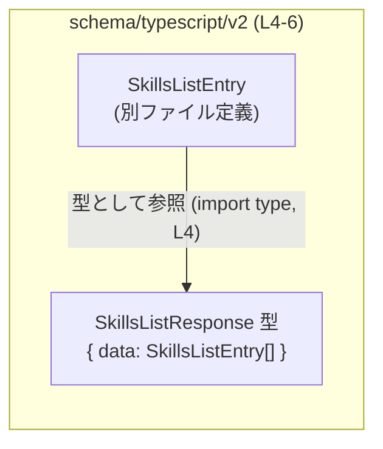
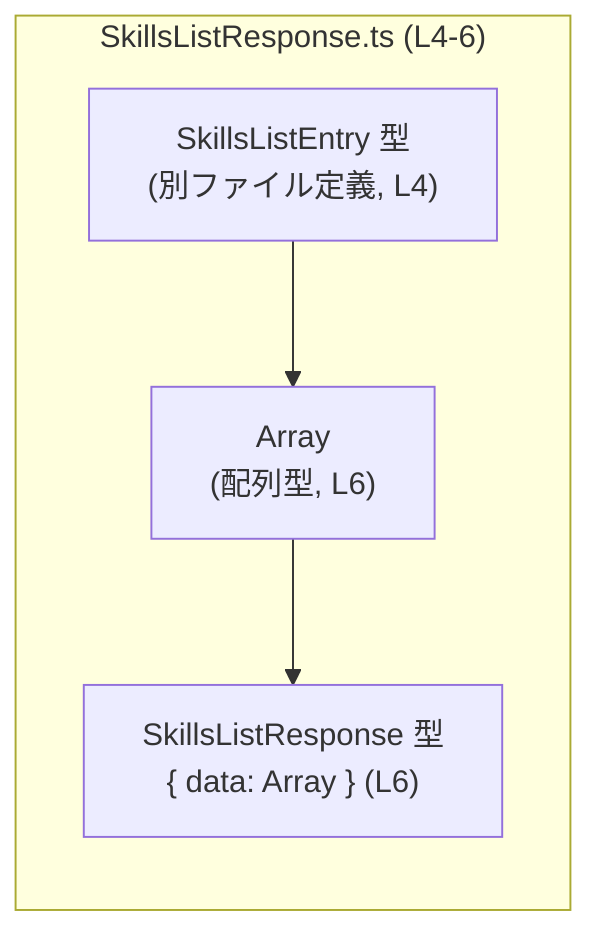

# app-server-protocol/schema/typescript/v2/SkillsListResponse.ts コード解説

## 0. ざっくり一言

`SkillsListResponse` は、`SkillsListEntry` の配列を `data` プロパティにまとめたレスポンス用の TypeScript 型エイリアスです（型レベル定義のみで、実行時ロジックはありません）。  
このファイルは `ts-rs` によって自動生成されるため、手動編集は想定されていません。

---

## 1. このモジュールの役割

### 1.1 概要

- このモジュールは、スキル一覧を表す `SkillsListEntry` 型の配列をまとめたレスポンス構造 `SkillsListResponse` を定義します。
- 型は TypeScript の型エイリアスとして提供され、コンパイル時の型チェックに利用されます。
- ファイル先頭コメントから、この定義は `ts-rs` により自動生成されていることが分かります（`// GENERATED CODE! DO NOT MODIFY BY HAND!` および `This file was generated by [ts-rs]`、`app-server-protocol/schema/typescript/v2/SkillsListResponse.ts:L1-3`）。

### 1.2 アーキテクチャ内での位置づけ

- `SkillsListResponse` は、このディレクトリ内の `SkillsListEntry` 型に依存しています（`import type { SkillsListEntry } from "./SkillsListEntry";`、`L4`）。
- `import type` を使っているため、依存は型レベルのみであり、実行時のモジュール依存は発生しません（型情報だけがコンパイラに伝わり、バンドルには影響しない）。

依存関係を簡易的に図示すると次のようになります。



※ この図は本ファイル `SkillsListResponse.ts (L4-6)` に現れる依存関係のみを表現しています。他モジュールからの利用関係はこのチャンクには現れないため不明です。

### 1.3 設計上のポイント

コードから読み取れる特徴は次のとおりです。

- **自動生成コードであること**  
  - 冒頭コメントにより、`ts-rs` による自動生成ファイルであり、手動変更禁止であることが明示されています（`L1-3`）。
- **型レベル専用モジュール**  
  - `import type` を使用し、かつ関数やクラスなど実行時に影響する要素が一切ないため、TypeScript の型チェック専用モジュールとなっています（`L4-6`）。
- **シンプルなコンテナ型**  
  - `SkillsListResponse` は `data` プロパティ 1 つだけを持つオブジェクト型として定義されており（`L6`）、レスポンスボディ（あるいは類似のデータ構造）を表すシンプルなコンテナになっています。

---

## 2. 主要な機能一覧

このモジュールは実行時の「機能」を持たず、型レベルの定義のみを提供します。主要な提供内容は次の 1 点です。

- `SkillsListResponse` 型: `data` プロパティに `SkillsListEntry` の配列を保持するレスポンス構造の型エイリアス（`L6`）。

---

## 3. 公開 API と詳細解説

### 3.1 型一覧（構造体・列挙体など）

このファイルで直接定義・公開されている型および、型レベルで依存している外部コンポーネントの一覧です。

| 名前 | 種別 | 役割 / 用途 | 根拠 |
|------|------|-------------|------|
| `SkillsListResponse` | 型エイリアス（オブジェクト型） | `data` プロパティに `SkillsListEntry` の配列を保持するレスポンス用の型。`{ data: Array<SkillsListEntry> }` という構造を持つ。 | `app-server-protocol/schema/typescript/v2/SkillsListResponse.ts:L6-6` |
| `SkillsListEntry` | 型（別ファイル定義、型インポート） | 各スキル項目（エントリ）を表す型。`SkillsListResponse.data` 配列の要素型として使用される。具体的なフィールドはこのチャンクには現れない。 | `app-server-protocol/schema/typescript/v2/SkillsListResponse.ts:L4-4` |

#### `SkillsListResponse` の構造（詳細）

`SkillsListResponse` は次のように定義されています。

```typescript
// app-server-protocol/schema/typescript/v2/SkillsListResponse.ts:L6
export type SkillsListResponse = { data: Array<SkillsListEntry>, };
```

- オブジェクトの必須プロパティ:
  - `data`: `Array<SkillsListEntry>`（`SkillsListEntry[]` と同義）
- `data` プロパティは **必須** であり、`undefined` や `null` は型として許されません。
- 配列の長さに制約はなく、空配列 `[]` も型的には許容されます。

### 3.2 関数詳細（最大 7 件）

本ファイルには関数・メソッド・クラスコンストラクタなど、実行時に呼び出される関数的要素は定義されていません。  
そのため、このセクションで詳細解説すべき関数はありません。

### 3.3 その他の関数

- 本ファイルには補助的な関数やラッパー関数も存在しません。

---

## 4. データフロー

### 4.1 型レベルでのデータ構造の流れ

このファイル内で観察できるデータの流れは、「スキルエントリ型（`SkillsListEntry`）が配列として `SkillsListResponse.data` に格納される」という構造上の関係です。

- 各スキル項目は `SkillsListEntry` 型で表現される（定義は別ファイル、`L4`）。
- それらが `Array<SkillsListEntry>` として配列化され、`SkillsListResponse` の `data` プロパティに格納される（`L6`）。

これを型レベルのデータフローとして図示します。



※ 実際にこの型がどの API エンドポイントや関数から返されるか、あるいはどのようにシリアライズ／デシリアライズされるかは、このチャンクには現れないため不明です。

---

## 5. 使い方（How to Use）

### 5.1 基本的な使用方法

`SkillsListResponse` を利用する典型的なパターンは、`SkillsListEntry` の配列をまとめて返す型注釈に使うことです。  
`SkillsListEntry` の中身はこのファイルからは分からないため、例では型アサーションを用いています。

```typescript
// app-server-protocol/schema/typescript/v2/SkillsListResponse.ts をインポートする想定
import type { SkillsListResponse } from "./SkillsListResponse";
import type { SkillsListEntry } from "./SkillsListEntry";

// SkillsListEntry 配列を何らかの方法で取得したと仮定
const entries: SkillsListEntry[] = [] as SkillsListEntry[]; // 実際は適切に構築する

// SkillsListResponse 型の値を構築する
const response: SkillsListResponse = {
    data: entries, // data に SkillsListEntry[] をセット（L6 の定義に一致）
};

// response.data は SkillsListEntry[] として安全に扱える
response.data.forEach((entry) => {
    // entry は SkillsListEntry 型として型チェックされる
});
```

このように、`SkillsListResponse` は「`data` プロパティにスキルエントリ配列を持つオブジェクト」であることをコンパイル時に保証します。

### 5.2 よくある使用パターン

このファイル単体から具体的な API は分かりませんが、型構造から想定される一般的なパターンを挙げます（あくまで利用例であり、このチャンクに現れる事実ではありません）。

1. **API クライアントの戻り値として使用**

```typescript
import type { SkillsListResponse } from "./SkillsListResponse";

async function fetchSkills(): Promise<SkillsListResponse> {
    const res = await fetch("/api/skills");
    const json = await res.json();
    // 実際には runtime のバリデーションが必要だが、型としては次のように扱うことを意図
    return json as SkillsListResponse;
}
```

1. **状態管理ストアの型として利用**

```typescript
import type { SkillsListResponse } from "./SkillsListResponse";

interface SkillsState {
    skillsResponse: SkillsListResponse | null;
}

const state: SkillsState = {
    skillsResponse: null,
};
```

※ 上記 2 例は「この型がどう使われうるか」の例であり、具体的なエンドポイント名や URL はコードからは分からないため仮のものです。

### 5.3 よくある間違い

`SkillsListResponse` の構造から想定される誤用例と正しい例を示します。

```typescript
import type { SkillsListResponse, SkillsListEntry } from "./SkillsListResponse";

// ❌ 間違い例: 配列だけを返してしまう
function wrong(): SkillsListResponse {
    const entries: SkillsListEntry[] = [] as SkillsListEntry[];
    // return entries; // コンパイルエラー: SkillsListResponse 型は { data: SkillsListEntry[] } を要求
    return { data: entries }; // ✅ 正しい
}

// ❌ 間違い例: プロパティ名のタイプミス
const badResponse: SkillsListResponse = {
    // datas: [] as SkillsListEntry[], // エラー: 'datas' プロパティは存在しない
    data: [] as SkillsListEntry[],     // ✅ 正しい
};
```

### 5.4 使用上の注意点（まとめ）

- **手動変更禁止**  
  - ファイル先頭コメントにあるとおり、このファイルは `ts-rs` による自動生成であり、手で編集すると再生成時に上書きされるか、Rust 側との不整合を招きます（`L1-3`）。
- **型情報のみで実行時保証はない**  
  - TypeScript の型はコンパイル時のみ有効であり、実行時には消えるため、外部から取得した JSON などを `SkillsListResponse` として扱う場合は、別途ランタイムバリデーションが必要です。
- **`data` は必須で null 不可**  
  - 型定義上 `data` はオプショナルではなく `null` や `undefined` も許されません。そうなりうる場合は `SkillsListResponse | null` などのユニオン型で表現する必要があります。
- **並行性・スレッド安全性について**  
  - 本ファイルは純粋な型定義のみであり、共有ミュータブル状態や非同期処理を含みません。そのため、TypeScript レベルでは特別な並行性上の懸念はありません。

---

## 6. 変更の仕方（How to Modify）

### 6.1 新しい機能を追加する場合

このファイルは自動生成されるため、「このファイルを直接編集して機能を追加する」ことは推奨されません（`L1-3`）。

一般的な変更手順は次のようになります（ts-rs を前提とした外部情報に基づく一般的な流れであり、このチャンク単体からは詳細な設定は分かりません）。

1. **元の Rust 側定義を変更する**  
   - `SkillsListResponse` に対応する Rust の構造体／型定義（例: `struct SkillsListResponse { data: Vec<SkillsListEntry> }` のようなもの）が存在するはずです（これは `ts-rs` の典型的な利用方法に基づく推測です）。
   - 新しいフィールドを追加する場合は、その Rust 側にフィールドを追加します。
2. **ts-rs によるコード生成を再実行する**  
   - ビルドスクリプトやコード生成コマンドを通じて、TypeScript 側の型定義を再生成します。
3. **TypeScript 側の利用箇所を更新する**  
   - 追加されたフィールドを利用するコードに型エラーが出ないか確認し、必要に応じて参照を追加します。

### 6.2 既存の機能を変更する場合

`SkillsListResponse` の構造を変更する際に注意すべき点です。

- **影響範囲の確認**  
  - `SkillsListResponse` を型として参照している関数・コンポーネント・API クライアントなどを全て検索し、影響範囲を把握する必要があります。  
    本チャンクには利用箇所が現れないため、どこで使われているかは不明です。
- **契約（contract）の維持**  
  - 現在の契約は「`data` プロパティに `SkillsListEntry[]` が入っていること」です（`L6`）。  
    - プロパティ名を変更すると、既存クライアントはすべて壊れます。
    - 配列を非配列（例: 単一要素）に変更すると、同様に互換性が失われます。
- **自動生成ファイルであることの確認**  
  - 変更はあくまで生成元（Rust など）側で行い、TypeScript ファイルは生成に任せることが安全です。
- **テストの重要性**  
  - 型構造が変わると、JSON シリアライズ／デシリアライズ、API レスポンス、フロントエンドのレンダリングロジックなどに影響が出る可能性があります。  
    対応するテストが存在する場合は更新・追加する必要がありますが、このチャンクにはテストコードは現れません。

---

## 7. 関連ファイル

このモジュールと直接・間接に関係することがこのチャンクから読み取れるファイルを列挙します。

| パス | 役割 / 関係 |
|------|-------------|
| `app-server-protocol/schema/typescript/v2/SkillsListEntry.ts`（推定） | 本ファイルから `import type { SkillsListEntry } from "./SkillsListEntry";` により参照される型定義ファイルです（`L4`）。各スキルエントリの構造がここで定義されていると考えられますが、このチャンクにはその内容は現れません。 |
| Rust 側の対応する型定義ファイル（パス不明） | ファイル先頭コメントにある `ts-rs` による生成であることから、元となる Rust 型定義ファイルが存在するはずですが、このチャンクから具体的なパスや内容は分かりません。 |

---

### Bugs / Security / Contracts / Edge Cases / Tests / Performance についての補足

- **Bugs（バグ）**  
  - 本ファイルは型定義のみでロジックを持たないため、直接的な実行時バグはありません。  
    ただし、生成元の Rust 型と TypeScript 型の不整合があれば、型が実際のデータ構造を正しく表さないという意味で「仕様バグ」になりえます。
- **Security（セキュリティ）**  
  - この型自体はセキュリティ機能を持ちません。外部入力（API レスポンスなど）を `SkillsListResponse` とみなす際は、実データの検証を行わないと任意の構造が紛れ込む可能性があります。
- **Contracts（契約）**  
  - `data` は必須で `SkillsListEntry[]` 型であること（`L6`）。
- **Edge Cases（エッジケース）**  
  - `data: []`（空配列）は型として許容されます。  
  - `data` プロパティが存在しない／`null`／`undefined` の値は型的には許容されません。
- **Tests（テスト）**  
  - このファイル内にはテストコードは存在しません。この型を利用するロジック側（API 実装や UI コンポーネント）でのテストが必要です。
- **Performance / Scalability**  
  - 型定義のみであり、実行時にオーバーヘッドを追加することはありません。配列のサイズや処理負荷は、この型を利用するロジック側の設計に依存します。

以上のように、`SkillsListResponse.ts` は非常に小さな自動生成型定義ファイルですが、API 契約を表現する重要な一部分として機能します。
