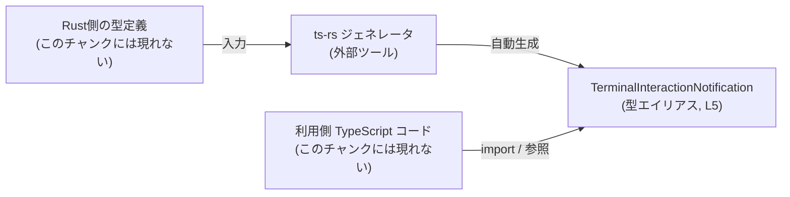
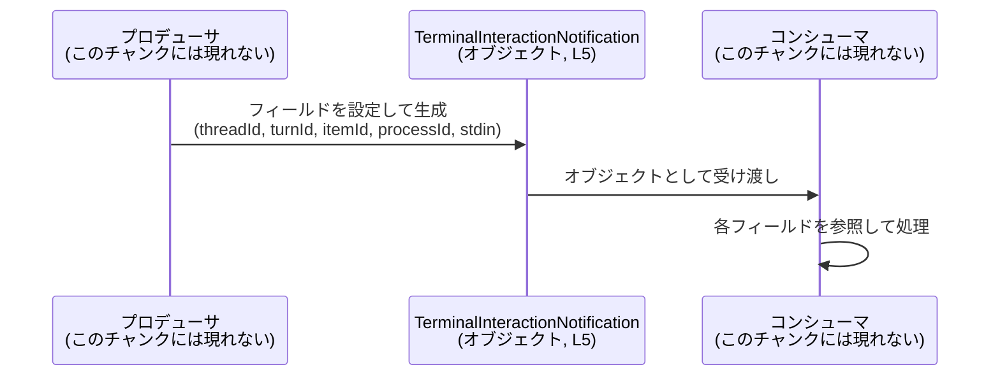

# app-server-protocol/schema/typescript/v2/TerminalInteractionNotification.ts

## 0. ざっくり一言

- `TerminalInteractionNotification` という **通知ペイロードの形** を表す TypeScript の型エイリアスを 1 つだけ定義した、自動生成ファイルです（`TerminalInteractionNotification.ts:L1-3, L5-5`）。

---

## 1. このモジュールの役割

### 1.1 概要

- このモジュールは、アプリケーションサーバープロトコルの一部として使われると考えられる、`TerminalInteractionNotification` 型を定義します。
- 型は 5 つの必須プロパティ（`threadId`, `turnId`, `itemId`, `processId`, `stdin`）をすべて `string` 型として持ちます（`TerminalInteractionNotification.ts:L5-5`）。
- ファイル先頭のコメントから、この型定義は `ts-rs` によって自動生成されており、手で編集してはいけないことが明示されています（`TerminalInteractionNotification.ts:L1-3`）。

### 1.2 アーキテクチャ内での位置づけ

コメントとファイルパスから、このファイルは「Rust 側の定義 → `ts-rs` による自動生成 → TypeScript から利用」という流れの一部であることが分かります。

- Rust 側の型定義（このチャンクには現れません）
- `ts-rs` による TypeScript 型生成（`TerminalInteractionNotification.ts:L3`）
- 生成された `TerminalInteractionNotification` 型を、アプリケーションやクライアントコードが参照（このチャンクには現れません）

この関係を簡略図で表すと、次のようになります。



※ Rust 側の具体的な型名や利用側コードの詳細は、このチャンクには現れません。

### 1.3 設計上のポイント

- **自動生成コード**  
  - 行コメントにより「GENERATED CODE」「Do not edit this file manually」と明記されています（`TerminalInteractionNotification.ts:L1-3`）。
  - 設計上、手動で編集せず、元となる定義（Rust 側）を変更して再生成する前提になっています。
- **純粋な型定義のみ**  
  - `export type ... = { ... }` という構造のみで、関数やクラス、実行時ロジックは一切含まれていません（`TerminalInteractionNotification.ts:L5-5`）。
- **必須プロパティのみで構成**  
  - 5 つのプロパティはいずれも `string` 型で、`?`（オプショナル）指定はありません（`TerminalInteractionNotification.ts:L5-5`）。  
    つまり TypeScript 上の契約として「5 つすべてのキーが存在し、値は `string`」という前提になります。
- **エラーハンドリング・並行性はこのファイルには存在しない**  
  - 型定義のみのため、このファイル単体にはエラーハンドリングやスレッド安全性に関する処理はありません。  
    それらは、この型を利用する側のコードに委ねられます。

---

## 2. 主要な機能一覧

このモジュールが提供する機能は 1 つです。

- `TerminalInteractionNotification` 型定義:  
  ターミナル相互作用通知オブジェクトのプロパティ構造（5 つの `string` プロパティ）を表現する TypeScript 型エイリアスです（`TerminalInteractionNotification.ts:L5-5`）。

---

## 3. 公開 API と詳細解説

### 3.1 型一覧（構造体・列挙体など）

このファイルに登場する公開型は次の 1 つです。

| 名前                             | 種別          | 役割 / 用途                                                                                     | 定義場所                                   |
|----------------------------------|---------------|--------------------------------------------------------------------------------------------------|--------------------------------------------|
| `TerminalInteractionNotification` | 型エイリアス  | ターミナル相互作用に関する通知メッセージのペイロード構造を表すオブジェクト型（5 つの `string` フィールドを持つ） | `TerminalInteractionNotification.ts:L5-5` |

#### フィールド一覧

`TerminalInteractionNotification` は次のフィールドを持つオブジェクト型です（`TerminalInteractionNotification.ts:L5-5`）。

| フィールド名 | 型      | 必須/任意 | 説明（型から分かること）                                         |
|--------------|---------|-----------|------------------------------------------------------------------|
| `threadId`   | `string`| 必須      | 文字列 ID。用途はこのチャンクからは分かりません。               |
| `turnId`     | `string`| 必須      | 文字列 ID。用途はこのチャンクからは分かりません。               |
| `itemId`     | `string`| 必須      | 文字列 ID。用途はこのチャンクからは分かりません。               |
| `processId`  | `string`| 必須      | 文字列 ID。用途はこのチャンクからは分かりません。               |
| `stdin`      | `string`| 必須      | 文字列データ。内容やフォーマットはこのチャンクからは分かりません。|

> 用途や意味論（「何を表す ID なのか」「stdin の内容」など）は、フィールド名から推測はできますが、このチャンクのコードだけからは確定できないため、「不明」としています。

### 3.2 関数詳細（最大 7 件）

このファイルには関数定義が存在しません（`TerminalInteractionNotification.ts:L1-5` に `function` / `=>` などの関数定義構文は現れません）。

したがって、詳細な関数解説の対象はありません。

### 3.3 その他の関数

- 補助関数やラッパー関数も、このチャンクには一切登場しません。

| 関数名 | 役割（1 行） |
|--------|--------------|
| なし   | このファイルには関数定義がありません |

---

## 4. データフロー

このファイルは型定義のみを提供し、実際の送受信や処理ロジックは含みません。そのため、ここでは **一般的な利用イメージ** として、「`TerminalInteractionNotification` 型の値がどのように受け渡されるか」の典型パターンを示します。

### 4.1 代表的な利用シナリオ（概念レベル）

1. あるコンポーネント（プロデューサ）が、ターミナル相互作用に関する情報を収集し、`TerminalInteractionNotification` 型のオブジェクトを構築する。
2. そのオブジェクトが別のコンポーネント（コンシューマ）に渡される（関数引数、メッセージング、API レスポンスなどの形）。
3. コンシューマ側は、型に従って `threadId` や `stdin` などのプロパティを参照して処理を行う。

これをシーケンス図で表すと、次のようになります。



> 実際にどのような関数・クラス・モジュールがプロデューサ/コンシューマになるかは、このチャンクには現れません。

---

## 5. 使い方（How to Use）

### 5.1 基本的な使用方法

`TerminalInteractionNotification` は **オブジェクトの形を表す型** なので、典型的な使い方は「関数やメソッドの引数・戻り値の型として用いる」「オブジェクトリテラルの型注釈に使う」ことです。

以下は、この型を受け取ってプロパティを参照する基本的な例です。

```typescript
// TerminalInteractionNotification 型をインポートする
import type { TerminalInteractionNotification } from "./TerminalInteractionNotification"; // このファイル自身を想定

// 通知を受け取って処理する関数の例
function handleNotification(notification: TerminalInteractionNotification): void {
    // 各プロパティは string 型として扱える
    const threadId = notification.threadId;  // string 型
    const turnId   = notification.turnId;    // string 型
    const itemId   = notification.itemId;    // string 型
    const processId = notification.processId; // string 型
    const stdin    = notification.stdin;     // string 型

    // ここで必要な処理を行う（ログ出力、状態更新など）
    console.log("threadId:", threadId);
    console.log("stdin:", stdin);
}

// TerminalInteractionNotification 型のオブジェクトを生成する例
const exampleNotification: TerminalInteractionNotification = {
    threadId:  "thread-1",  // string であればよい
    turnId:    "turn-1",
    itemId:    "item-1",
    processId: "process-1",
    stdin:     "user input here",
};

// 生成した通知を関数に渡す
handleNotification(exampleNotification);
```

このコードから分かること:

- `TerminalInteractionNotification` 型により、`threadId` などの必須プロパティを**漏れなく**指定することがコンパイル時に要求されます。
- 全フィールドが `string` 型なので、数値などを渡そうとするとコンパイルエラーになります（TypeScript の型チェックが有効な場合）。

### 5.2 よくある使用パターン

1. **受信データの型付け**

   ネットワークやメッセージキューから受信した JSON をこの型として扱う例です。  
   ※ 実際の JSON パースやバリデーションは別途必要です（このファイルには含まれません）。

   ```typescript
   import type { TerminalInteractionNotification } from "./TerminalInteractionNotification";

   // 未知の JSON をパースした後に、アサーションで型付けする例
   const raw: unknown = JSON.parse(receivedJsonString);

   // 実運用ではランタイムバリデーションが必要だが、ここでは型アサーションのみを行っている
   const notification = raw as TerminalInteractionNotification;

   // 以降は notification.threadId などを型安全に扱える（コンパイル時の話）
   ```

2. **送信データの型付け**

   API やメッセージングに送信するデータをこの型で表現する例です。

   ```typescript
   import type { TerminalInteractionNotification } from "./TerminalInteractionNotification";

   function buildNotificationPayload(): TerminalInteractionNotification {
       return {
           threadId:  "thread-123",
           turnId:    "turn-5",
           itemId:    "item-42",
           processId: "proc-9999",
           stdin:     "ls -la",
       };
   }

   const payload = buildNotificationPayload();
   // payload をそのまま JSON 化して送信するなどの処理を行う
   ```

### 5.3 よくある間違い

この型に関連して起こりやすい誤用例と、その修正例を挙げます。

```typescript
import type { TerminalInteractionNotification } from "./TerminalInteractionNotification";

// 間違い例 1: 必須フィールドを省略している
const badNotification1: TerminalInteractionNotification = {
    threadId: "thread-1",
    // turnId がない
    itemId: "item-1",
    processId: "process-1",
    stdin: "input",
    // -> TypeScript の型チェックが有効ならコンパイルエラー
};

// 正しい例: すべての必須フィールドを指定する
const okNotification1: TerminalInteractionNotification = {
    threadId: "thread-1",
    turnId:   "turn-1",
    itemId:   "item-1",
    processId:"process-1",
    stdin:    "input",
};


// 間違い例 2: 型アサーションの乱用でランタイム不整合を見逃す
const raw: unknown = {}; // 実際にはフィールドがないオブジェクト

const badNotification2 = raw as TerminalInteractionNotification;
// コンパイルは通るが、実行時には threadId などが undefined になりうる

// より安全な例: ランタイムチェックを挟む（擬似コード）
function isTerminalInteractionNotification(
    value: any
): value is TerminalInteractionNotification {
    // ここで各フィールドが string かどうかをチェックするロジックを実装する
    // （このチャンクには実装は現れません）
    return (
        value &&
        typeof value.threadId === "string" &&
        typeof value.turnId === "string" &&
        typeof value.itemId === "string" &&
        typeof value.processId === "string" &&
        typeof value.stdin === "string"
    );
}

if (isTerminalInteractionNotification(raw)) {
    // ここでは型が保証されている
}
```

### 5.4 使用上の注意点（まとめ）

- **コンパイル時とランタイムの差**  
  - TypeScript の型はコンパイル時のみ有効です。  
    受信した生の JSON を即座に `as TerminalInteractionNotification` すると、ランタイムでは `undefined` が混入していても検知できません。
- **全フィールドが必須であること**  
  - `?` 修飾子がないため、5 つすべてのプロパティが必須です（`TerminalInteractionNotification.ts:L5-5`）。
- **すべて `string` 型であること**  
  - 数値 ID 等を扱いたくなった場合も、TypeScript 上は `string` として扱う契約になっています。  
    変換を行う場合は利用側コードで対応する必要があります。
- **スレッド安全性・並行性**  
  - このファイルは型定義のみで状態を持たないため、並行アクセスに起因する問題は直接は発生しません。  
    ただし、この型のインスタンスをどのように共有するかは利用側（別ファイル）の責任です。
- **セキュリティ（入力検証）**  
  - 外部から渡されるデータをこの型として扱う場合、実行時にスキーマ検証やサニタイズを行わないと、想定外の値が紛れ込む可能性があります。  
    このファイル自体には入力検証ロジックは含まれていません。

---

## 6. 変更の仕方（How to Modify）

### 6.1 新しい機能を追加する場合

ファイル先頭のコメントにより、このファイルは **手動で編集すべきでない** ことが明示されています（`TerminalInteractionNotification.ts:L1-3`）。

- 新しいフィールドを追加したい場合や、型を拡張したい場合は:
  - **このファイルではなく**、`ts-rs` の入力側となる Rust の型定義を変更し、
  - その後、`ts-rs` を再実行して TypeScript 側を再生成する、というフローになります。
- 具体的な Rust 側のファイルや型名は、このチャンクからは分かりません。

### 6.2 既存の機能を変更する場合

`TerminalInteractionNotification` 型の構造を変更する場合も同様です。

- 例: `stdin` の型を `string` から別の型に変更したい場合
  - このファイルを直接書き換えるのではなく、
  - Rust 側の対応するフィールドの型を変更し、
  - `ts-rs` による再生成によってこのファイルが更新されることが期待されます。
- 変更時の注意点:
  - 一つのフィールド名・型を変更すると、そのフィールドを参照している全ての TypeScript コードに影響します。
  - 特に、文字列 ID をキーとして扱っている箇所などは、影響範囲が広くなる可能性がありますが、その詳細はこのチャンクには現れません。
  - 変更後は、型エラーを確認しながら利用側コードを修正する必要があります。

---

## 7. 関連ファイル

このチャンクから確実に分かるファイルは、対象そのものだけです。他ファイルとの import/export 関係や依存関係は、このチャンクには現れません。

| パス                                                         | 役割 / 関係                                                                                               |
|--------------------------------------------------------------|----------------------------------------------------------------------------------------------------------|
| `app-server-protocol/schema/typescript/v2/TerminalInteractionNotification.ts` | 本レポート対象。`ts-rs` によって自動生成された `TerminalInteractionNotification` 型の定義を提供する（`TerminalInteractionNotification.ts:L1-5`）。 |

- 同一ディレクトリ内に他のスキーマ定義ファイルが存在する可能性はありますが、このチャンクには現れないため、具体的なパスや関係は「不明」とします。

---

## Bugs / Security / Contracts / Edge Cases / Tests / Performance 概観

このファイルは非常に小さい型定義のみで構成されるため、まとめて概観します。

- **Bugs（バグ）**  
  - 実行時ロジックがないため、このファイル単体に起因する実行時バグは存在しません。
  - 型情報と実際のデータの不整合（例: ランタイムで `undefined` が入る）は、利用側コードの問題として発生しうるため注意が必要です。
- **Security（セキュリティ）**  
  - 型定義のみで入力検証がないため、外部入力には別途ランタイムバリデーションが必要です。
- **Contracts（契約）**  
  - 契約として「5 つのプロパティがすべて存在し、その値は `string`」という点が明示されているのが、この型のコアとなる契約です（`TerminalInteractionNotification.ts:L5-5`）。
- **Edge Cases（エッジケース）**  
  - `""`（空文字列）や非常に長い文字列なども、型レベルでは `string` として許容されます。  
    それらをどのように扱うかは利用側の責務であり、このチャンクには現れません。
- **Tests（テスト）**  
  - このファイル自体にはテストコードは含まれていません。  
    実際には、通知ペイロードのシリアライズ/デシリアライズやバリデーションを行うコード側でテストを書くことが一般的です。
- **Performance / Scalability（性能・スケーラビリティ）**  
  - 型定義のみのため、このファイル自体の性能影響は事実上ありません。  
    ただし、この型を持つオブジェクトを大量に生成・転送する場合の性能は、利用側コードとプロトコル設計に依存します。
- **Observability（可観測性）**  
  - ログやメトリクスなどの可観測性に関する実装は含まれていません。  
    この型の値をいつ・どこで記録するかは別のコンポーネントで決まります。
