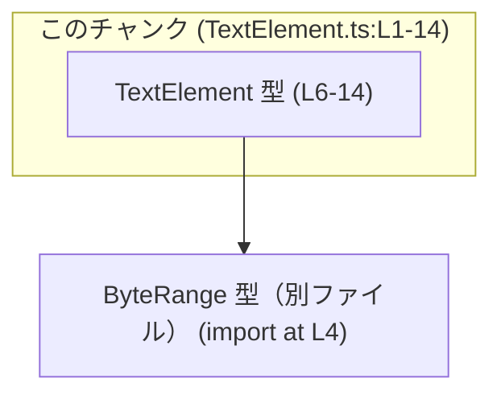
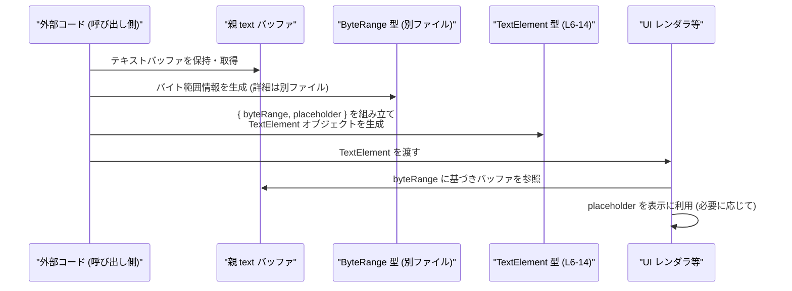

# app-server-protocol\schema\typescript\v2\TextElement.ts コード解説

## 0. ざっくり一言

`TextElement` は、「親のテキストバッファ内のバイト範囲」と「UI で表示する任意のプレースホルダ文字列」を 1 つのオブジェクトとして表現するための **スキーマ用 TypeScript 型** です（根拠: `TextElement.ts:L4-6, L10, L14`）。

---

## 1. このモジュールの役割

### 1.1 概要

- このモジュールは、`TextElement` という型エイリアス（オブジェクト型）を 1 つだけ公開します（根拠: `TextElement.ts:L6`）。
- `TextElement` は、親の `text` バッファ中のバイト範囲 `byteRange` と、UI 表示用の任意の `placeholder` を保持します（根拠: `TextElement.ts:L7-10, L11-14`）。
- ファイルは `ts-rs` によって自動生成されることが明記されており、手動編集は想定されていません（根拠: `TextElement.ts:L1, L3`）。

### 1.2 アーキテクチャ内での位置づけ

- `schema/typescript/v2` というパスから、プロトコル／スキーマ定義の TypeScript 表現の 1 つと位置づけられます（根拠: ファイルパス）。
- `ByteRange` 型に依存しており、`TextElement` 自体は `ByteRange` を含む「コンテナ型」です（根拠: `TextElement.ts:L4, L10`）。

依存関係を簡略化した図は次のとおりです。



### 1.3 設計上のポイント

- **型のみのモジュール**  
  実行時コードは一切なく、`export type` によりコンパイル時の型情報のみを提供します（根拠: `TextElement.ts:L4-6`）。
- **`import type` の利用**  
  `ByteRange` は `import type` で取り込まれており、コンパイル後の JavaScript には依存を持ち込みません（根拠: `TextElement.ts:L4`）。
- **null 許容のプレースホルダ**  
  `placeholder` は `string | null` で、プロパティ自体は必須だが値は `null` を許容する設計です（根拠: `TextElement.ts:L14`）。
- **自動生成ファイル**  
  コメントで「自動生成コードであり手動編集禁止」と明記され、スキーマの元定義を変更して再生成する前提です（根拠: `TextElement.ts:L1, L3`）。
- **状態・エラーハンドリング・並行性**  
  関数や状態を一切持たないため、このモジュール自身にはエラーハンドリングや並行処理に関するロジックは存在しません（根拠: 関数定義や実行文が存在しないこと `TextElement.ts:L1-14`）。

---

## 2. 主要な機能一覧

このモジュールが提供する機能は 1 つです。

- `TextElement` 型:  
  親テキストバッファ内のバイト範囲（`ByteRange`）と、UI 向けの任意のプレースホルダ文字列（`string | null`）をまとめて表現するオブジェクト型です（根拠: `TextElement.ts:L6-10, L11-14`）。

---

## 3. 公開 API と詳細解説

### 3.1 型一覧（構造体・列挙体など）

このファイル内に現れる主な型コンポーネントの一覧です。

| 名前 | 種別 | 役割 / 用途 | 定義／参照範囲 |
|------|------|-------------|----------------|
| `TextElement` | 型エイリアス（オブジェクト型） | 親 `text` バッファ内のバイト範囲と UI 用プレースホルダを 1 つの要素として表現する | `TextElement.ts:L6-14` |
| `ByteRange` | 型（詳細不明） | `TextElement.byteRange` に保存されるバイト範囲を表す型。ここでは外部から import されるだけで内容は不明 | `TextElement.ts:L4`（import）, `L10`（フィールド型） |

#### `TextElement` のフィールド

| フィールド名 | 型 | 説明 | 定義範囲 |
|-------------|----|------|----------|
| `byteRange` | `ByteRange` | 親の `text` バッファ内で、この要素が占有するバイト範囲を表す | `TextElement.ts:L7-10` |
| `placeholder` | `string \| null` | UI に表示される、人間が読める任意のプレースホルダ文字列。不要な場合は `null` | `TextElement.ts:L11-14` |

> `ByteRange` 型の具体的な構造（フィールドなど）は、このチャンクには現れないため不明です。

#### 言語レベルの安全性

- `byteRange` は型レベルで `ByteRange` を要求するため、無関係なオブジェクトを代入するとコンパイルエラーになります。
- `placeholder` は `string | null` の **ユニオン型** であり、`undefined` は許容されません。プロパティの省略や `undefined` 代入はコンパイルエラーになります（TypeScript の型システムの挙動）。

### 3.2 関数詳細（最大 7 件）

このファイルには **関数・メソッドの定義は一切ありません**（根拠: `TextElement.ts:L1-14` に関数宣言・式がない）。  
したがって、関数詳細テンプレートの対象となる API はありません。

### 3.3 その他の関数

- なし（補助関数・ユーティリティ関数も定義されていません）。

---

## 4. データフロー

このモジュール単体には実行コードがないため、**実際の呼び出し関係はこのチャンクだけからは分かりません**。  
ここでは、`TextElement` がどのようにデータフローの中で使われうるかという **一般的な利用イメージ** を示します（具体的なモジュール名などは仮のものです）。



- `TextElement` は、「**バッファ**（`TB`）とその一部を指す **範囲**（`BR`）と、UI 表示のための **メタ情報**（`placeholder`）」を結び付ける中間的なデータ構造として利用されると考えられます。
- 実際にどのモジュールが `TextElement` を生成・利用するかは、このチャンクからは分かりません。

---

## 5. 使い方（How to Use）

### 5.1 基本的な使用方法

`TextElement` を利用する典型的な TypeScript コード例です。  
`ByteRange` の具体的なフィールドはこのチャンクにはないため、ここでは型アサーションで代用します。

```typescript
// TextElement と ByteRange を型として import する
import type { TextElement } from "./TextElement";    // このファイル自身
import type { ByteRange } from "./ByteRange";        // 依存する型（別ファイル）

// ByteRange の具体的な形は ByteRange.ts 側を参照する必要がある
const range: ByteRange = {
    // 実際のフィールドは ByteRange 型の定義に従って埋める
} as ByteRange;

// TextElement を生成する
const element: TextElement = {
    byteRange: range,            // 親テキスト内のバイト範囲
    placeholder: "名前を入力",   // UI に表示するプレースホルダ
};

// 利用側の例（擬似コード）
// renderTextElement(element, parentTextBuffer);
```

このコードでは、TypeScript の型チェックにより以下が保証されます。

- `byteRange` に `ByteRange` 型以外を設定するとコンパイルエラーになる。
- `placeholder` に `string | null` 以外（たとえば `undefined` や数値）を設定するとコンパイルエラーになる。

### 5.2 よくある使用パターン

1. **プレースホルダ付き要素として使用**

```typescript
const withPlaceholder: TextElement = {
    byteRange: range,
    placeholder: "ここに値が入ります", // プレースホルダを UI に表示
};
```

1. **プレースホルダ不要な要素として使用**

```typescript
const withoutPlaceholder: TextElement = {
    byteRange: range,
    placeholder: null,   // プレースホルダが不要な場合は null
};
```

1. **複数要素の配列として使用**

```typescript
const elements: TextElement[] = [
    { byteRange: range1, placeholder: "氏名" },
    { byteRange: range2, placeholder: "住所" },
    { byteRange: range3, placeholder: null }, // プレースホルダなしの要素
];
```

`TextElement[]` を用いることで、1 つのテキストバッファに対する複数の範囲／UI 情報をまとめて扱うことができます。

### 5.3 よくある間違い

`placeholder` の型が `string | null` であり、「プロパティ必須・値は null 許容」という点が間違いの元になりやすいです。

```typescript
import type { TextElement } from "./TextElement";

// 間違い例 1: placeholder を省略している
const wrong1: TextElement = {
    byteRange: range,
    // placeholder が存在しないためエラー:
    // プロパティ 'placeholder' が型 'TextElement' から欠落しています
};

// 間違い例 2: placeholder に undefined を入れている
const wrong2: TextElement = {
    byteRange: range,
    // @ts-expect-error: Type 'undefined' is not assignable to type 'string | null'
    placeholder: undefined,
};

// 正しい例
const correct: TextElement = {
    byteRange: range,
    placeholder: null,           // 値がないことを示す場合は null を明示
};
```

### 5.4 使用上の注意点（まとめ）

- **必須プロパティ**  
  `byteRange` と `placeholder` の両方が必須のプロパティです。`placeholder` の値を省略するのではなく、不要な場合は `null` を設定する必要があります（根拠: `string | null` であり `placeholder?` ではないこと `TextElement.ts:L14`）。
- **ByteRange の契約**  
  `byteRange` が指す範囲が実際のテキストバッファの有効なバイト範囲であるかどうかは、この型自体では保証されません。実際の検証は別のロジック（このチャンクには現れない）で行う必要があります。
- **自動生成ファイルであること**  
  このファイルを直接編集すると、再生成時に上書きされます。変更は生成元（おそらく Rust 側の型定義や ts-rs の設定）で行う必要があります（根拠: `TextElement.ts:L1, L3`）。
- **並行性・スレッド安全性**  
  型定義のみで実行時の状態を持たないため、このモジュール自体にはスレッド安全性や並行実行に関する懸念はありません。

---

## 6. 変更の仕方（How to Modify）

### 6.1 新しい機能を追加する場合

このファイルは `ts-rs` により生成されるとコメントされているため（根拠: `TextElement.ts:L1, L3`）、**直接編集するのではなく生成元を変更する必要があります**。

一般的な手順（このチャンクから分かる範囲と ts-rs の一般的な挙動に基づく説明）:

1. `TextElement` に対応する元の型定義（おそらく Rust の構造体）を特定する。  
   - この情報は本チャンクにはないため、リポジトリ全体の構造や ts-rs 設定を確認する必要があります。
2. 元の型に新しいフィールドを追加する。  
   例: `label: Option<String>` のような形（あくまで一般的な例であり、このリポジトリ固有の情報ではありません）。
3. ts-rs のコード生成を再実行する。  
   - これにより、`TextElement` の TypeScript 定義にも新しいフィールドが反映されます。
4. 追加したフィールドを利用する側の TypeScript コードを更新する。

### 6.2 既存の機能を変更する場合

特に `byteRange` や `placeholder` の意味や型を変更する場合には、次の点に注意が必要です。

- **影響範囲の確認**  
  `TextElement` を利用しているすべての TypeScript コードでコンパイルエラーが発生しうるため、利用箇所を検索して影響範囲を確認します。
- **契約の維持**  
  - `byteRange`: 親テキストバッファ内の範囲であるという意味を変える場合、関連するロジック（バッファ操作・表示ロジックなど）の契約が変わります。
  - `placeholder`: `string | null` から別の型に変更するときは、「プレースホルダが存在しない状態をどう表現するか」を明確にする必要があります。
- **生成元の更新**  
  変更は常に生成元（Rust 側など）で行い、ts-rs を再実行してこのファイルを更新します。直接編集すると次回生成時に失われます。

---

## 7. 関連ファイル

このモジュールと密接に関係するファイルは次のとおりです。

| パス | 役割 / 関係 |
|------|------------|
| `app-server-protocol/schema/typescript/v2/ByteRange.ts`（推定） | `ByteRange` 型の定義を提供すると考えられます。このファイルから `import type { ByteRange } from "./ByteRange";` として参照されています（根拠: `TextElement.ts:L4`）。 |
| `（生成元の Rust ファイルなど）` | `ts-rs` によってこの TypeScript ファイルが生成される元のスキーマ定義。具体的なパスや内容はこのチャンクには現れないため不明です（根拠: `TextElement.ts:L1, L3` のコメント）。 |

> テストコードやサポート用ユーティリティについては、このチャンクには一切情報がないため、「存在するかどうかを含め不明」です。
