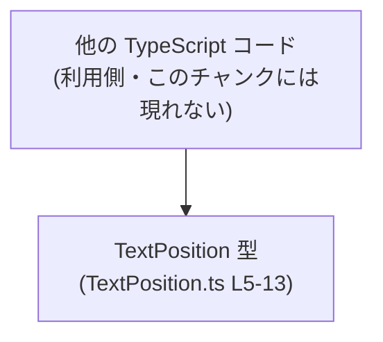
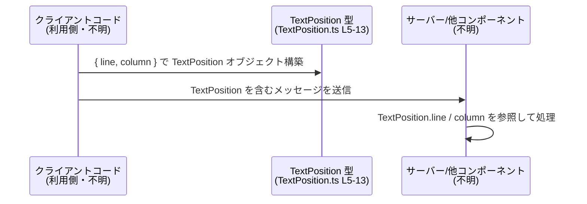

# app-server-protocol/schema/typescript/v2/TextPosition.ts コード解説

## 0. ざっくり一言

テキスト中の位置を「1 始まりの行番号」と「1 始まりの列番号（Unicode スカラー値単位）」で表すための、生成済み TypeScript 型定義です（`TextPosition.ts:L5-13`）。

---

## 1. このモジュールの役割

### 1.1 概要

- このモジュールは、テキストの位置情報を表現するための型 `TextPosition` を 1 つだけ公開しています（`TextPosition.ts:L5-13`）。
- 位置は **1-based（1 始まり）** の `line` と `column` プロパティで表現されます（`TextPosition.ts:L6-12`）。
- ファイル先頭のコメントから、この型定義は `ts-rs` によって自動生成されており、手動編集を想定していません（`TextPosition.ts:L1-3`）。

### 1.2 アーキテクチャ内での位置づけ

ファイルパスとコメントから、この型は「app-server-protocol」の TypeScript スキーマの一部として、プロトコルでやり取りされるテキスト位置を表現する用途が想定されますが、**このチャンクだけでは具体的な利用元モジュールは分かりません**。

想定上の依存関係を、`TextPosition` を中心に簡略化すると次のようになります。



※上図は利用イメージであり、**実際の依存関係はこのチャンクからは判別できません**。

### 1.3 設計上のポイント

- **自動生成コード**  
  - `// GENERATED CODE! DO NOT MODIFY BY HAND!` というコメントにより、手動編集非推奨であることが明示されています（`TextPosition.ts:L1`）。
  - `ts-rs` による生成であることがコメントに書かれています（`TextPosition.ts:L3`）。
- **単純なデータキャリア型**  
  - `export type TextPosition = { ... }` という型エイリアスで、2 つの数値プロパティのみを持つオブジェクト型を定義しています（`TextPosition.ts:L5-13`）。
  - 状態やメソッドは一切持たず、純粋なデータ構造です。
- **1-based かつ Unicode スカラー値単位という契約**  
  - `line`: 「1-based line number.」とコメントされています（`TextPosition.ts:L6-8`）。
  - `column`: 「1-based column number (in Unicode scalar values).」とコメントされています（`TextPosition.ts:L10-12`）。
  - TypeScript 型は単なる `number` なので、**コンパイル時には 1 以上かどうかはチェックされず、利用側のロジックで守る必要があります**（契約レベルのルール）。

---

## 2. 主要な機能一覧

このファイルが提供する機能は 1 つだけです。

- **テキスト位置情報の型定義**:  
  `TextPosition` 型で、1 始まりの `line`・`column` によるテキスト位置を表現する（`TextPosition.ts:L5-13`）。

---

## 3. 公開 API と詳細解説

### 3.1 型一覧（構造体・列挙体など）

| 名前           | 種別           | 役割 / 用途                                               | 定義箇所                         |
|----------------|----------------|------------------------------------------------------------|----------------------------------|
| `TextPosition` | 型エイリアス（オブジェクト型） | テキスト内の位置を 1-based の `line` と `column` で表現する | `TextPosition.ts:L5-13` |

#### `TextPosition`

`TextPosition` は次のように定義されています。

```typescript
// GENERATED CODE! DO NOT MODIFY BY HAND!                           // 手動での編集禁止 (L1)

// This file was generated by [ts-rs](https://github.com/Aleph-Alpha/ts-rs). Do not edit this file manually.  // ts-rs による自動生成 (L3)

export type TextPosition = {                                         // TextPosition 型エイリアスの定義開始 (L5)
    /**
     * 1-based line number.                                          // 行番号は 1 始まり (L7)
     */
    line: number,                                                    // line プロパティ (L9)
    /**
     * 1-based column number (in Unicode scalar values).             // 列番号は Unicode スカラー値単位で 1 始まり (L11)
     */
    column: number,                                                  // column プロパティ (L13)
};
```

- `line: number`  
  - テキスト中の行番号を表します（`TextPosition.ts:L6-9`）。
  - コメントにより **1-based（1 行目を 1 とする）** であることが契約として示されています。
- `column: number`  
  - 行内の列番号を表します（`TextPosition.ts:L10-13`）。
  - コメントにより **Unicode スカラー値単位の 1-based** でカウントする契約になっています。
  - これは「バイト数」や「UTF-16 コードユニット数」とは異なる可能性があります。

### 3.2 関数詳細（最大 7 件）

このファイルには **関数・メソッドの定義は存在しません**（`TextPosition.ts:L1-13` を確認しても `function` や `=>` 付きの関数シグネチャがないため）。

そのため、本セクションで詳細解説する関数はありません。

### 3.3 その他の関数

このファイルには補助的な関数やラッパー関数も存在しません（`TextPosition.ts:L1-13`）。

| 関数名 | 役割（1 行） |
|--------|--------------|
| なし   | このチャンクには関数定義が現れません |

---

## 4. データフロー

このファイル自体には実行時ロジックがないため、**ファイル内での処理フローや関数呼び出しは存在しません**。

一方で、`TextPosition` がどのように使われるかの一般的なイメージとして、テキストエディタやサーバー間で位置情報をやり取りする場合のデータフロー例を示します。  
※あくまで利用イメージであり、**このチャンクから直接読み取れる事実ではありません**。



このように、`TextPosition` は「どこで何が起きているか」を示す **位置情報のコンテナ** として、他コンポーネント間を渡り歩くデータとして使われることが想定されます（契約は `TextPosition.ts:L6-12` のコメントから読み取れます）。

---

## 5. 使い方（How to Use）

### 5.1 基本的な使用方法

`TextPosition` を使って、テキスト位置を表現する最も単純な例です。  
ここで定義するコードは **利用側** のサンプルであり、このファイル自身には含まれていません。

```typescript
// TextPosition 型をインポートする例
// （実際のインポートパスはプロジェクト構成によります）
import type { TextPosition } from "./TextPosition";

// ファイルの先頭位置（1 行 1 列）を表す TextPosition を作る
const startOfFile: TextPosition = {                                  // TextPosition オブジェクトをリテラルで構築
    line: 1,                                                         // 1-based の 1 行目
    column: 1,                                                       // 1-based の 1 列目（Unicode スカラー値単位）
};

// 関数の引数として位置を渡すイメージ
function logPosition(pos: TextPosition) {                            // TextPosition 型を引数に受け取る
    console.log(`line=${pos.line}, column=${pos.column}`);           // line / column にアクセス
}
logPosition(startOfFile);                                            // 位置情報を渡してログ出力
```

このように、**オブジェクトリテラル `{ line, column }` による初期化**が基本的な使い方です。

### 5.2 よくある使用パターン

1. **範囲（Range）を表現するために組み合わせる**

```typescript
import type { TextPosition } from "./TextPosition";

// TextPosition を使ってテキスト範囲を表す型を定義
type TextRange = {                                                   // 利用側での新しい型定義
    start: TextPosition;                                             // 範囲の開始位置
    end: TextPosition;                                               // 範囲の終了位置
};

// 具体的な範囲の例: 1 行目 1 列〜1 行目 5 列
const range: TextRange = {
    start: { line: 1, column: 1 },
    end: { line: 1, column: 5 },
};
```

1. **エラーや診断メッセージの位置情報として使う**

```typescript
import type { TextPosition } from "./TextPosition";

type Diagnostic = {
    message: string;                                                 // エラーメッセージ
    position: TextPosition;                                          // 問題が発生した位置
};

// エラー情報の例
const diag: Diagnostic = {
    message: "Unexpected token",
    position: { line: 10, column: 15 },                              // 10 行目 15 列でエラーとする
};
```

### 5.3 よくある間違い

`TextPosition` のコメントから推測できる、起きやすい誤用例と正しい例を示します。

```typescript
import type { TextPosition } from "./TextPosition";

// ⚠ 間違い例: 0-based として解釈してしまう
const wrongPos: TextPosition = {
    line: 0,                                                         // コメント上は 1-based なので 0 は不正な値
    column: 0,                                                       // 同上
};

// ✅ 正しい例: 1-based を守る
const correctPos: TextPosition = {
    line: 1,                                                         // 1 行目
    column: 1,                                                       // 1 列目
};
```

```typescript
// ⚠ 間違い例: UTF-16 コードユニットやバイト数をそのまま column に入れる
function fromUtf16Offset(line: number, utf16Column: number): TextPosition {
    return {
        line: line,
        column: utf16Column,                                         // コメント上は Unicode スカラー値単位であるべき
    };
}

// ✅ より安全な例（概念的な例）
// 実際には Unicode スカラー値への変換処理が必要になる
function fromScalarColumn(line: number, scalarColumn: number): TextPosition {
    return {
        line: line,
        column: scalarColumn,                                        // Unicode スカラー値単位の列番号を渡す前提
    };
}
```

TypeScript の型レベルでは `number` にすぎないため、**0 や負の値を避けること・カウント単位を合わせることは完全に利用側の責任**になります（`TextPosition.ts:L6-12` のコメントが唯一の契約情報です）。

### 5.4 使用上の注意点（まとめ）

- **1-based を必ず守ること**  
  - `line`・`column` はどちらも 1 始まりとして扱う前提です（`TextPosition.ts:L6-12`）。
  - 0 や負数を入れてもコンパイルは通りますが、プロトコル利用側で不整合やバグの原因になります。
- **列は「Unicode スカラー値」単位**  
  - `column` はバイト数や UTF-16 コードユニット数ではなく、Unicode スカラー値単位とコメントされています（`TextPosition.ts:L10-12`）。
  - 文字列処理のライブラリや環境によってはカウント方法が異なるため、変換が必要になる場合があります。
- **自動生成ファイルを直接編集しない**  
  - 先頭コメントに「DO NOT MODIFY BY HAND!」とあるため、生成元を変更して再生成するのが前提です（`TextPosition.ts:L1-3`）。
- **実行時エラー・並行性の問題はこの型単体では発生しない**  
  - `TextPosition` は単なるデータ型であり、関数や I/O を含まないため、このファイル由来の例外やデッドロックなどは発生しません。
  - ただし、「契約違反の値」（0-based 等）を入れると、それを使う別コンポーネント側で不正な挙動が起きる可能性があります。

---

## 6. 変更の仕方（How to Modify）

### 6.1 新しい機能を追加する場合

このファイルは `ts-rs` による自動生成コードであり、先頭コメントで「手で編集するな」と明示されているため（`TextPosition.ts:L1-3`）、**直接このファイルに機能追加することは前提とされていません**。

`TextPosition` を活用した新機能を追加したい場合は、次のような方針が考えられます。

1. **別ファイルで拡張型やユーティリティ関数を定義する**
   - 例: `TextRange` 型や、`TextPosition` を比較・検証する関数を別ファイルに定義する。
   - これにより、自動生成ファイルはそのままにしておけます。

2. **生成元の定義を変更する（推測ベース）**
   - コメントから、この型は `ts-rs` で生成されていることがわかります（`TextPosition.ts:L3`）。
   - 型の構造自体（フィールド追加・削除など）を変えたい場合は、**Rust 側などの生成元定義を変更して `ts-rs` を再実行する必要があると考えられますが、このチャンクから生成元ファイルの場所や名前は分かりません**。

### 6.2 既存の機能を変更する場合

- **影響範囲の確認**
  - `TextPosition` 型のフィールド構造を変えると、これを利用している全ての TypeScript コードに影響します。
  - このチャンクには利用箇所が現れないため、実際の影響範囲はプロジェクト全体の検索で確認する必要があります（このチャンクでは不明）。
- **契約の維持**
  - コメントで規定されている「1-based」「Unicode スカラー値単位」という契約を変更する場合、プロトコル全体やクライアント・サーバ双方の実装に影響します。
  - 契約を変える場合は、コメント・生成元・利用側すべてを同期的に変更する必要があります。
- **自動生成の前提を崩さない**
  - このファイルを直接編集すると、次回の生成で上書きされる可能性があります。
  - 構造変更が必要な場合は、生成元の修正と再生成が基本方針になります（`TextPosition.ts:L1-3`）。

---

## 7. 関連ファイル

このチャンクには `import` 文や他ファイルへの参照が一切存在しないため、**直接の関連ファイルは特定できません**（`TextPosition.ts:L1-13`）。

| パス | 役割 / 関係 |
|------|------------|
| 不明（このチャンクには現れない） | `TextPosition` の生成元（`ts-rs` による元の型定義）が存在するはずですが、このファイルからはパスや名前は分かりません |
| 不明（このチャンクには現れない） | `TextPosition` を利用している TypeScript ファイル群（プロトコル利用側）が存在するはずですが、このチャンクからは特定できません |

---

### 付記：コンポーネントインベントリー（まとめ）

最後に、このチャンクに現れるコンポーネントの一覧と根拠行を整理します。

| コンポーネント名 | 種別                         | 説明                                             | 根拠 |
|------------------|------------------------------|--------------------------------------------------|------|
| `TextPosition`   | 型エイリアス（オブジェクト型） | テキスト位置（1-based line / column）を表す型   | `TextPosition.ts:L5-13` |
| `line`           | プロパティ（number）          | 1-based の行番号                                 | `TextPosition.ts:L6-9`  |
| `column`         | プロパティ（number）          | 1-based の列番号（Unicode スカラー値単位）       | `TextPosition.ts:L10-13` |
| 自動生成コメント | ファイルレベルコメント        | ts-rs による自動生成であり手動編集禁止であること | `TextPosition.ts:L1-3`  |

このファイルには関数・クラス・列挙体・インポート文などは現れない、という点も確認できます（`TextPosition.ts:L1-13`）。
