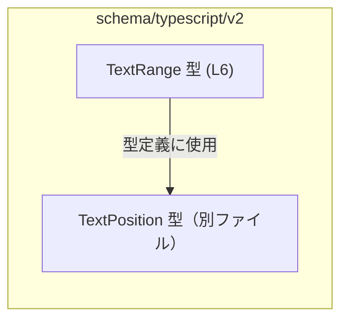
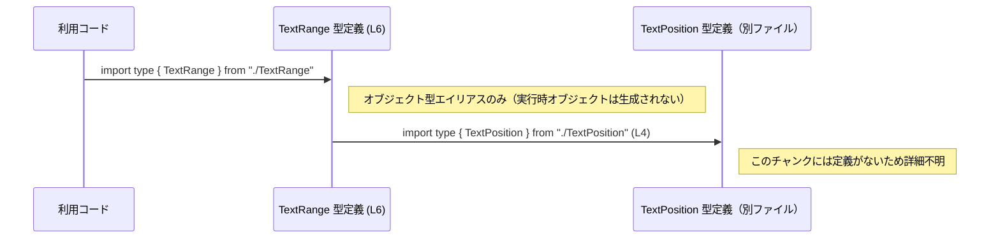

# app-server-protocol/schema/typescript/v2/TextRange.ts コード解説

## 0. ざっくり一言

このファイルは、テキストの範囲を「開始位置」と「終了位置」の 2 つの座標で表す `TextRange` 型を定義する **自動生成された TypeScript の型定義ファイル**です（`ts-rs` により生成）[TextRange.ts:L1-3][TextRange.ts:L6]。

---

## 1. このモジュールの役割

### 1.1 概要

- このモジュールは、テキスト上の範囲を表現するために、`start` と `end` という 2 つの `TextPosition` 型の値をまとめた `TextRange` 型エイリアスを提供します[TextRange.ts:L4][TextRange.ts:L6]。
- コードは `ts-rs` によって自動生成されており、手動で編集しないことが明示されています[TextRange.ts:L1-3]。

### 1.2 アーキテクチャ内での位置づけ

- `TextRange` は同一ディレクトリの `./TextPosition` から `TextPosition` 型を **型専用インポート**しています[TextRange.ts:L4]。
- このファイル自身は `TextRange` 型をエクスポートするのみで、実行時の処理ロジックは持ちません[TextRange.ts:L6]。

依存関係を簡略図で示します（この図は本チャンクに現れる依存のみを対象とします）。



### 1.3 設計上のポイント

- **自動生成コード**  
  - 先頭コメントで「GENERATED CODE! DO NOT MODIFY BY HAND!」と宣言されており[TextRange.ts:L1]、`ts-rs` により生成されたことが明記されています[TextRange.ts:L2-3]。  
  - 設計上、このファイルを直接編集せず、元となる Rust 側の定義やジェネレータ設定を変更する前提になっています。

- **型レベルのみの定義**  
  - `export type TextRange = { ... }` という **型エイリアス**であり、クラスや関数は定義されていません[TextRange.ts:L6]。  
  - `import type` を用いていることから、実行時には `TextPosition` への依存が出ない **型専用の関係**になっています[TextRange.ts:L4]。

- **責務の限定**  
  - このモジュールの責務は「テキスト範囲の型形状を定義する」ことに限定されており、妥当性チェック（例: `start` が `end` 以前であるか）などのロジックは一切含みません[TextRange.ts:L6]。

- **言語固有の安全性／エラー／並行性の視点**  
  - TypeScript の静的型チェックにより、`TextRange` を使う箇所では `start` と `end` が必ず `TextPosition` 型であることが保証されます[TextRange.ts:L4][TextRange.ts:L6]。
  - 一方で、`start` と `end` の順序や内容の妥当性は型では表現されておらず、論理的な誤りはコンパイル時には検出されません（このファイルにはそのような制約は記述されていません[TextRange.ts:L6]）。
  - 実行時コードや非同期処理／並行処理は含まれていないため、このファイル単体としてはエラー処理や並行性に関する懸念点はありません[TextRange.ts:L1-6]。

---

## 2. 主要な機能一覧

このファイルにおける「機能」は、型定義のみです。

- `TextRange` 型: `start` と `end` の 2 つの `TextPosition` から成るテキスト範囲の型エイリアス[TextRange.ts:L4][TextRange.ts:L6]。

---

## 3. 公開 API と詳細解説

### 3.1 型一覧（構造体・列挙体など）

このチャンクに現れる型と依存関係のインベントリーです。

| 名前          | 種別             | 役割 / 用途                                                                 | 根拠 |
|---------------|------------------|-----------------------------------------------------------------------------|------|
| `TextRange`   | 型エイリアス     | `start` と `end` の 2 つの `TextPosition` をまとめたテキスト範囲を表す型。外部へエクスポートされています。 | TextRange.ts:L6 |
| `TextPosition`| 型（別ファイル） | テキスト上の位置を表す型と推測されますが、このチャンクには定義はなく、`TextRange` が型として参照するのみです。役割の詳細は不明です。 | TextRange.ts:L4 |

> `TextPosition` の具体的な構造（例: 行・列など）は、このチャンクには現れないため不明です。

#### `TextRange` 型のフィールド

`TextRange` はオブジェクト型で、次の 2 フィールドを持ちます[TextRange.ts:L6]。

| フィールド名 | 型            | 説明（コードから読み取れる範囲）                  | 必須/任意 | 根拠 |
|--------------|---------------|-------------------------------------------|-----------|------|
| `start`      | `TextPosition`| 範囲の開始位置を表す `TextPosition` 型の値。 | 必須      | TextRange.ts:L6 |
| `end`        | `TextPosition`| 範囲の終了位置を表す `TextPosition` 型の値。 | 必須      | TextRange.ts:L6 |

TypeScript のオブジェクト型記法で `?` が付いていないため、`start` と `end` はどちらも必須プロパティです[TextRange.ts:L6]。

### 3.2 関数詳細（最大 7 件）

このファイルには関数定義は存在しません[TextRange.ts:L1-6]。

- `function` キーワードやアロー関数の定義は登場せず、`export` は `type` のみに対して使われています[TextRange.ts:L6]。

### 3.3 その他の関数

このチャンクには補助関数やラッパー関数も定義されていません[TextRange.ts:L1-6]。

| 関数名 | 役割（1 行） |
|--------|--------------|
| 該当なし | - |

---

## 4. データフロー

このファイルには実行時の処理はありませんが、**型レベルでの依存関係**と、それを利用するコードの典型的な流れを、コンパイル時の観点で整理します。

- `TextRange` 型は、別ファイルで定義された `TextPosition` 型を用いて定義されます[TextRange.ts:L4][TextRange.ts:L6]。
- 別のモジュール（利用コード）は `TextRange` をインポートして型注釈として使用し、TypeScript コンパイラはその際に `TextPosition` も含めて型整合性をチェックします。

このコンパイル時の関係を sequence diagram で表します（`TextRange` 型定義の位置を明示しています）。



この図はあくまで **コンパイル時の型解決の流れ**を示したものであり、このファイル単体からは実行時の関数呼び出しや I/O などは確認できません[TextRange.ts:L1-6]。

---

## 5. 使い方（How to Use）

### 5.1 基本的な使用方法

最も基本的な使い方は、「他のモジュールで `TextRange` を型としてインポートし、関数の引数や戻り値、フィールドの型として利用する」ことです。

```typescript
// TextRange.ts と同じディレクトリにいる別ファイルから利用する例
import type { TextRange } from "./TextRange";       // TextRange 型を型専用でインポートする

// TextPosition の具体的な形はこのチャンクからは不明なため、
// どこか別の箇所から TextPosition 値を受け取る前提とします。
import type { TextPosition } from "./TextPosition"; // TextRange.ts と同じ依存元を参照

// TextRange を引数に取る関数の例
function printRange(range: TextRange) {            // range は start と end を必ず持つ
    // range.start, range.end は TextPosition 型として扱える
    console.log("range:", range);
}

// TextPosition 値をどこかから取得して TextRange を作る例
declare function getCursor(): TextPosition;        // 仮の関数: 現在位置を返すとする
declare function getSelectionEnd(): TextPosition;  // 仮の関数: 選択範囲の終端位置

const range: TextRange = {                         // TextRange 型のオブジェクトを作成
    start: getCursor(),                            // start は TextPosition 型
    end: getSelectionEnd(),                        // end も TextPosition 型
};

printRange(range);                                 // 型が合っているのでコンパイル可能
```

この例のポイント:

- `TextRange` は単なるオブジェクト型エイリアスなので、その形状（`{ start: TextPosition; end: TextPosition }`）を満たすオブジェクトであれば代入できます[TextRange.ts:L6]。
- TypeScript の型システムにより、`start` や `end` を `TextPosition` 以外の型にするとコンパイルエラーになります[TextRange.ts:L4][TextRange.ts:L6]。

### 5.2 よくある使用パターン

#### 1. 引数・戻り値としての利用

```typescript
import type { TextRange } from "./TextRange";

// テキストから範囲を抽出する関数の例
function extractText(source: string, range: TextRange): string {
    // range.start / range.end の具体的な扱いは TextPosition の定義に依存するため、
    // ここでは詳細実装は省略します。
    return source; // 実際には range に基づいて部分文字列を返す想定の例
}
```

#### 2. 他の型の一部としてネストする

```typescript
import type { TextRange } from "./TextRange";

type Highlight = {
    id: string;            // ハイライトの識別子
    range: TextRange;      // ハイライトの対象範囲
    color: string;         // 表示カラー
};
```

このように、`TextRange` は他のドメイン型の一部として再利用しやすい構造になっています[TextRange.ts:L6]。

### 5.3 よくある間違い（起こりうる誤り例）

TypeScript の型は **形状**を保証しますが、**意味**までは保証しないため、論理的な誤りが起こりうる点に注意が必要です。

```typescript
import type { TextRange } from "./TextRange";
import type { TextPosition } from "./TextPosition";

declare const startPos: TextPosition;
declare const endPos: TextPosition;

// 誤り例: start と end を論理的に取り違えて代入している
const reversed: TextRange = {
    start: endPos,    // 形としては OK（TextPosition 型）だが、意味としては「終点」が入っている
    end: startPos,    // 同様に意味の取り違え
};
```

- 上記のような「意味的な取り違え」は、型の形が合っているため TypeScript では検出されません[TextRange.ts:L6]。
- `TextRange` 自体には `start <= end` といった順序関係の制約は組み込まれていないことに注意が必要です[TextRange.ts:L6]。

### 5.4 使用上の注意点（まとめ）

- `start` と `end` はどちらも必須であり、`undefined` や `null` をそのまま入れることはできません（`TextPosition` 型がそれを許容するユニオンでない限り）[TextRange.ts:L6]。
- `TextRange` は **静的な型定義に過ぎない**ため、範囲の妥当性の検証（順序・境界チェックなど）は、別途アプリケーションロジックで行う必要があります[TextRange.ts:L6]。
- 実行時のオブジェクトとして特別なクラスやメソッドがあるわけではなく、単純なプレーンオブジェクトとして扱われます[TextRange.ts:L6]。
- 非同期処理や並行処理とは無関係な純粋な型定義なので、このファイル単体ではスレッドセーフティやロック等を考慮する必要はありません[TextRange.ts:L1-6]。

---

## 6. 変更の仕方（How to Modify）

### 6.1 新しい機能を追加する場合

先頭コメントにある通り、このファイルは `ts-rs` によって自動生成されており、**手動での編集は前提とされていません**[TextRange.ts:L1-3]。

- `TextRange` にフィールドを追加する、名前を変更するなどの変更を行いたい場合、  
  - Rust 側の元定義  
  - または `ts-rs` の生成設定  
  を変更する必要があると考えられますが、具体的にどのファイルをどう変更するかは、このチャンクだけからは分かりません（不明）。

変更の一般的なステップ（推測を含まない範囲）:

1. Rust プロジェクト側で `TextRange` に対応する型定義を探す（ts-rs が Rust から TypeScript を生成するツールであることから推測されますが、具体的な場所は不明）。
2. そこでフィールド追加・削除などの変更を行う。
3. `ts-rs` により TypeScript コードを再生成する。
4. 生成された `TextRange.ts` を利用している TypeScript 側コードのコンパイルが通るか確認する。

### 6.2 既存の機能を変更する場合

このファイルを直接編集すると、次回の自動生成時に上書きされる可能性が高いことがコメントから示唆されています[TextRange.ts:L1-3]。

変更時に考慮すべき点:

- **影響範囲**  
  - プロジェクト内で `TextRange` を型として参照しているすべての箇所に影響します（参照箇所はこのチャンクには現れないため不明ですが、一般に広く使われる可能性があります）。
- **契約の維持**  
  - `start` / `end` フィールド名や型が変更されると、既存のコードとの互換性が失われます[TextRange.ts:L6]。
- **テスト**  
  - このファイル自身にはテストコードはありません[TextRange.ts:L1-6]。  
  - 実際には、`TextRange` を利用する上位ロジック（例えばテキスト編集機能など）のテストで間接的に検証される形になると考えられますが、このチャンクからはどのテストが存在するかは分かりません（不明）。

---

## 7. 関連ファイル

このチャンクから直接分かる関連ファイルは次の通りです。

| パス              | 役割 / 関係                                                                                          | 根拠 |
|-------------------|------------------------------------------------------------------------------------------------------|------|
| `./TextPosition`  | `TextRange` の `start` および `end` フィールドの型として利用される `TextPosition` 型を提供するモジュール（具体的な構造や役割はこのチャンクには現れないため不明）。 | TextRange.ts:L4 |

その他に `TextRange` を再エクスポートするインデックスファイルや、これを利用するサービス／UI コンポーネント等が存在する可能性はありますが、このチャンクには現れないため不明です。

---

### 付記: Bugs / Security / パフォーマンス面の補足（このファイルに限った話）

- **バグの可能性**  
  - このファイル自体は型定義のみであり、実行時ロジックを持たないため、ランタイムエラーを直接引き起こすコードは含まれていません[TextRange.ts:L1-6]。
  - ただし、前述のように `start` と `end` の意味的な取り違えなど、**設計レベルのバグ**は型だけでは防げません。

- **セキュリティ**  
  - 実行時処理や入出力、パース処理などがないため、このファイル単体として明確なセキュリティリスク（XSS、SQL インジェクション等）はありません[TextRange.ts:L1-6]。

- **パフォーマンス／スケーラビリティ**  
  - 型定義のみであり、実行時オーバーヘッドは発生しません[TextRange.ts:L6]。コンパイル時間への影響も極めて小さいカテゴリです。

以上が、このチャンク（`app-server-protocol/schema/typescript/v2/TextRange.ts`）から読み取れる範囲での、`TextRange` 型に関する客観的な解説です。
