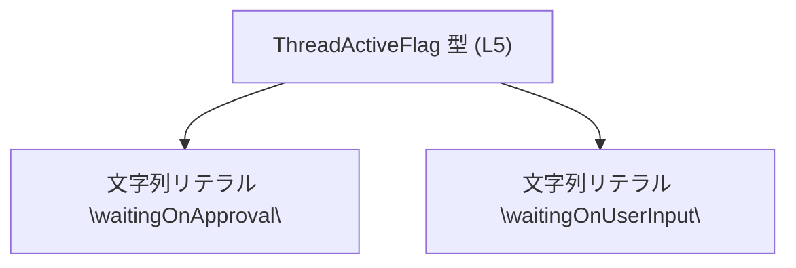
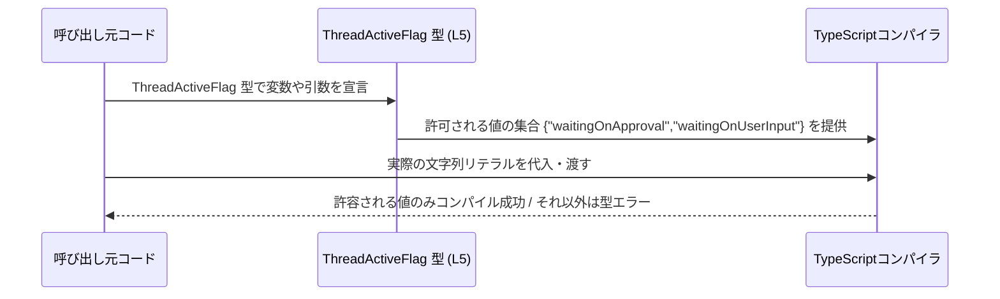

# app-server-protocol\schema\typescript\v2\ThreadActiveFlag.ts

## 0. ざっくり一言

スレッドの「アクティブ状態」を、2 種類の文字列リテラルのいずれかとして表現する TypeScript の型定義です。

---

## 1. このモジュールの役割

### 1.1 概要

- このモジュールは、スレッドが「どの理由で待ち状態になっているか」を表す状態フラグを **型レベルで制約する** ための型 `ThreadActiveFlag` を提供します。
- 許可される値を `"waitingOnApproval"` または `"waitingOnUserInput"` の 2 つに限定することで、誤った文字列の利用をコンパイル時に防ぐことを目的としています。  
  根拠: `export type ThreadActiveFlag = "waitingOnApproval" | "waitingOnUserInput";`  
  （app-server-protocol\schema\typescript\v2\ThreadActiveFlag.ts:L5-5）

### 1.2 アーキテクチャ内での位置づけ

このファイルは、生成コードとしてコメントされています。ts-rs（Rust から TypeScript 型を生成するライブラリ）によって生成された「スキーマ定義」の一部であると読み取れます。

- 上位のアプリケーションコード（フロントエンドやクライアント SDK など）が、この型 `ThreadActiveFlag` を import して使用すると考えられますが、実際にどのファイルから使われているかはこのチャンクには現れません。
- TypeScript のコンパイル時にのみ効く型であり、実行時のロジックや副作用は持ちません。

依存関係イメージ（このファイル内に限った図）:



### 1.3 設計上のポイント

- **生成コードであること**  
  - 冒頭コメントで「GENERATED CODE」と明記されています。  
    根拠: コメント `// GENERATED CODE! DO NOT MODIFY BY HAND!`  
    （app-server-protocol\schema\typescript\v2\ThreadActiveFlag.ts:L1-1）
  - 直接編集せず、ts-rs の生成元（Rust 側の型）を変更する前提です（生成元のファイルはこのチャンクには現れません）。
- **文字列リテラルユニオン型**  
  - TypeScript の文字列リテラルユニオンを用いて、取りうる値を 2 つに限定しています。  
    （L5-5）
- **状態管理の一貫性を型で担保**  
  - 状態を `string` などの自由な文字列ではなく、限られた候補に制約することで、スペルミスや不正な状態値をコンパイル時に検出できます。
- **状態の意味の詳細**  
  - `"waitingOnApproval"` と `"waitingOnUserInput"` が具体的にシステム内でどのような意味を持つかは、このチャンクからは分かりません（このチャンクには現れません）。

---

## 2. 主要な機能一覧

このファイルには関数は存在せず、型定義のみが公開 API となっています。

- `ThreadActiveFlag`: スレッドがどの種類の「待ち状態」にあるかを `"waitingOnApproval"` または `"waitingOnUserInput"` のどちらかで表現する文字列リテラルユニオン型。

---

## 3. 公開 API と詳細解説

### 3.1 型一覧（構造体・列挙体など）

| 名前               | 種別                     | 役割 / 用途                                                                 | 定義位置 |
|--------------------|--------------------------|------------------------------------------------------------------------------|----------|
| `ThreadActiveFlag` | 型エイリアス（ユニオン） | スレッドのアクティブ状態を 2 種類の文字列リテラルのどちらかに制約するための型 | app-server-protocol\schema\typescript\v2\ThreadActiveFlag.ts:L5-5 |

#### `ThreadActiveFlag`

- **定義**

  ```typescript
  export type ThreadActiveFlag = "waitingOnApproval" | "waitingOnUserInput";
  ```

- **概要**
  - スレッドが「承認待ち」か「ユーザー入力待ち」のいずれかであることを型で表します。
  - TypeScript のコンパイル時に、これ以外の文字列を代入するコードをエラーとして検出できます。

- **言語特性（型安全性）**
  - `ThreadActiveFlag` は `string` のサブセット的な型であり、`"waitingOnApproval"` か `"waitingOnUserInput"` 以外の文字列リテラルを代入するとコンパイルエラーになります。
  - `any` や型アサーション（`as ThreadActiveFlag`）を乱用すると、この安全性は失われます。

- **エラー / パニック / 並行性**
  - 型定義のみであり、実行時のエラーやパニックを発生させるコードは含まれていません。
  - 並行処理やスレッド安全性には直接関与しません。

### 3.2 関数詳細（最大 7 件）

このファイルには関数・メソッドは定義されていません（このチャンクには現れません）。

### 3.3 その他の関数

補助的な関数やラッパー関数も存在しません。

---

## 4. データフロー

このファイル自体は実行時の処理を持ちませんが、**型レベルでのデータ制約の流れ**をイメージとして示します。



- 呼び出し元コードが `ThreadActiveFlag` 型を使って変数や関数パラメータを定義すると、TypeScript コンパイラは `"waitingOnApproval"` と `"waitingOnUserInput"` 以外の文字列を代入した場合にコンパイルエラーを報告します。
- 実行時にはこの型は消える（型情報は JS に出力されない）ため、外部入力からの文字列を安全に扱うには、**別途ランタイムバリデーションを実装する必要があります**。

---

## 5. 使い方（How to Use）

### 5.1 基本的な使用方法

`ThreadActiveFlag` 型の変数を宣言し、安全な値のみを扱う例です。

```typescript
// ThreadActiveFlag 型をインポートする（実際のパスはこのチャンクには現れません）
import type { ThreadActiveFlag } from "./ThreadActiveFlag";

// ThreadActiveFlag 型の変数を宣言する                      // 型により取りうる値を制約
let flag: ThreadActiveFlag;

// 許可されている値の代入                                 // OK: ユニオンの一要素
flag = "waitingOnApproval";

// もう一つの許可されている値                             // OK: もう一方のユニオン要素
flag = "waitingOnUserInput";

// 許可されていない値                                     // コンパイルエラーになる例
// flag = "completed";                                   // ❌ 型 '"completed"' を 'ThreadActiveFlag' に割り当てられません
```

このように、スペルミスや存在しない状態を代入しようとするとコンパイルエラーになります。

### 5.2 よくある使用パターン

#### 条件分岐での利用

`ThreadActiveFlag` に基づいて処理を分ける例です。

```typescript
import type { ThreadActiveFlag } from "./ThreadActiveFlag";

// 状態に応じてメッセージを生成する関数                    // ThreadActiveFlag を引数に取る
function describeFlag(flag: ThreadActiveFlag): string {
    switch (flag) {                                        // ユニオン型に対する switch
        case "waitingOnApproval":
            return "承認待ちです。";

        case "waitingOnUserInput":
            return "ユーザー入力待ちです。";

        // default: は不要だが、あえて書くことも可能        // 現在のユニオン要素は 2 つのみ
    }
}
```

- 将来ユニオンに新しい値が追加された場合、`switch` が網羅的でなくなるとコンパイラが警告/エラーを出す設定にすることで、分岐漏れに気付きやすくなります（設定方法自体はこのチャンクには現れません）。

#### 外部入力との組み合わせ（ランタイムチェック）

外部（API レスポンスなど）から受け取った文字列を `ThreadActiveFlag` として扱う場合の、簡単なランタイムチェック例です。

```typescript
import type { ThreadActiveFlag } from "./ThreadActiveFlag";

// unknown な文字列を ThreadActiveFlag に安全に変換する関数
function toThreadActiveFlag(value: string): ThreadActiveFlag | null {
    if (value === "waitingOnApproval" || value === "waitingOnUserInput") {
        return value;                                     // 型推論により ThreadActiveFlag として扱える
    }
    return null;                                          // 不正な値の場合は null を返す
}
```

- TypeScript の型定義だけでは実行時の入力検証は行われないため、外部入力にはこのようなチェックが必要になります。

### 5.3 よくある間違い

```typescript
import type { ThreadActiveFlag } from "./ThreadActiveFlag";

// ❌ 間違い例: 安易な型アサーションで安全性を失う
const rawStatus: string = getStatusFromApi();             // 外部から生の文字列が来る
const flagBad = rawStatus as ThreadActiveFlag;            // as により、コンパイラチェックを回避してしまう

// ✅ 正しい例: 実行時チェックを行う
function toThreadActiveFlag(value: string): ThreadActiveFlag | null {
    if (value === "waitingOnApproval" || value === "waitingOnUserInput") {
        return value;
    }
    return null;
}
const flagGood = toThreadActiveFlag(rawStatus);
```

- `as ThreadActiveFlag` のような型アサーションを多用すると、型で絞った安全性が失われ、意図しない値が混入しても検出できません。

### 5.4 使用上の注意点（まとめ）

- **前提条件**
  - `ThreadActiveFlag` で表現される値は `"waitingOnApproval"` と `"waitingOnUserInput"` のみです（L5-5）。
  - それ以外の文字列を扱う必要がある場合は、生成元スキーマ側の変更が必要です（このチャンクには現れません）。
- **ランタイム検証の必要性**
  - 型はコンパイル時のみ有効であり、実行時には存在しません。
  - API レスポンスやユーザー入力などの外部データをこの型に割り当てるときは、**実行時のバリデーション処理**を別途実装する必要があります。
- **安全性とセキュリティ**
  - この型自体には副作用や I/O はありませんが、外部入力を型アサーションで無理に `ThreadActiveFlag` にすることは、不正状態を見逃す原因になります。
- **並行性**
  - ただの文字列型であり、スレッドセーフティやロックなどの概念は関与しません。どのスレッド／タスクから読んでも同じ意味を持ちます。

---

## 6. 変更の仕方（How to Modify）

### 6.1 新しい機能を追加する場合（状態値の追加など）

- コメントから、このファイルは ts-rs による生成コードであると分かります。  
  根拠: `// This file was generated by [ts-rs] ...`  
  （app-server-protocol\schema\typescript\v2\ThreadActiveFlag.ts:L3-3）
- したがって、**直接このファイルの L5 を編集することは想定されていません**。
- 新しい状態（例: `"waitingOnSystem"` など）を追加したい場合の一般的な流れ:
  1. ts-rs の生成元である Rust 側の型定義を変更する（具体的なファイルパスはこのチャンクには現れません）。
  2. コード生成プロセスを再実行し、この TypeScript ファイルを再生成する。
  3. `ThreadActiveFlag` を利用している TypeScript コードの `switch` 文や判定ロジックを更新し、追加された状態を扱う。

### 6.2 既存の機能を変更する場合

- **影響範囲の確認**
  - `ThreadActiveFlag` をインポートしているすべての TypeScript ファイルを確認する必要がありますが、その一覧はこのチャンクには現れません。
  - 状態値の名前を変更・削除すると、それを利用している全コードがコンパイルエラーになります。これは影響範囲を特定する上で有用です。
- **契約（Contract）の維持**
  - `ThreadActiveFlag` に含まれる各文字列値は、システム内のビジネスロジックと対応している可能性があります。意味や仕様が変わる場合は、関連する API 仕様やドキュメントも併せて更新する必要があります（このチャンクには現れません）。
- **テストの観点**
  - 状態値の追加・変更を行ったら、`ThreadActiveFlag` を使っている分岐ロジックのテスト（ユニットテスト・統合テスト）を更新する必要があります。
  - 特に `switch` 文が全てのユニオン要素を網羅しているかを確認するのが重要です。

---

## 7. 関連ファイル

このチャンクから直接参照できる具体的なファイルパスはありませんが、論理的に関係しうる要素をまとめます。

| パス / コンポーネント                       | 役割 / 関係                                                                 |
|--------------------------------------------|------------------------------------------------------------------------------|
| （不明: ts-rs 生成元の Rust 型定義）       | `ThreadActiveFlag` の元となる Rust 側の型。ここを変更して再生成する想定です（このチャンクには現れません）。 |
| （不明: ThreadActiveFlag を import するコード） | スレッド状態に応じた UI や処理を実装するアプリケーション側コード（このチャンクには現れません）。 |

このファイル自体は、**型のみを定義する非常に小さなスキーマモジュール**であり、実際のロジックはすべて外部（生成元の Rust コードや、この型を利用する TypeScript コード）に存在する構造になっています。
