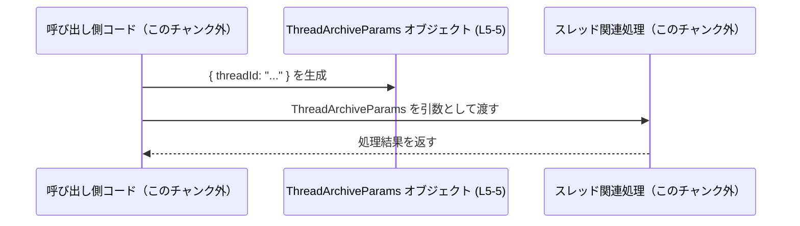

# app-server-protocol/schema/typescript/v2/ThreadArchiveParams.ts コード解説

## 0. ざっくり一言

- Rust 側の型から `ts-rs` によって自動生成された、`ThreadArchiveParams` という **1 フィールドだけを持つオブジェクト型エイリアス**を定義するファイルです (ThreadArchiveParams.ts:L1-5)。
- 型名からは「スレッドをアーカイブする処理のパラメータ」を表すと解釈できますが、このファイル単体からは実際の利用箇所や意味までは分かりません。

---

## 1. このモジュールの役割

### 1.1 概要

- このモジュールは、TypeScript で `ThreadArchiveParams` という公開型を 1 つだけ提供しています (ThreadArchiveParams.ts:L5-5)。
- コメントから、このファイルは Rust 用ライブラリ `ts-rs` によって自動生成されており、手動編集は想定されていません (ThreadArchiveParams.ts:L1-3)。
- 実行時のロジックや関数は一切含まれておらず、「型情報のみ」を提供する役割です。

### 1.2 アーキテクチャ内での位置づけ

コメントおよびファイルパスから読み取れる範囲で、このファイルの位置づけは次のように整理できます。


- `// This file was generated by [ts-rs] ...` というコメントにより、Rust 側の型定義が存在し、それを `ts-rs` が TypeScript 型に変換していることが分かります (ThreadArchiveParams.ts:L3-3)。
- 本ファイルで定義された `ThreadArchiveParams` 型は、TypeScript 側のコード（具体的なファイル名はこのチャンクには現れない）から参照されることが想定されます。

### 1.3 設計上のポイント

- **自動生成であり非編集前提**  
  - 先頭コメントで「GENERATED CODE」「Do not edit this file manually」と明示されています (ThreadArchiveParams.ts:L1-3)。
- **型エイリアスによる単純なオブジェクト表現**  
  - `export type ThreadArchiveParams = { threadId: string, };` として、1 プロパティだけを持つオブジェクト型をそのままエイリアスしています (ThreadArchiveParams.ts:L5-5)。
- **状態やロジックを持たない**  
  - クラス・関数・メソッド・内部状態を一切持たず、静的な型情報だけを提供します (ThreadArchiveParams.ts:L5-5)。
- **エラーハンドリングや並行性の要素はなし**  
  - 実行コードがないため、エラー処理・例外処理・非同期処理・並行処理などは、このファイルの責務には含まれていません。

---

## 2. 主要な機能一覧

このファイルは 1 つのエクスポートのみを提供します。

- `ThreadArchiveParams` 型: `threadId` プロパティを含むオブジェクト型エイリアスです。名前から、スレッドアーカイブ関連のパラメータを表す用途が想定されますが、利用先はこのチャンクには現れません (ThreadArchiveParams.ts:L5-5)。

※ このファイルには関数・クラス・列挙体などは定義されていません (ThreadArchiveParams.ts:L1-5)。

---

## 3. 公開 API と詳細解説

### 3.1 型一覧（構造体・列挙体など）

#### コンポーネントインベントリー

| 名前                 | 種別                       | 主なフィールド          | 役割 / 用途（推測を含む）                                                                                  | 定義位置                               |
|----------------------|----------------------------|-------------------------|------------------------------------------------------------------------------------------------------------|----------------------------------------|
| `ThreadArchiveParams`| オブジェクト型エイリアス   | `threadId: string`     | スレッド関連操作（名前からはアーカイブ操作と推測）のパラメータを表す単純なオブジェクト型。ただし利用箇所は不明。 | ThreadArchiveParams.ts:L5-5            |

#### フィールド詳細

`ThreadArchiveParams` のオブジェクト構造は次の 1 フィールドだけです (ThreadArchiveParams.ts:L5-5)。

| フィールド名 | 型       | 必須/任意 | 説明 / 制約（分かる範囲）                                                                                             | 根拠 |
|--------------|----------|-----------|------------------------------------------------------------------------------------------------------------------------|------|
| `threadId`   | `string` | 必須      | スレッドを一意に識別する ID を表す文字列と解釈できますが、フォーマットや意味はこのファイルからは分かりません。         | ThreadArchiveParams.ts:L5-5 |

- TypeScript のルール上、このプロパティには `?` が付いていないため「必須プロパティ」です (ThreadArchiveParams.ts:L5-5)。
- `string` 型であり、型レベルでは空文字かどうか・フォーマット・存在確認などの検証は行っていません。
- `strictNullChecks` の設定によって `null` / `undefined` の扱いは変わりますが、このファイルからコンパイラ設定は分かりません。

**安全性・エラー観点（型レベル）**

- `threadId` が `string` として宣言されているため、TypeScript の型チェックが有効な環境では、数値やオブジェクトなど誤った型を渡した場合にコンパイルエラーになります (ThreadArchiveParams.ts:L5-5)。
- 一方で、`threadId` の内容（存在する ID かどうかなど）までは型では保証できないため、実行時の検証が別途必要になります。

### 3.2 関数詳細（最大 7 件）

- このファイルには関数・メソッド・コンストラクタなどの「実行可能な API」は一切定義されていません (ThreadArchiveParams.ts:L1-5)。
- したがって、関数詳細テンプレートに従って説明できる対象はありません。

### 3.3 その他の関数

- 該当なし（ヘルパー関数やラッパー関数も定義されていません）(ThreadArchiveParams.ts:L1-5)。

---

## 4. データフロー

### 4.1 代表的なデータの流れ（概念図）

`ThreadArchiveParams` はデータ構造のみなので、典型的には「呼び出し側が `threadId` を設定してオブジェクトを作成し、それをどこかの処理に渡す」形で使われると考えられます。

このファイルからは実際の処理名や API 名は分からないため、ここでは一般的な利用イメージとして概念図を示します。



- `Params` 参加者が、`ThreadArchiveParams` 型のオブジェクトであることを明示しています (ThreadArchiveParams.ts:L5-5)。
- `Caller` と `Handler` は、このチャンクには現れない別ファイルの機能を表す抽象的な存在です。具体的な関数・メソッド名や API 名は不明です。

### 4.2 Bugs / Security 観点

- このファイル自体には実行時コードがないため、ここだけを見たときに直接的なバグやセキュリティホールは存在しません (ThreadArchiveParams.ts:L1-5)。
- 一方で、`threadId` が単なる `string` であることから、**型レベルでは ID のフォーマットや存在検証は行われていない**点に注意が必要です (ThreadArchiveParams.ts:L5-5)。
  - たとえば、空文字列や不正な ID 文字列も `string` としては受け入れられます。
  - セキュリティ的な検証（アクセス権、存在確認、フォーマットチェックなど）は、この型を使う側のロジックで行う必要があります。

---

## 5. 使い方（How to Use）

### 5.1 基本的な使用方法

`ThreadArchiveParams` を使ってオブジェクトを作り、どこかの関数に渡す、という基本パターンの例です。関数名やパスはあくまで例であり、このチャンクには現れません。

```typescript
// ThreadArchiveParams 型をインポートする                         // 型定義を利用可能にする
import type { ThreadArchiveParams } from "./ThreadArchiveParams";   // 実際の相対パスはプロジェクト構成に依存する

// ThreadArchiveParams 型の値を作成する                            // 必須フィールド threadId を指定してオブジェクトを生成
const params: ThreadArchiveParams = {
    threadId: "thread-1234",                                         // スレッドを識別する ID 文字列（内容の検証は別途必要）
};

// 何らかのスレッドアーカイブ処理に渡す                            // archiveThread はこのファイル外で定義される想定の関数
archiveThread(params);                                               // コンパイル時に params の構造がチェックされる
```

- `threadId` を指定しない場合、TypeScript の型チェックでコンパイルエラーになります（`ThreadArchiveParams` には必須プロパティのみが定義されているため）(ThreadArchiveParams.ts:L5-5)。
- `archiveThread` 関数自体はこのファイルには存在せず、ここでは利用イメージを示しているだけです。

### 5.2 よくある使用パターン

1. **インラインで渡す**

```typescript
// 関数呼び出しの際にインラインでオブジェクトを渡す            // 一時的に ThreadArchiveParams の形のオブジェクトを作る
archiveThread({                                                      
    threadId: "thread-5678",                                         // このオブジェクトリテラルが ThreadArchiveParams として型チェックされる
} satisfies ThreadArchiveParams);                                    // satisfies で構造が ThreadArchiveParams に適合するか検証
```

1. **ヘルパー関数で生成する**

```typescript
// ThreadArchiveParams を作る専用関数                             // 型注釈により戻り値が ThreadArchiveParams であることを明示
function buildThreadArchiveParams(threadId: string): ThreadArchiveParams {
    return { threadId };                                             // フィールド名と引数名が同じため省略記法で代入
}

// 呼び出し側                                                      // 上記ヘルパーで一貫した作り方を共有できる
const params = buildThreadArchiveParams("thread-9999");
archiveThread(params);
```

- いずれのパターンでも、`ThreadArchiveParams` の構造（`threadId: string`）がコンパイル時に確認されるため、誤ったフィールド名や型のミスを早期に検知できます (ThreadArchiveParams.ts:L5-5)。

### 5.3 よくある間違い

1. **必須フィールドを省略してしまう**

```typescript
// 間違い例: threadId を指定していない                          // ThreadArchiveParams の必須フィールドを欠いている
const badParams: ThreadArchiveParams = {};                           // TypeScript がコンパイルエラーとする
```

1. **型の不一致**

```typescript
// 間違い例: threadId を number で指定している                  // 型定義では string が要求されている
const badParams2: ThreadArchiveParams = {
    // @ts-expect-error: 型エラーの例                              // コンパイラは number を string には代入できないと判断する
    threadId: 1234,
};
```

1. **プロパティ名のスペルミス**

```typescript
// 間違い例: プロパティ名を間違えている                          // threadID ではなく threadId が正しい
const badParams3: ThreadArchiveParams = {
    // @ts-expect-error                                           // 型定義に存在しないプロパティ名
    threadID: "thread-1",
};
```

これらはすべて、`ThreadArchiveParams` の型定義があることでコンパイル時に検出されます (ThreadArchiveParams.ts:L5-5)。

### 5.4 使用上の注意点（まとめ）

- **必須フィールド**  
  - `threadId` は必須フィールドであり、指定を省略するとコンパイルエラーになります (ThreadArchiveParams.ts:L5-5)。
- **値の妥当性は別途検証が必要**  
  - 型としては単なる `string` であり、空文字や不正フォーマットを禁止するルールは含まれません。実行時に必要な検証を行う必要があります。
- **自動生成ファイルであること**  
  - 直接この型を編集するのではなく、元となる Rust 側の型定義を変更して `ts-rs` に再生成させることが前提です (ThreadArchiveParams.ts:L1-3)。
- **並行性 / 非同期性**  
  - この型自体は純粋なデータコンテナであり、非同期処理や並行性に関する懸念（スレッドセーフティなど）は持ちません。そうした考慮は、この型を使う処理側で行われます。

---

## 6. 変更の仕方（How to Modify）

### 6.1 新しい機能を追加する場合

このファイルは自動生成されており、「手で編集しないこと」が明示されています (ThreadArchiveParams.ts:L1-3)。したがって、通常は次の方針になります。

1. **Rust 側のモデル型を変更する**  
   - `ts-rs` による自動生成であるため、元の Rust 型（このチャンクには定義が現れない）にフィールドを追加・変更します。
2. **`ts-rs` を再実行する**  
   - 自動生成プロセス（ビルドスクリプトやコマンド）を実行し、TypeScript 側の型定義を再生成します。
3. **利用側コードを更新する**  
   - 追加・変更されたフィールドに対応するよう、TypeScript 側の呼び出しコードも修正します。

このファイルを直接編集すると、次回の自動生成時に上書きされる可能性が高く、変更が失われる点に注意が必要です (ThreadArchiveParams.ts:L1-3)。

### 6.2 既存の機能を変更する場合

`threadId` フィールドの意味や型を変更したい場合も、基本的には同様です。

- **影響範囲**  
  - `ThreadArchiveParams` を利用しているすべての TypeScript コードに影響します。どのファイルが利用しているかは、このチャンクには現れません。
- **契約（Contract）の確認**  
  - `ThreadArchiveParams` が「何を表すか」（たとえば「必ず既存スレッドの ID」である、といった前提）は、このファイルからは分からないため、利用側コードとサーバ側実装の仕様を確認する必要があります。
- **テスト**  
  - このファイルにはテストコードは含まれていません (ThreadArchiveParams.ts:L1-5)。型変更時は、利用側のテスト（API テスト・統合テストなど）を更新する必要があります。

---

## 7. 関連ファイル

このチャンクには他ファイルへの直接の参照はありませんが、構成から推測できる範囲を整理します。

| パス                                                   | 役割 / 関係                                                                                          |
|--------------------------------------------------------|------------------------------------------------------------------------------------------------------|
| `app-server-protocol/schema/typescript/v2/ThreadArchiveParams.ts` | 本ファイル自身。`ThreadArchiveParams` 型を定義する自動生成 TypeScript ファイルです (ThreadArchiveParams.ts:L1-5)。 |

- ディレクトリ名 `schema/typescript/v2` から、このファイルと類似した「v2 スキーマの TypeScript 型定義」が他にも存在する可能性がありますが、具体的なファイル名や内容はこのチャンクには現れません。
- 元となる Rust 側の型定義ファイル（`ts-rs` の入力）は、この TypeScript ファイルからは特定できませんが、コメントにより存在が示唆されています (ThreadArchiveParams.ts:L3-3)。

---

以上が、このファイルに基づいて客観的に説明できる範囲の内容です。
