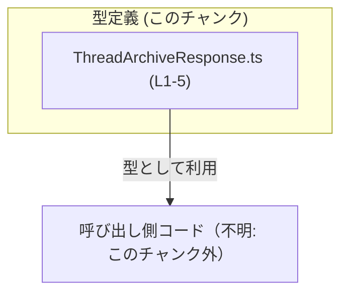
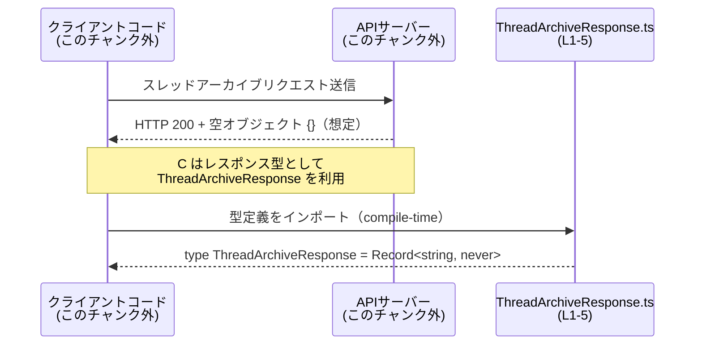

# app-server-protocol/schema/typescript/v2/ThreadArchiveResponse.ts

## 0. ざっくり一言

`ThreadArchiveResponse` という **スレッドアーカイブ API のレスポンス用の型エイリアス** を 1 つだけ公開する、自動生成された TypeScript 型定義ファイルです（`ThreadArchiveResponse.ts:L1-5`）。

---

## 1. このモジュールの役割

### 1.1 概要

- このモジュールは、`ThreadArchiveResponse` という型エイリアスを通じて、ある API のレスポンスが「**構造的には空オブジェクトであること**」を表現します（`ThreadArchiveResponse.ts:L5-5`）。
- ファイル先頭のコメントから、`ts-rs` によって自動生成されており、**手動で編集しないこと**が前提になっています（`ThreadArchiveResponse.ts:L1-3`）。

### 1.2 アーキテクチャ内での位置づけ

このファイル自身は型定義のみを提供し、関数や実行ロジックは含みません（`ThreadArchiveResponse.ts:L5-5`）。  
呼び出し側（API クライアントやサーバーコード）がこの型をインポートして利用すると想定されますが、どこから参照されているかはこのチャンクからは分かりません（このチャンクには現れません）。

依存関係を単純化して図示すると、次のようになります。



### 1.3 設計上のポイント

- **自動生成コード**であり、コメントで「手動で編集しない」ことが明示されています（`ThreadArchiveResponse.ts:L1-3`）。
- 公開されているのは **型エイリアス 1 つのみ** で、実行時の状態やビジネスロジックは一切持ちません（`ThreadArchiveResponse.ts:L5-5`）。
- 型は `Record<string, never>` で定義されており、「**キーは任意の文字列だが値は `never`（到達不能な型）**」という形で、実質的に「値を持たないオブジェクト」を表現しています（`ThreadArchiveResponse.ts:L5-5`）。

---

## 2. 主要な機能一覧

このモジュールが提供する機能は、型定義 1 件のみです。

- `ThreadArchiveResponse` 型定義: スレッドアーカイブ API のレスポンスが**空のオブジェクト（もしくは値を持たない構造）**であることを表現する（`ThreadArchiveResponse.ts:L5-5`）。

---

## 3. 公開 API と詳細解説

### 3.1 型一覧（構造体・列挙体など）

このファイルで公開されている型は次の 1 つです。

| 名前                     | 種別        | 役割 / 用途                                                                                 | 根拠 |
|--------------------------|-------------|----------------------------------------------------------------------------------------------|------|
| `ThreadArchiveResponse` | 型エイリアス | スレッドアーカイブ処理のレスポンスが「構造的に中身を持たないオブジェクト」であることを表す | `app-server-protocol/schema/typescript/v2/ThreadArchiveResponse.ts:L5-5` |

**型の意味（TypeScript 観点）**

```ts
export type ThreadArchiveResponse = Record<string, never>;
```

- `Record<K, V>` は「キー `K` に対して値 `V` を持つオブジェクト型」を表すユーティリティ型です。
- `Record<string, never>` は「任意の文字列キーを持ちうるが、その値の型は `never`」という型を表します（`ThreadArchiveResponse.ts:L5-5`）。
- `never` は「決して発生しない値」を表す TypeScript の特殊な型であり、「そのプロパティを実際に読む／書くことはない」という意図を表すのに使われます。

TypeScript の構造的型付けにおいては、プロパティを持たない `{}` 型のオブジェクトも、`Record<string, never>` に代入できるため、**実質「空レスポンス」を表現する目的に使われている**と解釈できます（この部分は TypeScript の仕様に基づく解釈であり、ビジネス的な意図まではコードからは断定できません）。

### 3.2 関数詳細（最大 7 件）

このファイルには関数・メソッドの定義は一切ありません（`ThreadArchiveResponse.ts:L1-5`）。  
したがって、詳細テンプレートで解説すべき公開関数は **0 件** です。

### 3.3 その他の関数

補助関数・ラッパー関数も存在しません（`ThreadArchiveResponse.ts:L1-5`）。

---

## 4. データフロー

このモジュールは型定義のみを提供し、値の生成や加工を行う処理は含みません（`ThreadArchiveResponse.ts:L1-5`）。  
そのため、このファイル単体の内部で完結するデータフローは存在しません。

一方で、**典型的な利用シナリオ**（推測を含みますが TypeScript の一般的な使い方として）は次のように考えられます。

1. API サーバー側がスレッドをアーカイブするエンドポイントを提供する。
2. クライアントまたは SDK がこのエンドポイントを呼び出し、そのレスポンス型として `ThreadArchiveResponse` を利用する。
3. レスポンスには特にペイロードがなく、「成功した」という事実だけ（ステータスコードなど）を扱う。

この想定フローを図示すると、次のようになります。



> 注: API サーバーやクライアントの具体的なコードはこのチャンクには現れないため、上記はあくまで一般的な利用像の説明です。「どの関数からどのように呼ばれるか」は不明です。

---

## 5. 使い方（How to Use）

### 5.1 基本的な使用方法

この型は、**スレッドアーカイブ処理のレスポンス型**として使われることが想定されます。  
簡単な利用例を TypeScript で示します（呼び出し側コードはこのチャンクには存在しないため、あくまでサンプルです）。

```typescript
// 型定義をインポートする
import type { ThreadArchiveResponse } from "./schema/typescript/v2/ThreadArchiveResponse"; // パスはプロジェクト構成に応じて変更

// スレッドをアーカイブする関数の戻り値として利用する例
async function archiveThread(threadId: string): Promise<ThreadArchiveResponse> {
    // 実際の HTTP リクエスト処理は省略
    // const res = await httpClient.post(`/threads/${threadId}/archive`);

    // スキーマ上、レスポンスに有意味なプロパティがない場合、
    // 空オブジェクトを返す実装が多くなります
    const result: ThreadArchiveResponse = {}; // Record<string, never> として型チェックされる

    return result;
}
```

この例では、**戻り値が空オブジェクトであることを型レベルで表現しつつ、将来の変更に備えて型を一元管理する**目的で `ThreadArchiveResponse` を利用しています。

### 5.2 よくある使用パターン

1. **API クライアントの戻り値型として使用**

   ```typescript
   import type { ThreadArchiveResponse } from "./ThreadArchiveResponse";

   async function archiveThreadApi(id: string): Promise<ThreadArchiveResponse> {
       // HTTP クライアント実装は仮
       const res = await fetch(`/threads/${id}/archive`, {
           method: "POST",
       });

       // ここではペイロードを特に利用しない想定
       await res.json(); // 実際には {} が返ることを期待（仕様次第）

       return {}; // ThreadArchiveResponse 型で返す
   }
   ```

2. **`void` の代わりに「空オブジェクトレスポンス」を明示する**

   - 単に処理結果が「成功したかどうか」だけの場合、戻り値を `Promise<void>` とする方法もあります。
   - しかし、**プロトコル定義上は「JSON オブジェクトとして空を返す」**といった契約がある場合、それを TypeScript 側では `ThreadArchiveResponse` として扱うことで、**プロトコルとコードの整合性**を保ちやすくなります。

### 5.3 よくある間違い

この型の性質上、次のような誤用が起こりやすいです。

```typescript
import type { ThreadArchiveResponse } from "./ThreadArchiveResponse";

// 間違い例: プロパティ付きのオブジェクトを返す
const bad: ThreadArchiveResponse = {
    archivedAt: "2024-01-01T00:00:00Z", // 設計上は存在しないはずのプロパティ
    // ↑ 厳格な型設定（noImplicitAny, exactOptionalPropertyTypes 等）では
    //   LSP やビルド時に警告／エラーになる可能性があります
};
```

正しい例（型の意図を守る場合）:

```typescript
import type { ThreadArchiveResponse } from "./ThreadArchiveResponse";

// 正しい例: 空オブジェクトを代入
const ok: ThreadArchiveResponse = {};
```

TypeScript の構造的型システム上、コンパイラ設定によってはプロパティ付きのオブジェクトも許容される可能性がありますが、  
**この型は「意味のあるプロパティを持たないレスポンス」を表している**と解釈されるため、プロトコル仕様に従うなら空オブジェクトを扱うのが自然です。

### 5.4 使用上の注意点（まとめ）

- このファイルは `ts-rs` による自動生成コードであり、**直接編集しない**ことがコメントで明示されています（`ThreadArchiveResponse.ts:L1-3`）。
- `ThreadArchiveResponse` は **実行時の安全性やエラー処理を直接提供するものではなく、コンパイル時の型チェックを目的とした定義**です（`ThreadArchiveResponse.ts:L5-5`）。
- 値の型が `never` であることから、**この型に意味のあるプロパティを追加して使うことは、型の意図と矛盾する**可能性があります。
- 並行性・非同期性に関する機能や制約は一切含まれていません（このチャンクには現れません）。

---

## 6. 変更の仕方（How to Modify）

### 6.1 新しい機能を追加する場合

このファイルは自動生成であり、コメントに「手動で編集しない」と明記されています（`ThreadArchiveResponse.ts:L1-3`）。  
そのため、**新しいプロパティや仕様変更を反映したい場合は、この TypeScript ファイルではなく、`ts-rs` の生成元（おそらく Rust 側の構造体や型定義）を変更する必要があります**。生成元の具体的な場所はこのチャンクには現れないため不明です。

一般的な変更手順（推測を含みます）:

1. Rust 側で `ThreadArchiveResponse` に対応する構造体や型を探す（このチャンクからは場所不明）。
2. その型に新しいフィールドを追加／型を変更する。
3. `ts-rs` を再実行して TypeScript 側の定義を再生成する。
4. 生成された `ThreadArchiveResponse.ts` をバージョン管理にコミットする。

### 6.2 既存の機能を変更する場合

- **型を直接書き換えない**  
  コメントにある通り、手動修正すると次回の自動生成で上書きされる可能性があります（`ThreadArchiveResponse.ts:L1-3`）。
- 影響範囲の確認
  - `ThreadArchiveResponse` をインポートしているファイル（呼び出し側コード）を検索し、フィールド追加などによる影響を確認する必要があります。
  - このチャンクには呼び出し側が現れないため、どこで使われているかは不明です。
- 契約（Contract）
  - 「レスポンスは空オブジェクトである」という前提を変更すると、API プロトコルそのものの変更になる可能性があります。
  - 仕様書や他言語のスキーマ定義（Rust 側や OpenAPI 等）があれば、そちらと整合性を取る必要があります。

---

## 7. 関連ファイル

このチャンクには、他のファイルパスやインポート文が一切含まれていないため、**直接の関連ファイルは特定できません**（`ThreadArchiveResponse.ts:L1-5`）。

推測される関連（ただし、このチャンクには現れません）:

| パス                          | 役割 / 関係                                  |
|-------------------------------|----------------------------------------------|
| Rust 側の `ThreadArchiveResponse` 相当の型 | `ts-rs` がこのファイルを生成するための元定義 |
| API クライアント／サーバーコード | `ThreadArchiveResponse` をインポートして利用 |

> 上記の具体的なファイル名や場所は、このチャンクからは分かりません。「不明」となります。

---

### コンポーネントインベントリー（まとめ）

最後に、このチャンクに現れるコンポーネントを一覧にしておきます。

| 種別        | 名前                     | 説明                                                         | 根拠 |
|-------------|--------------------------|--------------------------------------------------------------|------|
| 型エイリアス | `ThreadArchiveResponse` | スレッドアーカイブレスポンスを表す `Record<string, never>` 型 | `app-server-protocol/schema/typescript/v2/ThreadArchiveResponse.ts:L5-5` |
| コメント    | 自動生成コード警告       | 「GENERATED CODE」「Do not edit manually」の注意書き         | `app-server-protocol/schema/typescript/v2/ThreadArchiveResponse.ts:L1-3` |

このファイルには関数・クラス・列挙体・インポート文などは存在しません（`ThreadArchiveResponse.ts:L1-5`）。
