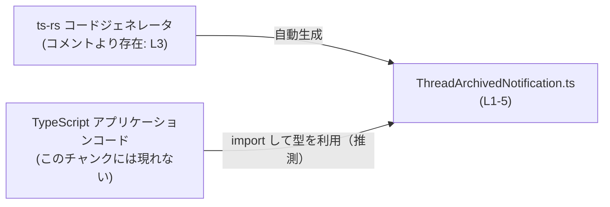
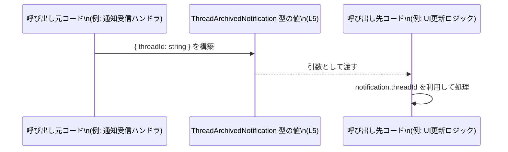

# app-server-protocol\schema\typescript\v2\ThreadArchivedNotification.ts

## 0. ざっくり一言

`ThreadArchivedNotification` という名前の TypeScript 型エイリアス（`type`）を 1 つだけ定義し、`threadId: string` を持つオブジェクトの形を表現する自動生成ファイルです（`ThreadArchivedNotification.ts:L1-5`）。

---

## 1. このモジュールの役割

### 1.1 概要

- このモジュールは、`ThreadArchivedNotification` 型の構造を TypeScript 上で定義するためのファイルです（`ThreadArchivedNotification.ts:L5-5`）。
- ファイル先頭のコメントから、この型定義は Rust 側の型から `ts-rs` によって自動生成されており、手動で編集しないことが前提になっています（`ThreadArchivedNotification.ts:L1-3`）。

### 1.2 アーキテクチャ内での位置づけ

- コメントにより「自動生成コード」であることと「`ts-rs` による生成」であることが明示されています（`ThreadArchivedNotification.ts:L1-3`）。
- ディレクトリパス `app-server-protocol\schema\typescript\v2` から、プロトコル用のスキーマ定義群の一部である可能性がありますが、このチャンクには他モジュールや利用箇所は現れていません。

参考イメージとして、この型定義がどこから来て、どこで使われるかの概念的な関係を示します（**利用側や Rust 側の具体的なファイル名はこのチャンクには現れず、あくまで一般的なイメージです**）。



### 1.3 設計上のポイント

- **自動生成であること**
  - 「GENERATED CODE」「Do not edit this file manually」といったコメントがあり（`ThreadArchivedNotification.ts:L1-3`）、人手による直接編集を想定していません。
- **単一責務**
  - このファイルは 1 つの型エイリアス `ThreadArchivedNotification` のみをエクスポートし（`ThreadArchivedNotification.ts:L5-5`）、他の関数・クラス・ロジックは含んでいません。
- **状態やロジックを持たない**
  - フィールド定義のみで、メソッドや計算処理が存在しません。したがって実行時の副作用や状態遷移もありません。
- **TypeScript の型安全性を利用**
  - `threadId` は `string` 型と明示されており（`ThreadArchivedNotification.ts:L5-5`）、コンパイル時に型ミスマッチを検知できます。ただし実行時のバリデーションは含まれていません。

---

## 2. 主要な機能一覧

このファイルが提供する主要な「機能」は、1 つの型定義のみです。

- `ThreadArchivedNotification` 型定義: `threadId: string` を持つオブジェクト型を表現するエクスポート済み型エイリアスです（`ThreadArchivedNotification.ts:L5-5`）。

---

## 3. 公開 API と詳細解説

### 3.1 型一覧（構造体・列挙体など）

このチャンクに現れる型のインベントリー（一覧）です。

| 名前 | 種別 | 役割 / 用途 | 定義位置 |
|------|------|-------------|----------|
| `ThreadArchivedNotification` | 型エイリアス (`type`) | `threadId` プロパティを 1 つ持つオブジェクトの形を表現します。具体的な用途・利用箇所はこのチャンクには現れません。 | `ThreadArchivedNotification.ts:L5-5` |

#### `ThreadArchivedNotification`

**概要**

- フィールド `threadId: string` を 1 つ持つオブジェクトを表す TypeScript の型エイリアスです（`ThreadArchivedNotification.ts:L5-5`）。
- 名前からは「あるスレッドのアーカイブに関する通知ペイロード」を表す可能性が示唆されますが、その意味づけや利用方法はこのファイル単体からは確定できません。

**構造**

```typescript
export type ThreadArchivedNotification = {               // 型エイリアスの定義（L5）
    threadId: string,                                    // threadId プロパティ: string 型
};
```

- オブジェクトのプロパティは 1 つだけです。
  - `threadId`: 文字列型。ID の形式や非空などの制約は型レベルでは付与されていません（`ThreadArchivedNotification.ts:L5-5`）。

**Contracts（契約・前提）**

この型から読み取れる「契約」は次のようになります。

- すべての `ThreadArchivedNotification` 値は、少なくとも `threadId` というキーを持ち、その値は `string` である（`ThreadArchivedNotification.ts:L5-5`）。
- `threadId` が空文字かどうか、特定の形式かどうかなどは、この型定義からは分かりません（制約はありません）。

**Edge cases（エッジケース）**

型定義のみで実行時ロジックはありませんが、TypeScript の観点から考えられる典型的なケースは次の通りです。

- `threadId` が `number` など `string` 以外の型で代入される:
  - コンパイル時に型エラーとなります。
- `threadId` プロパティ自体が存在しないオブジェクトをこの型として扱おうとする:
  - 代入時や関数引数として利用する場合、コンパイル時に型エラーとなります。
- 空文字 `""` やフォーマット不正な文字列:
  - `string` である限り型チェックは通ります。内容の妥当性は呼び出し側で検証する必要があります。

**言語固有の安全性 / エラー / 並行性**

- **型安全性**
  - TypeScript の静的型検査により、`threadId` に `string` 以外を代入するとコンパイルエラーになります。
- **エラー**
  - この型自体はエラーや例外を発生させません。
  - 実行時に外部入力（JSON など）を `ThreadArchivedNotification` として扱う場合、実際に `threadId` が存在しなかったり `string` でなかったりすると、後続コードが `notification.threadId` を前提にアクセスした時点で `undefined` 参照などの実行時エラーが発生しうるため、利用側でのランタイムバリデーションが重要になります。
- **並行性**
  - この型は単なるデータ構造の定義であり、スレッドや非同期処理に関するロジックは一切含みません。
  - JavaScript/TypeScript の一般的なモデルでは単一スレッドのイベントループ上で扱われるため、この型が直接データレースなどの並行性問題を引き起こすことはありません。ただし、共有オブジェクトとして複数箇所で書き換える場合の管理は利用側の責務です。

### 3.2 関数詳細（最大 7 件）

- このファイルには関数・メソッド・クラスの定義は存在しません（`ThreadArchivedNotification.ts:L1-5`）。
- そのため、本セクションで詳細解説すべき関数はありません。

### 3.3 その他の関数

- 補助関数やラッパー関数も一切定義されていません（`ThreadArchivedNotification.ts:L1-5`）。

---

## 4. データフロー

このファイルには他モジュールとの呼び出し関係や処理フローは記述されていませんが、`ThreadArchivedNotification` 型がどのように流れるかの **一般的な利用イメージ** を示します。  
※以下は TypeScript コードにおける典型的な使い方の例であり、このリポジトリ内の具体的な実装を表すものではありません。



このイメージでの要点:

- 呼び出し元（例えばサーバからの通知を受け取る部分）が外部入力（JSON など）をパースし、`ThreadArchivedNotification` として扱える形 `{ threadId: string }` を構築します。
- その値を引数として別の処理（UI 更新、状態管理など）に渡します。
- 後続処理は `threadId` が必ず `string` として存在すると仮定して処理を書けます。  
  ただし、この前提を満たすこと（外部入力の検証）はこの型自体ではなく利用側の責務です。

---

## 5. 使い方（How to Use）

### 5.1 基本的な使用方法

`ThreadArchivedNotification` 型を利用する典型的なパターンの例です。

```typescript
// ThreadArchivedNotification 型をインポートする
// 実際のパスはプロジェクト構成に依存するため例示です。
import type { ThreadArchivedNotification } from "./ThreadArchivedNotification";

// 通知を処理する関数の例
function handleThreadArchived(                           // 通知を処理する関数
    notification: ThreadArchivedNotification,            // 引数に ThreadArchivedNotification 型を指定
): void {                                                // 戻り値は何も返さない
    // threadId は string 型として扱える
    console.log("Archived thread ID:", notification.threadId);
    // ここで UI 更新や状態管理などを行うイメージ
}
```

- このように型注釈を付けることで、IDE の補完とコンパイル時の型チェックが有効になります。
- 例えば `notification.threadId.toFixed(2)` のように数値専用メソッドを呼ぶとコンパイルエラーになり、誤用を早期に検出できます。

### 5.2 よくある使用パターン

#### 1. JSON からのパースと組み合わせる

外部から受け取った JSON を `ThreadArchivedNotification` として扱うパターンです。

```typescript
import type { ThreadArchivedNotification } from "./ThreadArchivedNotification";

function parseNotification(json: unknown): ThreadArchivedNotification | null {
    // ランタイムで最低限の型チェックを行う例
    if (
        typeof json === "object" && json !== null &&               // オブジェクトであることを確認
        "threadId" in json &&                                      // threadId プロパティが存在するか
        typeof (json as any).threadId === "string"                 // threadId が string 型かどうか
    ) {
        return json as ThreadArchivedNotification;                 // チェック後に型アサーション
    }
    return null;                                                   // 不正な場合は null を返す
}
```

- TypeScript の型はコンパイル時専用のため、外部入力に対してはこのような実行時チェックを行うことで、安全に `ThreadArchivedNotification` として扱うことができます。
- ここでの `as any` / `as ThreadArchivedNotification` は型アサーションであり、チェックをせずに使うのは安全ではありません。

#### 2. `Readonly` と組み合わせて不変データとして扱う

```typescript
import type { ThreadArchivedNotification } from "./ThreadArchivedNotification";

type ReadonlyThreadArchivedNotification =
    Readonly<ThreadArchivedNotification>;                        // すべてのプロパティを読み取り専用にする

function processNotification(
    notification: ReadonlyThreadArchivedNotification,            // 呼び出し側から変更されたくない場合に有効
): void {
    // notification.threadId = "new-id";                         // コンパイルエラー: Readonly
    console.log(notification.threadId);
}
```

- 論理的に不変なデータとして扱いたい場合、`Readonly` ユーティリティ型を使うと、誤った書き換えをコンパイル時に防止できます。

### 5.3 よくある間違い

#### 1. 必須プロパティの付け忘れ

```typescript
import type { ThreadArchivedNotification } from "./ThreadArchivedNotification";

// 間違い例: 必須の threadId を定義していない
const badNotification: ThreadArchivedNotification = {
    // threadId: "abc123", // 足りない
    // → コンパイル時にエラー: Property 'threadId' is missing ...
};
```

正しい例:

```typescript
const okNotification: ThreadArchivedNotification = {
    threadId: "abc123",                                        // string を指定する
};
```

#### 2. 型の不一致

```typescript
// 間違い例: threadId を number にしてしまう
const badNotification2: ThreadArchivedNotification = {
    // @ts-expect-error - number は string に代入できない
    threadId: 123,                                             // コンパイルエラー
};
```

### 5.4 使用上の注意点（まとめ）

- **実行時バリデーションが必要**
  - この型のみでは、外部からの入力データが本当に `threadId: string` の形になっているかは保証されません。外部 API や JSON からの入力には別途バリデーション処理が必要です。
- **内容の妥当性は別途チェック**
  - `string` であれば空文字や不正なフォーマットも受け入れられるため、「存在するだけで良い」のか「特定の形式に従うべきか」を利用側で決めて検証する必要があります。
- **セキュリティ**
  - この型自体には入力サニタイズや XSS・インジェクション対策などのセキュリティ機能はありません。`threadId` をそのまま HTML やログに出力する場合には、利用側で適切なエスケープを行う必要があります。
- **パフォーマンス / スケーラビリティ**
  - 単なる型定義であり、実行時コストはありません。巨大な配列で大量の `ThreadArchivedNotification` を扱う場合でも、パフォーマンスやメモリへの影響は主にランタイムのオブジェクト数に依存し、この型定義そのものがボトルネックになることはありません。

---

## 6. 変更の仕方（How to Modify）

### 6.1 新しい機能を追加する場合

このファイルはコメントで「自動生成されている」「手動で編集しない」と明記されています（`ThreadArchivedNotification.ts:L1-3`）。したがって、

- **直接この TypeScript ファイルを編集するのは前提とされていません。**
- `threadId` 以外の情報（例: アーカイブ日時など）を追加したい場合は、`ts-rs` の入力元である **Rust 側の型定義** を変更し、再生成する必要があります。  
  Rust 側の具体的なファイル名やモジュールはこのチャンクには現れないため、ここでは一般的な方針のみ述べます。

変更の一般的な手順（概念的なもの）:

1. Rust 側で `ThreadArchivedNotification` に相当する構造体や型を探す（`ts-rs` の属性が付いていることが多いですが、このチャンクからは不明です）。
2. Rust 側に新しいフィールド（例: `archived_at`）を追加する。
3. `ts-rs` を使って TypeScript ファイルを再生成する。
4. TypeScript 側で新しいフィールドが追加されたことを前提に利用コードを更新する。

### 6.2 既存の機能を変更する場合

例えば `threadId` の型を `string` から別のものに変えたい場合、次の点に注意が必要です。

- **影響範囲**
  - `ThreadArchivedNotification` 型を参照しているすべての TypeScript コードが影響を受けます。
  - API 互換性の観点から、外部とのインターフェースとして利用している場合は破壊的変更になる可能性があります。
- **契約の見直し**
  - 「`threadId` は必ず `string`」という前提が崩れるため、利用箇所のロジックや、外部仕様（API ドキュメントなど）も更新する必要があります。
- **テスト**
  - 変更後の構造に合わせて、外部入力のパース処理や通知処理のテストケースを見直す必要があります。  
    このチャンクにはテストコードは含まれていませんが、少なくとも JSON パースと型チェックの単体テストがあると安全です。

---

## 7. 関連ファイル

このチャンクから確実に分かる関連情報と、コメントから示唆される関連要素をまとめます。

| パス / 要素 | 役割 / 関係 |
|------------|------------|
| `app-server-protocol\schema\typescript\v2\ThreadArchivedNotification.ts` | 本ドキュメントの対象ファイル。`ThreadArchivedNotification` 型エイリアスを定義する自動生成 TypeScript ファイルです（`ThreadArchivedNotification.ts:L1-5`）。 |
| Rust 側の ts-rs 入力ファイル（パス不明） | コメントにより、`ts-rs` によって本ファイルが生成されていることが示されています（`ThreadArchivedNotification.ts:L3-3`）。元となる Rust の型定義がどこかに存在しますが、このチャンクには現れません。 |
| 同ディレクトリ内の他の `*.ts` スキーマファイル（名称不明） | ディレクトリ構成から、同様に `ts-rs` によって生成された他のプロトコルスキーマが存在する可能性がありますが、具体的なファイル名や内容はこのチャンクには現れません。 |

---

以上が、この自動生成ファイル `ThreadArchivedNotification.ts` に関して、このチャンクから読み取れる範囲での構造・役割・利用方法の整理です。
