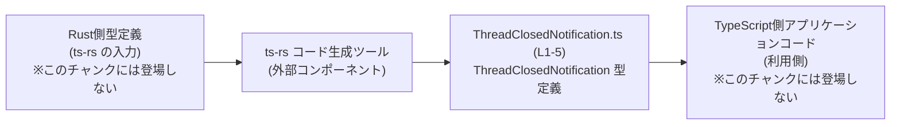
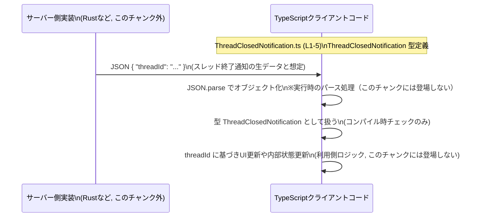

# app-server-protocol/schema/typescript/v2/ThreadClosedNotification.ts コード解説

## 0. ざっくり一言

- このファイルは、`threadId` という文字列プロパティを持つオブジェクト型 `ThreadClosedNotification` を **1つだけエクスポートする TypeScript の型定義ファイル**です（`ThreadClosedNotification.ts:L5-5`）。
- ファイル先頭のコメントから、[ts-rs](https://github.com/Aleph-Alpha/ts-rs) によって Rust 側の型から自動生成されたコードであり、**手作業での編集は禁止**であることが分かります（`ThreadClosedNotification.ts:L1-3`）。

---

## 1. このモジュールの役割

### 1.1 概要

- コメントとファイルパスから、このモジュールは **アプリケーションサーバー用プロトコルの TypeScript スキーマの一部**であると読み取れます（`ThreadClosedNotification.ts:L1-3`）。
- 型名 `ThreadClosedNotification` から、この型が **「スレッドが閉じられたことを通知するメッセージのペイロード」** を表していると解釈できます（名称からの推測であり、コード内に説明文はありません）。
- Rust 側の型定義を ts-rs で変換した **静的なコンパイル時型定義のみ**を提供し、実行時ロジックは一切含まれていません（`ThreadClosedNotification.ts:L5-5`）。

### 1.2 アーキテクチャ内での位置づけ

コメントより ts-rs による自動生成であることが明示されているため（`ThreadClosedNotification.ts:L1-3`）、概念的には次のような流れになります。



- `RustTypes` と `TSApp` の具体的なファイルやモジュールは、このチャンクには一切現れません。したがって、上記は **コメントとファイル名からの構造的な推測**であり、厳密な依存関係までは分かりません。
- 確定している事実は、「ts-rs により生成された `ThreadClosedNotification.ts` が存在し、その中で `ThreadClosedNotification` 型がエクスポートされている」という点だけです（`ThreadClosedNotification.ts:L1-5`）。

### 1.3 設計上のポイント

コードから読み取れる設計上の特徴は次の通りです。

- **自動生成コードであることが明示されている**  
  - `// GENERATED CODE! DO NOT MODIFY BY HAND!`（`ThreadClosedNotification.ts:L1-1`）  
  - `// This file was generated by ts-rs ... Do not edit this file manually.`（`ThreadClosedNotification.ts:L3-3`）  
  → 設計上、「このファイルは直接変更せず、生成元（Rust 側）を変更する」という運用前提になっています。
- **実行時の状態や処理を一切持たず、純粋な型定義のみ**  
  - `export type ThreadClosedNotification = { threadId: string, };`（`ThreadClosedNotification.ts:L5-5`）  
  → クラスや関数、定数定義はなく、コンパイル時にのみ存在する TypeScript の型エイリアス（type alias）です。
- **必須プロパティ `threadId: string` のみを持つシンプルなオブジェクト型**  
  - `threadId` は optional (`?`) ではなく必須プロパティです（`ThreadClosedNotification.ts:L5-5`）。  
  → 「通知には必ずスレッドIDが含まれる」という型レベルの契約を表現しています（意味内容は名前からの推測）。

---

## 2. 主要な機能一覧

このファイルが提供する機能は、次の 1 点に集約されます。

- `ThreadClosedNotification` 型定義:  
  `threadId: string` を持つオブジェクトの構造を TypeScript で表現する型エイリアスです（`ThreadClosedNotification.ts:L5-5`）。  
  ※「スレッドが閉じられたことの通知」という意味付けは型名からの推測であり、コード内に説明はありません。

---

## 3. 公開 API と詳細解説

### 3.1 型一覧（構造体・列挙体など）

このファイルに登場する公開型は次の 1 つです。

| 名前 | 種別 | 役割 / 用途 | フィールド概要 | 定義位置（根拠） |
|------|------|-------------|----------------|------------------|
| `ThreadClosedNotification` | 型エイリアス（オブジェクト型） | 型名から、「スレッドが閉じられたことを表す通知メッセージの構造」を表現すると解釈できます | `threadId: string`（必須。スレッドを識別するIDであると名称から推測できます） | `ThreadClosedNotification.ts:L5-5` |

> 注記:  
>
> - 役割・用途・フィールドの意味は **型名・プロパティ名からの推測**であり、このチャンクには説明コメントやドキュメントは存在しません。  
> - 確実に言えるのは、「`threadId` が string 型の必須プロパティであるオブジェクト型が定義されている」という点のみです（`ThreadClosedNotification.ts:L5-5`）。

#### `ThreadClosedNotification` 型の契約とエッジケース

**契約（型レベルで保証されること）**

- オブジェクトには **必ず `threadId` プロパティが存在する必要**があります（`ThreadClosedNotification.ts:L5-5`）。
- `threadId` の型は `string` であり、他の型（`number` や `null` など）を代入すると TypeScript のコンパイルエラーになります（TypeScript の型システムの仕様による一般的事実）。

**エッジケース（型が許容してしまう値）**

`threadId: string` という定義だけでは、次のような文字列もすべて許容されます（`ThreadClosedNotification.ts:L5-5`）。

- 空文字列 `""`
- 空白だけの文字列 `"   "`
- 意味のないランダムな文字列 `"foo"` など

これらを禁止する制約は型定義上は存在しません。  
もし「非空」「特定のフォーマット」といった制約が必要であれば、**別途実行時バリデーションやより精密な型（ブランド型など）**が必要ですが、このチャンクにはそのようなコードは存在しません。

**安全性（TypeScript 特有の観点）**

- この型は **コンパイル時のみ**存在し、生成された JavaScript には出力されません。  
  → 実行時に自動で型チェックやバリデーションが行われることはありません。
- したがって、外部から受け取った任意のデータを `ThreadClosedNotification` として扱う場合は、**実行時に自分で形式を検証する必要**があります。  
  （例: `zod` などのバリデーションライブラリ、もしくは手書きのチェック関数）

### 3.2 関数詳細（最大 7 件）

- このファイルには **関数・メソッド・クラスは一切定義されていません**（`ThreadClosedNotification.ts:L1-5`）。
- そのため、「関数詳細」テンプレートを適用できる対象はありません。

### 3.3 その他の関数

- 該当なし（このチャンクには関数やメソッド定義が存在しません）。

---

## 4. データフロー

このファイル自体には処理ロジックがないため、内部のデータフローは存在しません。  
一方で、**型としてどのように利用されるか**という観点で、一般的な利用イメージを示します。

> 重要:  
>
> - 以下の図は、「サーバーがスレッド終了通知を送り、クライアントが `ThreadClosedNotification` 型として扱う」という **典型的なパターンの推測**です。  
> - 実際にこのリポジトリがそのように使っているかどうかは、このチャンクからは分かりません。



要点:

- `ThreadClosedNotification.ts`（`ThreadClosedNotification.ts:L1-5`）は、**クライアント側で通知データを扱う際のコンパイル時型情報**を提供します。
- 実際の受信・パース・処理ロジックは、別のファイル（このチャンクの外）に実装される想定です。

---

## 5. 使い方（How to Use）

### 5.1 基本的な使用方法

`ThreadClosedNotification` 型を **関数の引数や戻り値の型として利用する**ことで、通知処理の型安全性を高めることができます。

```typescript
// ThreadClosedNotification 型をインポートする                           // このファイルの型を利用する
import type { ThreadClosedNotification } from "./ThreadClosedNotification"; // 相対パスは利用側のファイル位置に依存する

// スレッド終了通知を処理する関数を定義する                               // 通知を受け取って処理する関数
function handleThreadClosed(notification: ThreadClosedNotification): void {  // 引数に ThreadClosedNotification 型を指定
    // notification.threadId は string 型で必須プロパティ                  // 型により IDE 補完とコンパイル時チェックが効く
    console.log(`thread closed: ${notification.threadId}`);                  // 正しいプロパティ名を使わないとコンパイルエラーになる
}
```

- この例は **利用イメージ**であり、実際のプロジェクトでのパスや呼び出し元は、このチャンクからは分かりません。
- TypeScript の型は実行時には存在しないため、`handleThreadClosed` を呼び出す側が **正しい形のオブジェクトを渡すこと**が前提になります。

### 5.2 よくある使用パターン

1. **イベントハンドラの引数として使う**

```typescript
// WebSocket やイベントエミッタからスレッド終了イベントを受け取る想定の例
function onThreadClosedEvent(payload: ThreadClosedNotification) {      // イベントペイロードに型を付ける
    // payload.threadId が string であることがコンパイル時に保証される
    console.log("Closed thread:", payload.threadId);
}
```

1. **パースした JSON に型を付けて扱う**

```typescript
// JSON 文字列を受け取り、ThreadClosedNotification として扱う例
const json = '{"threadId":"abc123"}';                                // 受信した JSON 文字列
const obj = JSON.parse(json) as ThreadClosedNotification;            // 型アサーションで ThreadClosedNotification として扱う

// obj.threadId は string として扱えるが、実行時チェックは行われない
console.log(obj.threadId);
```

- 上記の `as ThreadClosedNotification` は **型アサーション**であり、実行時には一切の検証を行いません。  
  不正な形式の JSON が来ても、ランタイムエラーになるまで検出されない点に注意が必要です。

### 5.3 よくある間違い

**誤用例: 型を付けず `any` で受け取り、プロパティ名をタイプミスする**

```typescript
// 間違い例: 任意のオブジェクトとして扱い、プロパティ名をタイプミスしている
function onThreadClosed(data: any) {                         // any 型にすると型安全性が失われる
    console.log(data.threadID);                              // "threadID" というプロパティは存在しないかもしれない
    // ↑ コンパイル時にエラーにならず、実行時までバグに気付きにくい
}
```

**正しい例: `ThreadClosedNotification` 型を使う**

```typescript
// 正しい例: ThreadClosedNotification 型を使うことでプロパティ名の誤りをコンパイル時に検出できる
function onThreadClosed(data: ThreadClosedNotification) {    // 型を明示する
    console.log(data.threadId);                              // 正しいプロパティ名
    // もし data.threadID と書けばコンパイルエラーになる                // タイプミスを事前に防げる
}
```

### 5.4 使用上の注意点（まとめ）

- **必須プロパティ `threadId`**  
  - オブジェクトを `ThreadClosedNotification` として扱うには、必ず `threadId: string` を含める必要があります（`ThreadClosedNotification.ts:L5-5`）。
  - 省略すると TypeScript のコンパイルエラーになります。
- **実行時バリデーションは行われない**  
  - この型定義ファイルには実行時コードが存在しません（`ThreadClosedNotification.ts:L1-5`）。  
    そのため、外部からの入力に対しては別途バリデーションを実装する必要があります。
- **生成コードのため直接編集しない**  
  - コメントに「手で編集しない」旨が明記されています（`ThreadClosedNotification.ts:L1-3`）。  
    フィールドの追加・変更が必要な場合は、**生成元である Rust 側の型定義を変更し、ts-rs で再生成する**必要があります。
- **並行性やスレッド安全性について**  
  - このファイルは単なる型定義であり、状態や排他制御を持ちません。  
    並行性に関する問題は、この型を利用する実際の処理コード側で考慮することになります。

---

## 6. 変更の仕方（How to Modify）

### 6.1 新しい機能を追加する場合

ここでいう「新しい機能」は、例えば通知に追加情報（閉じた理由、タイムスタンプなど）を持たせるために **プロパティを追加したい場合**を想定します。

このファイルは自動生成コードであり、コメントで **手動編集禁止** が明示されているため（`ThreadClosedNotification.ts:L1-3`）、変更の入口は次のようになります。

1. **生成元の Rust 側型定義を特定する**  
   - `ts-rs` によって生成されていることから（`ThreadClosedNotification.ts:L3-3`）、Rust 側に `#[derive(TS)]` などが付いた構造体や型が存在すると推測されます。  
   - 具体的なファイルパスや型名はこのチャンクには現れないため、リポジトリ全体を検索して特定する必要があります。
2. **Rust 側の型にフィールドを追加する**  
   - 例: `reason: String` や `closed_at: DateTime` のようなフィールドを追加するなど。
3. **ts-rs によるコード生成プロセスを実行する**  
   - どのコマンドで生成しているか（`cargo run`、`build.rs` など）は、このチャンクには記載がありません。  
     プロジェクトの README や CI 設定などを参照して確認する必要があります。
4. **生成された TypeScript 側の変更を確認する**  
   - `ThreadClosedNotification.ts` に新しいプロパティが追加されていることを確認します。
5. **TypeScript 側の利用コードを更新する**  
   - 新しいプロパティを参照する・必須属性になった場合は対応するなど。  
   - どのファイルが `ThreadClosedNotification` を利用しているかは、このチャンクからは分かりませんので、IDE 検索などで洗い出す必要があります。

### 6.2 既存の機能を変更する場合

例えば `threadId` の型や名前を変更するような場合の注意点です。

- **影響範囲の確認**  
  - `ThreadClosedNotification` と `threadId` に依存する全ての TypeScript ファイルに影響が及びます。  
  - このチャンクには利用元の情報がないため、リポジトリ全体検索が必要です。
- **前提条件（契約）の変化**  
  - `threadId` の型を `string` から別の型に変えると、コンパイルエラーが多発する可能性があります（`ThreadClosedNotification.ts:L5-5`）。
  - プロパティ名を変更した場合も同様です。
- **テストの確認**  
  - このファイルに直接対応するテストコードは、このチャンクには存在しません。  
    型変更後は、関連するユニットテスト・統合テストがあれば再実行して問題ないことを確認する必要があります（テストファイルの場所は不明）。
- **運用上の注意**  
  - 通信プロトコルの一部である場合、サーバーとクライアント双方のバージョン整合性に影響します。  
    この点はコメントやコードから直接は読み取れませんが、ファイルパス `schema/typescript/v2` から **「v2 スキーマの一部」として扱われている可能性**はあります。

---

## 7. 関連ファイル

このチャンクには他ファイルの情報が含まれていないため、正確な一覧は分かりませんが、構造とコメントから推測できる関連要素を整理します。

| パス / コンポーネント | 役割 / 関係 |
|-----------------------|------------|
| `app-server-protocol/schema/typescript/v2/*.ts` | 同一ディレクトリ配下には、`ThreadClosedNotification` と同様に ts-rs で生成された他の TypeScript スキーマが存在すると推測されます。具体的なファイル名はこのチャンクには現れません。 |
| ts-rs 生成元の Rust ファイル（パス不明） | コメントより、この TypeScript 型は ts-rs によって Rust 側の型から生成されていることが分かります（`ThreadClosedNotification.ts:L3-3`）。ただし、どの Rust ファイル・型が元になっているかは、このチャンクからは分かりません。 |
| 対応するテストコード（存在不明） | `ThreadClosedNotification` 型専用のテストファイルが存在するかどうかは、このチャンクには情報がありません。通常は Rust 側のテストやプロトコル全体のテストで間接的に検証されることが多いと考えられます。 |

---

以上が、`app-server-protocol/schema/typescript/v2/ThreadClosedNotification.ts` に関して、このチャンクから客観的に読み取れる内容と、型の実用的な使い方・注意点の整理です。
