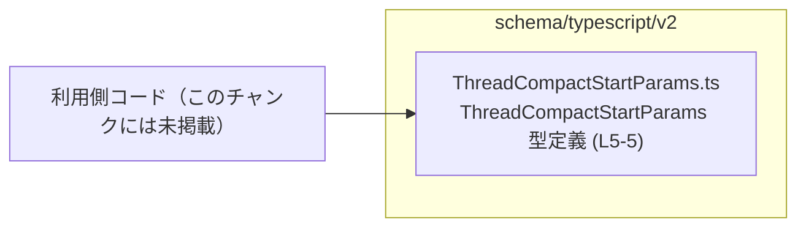
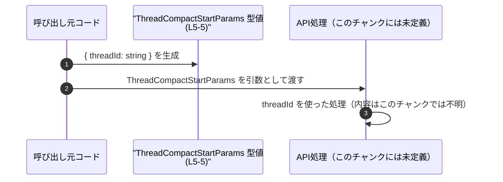

# app-server-protocol/schema/typescript/v2/ThreadCompactStartParams.ts

## 0. ざっくり一言

- `threadId: string` という 1 つのプロパティを持つオブジェクト型 `ThreadCompactStartParams` を `export type` で公開している、自動生成の TypeScript 型定義ファイルです。  
  根拠: 自動生成コメントと型定義本体（ThreadCompactStartParams.ts:L1-5）

---

## 1. このモジュールの役割

### 1.1 概要

- このモジュールは `ThreadCompactStartParams` という名前の型エイリアス（`export type`）を定義し、外部モジュールから参照できるように公開しています。  
  根拠: `export type ThreadCompactStartParams = { threadId: string, };`（ThreadCompactStartParams.ts:L5-5）
- `ThreadCompactStartParams` は必須プロパティ `threadId: string` を持つオブジェクト型です。  
  根拠: 同上（ThreadCompactStartParams.ts:L5-5）

※ 型名からは「ある種のスレッドに関する『start』操作のパラメータ」であることが想像されますが、その用途やどこから使われるかは、このファイルからは分かりません。

### 1.2 アーキテクチャ内での位置づけ

- ファイルパス `schema/typescript/v2` から、このファイルは「v2 バージョンの TypeScript 用スキーマ定義」の一部であることが読み取れます。  
  根拠: ファイルパス（app-server-protocol/schema/typescript/v2/ThreadCompactStartParams.ts）
- ファイル内には他モジュールの `import` や関数呼び出しが存在せず、純粋に型だけを提供するユーティリティ的な位置づけです。  
  根拠: 全文を通して `export type` 以外にコードがない（ThreadCompactStartParams.ts:L1-5）

概念的な依存関係イメージ（実際の利用側はこのチャンクには現れていません）:



- 図では「利用側コード」が `ThreadCompactStartParams` を `import type` して利用する関係を表現していますが、これは一般的な TypeScript の利用パターンを示すものであり、具体的なファイル名・関数名はこのチャンクからは分かりません。

### 1.3 設計上のポイント

- **自動生成コードであることが明示されている**  
  - 「GENERATED CODE! DO NOT MODIFY BY HAND!」および ts-rs による生成である旨のコメントがあり、手作業での編集禁止が明記されています。  
    根拠: コメント（ThreadCompactStartParams.ts:L1-3）
- **状態を持たない純粋な型定義のみ**  
  - 変数・関数・クラスなどの定義はなく、ランタイムの状態やロジックは一切ありません。  
    根拠: 型定義 1 行のみ（ThreadCompactStartParams.ts:L5-5）
- **必須プロパティのみのシンプルな構造**  
  - オブジェクト型のプロパティは `threadId: string` 1 つのみで、オプショナル（`?`）やユニオン型などは使われていません。  
    根拠: `{ threadId: string, }`（ThreadCompactStartParams.ts:L5-5）
- **エラーハンドリング・並行性への関与はない**  
  - 型定義のみであり、例外処理や Promise/スレッド/非同期処理などは一切登場しません。エラーや並行性の扱いは、この型を利用する側の責務になります。  
    根拠: 関数や非同期構文が存在しないこと（ThreadCompactStartParams.ts:L1-5）

---

## 2. 主要な機能一覧（コンポーネントインベントリー）

このファイルで提供される「機能」は 1 つの公開型定義のみです。

| コンポーネント名              | 種別         | 概要                                           | 根拠 |
|------------------------------|--------------|-----------------------------------------------|------|
| `ThreadCompactStartParams`   | 型エイリアス | `threadId: string` を持つオブジェクト型定義   | app-server-protocol/schema/typescript/v2/ThreadCompactStartParams.ts:L5-5 |

---

## 3. 公開 API と詳細解説

### 3.1 型一覧（構造体・列挙体など）

| 名前                     | 種別         | フィールド               | 役割 / 用途（コードから読める範囲）                                       | 定義位置 |
|--------------------------|--------------|---------------------------|----------------------------------------------------------------------------|----------|
| `ThreadCompactStartParams` | 型エイリアス | `threadId: string`       | `threadId` という文字列プロパティを持つオブジェクトの型を表す。用途はこのファイル単体からは不明。 | app-server-protocol/schema/typescript/v2/ThreadCompactStartParams.ts:L5-5 |

#### 型の性質と TypeScript ならではの安全性

- **型チェック**  
  - `threadId` は `string` 型として定義されているため、数値や `null` などを代入するとコンパイル時にエラーになります。
- **必須プロパティ**  
  - `threadId` に `?` が付いていないため、オブジェクトをこの型として扱う際には必ず `threadId` を含める必要があります。
- **ランタイムには影響しない**  
  - TypeScript の型はコンパイル時のみ存在し、実行時には消えるため、実行時のバリデーションやエラーチェックは別途実装が必要です。

### 3.2 関数詳細（最大 7 件）

- このファイルには関数・メソッドの定義はありません。  
  根拠: `export type` 以外の構文が存在しない（ThreadCompactStartParams.ts:L1-5）

### 3.3 その他の関数

- 補助関数やラッパー関数も存在しません。  
  根拠: 同上（ThreadCompactStartParams.ts:L1-5）

---

## 4. データフロー

このファイルには実行時ロジックが無いため、厳密な「処理フロー」は存在しません。ただし、`ThreadCompactStartParams` 型がどのようにデータの流れの中で使われるかについて、一般的な利用イメージを示します（あくまで典型例であり、このチャンクから具体的な利用先は分かりません）。

### 想定される利用シナリオ（概念図）



- **要点**
  - 呼び出し元コードが `threadId` を含むオブジェクトを作成し、その型として `ThreadCompactStartParams` を利用する。
  - API 側は `threadId` を利用して何らかの処理を行うと考えられますが、その処理内容はこのファイルには書かれていません。

---

## 5. 使い方（How to Use）

### 5.1 基本的な使用方法

この型を別ファイルから利用する典型的なパターンの例です（利用する関数名・API 名は仮のものです）。

```typescript
// ThreadCompactStartParams 型をインポートする
import type { ThreadCompactStartParams } from "./ThreadCompactStartParams";  // 相対パスはプロジェクト構成に依存

// ThreadCompactStartParams 型に合致するオブジェクトを作成する
const params: ThreadCompactStartParams = {  // params は { threadId: string } 型であることが保証される
    threadId: "thread-1234",                // 必須プロパティ。string 以外を指定するとコンパイルエラー
};

// 何らかの API を呼び出す際に利用する（API 名はこのチャンクからは不明）
async function callApi(params: ThreadCompactStartParams) {  // 引数の型として利用
    // 実際の処理は別途実装が必要
}
```

- この例では、TypeScript の静的型チェックにより `threadId` が必ず文字列として渡されることが保証されます。

### 5.2 よくある使用パターン

1. **関数の引数として利用するパターン**

```typescript
import type { ThreadCompactStartParams } from "./ThreadCompactStartParams";

// params オブジェクトを受け取る関数定義
function startSomething(params: ThreadCompactStartParams) {  // 呼び出し側のオブジェクト構造を統一できる
    console.log(params.threadId);                            // params.threadId は string として扱える
}
```

1. **返り値の型として利用するパターン**

```typescript
import type { ThreadCompactStartParams } from "./ThreadCompactStartParams";

// ThreadCompactStartParams 型のオブジェクトを返す関数
function buildParams(threadId: string): ThreadCompactStartParams {
    return { threadId };  // オブジェクトリテラルが ThreadCompactStartParams に適合しているかコンパイル時にチェックされる
}
```

### 5.3 よくある間違い

**1. プロパティの付け忘れ**

```typescript
import type { ThreadCompactStartParams } from "./ThreadCompactStartParams";

// 間違い例: threadId プロパティが不足している
const badParams: ThreadCompactStartParams = {
    // threadId: "thread-1234",  // コメントアウトするとコンパイルエラー
    // プロパティ 'threadId' が型 'ThreadCompactStartParams' に必須と判定される
};
```

**2. 型の不一致**

```typescript
import type { ThreadCompactStartParams } from "./ThreadCompactStartParams";

// 間違い例: threadId を number で指定している
const badParams2: ThreadCompactStartParams = {
    // threadId: 1234,  // コンパイルエラー: number は string に代入できない
    threadId: "1234",   // 正しい: string を渡す
};
```

### 5.4 使用上の注意点（まとめ）

- **型はコンパイル時のみ有効**  
  - 実行時に `threadId` の存在・型を自動で検証してくれるわけではありません。外部入力（HTTP リクエストなど）からデータを受け取る場合は、別途ランタイムのバリデーションが必要です。
- **必須プロパティであること**  
  - `threadId` を含まないオブジェクトは `ThreadCompactStartParams` として扱えません。呼び出し側で必ず設定する前提で設計する必要があります。
- **自動生成コードの直接編集禁止**  
  - 先頭コメントに「DO NOT MODIFY BY HAND!」と明記されているため、このファイルを直接修正するのではなく、生成元（このチャンクには現れていない）を変更して再生成する運用が前提と考えられます。  
    根拠: コメント（ThreadCompactStartParams.ts:L1-3）

---

## 6. 変更の仕方（How to Modify）

### 6.1 新しい機能を追加する場合

このファイルは自動生成であるため、**直接編集は前提とされていません**。

- 先頭コメントから、このファイルは ts-rs によって生成され、手で編集してはいけない旨が示されています。  
  根拠: コメント（ThreadCompactStartParams.ts:L1-3）
- `ThreadCompactStartParams` にフィールドを追加したい場合などは、生成元（ts-rs が参照する定義）を変更し、生成プロセスを再実行する必要がありますが、その具体的な手順や元ファイルはこのチャンクには記載されていません。

### 6.2 既存の機能を変更する場合

- `threadId` の型変更（例: `string` → 他の型）やプロパティ名の変更も、同様に生成元の定義を変更して再生成するのが想定される運用です。
- このファイルを直接書き換えると、次回のコード生成時に上書きされる可能性が高く、変更が失われることがコメントから示唆されます。  
  根拠: 「GENERATED CODE! DO NOT MODIFY BY HAND!」コメント（ThreadCompactStartParams.ts:L1-1）

変更を検討する際の注意:

- **影響範囲**  
  - `ThreadCompactStartParams` を利用している全ての関数・モジュールに型変更の影響が及ぶため、プロジェクト全体でコンパイルエラーが発生しないか確認する必要があります（利用箇所はこのチャンクには現れません）。
- **契約の維持**  
  - API 契約（「threadId が必須の string」という前提）を変更する場合、クライアント・サーバ間の互換性にも注意が必要です。これはプロトコルスキーマである点（ファイルパス）から推測されますが、詳細はこのファイル単体からは判断できません。

---

## 7. 関連ファイル

このファイルから直接参照されている他ファイルはありませんが、ディレクトリ構成から見て、同じフォルダ配下に類似のスキーマ定義ファイルが存在する構成が想定されます（ただし具体的なファイル名はこのチャンクには現れません）。

| パス                                                   | 役割 / 関係 |
|--------------------------------------------------------|------------|
| `app-server-protocol/schema/typescript/v2/`            | 本ファイルを含む TypeScript スキーマ定義ディレクトリ。ほかの型定義ファイルが置かれている可能性があるが、詳細はこのチャンクには現れない。 |

---

### まとめ

- `ThreadCompactStartParams` は `threadId: string` 1 つだけを持つ非常にシンプルな型エイリアスであり、コンパイル時に「`threadId` が必須の文字列」であることを保証します。  
  根拠: 型定義本体（ThreadCompactStartParams.ts:L5-5）
- ファイルは自動生成であり、手作業での編集は禁止されています。構造を変更する場合は生成元を更新する必要があります。  
  根拠: 自動生成コメント（ThreadCompactStartParams.ts:L1-3）
- 実行時のエラー処理・バリデーション・並行性などは、この型を利用する側の実装に委ねられる設計になっています。
