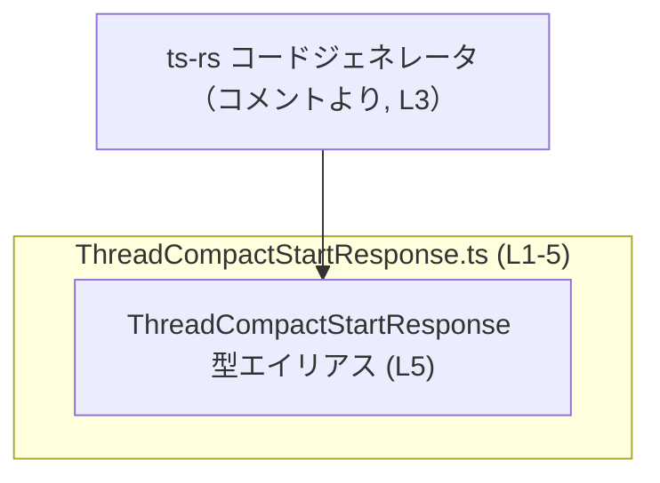
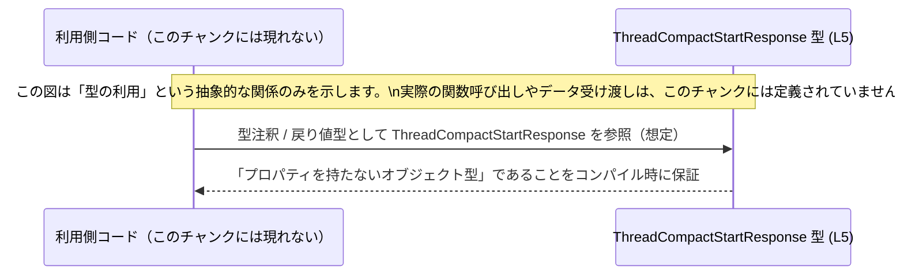

# app-server-protocol/schema/typescript/v2/ThreadCompactStartResponse.ts

## 0. ざっくり一言

`ThreadCompactStartResponse` という **空のレスポンスを表す型エイリアス**（プロパティを持たないオブジェクト型）を定義する、自動生成された TypeScript スキーマファイルです（`ThreadCompactStartResponse.ts:L1-5`）。

---

## 1. このモジュールの役割

### 1.1 概要

- このファイルは、`ThreadCompactStartResponse` という TypeScript の型エイリアスを 1 つだけ公開しています（`ThreadCompactStartResponse.ts:L5-5`）。
- 型の定義は `Record<string, never>` であり、「任意の文字列キーを取りうるが値は `never` 型」という構造から、**実質的にプロパティを持たないオブジェクト型**を表現します（`ThreadCompactStartResponse.ts:L5-5`）。
- ファイル先頭のコメントから、このファイルは Rust 向けライブラリ `ts-rs` によって自動生成されていることが分かります（`ThreadCompactStartResponse.ts:L1-3`）。

### 1.2 アーキテクチャ内での位置づけ

このチャンクから分かる範囲では、次の 2 点だけが明示されています。

- `ThreadCompactStartResponse` 型はこのファイル内で定義され、外部に `export` されています（`ThreadCompactStartResponse.ts:L5-5`）。
- コメントから、この型は Rust 側の型定義を `ts-rs` が TypeScript に変換した結果であることが読み取れます（`ThreadCompactStartResponse.ts:L3-3`）。

これを簡易な依存関係図で表すと、次のようになります。



※ この図には、**実際の利用側モジュールは含めていません**。このチャンクには、この型をインポート・利用しているコードは現れないためです。

### 1.3 設計上のポイント

コードから読み取れる設計上の特徴は次のとおりです。

- **自動生成コード**  
  - ファイル先頭のコメントに「GENERATED CODE」「Do not edit this file manually」と明記されています（`ThreadCompactStartResponse.ts:L1-3`）。
  - 設計上、「編集は生成元（Rust 側 / ts-rs 側）で行い、このファイルは再生成する」という前提になっています。
- **状態を持たない純粋な型定義**  
  - 実行時の処理・関数・クラスは一切定義されておらず、コンパイル時の型情報のみを提供します（`ThreadCompactStartResponse.ts:L5-5`）。
- **空オブジェクトを表現するための型**  
  - `Record<string, never>` によって、型レベルで「プロパティを持てない」ことを表現しています（`ThreadCompactStartResponse.ts:L5-5`）。
  - これは TypeScript の型システムを利用した安全性確保（不用意にプロパティを追加できない）に関係します。

---

## コンポーネント一覧（インベントリー）

このチャンクに現れる型・関数などの一覧です。

| 名前                         | 種別       | 定義位置                                     | 役割 / 用途                                   |
|------------------------------|------------|----------------------------------------------|-----------------------------------------------|
| `ThreadCompactStartResponse` | 型エイリアス | `ThreadCompactStartResponse.ts:L5-5` | 空のレスポンスを表すオブジェクト型（プロパティなし） |

※ 関数・クラス・列挙体などはこのファイルには存在しません（`ThreadCompactStartResponse.ts:L1-5`）。

---

## 2. 主要な機能一覧

このモジュールが提供する機能は、型の定義 1 点のみです。

- `ThreadCompactStartResponse` 型定義: 空のレスポンスオブジェクトを表す型（プロパティを持たないことを型レベルで保証）

---

## 3. 公開 API と詳細解説

### 3.1 型一覧（構造体・列挙体など）

| 名前                         | 種別       | 役割 / 用途                                                                 | 根拠 |
|------------------------------|------------|-------------------------------------------------------------------------------|------|
| `ThreadCompactStartResponse` | 型エイリアス | プロパティを持たないレスポンスオブジェクト型を表現するための別名           | `ThreadCompactStartResponse.ts:L5-5` |

**`Record<string, never>` について**

- `Record<K, V>` は TypeScript の組み込みユーティリティ型で、「キーの型 `K` から値の型 `V` へのマップ（オブジェクト）」を表します。
- `never` は「どの値も取り得ない型」であり、変数に `never` 型を割り当てることは通常できません。
- したがって `Record<string, never>` は「任意の文字列キーを取り得るが、その値にはどのような値もセットできない」という意味になり、**実質的にプロパティを持たないオブジェクト型**として使われます（`ThreadCompactStartResponse.ts:L5-5`）。

### 3.2 関数詳細（最大 7 件）

このファイルには関数・メソッドが定義されていません（`ThreadCompactStartResponse.ts:L1-5`）。  
そのため、関数詳細テンプレートに沿って説明すべき対象はありません。

### 3.3 その他の関数

- 補助関数やラッパー関数も一切定義されていません（`ThreadCompactStartResponse.ts:L1-5`）。

---

## 4. データフロー

このモジュールには実行時処理がなく、データの変換や I/O を行うコードも存在しません（`ThreadCompactStartResponse.ts:L1-5`）。  
したがって、**実際のデータの流れそのものは、このチャンクからは読み取れません**。

ただし、「型がどのような立場で使われるか」という観点で、抽象的なシーケンス図を示します。



- 上記の「利用側コード」は、**このチャンクには現れない存在**であり、実際にどのモジュールが使うかは不明です。
- 表現しているのは、「この型がコンパイル時の型安全性に寄与する」という一般的な関係だけです。

---

## 5. 使い方（How to Use）

### 5.1 基本的な使用方法

この型は「プロパティを持たないオブジェクト」を表します。  
代表的な使い方としては、関数の戻り値型・引数型などに指定する形が考えられますが、**具体的な使用例はこのチャンクには存在しません**。

ここでは TypeScript の一般的な文法に基づく、想定される使用例を示します（あくまで例であり、このリポジトリ内で実際にこう使われているかは、このチャンクからは分かりません）。

```typescript
// ThreadCompactStartResponse 型をインポートする例（パスはファイル構成に依存）
import type { ThreadCompactStartResponse } from "./ThreadCompactStartResponse"; // 型としてのみインポート

// 空のレスポンスを返す関数の例
function startThreadCompact(): ThreadCompactStartResponse { // 戻り値型として利用
    return {};                                               // プロパティを持たないオブジェクトは代入可能
}
```

このコードは次の点を示します（TypeScript 一般の挙動です）。

- `ThreadCompactStartResponse` は **空オブジェクト `{}` のみ**（厳密にはプロパティを持たないオブジェクト）を許容します。
- プロパティを持つオブジェクトを返そうとすると、コンパイル時にエラーになります。

### 5.2 よくある使用パターン

このファイルには使用パターンは記述されていませんが、型の性質から次のようなパターンが一般的です（推測であり、このリポジトリ内での実使用は不明です）。

1. **戻り値が「特に情報を持たない成功」を表す場合の型**  
   - 例: 「操作の開始に成功した」ことだけを示し、追加情報を返さない関数の戻り値型。

2. **API レスポンスのスキーマとして「ボディが空」であることを明示する場合の型**  
   - 例: HTTP ステータスコードだけで結果を伝える API など。

※ 上記は TypeScript の設計パターンの一般論であり、**このリポジトリでの実際の役割は、このチャンクだけからは断定できません。**

### 5.3 よくある間違い

`Record<string, never>` を使う型では、次のような誤用が起こりやすいです。

```typescript
import type { ThreadCompactStartResponse } from "./ThreadCompactStartResponse";

// 間違い例: プロパティを持つオブジェクトを代入してしまう
const resp1: ThreadCompactStartResponse = {
    message: "ok",           // エラー: 'message' プロパティは許可されていない
};

// 正しい例: プロパティを持たないオブジェクトを代入
const resp2: ThreadCompactStartResponse = {}; // OK
```

- 誤用例では、`message` プロパティが存在するため、`Record<string, never>` と互換性がありません。
- TypeScript コンパイラが「`ThreadCompactStartResponse` 型には `message` プロパティは存在しない」としてエラーを出します。

### 5.4 使用上の注意点（まとめ）

- **プロパティは追加できない前提**  
  - `ThreadCompactStartResponse` 型の値には、プロパティを追加しないことが前提です。
  - 追加しようとすると、コンパイルエラーになります（型システムによる安全性）。
- **実行時チェックはない**  
  - この型はコンパイル時の型情報のみであり、実行時にオブジェクトからプロパティを削除するような処理は含まれていません（`ThreadCompactStartResponse.ts:L1-5`）。
- **ファイルを直接編集しない**  
  - コメントに「Do not edit this file manually」と明記されているため（`ThreadCompactStartResponse.ts:L1-3`）、型を変更したい場合は生成元（Rust 側など）を変更して再生成する必要があります。

---

## 6. 変更の仕方（How to Modify）

このファイルは `ts-rs` によって自動生成されることが明示されています（`ThreadCompactStartResponse.ts:L1-3`）。  
そのため、**直接このファイルを編集することは前提にされていません**。

### 6.1 新しい機能を追加する場合

- このファイルに直接新しいプロパティや型を追加するのは、コメントの方針と矛盾します（`ThreadCompactStartResponse.ts:L1-3`）。
- 一般的には、次のような流れが想定されます（ただし、このリポジトリ固有の手順はこのチャンクからは不明です）。
  1. 生成元となる Rust の型定義やスキーマ定義を更新する。
  2. `ts-rs` を用いて TypeScript スキーマを再生成する。
  3. 生成された TypeScript ファイル群（本ファイルを含む）をコミットする。

※ 実際の生成コマンドや Rust 側のファイル構成は、このチャンクには現れません。

### 6.2 既存の機能を変更する場合

`ThreadCompactStartResponse` の意味を変える場合（例: プロパティを追加したい）の注意点です。

- **影響範囲の確認**  
  - この型を利用している TypeScript コード（別ファイル）をすべて確認する必要がありますが、このチャンクには利用箇所が現れないため、どこが影響を受けるかは不明です。
- **契約の変更**  
  - 現状、「プロパティを持たない」という契約になっています（`Record<string, never>`, `ThreadCompactStartResponse.ts:L5-5`）。
  - プロパティを追加すると、「空である」という前提に依存しているコードがあれば、その前提が崩れます。
- **生成元の更新**  
  - 直接 TypeScript ファイルを変更すると、再生成時に上書きされる可能性があります。
  - そのため、生成元（Rust 側 / ts-rs の設定側）で契約を変更する必要があります。

---

## 7. 関連ファイル

このチャンクには他ファイルへの import/export が一切記述されていないため、**厳密な意味で「密接に関係するファイル」を特定することはできません**（`ThreadCompactStartResponse.ts:L1-5`）。

ただし、ファイルパスとコメントから、次のような関係が推測されます（推測であることを明示します）。

| パス / 要素                                       | 役割 / 関係 |
|--------------------------------------------------|------------|
| `app-server-protocol/schema/typescript/v2/` ディレクトリ | この型を含む TypeScript スキーマ群が配置されるディレクトリであると考えられますが、このチャンクだけでは詳細は分かりません。 |
| Rust 側の ts-rs 対応型（パス不明）                | コメントの「generated by ts-rs」より、この型の生成元となっていると推測されますが、具体的な Rust ファイル名やモジュール構成はこのチャンクには現れません。 |

---

## Bugs / Security / Contracts / Edge Cases / Tests / Performance まとめ

このファイルは型定義のみであり、実行時ロジックを含まないため、これらの観点は次のようになります。

- **Bugs（バグ）**  
  - 実行時処理がないため、「ロジック上のバグ」は本ファイルだけからは発生しません。
  - ただし、もし実際のデータが空でないにもかかわらず、この型が空のレスポンスとして定義されている場合、**型と実データが食い違う**という設計上の問題が起こり得ます。これはこのチャンクだけからは判断できません。
- **Security（セキュリティ）**  
  - セキュリティに関わる処理（認証・暗号化・バリデーションなど）は一切含まれていません（`ThreadCompactStartResponse.ts:L1-5`）。
- **Contracts（契約）**  
  - 「レスポンスオブジェクトはプロパティを持たない」という契約を、型レベルで表現しています（`Record<string, never>`, `ThreadCompactStartResponse.ts:L5-5`）。
- **Edge Cases（エッジケース）**  
  - プロパティを持つオブジェクトを `ThreadCompactStartResponse` として扱おうとすると、コンパイルエラーになるのが典型的なケースです。
- **Tests（テスト）**  
  - このファイル内にはテストコードは存在しません。
- **Performance / Scalability（性能・スケーラビリティ）**  
  - 型エイリアス定義のみであり、実行時パフォーマンスへの影響は事実上ありません。

以上が、このチャンクから客観的に読み取れる `ThreadCompactStartResponse.ts` の情報です。
