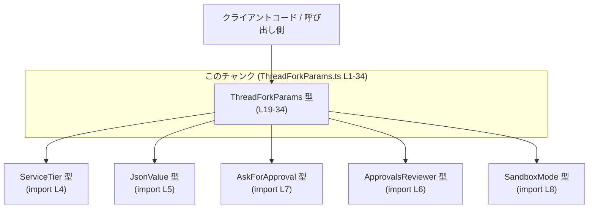
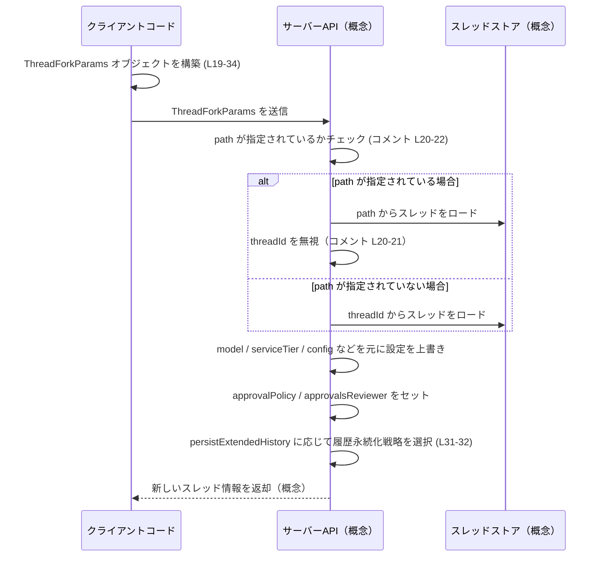

# app-server-protocol/schema/typescript/v2/ThreadForkParams.ts

## 0. ざっくり一言

スレッドを「フォーク」するときに必要なパラメータをまとめた **リクエスト用オブジェクト型 `ThreadForkParams`** を定義する、自動生成された TypeScript スキーマファイルです。

---

## 1. このモジュールの役割

### 1.1 概要

- このモジュールは、スレッドを別スレッドとしてフォークする際に必要な情報を 1 つのオブジェクトにまとめるための **型定義** を提供します。
- スレッドの指定方法（`threadId` / `path`）、モデルやサービスティアなどの設定上書き、承認フローやサンドボックス設定、履歴の保存方法を 1 つの型で表現します（`ThreadForkParams` 型, `app-server-protocol/schema/typescript/v2/ThreadForkParams.ts:L19-34`）。
- 実際の処理ロジック（スレッドを読み込み・フォークする処理）はこのファイルには含まれておらず、**呼び出し側とサーバー側の間の契約（スキーマ）** を定義する役割に限定されています。

### 1.2 アーキテクチャ内での位置づけ

このモジュールは `app-server-protocol/schema/typescript/v2` 配下の 1 ファイルであり、他のスキーマ型（`ServiceTier`, `JsonValue`, `ApprovalsReviewer`, `AskForApproval`, `SandboxMode`）を組み合わせて 1 つのパラメータ型を構成しています（`import type ...` 宣言, L4-8）。

概念的な依存関係は次のようになります。



- 実際に `ThreadForkParams` を受け取り、スレッドをフォークするロジックを持つモジュール（API ハンドラやサービス層）はこのチャンクには現れません（不明）。

### 1.3 設計上のポイント

コードから読み取れる設計上の特徴は次のとおりです。

- **自動生成ファイルであること**
  - 冒頭コメントで ts-rs による自動生成であり、手動編集禁止であることが明示されています（`// GENERATED CODE! DO NOT MODIFY BY HAND!`, `ThreadForkParams.ts:L1`、および `Do not edit this file manually.`, L3）。
- **型エイリアスによるオブジェクト型**
  - `export type ThreadForkParams = { ... }` という **型エイリアス** であり、クラスやインターフェースではありません（L19）。
- **ほぼすべてのフィールドが任意＋null 許容**
  - `threadId` と `persistExtendedHistory` を除き、ほぼすべてのプロパティは `?` 付きで任意、かつ `| null` を許容しています（L23-32）。
  - これは Rust 側の `Option<T>` や `serde_json::Value` に対応するための生成結果と考えられますが、Rust 側コードはこのチャンクには現れないため詳細は不明です。
- **threadId と path の優先度ルール**
  - コメントにより、「`path` が指定されている場合は `thread_id`（= `threadId`）は無視される」ことが明示されています（L15, L20-22）。
- **履歴保存挙動のフラグ**
  - `persistExtendedHistory` が「よりリッチなスレッド履歴を再構築するための追加のイベントを保存するかどうか」を制御するブール値であることがコメントで説明されています（L31-32）。

---

## 2. 主要な機能一覧（概念レベル）

このファイルは関数を持たず、1 つの型を提供します。その型が表現する「機能」を概念的に整理すると次のようになります。

- **スレッド指定方法の表現**
  - `threadId` または `path` により、どのスレッドからフォークするかを指定します（L11-17, L19-23）。
- **フォーク後スレッドの設定上書き**
  - `model`, `modelProvider`, `serviceTier`, `cwd`, `sandbox`, `config`, `baseInstructions`, `developerInstructions` により、フォーク後スレッドの動作や実行環境を上書きできるようにする型構造になっています（L23-30）。
- **承認フローの制御**
  - `approvalPolicy`, `approvalsReviewer` により、承認要求の扱いやレビュアーのルーティングを制御する情報を含めます（コメント L27-28）。
- **永続化／履歴の制御**
  - `ephemeral` および `persistExtendedHistory` により、スレッド／履歴をどの程度永続化するかを制御するフラグを含みます（`ephemeral` はコメントなし、`persistExtendedHistory` はコメント L31-32）。

---

## 3. 公開 API と詳細解説

### 3.1 型一覧（構造体・列挙体など）

このチャンクに現れる型（および import される型）の一覧です。

| 名前 | 種別 | 位置 | 役割 / 用途 |
|------|------|------|-------------|
| `ThreadForkParams` | 型エイリアス（オブジェクト型） | `ThreadForkParams.ts:L19-34` | スレッドフォーク API に渡すパラメータ一式。元スレッドの指定方法、設定の上書き、承認フロー、履歴保存オプションなどをまとめる。 |
| `ServiceTier` | import された型 | `ThreadForkParams.ts:L4` | サービスの「ティア」（レベル・プランなど）を表す型。`serviceTier` プロパティの型として使用される。具体的な中身はこのチャンクには現れない。 |
| `JsonValue` | import された型 | `ThreadForkParams.ts:L5` | JSON 値を表現する型。`config` オブジェクトの値型として使用される。具体的な定義はこのチャンクには現れない。 |
| `ApprovalsReviewer` | import された型 | `ThreadForkParams.ts:L6` | 承認リクエストのレビュアーを表現する型。`approvalsReviewer` プロパティに使用される。詳細はこのチャンクには現れない。 |
| `AskForApproval` | import された型 | `ThreadForkParams.ts:L7` | 承認ポリシーを表現する型。`approvalPolicy` プロパティに使用される。詳細はこのチャンクには現れない。 |
| `SandboxMode` | import された型 | `ThreadForkParams.ts:L8` | サンドボックス実行モードを表す型。`sandbox` プロパティに使用される。詳細はこのチャンクには現れない。 |

### 3.2 `ThreadForkParams` 型の詳細

#### 概要

`ThreadForkParams` は、スレッドをフォークする際に必要なパラメータを表すオブジェクト型です（L19）。

コメントによると、スレッドをフォークする方法は 2 通りあります（L11-17）。

1. `thread_id`（TypeScript 側では `threadId`）で指定したスレッドをディスクから読み込み、新しいスレッドにフォークする。
2. `path` で指定したスレッドをディスクから読み込み、新しいスレッドにフォークする。

さらに、

- `path` を指定した場合、`thread_id` パラメータは無視される（L15, L20-22）。
- 可能な限り `thread_id` 方式を優先することが推奨されている（L17）。

#### フィールド一覧

各プロパティの型・必須性・コメントから読み取れる情報を整理します。

| プロパティ名 | 型 | 必須/任意 | 説明 | 根拠 |
|--------------|----|-----------|------|------|
| `threadId` | `string` | 必須 | フォーク元となるスレッドの ID。`path` を使わない標準的なフォーク方法で使用される。`path` が指定されている場合、この値は無視される。 | プロパティ定義 `threadId: string`（L19）、コメント「If using path, the thread_id param will be ignored.」（L15, L21）。 |
| `path` | `string \| null`（プロパティ自体は任意） | 任意 | ロールアウトのパスを指定してスレッドをフォークするための値。指定された場合、`thread_id` パラメータは無視される。[UNSTABLE] と明記されており、不安定な API であることが示されている。 | コメント「[UNSTABLE] Specify the rollout path to fork from.」（L20）、「If specified, the thread_id param will be ignored.」（L21）、型 `path?: string \| null`（L23）。 |
| `model` | `string \| null`（任意） | 任意 | フォークされたスレッドに対するモデル設定の上書き。具体的な意味（モデル名・バージョンなど）はコメントからは不明。 | コメント「Configuration overrides for the forked thread, if any.」（L24-25）の直後のフィールド群の一つとして定義されている（L26）。 |
| `modelProvider` | `string \| null`（任意） | 任意 | モデルプロバイダを表すと推測される文字列。コメントはなく、このチャンクからは用途の詳細は分かりません。 | 型 `modelProvider?: string \| null`（L26）。 |
| `serviceTier` | `ServiceTier \| null \| null`（任意） | 任意 | サービスティア（利用プラン／品質レベルなど）を指定する値。`ServiceTier \| null \| null` は TypeScript のユニオン型の性質から **実質的に `ServiceTier \| null`** と同等です。 | 型 `serviceTier?: ServiceTier \| null \| null`（L26）。 |
| `cwd` | `string \| null`（任意） | 任意 | カレントワーキングディレクトリを表すと考えられる文字列。コメントはなく、このチャンクからは具体的な意味やフォーマットは分かりません。 | 型 `cwd?: string \| null`（L26）。 |
| `approvalPolicy` | `AskForApproval \| null`（任意） | 任意 | フォークされたスレッドに対する承認ポリシーを指定する値。具体的なポリシー内容は `AskForApproval` 型の定義側で決まるが、このチャンクには現れない。 | 型 `approvalPolicy?: AskForApproval \| null`（L26）。 |
| `approvalsReviewer` | `ApprovalsReviewer \| null`（任意） | 任意 | 承認リクエストがどこにルーティングされるかを上書きする設定。「このスレッドおよびその後のターン」でのレビュー先を上書きすることがコメントで説明されている。 | コメント「Override where approval requests are routed for review on this thread and subsequent turns.」（L27-28）、型 `approvalsReviewer?: ApprovalsReviewer \| null`（L30）。 |
| `sandbox` | `SandboxMode \| null`（任意） | 任意 | サンドボックスモードの設定。どのようなモードがあるかは `SandboxMode` 型の定義側に依存し、このチャンクでは不明。 | 型 `sandbox?: SandboxMode \| null`（L30）。 |
| `config` | `{ [key in string]?: JsonValue } \| null`（任意） | 任意 | 任意の文字列キーに対応する JSON 値 (`JsonValue`) の設定マップ。各キーごとの値も任意（`?`）なので、「スパースな設定オブジェクト」を表現する型になっています。用途は「Configuration overrides」の一部と解釈できますが、具体的なキー名・値の意味はこのチャンクからは分かりません。 | 型 `config?: { [key in string]?: JsonValue } \| null`（L30）、コメント L24-25。 |
| `baseInstructions` | `string \| null`（任意） | 任意 | 基本的なインストラクション（指示文）と思われる文字列。コメントはなく、このチャンクからは用途の詳細は分かりません。 | 型 `baseInstructions?: string \| null`（L30）。 |
| `developerInstructions` | `string \| null`（任意） | 任意 | 開発者向けのインストラクションと思われる文字列。コメントはなく、このチャンクからは用途の詳細は分かりません。 | 型 `developerInstructions?: string \| null`（L30）。 |
| `ephemeral` | `boolean`（任意） | 任意 | 一時的なスレッドかどうかを示すブール値と思われますが、コメントがなく、具体的な意味（true/false で何が変わるか）はこのチャンクからは分かりません。 | 型 `ephemeral?: boolean`（L30）。 |
| `persistExtendedHistory` | `boolean`（必須） | 必須 | true の場合、「よりリッチなスレッド履歴を再構築するために必要な追加の rollout EventMsg バリアントを永続化する」ことを示すフラグ。スレッドを再開 / フォーク / 読み取りする際に、より詳細な履歴が再構築可能になることがコメントから分かります。 | コメント「If true, persist additional rollout EventMsg variants required to reconstruct a richer thread history on subsequent resume/fork/read.」（L31-32）、型 `persistExtendedHistory: boolean`（L34）。 |

#### TypeScript 固有の安全性・エラー・並行性の観点

- **型安全性**
  - `threadId` / `path` が必ず文字列か null であること、`config` の値が `JsonValue` に制限されることなど、**コンパイル時の型チェック** により誤った型の値の代入が防がれます。
  - ただし、**ビジネスロジック上の制約**（例: 「`threadId` は必ず非空文字列でなければならない」「`threadId` または `path` のどちらか一方は有効な値であるべき」など）は、この型だけでは表現されていません。これらは受け取り側の実装で検証する必要があります。
- **`undefined` と `null`**
  - 多くのプロパティが `?` と `\| null` を併用しているため、値が「プロパティ自体が存在しない (`undefined`)」場合と「プロパティはあるが値が `null`」の場合の両方を取り得ます。  
    例: `path?: string \| null`（L23）。
  - これにより、シリアライズ時に `null` を明示するかどうかなど、クライアント側で意図的な状態区別が可能ですが、サーバー側が両者を区別するかどうかはこのチャンクからは分かりません。
- **並行性 / 共有の観点**
  - この型は `readonly` ではないため、同じ `ThreadForkParams` オブジェクトを複数箇所で共有し、あとからプロパティを書き換えることが可能です。  
    非同期処理の中で共有オブジェクトを変更すると、思わぬタイミングで値が変わる可能性があるため、必要に応じてコピー（`{ ...params }`）して使う設計が安全です。
  - ただし、TypeScript/JavaScript の実行モデル（シングルスレッドのイベントループ、あるいはワーカー/スレッド間通信の仕組み）はこのファイルには現れておらず、並行性の詳細は使用側のコードに依存します。

#### Examples（使用例）

1. **threadId によるフォーク（推奨）**

```typescript
import type { ThreadForkParams } from "./schema/typescript/v2/ThreadForkParams";
import type { ServiceTier } from "./schema/typescript/ServiceTier";

// フォーク元スレッドIDと、履歴の拡張保存フラグだけを指定する最小構成の例
const paramsById: ThreadForkParams = {
    threadId: "thread-1234",          // 必須
    persistExtendedHistory: true,     // 必須
};

// 追加でサービスティアを上書きする例（ServiceTier の具体的な値はこのチャンクでは不明）
const someServiceTier: ServiceTier = /* ServiceTier 型の値をどこかから取得 */ null as any;

const paramsWithTier: ThreadForkParams = {
    threadId: "thread-5678",
    serviceTier: someServiceTier,     // 任意のサービスティア
    persistExtendedHistory: false,
};
```

1. **path によるフォーク（`threadId` が無視されるケース）**

```typescript
import type {
    ThreadForkParams,
} from "./schema/typescript/v2/ThreadForkParams";
import type { ApprovalsReviewer } from "./schema/typescript/v2/ApprovalsReviewer";

// ApprovalsReviewer 型の値（具体的な構造はこのチャンクには現れない）
const reviewer: ApprovalsReviewer = /* ... */ null as any;

const paramsByPath: ThreadForkParams = {
    // path を指定する場合でも、型上は threadId が必須なので何かしらの文字列が必要
    threadId: "this-id-will-be-ignored-when-path-is-set",
    path: "/rollouts/experiment-A",      // path を指定（コメント L20-21）
    approvalsReviewer: reviewer,         // このスレッドとその後のターンのレビュアーを上書き（L27-28）
    persistExtendedHistory: true,
};
```

- 上記のように、**型定義上は `threadId` が必須** ですが、コメントに基づく仕様としては `path` が指定されている場合 `threadId` は無視される点に注意が必要です（L15, L20-22）。

#### Edge cases（エッジケース）

コードとコメントから推測できる代表的なエッジケースは次のとおりです。

- **`path` と `threadId` の両方が指定された場合**
  - コメントにより、`path` が指定されていれば `thread_id` パラメータは無視されると明示されています（L20-22）。
  - したがって、「意図せず古い `threadId` が残っていた」場合でも、`path` を優先する挙動が期待されます。
- **`path` が空文字列 `""` の場合**
  - コメントや型からは、空文字列をどう扱うかは分かりません。  
    受け取り側が無効な値としてエラーにするか、有効なパスとして扱うかはこのチャンクからは判断できません。
- **`config` による設定上書き**
  - `config` が `null`、`undefined`（プロパティ欠如）、空オブジェクト `{}`、一部のキーのみを持つオブジェクトなど、さまざまな状態を取り得ます。  
    どの状態をどう解釈するか（例: 「null = 設定をクリア」「undefined = 上書きなし」など）は、この型定義からは分かりません。
- **`ephemeral` が未指定の場合**
  - 型上は任意プロパティ (`ephemeral?: boolean`) なので、プロパティが存在しないときの扱い（デフォルト値）はこのチャンクからは分かりません。

#### 使用上の注意点

- **手動編集禁止**
  - ファイル冒頭コメントにある通り、このファイルは ts-rs によって生成されたものであり、手動で編集してはならないと明示されています（L1, L3）。  
    仕様変更やフィールド追加は、元の定義（おそらく Rust 側の型）を変更し、再生成する必要があります。
- **`threadId` と `path` の優先度**
  - `path` を指定した場合に `threadId` が無視される仕様はコメントに依存しており、型システム上は表現されていません（L15, L20-22）。  
    呼び出し側では、「`path` を使うときには `threadId` の値に依存しない」ことを前提に設計する必要があります。
- **`persistExtendedHistory` の必須性**
  - このフラグは必須であり、省略するとコンパイルエラーになります（L34）。  
    呼び出し側は、「履歴をどの程度保存したいか」を毎回明示的に決める必要があります。
- **ミュータブルなオブジェクトであること**
  - `ThreadForkParams` は通常のオブジェクト型であり、`readonly` 修飾子は付いていません。  
    非同期処理の途中でオブジェクトを書き換えると、後続処理で想定外の値が見える可能性があります。必要に応じてコピーを作ってから変更することが安全です。

### 3.3 その他の関数

- このファイルには **関数やメソッドは定義されていません**。  
  そのため、「その他の関数」に該当する要素もありません。

---

## 4. データフロー

このチャンクには実装コードはありませんが、`ThreadForkParams` が典型的にどのように使用されるかを概念的なシーケンスで示します。



- 太字で示した部分（`path` / `threadId` の分岐、`persistExtendedHistory` による履歴の扱い）はコメントで明示されている仕様部分に基づく概念図です（L11-17, L20-22, L31-32）。
- ロードや保存の具体的な API 名・ストレージ実装はこのチャンクには現れません。

---

## 5. 使い方（How to Use）

### 5.1 基本的な使用方法

`ThreadForkParams` を使う基本的な流れは次のようになります。

1. 元スレッドを `threadId` または `path` で識別する。
2. 必要に応じてモデルや承認フローなどの設定上書きを指定する。
3. `persistExtendedHistory` を含むオブジェクトを構築し、サーバー API に渡す。

```typescript
import type { ThreadForkParams } from "./schema/typescript/v2/ThreadForkParams";

// 1. 必須フィールドを含むパラメータオブジェクトを構築
const params: ThreadForkParams = {
    threadId: "thread-001",           // スレッドIDで指定（L11-12）
    // path は指定しないので、threadId が使用される（コメント L15）
    persistExtendedHistory: true,     // 履歴を拡張保存（L31-32）
};

// 2. どこかの API 呼び出しに渡す（API 名はこのチャンクには現れないため抽象化）
async function forkThread(params: ThreadForkParams) {
    // ここで HTTP リクエストなどを送る想定（実装は別モジュール）
}

forkThread(params);
```

### 5.2 よくある使用パターン

1. **シンプルなフォーク（設定上書きなし）**

```typescript
const simpleFork: ThreadForkParams = {
    threadId: "thread-simple",
    persistExtendedHistory: false,    // 最低限の履歴だけ保存する想定
};
```

1. **path を使った実験的なフォーク**

```typescript
const experimentalFork: ThreadForkParams = {
    threadId: "ignored-when-path-is-set",
    path: "/rollouts/experiment-123", // [UNSTABLE] な path を利用（L20）
    // 必要に応じて sandbox や config を追加
    sandbox: /* SandboxMode */ null as any,
    persistExtendedHistory: true,
};
```

1. **承認フローをカスタマイズしたフォーク**

```typescript
import type { AskForApproval } from "./schema/typescript/v2/AskForApproval";
import type { ApprovalsReviewer } from "./schema/typescript/v2/ApprovalsReviewer";

const policy: AskForApproval = /* ... */ null as any;
const reviewer: ApprovalsReviewer = /* ... */ null as any;

const approvalFork: ThreadForkParams = {
    threadId: "needs-approval-xyz",
    approvalPolicy: policy,
    approvalsReviewer: reviewer,      // このスレッドと以降のターンでのレビュアーを上書き（L27-28）
    persistExtendedHistory: true,
};
```

### 5.3 よくある間違い（起こり得る誤用）

この型定義から想定される注意点を列挙します。

```typescript
import type { ThreadForkParams } from "./schema/typescript/v2/ThreadForkParams";

// 誤り例: persistExtendedHistory を指定していない
const wrong1: ThreadForkParams = {
    // threadId はあるが...
    threadId: "thread-abc",
    // persistExtendedHistory がないため型エラーになる（L34）
    // persistExtendedHistory: true, // ← 必須
};

// 誤り例: path を指定しているのに threadId に依存してしまう
const wrong2: ThreadForkParams = {
    threadId: "important-id",
    path: "/rollouts/other-path",
    persistExtendedHistory: true,
};
// コメント L20-22 にある通り、path が指定されていると threadId は無視される。
// 「threadId を使っているつもり」で path も設定してしまうと、実際に使用されるのは path になる。

// 正しい例: path を使うときは threadId の値には依存しない設計にする
const correct2: ThreadForkParams = {
    threadId: "placeholder-id-only",
    path: "/rollouts/desired-path",
    persistExtendedHistory: true,
};
```

### 5.4 使用上の注意点（まとめ）

- **必須プロパティの指定**
  - `threadId` と `persistExtendedHistory` は必須です（L19, L34）。コンパイルエラーで気付きやすいですが、忘れないように注意が必要です。
- **`path` がある場合の `threadId` 無視**
  - `path` を指定すると `threadId` が無視される仕様（L20-22）は、型では表現されていません。  
    設計段階で決めたルール（例: 「`path` を使用する箇所では常にダミーの `threadId` を入れる」など）をチーム内で共有しておくと誤解が減ります。
- **`null` とプロパティ欠如の違い**
  - `path?: string \| null` のように `?` と `\| null` が併用されているため、「値がない」ことを `undefined`（プロパティ欠如）と `null`（明示的な空）で区別できます。  
    ただし、サーバー側がこの区別をどこまで意識しているかはこのチャンクからは分かりません。
- **自動生成ファイルであること**
  - 直接編集すると、再生成のタイミングで上書きされるだけでなく、Rust 側の定義と TypeScript 側のスキーマが不整合になる可能性があります（L1, L3）。

---

## 6. 変更の仕方（How to Modify）

### 6.1 新しい機能を追加する場合

このファイルは ts-rs による自動生成ファイルであるため（L1, L3）、**直接の編集は行わず、元の定義側を変更する必要があります**。元定義はこのチャンクには現れませんが、一般的な流れは次のようになります。

1. **元の型定義を特定する**
   - コメントの ts-rs への言及（L3）から、Rust 側に対応する構造体や型が存在すると推測されます。
2. **Rust 側の型にフィールドを追加・変更**
   - 新しいパラメータを追加したい場合は、Rust 側の構造体にフィールドを追加し、必要に応じて ts-rs の属性を付与することになります（具体的な属性はこのチャンクには現れません）。
3. **コード生成を再実行**
   - ts-rs を再実行して TypeScript ファイルを再生成し、`ThreadForkParams` 型に変更が反映されます。
4. **呼び出し側の TypeScript コードを更新**
   - 新フィールドを使用したり、必須プロパティが増えた場合は呼び出し側コードの修正が必要です。

### 6.2 既存の機能を変更する場合

- **`threadId` / `path` の仕様変更**
  - 例えば「`path` 使用時でも `threadId` を使う」ような仕様変更を行う場合、コメント（L15, L20-22）とサーバー側実装の両方を変更する必要があります。  
    型定義自体は `threadId` / `path` の有無のみを表現しており、優先度はコメントと実装に依存しています。
- **フィールドの必須・任意の切り替え**
  - `persistExtendedHistory` を任意にするなどの変更は、型の互換性に大きな影響を与えます。  
    TypeScript 側では、既存の呼び出しコードがエラーになる／ならなくなる可能性があります。
- **影響範囲の確認**
  - この型を参照している TypeScript コード全般（API 呼び出し箇所など）と、Rust 側でこのフィールドを使っている処理を確認する必要がありますが、それらはこのチャンクには現れません。

---

## 7. 関連ファイル

このモジュールと密接に関係するファイル（import 先）は次のとおりです。

| パス | 役割 / 関係 |
|------|-------------|
| `app-server-protocol/schema/typescript/ServiceTier.ts`（推定） | `ServiceTier` 型の定義ファイル（L4 で import）。`ThreadForkParams.serviceTier` の型として使用され、フォークされたスレッドのサービスティアを表す。 |
| `app-server-protocol/schema/typescript/serde_json/JsonValue.ts`（推定） | `JsonValue` 型の定義ファイル（L5 で import）。`config` オブジェクトの値型として使用され、任意の JSON 互換値を表す。 |
| `app-server-protocol/schema/typescript/v2/ApprovalsReviewer.ts` | `ApprovalsReviewer` 型の定義ファイル（L6 で import）。`approvalsReviewer` プロパティの型として使用され、承認リクエストのレビュアー情報を表す。 |
| `app-server-protocol/schema/typescript/v2/AskForApproval.ts` | `AskForApproval` 型の定義ファイル（L7 で import）。`approvalPolicy` プロパティの型として使用され、承認ポリシーを表す。 |
| `app-server-protocol/schema/typescript/v2/SandboxMode.ts` | `SandboxMode` 型の定義ファイル（L8 で import）。`sandbox` プロパティの型として使用され、サンドボックスモードを表す。 |

> 上記パスは import 文の相対パスから推定したものであり、実際のディレクトリ構成はリポジトリ全体を見なければ確定できません。
