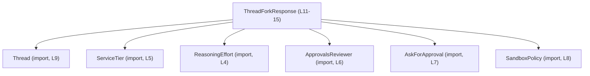
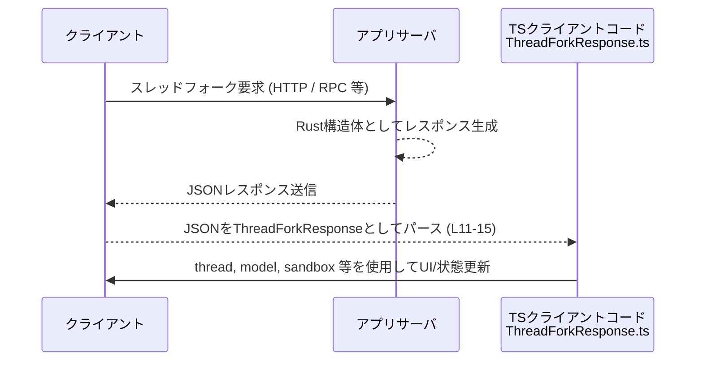

# app-server-protocol/schema/typescript/v2/ThreadForkResponse.ts

## 0. ざっくり一言

`ThreadForkResponse` は、「スレッドのフォーク（派生）」に対するレスポンスの構造を表す TypeScript の型エイリアスです。Rust 側の型定義から `ts-rs` によって自動生成されており、手動編集は想定されていません（`ThreadForkResponse.ts:L1-3`）。

---

## 1. このモジュールの役割

### 1.1 概要

- このモジュールは、Rust で定義されたレスポンス構造体を TypeScript から型安全に扱うための **データ構造（スキーマ）** を提供します（`ThreadForkResponse.ts:L1-3`）。
- `ThreadForkResponse` 型は、フォーク後のスレッド情報・モデル情報・承認ポリシー・サンドボックス設定など、スレッドフォーク操作の結果に関するメタデータを一つのオブジェクトにまとめます（`ThreadForkResponse.ts:L11-15`）。

> 型名とファイルパス（`.../schema/typescript/v2/ThreadForkResponse.ts`）から、アプリケーションサーバーのプロトコルスキーマの一部として利用されることが想定されますが、実際の呼び出し元はこのチャンクには現れません。

### 1.2 アーキテクチャ内での位置づけ

このファイルは、他の型定義モジュールに依存して `ThreadForkResponse` を構成します（`ThreadForkResponse.ts:L4-9, L11-15`）。



すべての依存は `import type` で読み込まれており、**コンパイル時の型情報としてのみ利用され、ランタイム依存は発生しません**（`ThreadForkResponse.ts:L4-9`）。

### 1.3 設計上のポイント

- **自動生成コード**  
  コメントで `ts-rs` による自動生成であることが明示されており、手動編集は禁止されています（`ThreadForkResponse.ts:L1-3`）。
- **型専用インポート**  
  すべて `import type` を用いており、JavaScript にトランスパイルされた際に余分な import が生成されない構造です（`ThreadForkResponse.ts:L4-9`）。
- **インラインオブジェクト型の type alias**  
  `export type ThreadForkResponse = { ... }` という形で、インターフェースではなく型エイリアスとして定義されています（`ThreadForkResponse.ts:L11-15`）。
- **null 許容フィールドの明示**  
  `serviceTier` と `reasoningEffort` は `T | null` という Union 型で定義されており、「必須プロパティだが値は null になりうる」という契約になっています（`ThreadForkResponse.ts:L11, L15`）。  
  （オプションプロパティ `?` とは異なり、キー自体は常に存在すると想定されます。）
- **承認レビュアーの意味づけコメント**  
  `approvalsReviewer` フィールドには JSDoc コメントが付けられており、「このスレッド上の承認リクエストに利用されるレビュアー」であることが明示されています（`ThreadForkResponse.ts:L12-14`）。

---

## 2. 主要な機能一覧（コンポーネントインベントリー）

このファイルは関数を持たず、**1 つの公開型**と複数の依存型から構成されます。

- `ThreadForkResponse`: スレッドフォーク操作のレスポンス構造を表す型エイリアス（`ThreadForkResponse.ts:L11-15`）。
- 依存型（すべて type-import）:
  - `Thread`: フォークされたスレッド本体の情報（`ThreadForkResponse.ts:L9`）。
  - `ServiceTier`: 利用するサービス階層を表す型（`ThreadForkResponse.ts:L5`）。
  - `ReasoningEffort`: 推論負荷/レベルを表す型（`ThreadForkResponse.ts:L4`）。
  - `ApprovalsReviewer`: 承認要求に対するレビュアー情報（`ThreadForkResponse.ts:L6`）。
  - `AskForApproval`: 承認ポリシー設定（`ThreadForkResponse.ts:L7`）。
  - `SandboxPolicy`: サンドボックスポリシー（`ThreadForkResponse.ts:L8`）。

（各依存型の中身はこのチャンクには現れないため、詳細は不明です。）

---

## 3. 公開 API と詳細解説

### 3.1 型一覧（構造体・列挙体など）

#### 公開型 / エクスポート

| 名前                  | 種別        | 役割 / 用途                                                                 | 定義箇所                                   |
|-----------------------|------------|----------------------------------------------------------------------------|--------------------------------------------|
| `ThreadForkResponse`  | 型エイリアス | スレッドフォークレスポンスの全フィールドをまとめたオブジェクト型                        | `ThreadForkResponse.ts:L11-15`             |

#### 依存型（このファイルが参照している型）

| 名前               | 種別     | 役割 / 用途（名前からの推測を含む）                                 | 参照箇所                         |
|--------------------|----------|--------------------------------------------------------------------|----------------------------------|
| `ReasoningEffort`  | 型       | 推論に費やすリソース・精度レベルなどを表す型と推測されます           | `ThreadForkResponse.ts:L4, L15` |
| `ServiceTier`      | 型       | 利用するサービスのグレード（例: free/pro）を表す型と推測されます     | `ThreadForkResponse.ts:L5, L11` |
| `ApprovalsReviewer`| 型       | 承認リクエストを処理するレビュアーを表す型                           | `ThreadForkResponse.ts:L6, L15` |
| `AskForApproval`   | 型       | 承認が必要かどうか、およびその条件を規定するポリシー型と推測されます | `ThreadForkResponse.ts:L7, L11` |
| `SandboxPolicy`    | 型       | 実行サンドボックスの制約・権限設定を表す型と推測されます             | `ThreadForkResponse.ts:L8, L15` |
| `Thread`           | 型       | チャットスレッド本体を表す型                                       | `ThreadForkResponse.ts:L9, L11` |

> 上記の説明のうち、「〜と推測されます」と付した部分は名称からの推測であり、このチャンクのコードだけでは厳密な定義は分かりません。

#### `ThreadForkResponse` の構造

`ThreadForkResponse` は次のフィールドを持つオブジェクト型です（`ThreadForkResponse.ts:L11-15` を整形して説明）。

| フィールド名          | 型                                    | 説明（コードおよびコメントに基づく）                                                                                         | 根拠 |
|-----------------------|----------------------------------------|------------------------------------------------------------------------------------------------------------------------------|------|
| `thread`              | `Thread`                               | フォーク結果として得られたスレッドオブジェクト。                                                                             | `ThreadForkResponse.ts:L11` |
| `model`               | `string`                               | 利用された、または関連付けられているモデル名。                                                                               | `ThreadForkResponse.ts:L11` |
| `modelProvider`       | `string`                               | モデルを提供しているプロバイダー名（例: ベンダー名）と推測されます。                                                         | `ThreadForkResponse.ts:L11` |
| `serviceTier`         | `ServiceTier \| null`                  | 利用しているサービス階層。null の場合は「未設定・デフォルト」等を表すと推測されます。                                        | `ThreadForkResponse.ts:L11` |
| `cwd`                 | `string`                               | 「current working directory」を示すパス文字列と推測されます。                                                               | `ThreadForkResponse.ts:L11` |
| `approvalPolicy`      | `AskForApproval`                       | このスレッドに対する承認の取得方法を定義するポリシー。                                                                       | `ThreadForkResponse.ts:L11` |
| `approvalsReviewer`   | `ApprovalsReviewer`                    | 「このスレッド上の承認リクエストに現在使われているレビュアー」（コメントより）                                              | `ThreadForkResponse.ts:L12-15` |
| `sandbox`             | `SandboxPolicy`                        | このスレッドで利用されるサンドボックス環境のポリシー。                                                                       | `ThreadForkResponse.ts:L15` |
| `reasoningEffort`     | `ReasoningEffort \| null`              | 推論の「努力度（強度）」等を示す設定。null の場合は特別な指定がない状態と推測されます。                                     | `ThreadForkResponse.ts:L15` |

### 3.2 関数詳細（最大 7 件）

このファイルには **関数・メソッドは一切定義されていません**（`ThreadForkResponse.ts:L1-15`）。  
そのため、関数の詳細解説テンプレートを適用できる対象はありません。

### 3.3 その他の関数

- 該当なし（補助関数やラッパー関数も定義されていません）。

---

## 4. データフロー

このチャンクには実際に `ThreadForkResponse` を生成・利用するコードは含まれていませんが、型名と配置から、**スレッドフォーク操作のレスポンスとしてクライアントに渡されるデータ** であることが想定されます。

以下は、想定される典型的なデータフローの例です（利用シーンは推測であり、実際の実装はこのファイルからは分かりません）。



### 要点（型レベルで分かること）

- `ThreadForkResponse` は、**1 回のレスポンスで必要な情報をすべてまとめた単一オブジェクト**として扱われる設計です（`ThreadForkResponse.ts:L11-15`）。
- `serviceTier` / `reasoningEffort` は null 許容であるため、**呼び出し側は null チェックを行う必要があります**（`ThreadForkResponse.ts:L11, L15`）。
- 他のフィールド（`thread`, `model`, `modelProvider`, `cwd`, `approvalPolicy`, `approvalsReviewer`, `sandbox`）はすべて非 null かつ必須と型レベルでは規定されています（`ThreadForkResponse.ts:L11-15`）。

---

## 5. 使い方（How to Use）

### 5.1 基本的な使用方法

このモジュールは **型定義のみ** を提供するため、主な利用パターンは次の 2 つです。

1. API クライアント層でレスポンスの型注釈として利用する
2. アプリケーション内部で、スレッドフォーク結果オブジェクトの型として利用する

#### 例: API クライアントでの利用（想定例）

```typescript
// app-server-protocol/schema/typescript/v2/ThreadForkResponse.ts から型をインポートする
import type { ThreadForkResponse } from "./ThreadForkResponse"; // 型のみインポート

// スレッドフォーク API のレスポンスを処理する関数（実際のエンドポイント名は仮定です）
async function handleThreadFork(): Promise<void> {
    const res = await fetch("/api/thread/fork");                 // スレッドフォークを要求
    const json = await res.json();                              // JSONとしてレスポンスを取得

    const data = json as ThreadForkResponse;                    // ThreadForkResponse 型として扱う

    console.log("新しいスレッドID:", data.thread /* Thread型の詳細は別ファイル */);
    console.log("使用モデル:", data.model);                     // string 型（L11）
    console.log("モデルプロバイダ:", data.modelProvider);        // string 型（L11）

    // null 許容フィールドは必ずチェックする
    if (data.serviceTier !== null) {                            // ServiceTier | null（L11）
        console.log("サービス階層:", data.serviceTier);
    }

    if (data.reasoningEffort !== null) {                        // ReasoningEffort | null（L15）
        console.log("推論レベル:", data.reasoningEffort);
    }

    // approvalsReviewer は現在このスレッドで使われるレビュアー（L12-15のコメント）
    console.log("承認レビュアー:", data.approvalsReviewer);
}
```

- 上記の JSON → 型変換は `as ThreadForkResponse` による **型アサーション** であり、ランタイムのバリデーションは行っていません。  
  実際のコードでは、`zod` 等で構造を検証することが推奨されます（このファイルからはバリデーション有無は分かりません）。

### 5.2 よくある使用パターン

1. **関数の引数として受け取る**

```typescript
import type { ThreadForkResponse } from "./ThreadForkResponse";

// ThreadForkResponse を使って UI 状態を更新する関数
function updateUiFromForkResponse(resp: ThreadForkResponse): void {
    // thread の中身を使ってスレッド一覧を更新する
    // resp.thread は Thread 型（L11）
    // ...

    // サンドボックスポリシーに応じて UI の表示を切り替える
    const sandboxPolicy = resp.sandbox; // SandboxPolicy 型（L15）

    // null 許容フィールド
    if (resp.serviceTier === null) {
        // サービス階層がない場合のデフォルト表示
    } else {
        // サービス階層に応じた表示
    }
}
```

1. **テスト用のダミーデータ作成**

```typescript
import type { ThreadForkResponse } from "./ThreadForkResponse";
// 依存型のテスト用ダミーはそれぞれの定義を参照して用意する必要があります（本チャンクでは不明）

const dummyResponse: ThreadForkResponse = {
    thread: /* Thread 型のダミー */,                 // ThreadForkResponse.ts:L11
    model: "example-model",                         // string
    modelProvider: "example-provider",              // string
    serviceTier: null,                              // ServiceTier | null
    cwd: "/workspace",                              // string
    approvalPolicy: /* AskForApproval ダミー */,    // AskForApproval
    approvalsReviewer: /* ApprovalsReviewer ダミー */, // ApprovalsReviewer
    sandbox: /* SandboxPolicy ダミー */,            // SandboxPolicy
    reasoningEffort: null,                          // ReasoningEffort | null
};
```

> 上記の依存型の具体的な生成方法は、このチャンクには現れないため不明です。

### 5.3 よくある間違い（推測）

コードから直接は読み取れませんが、型定義の構造から起こりやすい誤用を挙げます。

```typescript
// 誤り例: null 許容フィールドをそのまま使ってしまう
function logServiceTier(resp: ThreadForkResponse) {
    // console.log(resp.serviceTier.toString()); // NG: serviceTier は null の可能性がある（L11）
}

// 正しい例: null チェックを行ってから使用する
function logServiceTierSafe(resp: ThreadForkResponse) {
    if (resp.serviceTier !== null) {                // Union型の分岐（L11）
        console.log(resp.serviceTier.toString());
    } else {
        console.log("サービス階層は指定されていません");
    }
}
```

### 5.4 使用上の注意点（まとめ）

**契約 / Contracts**

- すべてのフィールドは「必須プロパティ」として定義されていますが、`serviceTier` と `reasoningEffort` の **値は null になりうる**（`T | null`）点に注意します（`ThreadForkResponse.ts:L11, L15`）。
- 他のフィールド（`thread`, `model`, `modelProvider`, `cwd`, `approvalPolicy`, `approvalsReviewer`, `sandbox`）は null 許容ではなく、常に有効な値が入ることを前提とした設計です（`ThreadForkResponse.ts:L11-15`）。

**型安全性 / エラー**

- このファイルは **静的型情報のみ** を提供し、ランタイムの検証は行いません。  
  不正な JSON を `as ThreadForkResponse` で無理にキャストすると、実行時エラーになる可能性があります（型アサーションの一般的な注意点。コード上ではバリデーションの有無は不明）。
- `import type` によって、型定義ファイルの循環依存によるランタイムエラーを避ける設計になっています（`ThreadForkResponse.ts:L4-9`）。

**並行性 / Concurrency**

- このファイルは単なる型定義であり、非同期処理や並行実行に関するロジックは一切含みません（`ThreadForkResponse.ts:L1-15`）。
- 並行環境で同じ `ThreadForkResponse` オブジェクトを共有する場合のスレッドセーフティは、TypeScript の型レベルでは表現されていません（一般的な TS の性質）。このファイルからは特別な対策の有無は分かりません。

**Bugs / Security 上の注意**

- `cwd` はパス文字列と推測されるため、これをそのままファイル操作に利用する場合は、パストラバーサル等のセキュリティリスクを考慮する必要があります。  
  ただし、このファイル自体はパスの検証ロジックを持っていません（`ThreadForkResponse.ts:L11`）。
- `sandbox` / `approvalPolicy` / `approvalsReviewer` は権限・承認に関わる情報と考えられるため、クライアント側で信頼しすぎない設計（サーバー側での最終チェック）が望ましいですが、その実装方針はこのチャンクには含まれていません。

**編集に関する注意**

- `// GENERATED CODE! DO NOT MODIFY BY HAND!` と明示されているとおり、このファイルを直接編集すると、次回の自動生成時に上書きされる可能性があります（`ThreadForkResponse.ts:L1-3`）。  
  変更は元になっている Rust 側の定義で行う必要があります。

---

## 6. 変更の仕方（How to Modify）

### 6.1 新しい機能を追加する場合

このファイルは `ts-rs` による自動生成であり、直接の編集は想定されていません（`ThreadForkResponse.ts:L1-3`）。  
新しいフィールドを追加する場合の一般的な流れは次のようになります（実際の生成スクリプトはこのチャンクには現れません）。

1. **Rust 側の元構造体にフィールドを追加する**  
   - `ThreadForkResponse` に対応する Rust 構造体（おそらく `ThreadForkResponse` に対応する struct）が存在するはずです（推測）。  
     そこへ新しいフィールドを追加します。
2. **`ts-rs` のアトリビュートを必要に応じて設定する**  
   - TypeScript 側の型名やオプション化などを制御する属性があれば、それも同時に設定します。
3. **コード生成を再実行する**  
   - `ts-rs` のビルドステップ（`build.rs` など）を走らせ、この TypeScript ファイルを再生成します。
4. **TypeScript 側でコンパイルエラーを解消する**  
   - 新フィールドの追加に伴い、`ThreadForkResponse` を利用しているコードにコンパイルエラーが出る可能性があります。それらを修正し、新フィールドの取り扱いを実装します。

### 6.2 既存の機能を変更する場合

`ThreadForkResponse` のフィールドを変更・削除する場合は、以下の点に注意します。

- **影響範囲の確認**
  - 検索機能で `ThreadForkResponse` を参照している箇所をすべて洗い出し、変更に伴う影響を確認します。
- **契約の変更**
  - 例えば `serviceTier: ServiceTier | null` を `ServiceTier` に変更すると、「null が来ない」という契約に変わります（`ThreadForkResponse.ts:L11`）。  
    その場合、クライアントコードの null チェックロジックを整理する必要があります。
- **後方互換性**
  - プロトコルのバージョン（`v2` ディレクトリ名から推測）に影響する変更は、クライアントとの互換性問題を引き起こす可能性があります。  
    互換性を壊す変更は新バージョンのスキーマとして追加することが多いですが、このリポジトリの方針はこのチャンクからは分かりません。
- **テスト**
  - このファイルにはテストは含まれていません（`ThreadForkResponse.ts:L1-15`）。  
    変更後は、プロトコルを利用するテスト（API 統合テストなど）で挙動を確認する必要があります。

---

## 7. 関連ファイル

このモジュールと密接に関係するのは、型としてインポートされているファイル群です。

| パス                           | 役割 / 関係                                                                                  | 根拠 |
|--------------------------------|---------------------------------------------------------------------------------------------|------|
| `../ReasoningEffort`          | `ReasoningEffort` 型を提供。`reasoningEffort` フィールドの型として利用される（`T \| null`）。 | `ThreadForkResponse.ts:L4, L15` |
| `../ServiceTier`              | `ServiceTier` 型を提供。`serviceTier` フィールドの型（`T \| null`）。                       | `ThreadForkResponse.ts:L5, L11` |
| `./ApprovalsReviewer`         | `ApprovalsReviewer` 型を提供。承認レビュアー情報として利用される。                         | `ThreadForkResponse.ts:L6, L15` |
| `./AskForApproval`            | `AskForApproval` 型を提供。`approvalPolicy` フィールドとして利用される。                   | `ThreadForkResponse.ts:L7, L11` |
| `./SandboxPolicy`             | `SandboxPolicy` 型を提供。`sandbox` フィールドとして利用される。                          | `ThreadForkResponse.ts:L8, L15` |
| `./Thread`                    | `Thread` 型を提供。`thread` フィールドとして利用される。                                  | `ThreadForkResponse.ts:L9, L11` |

これらのファイルの具体的な中身は、このチャンクには現れないため不明ですが、`ThreadForkResponse` を利用する際にはそれぞれの定義・意味も合わせて確認する必要があります。

---

以上が `app-server-protocol/schema/typescript/v2/ThreadForkResponse.ts` の構造と利用方法の整理です。
