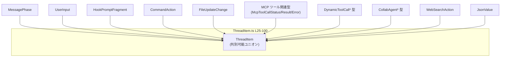
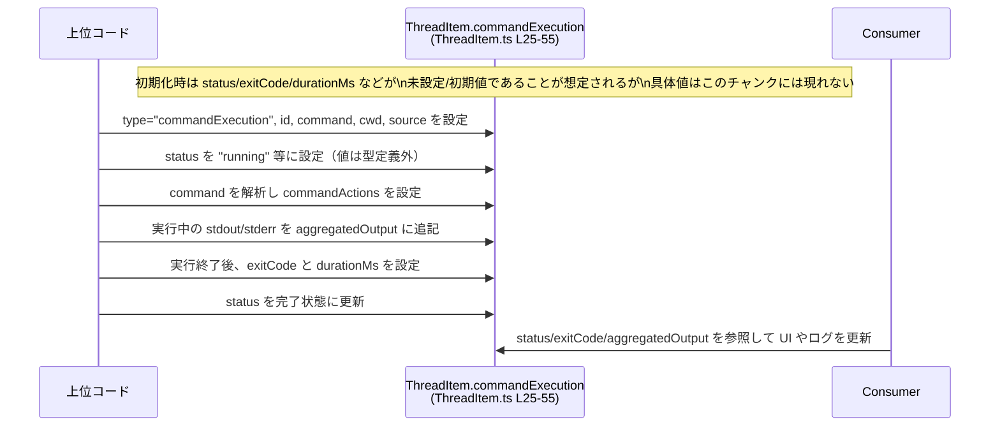

# app-server-protocol/schema/typescript/v2/ThreadItem.ts

## 0. ざっくり一言

このファイルは、スレッド（会話や処理の流れ）内で扱うあらゆる「項目」を 1 つの TypeScript の判別可能ユニオン型 `ThreadItem` として定義するためのスキーマファイルです（`ThreadItem.ts:L25-100`）。  
ユーザメッセージ、エージェントの応答、コマンド実行結果、ツール呼び出し結果などがすべてこの型のバリアントとして表現されます。

---

## 1. このモジュールの役割

### 1.1 概要

- このモジュールは、Rust 側のスキーマから `ts-rs` によって自動生成された TypeScript 型定義です（`ThreadItem.ts:L1-3`）。
- スレッド内で扱われるさまざまなイベント・メッセージを `ThreadItem` という 1 つの判別可能ユニオン型で表現します（`ThreadItem.ts:L25-100`）。
- 各バリアントは `"type"` プロパティの文字列リテラルによって区別され、追加のフィールドでその内容を詳細に表現します（`ThreadItem.ts:L25-100`）。

### 1.2 アーキテクチャ内での位置づけ

- `ThreadItem` は他の多数のスキーマ型に依存する「ハブ」のような型です。  
  例: `UserInput`, `HookPromptFragment`, `CommandAction`, `McpToolCallResult`, `CollabAgentState` など（`ThreadItem.ts:L4-23`）。
- このファイル自身は型定義のみを持ち、ロジック（処理）は持ちません。  
  実際の生成・更新・保存・処理は上位のアプリケーションコード側で行われることになります（このチャンクには上位コードは現れません）。

代表的な依存関係のみを図示すると、次のようになります。



※ 図は主要な依存だけを抜粋したもので、実際には他にも型依存があります（`ThreadItem.ts:L4-23`）。

### 1.3 設計上のポイント

- **自動生成コード**  
  - 冒頭コメントに「GENERATED CODE! DO NOT MODIFY BY HAND!」「ts-rs によって生成」と明記されています（`ThreadItem.ts:L1-3`）。
  - 変更は Rust 側の元定義で行い、この TypeScript は再生成する前提の設計です。
- **判別可能ユニオン（discriminated union）**  
  - すべてのバリアントが `"type"` プロパティを持ち、その値でバリアントが区別されます（例: `"userMessage"`, `"commandExecution"` など、`ThreadItem.ts:L25-100`）。
  - TypeScript では `switch` や `if` で `item.type` を判定することで、安全に各バリアントのフィールドへアクセスできます。
- **nullable / オプショナルなフィールド**  
  - 実行中の状態や未取得の情報を表現するために `| null` やオプショナル（`savedPath?`）が多用されています（`ThreadItem.ts:L37-55,L59-63,L88-100`）。
  - これにより「まだ情報がない」「適用されない」という状態を型レベルで表現していますが、利用側は `null` や `undefined` のチェックが必須です。
- **ロジック非保持**  
  - このモジュールには関数やクラスはなく、純粋なデータ構造のみを提供します（`ThreadItem.ts:L1-100`）。
  - 並行性・エラーハンドリング・I/O などは一切含まれず、すべて外部のコードに委ねられています。

---

## コンポーネントインベントリー

### 型・インポート一覧

このファイルで直接参照している型の一覧です。

| 名前 | 種別 | 定義場所 | 役割 / 用途 | 根拠 |
|------|------|----------|-------------|------|
| `MessagePhase` | 型（詳細不明） | `../MessagePhase` | `"agentMessage"` バリアントの `phase` フィールドの型 | `ThreadItem.ts:L4,L25` |
| `ReasoningEffort` | 型 | `../ReasoningEffort` | `"collabAgentToolCall"` バリアントの `reasoningEffort` フィールドの型 | `ThreadItem.ts:L5,L96` |
| `JsonValue` | 型 | `../serde_json/JsonValue` | MCP / Dynamic ツール呼び出しの `arguments` フィールドの JSON 値表現 | `ThreadItem.ts:L6,L55-63` |
| `CollabAgentState` | 型 | `./CollabAgentState` | `"collabAgentToolCall"` の `agentsStates` レコードの値型 | `ThreadItem.ts:L7,L100` |
| `CollabAgentTool` | 型 | `./CollabAgentTool` | `"collabAgentToolCall"` の `tool` フィールドの型 | `ThreadItem.ts:L8,L71` |
| `CollabAgentToolCallStatus` | 型 | `./CollabAgentToolCallStatus` | `"collabAgentToolCall"` の `status` フィールドの型 | `ThreadItem.ts:L9,L75` |
| `CommandAction` | 型 | `./CommandAction` | `"commandExecution"` の `commandActions` 要素型 | `ThreadItem.ts:L10,L43` |
| `CommandExecutionSource` | 型 | `./CommandExecutionSource` | `"commandExecution"` の `source` フィールドの型 | `ThreadItem.ts:L11,L37` |
| `CommandExecutionStatus` | 型 | `./CommandExecutionStatus` | `"commandExecution"` の `status` フィールドの型 | `ThreadItem.ts:L12,L37` |
| `DynamicToolCallOutputContentItem` | 型 | `./DynamicToolCallOutputContentItem` | `"dynamicToolCall"` の `contentItems` 要素型 | `ThreadItem.ts:L13,L59` |
| `DynamicToolCallStatus` | 型 | `./DynamicToolCallStatus` | `"dynamicToolCall"` の `status` フィールドの型 | `ThreadItem.ts:L14,L59` |
| `FileUpdateChange` | 型 | `./FileUpdateChange` | `"fileChange"` の `changes` 要素型 | `ThreadItem.ts:L15,L55` |
| `HookPromptFragment` | 型 | `./HookPromptFragment` | `"hookPrompt"` バリアントの `fragments` 要素型 | `ThreadItem.ts:L16,L25` |
| `McpToolCallError` | 型 | `./McpToolCallError` | `"mcpToolCall"` の `error` フィールドの型 | `ThreadItem.ts:L17,L55` |
| `McpToolCallResult` | 型 | `./McpToolCallResult` | `"mcpToolCall"` の `result` フィールドの型 | `ThreadItem.ts:L18,L55` |
| `McpToolCallStatus` | 型 | `./McpToolCallStatus` | `"mcpToolCall"` の `status` フィールドの型 | `ThreadItem.ts:L19,L55` |
| `MemoryCitation` | 型 | `./MemoryCitation` | `"agentMessage"` の `memoryCitation` フィールドの型 | `ThreadItem.ts:L20,L25` |
| `PatchApplyStatus` | 型 | `./PatchApplyStatus` | `"fileChange"` の `status` フィールドの型 | `ThreadItem.ts:L21,L55` |
| `UserInput` | 型 | `./UserInput` | `"userMessage"` の `content` 要素型 | `ThreadItem.ts:L22,L25` |
| `WebSearchAction` | 型 | `./WebSearchAction` | `"webSearch"` の `action` フィールドの型 | `ThreadItem.ts:L23,L100` |
| `ThreadItem` | 型エイリアス（ユニオン） | 本ファイル | スレッド内のあらゆる項目を表現するトップレベル型 | `ThreadItem.ts:L25-100` |

### `ThreadItem` のバリアント一覧

| `"type"` 値 | 追加フィールド（概要） | 役割（1 行） | 根拠 |
|-------------|------------------------|--------------|------|
| `"userMessage"` | `id: string`, `content: UserInput[]` | ユーザからの入力メッセージ | `ThreadItem.ts:L25` |
| `"hookPrompt"` | `id: string`, `fragments: HookPromptFragment[]` | フック用プロンプト断片の集合 | `ThreadItem.ts:L25` |
| `"agentMessage"` | `id`, `text`, `phase: MessagePhase \| null`, `memoryCitation: MemoryCitation \| null` | エージェントによるテキスト応答 | `ThreadItem.ts:L25` |
| `"plan"` | `id`, `text` | プラン情報（テキスト） | `ThreadItem.ts:L25` |
| `"reasoning"` | `id`, `summary: string[]`, `content: string[]` | 推論内容の要約と詳細 | `ThreadItem.ts:L25` |
| `"commandExecution"` | `id`, `command`, `cwd`, `processId`, `source`, `status`, `commandActions`, `aggregatedOutput`, `exitCode`, `durationMs` | シェルコマンドの実行と結果 | `ThreadItem.ts:L25-55` |
| `"fileChange"` | `id`, `changes: FileUpdateChange[]`, `status: PatchApplyStatus` | ファイル更新の変更セット | `ThreadItem.ts:L55` |
| `"mcpToolCall"` | `id`, `server`, `tool`, `status`, `arguments: JsonValue`, `result`, `error`, `durationMs` | MCP ツール呼び出しと結果 | `ThreadItem.ts:L55-59` |
| `"dynamicToolCall"` | `id`, `tool`, `arguments: JsonValue`, `status`, `contentItems`, `success`, `durationMs` | 動的ツール呼び出しと結果 | `ThreadItem.ts:L59-63` |
| `"collabAgentToolCall"` | `id`, `tool`, `status`, `senderThreadId`, `receiverThreadIds: string[]`, `prompt`, `model`, `reasoningEffort`, `agentsStates: { [key: string]?: CollabAgentState }` | コラボエージェント間ツール呼び出し | `ThreadItem.ts:L63-100` |
| `"webSearch"` | `id`, `query`, `action: WebSearchAction \| null` | Web 検索アクション | `ThreadItem.ts:L100` |
| `"imageView"` | `id`, `path` | 画像の表示リクエスト | `ThreadItem.ts:L100` |
| `"imageGeneration"` | `id`, `status: string`, `revisedPrompt: string \| null`, `result: string`, `savedPath?: string` | 画像生成の結果 | `ThreadItem.ts:L100` |
| `"enteredReviewMode"` | `id`, `review: string` | レビューモードへの移行 | `ThreadItem.ts:L100` |
| `"exitedReviewMode"` | `id`, `review: string` | レビューモードからの退出 | `ThreadItem.ts:L100` |
| `"contextCompaction"` | `id` | コンテキスト圧縮イベント | `ThreadItem.ts:L100` |

---

## 2. 主要な機能一覧

このモジュールが提供する「機能」は関数ではなくデータ構造ですが、ユニオンの各バリアントが事実上の機能境界になっています。

- スレッド内のユーザ入力表現: `"userMessage"` バリアントで `UserInput[]` を保持（`ThreadItem.ts:L25`）
- フックプロンプトの保持: `"hookPrompt"` バリアントで `HookPromptFragment[]` を保持（`ThreadItem.ts:L25`）
- エージェント応答とメモリ参照の記録: `"agentMessage"` バリアントで `text`, `phase`, `memoryCitation` を保持（`ThreadItem.ts:L25`）
- 計画・推論内容の記録: `"plan"`, `"reasoning"` バリアントでテキスト情報を保持（`ThreadItem.ts:L25`）
- コマンド実行ライフサイクルの記録: `"commandExecution"` バリアントでコマンド、解析結果、出力、終了コードなどを保持（`ThreadItem.ts:L25-55`）
- ファイル変更の記録: `"fileChange"` バリアントでパッチと適用ステータスを保持（`ThreadItem.ts:L55`）
- MCP ツール呼び出しの記録: `"mcpToolCall"` バリアントでリクエスト・結果・エラー・所要時間を保持（`ThreadItem.ts:L55-59`）
- 動的ツール呼び出しの記録: `"dynamicToolCall"` バリアントでリクエスト・出力アイテム・成功可否などを保持（`ThreadItem.ts:L59-63`）
- コラボエージェントツール呼び出し: `"collabAgentToolCall"` バリアントで送受信スレッド、モデル、状態などを保持（`ThreadItem.ts:L63-100`）
- Web 検索や画像表示/生成、レビューモード、コンテキスト圧縮といったイベントの記録（`ThreadItem.ts:L100`）

---

## 3. 公開 API と詳細解説

### 3.1 型一覧

このファイルで公開されている主要な型は 1 つです。

| 名前 | 種別 | 役割 / 用途 | 根拠 |
|------|------|-------------|------|
| `ThreadItem` | 型エイリアス（判別可能ユニオン） | スレッド内のすべての項目を統一的に表現するトップレベルのイベント/メッセージ型 | `ThreadItem.ts:L25-100` |

#### `ThreadItem` の型安全性とエラー挙動（TypeScript 観点）

- **型安全性**  
  - `"type"` フィールドが文字列リテラル型で定義されているため、`switch (item.type)` で分岐すると、各ケース内で TypeScript が自動的に型を絞り込みます（判別可能ユニオンの標準的な挙動）。  
  - これにより、存在しないフィールドへのアクセスや、適用されないバリアントのフィールドへのアクセスがコンパイル時に検出されます。
- **`null` とオプショナル**  
  - 多数のフィールドが `T | null` またはオプショナル（`savedPath?: string`）として定義されているため、利用側がこれらをチェックせずに使用すると **実行時に `null` 参照** になる可能性があります。  
    例: `item.exitCode.toString()` は `exitCode` が `null` の場合に実行時エラーになります（`ThreadItem.ts:L51`）。
- **並行性**  
  - この型自体には非同期処理・スレッド・ロックなどの概念は含まれません。並行性はこの型を利用するアプリケーションコード側の責務です（このチャンクには並行処理コードは現れません）。

### 3.2 関数詳細（最大 7 件）

このファイルには関数は定義されていません（`ThreadItem.ts:L1-100`）。  
代わりに、重要なバリアント 7 件について、関数詳細テンプレートに準じた形式でフィールドと契約を整理します。

---

#### バリアント: `"commandExecution"` (`ThreadItem.ts:L25-55`)

**概要**

- シェルコマンドの実行に関する情報（コマンド文字列、作業ディレクトリ、解析されたアクション、出力、終了コード、実行時間など）を保持するバリアントです。

**フィールド**

| フィールド名 | 型 | 説明 | 根拠 |
|-------------|----|------|------|
| `type` | `"commandExecution"` | バリアント識別子 | `ThreadItem.ts:L25` |
| `id` | `string` | スレッド内で一意と考えられる識別子 | `ThreadItem.ts:L25` |
| `command` | `string` | 実行されるコマンド文字列 | `ThreadItem.ts:L27-29` |
| `cwd` | `string` | コマンドのカレントディレクトリ | `ThreadItem.ts:L31-33` |
| `processId` | `string \| null` | 基盤となる PTY プロセスの ID（利用可能な場合） | `ThreadItem.ts:L35-37` |
| `source` | `CommandExecutionSource` | 実行の起点を表す型（詳細は別ファイル） | `ThreadItem.ts:L37` |
| `status` | `CommandExecutionStatus` | 実行状態（例: 実行中・成功・失敗など、詳細不明） | `ThreadItem.ts:L37` |
| `commandActions` | `CommandAction[]` | コマンドをベストエフォートで解析したアクション一覧 | `ThreadItem.ts:L39-43` |
| `aggregatedOutput` | `string \| null` | stdout/stderr を統合した出力 | `ThreadItem.ts:L45-47` |
| `exitCode` | `number \| null` | コマンドの終了コード | `ThreadItem.ts:L49-51` |
| `durationMs` | `number \| null` | 実行時間（ミリ秒） | `ThreadItem.ts:L53-55` |

**内部処理の流れ（想定されるデータライフサイクル）**

このファイルには処理ロジックはありませんが、コメントから読み取れるデータの流れは次のとおりです。

1. 外部コードが `command` と `cwd` を指定してコマンドを起動し、`status` を初期状態（例: 実行中）に設定する（ロジックはこのチャンクには現れません）。
2. コマンド文字列 `command` を解析し、パイプなどを分解して複数の `CommandAction` に変換し、`commandActions` に格納する（`ThreadItem.ts:L39-43`）。
3. 実行中に標準出力・標準エラーから読み取ったデータを集約して `aggregatedOutput` として保持する（`ThreadItem.ts:L45-47`）。
4. 実行完了時に `exitCode` と `durationMs` を設定し、`status` を完了状態に更新する（`ThreadItem.ts:L49-55`）。

**Errors / Panics**

- この型定義自体はエラーや例外を発生させません。
- 実行時のバグとしては、`exitCode` や `aggregatedOutput` が `null` の可能性を無視してアクセスすることが考えられます。

**Edge cases（エッジケース）**

- コマンドがまだ完了していない段階では、`exitCode`, `durationMs`, `aggregatedOutput` が `null` の可能性があります（`ThreadItem.ts:L47,51,55`）。
- `processId` が `null` の場合は PTY が利用されていない、または ID が取得できていない状態を表します（`ThreadItem.ts:L35-37`）。
- `commandActions` が空配列になりうるかどうかは、このチャンクからは分かりません（パーサ実装は存在しません）。

**使用上の注意点**

- `status` を見てから `exitCode` や `durationMs` を利用するなど、ライフサイクルに応じたチェックが必要です。
- `aggregatedOutput` を UI に表示する際はサイズに注意する必要がありますが、サイズ制限はこの型からは分かりません。
- 非同期処理や並行実行に起因するレースコンディションは、この型だけでは防げません。実際の更新ロジック側で排他・順序管理を行う必要があります。

---

#### バリアント: `"mcpToolCall"` (`ThreadItem.ts:L55-59`)

**概要**

- MCP（詳細不明）のツール呼び出しに関するリクエスト・結果・エラー・所要時間を表現するバリアントです。

**フィールド（抜粋）**

| フィールド名 | 型 | 説明 | 根拠 |
|-------------|----|------|------|
| `type` | `"mcpToolCall"` | バリアント識別子 | `ThreadItem.ts:L55` |
| `id` | `string` | 呼び出しの識別子 | `ThreadItem.ts:L55` |
| `server` | `string` | 呼び出し先サーバ名（詳細不明） | `ThreadItem.ts:L55` |
| `tool` | `string` | ツール名 | `ThreadItem.ts:L55` |
| `status` | `McpToolCallStatus` | 呼び出しの状態 | `ThreadItem.ts:L55` |
| `arguments` | `JsonValue` | ツールに渡した引数（JSON） | `ThreadItem.ts:L55` |
| `result` | `McpToolCallResult \| null` | ツールからの正常結果 | `ThreadItem.ts:L55` |
| `error` | `McpToolCallError \| null` | エラーがあればその内容 | `ThreadItem.ts:L55` |
| `durationMs` | `number \| null` | 呼び出しに要した時間 | `ThreadItem.ts:L57-59` |

**Edge cases**

- `result` と `error` のどちらが `null` で、どちらが非 `null` かという関係（排他か否か）は、この型からは読み取れません。
- `durationMs` が `null` の場合は、まだ完了していない、または計測しなかった状態を示すと考えられますが、詳細は不明です。

**使用上の注意点**

- 利用側では `status` を確認してから `result` または `error` を参照する必要があります。
- `arguments` が `JsonValue` なので、実際のペイロード構造は別の型やバリデーションで管理する必要があります。

---

#### バリアント: `"dynamicToolCall"` (`ThreadItem.ts:L59-63`)

**概要**

- 実行時に決まる動的ツール呼び出しの状態・結果を表現します。

**フィールド（抜粋）**

| フィールド名 | 型 | 説明 | 根拠 |
|-------------|----|------|------|
| `type` | `"dynamicToolCall"` | バリアント識別子 | `ThreadItem.ts:L59` |
| `id` | `string` | 呼び出しの識別子 | `ThreadItem.ts:L59` |
| `tool` | `string` | 呼び出したツール名 | `ThreadItem.ts:L59` |
| `arguments` | `JsonValue` | JSON 形式の引数 | `ThreadItem.ts:L59` |
| `status` | `DynamicToolCallStatus` | 呼び出しの状態 | `ThreadItem.ts:L59` |
| `contentItems` | `DynamicToolCallOutputContentItem[] \| null` | ツール生成コンテンツ | `ThreadItem.ts:L59` |
| `success` | `boolean \| null` | 成否（まだ決まっていない可能性あり） | `ThreadItem.ts:L59` |
| `durationMs` | `number \| null` | 所要時間 | `ThreadItem.ts:L61-63` |

**Edge cases**

- `success` が `null` の場合の意味はこのチャンクには現れません。一般には「未決定」などが想定されますが断定はできません。
- `contentItems` も `null` 許容であり、「出力なし」と「未取得」の区別は利用側の設計に依存します。

**使用上の注意点**

- `success === true` でも `contentItems` が空・`null` の可能性がありうるため、両方を別々に扱うべきです。
- TypeScript 側では `contentItems?.forEach(...)` のようにオプショナルチェーンを利用すると安全です。

---

#### バリアント: `"collabAgentToolCall"` (`ThreadItem.ts:L63-100`)

**概要**

- コラボレーションするエージェント間でのツール呼び出しと、その状態や関連情報（送信元/宛先スレッド、モデル、推論努力レベル、各エージェントの状態など）を表現します。

**フィールド（抜粋）**

| フィールド名 | 型 | 説明 | 根拠 |
|-------------|----|------|------|
| `type` | `"collabAgentToolCall"` | バリアント識別子 | `ThreadItem.ts:L63` |
| `id` | `string` | ツール呼び出しの一意 ID | `ThreadItem.ts:L65-67` |
| `tool` | `CollabAgentTool` | 呼び出したコラボツール | `ThreadItem.ts:L69-71` |
| `status` | `CollabAgentToolCallStatus` | 呼び出しの状態 | `ThreadItem.ts:L73-75` |
| `senderThreadId` | `string` | リクエストを発行したエージェントのスレッド ID | `ThreadItem.ts:L77-79` |
| `receiverThreadIds` | `string[]` | 受信側エージェントのスレッド ID 群 | `ThreadItem.ts:L81-84` |
| `prompt` | `string \| null` | 呼び出しに含まれるプロンプトテキスト | `ThreadItem.ts:L86-88` |
| `model` | `string \| null` | スポーンされたエージェント用のモデル名 | `ThreadItem.ts:L90-92` |
| `reasoningEffort` | `ReasoningEffort \| null` | 推論の強度などを示すパラメータ | `ThreadItem.ts:L94-96` |
| `agentsStates` | `{ [key: string]?: CollabAgentState }` | 対象エージェントの状態マップ | `ThreadItem.ts:L98-100` |

**Edge cases**

- `prompt` / `model` / `reasoningEffort` はすべて `null` になりうるため、「指定なし」と「不明」の区別が必要なら別途フラグが必要ですが、この型には存在しません。
- `agentsStates` はキーごとにオプショナルなプロパティ（`?:`）であり、存在しないキーを読み取ろうとすると `undefined` になります（`ThreadItem.ts:L100`）。

**使用上の注意点**

- `agentsStates` は実質的に「部分マップ」なので、キー存在チェック（`if (id in item.agentsStates)`）が必要です。
- 並行性: 複数のエージェント状態を同時に更新する場合、この型だけでは整合性は保証されません。

---

#### バリアント: `"agentMessage"` (`ThreadItem.ts:L25`)

**概要**

- エージェントが出力したテキストメッセージと、そのフェーズ・メモリ参照を表現します。

**フィールド（抜粋）**

| フィールド名 | 型 | 説明 | 根拠 |
|-------------|----|------|------|
| `type` | `"agentMessage"` | バリアント識別子 | `ThreadItem.ts:L25` |
| `id` | `string` | メッセージ ID | `ThreadItem.ts:L25` |
| `text` | `string` | メッセージ本文 | `ThreadItem.ts:L25` |
| `phase` | `MessagePhase \| null` | メッセージのフェーズ（詳細不明） | `ThreadItem.ts:L25` |
| `memoryCitation` | `MemoryCitation \| null` | メモリ参照情報 | `ThreadItem.ts:L25` |

**Edge cases**

- `phase` や `memoryCitation` が `null` の場合があるため、UI での表示やリンク生成時に null チェックが必要です。

---

#### バリアント: `"userMessage"` (`ThreadItem.ts:L25`)

**概要**

- ユーザからの入力メッセージを表現します。

**フィールド（抜粋）**

| フィールド名 | 型 | 説明 | 根拠 |
|-------------|----|------|------|
| `type` | `"userMessage"` | バリアント識別子 | `ThreadItem.ts:L25` |
| `id` | `string` | メッセージ ID | `ThreadItem.ts:L25` |
| `content` | `UserInput[]` | 入力内容（テキスト・ファイルなど、詳細不明） | `ThreadItem.ts:L25` |

---

#### バリアント: `"imageGeneration"` (`ThreadItem.ts:L100`)

**概要**

- 画像生成のリクエスト・結果と、保存パス等を表現します。

**フィールド（抜粋）**

| フィールド名 | 型 | 説明 | 根拠 |
|-------------|----|------|------|
| `type` | `"imageGeneration"` | バリアント識別子 | `ThreadItem.ts:L100` |
| `id` | `string` | イベント ID | `ThreadItem.ts:L100` |
| `status` | `string` | 画像生成ステータス（列挙ではなく生の文字列） | `ThreadItem.ts:L100` |
| `revisedPrompt` | `string \| null` | 改訂されたプロンプト | `ThreadItem.ts:L100` |
| `result` | `string` | 結果（パスや URL など、詳細不明） | `ThreadItem.ts:L100` |
| `savedPath` | `string` (オプショナル) | 結果を保存したパス（存在しない場合もある） | `ThreadItem.ts:L100` |

**Bugs/Security 観点**

- `status` が単なる `string` 型であり、他のステータス系フィールドが列挙型であるのと対照的です（`ThreadItem.ts:L37,55,59,75,100`）。  
  型レベルの制約が弱く、スペルミスや未知のステータス値をコンパイル時に検出できません。
- `result` や `savedPath` にファイルパスが入ると想定されますが、パスの安全性（ディレクトリトラバーサルなど）についてはこの型からは分かりません。検証は利用側で行う必要があります。

---

### 3.3 その他のバリアント（一覧）

| `"type"` 値 | 役割（1 行） | 根拠 |
|-------------|--------------|------|
| `"plan"` | プランテキストの保持 | `ThreadItem.ts:L25` |
| `"reasoning"` | 推論のサマリと詳細テキストの保持 | `ThreadItem.ts:L25` |
| `"fileChange"` | ファイル更新の変更セットと適用ステータスの保持 | `ThreadItem.ts:L55` |
| `"webSearch"` | Web 検索クエリとアクションの保持 | `ThreadItem.ts:L100` |
| `"imageView"` | 画像表示のためのパスの保持 | `ThreadItem.ts:L100` |
| `"enteredReviewMode"` | レビューモードの開始とその説明 | `ThreadItem.ts:L100` |
| `"exitedReviewMode"` | レビューモードの終了とその説明 | `ThreadItem.ts:L100` |
| `"contextCompaction"` | コンテキスト圧縮イベントのマーカー | `ThreadItem.ts:L100` |

---

## 4. データフロー

このファイルには関数や処理ロジックはなく、データ構造のみが定義されています。  
ここでは代表的な `"commandExecution"` バリアントのデータがどのように変化しうるか、概念的なフローを示します。



- 実際の状態遷移やステータス値は、この型定義には含まれていません（`CommandExecutionStatus` の中身はこのチャンクには現れません）。
- 同様に、MCP ツール呼び出しや Dynamic ツール呼び出しも、リクエスト → 実行中 → 完了 といったライフサイクルに沿って同種のフィールドが更新される設計になっていることがコメントから読み取れます（`ThreadItem.ts:L57-63`）。

---

## 5. 使い方（How to Use）

### 5.1 基本的な使用方法

`ThreadItem` は純粋な型定義なので、アプリケーション側ではこれをインポートして、判別可能ユニオンとして扱います。

```typescript
import type { ThreadItem } from "./ThreadItem";  // 実際のパスはプロジェクト構成による

// ThreadItem を処理する関数の例
function handleThreadItem(item: ThreadItem) {                      // ThreadItem 型を受け取る
    switch (item.type) {                                          // 判別キー type で分岐
        case "userMessage":                                       // ユーザメッセージの場合
            item.content.forEach(input => {                       // content は UserInput[] として扱える
                // input に対する処理（詳細は UserInput の定義次第）
            });
            break;

        case "agentMessage":                                      // エージェントメッセージの場合
            console.log("[AGENT]", item.text);                    // text は常に string
            if (item.phase !== null) {                            // phase は null 許容
                // phase に応じた処理
            }
            break;

        case "commandExecution":                                  // コマンド実行の場合
            if (item.exitCode !== null) {                         // exitCode は null 許容なのでチェック必須
                console.log("Command exited with", item.exitCode);
            } else {
                console.log("Command still running...");
            }
            break;

        // ほかのバリアントも同様にハンドリング
        default:
            // TypeScript の never チェックで網羅性を確認できる
            const _exhaustiveCheck: never = item;
            return _exhaustiveCheck;
    }
}
```

- 判別キー `"type"` によって、各 case 内で `item` の型が自動的に絞り込まれます（TypeScript の標準機能）。
- `null` やオプショナルフィールドは、使用前にチェックすることが安全です。

### 5.2 よくある使用パターン

1. **スレッド全体をレンダリングする UI コード**

```typescript
function renderThread(items: ThreadItem[]) {                      // ThreadItem の配列
    return items.map(item => {                                    // 各項目を描画に変換
        switch (item.type) {
            case "userMessage":
                return renderUserMessage(item);                   // item: { type: "userMessage"; ... }
            case "agentMessage":
                return renderAgentMessage(item);
            case "commandExecution":
                return renderCommandExecution(item);
            // ...他のバリアント
        }
    });
}
```

1. **ツール呼び出し結果だけをフィルタして処理**

```typescript
function getSuccessfulToolCalls(items: ThreadItem[]) {
    return items.filter(item =>
        item.type === "dynamicToolCall" &&
        item.success === true                                     // success は boolean | null
    );
}
```

### 5.3 よくある間違い

```typescript
// 間違い例: 判別せずにフィールドへアクセスしている
function bad(item: ThreadItem) {
    console.log(item.text);       // コンパイルエラー: text は全バリアントに存在しない
}

// 正しい例: type で絞り込む
function good(item: ThreadItem) {
    if (item.type === "agentMessage") {
        console.log(item.text);   // OK: この分岐では item は agentMessage 型になる
    }
}
```

```typescript
// 間違い例: null を考慮せずに利用する
function bad2(item: ThreadItem) {
    if (item.type === "commandExecution") {
        console.log(item.exitCode.toString());  // コンパイルエラー & 実行時エラーの可能性
    }
}

// 正しい例: null チェックを行う
function good2(item: ThreadItem) {
    if (item.type === "commandExecution") {
        if (item.exitCode !== null) {
            console.log(item.exitCode.toString());
        } else {
            console.log("Not finished yet");
        }
    }
}
```

### 5.4 使用上の注意点（まとめ）

- **前提条件**
  - `ThreadItem` はあくまでデータ構造であり、整合性（例: `status` と `exitCode` の整合）は生成側・更新側のコードで保証する必要があります。
- **型安全性**
  - `"imageGeneration"` の `status` のように、`string` 型で型安全性が弱いフィールドが一部存在します（`ThreadItem.ts:L100`）。可能ならアプリケーション側で列挙型ラッパーを定義すると安全です。
- **エラー/セキュリティ**
  - パスやコマンド文字列など、セキュリティ上敏感な情報が文字列としてそのまま格納されます。コマンドインジェクションやパストラバーサル防止などは、**この型の利用者側で必ず行う必要があります**。
- **並行性**
  - 同じ `id` の `ThreadItem` を複数のスレッド/タスクで同時に更新するケースでは、競合状態はこの型では防げません。ストレージや状態管理のレイヤで排他制御が必要です。

---

## 6. 変更の仕方（How to Modify）

### 6.1 新しい機能を追加する場合

- ファイル冒頭に「GENERATED CODE! DO NOT MODIFY BY HAND!」とあるため、**直接この TypeScript ファイルを編集すべきではありません**（`ThreadItem.ts:L1-3`）。
- 新しいバリアントやフィールドを追加する場合の一般的な流れは次のとおりです。
  1. Rust 側の元定義（`ts-rs` から生成される対象の型）に新しいフィールドや列挙値を追加する。  
     ※ その具体的な場所はこのチャンクには現れません。
  2. `ts-rs` を再実行して、この TypeScript ファイルを再生成する。
  3. `ThreadItem` を使用している TypeScript/JavaScript コードで、新しい `type` バリアントやフィールドに対応する処理を追加する。

### 6.2 既存の機能を変更する場合

- **影響範囲の確認**
  - たとえば `"commandExecution"` バリアントのフィールド名や型を変更すると、このバリアントを参照している全ての UI やロジックコードが影響を受けます。
- **契約の維持**
  - `null` 許容かどうか、オプショナルかどうか（`savedPath?: string`）は呼び出し側の前提条件にもなります。型を厳しくする（`null` 非許容にする）場合は、生成側のコードが常に値を設定できることを確認する必要があります。
- **テスト**
  - このファイル内にテストコードは存在しません（このチャンクには現れません）。  
    変更時は、`ThreadItem` を利用している上位レイヤのテスト（シリアライズ/デシリアライズ、UI レンダリング、API レスポンス検証など）を更新する必要があります。

---

## 7. 関連ファイル

このモジュールと密接に関係するファイル（インポート先）です。役割は名前と利用箇所から読み取れる範囲で記述しています。

| パス | 役割 / 関係 | 根拠 |
|------|------------|------|
| `../MessagePhase` | `"agentMessage"` の `phase` フィールドの型を提供 | `ThreadItem.ts:L4,L25` |
| `../ReasoningEffort` | `"collabAgentToolCall"` の `reasoningEffort` の型を提供 | `ThreadItem.ts:L5,L96` |
| `../serde_json/JsonValue` | MCP / Dynamic ツール呼び出しの `arguments` フィールドで JSON 値を表現 | `ThreadItem.ts:L6,L55-63` |
| `./CollabAgentState` | `agentsStates` レコードの値型として、エージェント状態を表現 | `ThreadItem.ts:L7,L100` |
| `./CollabAgentTool` | コラボエージェントツールの種類を表現 | `ThreadItem.ts:L8,L71` |
| `./CollabAgentToolCallStatus` | コラボエージェントツール呼び出しの状態列挙 | `ThreadItem.ts:L9,L75` |
| `./CommandAction` | コマンド解析結果としてのアクションを表現 | `ThreadItem.ts:L10,L39-43` |
| `./CommandExecutionSource` | コマンド実行の起点（ソース）を表現 | `ThreadItem.ts:L11,L37` |
| `./CommandExecutionStatus` | コマンド実行の状態列挙 | `ThreadItem.ts:L12,L37` |
| `./DynamicToolCallOutputContentItem` | Dynamic ツール呼び出しの出力アイテム型 | `ThreadItem.ts:L13,L59` |
| `./DynamicToolCallStatus` | Dynamic ツール呼び出しの状態列挙 | `ThreadItem.ts:L14,L59` |
| `./FileUpdateChange` | ファイル更新の変更差分を表現 | `ThreadItem.ts:L15,L55` |
| `./HookPromptFragment` | フックプロンプトを構成する断片型 | `ThreadItem.ts:L16,L25` |
| `./McpToolCallError` | MCP ツール呼び出しのエラー情報 | `ThreadItem.ts:L17,L55` |
| `./McpToolCallResult` | MCP ツール呼び出しの結果情報 | `ThreadItem.ts:L18,L55` |
| `./McpToolCallStatus` | MCP ツール呼び出しの状態列挙 | `ThreadItem.ts:L19,L55` |
| `./MemoryCitation` | メッセージに紐づくメモリ参照情報 | `ThreadItem.ts:L20,L25` |
| `./PatchApplyStatus` | ファイル変更パッチ適用の状態列挙 | `ThreadItem.ts:L21,L55` |
| `./UserInput` | ユーザからの入力を表す型 | `ThreadItem.ts:L22,L25` |
| `./WebSearchAction` | Web 検索におけるアクション（例: 実行/キャンセルなど、詳細不明）を表す型 | `ThreadItem.ts:L23,L100` |

---

### まとめ（Contracts / Edge Cases / Bugs / Performance の要点）

- **Contracts**
  - 各バリアントは `"type"` によって一意に識別され、そのバリアント特有のフィールドを持つという契約があります（`ThreadItem.ts:L25-100`）。
  - 多くのフィールドが `null` またはオプショナルであり、「まだ値がない」ことを表現する契約が暗黙に存在します。
- **Edge Cases**
  - 実行中のコマンドやツール呼び出しでは、完了後にのみ意味を持つフィールド（`exitCode`, `result`, `durationMs` など）が `null` である可能性があります。
  - `agentsStates` のようなレコード型は、キーが存在しない場合に `undefined` となる点に注意が必要です。
- **Bugs/Security**
  - 型的に厳格でないフィールド（`imageGeneration.status: string` など）があるため、アプリケーション側で値の制約チェックを行う必要があります。
  - コマンド文字列やパスなどはそのまま使用するとセキュリティリスクになりうるため、利用側でサニタイズ・検証が必須です。
- **Performance/Scalability**
  - このモジュールはデータ構造のみであり、直接的なパフォーマンス問題やスケーラビリティ制約はありません。
  - ただし `aggregatedOutput` のようなフィールドに大きな文字列を保持しうるため、スレッド履歴を大量に保持するストレージ側では注意が必要です（サイズ制限などはこのチャンクには現れません）。
