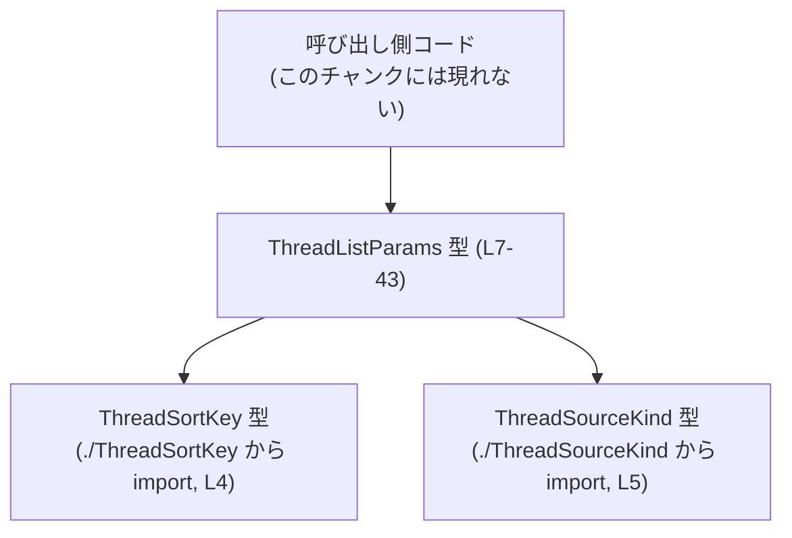
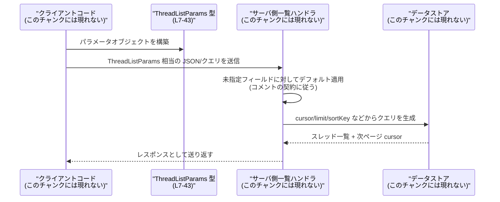

# app-server-protocol/schema/typescript/v2/ThreadListParams.ts

## 0. ざっくり一言

`ThreadListParams` は、スレッド一覧取得処理のための **ページネーション・ソート・各種フィルタ条件** を表現する TypeScript のオブジェクト型です（`app-server-protocol/schema/typescript/v2/ThreadListParams.ts:L7-43`）。このファイルは `ts-rs` によって自動生成されており、手動での編集は前提にしていません（`L1-3`）。

---

## 1. このモジュールの役割

### 1.1 概要

- このモジュールは、スレッド一覧 API などに渡す **リクエストパラメータの型** を定義するために存在します（`L7-43`）。
- ページネーション（`cursor`, `limit`）、並び順（`sortKey`）、プロバイダやソース種別によるフィルタ（`modelProviders`, `sourceKinds`）、アーカイブ状態（`archived`）、作業ディレクトリ（`cwd`）、検索語（`searchTerm`）を一つのオブジェクトで表現します（`L8-43`）。
- 型定義のみで実行ロジックは含まれていないため、エラー処理や並行処理は **このファイル外の実装側** に依存します。

### 1.2 アーキテクチャ内での位置づけ

このファイル内から分かる依存関係は以下のとおりです。

- `ThreadListParams` は以下の型に依存しています。
  - `ThreadSortKey`（ソートキーの列挙や型と推測される）… `./ThreadSortKey` からインポート（`L4`）
  - `ThreadSourceKind`（ソース種別の列挙や型と推測される）… `./ThreadSourceKind` からインポート（`L5`）
- `ThreadListParams` 自体は他のファイルから利用される **公開 API 型** であり、呼び出し側コードはこの型に従ってパラメータを構築すると考えられますが、具体的な呼び出し元はこのチャンクには現れません。

依存関係を Mermaid のグラフで表すと次のようになります。



### 1.3 設計上のポイント（コードから読み取れる範囲）

- **自動生成コード**  
  - `ts-rs` による自動生成であり、手動での編集は想定されていません（`L1-3`）。  
  - 変更は元になっている Rust 側の型定義で行う前提と考えられます（コメントからの推測であり、Rust 側ファイルはこのチャンクには現れません）。

- **すべてのフィールドがオプショナルかつ `null` 許容**  
  - すべてのプロパティに `?` が付いており「プロパティとして存在しない」ケース（`undefined`）を許容しつつ、型も `| null` を含みます（`L11,15,19,24,29,34,39,43`）。  
  - したがって利用側は「存在しない (`undefined`)／`null`／有効な値」の **3 状態** を考慮する必要があります。

- **コメントで振る舞いが明示されたフィルタ条件**  
  - `modelProviders`, `sourceKinds`, `archived` などに対して、値の有無や空配列の場合のサーバー側の解釈がコメントで説明されています（`L20-23,25-28,30-33`）。  
  - 実際の条件分岐ロジックはこのファイルには存在しませんが、呼び出し側がどう値を設定すべきかの契約がコメントとして示されています。

- **並行性・エラー処理は非関与**  
  - このファイルは型定義のみであり、I/O やスレッド操作、例外処理などは一切含まれていません。  
  - TypeScript のコンパイル時に型安全性を高めることが目的です。

---

## 2. 主要な機能一覧

このモジュールが提供する「機能」はすべて型レベルのものです。

- `ThreadListParams` 型: スレッド一覧取得のためのページネーション・ソート・フィルタ条件をまとめたパラメータオブジェクトの型定義（`L7-43`）。

実行時のロジック（実際に DB をクエリする、HTTP リクエストを送る等）は、このファイルには含まれていません。

---

## 3. 公開 API と詳細解説

### 3.1 型一覧（コンポーネントインベントリ）

#### ファイルスコープの型・依存一覧

| 名前 | 種別 | 役割 / 用途 | 定義位置（このファイル内） |
|------|------|------------|----------------------------|
| `ThreadListParams` | 型エイリアス（オブジェクト型） | スレッド一覧取得のパラメータを表現するトップレベルの公開型 | `app-server-protocol/schema/typescript/v2/ThreadListParams.ts:L7-43` |
| `ThreadSortKey` | import された型 | `sortKey` プロパティの型。どのキーでスレッドをソートするかを指定する（詳細はこのチャンクには現れません） | `app-server-protocol/schema/typescript/v2/ThreadListParams.ts:L4` |
| `ThreadSourceKind` | import された型 | `sourceKinds` プロパティの要素型。スレッドのソース種別を表す（詳細はこのチャンクには現れません） | `app-server-protocol/schema/typescript/v2/ThreadListParams.ts:L5` |

#### `ThreadListParams` のプロパティ一覧

`ThreadListParams` は次のプロパティを持つオブジェクト型です（`L7-43`）。

| プロパティ名 | 型 | 説明（コメントに基づく） | 定義位置 |
|--------------|----|-------------------------|----------|
| `cursor` | `string \| null`（オプショナル） | 前回の呼び出しで返された不透明なページネーションカーソル（`Opaque pagination cursor returned by a previous call.`）。指定しない場合の挙動はこのチャンクには明示されていません。 | `ThreadListParams.ts:L8-11` |
| `limit` | `number \| null`（オプショナル） | 1 ページあたりの件数。指定しない場合はサーバ側の妥当なデフォルトが使われる（`Optional page size; defaults to a reasonable server-side value.`）。 | `ThreadListParams.ts:L12-15` |
| `sortKey` | `ThreadSortKey \| null`（オプショナル） | ソートに使用するキー。指定しない場合は `created_at` にデフォルト（`Optional sort key; defaults to created_at.`）。`ThreadSortKey` の具体的な値はこのチャンクには現れません。 | `ThreadListParams.ts:L16-19` |
| `modelProviders` | `Array<string> \| null`（オプショナル） | モデルプロバイダによるフィルタ。設定されている場合は、そのプロバイダで記録されたセッションのみ返す。**存在し、かつ空配列の場合は全プロバイダを含む**（`When present but empty, includes all providers.`）。`undefined` や `null` の挙動はコメントからは不明です。 | `ThreadListParams.ts:L20-24` |
| `sourceKinds` | `Array<ThreadSourceKind> \| null`（オプショナル） | ソース種別によるフィルタ。設定されている場合は、そのソース種別のセッションのみ返す。**省略または空配列の場合、対話的なソース (interactive sources) がデフォルト**（`When omitted or empty, defaults to interactive sources.`）。`null` の扱いについてはこのチャンクには説明がありません。 | `ThreadListParams.ts:L25-29` |
| `archived` | `boolean \| null`（オプショナル） | アーカイブ状態フィルタ。`true` の場合はアーカイブ済スレッドのみ、`false` または `null` の場合は非アーカイブスレッドのみを返す（`If false or null, only non-archived threads are returned.`）。プロパティが完全に省略された場合の扱いはコメントからは不明です。 | `ThreadListParams.ts:L30-34` |
| `cwd` | `string \| null`（オプショナル） | セッションのカレントディレクトリでフィルタ。完全一致するパスを持つスレッドのみ返す（`only threads whose session cwd exactly matches this path`）。 | `ThreadListParams.ts:L35-39` |
| `searchTerm` | `string \| null`（オプショナル） | 抽出されたスレッドタイトルに対する部分一致検索用の文字列（`Optional substring filter for the extracted thread title.`）。具体的な大小文字の扱いや部分一致の方法はこのチャンクには現れません。 | `ThreadListParams.ts:L40-43` |

### 3.2 関数詳細

このファイルには関数・メソッド定義は存在しません（`L1-43` 全体を確認）。そのため、「関数詳細テンプレート」に該当する対象はありません。

### 3.3 その他の関数

- 補助関数やラッパー関数もこのチャンクには一切定義されていません。

---

## 4. データフロー

ここでは、コメントから読み取れる情報に基づいて、`ThreadListParams` が典型的にどのように使われるかという **想定されるデータフロー** を示します。  
実際の関数名やモジュール構造はこのチャンクには現れないため、以下は「利用シナリオの例」であり、具体的な実装を意味するものではありません。

1. クライアント側コードが `ThreadListParams` 型に従ってパラメータオブジェクトを作成する。
2. そのオブジェクトを HTTP リクエスト（クエリパラメータや JSON ボディ）としてサーバに送信する。
3. サーバ側は受け取ったオブジェクトからページネーション／フィルタ条件を読み取り、DB などに対してクエリを発行する。
4. 結果とともに次ページ用の `cursor` を返し、クライアントはそれを次回のリクエストに設定する。

これを Mermaid のシーケンス図で表すと次のようになります。



- `P` ノードがこのファイルで定義された `ThreadListParams` 型（`L7-43`）に相当します。
- デフォルト値の適用やクエリ生成処理はこのファイルには存在せず、サーバ側実装に依存します。

---

## 5. 使い方（How to Use）

### 5.1 基本的な使用方法

`ThreadListParams` は TypeScript 側でオブジェクトリテラルとして構築して利用することが想定されます。  
以下は、**最初のページを取得する例** としての利用イメージです。

```typescript
// ThreadListParams 型を import する（実際の import パスはプロジェクト構成に依存します）
import type { ThreadListParams } from "./ThreadListParams"; // このファイルと同じディレクトリの場合の例

// 最初のページを取得するためのパラメータ
const params: ThreadListParams = {
    // cursor は省略: 最初のページとして扱われる想定（具体的挙動はサーバ実装に依存）
    limit: 50,                                // 1ページあたり50件を要求
    // sortKey: 省略 → created_at が使われる（コメントより）
    archived: null,                           // 非アーカイブのみ（コメントより）
    // sourceKinds, modelProviders は省略
    searchTerm: "error",                      // タイトルに "error" を含むスレッドのみ
};

// ここで params を HTTP クライアントや RPC 呼び出しのパラメータとして利用する想定です。
// 具体的な API 関数名や呼び出し方法はこのチャンクには現れません。
```

### 5.2 よくある使用パターン

#### 1. ページネーション

```typescript
const firstPageParams: ThreadListParams = {
    limit: 20,
};

const secondPageParams: ThreadListParams = {
    limit: 20,
    cursor: "opaque_cursor_from_first_page", // 1ページ目でサーバから返された値をそのまま設定
};
```

- `cursor` は「不透明 (opaque)」と明記されているため（`L8-10`）、クライアント側で解釈せず **そのまま再利用するだけ** が前提です。

#### 2. プロバイダフィルタとソース種別フィルタ

```typescript
const filteredParams: ThreadListParams = {
    modelProviders: ["openai", "local-model"], // この配列に含まれるプロバイダのセッションのみ
    sourceKinds: [],                           // コメント上、空配列 or 省略 → interactive sources がデフォルト
};
```

- `modelProviders` が **空配列かつ「プロパティとして存在する」場合**、コメント上は「全てのプロバイダを含む」と解釈されます（`L20-23`）。
- 同様に、`sourceKinds` の省略または空配列は「interactive sources デフォルト」とコメントされています（`L25-28`）。

#### 3. アーカイブ状態によるフィルタ

```typescript
const archivedOnly: ThreadListParams = {
    archived: true,  // アーカイブ済スレッドのみ
};

const activeOnly1: ThreadListParams = {
    archived: false, // 非アーカイブのみ
};

const activeOnly2: ThreadListParams = {
    archived: null,  // コメント上は false と同じ扱い（非アーカイブのみ）
};
```

- `archived` の `true / false / null` の意味はコメントで明示されています（`L30-33`）。

### 5.3 よくある間違いと注意点

```typescript
// 誤りの可能性がある例:
// 「このプロバイダだけに絞りたい」つもりで空配列を渡してしまう
const paramsWrong: ThreadListParams = {
    modelProviders: [],  // コメント上は「全プロバイダを含む」扱い
};

// 正しい意図の表現例:
const paramsCorrect: ThreadListParams = {
    modelProviders: ["specific-provider"], // ここに明示的に列挙する必要がある
};
```

- `modelProviders` の **空配列は「何もない」ではなく「全て」** なので、直感と異なる挙動になる可能性があります（`L20-23`）。

```typescript
// 誤りの可能性がある例:
// 「アーカイブ状態を問わない」と解釈して null を渡す
const paramsMaybeWrong: ThreadListParams = {
    archived: null,  // コメント上は「非アーカイブのみ」
};
```

- コメント上、`archived: null` は「非アーカイブのみ」とされており、「状態を問わない」わけではありません（`L30-33`）。  
  状態を問わないクエリをサポートするかどうかは、このチャンクからは分かりません。

### 5.4 使用上の注意点（まとめ）

- **すべてのプロパティがオプショナルかつ `null` 許容**  
  → 呼び出し側では `undefined` と `null` と有効値の違いを明確に扱う必要があります。

- **コメントが契約の一部**  
  - `modelProviders` の空配列の意味、`sourceKinds` の省略・空配列の意味、`archived` の `null` の意味などは、コメントにのみ記述されています（`L20-23,25-28,30-33`）。
  - これらを前提にサーバ側が実装されている可能性が高く、呼び出し側もその前提に従う必要があります。

- **型安全性とランタイムエラー**  
  - TypeScript の型により「プロパティ名のスペルミス」「型違い」はコンパイル時に検出できます。
  - 一方で、`null` や `undefined` をチェックせずに使用した場合のランタイムエラー（例えば `params.cursor!.toString()` のようなコード）は、利用側の責任となります。

- **並行性**  
  - この型定義自体は並行性に関する情報を持ちません。  
  - どのスレッドから使っても構わない「単なるデータ構造」であり、実行時の並列処理は別の層で制御されます。

---

## 6. 変更の仕方（How to Modify）

このファイルは自動生成であり、先頭コメントに「手動で編集しないこと」が明記されています（`L1-3`）。

```text
// GENERATED CODE! DO NOT MODIFY BY HAND!
// This file was generated by [ts-rs](...). Do not edit this file manually.
```

### 6.1 新しい機能を追加する場合

- **このファイルを直接編集しないことが前提** です。
- 新しいフィルタ項目などを追加したい場合は:
  1. 元になっている **Rust 側の型定義**（`ts-rs` が参照している構造体／タイプ）を変更する。  
     - この Rust ファイルのパスや名前は、このチャンクには現れません。
  2. `ts-rs` のコード生成プロセスを再実行し、新しい `ThreadListParams.ts` を生成する。
  3. TypeScript 側（クライアントや API ハンドラ）で、新しいプロパティを利用するコードを追加する。

### 6.2 既存の機能を変更する場合

- 仕様変更（例: `archived` の `null` の意味を変えたい）も、同様に **Rust 側の元型と生成ロジック** を変更する必要があります。
- 影響範囲として想定されるもの:
  - この型を引数や戻り値として利用しているすべての TypeScript コード（呼び出し側）。
  - サーバ側で `ThreadListParams` 相当の構造体を解釈している箇所（DB クエリ生成など）。
- 契約上の注意:
  - コメントに記載されている意味（特に `modelProviders` の空配列や `archived: null` の扱い）は、既存クライアントやサーバ実装が前提にしている可能性があります。  
  - これを変更する場合は、プロトコルのバージョンアップや後方互換性の検討が必要になります（このチャンクにはバージョニング戦略は現れません）。

---

## 7. 関連ファイル

このモジュールと密接に関係するファイル・型は、インポートやコメントから次のように読み取れます。

| パス / 名前 | 役割 / 関係 | 根拠 |
|-------------|-------------|------|
| `app-server-protocol/schema/typescript/v2/ThreadSortKey.ts`（推定パス） | `ThreadListParams.sortKey` プロパティの型を定義するモジュール。ソートキーの列挙や型が定義されていると考えられます。 | `import type { ThreadSortKey } from "./ThreadSortKey";`（`ThreadListParams.ts:L4`）。実際のファイル内容はこのチャンクには現れません。 |
| `app-server-protocol/schema/typescript/v2/ThreadSourceKind.ts`（推定パス） | `ThreadListParams.sourceKinds` プロパティの要素型を定義するモジュール。スレッドのソース種別（interactive など）を表すと考えられます。 | `import type { ThreadSourceKind } from "./ThreadSourceKind";`（`ThreadListParams.ts:L5`）。内容はこのチャンクには現れません。 |
| Rust 側の元型（ファイルパス不明） | `ts-rs` が参照する元の Rust 型定義。`ThreadListParams` に対応する構造体や型が定義されているはずです。 | 先頭コメント「This file was generated by [ts-rs]」（`ThreadListParams.ts:L1-3`）より。具体的な位置や名前はこのチャンクには現れません。 |
| テストコード | このチャンクにはテストファイルやテストケースは現れません。存在の有無や場所は不明です。 | このファイル内に `describe` / `test` / `it` などのテスト関連コードや import が存在しないことから。 |

---

### Bugs / Security / Contracts / Edge Cases まとめ（このファイルから分かる範囲）

- **Bugs の可能性（利用側の観点）**
  - `modelProviders` の空配列の意味を「何もマッチしない」と誤解すると、意図しない結果（全プロバイダ）になる可能性（`L20-23`）。
  - `archived: null` を「アーカイブ状態を問わない」と誤解すると、実際は「非アーカイブのみ」扱いになる可能性（`L30-33`）。

- **Security**
  - `cwd` や `searchTerm` は任意文字列としてサーバに渡る想定であり、サーバ側で SQL インジェクションやパス・トラバーサルを防ぐ必要がありますが、その防御ロジックはこのファイルには含まれません。  
  - このファイルは型定義のみであり、直接的なセキュリティ対策や脆弱性は含みません。

- **Contracts / Edge Cases**
  - `sourceKinds`: 省略または空配列 → interactive sources がデフォルト（`L25-28`）。`null` の扱いは不明。
  - `modelProviders`: **存在していて空配列** → 全プロバイダ（`L20-23`）。`undefined` / `null` の扱いは不明。
  - `archived`: `true` → アーカイブのみ、`false` / `null` → 非アーカイブのみ（`L30-33`）。プロパティ自体が存在しない場合はコメントから分かりません。
  - `cursor`: 不透明な値であり、クライアント側が意味を解釈しないことが契約（`L8-10`）。

- **Performance / Scalability（このファイル単体の観点）**
  - 型定義のみで実行時コストはありません。  
  - 実際のスケーラビリティは、`limit` のデフォルト値やサーバ側クエリ実装に依存します。

このファイルは、型安全なプロトコル定義としての役割に特化しており、実際のロジックやパフォーマンス・セキュリティ特性は別モジュールに委ねられている構造になっています。
