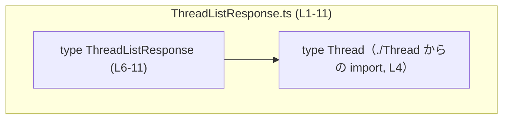
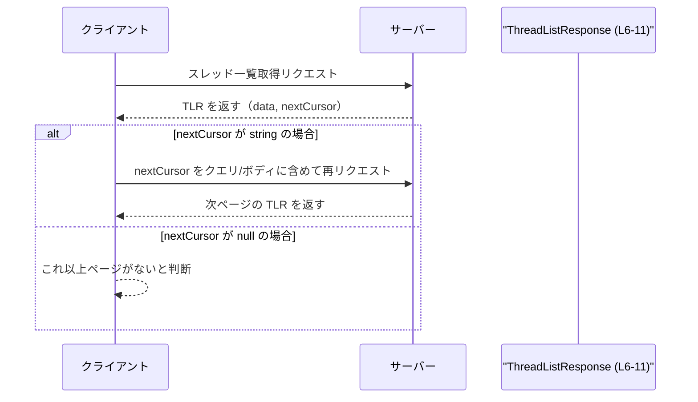

# app-server-protocol/schema/typescript/v2/ThreadListResponse.ts

## 0. ざっくり一言

`ThreadListResponse` 型は、「スレッド (`Thread`) の配列」と「次ページ取得用カーソル (`nextCursor`)」から成る、ページング付きスレッド一覧レスポンスの TypeScript 型定義です。

---

## 1. このモジュールの役割

### 1.1 概要

- このモジュールは、スレッド一覧 API などで用いられると想定されるレスポンスボディの **スキーマ定義** を提供します。
- `data` に `Thread` の配列、`nextCursor` に次のページを取得するための不透明カーソル（なければ `null`）を保持する構造になっています。  
  （コメントより読み取れます。`ThreadListResponse.ts:L6-11`）

### 1.2 アーキテクチャ内での位置づけ

- パスから、このファイルは「app-server-protocol の TypeScript スキーマ定義 (v2)」の一部であると分かります。
- `ThreadListResponse` は `Thread` 型（同ディレクトリの `./Thread`）に依存していますが、逆方向の依存はコードからは読み取れません。  
  （`import type { Thread } from "./Thread";` より。`ThreadListResponse.ts:L4`）

#### 依存関係図（コンポーネントレベル）

以下は、このチャンクに現れる範囲での依存関係を示した図です。



- `ThreadListResponse` はフィールド `data: Array<Thread>` を通じて `Thread` に依存します。
- `Thread` の具体的な定義はこのチャンクには現れません（`./Thread` 側のコードは不明です）。

### 1.3 設計上のポイント

コードから読み取れる設計上の特徴は次のとおりです。

- **自動生成コードであること**  
  - 先頭コメントに「GENERATED CODE! DO NOT MODIFY BY HAND!」と明示されており、`ts-rs` により自動生成されています。  
    （`ThreadListResponse.ts:L1-3`）
  - 手動編集を前提としていないため、変更は元のスキーマ定義（おそらく Rust 側）を更新した上で再生成する設計です。
- **純粋な型定義（状態・ロジックなし）**  
  - 関数やクラス、実行時ロジックは一切含まれず、`export type` による型エイリアスのみを提供しています。  
    （`ThreadListResponse.ts:L6-11`）
- **ページング情報の表現**  
  - `nextCursor: string | null` により、「カーソルがある / ない」を型レベルで区別しています。  
  - コメントには「None の場合、これ以上返す項目はない」と書かれており、`null` が「これ以上データがない」ことを表す契約であると読み取れます。  
    （`ThreadListResponse.ts:L7-10`）
- **エラーハンドリング・並行性はこのモジュール外**  
  - 型定義のみであり、例外処理や並行処理に関わるコードは含まれません。この型を使う呼び出し側がエラーや競合状態を扱う前提です。

---

## 2. 主要な機能一覧

このファイルは機能というより「データ構造の定義」を提供します。その観点での主要な要素は次のとおりです。

- `ThreadListResponse`: スレッド一覧と次ページ用カーソルをまとめたレスポンス型
- `data` フィールド: `Thread` の配列を保持する
- `nextCursor` フィールド: 次ページ取得に用いる不透明カーソル（`string | null`）

---

## 3. 公開 API と詳細解説

### 3.1 型一覧（構造体・列挙体など）

このチャンクに現れる型・インポートのインベントリです。

| 名前 | 種別 | 役割 / 用途 | 根拠 |
|------|------|-------------|------|
| `ThreadListResponse` | 型エイリアス (`export type`) | スレッド一覧レスポンスの構造を表す。`data` と `nextCursor` を持つ。 | `ThreadListResponse.ts:L6-11` |
| `Thread` | 型（import のみ） | 各スレッド要素の構造を表す型。`data` 配列の要素型として利用される。定義本体はこのチャンクには現れない。 | `ThreadListResponse.ts:L4` |

`ThreadListResponse` のフィールド構造は次のとおりです。

| フィールド名 | 型 | 説明 | 根拠 |
|--------------|----|------|------|
| `data` | `Array<Thread>` | スレッド一覧。各要素は `Thread` 型。空配列である可能性もある。 | `ThreadListResponse.ts:L6` |
| `nextCursor` | `string \| null` | 次の API 呼び出しに渡す不透明カーソル。`null` の場合は「これ以上返すアイテムがない」ことを表すとコメントから読み取れる。 | `ThreadListResponse.ts:L7-10, L11` |

#### TypeScript の観点での補足

- `export type ThreadListResponse = { ... }` は「型エイリアス」です。  
  実行時には存在せず、コンパイル時の型チェックやエディタ補完に利用されます。
- `Array<Thread>` は `Thread[]` と等価で、`Thread` 型の配列を表します。
- `string | null` は **ユニオン型** で、「`string` か `null` のどちらか」を意味し、呼び出し側に `null` チェックを強制します。

### 3.2 関数詳細（最大 7 件）

このファイルには関数・メソッド・クラスコンストラクタなどの **実行時ロジック** は定義されていません。  
したがって、詳細テンプレートで解説すべき公開関数は存在しません。

- 該当なし。

### 3.3 その他の関数

- このチャンクには関数が一切定義されていません。

---

## 4. データフロー

このセクションでは、コメントに書かれた説明に基づいて、`ThreadListResponse` がどのようにデータフローに関与するかの典型パターンを示します。

コメント:

```ts
/**
 * Opaque cursor to pass to the next call to continue after the last item.
 * if None, there are no more items to return.
 */
```

（`ThreadListResponse.ts:L7-10`）

これに基づき、次のようなフローが想定されます。

1. クライアントがサーバーにスレッド一覧の取得を要求する。
2. サーバーは `ThreadListResponse` 形式のレスポンスを返す。`data` にスレッド配列、`nextCursor` に次ページ用カーソル（存在しない場合は `null`）を入れる。
3. クライアントは `nextCursor` が `null` でなければ、次のリクエストでそのカーソルをサーバーに渡して続きを取得する。

### シーケンス図（典型的な利用イメージ）



※これはコメントに基づく一般的なページングフローの説明であり、実際の HTTP エンドポイント名やパラメータ名はこのチャンクからは分かりません。

---

## 5. 使い方（How to Use）

### 5.1 基本的な使用方法

`ThreadListResponse` 型は、API クライアントコードやサーバー側ハンドラの戻り値として利用されることが想定されます。  
ここでは、クライアント側での典型的な利用例を示します。

```typescript
// ThreadListResponse 型を import する
import type { ThreadListResponse } from "./ThreadListResponse";  // スキーマ定義ファイル

// Thread 型も必要なら import する
import type { Thread } from "./Thread";

// API から ThreadListResponse を取得する関数の例
async function fetchThreads(cursor: string | null): Promise<ThreadListResponse> {
    // 実際には fetch や axios などで HTTP リクエストを送ることを想定
    const params = cursor ? `?cursor=${encodeURIComponent(cursor)}` : "";  // カーソルがあればクエリに付与
    const res = await fetch(`/api/threads${params}`);                      // スレッド一覧 API を呼び出す
    const json = await res.json();                                         // JSON を取得

    // json が ThreadListResponse と互換であると仮定
    return json as ThreadListResponse;                                     // ランタイム検証が必要なら別途行う
}

// 取得したレスポンスを使う例
async function showThreads() {
    let cursor: string | null = null;                                      // 最初はカーソルなし
    let hasMore = true;                                                    // 続きがあるかどうかのフラグ

    while (hasMore) {
        const response = await fetchThreads(cursor);                       // ThreadListResponse を取得
        const threads: Thread[] = response.data;                           // スレッド配列を取り出す

        // スレッドを画面に表示するなどの処理
        for (const thread of threads) {
            console.log(thread);                                           // 実際には UI に描画するなど
        }

        cursor = response.nextCursor;                                      // 次ページ用カーソルを更新
        hasMore = cursor !== null;                                         // null なら終了
    }
}
```

この例では、`ThreadListResponse` により `response.data` や `response.nextCursor` の存在と型が保証されるため、編集時の補完や型チェックが利きます。

### 5.2 よくある使用パターン

1. **単純なページネーション（「もっと見る」ボタン）**

```typescript
let cursor: string | null = null;                            // 現在のカーソル
let loading = false;                                         // ローディングフラグ

async function loadMore() {
    if (loading) return;                                     // 二重リクエスト防止
    if (cursor === null && threads.length > 0) return;       // 既に末尾まで取得済みなら何もしない

    loading = true;
    try {
        const res: ThreadListResponse = await fetchThreads(cursor); // ThreadListResponse として受け取る
        threads.push(...res.data);                                 // 既存リストに追加
        cursor = res.nextCursor;                                   // 新しいカーソルを保存
    } finally {
        loading = false;
    }
}
```

1. **初回ロードだけでページングしない場合**

```typescript
async function loadInitial() {
    const res: ThreadListResponse = await fetchThreads(null);  // 最初は必ず null を渡す
    threads = res.data;                                       // 一度だけロードして表示
    // res.nextCursor を無視することも可能だが、将来ページングを追加する余地を残せる
}
```

### 5.3 よくある間違い

#### 1. `nextCursor` が `null` の場合を考慮しない

```typescript
// 誤り例: nextCursor が null の場合を考慮していない
const nextCursor: string = response.nextCursor;   // コンパイルエラー: string | null を string に代入できない
```

```typescript
// 正しい例: null チェックを行う
const nextCursorOrNull = response.nextCursor;     // 型: string | null
if (nextCursorOrNull !== null) {
    // ここでは nextCursorOrNull は string として扱える
    console.log("次のカーソル:", nextCursorOrNull);
} else {
    console.log("これ以上のページはありません");
}
```

#### 2. `nextCursor` をクライアント側で勝手に生成・改変する

コメントから「Opaque cursor（不透明カーソル）」と書かれているため、カーソルはサーバーが管理する内部表現であり、クライアントは中身を理解したり改変したりしないことが意図されていると解釈できます。  
（`ThreadListResponse.ts:L7-8`）

```typescript
// 誤り例: カーソルの中身を推測して勝手に生成する
const fakeCursor = "page=10";                  // サーバーが想定していない形式を作ってしまう
const res = await fetchThreads(fakeCursor);    // 予期しないエラーや不正アクセスになる可能性
```

```typescript
// 正しい例: サーバーから受け取った nextCursor のみをそのまま再利用する
let cursor: string | null = null;
let res = await fetchThreads(cursor);
cursor = res.nextCursor;                       // 文字列の中身には依存しない
```

### 5.4 使用上の注意点（まとめ）

- **`nextCursor` は必ず null チェックをしてから使う**  
  - 型が `string | null` であるため、TypeScript によるコンパイル時チェックでも警告されます。
- **カーソルは「不透明」として扱う**  
  - コメント上の設計意図から、カーソルの形式を解釈したり自前で生成したりしないほうが安全です。
- **ランタイム型チェックは別途必要**  
  - `ThreadListResponse` はコンパイル時の型であり、`fetch().json()` の戻り値が実際にこの構造になっているかは保証されません。  
    必要に応じて Zod などのランタイムバリデーションライブラリで検証することが推奨されます（このファイルから具体的な利用は分かりません）。

---

## 6. 変更の仕方（How to Modify）

### 6.1 新しい機能を追加する場合

このファイルは自動生成コードであり、先頭コメントに「DO NOT MODIFY BY HAND!」とあるため、直接編集すべきではありません。  
（`ThreadListResponse.ts:L1-3`）

新しいフィールドや機能を追加したい場合の一般的な流れは次のとおりです。

1. **元となるスキーマ定義を特定する**  
   - コメントから、このファイルは `ts-rs` によって生成されていることが分かります。  
     （`ThreadListResponse.ts:L3`）
   - `ts-rs` は通常 Rust の構造体から TypeScript 型を生成するため、Rust 側に `ThreadListResponse` に対応する型定義が存在する可能性が高いです（これは一般的な知識に基づく推測であり、このチャンクには Rust コードは現れません）。
2. **Rust 側（または元スキーマ）の型定義にフィールドを追加・変更する**  
   - 例: `total_count: u64` のようなフィールドを追加する、など。
3. **`ts-rs` によるコード生成を再実行する**  
   - 生成プロセスはこのチャンクからは分かりませんが、ビルドスクリプトや専用コマンドなどが用意されていることが多いです。
4. **生成された `ThreadListResponse.ts` に新フィールドが反映されていることを確認する**

### 6.2 既存の機能を変更する場合

`ThreadListResponse` 型の既存フィールド（特に `nextCursor`）の意味を変える場合は、呼び出し側との契約に影響します。

変更を行う際の注意点:

- **影響範囲の確認**
  - `ThreadListResponse` を import している TypeScript ファイル（例: API クライアント、フロントエンド UI）をすべて検索する必要があります。
  - 具体的な使用箇所はこのチャンクには現れないため、コードベース全体での検索が必要です。
- **契約の確認**
  - コメントには「None の場合、これ以上返すアイテムはない」とあるため、`nextCursor` の意味を変える場合はこの契約と矛盾しないよう注意が必要です。
- **テストの更新**
  - 型の変更により、コンパイルエラーで気づける部分もありますが、実際の API 通信を伴うテスト（統合テストなど）も更新が必要です。
- **生成元のスキーマとの同期**
  - TypeScript 側だけでなく、生成元（Rust など）の型定義も同様に変更し、両者を同期させる必要があります。

---

## 7. 関連ファイル

このモジュールと密接に関係していると考えられるファイルを整理します。

| パス | 役割 / 関係 | 根拠 |
|------|-------------|------|
| `app-server-protocol/schema/typescript/v2/Thread.ts`（想定） | `ThreadListResponse` の `data: Array<Thread>` に使われる `Thread` 型の定義。`import type { Thread } from "./Thread";` から同ディレクトリの `Thread` モジュールであることが分かるが、実際の内容はこのチャンクには現れない。 | `ThreadListResponse.ts:L4` |
| Rust 側の `ThreadListResponse` 相当の型定義（ファイルパス不明） | `ts-rs` により本ファイルを生成する元となる型定義である可能性が高い。具体的な場所や構造はこのチャンクには現れない。 | `ThreadListResponse.ts:L3` |

---

### 言語固有の安全性・エラー・並行性に関する補足

- **型安全性**  
  - `ThreadListResponse` は TypeScript の型エイリアスであり、IDE 補完やコンパイル時の型チェックによって、`data` や `nextCursor` の存在や型を保証します。
  - `nextCursor: string | null` によって、「カーソルがない状態」が型として表現されるため、`null` チェックを忘れるとコンパイルエラーや警告で気づくことができます。
- **エラー（ランタイム）**  
  - このファイル自体にはランタイムコードがないため、ここから直接エラーが発生することはありません。
  - ただし、実際に API レスポンスをパースするコードが `as ThreadListResponse` のような型アサーションに依存すると、構造が違ってもコンパイルが通るため、ランタイムエラーや UI の不整合が起きる可能性があります。
- **並行性**  
  - 型定義のみであり、並行実行・スレッドセーフティに関するコードは含まれません。
  - 同時に複数のカーソルを扱う場合（複数タブ、複数検索条件など）は、呼び出し側のロジックでカーソルとレスポンスの対応関係を管理する必要があります。この型自体はそれを制約しません。

以上が、このチャンク（`ThreadListResponse.ts:L1-11`）から読み取れる `ThreadListResponse` 型の客観的な解説です。
