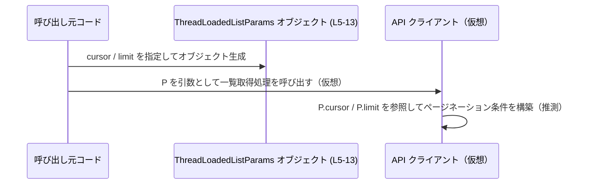

# app-server-protocol/schema/typescript/v2/ThreadLoadedListParams.ts コード解説

---

## 0. ざっくり一言

- v2 プロトコルにおける「スレッド一覧取得」のページネーション用パラメータを表す、生成済み TypeScript 型定義です (ThreadLoadedListParams.ts:L1-3, L5-13)。

---

## 1. このモジュールの役割

### 1.1 概要

- このモジュールは、**スレッド一覧をページネーション付きで取得する操作**のためのパラメータ型 `ThreadLoadedListParams` を提供します (ThreadLoadedListParams.ts:L5)。  
- パラメータとしては、前回呼び出し時に返された不透明なカーソル `cursor` と、1 ページに含める件数を示す `limit` をオプションで受け取ります (ThreadLoadedListParams.ts:L6-9, L10-13)。  
- ファイル先頭のコメントから、この型定義は Rust から TypeScript への型生成ツール ts-rs により自動生成されており、手動編集は想定されていません (ThreadLoadedListParams.ts:L1-3)。

### 1.2 アーキテクチャ内での位置づけ

このモジュール自体は型定義のみを提供し、実際の API 呼び出しロジックやデータ取得処理は別のモジュールに存在すると考えられます。ただし、このチャンクにはそれらのコードは含まれていません。

型の利用イメージを、抽象的な依存関係として図示します。


- `C` はこの型を使ってリクエストパラメータオブジェクトを構築する側を表します。  
- `H` は「ThreadLoadedList」のような一覧取得処理を抽象的に表したもので、**このチャンクには定義が存在しない仮想コンポーネント**です。

### 1.3 設計上のポイント

- **自動生成コードであることが明示されている**  
  - `// GENERATED CODE! DO NOT MODIFY BY HAND!` と ts-rs への言及により、手動編集禁止であることが示されています (ThreadLoadedListParams.ts:L1-3)。
- **純粋なデータコンテナ**  
  - `export type` によるオブジェクト型エイリアスであり、関数やメソッドは一切含まれません (ThreadLoadedListParams.ts:L5-13)。
- **オプショナルかつ null 許容なプロパティ**  
  - `cursor?: string | null`、`limit?: number | null` と定義されており、  
    - プロパティ自体が存在しない  
    - `undefined`  
    - `null`  
    - 有効な値  
    の いずれの状態も表現可能です (ThreadLoadedListParams.ts:L5-13)。
- **ページネーション仕様の一部をコメントで規定**  
  - `cursor` は「前回の呼び出しで返された不透明なカーソル」と説明されています (ThreadLoadedListParams.ts:L6-9)。  
  - `limit` は「オプションのページサイズで、未指定時は制限なし」とコメントされています (ThreadLoadedListParams.ts:L10-12)。

---

## 2. 主要な機能一覧

このファイルは 1 つの公開型のみを提供します。

- `ThreadLoadedListParams`:  
  スレッド一覧の取得時に用いるページネーションパラメータ（`cursor` と `limit`）を表現するオブジェクト型です (ThreadLoadedListParams.ts:L5-13)。

---

## 3. 公開 API と詳細解説

### 3.1 型一覧（構造体・列挙体など）

| 名前                     | 種別                           | フィールド                                                                 | 役割 / 用途                                                                                                                                           | 根拠 |
|--------------------------|--------------------------------|----------------------------------------------------------------------------|--------------------------------------------------------------------------------------------------------------------------------------------------------|------|
| `ThreadLoadedListParams` | 型エイリアス（オブジェクト型） | `cursor?: string \| null`, `limit?: number \| null` | スレッド一覧の取得時に使用されるページネーションパラメータを表す。カーソルベースのページングと、任意のページサイズ指定をサポートします。 | ThreadLoadedListParams.ts:L5-13 |

各フィールドの詳細です。

- `cursor?: string | null` (ThreadLoadedListParams.ts:L6-9)  
  - 「前回の呼び出しで返された不透明なページネーションカーソル」とコメントされています。  
  - `?` によりプロパティはオプショナルで、さらに `null` も許容されるため、  
    - プロパティ自体が存在しない（初回取得など）  
    - 明示的に `null` が渡される  
    という状態が区別され得ます。
- `limit?: number | null` (ThreadLoadedListParams.ts:L10-13)  
  - 「オプションのページサイズで、デフォルトは制限なし」とコメントされています。  
  - 同様にオプショナルかつ `null` 許容であり、  
    - 「プロパティ未指定 or null」= 「制限なし」  
    という契約がコメント上で示唆されています。

### 3.2 関数詳細（最大 7 件）

- **本ファイルには関数・メソッドは定義されていません** (ThreadLoadedListParams.ts:L1-13)。  
  そのため、関数詳細テンプレートに該当する API はありません。

### 3.3 その他の関数

- 該当なし（関数定義が存在しないため）(ThreadLoadedListParams.ts:L1-13)。

---

## 4. データフロー

このセクションでは、**一般的な利用イメージ**として、`ThreadLoadedListParams` を用いたスレッド一覧 1 ページ取得の流れを示します。  
実際の関数・メソッド名や構造はこのチャンクには含まれていないため、図中の呼び出し先は「仮想コンポーネント」として扱います。



- `ThreadLoadedListParams` 自体にはロジックは含まれないため、**データの保持と受け渡し**のみを担います (ThreadLoadedListParams.ts:L5-13)。  
- ページネーションの具体的な計算や、カーソルの解釈は、呼び出し側・サーバ側の実装に委ねられています（このチャンクでは不明）。

---

## 5. 使い方（How to Use）

### 5.1 基本的な使用方法

`ThreadLoadedListParams` を用いて、前回取得の続きのページを 50 件ずつ取得するイメージのコード例です。  
ここでの API 関数 `fetchThreadLoadedList` は **型の利用例を示すための仮想関数であり、このリポジトリ内に存在するとは限りません**。

```typescript
// 型定義のインポート（パスは例です）
import type { ThreadLoadedListParams } from "./ThreadLoadedListParams";

// 前回の呼び出しで返されたカーソル                        // コメント: Opaque pagination cursor (L6-9)
const previousCursor = "opaque-cursor-from-previous-call";

// ThreadLoadedListParams オブジェクトを構築する
const params: ThreadLoadedListParams = {
    cursor: previousCursor,  // 前回呼び出しから取得したカーソルを指定
    limit: 50,               // 1 ページあたり 50 件に制限（L10-13の「Optional page size」に対応）
};

// 仮想的な API 呼び出し（実際の実装はこのチャンクには存在しません）
async function fetchThreadLoadedList(_params: ThreadLoadedListParams) {
    // ここで _params.cursor / _params.limit を使用して API を呼び出す想定
}

await fetchThreadLoadedList(params);
```

TypeScript の型安全性の観点では:

- `cursor` に数値やオブジェクトを渡そうとするとコンパイルエラーになります。  
- `limit` に文字列を渡した場合も同様にコンパイルエラーになり、**静的型チェックによるエラー検出**が可能です (ThreadLoadedListParams.ts:L5-13)。

### 5.2 よくある使用パターン

#### 1. 初回ページ取得（カーソルなし、件数制限あり）

```typescript
const paramsFirstPage: ThreadLoadedListParams = {
    // cursor は省略: 初回ページなど                     // cursor?: string | null (L6-9)
    limit: 20,                                           // 20 件のみ取得
};
```

- `cursor` を指定しないことで、「最初のページ」や「最新の状態からの開始」を表現できるケースが想定されます（この点は型名・コメントからの解釈です）。

#### 2. 全件取得（limit 未指定・null）

コメントでは「limit のデフォルトは制限なし」とされています (ThreadLoadedListParams.ts:L10-12)。  
そのため、呼び出し側が制限を課したくない場合に、`limit` を省略または `null` にする利用イメージが考えられます。

```typescript
// limit を省略するパターン
const paramsNoLimit1: ThreadLoadedListParams = {
    cursor: null,       // カーソルが存在しないことを明示
    // limit: 省略       // コメント上は「no limit」とされている (L10-12)
};

// limit を null 明示するパターン
const paramsNoLimit2: ThreadLoadedListParams = {
    cursor: "cursor-123",
    limit: null,        // サーバ側が「制限なし」と解釈する契約であることがコメントから示唆される (L10-12)
};
```

※ 実際に `null` と「プロパティ欠損」が同じ意味になるかどうかは、**サーバ側の実装に依存**し、このチャンクからは断定できません。

### 5.3 よくある間違い

#### 誤用例 1: `limit` に文字列を渡す

```typescript
const badParams1: ThreadLoadedListParams = {
    cursor: "cursor-123",
    // limit: "20",                               // コンパイルエラー: string を number | null に代入できない (L10-13)
};
```

- TypeScript の静的型チェックにより、`limit` に誤った型（例: `"20"`）を渡すとコンパイルエラーになり、実行前にバグを検出できます (ThreadLoadedListParams.ts:L5-13)。

#### 誤用例 2: `cursor` を常に string と仮定して null/undefined を考慮しない

```typescript
function useCursor(params: ThreadLoadedListParams) {
    // NG 例: cursor が string であることを仮定している
    // const next = params.cursor.toUpperCase(); // コンパイルエラー: cursor は string | null | undefined になり得る (L6-9)

    // 正しい扱い方の一例
    if (params.cursor != null) { // null / undefined の両方を排除
        const next = params.cursor.toUpperCase();  // ここでは string として扱える
        console.log(next);
    } else {
        console.log("カーソルなしでの取得");
    }
}
```

- `cursor` が `string | null | undefined` になり得るため、**null/undefined チェックを行わないと型エラーが発生**するか、型アサーションを多用する必要が生じます (ThreadLoadedListParams.ts:L6-9)。

### 5.4 使用上の注意点（まとめ）

- **手動編集禁止**  
  - ファイル先頭に「GENERATED CODE! DO NOT MODIFY BY HAND!」と明記されており、直接編集は再生成時に上書きされる可能性があります (ThreadLoadedListParams.ts:L1-3)。
- **オプショナルかつ null 許容であることへの対応**  
  - `cursor` / `limit` の両方が「存在しない」「undefined」「null」という状態も取り得るため、呼び出し側はそれらすべてを考慮したロジックを書く必要があります (ThreadLoadedListParams.ts:L5-13)。
- **limit 未指定時の挙動**  
  - コメントによれば「limit 未指定時は制限なし」とされていますが、その具体的な挙動（最大件数の有無など）はこのチャンクからは分かりません (ThreadLoadedListParams.ts:L10-12)。
- **エラー・例外**  
  - このファイルには実行時ロジックがないため、直接的に例外を投げることはありません。  
  - 型不一致はコンパイル時に検出され、実行時エラーの抑制に寄与します (ThreadLoadedListParams.ts:L5-13)。
- **並行性**  
  - 型定義のみであり、非同期処理やスレッドに関する実装は含まれないため、並行性に関する問題はこのモジュール単体からは発生しません (ThreadLoadedListParams.ts:L1-13)。

---

## 6. 変更の仕方（How to Modify）

### 6.1 新しい機能を追加する場合

- ファイル先頭で「GENERATED CODE! DO NOT MODIFY BY HAND!」と記載されているため (ThreadLoadedListParams.ts:L1-3)、**直接この TypeScript ファイルを編集することは想定されていません**。  
- ts-rs による生成であることから、通常は以下のような流れになります（一般的な ts-rs 利用パターンに基づく説明であり、具体的な元ファイル名はこのチャンクには現れません）。
  1. 元となる Rust 側の型定義（構造体など）にフィールドを追加・変更する。
  2. ts-rs によるコード生成を再実行する。
  3. 生成された `ThreadLoadedListParams.ts` を含む TypeScript 側の型定義が更新される。
- このチャンクには Rust 側の定義や生成スクリプトは含まれていないため、**どのファイルを編集すべきかの具体名は不明**です。

### 6.2 既存の機能を変更する場合

既存フィールドの意味や型を変更したい場合も、基本的な方針は同様です。

- `cursor` の型・意味を変更したい場合  
  - Rust 側のカーソル型（および ts-rs の属性設定）を修正し、再生成する想定です（元定義の所在はこのチャンクにはありません）。
- `limit` のデフォルト動作（「no limit」）を変更したい場合  
  - コメントは TypeScript 側に出力されていますが、**実際のデフォルト処理はサーバ側ロジックに依存**していると考えられます。  
  - そのため、サーバ側の処理・Rust 側のデフォルト値やバリデーションロジックを確認した上で変更する必要があります（これらはこのチャンクには現れません）。
- TypeScript 側で直接型を変更しても、再生成時に上書きされるため、長期的な変更としては推奨されません (ThreadLoadedListParams.ts:L1-3)。

---

## 7. 関連ファイル

このチャンクから確実に分かる関連は、ファイルパスと生成元ツールのみです。

| パス / 要素 | 役割 / 関係 |
|------------|------------|
| `app-server-protocol/schema/typescript/v2/ThreadLoadedListParams.ts` | 本ファイル。v2 プロトコルにおけるスレッド一覧取得のページネーションパラメータ型 `ThreadLoadedListParams` を提供します (ThreadLoadedListParams.ts:L5-13)。 |
| ts-rs（`https://github.com/Aleph-Alpha/ts-rs`） | ファイル先頭コメントで言及されている型生成ツール。Rust 側の型定義から本ファイルを生成していると示されています (ThreadLoadedListParams.ts:L1-3)。元の Rust ファイルのパスや構造はこのチャンクには現れません。 |
| 同ディレクトリ `app-server-protocol/schema/typescript/v2/` 配下の他ファイル | 同様に ts-rs によって生成された、v2 プロトコルの他の型定義ファイルが存在する可能性がありますが、**具体的なファイル一覧はこのチャンクには含まれておらず不明**です。 |

---

### 付記: Bugs / Security / Edge Cases / Tests / Performance / Tradeoffs / Observability について

- **Bugs（バグになり得る点）**  
  - `cursor?: string | null` / `limit?: number | null` としているため、呼び出し側が `null`・`undefined`・欠損を適切にハンドリングしないと、実行時に `toUpperCase` などのメソッド呼び出しでエラーが発生し得ます (ThreadLoadedListParams.ts:L5-13)。  
  - 型自体はこれを許容する設計であり、バリデーションは利用側の責務となります。
- **Security（セキュリティ）**  
  - このファイルには入力値を加工・検証するロジックは含まれず、単なる型定義であるため、直接的なセキュリティホールは示唆されません (ThreadLoadedListParams.ts:L1-13)。  
  - `limit` に非常に大きな数値を渡せる可能性がありますが、その扱いはサーバ側ロジック次第であり、このチャンクからは判断できません。
- **Contracts / Edge Cases（契約・エッジケース）**  
  - `cursor` が未指定／null の場合: 初回取得やカーソルリセットを意味する可能性がありますが、具体的な契約は本チャンクには記載されていません (ThreadLoadedListParams.ts:L6-9)。  
  - `limit` 未指定／null の場合: コメント上は「no limit」とされますが、実際にどの程度の件数が返るか、上限があるかは不明です (ThreadLoadedListParams.ts:L10-12)。  
  - `limit` の境界値（0 や負数など）の扱いは、この型だけからは判断できません。
- **Tests（テスト）**  
  - このファイル単体にはテストコードは含まれていません (ThreadLoadedListParams.ts:L1-13)。  
  - 型生成のテストや API の統合テストは、別ファイル・別レイヤーで行われている可能性がありますが、このチャンクには現れません。
- **Performance / Scalability（性能・スケーラビリティ）**  
  - 型定義そのものは実行時オーバーヘッドを持ちません。  
  - コメントどおり「limit 未指定＝制限なし」の挙動が実装されている場合、クライアントが limit を指定しないと非常に大きなレスポンスが返る可能性があり、サーバ・クライアント双方の負荷要因となり得ます (ThreadLoadedListParams.ts:L10-12)。ただし、実際の上限や制御は不明です。
- **Tradeoffs（トレードオフ）**  
  - `?` + `null` を両方許容する設計により、状態を柔軟に表現できますが、その分呼び出し側のロジックが複雑になります (ThreadLoadedListParams.ts:L5-13)。  
  - 一方で、サーバ側の API 契約に忠実な型表現である可能性が高く、契約ベースの通信の観点では利点があります。
- **Refactoring（リファクタリング）**  
  - 型に変更を加えたい場合は、自動生成元（おそらく Rust 側）に対して行う必要があり、TypeScript 側の直接編集は長期的には維持されません (ThreadLoadedListParams.ts:L1-3)。  
- **Observability（可観測性）**  
  - このファイルにはログ出力・メトリクス・トレースなどの観測コードは含まれておらず、可観測性に関する考慮事項はありません (ThreadLoadedListParams.ts:L1-13)。
