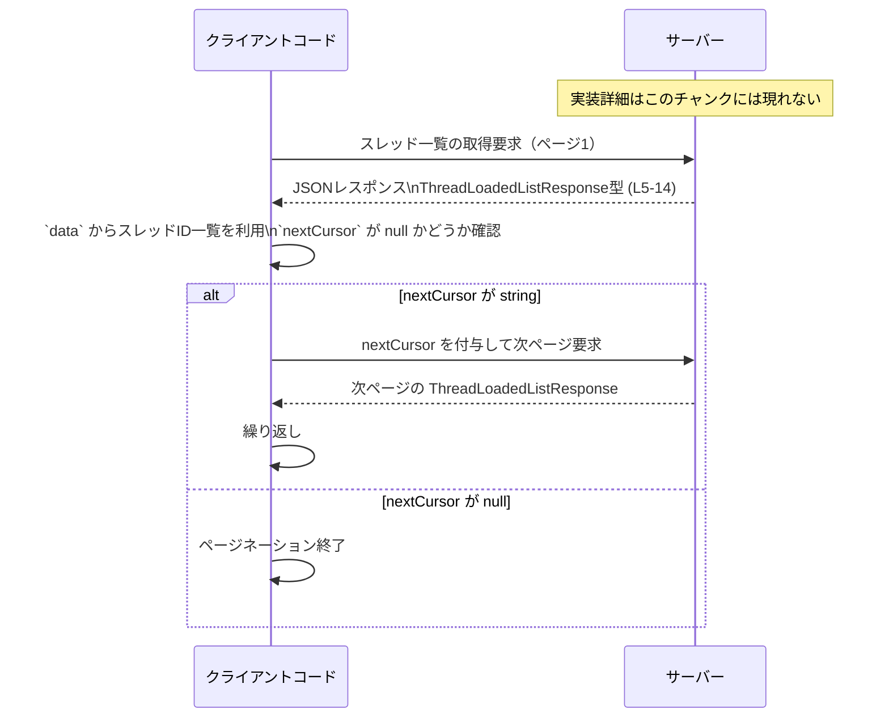

# app-server-protocol/schema/typescript/v2/ThreadLoadedListResponse.ts コード解説

## 0. ざっくり一言

`ThreadLoadedListResponse` は、「現在メモリ上にロードされているセッションのスレッドID一覧」と「ページネーション用のカーソル」を表現する TypeScript のレスポンス型定義です（`export type`）（根拠: `ThreadLoadedListResponse.ts:L5-14`）。  
このファイルは `ts-rs` によって自動生成されており、手動編集は想定されていません（根拠: `ThreadLoadedListResponse.ts:L1-3`）。

---

## 1. このモジュールの役割

### 1.1 概要

- このモジュールは、アプリケーションサーバーが返す「スレッド一覧ロード状態」に関するレスポンスの**型スキーマ**を提供します（根拠: 型名とプロパティ名・コメント `ThreadLoadedListResponse.ts:L5-14`）。
- `data` プロパティで「現在メモリにロードされているセッションのスレッドID一覧」を表し（根拠: `ThreadLoadedListResponse.ts:L6-9`）、`nextCursor` プロパティで「次ページ取得用の不透明なカーソル」を表します（根拠: `ThreadLoadedListResponse.ts:L10-13`）。
- TypeScript 側のコードは、この型を使うことでレスポンス構造に対してコンパイル時の型チェックを受けられます。

### 1.2 アーキテクチャ内での位置づけ

- このファイルは `app-server-protocol/schema/typescript/v2` 配下にあり、v2 プロトコルの TypeScript スキーマ群の一部と位置づけられます（パス情報より）。
- 冒頭コメントから、この型定義は `ts-rs` によって生成されていることが分かり、Rust 側の型定義と 1 対 1 で対応していると推測されます（ただし元の Rust 型定義の詳細はこのチャンクには現れません）（根拠: `ThreadLoadedListResponse.ts:L1-3`）。
- このファイル自身は他モジュールを `import` しておらず、**受信側の TypeScript コードから参照されるだけの受動的なスキーマモジュール**です（根拠: ファイル全体に import 文が存在しないこと `ThreadLoadedListResponse.ts:L1-14`）。

代表的な依存関係のイメージを以下に示します。

```mermaid
graph LR
    subgraph 生成元（推測）
        R["Rust側の型定義（推測・このチャンクには現れない）"]
        G["ts-rs コードジェネレーター\n(コメント参照: L1-3)"]
    end

    R --> G
    G --> T["ThreadLoadedListResponse.ts\nThreadLoadedListResponse型 (L5-14)"]
    C["呼び出し側 TypeScript コード\n（このチャンクには現れない）"] --> T
```

### 1.3 設計上のポイント

- **自動生成コード**  
  - 冒頭コメントで「GENERATED CODE! DO NOT MODIFY BY HAND!」と明示されており、編集は元の定義（おそらく Rust 側）で行う設計です（根拠: `ThreadLoadedListResponse.ts:L1-3`）。
- **状態やロジックを持たない純粋な型定義**  
  - `export type` による型エイリアスのみが定義されており、クラス・関数・変数などの実行時エンティティは存在しません（根拠: `ThreadLoadedListResponse.ts:L5-14`）。
- **シンプルな基本型の組み合わせ**  
  - `data: Array<string>` と `nextCursor: string | null` だけで構成されており、ジェネリクスや複雑なユニオン型などは使われていません（根拠: `ThreadLoadedListResponse.ts:L9-14`）。
- **null による省略可能値の表現**  
  - `nextCursor` が `string | null` で表現され、「カーソル無し＝これ以上要素が無い」を示すプロトコル上の意味がコメントで説明されています（根拠: `ThreadLoadedListResponse.ts:L10-13`）。

---

## 2. 主要な機能（コンポーネント）一覧

このファイルが提供するコンポーネントは 1 つの型エイリアスのみです。

| コンポーネント名 | 種別 | 役割 / 機能 | 定義位置 |
|------------------|------|-------------|----------|
| `ThreadLoadedListResponse` | 型エイリアス (`export type`) | 現在メモリ上にロードされているスレッドID一覧と、次ページ取得用カーソルを表すレスポンススキーマ | `ThreadLoadedListResponse.ts:L5-14` |

補足として、型の各フィールドの役割を示します。

| フィールド名 | 型 | 説明 | 根拠 |
|--------------|----|------|------|
| `data` | `Array<string>` | 現在メモリにロードされているセッションのスレッドIDの配列 | 定義とコメントより（`ThreadLoadedListResponse.ts:L6-9`） |
| `nextCursor` | `string \| null` | 次回呼び出し時に渡す不透明カーソル。`null` の場合、それ以降返す要素がないことを意味する | 定義とコメントより（`ThreadLoadedListResponse.ts:L10-13`） |

---

## 3. 公開 API と詳細解説

### 3.1 型一覧（構造体・列挙体など）

| 名前 | 種別 | 役割 / 用途 | 定義位置 |
|------|------|-------------|----------|
| `ThreadLoadedListResponse` | 型エイリアス（オブジェクト型） | スレッドID一覧とページネーションカーソルを含むレスポンス型。API レスポンスの JSON 構造を記述するために使用されます。 | `ThreadLoadedListResponse.ts:L5-14` |

#### `ThreadLoadedListResponse` の構造

```typescript
export type ThreadLoadedListResponse = {          // レスポンス全体のオブジェクト型 (L5)
  /**
   * Thread ids for sessions currently loaded in memory.
   */
  data: Array<string>,                             // スレッドIDの配列 (L6-9)

  /**
   * Opaque cursor to pass to the next call to continue after the last item.
   * if None, there are no more items to return.
   */
  nextCursor: string | null,                       // 次ページ用カーソル。null なら打ち止め (L10-13)
};
```

**型安全性の観点**

- `data` は必須かつ `string` のみを要素とする配列として定義されており、`number` など他の型を要素に含めようとするとコンパイル時にエラーになります（TypeScript の静的型チェック）。
- `nextCursor` は `string | null` のユニオン型であり、「カーソルは文字列か、存在しない（null）」という状態だけを許容します。`undefined` は許容されていません（根拠: `undefined` が型に含まれていないこと `ThreadLoadedListResponse.ts:L14`）。

### 3.2 関数詳細

このファイルには関数定義が存在しません（根拠: `ThreadLoadedListResponse.ts:L1-14`）。  
したがって、関数ごとの詳細解説はありません。

### 3.3 その他の関数

同様に、このファイルには補助関数・ラッパー関数なども定義されていません。

---

## 4. データフロー

この型がどのように使われるかの典型的なフローとして、「スレッド一覧をページネーションしながら取得するクライアントコード」を想定したデータフローを示します。  
（具体的な HTTP パスやメソッド名は、このチャンクには現れません。）



この図は、`nextCursor` によるページネーションの役割を強調しています（根拠: コメント `ThreadLoadedListResponse.ts:L10-13`）。

---

## 5. 使い方（How to Use）

### 5.1 基本的な使用方法

以下は、`ThreadLoadedListResponse` 型を使って API レスポンスを扱う例です。  
インポートパスはプロジェクト構成に応じて適宜変更が必要です（このチャンクからは正確な相対パスは分かりません）。

```typescript
// ThreadLoadedListResponse 型をインポートする
import type { ThreadLoadedListResponse } from "./ThreadLoadedListResponse"; // パスは例

// スレッドID一覧を 1 ページ分だけ取得してログに出力する例
async function printLoadedThreadsOnce(): Promise<void> {
  const res = await fetch("/api/threads/loaded");        // サーバーにリクエストを送る（エンドポイントは例）
  const body: ThreadLoadedListResponse = await res.json(); // レスポンスを型付きで受け取る

  // data: string[] なので、要素はすべて string として扱える
  body.data.forEach((threadId) => {
    console.log("Loaded thread:", threadId);             // threadId は string 型として補完される
  });

  if (body.nextCursor !== null) {                        // nextCursor は string | null
    console.log("More threads available; cursor:", body.nextCursor);
  } else {
    console.log("No more threads.");
  }
}
```

このように型を付けることで、`body.data` に対して誤って数値などを扱おうとした場合にコンパイル時に検出されます。

### 5.2 よくある使用パターン

#### パターン1: すべてのページを取得しきる

`nextCursor` が `null` になるまで繰り返し取得するパターンです。

```typescript
import type { ThreadLoadedListResponse } from "./ThreadLoadedListResponse";

// すべてのロード済みスレッドIDを配列に集約する例
async function collectAllLoadedThreads(fetchPage: (cursor: string | null) => Promise<ThreadLoadedListResponse>): Promise<string[]> {
  const allIds: string[] = [];                          // スレッドIDの蓄積用

  let cursor: string | null = null;                     // 最初はカーソル無しで開始
  while (true) {
    const page = await fetchPage(cursor);               // cursor を使って 1 ページ取得
    allIds.push(...page.data);                          // data は string[] なのでスプレッドで追加可能

    if (page.nextCursor === null) {                     // null ならもうページは無い
      break;
    }
    cursor = page.nextCursor;                           // 次回のカーソルを設定
  }

  return allIds;
}
```

ここでは `fetchPage` のインターフェースを `(cursor: string | null) => Promise<ThreadLoadedListResponse>` としており、`nextCursor` の型と一致させることで、カーソルの受け渡しを型安全に行っています（根拠: `ThreadLoadedListResponse.ts:L14`）。

### 5.3 よくある間違い

#### 間違い例1: `nextCursor` が `null` になりうることを無視する

```typescript
// 間違い例
function useCursorWrong(res: ThreadLoadedListResponse) {
  // nextCursor を常に string として扱っている
  const nextUrl = "/api/threads/loaded?cursor=" + res.nextCursor.toUpperCase(); // ⚠ コンパイルエラー
}
```

上記は、`nextCursor` を `string` としてしか扱っていないため、`null` のケースを無視しています。  
TypeScript の型チェックにより、`res.nextCursor` は `string | null` であるため、そのまま `toUpperCase` を呼び出すとコンパイルエラーになります（根拠: `ThreadLoadedListResponse.ts:L14`）。

```typescript
// 正しい例
function useCursorCorrect(res: ThreadLoadedListResponse) {
  if (res.nextCursor !== null) {
    const nextUrl = "/api/threads/loaded?cursor=" + res.nextCursor.toUpperCase();
    console.log(nextUrl);
  } else {
    console.log("No more pages.");
  }
}
```

#### 間違い例2: `data` が空配列になりうることを前提にしていない

`data` はコメント上、「ロード済みスレッドID」を表しているだけで、常に 1 件以上含まれるとは書かれていません（根拠: `ThreadLoadedListResponse.ts:L6-9`）。  
要素数 0 のケースを考慮せずにロジックを書くと、UI が何も表示されないなどの問題につながります。

### 5.4 使用上の注意点（まとめ）

- `nextCursor` は `string | null` であり、**`null` の場合は「これ以上取得すべきアイテムがない」ことを意味する**とコメントで説明されています（根拠: `ThreadLoadedListResponse.ts:L10-13`）。必ず `null` チェックを行う必要があります。
- `data` は `string[]` であり、**空配列も有効な値**です。データが空でもエラーにはならないため、その場合の UI や処理の振る舞いを決めておく必要があります。
- このファイルは自動生成されるため、**直接編集しないこと**が重要です。変更は元の定義（おそらく Rust 側の型）を修正し、`ts-rs` による再生成を行う必要があります（根拠: `ThreadLoadedListResponse.ts:L1-3`）。

---

## 6. 変更の仕方（How to Modify）

### 6.1 新しい機能を追加する場合

このファイルは `ts-rs` によって生成されるため、**直接この TypeScript ファイルに手を加えるのは適切ではありません**（根拠: `ThreadLoadedListResponse.ts:L1-3`）。

新しいフィールドを追加したい、型を変更したいといった場合の一般的な手順は次の通りです（具体的な Rust 側の構造はこのチャンクには現れないため、抽象的な説明になります）。

1. **生成元の型定義を変更する**  
   - Rust 側に対応する構造体や型（推測）を編集し、新しいフィールドや型変更を行います。
2. **`ts-rs` を再実行する**  
   - プロジェクトのビルドまたは専用のコード生成コマンドを実行し、TypeScript スキーマを再生成します。
3. **TypeScript 側の使用箇所を更新する**  
   - 追加・変更したフィールドに応じて、`ThreadLoadedListResponse` を参照している TypeScript コードを修正します。

### 6.2 既存の機能を変更する場合の注意点

- **後方互換性**  
  - `data` や `nextCursor` の名前や型を変更すると、この型を使っているすべてのクライアントコードに影響します。
  - 互換性を維持したい場合は、新しいフィールドを追加し、既存フィールドは可能な限りそのまま残すのが一般的です。
- **プロトコル契約**  
  - コメントに記載された意味（`nextCursor` が `null` なら「これ以上要素無し」など）は、クライアント・サーバー間の契約です（根拠: `ThreadLoadedListResponse.ts:L10-13`）。意味を変える場合は、両者の実装を合わせて更新する必要があります。
- **テストと型チェック**  
  - 型が変わると TypeScript のコンパイルエラーで多くの影響箇所が検出されます。それらを修正し、必要に応じて API 統合テストを実行することが推奨されます（テストコード自体はこのチャンクには現れません）。

---

## 7. 関連ファイル

このチャンクには他ファイルの具体的な import・参照は現れませんが、ディレクトリ構成から推測される関連ファイルを挙げます（ただしファイル名は仮想的です）。

| パス | 役割 / 関係 |
|------|------------|
| `app-server-protocol/schema/typescript/v2/*` | v2 プロトコルにおける他のリクエスト/レスポンス型定義が存在すると考えられるディレクトリ。このファイルと同様に `ts-rs` により生成されている可能性が高いが、具体的な型内容はこのチャンクには現れません。 |

---

## Bugs / Security / Contracts / Edge Cases / Concurrency まとめ

- **Bugs**  
  - このファイルには実行時ロジックが一切無く、型定義のみのため、**直接的なバグ（ロジックミス）は存在しません**（根拠: `ThreadLoadedListResponse.ts:L5-14`）。
- **Security**  
  - セキュリティ関連の処理（認証・認可・サニタイズ等）は含まれていません。レスポンスの中身が信頼できるかどうかはサーバー実装側に依存します（このチャンクには現れません）。
- **Contracts（契約）**  
  - `data` は「現在メモリにロードされているセッションのスレッドID」を列挙する（根拠: `ThreadLoadedListResponse.ts:L6-9`）。  
  - `nextCursor` は「次回呼び出し時に渡す不透明カーソル」であり、「カーソル無し（None）」の場合は「これ以上返す要素が無い」ことを意味する（根拠: `ThreadLoadedListResponse.ts:L10-13`）。
- **Edge Cases**  
  - `data` が空配列 `[]` であるケース：ロード済みスレッドが存在しない、またはページングの結果として該当なしとなる可能性を表す。  
  - `nextCursor` が `null` のケース：前述の通り、ページングの末尾を示す。  
  - `undefined` は型上許容されていないため、`nextCursor` を省略して返すことは契約違反になります（根拠: 型定義に `undefined` が含まれていないこと `ThreadLoadedListResponse.ts:L14`）。
- **Concurrency（並行性）**  
  - このファイル自体は純粋な型定義であり、スレッド・Promise・イベントループなどの並行性に関するコードを持ちません。  
  - 並行リクエストを投げるかどうか、カーソルをどのように共有するかといった並行性の課題は、この型を利用するアプリケーション側の責務です（このチャンクには現れません）。
