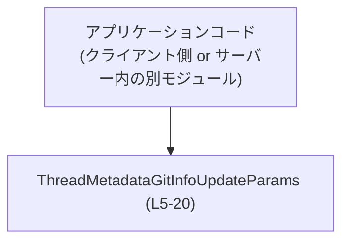
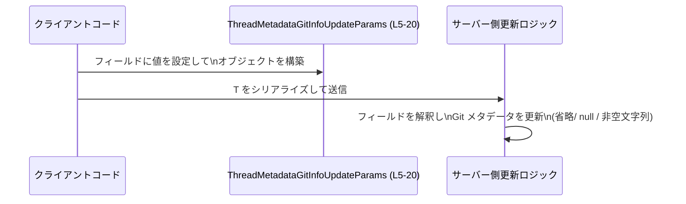

# app-server-protocol/schema/typescript/v2/ThreadMetadataGitInfoUpdateParams.ts

---

## 0. ざっくり一言

スレッドに紐づく Git 情報（コミット SHA、ブランチ名、リモート origin URL）の「更新パラメータ」を表す TypeScript の型エイリアスです（`export type`）。各フィールドは「省略／`null`／非空文字列」で異なる意味を持つパッチ型の API 契約を表現しています（`ThreadMetadataGitInfoUpdateParams.ts:L5-20`）。

---

## 1. このモジュールの役割

### 1.1 概要

- このモジュールは、スレッドに保存されている Git メタデータを部分的に更新するためのパラメータ型を提供します（`ThreadMetadataGitInfoUpdateParams.ts:L5`）。
- クライアントは、更新したいフィールドだけを指定し、変更したくないフィールドはプロパティ自体を省略します（`sha?`, `branch?`, `originUrl?` の `?` がその根拠です `L10,L15,L20`）。
- 各フィールドでは「省略」「`null`」「非空文字列」でそれぞれ「現状維持」「クリア」「新しい値に置き換え」という意味を持ちます（JSDoc コメント `L6-9,L11-14,L16-19`）。

### 1.2 アーキテクチャ内での位置づけ

- ファイルパスから、この型は「app-server-protocol」の TypeScript スキーマ v2 の一部として利用されることが分かります（`app-server-protocol/schema/typescript/v2/...`）。
- コード中に他モジュールの `import` はなく、この型は他のコードから参照される「葉」側コンポーネントとして定義されています（`ThreadMetadataGitInfoUpdateParams.ts:L5-20`）。
- 実際の API 呼び出しや永続化処理はこのファイルには現れておらず、この型は純粋なデータシェイプ（構造）だけを提供します。

依存関係の概念図（このチャンクから分かる範囲の抽象化）:



### 1.3 設計上のポイント

- **コード生成された型**  
  冒頭コメントにより、このファイルは `ts-rs` によって自動生成されており、手動編集を前提としていません（`ThreadMetadataGitInfoUpdateParams.ts:L1-3`）。
- **部分更新（パッチ）用の設計**  
  3 つのフィールドすべてがオプショナル（`?`）であり、任意の組み合わせで更新できる構造になっています（`L10,L15,L20`）。
- **値の意味をコメントで規定**  
  JSDoc コメントで「省略」「`null`」「非空文字列」がそれぞれどのような意味を持つかが明示されており、型システムだけでなくドキュメントベースの契約も組み込まれています（`L6-9,L11-14,L16-19`）。
- **実行時ロジックなし**  
  このファイルには関数やクラス、実行時コードが一切なく、TypeScript の型情報だけが定義されています（`L5-20`）。

---

## 2. 主要な機能一覧

このモジュールが提供する機能は「型としての契約」です。主な役割を列挙します。

- コミット SHA 更新指示: `sha?: string | null` によって、保存済みコミットの維持・クリア・置換を指示します（`L6-10`）。
- ブランチ名更新指示: `branch?: string | null` によって、保存済みブランチの維持・クリア・置換を指示します（`L11-15`）。
- origin URL 更新指示: `originUrl?: string | null` によって、保存済み origin URL の維持・クリア・置換を指示します（`L16-20`）。

---

## 3. 公開 API と詳細解説

### 3.1 型一覧（構造体・列挙体など）

| 名前                               | 種別          | 役割 / 用途                                                                 | 定義位置                                   |
|------------------------------------|---------------|------------------------------------------------------------------------------|--------------------------------------------|
| `ThreadMetadataGitInfoUpdateParams` | 型エイリアス（オブジェクト型） | スレッドに保存された Git 情報（commit/branch/originUrl）の更新パラメータを表す | `ThreadMetadataGitInfoUpdateParams.ts:L5-20` |

この型は `export type` として公開されており、他のモジュールから利用可能です（`L5`）。

### 3.2 関数詳細（最大 7 件）

このファイルには関数・メソッドの定義はありません（`ThreadMetadataGitInfoUpdateParams.ts:L5-20`）。  
代わりに、この後で型 `ThreadMetadataGitInfoUpdateParams` の各フィールドの詳細な契約を説明します。

#### ThreadMetadataGitInfoUpdateParams のフィールド詳細

**概要**

`ThreadMetadataGitInfoUpdateParams` は、以下 3 つのオプショナルなプロパティを持つオブジェクト型です（`L5-20`）。

```typescript
export type ThreadMetadataGitInfoUpdateParams = {              // L5
  /** ... */                                                    // L6-9
  sha?: string | null,                                         // L10
  /** ... */                                                    // L11-14
  branch?: string | null,                                      // L15
  /** ... */                                                    // L16-19
  originUrl?: string | null,                                   // L20
};
```

各プロパティの契約を整理します。

##### プロパティ `sha?: string | null`（コミット SHA）

**意味（コメントに基づく契約）**

- 省略した場合: 保存しているコミットを変更しない（`L6-9`）。
- `null` を設定した場合: 保存済みコミットをクリアする（削除に相当）（`L6-9`）。
- 非空文字列を設定した場合: 保存済みコミットをその値で置き換える（`L6-9`）。

**型**

- `sha?: string | null` は
  - プロパティ自体が存在しない（`undefined`／省略される）
  - `string` 値を持つ
  - `null` 値を持つ  
  のいずれかを許容します（`L10`）。

**エッジケース**

- 空文字列 `""` は型としては許可されていますが、コメントでは「non-empty string」と書かれており、契約上は避けるべき値とされています（`L7-8`）。
- プロパティを明示的に `undefined` にするかどうかは、この型からは読み取れません（`sha?: string | null` で `undefined` は型に含まれず、プロパティを **付けない** のが正しい「省略」の方法です）。

**使用上の注意点**

- 「値を変更しない」場合は、`sha` プロパティをオブジェクトから **完全に省略** する必要があります。
- `null` を渡すと「クリア」の意味になり、既存情報が失われる可能性があるため意図した動作か確認が必要です。
- 非空文字列かどうかは型では保証されないため、クライアント側／サーバー側いずれかでバリデーションが必要です。

##### プロパティ `branch?: string | null`（ブランチ名）

`sha` と同じ構造・契約で、対象が「保存済みブランチ」である点だけが異なります（`L11-15`）。

- 省略: 保存済みブランチは変更しない（`L11-14`）。
- `null`: 保存済みブランチをクリアする（`L11-14`）。
- 非空文字列: 保存済みブランチをその値に置き換える（`L11-14`）。

型は `branch?: string | null` で、オプショナル + `string | null` です（`L15`）。

##### プロパティ `originUrl?: string | null`（origin URL）

`sha` / `branch` と同じ契約で、対象が「保存済み origin URL」です（`L16-20`）。

- 省略: 保存済み origin URL を変更しない（`L16-19`）。
- `null`: 保存済み origin URL をクリアする（`L16-19`）。
- 非空文字列: 保存済み origin URL をその値に置き換える（`L16-19`）。

`originUrl?: string | null` として定義されています（`L20`）。

**セキュリティ上の注意（利用側の観点）**

- `originUrl` に外部 URL が入り得る場合、利用側（例えばサーバー側）で URL バリデーションや許可ドメインの制限を行うことが一般的に望ましいです。このファイル自体は型定義のみで、そのような検証は行いません。

### 3.3 その他の関数

- このファイルには補助的な関数やラッパー関数も定義されていません（`ThreadMetadataGitInfoUpdateParams.ts:L1-20`）。

---

## 4. データフロー

このファイル自身は純粋な型定義のみですが、典型的な利用シナリオを想定したデータの流れを整理します。実際の関数名やエンドポイント名はコードからは分からないため、ここでは抽象的なコンポーネント名を用います。

1. クライアント側コードが、更新したい Git 情報に応じて `ThreadMetadataGitInfoUpdateParams` オブジェクトを構築する。
2. そのオブジェクトが JSON などにシリアライズされ、サーバーに送信される。
3. サーバー側で受け取ったオブジェクトを解析し、各プロパティの「省略／`null`／文字列」の状態に応じて保存済みメタデータを更新する。

シーケンス図（概念レベル）:



この図はあくまで **利用イメージ** であり、具体的な API 名やストレージの構造はこのチャンクには現れていません。

---

## 5. 使い方（How to Use）

### 5.1 基本的な使用方法

以下は、TypeScript コードからこの型を利用して Git 情報を更新するリクエストパラメータを組み立てる例です。

```typescript
// 実際のパスはプロジェクト構成に合わせて調整する必要があります。
import type { ThreadMetadataGitInfoUpdateParams } from "./ThreadMetadataGitInfoUpdateParams";

// 例1: コミット SHA だけを新しい値に更新し、他はそのままにする
const updateCommit: ThreadMetadataGitInfoUpdateParams = {
  sha: "abc123def456",      // 非空文字列: 新しいコミット SHA に置き換え (L6-9)
  // branch は省略: 既存値を維持 (L11-14)
  // originUrl も省略: 既存値を維持 (L16-19)
};

// 例2: ブランチと origin URL をクリアし、コミットは変更しない
const clearBranchAndOrigin: ThreadMetadataGitInfoUpdateParams = {
  branch: null,             // null: 保存済みブランチをクリア (L11-14)
  originUrl: null,          // null: 保存済み origin URL をクリア (L16-19)
  // sha は省略: 既存値を維持 (L6-9)
};

// 例3: 3 つすべてを新しい値に設定
const setAllGitInfo: ThreadMetadataGitInfoUpdateParams = {
  sha: "ff00aa11bb22",      // 新しいコミット SHA
  branch: "feature/new-ui", // 新しいブランチ名
  originUrl: "https://github.com/example/repo.git", // 新しい origin URL
};
```

この型はコンパイル時の型チェックにのみ影響し、実行時に特別な処理を行うわけではありません。JavaScript にはこの型エイリアスに対応するコードは出力されません。

### 5.2 よくある使用パターン

1. **一部のフィールドだけを更新するパッチリクエスト**

   ```typescript
   const updateBranchOnly: ThreadMetadataGitInfoUpdateParams = {
     branch: "hotfix/issue-123",
     // sha と originUrl は省略して現状維持
   };
   ```

2. **すべてクリアする**

   ```typescript
   const clearAllGitInfo: ThreadMetadataGitInfoUpdateParams = {
     sha: null,
     branch: null,
     originUrl: null,
   };
   ```

3. **「間違えてクリアしない」ように、明示的に省略する**

   更新したくないフィールドを `undefined` ではなく **プロパティ自体を付けない** ことで、「変更しない」意図を表します。

   ```typescript
   const safeUpdateCommit: ThreadMetadataGitInfoUpdateParams = {
     sha: "newsha123",
     // branch, originUrl を書かないことで変更しない
   };
   ```

### 5.3 よくある間違い

```typescript
// 間違い例1: クリアしたいのにプロパティを省略している
const wrongClear: ThreadMetadataGitInfoUpdateParams = {
  // 本当は branch をクリアしたいが、書いていない
  // -> サーバーから見ると「変更なし」と解釈される (L11-14)
};

// 正しい例: null を明示してクリアの意図を伝える
const correctClear: ThreadMetadataGitInfoUpdateParams = {
  branch: null,
};

// 間違い例2: 空文字列を使用する（コメント上は非推奨）
const wrongEmptySha: ThreadMetadataGitInfoUpdateParams = {
  sha: "", // 型的には string だが、コメントでは non-empty string を要求 (L7-8)
};

// 推奨例: 値を設定するなら非空文字列、クリアしたいなら null
const recommendedSha: ThreadMetadataGitInfoUpdateParams = {
  sha: "validsha123",
};
```

### 5.4 使用上の注意点（まとめ）

- 「省略」と「`null`」には意味上の大きな違いがあります。  
  - 省略: 既存値を維持  
  - `null`: 既存値をクリア
- コメント上「non-empty string」が要求されているため、空文字列は契約違反となる可能性がありますが、型では防げません。
- `originUrl` の値は、SSRF や任意ホストアクセスなどを防ぐため、利用側で適切にバリデーションする必要がある場合があります。
- この型は TypeScript の型安全性を提供するのみで、実行時エラーは防ぎません。実際の検証・エラー処理はサーバー側ロジックに依存します。

---

## 6. 変更の仕方（How to Modify）

### 6.1 新しい機能を追加する場合

このファイルは `ts-rs` により生成されたものであり、冒頭コメントで「手で編集しない」ことが明示されています（`ThreadMetadataGitInfoUpdateParams.ts:L1-3`）。そのため、直接この `.ts` ファイルを編集するのではなく、**元となる Rust 側の型定義を変更してから再生成する**のが前提です。

一般的な手順イメージ:

1. Rust 側で対応する構造体／型に新しいフィールド（例: `repository: String` など）を追加する。  
   ※ このファイルからは具体的な Rust 型名は分かりません。
2. `ts-rs` のコード生成プロセスを実行して、TypeScript の型定義を再生成する。
3. 再生成された `ThreadMetadataGitInfoUpdateParams.ts` に新しいプロパティが反映される。

### 6.2 既存の機能を変更する場合

- 例えば、「`null` でクリアする」という仕様を変更したい場合や、「非空文字列」の制約文言を変更したい場合も、同様に **Rust 側の型やコメント** を修正し、`ts-rs` で再生成する必要があります（`L1-3`）。
- 変更時の注意点:
  - この型を利用しているクライアントコード全体を検索し、新しい契約（省略／`null`／値の意味）が破綻していないか確認する必要があります。
  - API プロトコルの一部であるため、サーバー側・クライアント側双方の互換性（後方互換性）を意識する必要がありますが、その詳細はこのチャンクからは分かりません。

---

## 7. 関連ファイル

このチャンクから確実に言える関連は限定的ですが、推定される範囲で整理します。

| パス / 種別                                      | 役割 / 関係 |
|--------------------------------------------------|-------------|
| Rust 側の対応する型定義（ファイル名不明）       | `ts-rs` がこの TypeScript 型を生成する元となる Rust の構造体または型。コメントやフィールド構造の元定義。※このチャンクには現れませんが、冒頭コメントから存在が示唆されます（`L1-3`）。 |
| `app-server-protocol/schema/typescript/v2/*`    | 同じ v2 プロトコルスキーマに属する他の TypeScript 型定義。API 全体のリクエスト／レスポンス形状を構成していると考えられますが、具体的内容はこのチャンクには現れません。 |

このファイル自体は独立した型定義であり、他の TypeScript ファイルを `import` していないため、**直接の依存関係** はこのチャンクには存在しません（`ThreadMetadataGitInfoUpdateParams.ts:L5-20`）。
