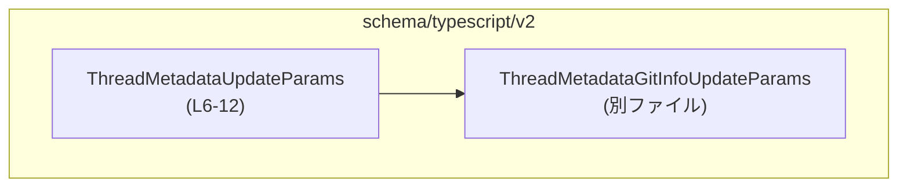
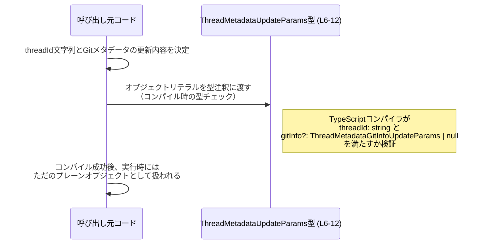

# app-server-protocol/schema/typescript/v2/ThreadMetadataUpdateParams.ts コード解説

## 0. ざっくり一言

- スレッドのメタデータ（特に Git メタデータ）を更新する際の **パラメータオブジェクトの型** を定義した、ts-rs 生成の TypeScript スキーマファイルです（ThreadMetadataUpdateParams.ts:L1-3, L6-12）。

---

## 1. このモジュールの役割

### 1.1 概要

- このモジュールは、スレッドに紐づくメタデータのうち、Git 関連情報を「パッチ形式」で更新するための **型定義** を提供します（ThreadMetadataUpdateParams.ts:L6-12）。
- 型は `threadId` と `gitInfo` からなるオブジェクトで、`gitInfo` は別ファイルで定義された型 `ThreadMetadataGitInfoUpdateParams` を参照します（ThreadMetadataUpdateParams.ts:L4, L6, L12）。
- 実行時ロジックや関数は含まれておらず、**コンパイル時の型チェック** のための情報のみを提供します（ThreadMetadataUpdateParams.ts:L6-12）。

### 1.2 アーキテクチャ内での位置づけ

このファイルから読み取れる依存関係は、次の 1 つだけです。

- `ThreadMetadataUpdateParams` は `ThreadMetadataGitInfoUpdateParams` に依存します（型として利用）（ThreadMetadataUpdateParams.ts:L4, L12）。



- `ThreadMetadataGitInfoUpdateParams` をどのモジュールが利用しているか、また `ThreadMetadataUpdateParams` がどこから参照されるかは、このチャンクには現れていません。

### 1.3 設計上のポイント

- **生成コードであること**  
  - 冒頭コメントに「GENERATED CODE! DO NOT MODIFY BY HAND!」とあり、ts-rs による自動生成コードであることが明記されています（ThreadMetadataUpdateParams.ts:L1-3）。
  - 手動編集は禁止であり、変更は生成元（Rust 側など）で行う前提の設計です。

- **型レベル専用（実行時コードなし）**  
  - `import type` を用いた型専用インポートであり（ThreadMetadataUpdateParams.ts:L4）、また `export type` のみが記述されているため（ThreadMetadataUpdateParams.ts:L6-12）、このモジュールは **実行時には何も出力しません**。
  - そのため、性能・並行性・エラーハンドリングはすべて「この型を使う側のコード」に依存します。

- **パッチ（差分更新）前提の設計がコメントで示唆されている**  
  - `gitInfo` に付与されたコメントから、「フィールドを省略すると現状維持」「`null` でクリア」「文字列で置き換え」というパッチ的な更新モデルが示されています（ThreadMetadataUpdateParams.ts:L7-10）。
  - ただし、実際にどのフィールドが存在するか、どのようにサーバ側で解釈されるかは、このチャンクには現れていません。

---

## 2. 主要な機能一覧

このファイルは関数を持たず、型定義のみを提供します。「機能」は型が表現する役割として整理します。

- `ThreadMetadataUpdateParams`: スレッドのメタデータ（特に Git メタデータ）を更新するためのパラメータオブジェクトの型（ThreadMetadataUpdateParams.ts:L6-12）。

---

## 3. 公開 API と詳細解説

### 3.1 型一覧（構造体・列挙体など）【コンポーネントインベントリー】

| 名前                             | 種別                         | 役割 / 用途                                                                                                         | 定義/参照位置                              |
|----------------------------------|------------------------------|----------------------------------------------------------------------------------------------------------------------|---------------------------------------------|
| `ThreadMetadataUpdateParams`     | 型エイリアス（オブジェクト） | スレッドメタデータ更新リクエストのパラメータ。`threadId` と `gitInfo` からなるオブジェクト型                        | ThreadMetadataUpdateParams.ts:L6-12         |
| `ThreadMetadataGitInfoUpdateParams` | 型（詳細不明）              | Git メタデータのパッチ内容を表す型と推測される。`gitInfo` プロパティの型として参照されている                        | ThreadMetadataUpdateParams.ts:L4, L12       |

#### `ThreadMetadataUpdateParams` の詳細

定義:

```typescript
export type ThreadMetadataUpdateParams = { threadId: string,
/**
 * Patch the stored Git metadata for this thread.
 * Omit a field to leave it unchanged, set it to `null` to clear it, or
 * provide a string to replace the stored value.
 */
gitInfo?: ThreadMetadataGitInfoUpdateParams | null, };
```

（ThreadMetadataUpdateParams.ts:L6-12）

- **構造**
  - 必須プロパティ:
    - `threadId: string`
      - スレッドを表す ID であることがプロパティ名から示唆されますが、形式（UUID など）や制約はこのファイルには記載されていません（ThreadMetadataUpdateParams.ts:L6）。
  - オプション（省略可能）プロパティ:
    - `gitInfo?: ThreadMetadataGitInfoUpdateParams | null`
      - 型としては「`ThreadMetadataGitInfoUpdateParams` または `null` または 未定義（プロパティ自体を省略）」が許容されます（ThreadMetadataUpdateParams.ts:L12）。
      - コメントにより、Git メタデータのパッチであることが示されています（ThreadMetadataUpdateParams.ts:L7-10）。

- **gitInfo コメントの意味（コード上の事実とそこからの示唆）**
  - コメント本文（ThreadMetadataUpdateParams.ts:L7-10）:
    - 「Patch the stored Git metadata for this thread.」
    - 「Omit a field to leave it unchanged, set it to `null` to clear it, or provide a string to replace the stored value.」
  - ここでの "field" が何を指すか（`gitInfo` 自体なのか、`ThreadMetadataGitInfoUpdateParams` の各プロパティなのか）はコードからは明確ではありません。
    - 一般的なパッチオブジェクトのパターンからは、「`ThreadMetadataGitInfoUpdateParams` の各プロパティ」を指していると解釈するのが自然ですが、**このチャンクだけでは断定できません**。

- **TypeScript における安全性**
  - `threadId` には `string` 以外の型（number など）を代入すると、コンパイルエラーになります（型注釈による静的チェック）。
  - `gitInfo` には `ThreadMetadataGitInfoUpdateParams` 型か `null` 以外を代入すると、同様にコンパイルエラーになります（ThreadMetadataUpdateParams.ts:L12）。
  - ただし、TypeScript の型はコンパイル時のみ存在し、**実行時には検証されません**。
    - 例えば外部から JSON を受け取る場合、別途バリデーションを行わない限り、「実際の値の形」と「宣言された型」がずれる可能性があります。

#### `ThreadMetadataGitInfoUpdateParams` について

- この型は `import type { ThreadMetadataGitInfoUpdateParams } from "./ThreadMetadataGitInfoUpdateParams";` により参照されています（ThreadMetadataUpdateParams.ts:L4）。
- 定義は別ファイルにあり、このチャンクには含まれていません。
- そのため:
  - どのようなプロパティを持つか
  - それぞれのプロパティ型（string / null など）
  - 具体的な Git 情報（コミットハッシュ、ブランチ名など）との対応  
  は **このチャンクからは分かりません**。

### 3.2 関数詳細

- このファイルには **関数・メソッド・クラスメソッドは一切定義されていません**（ThreadMetadataUpdateParams.ts:L1-12）。
- したがって、「関数詳細」テンプレートを適用できる対象はありません。

### 3.3 その他の関数

- 補助関数・ラッパー関数なども定義されていません。

---

## 4. データフロー

このファイルは型定義のみを含み、実行時に動く処理はありません。そのため、データフローは **「コンパイル時の型チェックの観点」** からのみ説明できます。

### 4.1 型利用時の典型的な流れ（概念図）

以下は、「呼び出し元コードが `ThreadMetadataUpdateParams` 型を使ってオブジェクトを構築する」という一般的な場面を示す概念図です。  
具体的な呼び出し元関数や API 名は、このチャンクには現れないため仮のものです。



- 実行時には `ThreadMetadataUpdateParams` 型情報は消えるため、**型に基づく自動検証やエラーは行われません**。
- 実行時のデータフロー（どの API に送られるか、どのように保存されるか）は、このチャンクからは不明です。

---

## 5. 使い方（How to Use）

### 5.1 基本的な使用方法

`ThreadMetadataUpdateParams` 型を用いたオブジェクト構築の基本形です。

```typescript
// 型定義のインポート（実行時コードは生成されない）
import type { ThreadMetadataUpdateParams } from "./ThreadMetadataUpdateParams";           // このファイルの型
import type { ThreadMetadataGitInfoUpdateParams } from "./ThreadMetadataGitInfoUpdateParams"; // 別ファイルの型

// Git メタデータ更新用のパッチオブジェクトを用意する
const gitInfoPatch: ThreadMetadataGitInfoUpdateParams = {
    // 実際のプロパティは ThreadMetadataGitInfoUpdateParams の定義による
    // 例: branch, commitHash などである可能性がありますが、このチャンクからは不明です
};

// スレッドメタデータ更新用のパラメータオブジェクトを構築する
const params: ThreadMetadataUpdateParams = {
    threadId: "thread-123",  // スレッドを識別するID（string 型）
    gitInfo: gitInfoPatch,   // Git メタデータのパッチオブジェクト
};
```

- TypeScript の型注釈により、`threadId` が `string` であること、`gitInfo` が `ThreadMetadataGitInfoUpdateParams` か `null` であることがコンパイル時に検査されます（ThreadMetadataUpdateParams.ts:L6, L12）。

### 5.2 よくある使用パターン

#### 1. Git メタデータを変更しない（gitInfo を省略）

```typescript
const noGitChange: ThreadMetadataUpdateParams = {
    threadId: "thread-123",  // 必須
    // gitInfo を指定しないことで、「Git メタデータは触らない」という意図になる可能性があります
};
```

- `gitInfo` 自体を省略した場合のサーバ側の挙動は、このファイルからは分かりません。
- 一般的な「パッチ」API では、省略は「その項目は変更しない」意味になることが多いですが、これは**一般論であり、このプロトコルの仕様を保証するものではありません**。

#### 2. Git メタデータを部分的に更新する

`ThreadMetadataGitInfoUpdateParams` 内の各プロパティが optional / `null` / string などのユニオンになっていることがコメントから示唆されます（ThreadMetadataUpdateParams.ts:L7-10）。  
具体的なプロパティ名は不明なため、ここでは概念的な説明に留めます。

- **想定される（が断定できない）使い方のイメージ**:
  - プロパティを省略 → その項目を変更しない
  - プロパティ値を `null` → その項目をクリア
  - プロパティ値を `"some string"` → その項目を新しい文字列で上書き

この挙動はコメントから「示唆」されるのみで、実際の型定義・サーバ実装はこのチャンクには現れていません。

#### 3. Git メタデータを完全に削除する可能性（注意）

```typescript
const clearGitInfoCompletely: ThreadMetadataUpdateParams = {
    threadId: "thread-123",
    gitInfo: null,   // 何らかの「クリア」を意味する可能性がある
};
```

- コメントには「set it to `null` to clear it」とあります（ThreadMetadataUpdateParams.ts:L9）。
- しかし、ここでの「it」が
  - `gitInfo` プロパティ全体
  - あるいは `gitInfo` 内の個々のフィールド  
  のどちらを指すかは明確ではなく、**このチャンクだけでは意味を特定できません**。
- 実際の仕様を確認するには、`ThreadMetadataGitInfoUpdateParams` の定義およびサーバ側実装を参照する必要があります。

### 5.3 よくある間違い

この型に関して起こりうる誤用・混乱を、TypeScript の型システムとコメントから推測できる範囲で整理します。

```typescript
// 誤り例: threadId を number で指定してしまう
const badParams1: ThreadMetadataUpdateParams = {
    // @ts-expect-error: number は string に代入できない
    threadId: 123,    // コンパイルエラー（ThreadMetadataUpdateParams.ts:L6 の型に違反）
};

// 誤り例: gitInfo に文字列を直接渡してしまう
const badParams2: ThreadMetadataUpdateParams = {
    threadId: "thread-123",
    // @ts-expect-error: string は ThreadMetadataGitInfoUpdateParams | null に代入できない
    gitInfo: "master",  // コンパイルエラー（ThreadMetadataUpdateParams.ts:L12 の型に違反）
};
```

- **型の誤解**
  - `gitInfo` が「Git メタデータのどのフィールドにも string を渡せる」と読めるコメント（ThreadMetadataUpdateParams.ts:L7-10）と、
  - 実際の型アノテーション（`ThreadMetadataGitInfoUpdateParams | null`）を混同すると、`gitInfo` 自体に string を渡せるように誤解する可能性があります。
  - 実際には、`gitInfo` はオブジェクト（`ThreadMetadataGitInfoUpdateParams`）であり、その中のプロパティに string / null / 省略というパターンが適用されると読むのが自然です（ただし断定はできません）。

- **実行時検証の欠如**
  - 外部から JSON を受け取り、型アサーションで `ThreadMetadataUpdateParams` にキャストするだけだと、実際には `threadId` が欠けている、型が違うなどの問題に気づけない可能性があります。
  - セキュリティ上重要な場面（権限チェックなど）で `threadId` を信頼する場合は、実行時のバリデーションが必要です。

### 5.4 使用上の注意点（まとめ）

- **生成コードであるため、直接編集しない**
  - ヘッダコメントに従い、手動編集は避ける必要があります（ThreadMetadataUpdateParams.ts:L1-3）。
- **`null` / `undefined` / プロパティ省略の違いに注意**
  - `gitInfo` プロパティ:
    - 省略 → 挙動は仕様次第（このチャンクからは不明）
    - `null` → コメントからは「クリア」を示唆（ThreadMetadataUpdateParams.ts:L9）が、適用対象は不明
  - `ThreadMetadataGitInfoUpdateParams` 内のプロパティも、同様に省略と `null` の意味が異なる可能性があります。
- **TypeScript の型は実行時に存在しない**
  - 型定義は安全性・補完に役立ちますが、実行時には別途バリデーションが必要です（特に外部入力を扱う場合）。
- **並行性への影響はない**
  - このファイルは型のみで状態や I/O を持たないため、並行処理に関する懸念は直接的にはありません。
  - 並行性・整合性は、このパラメータを利用するサーバ側ロジックの責務となります。

---

## 6. 変更の仕方（How to Modify）

### 6.1 新しい機能を追加する場合

- ヘッダコメントに「GENERATED CODE! DO NOT MODIFY BY HAND!」とあるため、**この TypeScript ファイルを直接編集するのは前提としていません**（ThreadMetadataUpdateParams.ts:L1-3）。
- 新しいフィールド（例: 追加のメタデータ）を `ThreadMetadataUpdateParams` に追加したい場合は、一般的には:
  - ts-rs の生成元である **Rust 側の型定義**（構造体など）にフィールドを追加
  - ts-rs のコード生成を再実行  
  という手順になります（生成元の具体的なファイル名・構造はこのチャンクには現れません）。
- 追加したフィールドがクライアント／サーバ間のプロトコルに影響するため、API 互換性やバージョニング方針（`v2` ディレクトリ名など）がどうなっているかも別途確認が必要です（ただし、その詳細はこのチャンクからは分かりません）。

### 6.2 既存の機能を変更する場合

- 例: `threadId` の型を `string` から別の型に変える、`gitInfo` の型を変更するなど。
- 手順・注意点（このファイルから読み取れる範囲）:
  - **直接編集ではなく生成元を変更する**
    - 変更は Rust 側など ts-rs の入力となる型定義で行い、再生成する必要があります（ThreadMetadataUpdateParams.ts:L1-3）。
  - **影響範囲の確認**
    - `ThreadMetadataUpdateParams` を利用している全てのクライアントコードが、型変更の影響を受けます。
    - このチャンクには利用箇所が現れていないため、実際の影響範囲は別途コード検索などで確認する必要があります。
  - **契約（Contract）の維持**
    - コメントで説明されているパッチの意味（省略 / `null` / string の意味）は、この型を利用するクライアントとの契約になっています（ThreadMetadataUpdateParams.ts:L7-10）。
    - 契約を変える場合は、API バージョンアップや移行手順の検討が必要です。

---

## 7. 関連ファイル

このモジュールと密接に関連しているとコードから読み取れるファイルは次の通りです。

| パス                                              | 役割 / 関係                                                                                             |
|---------------------------------------------------|----------------------------------------------------------------------------------------------------------|
| `app-server-protocol/schema/typescript/v2/ThreadMetadataUpdateParams.ts` | 本レポート対象。スレッドメタデータ更新パラメータの TypeScript 型定義                                   |
| `app-server-protocol/schema/typescript/v2/ThreadMetadataGitInfoUpdateParams.ts`（と推測される） | `import type { ... } from "./ThreadMetadataGitInfoUpdateParams"` に対応する型定義ファイルと考えられるが、このチャンクには内容が現れない（ThreadMetadataUpdateParams.ts:L4） |

- テストコードや実際のサーバ実装（この型を使って更新を処理するコード）は、このチャンクには現れていません。そのため、挙動の詳細やエッジケースの実装はここからは判断できません。

---

### 付記: Bugs / Security / Tests / Performance について

- **Bugs**
  - このファイル単体にはロジックがなく、バグは「型と実装の不整合」や「コメントと実際の解釈のずれ」という形でのみ発生し得ます。
  - 特に「`null` の意味」や「フィールド省略の意味」が実装と一致しているかどうかは、別途確認が必要です（ThreadMetadataUpdateParams.ts:L7-10）。

- **Security**
  - 型定義だけでは、外部入力の妥当性や権限チェックは保証されません。
  - 信頼できない入力（クライアントからのリクエストなど）に対しては、ランタイムバリデーションと認可チェックが必要です。

- **Tests**
  - このファイルにはテストは含まれていません。
  - 実際には、この型を受け取る API エンドポイントやサービス層に対して、統合テスト・プロパティベーステストなどでパッチ挙動を検証する形になると考えられます（一般論）。

- **Performance / Scalability**
  - 型定義のみであり、実行時オーバーヘッドはありません。
  - 性能やスケーラビリティは、この型を通じてどの程度のデータ量をやり取りするか、およびサーバ側の処理ロジックに依存します。
