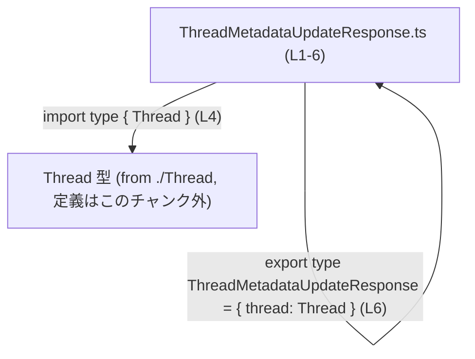
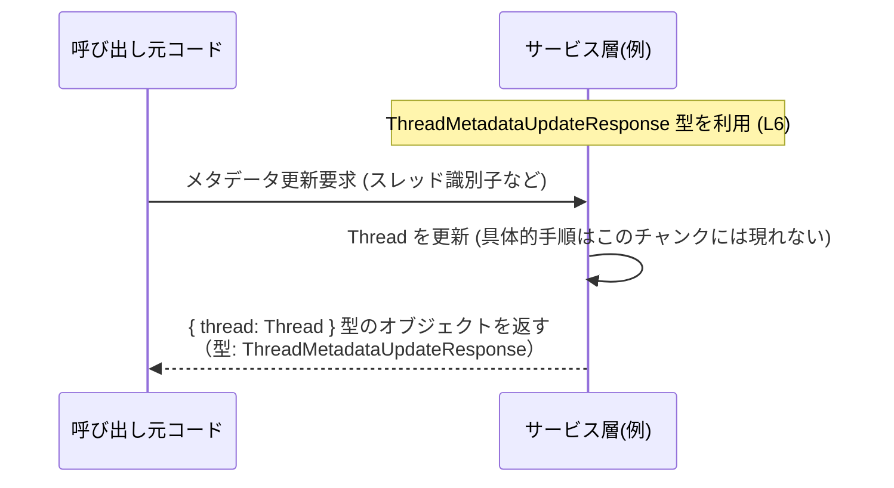

# app-server-protocol/schema/typescript/v2/ThreadMetadataUpdateResponse.ts コード解説

## 0. ざっくり一言

`ThreadMetadataUpdateResponse` は、`Thread` 型の値を `thread` プロパティに持つレスポンスオブジェクトの **型定義だけ** を提供する TypeScript ファイルです（コード生成物であり、ロジックは含まれていません `ThreadMetadataUpdateResponse.ts:L1-3,L6`）。

---

## 1. このモジュールの役割

### 1.1 概要

- このモジュールは、`Thread` 型をフィールドに持つレスポンスオブジェクトの **静的な型定義** を提供します `ThreadMetadataUpdateResponse.ts:L4,L6`。
- ファイル先頭のコメントから、この型定義は Rust 側から `ts-rs` によって自動生成されていることが分かります `ThreadMetadataUpdateResponse.ts:L1-3`。
- 実行時の処理（関数・メソッド）は一切含まれておらず、**型情報のみ** を通じて TypeScript コードの型安全性と補完支援を強化する役割を持ちます。

### 1.2 アーキテクチャ内での位置づけ

このモジュールは、同一ディレクトリにある `./Thread` モジュールから `Thread` 型を **型としてのみ** インポートし、その型を利用してレスポンスの形を表現しています `ThreadMetadataUpdateResponse.ts:L4,L6`。



- `Thread` 型の定義そのものは **このチャンクには現れません**（`./Thread` の中身は不明）。
- `import type` を使っているため、この依存は **コンパイル時のみ** であり、生成される JavaScript には現れません `ThreadMetadataUpdateResponse.ts:L4`。

### 1.3 設計上のポイント

コードから読み取れる設計上の特徴は次の通りです。

- **コード生成物であること**  
  - 「手で編集すべきでない」ことが明示されています `ThreadMetadataUpdateResponse.ts:L1-3`。
  - Rust 側の定義変更 → `ts-rs` による再生成、という運用を前提にしています。
- **型定義専用モジュール**  
  - `export type` による型エイリアス定義のみで、クラスや関数は存在しません `ThreadMetadataUpdateResponse.ts:L6`。
- **型のみのインポート**  
  - `import type { Thread } from "./Thread";` により、ランタイムへの影響を避けつつ型情報だけを取り込みます `ThreadMetadataUpdateResponse.ts:L4`。
- **エラー・並行性**  
  - 実行時のロジックがないため、このファイル単体ではランタイムエラーや並行性（非同期処理・スレッド安全性）に関する挙動は発生しません。

---

## 2. 主要な機能一覧

このファイルが提供する「機能」はすべて型定義レベルに限定されます。

- `ThreadMetadataUpdateResponse` 型: `thread: Thread` を持つレスポンスオブジェクトの形を表現する型エイリアス `ThreadMetadataUpdateResponse.ts:L6`。

---

## 3. 公開 API と詳細解説

### 3.1 型一覧（構造体・列挙体など）

#### 型・エイリアス・依存関係のインベントリー

| 名前                          | 種別      | 役割 / 用途                                                                 | 根拠 |
|-------------------------------|-----------|-----------------------------------------------------------------------------|------|
| `ThreadMetadataUpdateResponse`| 型エイリアス | `thread: Thread` を 1 プロパティとして持つオブジェクト型を表す公開 API        | `ThreadMetadataUpdateResponse.ts:L6` |
| `Thread`                      | 型（外部） | `ThreadMetadataUpdateResponse.thread` プロパティの型。定義は `./Thread` に存在 | `ThreadMetadataUpdateResponse.ts:L4,L6` |

- `ThreadMetadataUpdateResponse` は `export type` でエクスポートされているため、このモジュールの公開 API です `ThreadMetadataUpdateResponse.ts:L6`。
- `Thread` は **型としてのみ** インポートされており、このモジュールから再エクスポートはされていません `ThreadMetadataUpdateResponse.ts:L4`。

#### `ThreadMetadataUpdateResponse` のフィールド

`ThreadMetadataUpdateResponse` 自体は型エイリアスでありフィールド定義はインラインですが、その構造は次のように書き換え可能です `ThreadMetadataUpdateResponse.ts:L6`。

```typescript
export type ThreadMetadataUpdateResponse = {
    thread: Thread; // Thread 型の値を格納する必須プロパティ
};
```

- `thread` は **必須プロパティ** であり、`Thread` 型と互換性のある値でなければなりません。
- オプショナル (`?`) 指定はないため、`thread` が存在しないオブジェクトはこの型とは互換になりません。

### 3.2 関数詳細（最大 7 件）

このファイルには関数・メソッドが定義されていません。

- 関数定義・クラスメソッド定義などは一切存在しないため、実行時に呼び出されるロジックはありません（コードから直接確認できます `ThreadMetadataUpdateResponse.ts:L1-6`）。

### 3.3 その他の関数

- 補助関数やラッパー関数も存在しません。

---

## 4. データフロー

このファイルは型定義のみのため、**実行時のデータフローは定義されていません**。  
ここでは、型名とプロパティ名から推測される「典型的な利用シナリオ」を例示します（あくまで例であり、このファイルだけからは実装は分かりません）。

### 想定される典型シナリオ（例）

- ある処理が `Thread` のメタデータを更新し、その結果を `ThreadMetadataUpdateResponse` として返す。



- 図中の `ThreadMetadataUpdateResponse` 型は、このファイルの定義 `export type ThreadMetadataUpdateResponse ...`（`ThreadMetadataUpdateResponse.ts:L6`）に対応します。
- 実際の更新処理や I/O、API エンドポイントなどは、このチャンクには現れません（不明）。

---

## 5. 使い方（How to Use）

### 5.1 基本的な使用方法

`ThreadMetadataUpdateResponse` 型を、関数の戻り値として利用する例です。  
ここでは `Thread` 型も同じディレクトリからインポートされるものとして扱います（`Thread` の中身はこのチャンクでは不明）。

```typescript
import type { Thread } from "./Thread";                      // Thread 型を型としてのみインポートする (L4 と同様の形式)
import type { ThreadMetadataUpdateResponse } from "./ThreadMetadataUpdateResponse"; 
// ↑ このファイル自身を別モジュールから利用する想定

// Thread のメタデータを更新し、その結果を返す関数の例
function updateThreadMetadata(thread: Thread): ThreadMetadataUpdateResponse {
    // ここで実際には thread に対する更新処理を行うはずだが、
    // その処理内容はこのチャンクには現れない（例示のみ）
    const updatedThread = thread;                             // 仮に「更新済み」とする

    // ThreadMetadataUpdateResponse 型に一致するオブジェクトを返す
    return {
        thread: updatedThread,                                // 必須プロパティ thread に Thread 型を格納
    };
}
```

このコードを使うと、`updateThreadMetadata` の戻り値が `{ thread: Thread }` という構造であることが型として保証され、IDE の補完やコンパイル時チェックで誤用を防止できます。

### 5.2 よくある使用パターン

1. **API レスポンス型として利用する**

```typescript
import type { ThreadMetadataUpdateResponse } from "./ThreadMetadataUpdateResponse";

async function handleRequest(/* 省略 */): Promise<ThreadMetadataUpdateResponse> {
    // 何らかの処理で Thread を取得・更新
    const thread = await fetchAndUpdateThread();              // 戻り値が Thread 型と仮定（このチャンクには定義なし）

    // ThreadMetadataUpdateResponse 型に一致するオブジェクトを返す
    return { thread };
}
```

1. **型チェックや型ナローイングの前提として利用する**

```typescript
function isThreadMetadataUpdateResponse(
    value: unknown
): value is ThreadMetadataUpdateResponse {
    // 実行時の構造チェック例（簡略化）
    return typeof value === "object" && value !== null && "thread" in value;
    // thread プロパティの中身が Thread 型かどうかまでは、
    // ランタイムでは別途チェックが必要になる
}
```

### 5.3 よくある間違い

#### 1. `thread` プロパティの付け忘れ

```typescript
// 間違い例: 必須プロパティ thread を指定していない
const res1: ThreadMetadataUpdateResponse = {
    // thread: someThread   // ← これがないとコンパイルエラー
};

// 正しい例
const res2: ThreadMetadataUpdateResponse = {
    thread: someThread,    // Thread 型と互換であることが必要
};
```

- `thread` はオプショナルではないため、指定しないとコンパイルエラーになります `ThreadMetadataUpdateResponse.ts:L6`。

#### 2. `Thread` と互換でない値を入れる

```typescript
// 間違い例: Thread 型ではない値を代入している
const res3: ThreadMetadataUpdateResponse = {
    thread: { id: 1 },     // Thread の定義次第だが、通常はプロパティ不足などでエラー
};
```

- `Thread` 型の実際の構造はこのチャンクには現れませんが `ThreadMetadataUpdateResponse.ts:L4`、  
  いずれにせよ `Thread` と互換性のないオブジェクトを代入すると型エラーになります。

### 5.4 使用上の注意点（まとめ）

- **前提条件**
  - `ThreadMetadataUpdateResponse` 型の値を生成する際は、`thread` プロパティに `Thread` 型と互換の値を設定する必要があります `ThreadMetadataUpdateResponse.ts:L6`。
- **禁止事項**
  - このファイルは `ts-rs` によるコード生成物であり、手で編集しない運用が前提です `ThreadMetadataUpdateResponse.ts:L1-3`。
- **エラー・安全性**
  - 型定義のみなので、ランタイムエラーやセキュリティチェックは行われません。
  - 実データの検証（例: ユーザー入力の検証、認可チェック）は、この型を利用する呼び出し側で実装する必要があります。
- **並行性 / 非同期**
  - 非同期処理やスレッド安全性に関する情報は一切含まれておらず、この型自体は並行性に影響しません。
- **パフォーマンス**
  - `import type` と `export type` による型定義のみのため、生成される JavaScript コードにはほぼ影響せず、パフォーマンスやメモリ消費への影響は事実上ありません `ThreadMetadataUpdateResponse.ts:L4,L6`。

---

## 6. 変更の仕方（How to Modify）

### 6.1 新しい機能を追加する場合

このファイル先頭には「手で編集しないこと」が明示されているため `ThreadMetadataUpdateResponse.ts:L1-3`、  
型構造を変更したい場合は **生成元（Rust 側 + ts-rs）** を変更する必要があります。具体的な手順は、一般的には次のようになります（このチャンクから直接は読み取れないため、一般論としての説明です）。

1. Rust 側の `ThreadMetadataUpdateResponse` に対応する型定義（構造体など）を変更する。
2. `ts-rs` の derive や設定に基づき、TypeScript スキーマを再生成する。
3. 生成された `ThreadMetadataUpdateResponse.ts` をコミットし、TypeScript 側の使用コードを必要に応じて更新する。

TypeScript 側で直接このファイルにフィールドを追加しても、再生成時に上書きされるため、変更は保持されません。

### 6.2 既存の機能を変更する場合

- **影響範囲の確認**
  - `ThreadMetadataUpdateResponse` 型を利用している TypeScript コード（関数の戻り値型・API クライアント・UI コンポーネントなど）を検索し、影響範囲を把握する必要があります。
  - どのように検索するかはこのチャンクには現れませんが、型名での検索が有効です。
- **契約（前提条件・返り値の意味）**
  - `thread` プロパティが必須であり、レスポンスには常に `Thread` が含まれる、という契約が暗黙に存在します `ThreadMetadataUpdateResponse.ts:L6`。
  - これを変える（たとえば `thread?: Thread` にする）場合、利用側の前提も崩れるため、呼び出しコードの修正が必要です。
- **テスト**
  - このファイル自体にロジックはありませんが、この型を返す関数・API のテスト（レスポンス構造のテスト）を更新する必要があります。

---

## 7. 関連ファイル

このモジュールと密接に関係するファイル・依存関係は次の通りです。

| パス / モジュール名 | 役割 / 関係 |
|---------------------|------------|
| `./Thread`          | `Thread` 型の定義元。`ThreadMetadataUpdateResponse.thread` プロパティの型として利用されているが、中身はこのチャンクには現れない `ThreadMetadataUpdateResponse.ts:L4,L6`。 |
| Rust 側の対応型（パス不明） | `ts-rs` によりこの TypeScript 型を生成する元の Rust 型。具体的なパスや構造はこのチャンクからは不明だが、コメントから存在が示唆される `ThreadMetadataUpdateResponse.ts:L1-3`。 |

---

### 付記: Bugs/Security・Edge Cases・Tests・Performance について

- **潜在的な Bug / Security Risk**
  - このファイルは純粋な型定義のみであり、直接的なバグや脆弱性は含まれません。
  - ただし、「この型が正しいデータ構造を表している」と信頼して実装を組むため、Rust 側の型定義と TypeScript 側の理解がずれると、**型は通るが意味的に誤ったデータ** が渡る危険があります（設計・運用上の問題）。
- **Contracts / Edge Cases**
  - Edge case は主に「`thread` が存在しない」「`thread` が `Thread` と互換でない」というケースで、いずれもコンパイル時に検出されます `ThreadMetadataUpdateResponse.ts:L6`。
- **Tests**
  - 単体テストは通常、このファイル自体ではなく、この型を返す／受け取る関数・API を対象とします。
- **Performance / Scalability**
  - 型定義のみであり、実行時パフォーマンス・スケーラビリティへの影響はほぼありません。

このように、`ThreadMetadataUpdateResponse.ts` は、アプリケーションのビジネスロジックではなく、**型安全なデータ構造の約束** を与えるための補助的なモジュールとして位置づけられます。
