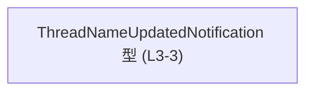
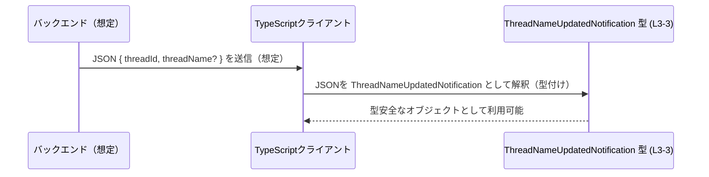

app-server-protocol\schema\typescript\v2\ThreadNameUpdatedNotification.ts の解説です。

# app-server-protocol\schema\typescript\v2\ThreadNameUpdatedNotification.ts

## 0. ざっくり一言

スレッド名更新に関する通知メッセージのペイロード構造を、TypeScript の型として表現した自動生成ファイルです（ThreadNameUpdatedNotification.ts:L1-3）。

---

## 1. このモジュールの役割

### 1.1 概要

- このモジュールは、`ThreadNameUpdatedNotification` という 1 つの型エイリアスを公開し、通知データの形を静的型として表現します（ThreadNameUpdatedNotification.ts:L3-3）。
- ファイル先頭コメントにより、`ts-rs` によって自動生成され、手動編集してはいけないことが明示されています（ThreadNameUpdatedNotification.ts:L1-2）。
- 実行時に動くロジックは一切含まれず、型情報のみを提供します（ThreadNameUpdatedNotification.ts:L3-3）。

### 1.2 アーキテクチャ内での位置づけ

このファイル内には `import` や他の型定義がなく、単一の型エイリアスのみがエクスポートされています（ThreadNameUpdatedNotification.ts:L3-3）。  
そのため、

- **このモジュールが他を参照している依存関係** はありません（このチャンクには現れません）。
- 逆に、**他のモジュールから本型がインポートされて利用される** ことが想定されますが、実際の利用箇所はこのチャンクからは分かりません。

依存関係のイメージ（本ファイルから観測できる範囲）は次のようになります。



### 1.3 設計上のポイント

- **自動生成コードであること**
  - `// GENERATED CODE! DO NOT MODIFY BY HAND!` と `ts-rs` による生成コメントにより、手動編集禁止が明示されています（ThreadNameUpdatedNotification.ts:L1-2）。
- **型のみを提供するモジュール**
  - `export type ...` しか書かれておらず、関数やクラスは存在しません（ThreadNameUpdatedNotification.ts:L3-3）。
- **オプショナルプロパティの利用**
  - `threadName?: string` により、`threadName` プロパティは「存在しない可能性がある」と型システムに伝えています（ThreadNameUpdatedNotification.ts:L3-3）。
- **言語安全性の観点**
  - TypeScript 上では `threadId` は必須の `string`、`threadName` は任意の `string` として型チェックされ、誤ったアクセスはコンパイル時に検出されます（ThreadNameUpdatedNotification.ts:L3-3）。
  - ただし型はコンパイル時の仕組みであり、実行時にはこの型情報は存在しないため、外部からの JSON を扱う際は別途ランタイムのバリデーションが必要です（このチャンク内に実装はありません）。

---

## 2. 主要な機能一覧

このファイルは「機能」というより「データ構造の定義」を 1 つだけ提供します。

- `ThreadNameUpdatedNotification` 型: スレッド名更新通知のペイロード構造を表す TypeScript の型エイリアス（ThreadNameUpdatedNotification.ts:L3-3）

---

## 3. 公開 API と詳細解説

### 3.1 型一覧（構造体・列挙体など）

主要コンポーネント（型）のインベントリーです。

| 名前                           | 種別        | 行範囲 | 役割 / 用途                                                                 | 根拠                                     |
|--------------------------------|------------|--------|------------------------------------------------------------------------------|------------------------------------------|
| `ThreadNameUpdatedNotification` | 型エイリアス | L3-3   | スレッド名更新通知メッセージのペイロード構造を表現するオブジェクト型       | ThreadNameUpdatedNotification.ts:L3-3    |

`ThreadNameUpdatedNotification` のフィールド詳細:

| フィールド名  | 型      | 必須/任意 | 説明                                   | 根拠                                     |
|---------------|---------|-----------|----------------------------------------|------------------------------------------|
| `threadId`    | `string` | 必須      | 対象スレッドを一意に識別する ID        | ThreadNameUpdatedNotification.ts:L3-3    |
| `threadName`  | `string` | 任意 (`?`) | 更新後のスレッド名。無い場合もありうる | ThreadNameUpdatedNotification.ts:L3-3    |

> フィールドの意味については型名・プロパティ名からの解釈であり、実際の業務的意味はこのチャンクからは断定できません。

### 3.2 関数詳細（最大 7 件）

このファイルには関数・メソッドは定義されていません（ThreadNameUpdatedNotification.ts:L3-3）。

### 3.3 その他の関数

補助的な関数やラッパー関数も存在しません（ThreadNameUpdatedNotification.ts:L3-3）。

---

## 4. データフロー

この型が「通知メッセージのスキーマ」として使われるであろう典型的なシナリオを、**想定例** として示します（実際の利用コードはこのチャンクには現れません）。

1. 何らかのバックエンドが「スレッド名が更新された」というイベントを発生させる。
2. 通知メッセージとして `threadId` と `threadName` を含む JSON をクライアントに送信する。
3. TypeScript クライアント側でその JSON を `ThreadNameUpdatedNotification` 型として扱い、UI 更新などに利用する。



> 実際にどのようなバックエンドやトランスポート（WebSocket/HTTPなど）が使われているかは、このチャンクには現れません。

---

## 5. 使い方（How to Use）

### 5.1 基本的な使用方法

通知メッセージを扱う関数の引数や、状態管理ストアの型として利用するのが基本的な使い方です。

```typescript
// 型をインポートする（実際のパスはプロジェクト構成によって異なる）
import type { ThreadNameUpdatedNotification } from "./ThreadNameUpdatedNotification"; // ThreadNameUpdatedNotification.ts:L3-3

// 通知を処理する例
function handleThreadNameUpdated(notification: ThreadNameUpdatedNotification) { // 引数に型を付ける
    const name = notification.threadName ?? "(no name)"; // threadName は任意なのでフォールバックを用意
    console.log(`Thread ${notification.threadId} renamed to ${name}`); // 型に基づいて安全にアクセス
}
```

ポイント:

- `threadId` は必須の `string` なので、常に `notification.threadId` としてアクセスできます（ThreadNameUpdatedNotification.ts:L3-3）。
- `threadName` はオプショナルなので、`undefined` の可能性を考慮したコードにする必要があります（ThreadNameUpdatedNotification.ts:L3-3）。
- この型はコンパイル時だけ存在し、実行時に自動でバリデーションされるわけではない点に注意が必要です。

### 5.2 よくある使用パターン

#### (1) 外部からの JSON を型付けして扱う

```typescript
import type { ThreadNameUpdatedNotification } from "./ThreadNameUpdatedNotification";

// 生の JSON を受け取り、安全に ThreadNameUpdatedNotification として扱うための簡易例
function parseThreadNameUpdated(raw: unknown): ThreadNameUpdatedNotification {
    if (
        typeof raw === "object" &&
        raw !== null &&
        typeof (raw as any).threadId === "string" // 必須フィールドを最低限チェック
    ) {
        // threadName は string か undefined であることの詳細チェックは省略例
        return raw as ThreadNameUpdatedNotification;
    }
    throw new Error("Invalid ThreadNameUpdatedNotification payload");
}
```

- **セキュリティ上の注意**: 信頼できない入力を扱う場合は、ここで示したような簡易チェックでは不十分なことが多く、`zod` 等のスキーマライブラリなどで厳密な検証を行うのが安全です。
- この型定義自体にはランタイム検証機能は含まれていません（ThreadNameUpdatedNotification.ts:L3-3）。

#### (2) 通知メッセージを構築して送信する

```typescript
import type { ThreadNameUpdatedNotification } from "./ThreadNameUpdatedNotification";

function buildNotification(id: string, name?: string): ThreadNameUpdatedNotification {
    // threadName を渡さなければ、プロパティ自体を省略することも可能
    return name !== undefined
        ? { threadId: id, threadName: name }
        : { threadId: id };
}
```

- ここで作成したオブジェクトを、そのまま JSON 化して送信することが想定されます（利用コードはこのチャンクには現れません）。

### 5.3 よくある間違い

#### 間違い例: `threadName` を必ず存在すると仮定する

```typescript
import type { ThreadNameUpdatedNotification } from "./ThreadNameUpdatedNotification";

function wrong(notification: ThreadNameUpdatedNotification) {
    // 間違い: threadName が存在しないケースを考慮していない
    console.log(notification.threadName.toUpperCase()); // strictNullChecks を有効にするとコンパイルエラー
}
```

#### 正しい例: オプショナルであることを考慮する

```typescript
function correct(notification: ThreadNameUpdatedNotification) {
    if (notification.threadName) { // 存在チェック
        console.log(notification.threadName.toUpperCase());
    } else {
        console.log("Thread name is not set.");
    }
}
```

- `threadName?` という定義に基づき、存在しないケースを必ず考慮する必要があります（ThreadNameUpdatedNotification.ts:L3-3）。

### 5.4 使用上の注意点（まとめ）

- **前提条件**
  - `threadId` は常に `string` として存在するものとして設計されています（ThreadNameUpdatedNotification.ts:L3-3）。
  - `threadName` は存在しないこともあるため、UI 表示やロジックで必ず null/undefined を考慮する必要があります。
- **セキュリティ**
  - 型定義だけでは外部入力の安全性は保証されません。外部から受け取る JSON にはランタイムでの検証を行う必要があります。
- **並行性**
  - このファイルには実行時状態や副作用を持つコードがなく、JavaScript のイベントループや Web Worker などの並行性と直接関わる部分はありません。型定義自体はスレッドセーフ性・並行性に影響しません。
- **自動生成コードであること**
  - コメントにより、手動変更は推奨されない（禁止）とされています（ThreadNameUpdatedNotification.ts:L1-2）。変更が必要な場合は生成元の定義を変更するのが前提となります。

---

## 6. 変更の仕方（How to Modify）

### 6.1 新しい機能（フィールドなど）を追加する場合

このファイルは `ts-rs` による自動生成コードであり、コメントで「手で変更しないこと」が明示されています（ThreadNameUpdatedNotification.ts:L1-2）。  
一般的には次のような手順になります（具体的な生成手順はこのチャンクには現れません）。

1. **生成元の定義を探す**
   - `ts-rs` は通常 Rust 側の型から TypeScript 型を生成しますが、このリポジトリ内でどのファイルが生成元かは、このチャンクだけでは分かりません。
2. **Rust 側の構造体などにフィールドを追加する**
   - 例: `thread_name` に相当するフィールドを増やす、型を変更するなど（あくまで一般的な ts-rs の使い方に基づく説明です）。
3. **コード生成を再実行する**
   - プロジェクトで設定されているビルド/生成手順に従って `ts-rs` を再実行し、この TypeScript ファイルを再生成します。
4. **TypeScript 側の利用箇所を更新する**
   - 追加フィールドや型変更に応じて、呼び出し側・利用側のコードを修正します。

### 6.2 既存の機能（フィールドなど）を変更する場合

- **影響範囲の確認**
  - `ThreadNameUpdatedNotification` をインポートしているすべてのファイルが影響を受けます。検索や IDE の「すべての参照を検索」機能で利用箇所を洗い出す必要があります（インポート側はこのチャンクには現れません）。
- **契約（Contract）の確認**
  - `threadId` が必須であることや `threadName` がオプショナルであることを前提にコードが書かれているはずなので、この前提を変える場合は、利用側のロジックも併せて変更する必要があります（ThreadNameUpdatedNotification.ts:L3-3）。
- **後方互換性**
  - プロトコル（サーバー・クライアント間の通信仕様）の一部である場合、フィールド名や必須/任意の変更は、既存クライアントとの互換性に影響します。
- **テスト**
  - エンドツーエンドテストやシリアライズ/デシリアライズのテストが存在する場合、それらも更新が必要です（テストコードはこのチャンクには現れませんが、一般的な注意点です）。

---

## 7. 関連ファイル

このチャンクから直接確認できる関連情報は限定的です。

| パス / ツール                              | 役割 / 関係                                                                                               |
|-------------------------------------------|------------------------------------------------------------------------------------------------------------|
| `app-server-protocol/schema/typescript/v2` | 本ファイルを含むディレクトリ。ディレクトリ名から、プロトコル v2 の TypeScript スキーマを集めた場所と解釈できますが、実際にどのファイルが存在するかはこのチャンクからは分かりません。 |
| `ts-rs`（外部ツール、コメント中に言及）    | Rust の型定義から TypeScript 型を生成するライブラリとして知られており、このファイルもその出力であることがコメントで示されています（ThreadNameUpdatedNotification.ts:L1-2）。 |

> このファイルと 1 対 1 に対応する Rust 側の定義ファイルや、実際にこの型を利用するモジュールのパスは、このチャンクには現れません。
