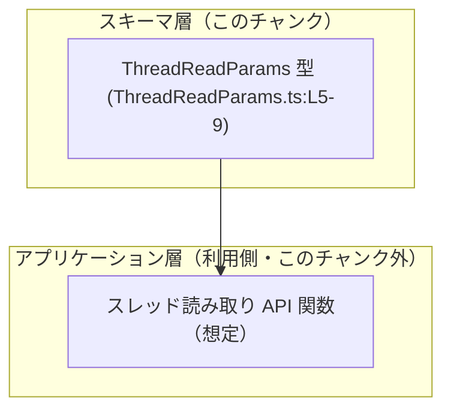
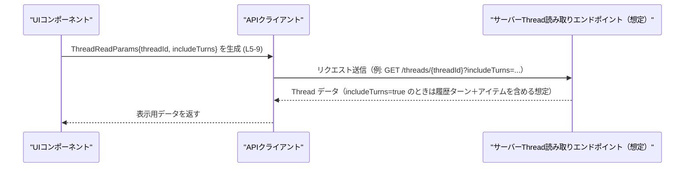

# app-server-protocol/schema/typescript/v2/ThreadReadParams.ts コード解説

## 0. ざっくり一言

`ThreadReadParams` は、「スレッドを読み取るリクエストで使うパラメータ」を表す TypeScript の型エイリアスです（`ThreadReadParams.ts:L5-9`）。

---

## 1. このモジュールの役割

### 1.1 概要

- このモジュールは、**スレッド読み取り操作に必要な情報をまとめたパラメータ型**を TypeScript 側に提供します。
- 具体的には、対象スレッドを識別する `threadId` と、ロールアウト履歴のターンを含めるかどうかを表す `includeTurns` フラグを持ちます（`ThreadReadParams.ts:L5-9`）。
- ファイル先頭コメントから、この型定義は `ts-rs` により自動生成されており、手動編集は想定されていません（`ThreadReadParams.ts:L1-3`）。

### 1.2 アーキテクチャ内での位置づけ

- ディレクトリパス `schema/typescript/v2` と `ts-rs` による自動生成コメントから、**サーバー側のスキーマ定義を TypeScript へエクスポートする層**に属すると解釈できます（`ThreadReadParams.ts:L1-3`）。
- このファイル自身は型定義のみを提供し、実際の API 呼び出しやビジネスロジックは別モジュールで実装されると考えられます（呼び出し元はこのチャンクには現れません）。

> ※以下の図で、「利用側 API 関数」は想定上のコンポーネントであり、このチャンクには定義がありません。



### 1.3 設計上のポイント

- **自動生成コード**  
  - ファイル先頭に「GENERATED CODE! DO NOT MODIFY BY HAND!」と明記されており（`ThreadReadParams.ts:L1-3`）、生成元（通常は Rust 側など）を修正して再生成する前提になっています。
- **純粋なデータ構造**  
  - `export type ThreadReadParams = { ... }` で表現されたオブジェクト型のみで、関数やメソッドは一切定義されていません（`ThreadReadParams.ts:L5-9`）。
- **シンプルなフィールド構成**
  - `threadId: string` と `includeTurns: boolean` の 2 フィールドのみで、ネスト構造や可変長の配列などは含まれていません（`ThreadReadParams.ts:L5-9`）。
- **TypeScript 型としての安全性**
  - プロパティの型が明示されているため、TypeScript コンパイル時に `threadId` や `includeTurns` の型ミスを検出できます。ただし、TypeScript の型は実行時には存在しないため、外部入力に対する実行時バリデーションは別途必要です。

---

## 2. 主要な機能一覧

このモジュールが提供する機能は 1 つです。

- `ThreadReadParams` 型: スレッド読み取りリクエストのパラメータ（スレッド ID と履歴を含めるかどうか）を表現するオブジェクト型。

---

## 3. 公開 API と詳細解説

### 3.1 型一覧（構造体・列挙体など）

※この表は、このチャンクに含まれる「コンポーネントインベントリー」を兼ねています。

| 名前               | 種別          | フィールド構成                                                                                              | 役割 / 用途                                                                                                  | 根拠 |
|--------------------|---------------|-------------------------------------------------------------------------------------------------------------|--------------------------------------------------------------------------------------------------------------|------|
| `ThreadReadParams` | 型エイリアス  | `threadId: string`,<br>`includeTurns: boolean`                                                              | スレッド読み取り処理に渡すパラメータ型。対象スレッドと、ロールアウト履歴のターンを含めるかどうかを指定する。 | `ThreadReadParams.ts:L5-9` |

#### フィールド詳細

- `threadId: string`  
  - 対象となるスレッドを識別する ID を表す文字列です（`ThreadReadParams.ts:L5`）。
  - 具体的なフォーマット（UUID、数値文字列など）は、このチャンクからは分かりません。
- `includeTurns: boolean`  
  - JSDoc コメントに「When true, include turns and their items from rollout history.」とあり（`ThreadReadParams.ts:L6-8`）、`true` のときに「ロールアウト履歴からターンとそのアイテムを含める」ことを示すフラグです（`ThreadReadParams.ts:L9`）。
  - `false` の場合の挙動は明示されていませんが、通常はそれらを含めないレスポンスになると解釈できます（この点はコメントからの推測であり、コードだけでは挙動は断定できません）。

### 3.2 関数詳細（最大 7 件）

- このファイルには関数やメソッドは一切定義されていません（`ThreadReadParams.ts:L1-9`）。
- そのため、「関数詳細」セクションに該当する公開 API はありません。

### 3.3 その他の関数

- 補助関数・ラッパー関数も定義されていません（`ThreadReadParams.ts:L1-9`）。

---

## 4. データフロー

このセクションでは、`ThreadReadParams` を使った典型的な利用イメージを示します。  
※以下は「この型がどのように使われうるか」の一例であり、このリポジトリ内の実際の実装を直接反映したものではありません。

1. UI やクライアントコードが、ユーザーの入力や状態から `ThreadReadParams` オブジェクトを組み立てる。
2. API クライアントが、このオブジェクトを用いてサーバーの「スレッド読み取りエンドポイント」を呼び出す。
3. サーバー側は `threadId` を使ってスレッドを特定し、`includeTurns` に応じてロールアウト履歴のターンとアイテムを含めるかどうかを決定する。



**要点**

- `ThreadReadParams` 自体は純粋なデータコンテナであり、**どこでどのように送信されるかは、この型を使う側の責務**です。
- `includeTurns` の値は、返ってくるデータ量・レスポンスサイズ・処理時間に影響する可能性があります（設計上はそのように使われやすいフラグです）。

---

## 5. 使い方（How to Use）

### 5.1 基本的な使用方法

以下は、`ThreadReadParams` を使ってスレッドを読み取る関数を呼び出すイメージの例です。  
（関数 `readThread` は説明用の仮想コードで、このファイルには定義されていません。）

```typescript
// ThreadReadParams 型をインポートする（実際のパスはプロジェクト構成に依存する）
import type { ThreadReadParams } from "./schema/typescript/v2/ThreadReadParams"; // 仮のパス

// スレッドを読み取る関数の型定義例（このファイルには存在しない仮想関数）
async function readThread(params: ThreadReadParams): Promise<void> { // params は ThreadReadParams 型
    // ここで params.threadId と params.includeTurns を使って API を呼び出す想定
}

// ThreadReadParams を使った呼び出し例
const params: ThreadReadParams = {                   // ThreadReadParams 型のオブジェクトを生成
    threadId: "thread-12345",                        // スレッド ID を文字列で指定
    includeTurns: true,                              // 履歴のターンとアイテムも含める
};

await readThread(params);                            // 型安全に関数を呼び出せる
```

**TypeScript の型安全性**

- `threadId` を `number` で渡そうとした場合などは、コンパイル時にエラーになります。
- `includeTurns` を渡し忘れると、「プロパティが不足している」という型エラーになります。
- これにより、リクエストパラメータの組み立てミスを **コンパイル時** に検出できます。

### 5.2 よくある使用パターン

1. **履歴を含めない軽量な読み取り**

```typescript
const paramsWithoutHistory: ThreadReadParams = {    // ThreadReadParams 型
    threadId: "thread-12345",
    includeTurns: false,                            // 履歴は含めない
};

// 軽量な読み取りを行う想定
await readThread(paramsWithoutHistory);
```

1. **履歴を含めた詳細な読み取り**

```typescript
const paramsWithHistory: ThreadReadParams = {
    threadId: "thread-12345",
    includeTurns: true,                             // ロールアウト履歴も含める
};

await readThread(paramsWithHistory);
```

1. **ヘルパー関数で `ThreadReadParams` を生成**

```typescript
function makeThreadReadParams(
    threadId: string,
    includeHistory: boolean,
): ThreadReadParams {
    return {
        threadId,                                   // 引数の threadId をそのまま設定
        includeTurns: includeHistory,               // 呼び出し側の命名から変換
    };
}

const params = makeThreadReadParams("thread-12345", true);
await readThread(params);
```

### 5.3 よくある間違い

以下は TypeScript でコンパイルエラーになる誤用例と、その修正版です。

```typescript
// 誤り例 1: threadId を number で渡してしまう
const badParams1: ThreadReadParams = {
    // threadId: 12345,                 // ❌ 型 'number' を型 'string' に割り当てることはできない
    threadId: "12345",                  // ✅ 文字列にする必要がある
    includeTurns: true,
};

// 誤り例 2: includeTurns を渡し忘れる
const badParams2: ThreadReadParams = {
    threadId: "thread-12345",
    // includeTurns: true,              // ❌ プロパティ 'includeTurns' が不足している
};

// 正しい例
const goodParams: ThreadReadParams = {
    threadId: "thread-12345",
    includeTurns: false,
};
```

**ポイント**

- `ThreadReadParams` は **両方のプロパティが必須** です（`ThreadReadParams.ts:L5-9` に `?` が付いていないため）。
- フロントエンド/クライアントコードでリテラルを組み立てる際に、型注釈を付けておくと、IDE 補完と型チェックが効きやすくなります。

### 5.4 使用上の注意点（まとめ）

- **自動生成コードの直接編集禁止**  
  - このファイル自体には「DO NOT MODIFY BY HAND」と明記されており（`ThreadReadParams.ts:L1-3`）、直接編集すると再生成時に上書きされます。
  - 振る舞いを変えたい場合は、生成元（通常は Rust の構造体など）を変更し、`ts-rs` を用いて再生成する必要があります。
- **実行時の型安全性について**
  - TypeScript の型はコンパイル時のみ存在するため、外部から受け取った JSON や動的なデータに対しては、実行時バリデーションが別途必要です。
  - 例えば、API レスポンスをそのまま `ThreadReadParams` とみなすようなキャストは、実行時の型不整合を見逃す可能性があります。
- **`includeTurns` の意味**
  - コメントに書かれている通り、`true` のときに「ロールアウト履歴のターンとアイテム」を含めるフラグです（`ThreadReadParams.ts:L6-8`）。
  - 大きな履歴を含めるとレスポンスサイズが増加する可能性があるため、必要な場合にのみ `true` を指定する設計が一般的です（これは設計上の一般論であり、このリポジトリ固有の仕様はこのチャンクからは分かりません）。

---

## 6. 変更の仕方（How to Modify）

### 6.1 新しい機能を追加する場合（フィールド追加など）

このファイルは `ts-rs` による自動生成であり、直接編集すべきではありません（`ThreadReadParams.ts:L1-3`）。

新しいフィールド（例: `locale` や `includeMetadata` など）を `ThreadReadParams` に追加したい場合は、一般に次のような手順になります。

1. **生成元の型定義を特定する**
   - `ts-rs` が生成していることから、元の型は通常 Rust 側の構造体や型定義です。
   - 具体的なファイル名や場所は、このチャンクには現れません。

2. **生成元の型にフィールドを追加する**
   - 例: Rust 側の `struct ThreadReadParams` に新しいフィールドを追加する（これは推測に基づく一般的な手順であり、このリポジトリ固有の構造はこのチャンクからは分かりません）。

3. **`ts-rs` を用いて TypeScript コードを再生成する**
   - `cargo` のビルドスクリプトや `ts-rs` のコマンドで、TypeScript 側のスキーマを再生成する。

4. **利用側コードの更新**
   - TypeScript 側で `ThreadReadParams` を使っている箇所で、新しいフィールドの追加対応を行う。

### 6.2 既存の機能を変更する場合（型変更など）

`threadId` や `includeTurns` の型・意味を変更したい場合も、**直接このファイルを編集するのではなく、生成元を変更する必要があります**。

変更時の注意点:

- **互換性**
  - 既存のクライアントコードは、`threadId: string` と `includeTurns: boolean` を前提に実装されている可能性があります。
  - 型や意味を変更すると、利用側のコンパイルエラーや動作変更が発生するため、影響範囲の確認が必要です。
- **バージョニング**
  - ディレクトリ名に `v2` が含まれていることから、このスキーマはバージョン管理されていると解釈できます。
  - 互換性のない変更を行う場合は、新しいバージョンのスキーマを作成する設計が一般的です（このリポジトリがそうしているかどうかは、このチャンクからは分かりません）。

---

## 7. 関連ファイル

このチャンクには他ファイルに関する具体的な情報が含まれていないため、厳密な関連ファイルは特定できません。

| パス                      | 役割 / 関係 |
|---------------------------|------------|
| （不明）                  | このチャンクには関連ファイルのパスや名前は現れていません。 |
| `app-server-protocol/schema/typescript/v2/`（ディレクトリ） | パス名から、同一ディレクトリ内に他のスキーマ定義用 TypeScript ファイルが存在することが推測されますが、具体的なファイル名や内容はこのチャンクからは分かりません。 |

---

## 言語固有の安全性・エラー・並行性の観点（この型に関する整理）

- **型安全性（TypeScript）**
  - `threadId` が必ず文字列、`includeTurns` が必ず真偽値であることをコンパイル時に保証できます（`ThreadReadParams.ts:L5-9`）。
  - プロパティが不足していたり余計なプロパティを含んでいる場合、TypeScript の型チェックで検出できます。

- **エラー**
  - 本ファイルにはロジックがないため、直接エラーを投げるようなコードは存在しません。
  - ただし、実行時には TypeScript の型情報は失われるので、不正な値を持つオブジェクトが `ThreadReadParams` として扱われた場合、利用側のコードで `undefined` プロパティアクセスなどによる実行時エラーになる可能性があります。

- **並行性**
  - `ThreadReadParams` は単なるデータオブジェクトであり、状態を持つわけではないため、このファイル単体では並行処理やスレッドセーフティに関する懸念はありません。
  - JavaScript/TypeScript 環境のイベントループや非同期処理の扱いは、この型を利用する側の実装に依存します。

- **セキュリティ**
  - この型自体はデータ構造であり、直接セキュリティホールを生むような処理は含まれていません。
  - ただし、`threadId` をそのままデータベースクエリやファイルパスに使う場合などは、利用側で適切なサニタイズやバリデーションを行う必要があります（本ファイルではこうした処理は行っていません）。
