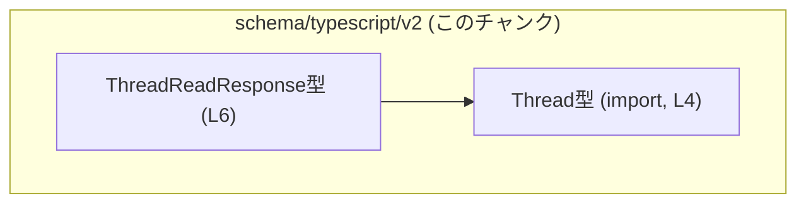
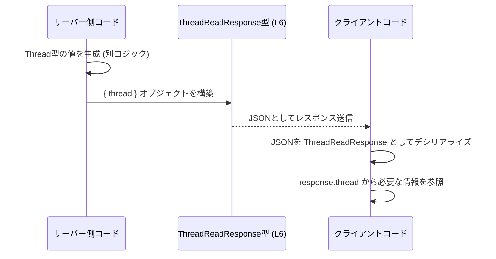

# app-server-protocol/schema/typescript/v2/ThreadReadResponse.ts コード解説

## 0. ざっくり一言

`ThreadReadResponse` は、`Thread` 型のデータを 1 つ含むレスポンスオブジェクトの型定義です（`ThreadReadResponse.ts:L4-6`）。  
Rust など別言語側から `ts-rs` によって自動生成された **型情報専用モジュール** になっています（`ThreadReadResponse.ts:L1-3`）。

---

## 1. このモジュールの役割

### 1.1 概要

- このモジュールは、`Thread` 型の値を返す API レスポンスとして使われると考えられる `ThreadReadResponse` 型を定義します（`ThreadReadResponse.ts:L4-6`）。
- 型情報のみを提供し、実行時のロジックや処理は一切含みません（関数定義が存在しないため、このチャンクから確認できます）。
- コードは `ts-rs` によって自動生成されており、手作業での編集は想定されていません（`ThreadReadResponse.ts:L1-3`）。

### 1.2 アーキテクチャ内での位置づけ

このファイルは TypeScript スキーマの一部であり、`Thread` 型をインポートして、それをラップするレスポンス型を公開します（`ThreadReadResponse.ts:L4-6`）。  
依存関係は次のように表現できます。



- `ThreadReadResponse` は `Thread` に依存しており、`Thread` の構造が変わると `ThreadReadResponse` の意味も変化します。
- `Thread` 自体の定義はこのチャンクには現れません（`ThreadReadResponse.ts:L4`）。

### 1.3 設計上のポイント

- **自動生成コード**  
  - ファイル先頭に「GENERATED CODE」「Do not edit this file manually」と明記されています（`ThreadReadResponse.ts:L1-3`）。
- **型専用インポート**  
  - `import type { Thread } from "./Thread";` により、コンパイル時の型情報だけを利用し、実行時にはインポートを発生させない設計です（`ThreadReadResponse.ts:L4`）。
- **シンプルなレスポンスラッパー**  
  - `ThreadReadResponse` は `{ thread: Thread }` という 1 フィールドだけを持つオブジェクト型です（`ThreadReadResponse.ts:L6`）。
- **状態・ロジックを持たない**  
  - 関数やクラスは定義されておらず、状態や処理は一切持ちません。このファイルは純粋に「データ構造の形だけ」を表現します。
- **並行性・エラー要素なし**  
  - 実行時コードが存在しないため、このモジュール単体には並行性の問題やランタイムエラー要因はありません。型安全性は TypeScript のコンパイル時チェックに委ねられています。

---

## 2. 主要な機能一覧

このモジュールが提供する機能は次の 1 点に集約されます。

- `ThreadReadResponse` 型定義: `thread: Thread` の 1 プロパティを持つレスポンスオブジェクト型を公開する（`ThreadReadResponse.ts:L6`）

---

## 3. 公開 API と詳細解説

### 3.1 型一覧（構造体・列挙体など）

| 名前                 | 種別          | 役割 / 用途                                                                 | 定義/参照位置                         |
|----------------------|---------------|------------------------------------------------------------------------------|----------------------------------------|
| `ThreadReadResponse` | 型エイリアス  | `thread: Thread` を 1 つ含むレスポンスオブジェクトを表す型                 | `ThreadReadResponse.ts:L6-6`          |
| `Thread`             | インポート型  | スレッドに相当するドメインデータ。`ThreadReadResponse.thread` の型として使用 | `ThreadReadResponse.ts:L4-4`（定義は別ファイルで、このチャンクには現れません） |

#### `ThreadReadResponse` 型

**概要**

- 次の形状を持つオブジェクト型です（`ThreadReadResponse.ts:L6`）。

```ts
export type ThreadReadResponse = {
    thread: Thread,
};
```

- `thread` プロパティは必須であり、省略や `undefined` は許されません（TypeScript のオブジェクト型の仕様と、`?` が付いていないことから分かります）。

**フィールド**

| フィールド名 | 型       | 説明                                                                 |
|--------------|----------|----------------------------------------------------------------------|
| `thread`     | `Thread` | `./Thread` で定義されるスレッド情報を表す型。レスポンスの本体データ |

**言語固有の安全性・エラー・並行性**

- **型安全性**  
  - `ThreadReadResponse` を使うことで、「レスポンスには必ず `thread` が存在し、その型は `Thread` である」という前提をコンパイル時に保証できます。
  - フィールド名の typo や構造の不足は TypeScript コンパイラが検出します。
- **エラー**  
  - この型自体はエラーを表現しません。API がエラーを返す場合は、別のエラー型やユニオン型（例: `ThreadReadResponse | ErrorResponse`）が別途定義されている可能性がありますが、このチャンクからは分かりません。
- **並行性**  
  - 実行時コードを含まないため、このファイル単体には並行性に関する要素はありません。並行アクセス時の安全性は、この型を利用する上位コードの責務です。

**Edge cases（エッジケース）**

- 型レベルでは次が成り立ちます。
  - `thread` を省略したオブジェクト `{}` を `ThreadReadResponse` として扱うことはコンパイルエラーになります。
  - `thread: null` や `thread: undefined` を許容したい場合は、別途 `Thread | null` のように `Thread` 側の型定義を変更しなければなりません（このチャンクには `Thread` の定義がないため、実際にどうなっているかは不明です）。

**使用上の注意点**

- このファイルは自動生成であり、「直接編集しない」ことが前提です（`ThreadReadResponse.ts:L1-3`）。
- API がエラーも返しうる場合、成功時専用の型として扱い、エラー時の構造は別途型で表現する設計が一般的です。このチャンクだけではエラー表現の有無は分かりません。

### 3.2 関数詳細（最大 7 件）

このファイルには関数・メソッドは定義されていません。  
そのため、関数の詳細解説は該当しません（コード全体を確認しても `function` / `=>` 関数式などが存在しません）。

### 3.3 その他の関数

- 補助関数・ユーティリティ関数も存在しません。

---

## 4. データフロー

このファイル自身には処理ロジックは含まれませんが、`ThreadReadResponse` 型が典型的に関わるデータフローのイメージを示します。  
以下は「スレッド詳細を取得する API」の成功レスポンスを想定した例です（このシナリオ自体はあくまで利用例であり、コード内には現れません）。



要点:

- サーバー側ロジックが `Thread` 型のデータを準備し、それを `thread` プロパティに格納したオブジェクトとして返す役割を持つと考えられます。
- クライアント側 TypeScript コードは、この JSON を `ThreadReadResponse` として扱うことで、`thread` の存在と型をコンパイル時に保証できます。

---

## 5. 使い方（How to Use）

### 5.1 基本的な使用方法

`ThreadReadResponse` 型を用いた、API クライアントコードの例です。  
ここでは `fetch` を使ってサーバーからスレッド情報を取得するケースを想定しています。

```ts
// ThreadReadResponse 型をインポートする（型だけ利用するので import type を使う）
import type { ThreadReadResponse } from "./ThreadReadResponse";  // ThreadReadResponse.ts:L6

// スレッドIDを指定して ThreadReadResponse を取得する非同期関数
async function getThread(id: string): Promise<ThreadReadResponse> {
    const res = await fetch(`/api/threads/${id}`);        // API に HTTP GET を送る
    if (!res.ok) {                                       // ステータスコードが 2xx 以外ならエラーにする
        throw new Error(`Failed to fetch thread: ${res.status}`);
    }
    const json = await res.json() as ThreadReadResponse; // レスポンスボディを ThreadReadResponse として解釈
    return json;                                         // 呼び出し元に返す
}

// 取得したレスポンスから thread を参照する例
async function example() {
    const response = await getThread("thread-id-123");   // ThreadReadResponse 型の値を取得
    const thread = response.thread;                      // thread プロパティにアクセス（型は Thread）
    // thread の中身（id や title など）は ./Thread の定義に従う（このチャンクには出てきません）
}
```

ポイント:

- `ThreadReadResponse` によって `response.thread` が必ず存在することが型レベルで保証されます。
- エラーレスポンスなどを扱う場合は、別の型やユニオン型による拡張が必要です（このファイルには含まれません）。

### 5.2 よくある使用パターン

- **関数の戻り値として利用**  
  - 上記のように、API クライアント関数の戻り値型として `Promise<ThreadReadResponse>` を使う。
- **関数の引数として利用**
  - 既に取得済みのレスポンスを受け取り、画面描画などを行う関数の引数型として利用する。

```ts
import type { ThreadReadResponse } from "./ThreadReadResponse"; // ThreadReadResponse.ts:L6

// 取得済みの ThreadReadResponse から画面表示用データを組み立てる例
function buildThreadViewModel(response: ThreadReadResponse) {
    const thread = response.thread;             // Thread 型
    // ここで thread のフィールドを使って ViewModel を構築する
}
```

### 5.3 よくある間違い

**間違い例: 構造が合わないオブジェクトを返してしまう**

```ts
// NG: thread フィールドを持たないオブジェクトを ThreadReadResponse として扱おうとしている
const badResponse: ThreadReadResponse = {
    // thread: ... がないためコンパイルエラーになる
    // これは TypeScript の型チェックにより検出される
};
```

**正しい例: `thread` フィールドを必ず含める**

```ts
import type { Thread } from "./Thread";                  // ThreadReadResponse.ts:L4
import type { ThreadReadResponse } from "./ThreadReadResponse";

// OK: thread フィールドに Thread 型の値を設定
const thread: Thread = { /* Thread の定義に従った値 */ }; // ./Thread の内容に依存（このチャンクにはない）
const okResponse: ThreadReadResponse = {
    thread,                                               // ここに必須フィールドを設定
};
```

このように、`ThreadReadResponse` を使うことで「`thread` を入れ忘れる」といったバグをコンパイル時に防止できます。

### 5.4 使用上の注意点（まとめ）

- このファイルは自動生成であり、手動で編集すると生成元との不整合を招く可能性があります（`ThreadReadResponse.ts:L1-3`）。
- `thread` プロパティは必須であり、成功レスポンス専用とみなすのが自然です。エラー情報を同じ型に混在させたい場合は、この型を直接変更するのではなく、別のラッパー型やユニオン型で表現することが一般的です。
- 実行時のバリデーション（レスポンス JSON が本当にこの形を満たしているか）は、別のレイヤー（ランタイムチェックやスキーマバリデーション）で行う必要があります。`ThreadReadResponse` はあくまでコンパイル時の型保証です。

---

## 6. 変更の仕方（How to Modify）

### 6.1 新しい機能を追加する場合

このファイルは明示的に「GENERATED CODE」「Do not edit this file manually」と書かれているため（`ThreadReadResponse.ts:L1-3`）、直接変更することは前提外です。

`ThreadReadResponse` にフィールドを追加したい場合の一般的な流れは次のようになります。

1. **生成元の定義を変更する**
   - このファイルは `ts-rs` によって生成されていると明記されているため（`ThreadReadResponse.ts:L3`）、通常は Rust 側などの元となる構造体／型定義を変更します（元定義の場所はこのチャンクからは分かりません）。
2. **コード生成を再実行する**
   - `ts-rs` の生成プロセスを再実行し、新しい定義に基づいて `ThreadReadResponse.ts` を再生成します。
3. **利用側コードを更新する**
   - 新しいフィールドを使う必要がある場合は、TypeScript 側の利用箇所でそのフィールドにアクセスするよう修正します。

この手順に従うことで、生成元（Rust など）と TypeScript 側の定義の一貫性を保つことができます。

### 6.2 既存の機能を変更する場合

`ThreadReadResponse` の構造を変更したい場合も、直接編集ではなく生成元を変更する必要があります。

注意点:

- **影響範囲の確認**
  - `ThreadReadResponse` を利用しているすべての箇所で、`thread` プロパティの存在や型に依存している可能性があります。
  - プロパティ名の変更や削除を行った場合、コンパイラエラーとして利用箇所に現れます。
- **契約の維持**
  - API レスポンスとして公開されている場合、クライアントとの契約（Contract）です。
  - フィールドの削除や型変更は、クライアントコードに破壊的な変更をもたらすため、互換性ポリシーに注意が必要です。
- **テスト**
  - このファイル自体にはテストコードは含まれていませんが、上位レイヤー（API テスト、E2E テストなど）で `ThreadReadResponse` 構造を前提としたテストが存在する可能性があります。変更時にはそれらの更新が必要になります。

---

## 7. 関連ファイル

このモジュールと密接に関係するファイルは次の通りです。

| パス                    | 役割 / 関係                                                                 |
|-------------------------|------------------------------------------------------------------------------|
| `./Thread`              | `Thread` 型を定義するモジュール。`ThreadReadResponse.thread` の型として利用される（`ThreadReadResponse.ts:L4`）。定義内容はこのチャンクには現れません。 |
| （生成元の Rust ファイル等） | `ts-rs` によってこの TypeScript 型を生成する元の定義。コメントから存在が推測されますが、具体的なパスや内容はこのチャンクからは分かりません（`ThreadReadResponse.ts:L3`）。 |

このファイル単体は非常に小さいですが、プロトコル全体の中では「スレッド読み取りレスポンスの形」を表す重要な一要素として機能していると解釈できます。
