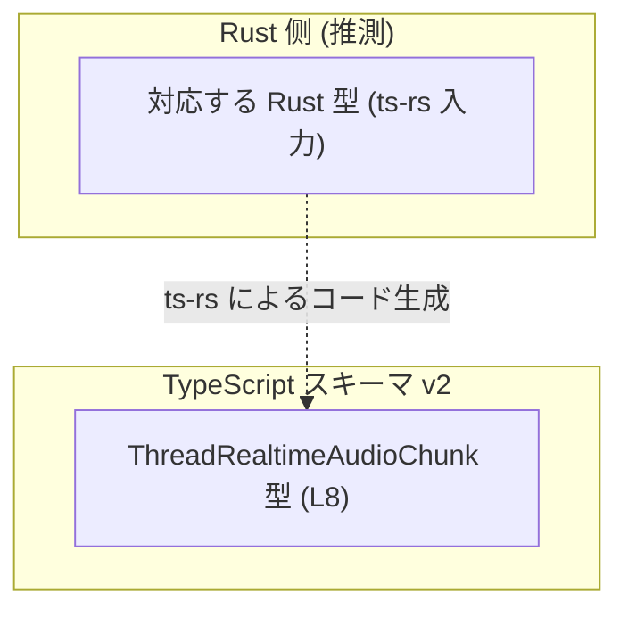
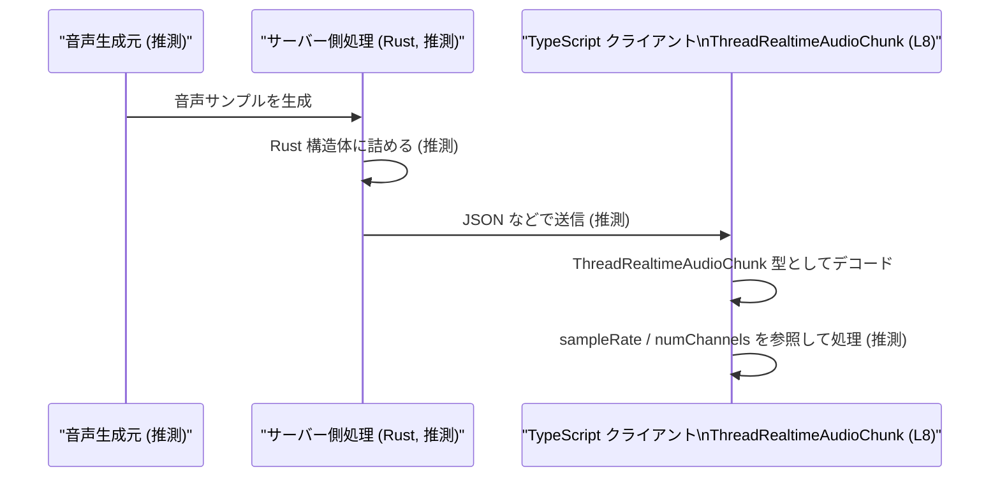

# app-server-protocol/schema/typescript/v2/ThreadRealtimeAudioChunk.ts

## 0. ざっくり一言

`ThreadRealtimeAudioChunk` は、「スレッドのリアルタイム音声チャンク」を表現するための TypeScript の型エイリアスです。音声データ本体と、そのメタ情報（サンプルレート・チャンネル数など）を 1 つのオブジェクトとして扱うための定義になっています（根拠: `ThreadRealtimeAudioChunk.ts:L5-L8`）。

---

## 1. このモジュールの役割

### 1.1 概要

- このモジュールは、**EXPERIMENTAL な「thread realtime audio chunk」** を表す TypeScript 型 `ThreadRealtimeAudioChunk` を提供します（根拠: JSDoc コメント `ThreadRealtimeAudioChunk.ts:L5-L7`）。
- Rust 側の型定義から `ts-rs` によって自動生成されたコードであり、**手動編集してはいけないスキーマ定義**であることが明示されています（根拠: `ThreadRealtimeAudioChunk.ts:L1-L3`）。
- アプリケーション内で、リアルタイム音声データと関連メタ情報をやり取りする際の **データ構造の契約（スキーマ）** の役割を持ちます（根拠: プロパティ構造 `ThreadRealtimeAudioChunk.ts:L8`）。

### 1.2 アーキテクチャ内での位置づけ

このファイル自体には他モジュールとの参照はなく、依存関係は明示されていません（根拠: import/export が `export type` のみ `ThreadRealtimeAudioChunk.ts:L8`）。  
コメントから、Rust 側の型定義をソースとして `ts-rs` が生成していることのみが分かります（根拠: `ThreadRealtimeAudioChunk.ts:L3`）。

以下の図は、**コメントとファイルパス名から推測される**典型的な位置づけのイメージです（このチャンクのコードだけでは確証はありません）。



- 実際の Rust 型名やファイルパスは、このチャンクには現れません（不明）。

### 1.3 設計上のポイント

- **自動生成コード**  
  - 冒頭コメントで「GENERATED CODE」「Do not edit manually」と明示されており、元のスキーマは別の場所（Rust 側）にあります（根拠: `ThreadRealtimeAudioChunk.ts:L1-L3`）。
- **単一の型エイリアスのみを輸出**  
  - 本ファイルは `ThreadRealtimeAudioChunk` 型エイリアス 1 つだけを `export` しています。関数やクラスなどはありません（根拠: `ThreadRealtimeAudioChunk.ts:L8`）。
- **シンプルなデータコンテナ**  
  - 中身はプリミティブ型（`string`, `number`）と `null` を組み合わせたフィールドのみで構成されており、状態やメソッドを持たない純粋なデータ構造です（根拠: `ThreadRealtimeAudioChunk.ts:L8`）。
- **nullable なフィールドで可用性を表現**  
  - `samplesPerChannel` と `itemId` が `null` を許容することで、「値がまだない」「関連付けられていない」といった状態を表現できるようになっています（根拠: `ThreadRealtimeAudioChunk.ts:L8`）。

---

## 2. 主要な機能一覧

このファイルは型定義のみを提供し、関数やロジックは含みません。そのため、「機能」は以下の 1 点に集約されます。

- `ThreadRealtimeAudioChunk` 型:  
  リアルタイム音声チャンクを表すオブジェクトの形（スキーマ）を定義する（根拠: `ThreadRealtimeAudioChunk.ts:L5-L8`）。

---

## 3. 公開 API と詳細解説

### 3.1 型一覧（構造体・列挙体など）

#### コンポーネントインベントリー（型）

| 名前                         | 種別        | 役割 / 用途                                                                                 | 定義位置                                 |
|------------------------------|-------------|----------------------------------------------------------------------------------------------|------------------------------------------|
| `ThreadRealtimeAudioChunk`   | 型エイリアス | スレッドのリアルタイム音声チャンクを表すデータ構造。音声データとメタ情報を束ねるコンテナ。 | `ThreadRealtimeAudioChunk.ts:L5-L8` |

#### `ThreadRealtimeAudioChunk` のフィールド

`ThreadRealtimeAudioChunk` の具体的な構造は次の通りです（根拠: `ThreadRealtimeAudioChunk.ts:L8`）。

```ts
export type ThreadRealtimeAudioChunk = {
    data: string,
    sampleRate: number,
    numChannels: number,
    samplesPerChannel: number | null,
    itemId: string | null,
};
```

| フィールド名          | 型                 | 必須 / 任意 | 役割（コードから分かる範囲）                                                | 定義位置                                 |
|-----------------------|--------------------|------------|------------------------------------------------------------------------------|------------------------------------------|
| `data`                | `string`           | 必須       | 音声チャンクの内容を表す文字列。エンコード形式などはこのファイルからは不明。 | `ThreadRealtimeAudioChunk.ts:L8` |
| `sampleRate`          | `number`           | 必須       | サンプルレート（おそらく Hz 単位）を表す数値。妥当な範囲は不明。            | `ThreadRealtimeAudioChunk.ts:L8` |
| `numChannels`         | `number`           | 必須       | チャンネル数（例: 1=モノラル, 2=ステレオ）を表す数値。具体的制約は不明。    | `ThreadRealtimeAudioChunk.ts:L8` |
| `samplesPerChannel`   | `number \| null`   | 任意       | 各チャンネルあたりのサンプル数。まだ不明な場合や適用不能な場合に `null`。    | `ThreadRealtimeAudioChunk.ts:L8` |
| `itemId`              | `string \| null`   | 任意       | このチャンクが紐づくアイテム ID と思われる識別子。存在しない場合は `null`。 | `ThreadRealtimeAudioChunk.ts:L8` |

> 備考: `samplesPerChannel` / `itemId` の具体的な意味・値の制約は、名前から推測できますが、このチャンクのコードだけでは確定できません。

### 3.2 関数詳細

このファイルには関数・メソッドは定義されていません（根拠: `export type` 以外の宣言がないこと `ThreadRealtimeAudioChunk.ts:L1-L8`）。  
そのため、詳細な関数解説セクションは該当しません。

### 3.3 その他の関数

同様に、補助的な関数やラッパー関数も存在しません（根拠: `ThreadRealtimeAudioChunk.ts:L1-L8`）。

---

## 4. データフロー

このファイル単体からは、実際にどのコンポーネントからどのように呼ばれているかは分かりません（import などがないため）。  
ここでは、**型名とコメントから推測される一般的な利用イメージ**として、リアルタイム音声ストリームの中で `ThreadRealtimeAudioChunk` がどのように使われうるかを示します。  
※以下はあくまで利用イメージであり、このチャンクのコードからの事実ではありません。



- 実際のフォーマット（JSON かバイナリか）、送信プロトコル、利用コンポーネントなどは、このファイルには記述がありません（不明）。

---

## 5. 使い方（How to Use）

### 5.1 基本的な使用方法

`ThreadRealtimeAudioChunk` は、TypeScript 側で受け取ったデータが期待どおりの形をしていることを **型レベルで保証するためのスキーマ**として利用できます。

以下の例では、`ThreadRealtimeAudioChunk` 型の値を引数に取り、`samplesPerChannel` が `null` でない場合に計算を行う処理を示します。

```typescript
// ここでは ThreadRealtimeAudioChunk 型がすでにスコープ内にあるものとします。

// ThreadRealtimeAudioChunk 型の値を受け取り、
// サンプル総数を計算して返す例
function getTotalSamples(chunk: ThreadRealtimeAudioChunk): number | null {
    // samplesPerChannel が null の可能性があるため、null チェックが必要
    if (chunk.samplesPerChannel === null) {
        return null; // サンプル数が不明な場合
    }

    // numChannels, samplesPerChannel は number 型と分かっているので、
    // IDE の補完や型チェックの恩恵を受けられる
    return chunk.numChannels * chunk.samplesPerChannel;
}

// 利用例
const chunk: ThreadRealtimeAudioChunk = {
    data: "...",            // 実際のエンコード形式はこのファイルからは不明
    sampleRate: 48000,      // 48kHz
    numChannels: 2,         // ステレオ
    samplesPerChannel: 1024,
    itemId: null,           // まだアイテム ID が割り当てられていない例
};

const totalSamples = getTotalSamples(chunk);
```

### 5.2 よくある使用パターン

1. **ネットワークから受信したデータの型付け**

```typescript
// 例: 何らかの手段で JSON を受け取ったあと、
// ThreadRealtimeAudioChunk 型を付与して扱うイメージ
declare const raw: unknown; // 実際にはネットワークなどから取得

// ランタイムのバリデーションは別途必要（この型定義だけでは行われない）
const chunk = raw as ThreadRealtimeAudioChunk;

// 型が付くことで、以降のコードで IDE の補完や型チェックが効く
console.log(chunk.sampleRate);
```

1. **オプショナルなメタ情報の扱い**

```typescript
function getItemIdOrFallback(chunk: ThreadRealtimeAudioChunk, fallback: string): string {
    // itemId は null の可能性があるため、null 合体演算子で補う
    return chunk.itemId ?? fallback;
}
```

### 5.3 よくある間違い（想定されるもの）

このファイルには具体的な利用コードはありませんが、型から推測できる誤用パターンを示します。

```typescript
// 誤り例: null チェックをせずに samplesPerChannel を数値として扱う
function totalSamplesWrong(chunk: ThreadRealtimeAudioChunk): number {
    // コンパイルは通るが、runtime で chunk.samplesPerChannel が null だと NaN になる
    return chunk.numChannels * chunk.samplesPerChannel as number;
}

// 正しい例: null を考慮した分岐を行う
function totalSamplesSafe(chunk: ThreadRealtimeAudioChunk): number | null {
    if (chunk.samplesPerChannel === null) {
        return null;
    }
    return chunk.numChannels * chunk.samplesPerChannel;
}
```

- `samplesPerChannel` / `itemId` のような `T \| null` のフィールドは、**必ず null を考慮した分岐や `??` を使う**必要があります。

### 5.4 使用上の注意点（まとめ）

- **ランタイムバリデーションは別途必要**  
  この型はコンパイル時の型チェックのみを提供し、実行時に構造を検証するコードは含まれていません。外部から受け取ったデータに対しては、`zod` など別ツールでの検証が必要です。
- **nullable フィールドの扱い**  
  `samplesPerChannel` と `itemId` は `null` を取り得るため、そのまま数値や文字列として使うと誤動作や `NaN` の原因になります。
- **セキュリティ的な観点（一般論）**  
  - `data` は音声データなど任意の文字列を保持できるため、外部入力から直接利用する場合はサイズ制限やデコード処理のエラー処理を慎重に行う必要があります（このファイル自体にはその制御はありません）。
- **並行性**  
  型定義のみであり、状態やミューテーションを持たないため、この型自体にスレッド安全性の問題はありません。並行アクセスに関する制約は、この型を保持・更新する周辺ロジック側の設計に依存します。

---

## 6. 変更の仕方（How to Modify）

### 6.1 新しいフィールドを追加したい場合

- 冒頭コメントにあるとおり、このファイルは `ts-rs` による**自動生成**であり、「手で編集してはいけない」とされています（根拠: `ThreadRealtimeAudioChunk.ts:L1-L3`）。
- 新しいフィールドを追加する場合の一般的な手順は次のようになります（ただし、具体的な Rust 側ファイル名・構造はこのチャンクからは分かりません）:
  1. Rust 側の元になっている構造体（`ts-rs` の入力）にフィールドを追加する。
  2. `ts-rs` を用いたビルド・コード生成プロセスを再実行する。
  3. 生成された TypeScript 側の `ThreadRealtimeAudioChunk` に新フィールドが反映されることを確認する。
- このファイルを直接編集すると、**次回のコード生成で上書きされる**可能性が高く、変更が失われることが予想されます。

### 6.2 既存フィールドの型や意味を変更したい場合

- 同様に、変更すべき場所は **Rust 側の定義**です。  
  例:
  - `sampleRate` を `number` から `number \| null` にしたい場合
  - `itemId` を必須フィールドにしたい場合 など
- 変更時に注意すべき点:
  - 既存のクライアントコードが `ThreadRealtimeAudioChunk` の全フィールドをどのように利用しているかを確認する必要があります（このファイルからは使用箇所は分かりません）。
  - 特に `null` 許容かどうかを変えると、多くの呼び出し側の型エラーやランタイムエラーにつながる可能性があります。
  - プロトコル／スキーマのバージョニング方針（例: `v2` ディレクトリ）に従って、非互換な変更をどう扱うかを決める必要があります（ただし、このファイルからは方針は分かりません）。

---

## 7. 関連ファイル

このチャンクのコードから直接参照されているファイルはありませんが、コメントやパス構造から推測できる関連要素を整理します。

| パス / コンポーネント                          | 役割 / 関係                                                                                  | 根拠 |
|-----------------------------------------------|---------------------------------------------------------------------------------------------|------|
| `app-server-protocol/schema/typescript/v2/ThreadRealtimeAudioChunk.ts` | 本レポートの対象ファイル。TypeScript 側の `ThreadRealtimeAudioChunk` 型定義を提供する。 | ユーザ指定パス / `ThreadRealtimeAudioChunk.ts:L5-L8` |
| （Rust 側の対応する型定義ファイル・モジュール） | `ts-rs` によってこの TypeScript 型を生成する元となるスキーマ。パス・名称はこのチャンクからは不明。 | コメント: `ThreadRealtimeAudioChunk.ts:L3` |
| `app-server-protocol/schema/typescript/v2/` ディレクトリ内の他ファイル | 他の v2 スキーマ型を定義している可能性があるが、実際のファイル構成はこのチャンクには現れないため不明。 | ディレクトリ構造（ユーザ指定）のみ |

> 具体的なテストコードや、この型を利用するサービス層のファイルなどは、このチャンクには登場しないため特定できません。
