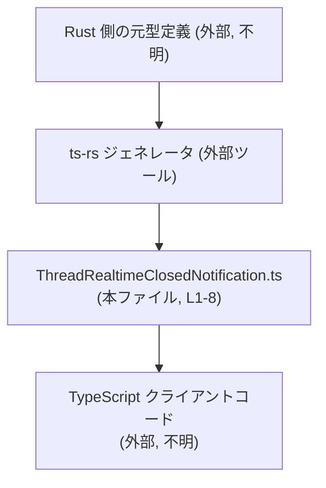
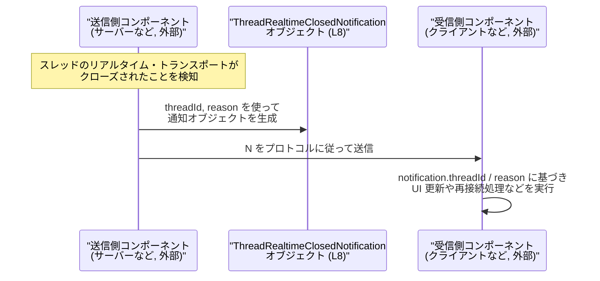

# app-server-protocol/schema/typescript/v2/ThreadRealtimeClosedNotification.ts

## 0. ざっくり一言

このファイルは、**スレッドのリアルタイム・トランスポートがクローズされたときに発火する通知メッセージの TypeScript 型**を定義する、自動生成コードです（ThreadRealtimeClosedNotification.ts:L1-3, L5-8）。

---

## 1. このモジュールの役割

### 1.1 概要

- このモジュールは、**「thread realtime transport が閉じた」というイベント通知のペイロード形式**を TypeScript の型として表現します（ThreadRealtimeClosedNotification.ts:L5-8）。
- Rust 側の型定義から `ts-rs` によって **自動生成されたスキーマ定義**であり、手動で編集しないことが明示されています（ThreadRealtimeClosedNotification.ts:L1-3）。

### 1.2 アーキテクチャ内での位置づけ

このチャンクに他ファイルへの import/export は一切現れませんが、コメントから次のような位置づけが読み取れます。

- Rust で定義された通知型 → `ts-rs` → 本 TypeScript 型（ThreadRealtimeClosedNotification.ts:L1-3）。
- 本 TypeScript 型 → フロントエンド／クライアント側のハンドラなどで利用される想定（通知の説明コメントより、ThreadRealtimeClosedNotification.ts:L5-7）。

それを抽象的な依存関係図にすると、次のようになります（Rust 側やクライアントコードはこのチャンクには現れません）。



### 1.3 設計上のポイント

コードから分かる設計上の特徴は次のとおりです。

- **自動生成コード**  
  - ファイル先頭に「GENERATED CODE! DO NOT MODIFY BY HAND!」とあり（ThreadRealtimeClosedNotification.ts:L1）、`ts-rs` による生成であることが明示されています（ThreadRealtimeClosedNotification.ts:L3）。
- **純粋な型定義のみ**  
  - 関数・クラス・実行ロジックは一切なく、`export type` によるオブジェクト型エイリアスだけで構成されています（ThreadRealtimeClosedNotification.ts:L8）。
- **null を含むユニオン型**  
  - `reason` フィールドは `string | null` で定義されており、「理由がない／通知できない」ケースを型レベルで許容しています（ThreadRealtimeClosedNotification.ts:L8）。
- **コンパイル時のみの安全性**  
  - TypeScript の型定義だけなので、実行時のバリデーションロジックはこのファイルには存在しません（ThreadRealtimeClosedNotification.ts:L1-8）。  
    → 値の正しさは、送信側がプロトコルを守ることと、クライアント側の実装に依存します。

---

## 2. 主要な機能一覧

このファイルが提供する実質的な「機能」は 1 つです。

- **`ThreadRealtimeClosedNotification` 型**:  
  スレッドのリアルタイム・トランスポートがクローズされたことを通知するメッセージの構造を表すオブジェクト型です（ThreadRealtimeClosedNotification.ts:L5-8）。

---

## 3. 公開 API と詳細解説

### 3.1 型一覧（構造体・列挙体など）

このチャンクに現れる公開型は次の 1 つです。

| 名前 | 種別 | 役割 / 用途 | 定義位置 |
|------|------|-------------|----------|
| `ThreadRealtimeClosedNotification` | 型エイリアス（オブジェクト型） | スレッドのリアルタイム・トランスポートがクローズされた際に emit される通知メッセージのペイロード構造を表現する | ThreadRealtimeClosedNotification.ts:L5-8 |

#### 3.1.1 `ThreadRealtimeClosedNotification` のフィールド

`ThreadRealtimeClosedNotification` は次の 2 フィールドを持つオブジェクト型です（ThreadRealtimeClosedNotification.ts:L8）。

```ts
export type ThreadRealtimeClosedNotification = {
    threadId: string,
    reason: string | null,
};
```

| フィールド名 | 型 | 説明 | 根拠 |
|--------------|----|------|------|
| `threadId`   | `string` | 対象スレッドを一意に識別する ID を表す文字列と解釈できます（ID という名前からの推測）。コードからは形式や意味の詳細は分かりません。 | ThreadRealtimeClosedNotification.ts:L8 |
| `reason`     | `string \| null` | トランスポートがクローズされた理由を表す文字列。`null` の場合は「理由が伝えられていない／不明」といった状態を表現できるようになっています。具体的な文字列値の種類はコードからは分かりません。 | ThreadRealtimeClosedNotification.ts:L8 |

**契約（Contract）として読み取れること**

- `threadId` は **必須** フィールドです（オプショナルマーク `?` がないため、ThreadRealtimeClosedNotification.ts:L8）。
- `reason` は必須フィールドですが、値として `null` が許容されるため、「プロパティがない」のではなく「プロパティはあるが値は null」という状態が取られます（ThreadRealtimeClosedNotification.ts:L8）。
- どちらのフィールドも、より厳しい制約（文字列パターン、列挙値、非空など）はこのファイルからは分かりません。

**エッジケース / 型レベルの注意点**

- `reason` が `null` の場合  
  - クライアント側コードは `notification.reason` を使う前に `null` チェックが必要です。  
    TypeScript 的には `string | null` のため、そのまま `toUpperCase()` などを呼ぶとコンパイルエラーになります（ThreadRealtimeClosedNotification.ts:L8）。
- `undefined` は許容されない  
  - 型定義上、`reason` は `string | null` であり、`undefined` は許されません（ThreadRealtimeClosedNotification.ts:L8）。  
    送信側で `reason: undefined` を送ると、型定義と実ランタイム値が不整合になる可能性があります。

### 3.2 関数詳細（最大 7 件）

このファイルには **関数・メソッドは一切定義されていません**（ThreadRealtimeClosedNotification.ts:L1-8）。  
そのため、関数詳細テンプレートに従って解説すべき対象はありません。

### 3.3 その他の関数

- このチャンクには補助的な関数やラッパー関数も存在しません（ThreadRealtimeClosedNotification.ts:L1-8）。

---

## コンポーネントインベントリー（このファイルに現れる要素一覧）

> ユーザー指定の「コンポーネント一覧」に対応するまとめです。

| 種別 | 名前 | 説明 | 根拠 |
|------|------|------|------|
| コメント | 自動生成警告 | 「GENERATED CODE! DO NOT MODIFY BY HAND!」という警告コメント。手動編集禁止の契約を示すメタ情報です。 | ThreadRealtimeClosedNotification.ts:L1-3 |
| 型エイリアス | `ThreadRealtimeClosedNotification` | thread realtime transport クローズ通知のペイロード構造を表すオブジェクト型。`threadId` と `reason` を持ちます。 | ThreadRealtimeClosedNotification.ts:L5-8 |

---

## 4. データフロー

このファイルには送受信処理そのものは含まれませんが、コメントから、

> "emitted when thread realtime transport closes."（ThreadRealtimeClosedNotification.ts:L6）

とあり、「リアルタイム・トランスポートが閉じたときに emit される通知」であることが読み取れます。

### 4.1 想定される典型的フロー（抽象化）

以下は、この型がどのように使われるかの **抽象的な流れ** を示したものです。  
具体的なクラス名やモジュール名はこのチャンクには現れないため、「サーバー/クライアント」として抽象化しています。



※ 上記の「送信側」「受信側」や送信プロトコルの詳細は、このチャンクには現れません。  
※ この図は、**`ThreadRealtimeClosedNotification` が純粋なデータコンテナであり、実際の処理は外部コンポーネントで行われる**ことを理解するための抽象図です（ThreadRealtimeClosedNotification.ts:L8）。

---

## 5. 使い方（How to Use）

### 5.1 基本的な使用方法

クライアント側 TypeScript コードが、この型を使って通知を扱う例です。  
import のパスはプロジェクト構成に依存するため、ここでは相対パスは例示に留めます。

```typescript
// ThreadRealtimeClosedNotification 型をインポートする
// 実際のパスはプロジェクト構成に応じて調整が必要です。
import type { ThreadRealtimeClosedNotification } from "./ThreadRealtimeClosedNotification";

// クローズ通知を処理する関数の例                        // この関数は通知を受け取って処理する
function handleThreadClosed(
    notification: ThreadRealtimeClosedNotification,       // 型をパラメータに指定することで、
) {                                                      // threadId / reason の存在と型が保証される
    // threadId をログに出力する                          // 必須フィールドなので、そのままアクセス可能
    console.log("thread closed:", notification.threadId);

    // reason は string | null なので null チェックが必要  // 直接 string メソッドは呼べない
    if (notification.reason !== null) {
        console.log("reason:", notification.reason);     // string として安全に扱える
    } else {
        console.log("reason is unknown");                // 理由が分からない場合の処理
    }
}
```

このように、**型を関数の引数として明示することで、IDE の補完やコンパイル時の型チェック**が効きます（TypeScript の型システムの利点）。

### 5.2 よくある使用パターン

#### パターン1: オブジェクト生成時に型を付ける

通知オブジェクトを生成するときに `ThreadRealtimeClosedNotification` 型を明示する例です。

```typescript
// 型を付けて通知オブジェクトを生成する例
const notification: ThreadRealtimeClosedNotification = {  // 型注釈により、フィールド不足や型違いを検出できる
    threadId: "thread-123",                               // string 型なので OK
    reason: "client_disconnected",                        // string 型なので OK
};

// reason が null のケース                               // 理由不明などの状態を表現したい場合
const notificationWithoutReason: ThreadRealtimeClosedNotification = {
    threadId: "thread-456",
    reason: null,                                         // string | null なので null も許容
};
```

#### パターン2: ハンドラ登録用の型として利用する

イベントリスナー用のコールバックに型を使う例です。

```typescript
// 通知を購読する関数に、コールバックの型情報として利用する例
function subscribeThreadClosed(
    handler: (notification: ThreadRealtimeClosedNotification) => void,  // コールバックの引数型を固定
) {
    // 実際の購読ロジックはこのチャンクには存在しないため不明     // ここでは型の使い方だけ示す
}

// 利用側: handler の引数に型がつくため、IDE 補完が効く
subscribeThreadClosed((n) => {
    console.log(n.threadId);                             // n は ThreadRealtimeClosedNotification 型
    if (n.reason) {
        console.log("closed because:", n.reason);
    }
});
```

### 5.3 よくある間違い

TypeScript の型として想定される誤用と、その修正例です。

```typescript
// 間違い例: 必須フィールドを省略している
const badNotification1: ThreadRealtimeClosedNotification = {
    // threadId: "thread-123",                           // ❌ 省略するとコンパイルエラー
    reason: "timeout",
};

// 正しい例: threadId を必ず指定する
const okNotification1: ThreadRealtimeClosedNotification = {
    threadId: "thread-123",
    reason: "timeout",
};
```

```typescript
// 間違い例: reason に number や undefined を入れている
const badNotification2: ThreadRealtimeClosedNotification = {
    threadId: "thread-123",
    // reason: 404,                                      // ❌ number は string | null に代入できない
    // reason: undefined,                                // ❌ undefined も許容されない
    reason: null,                                        // ✅ null は許容される
};
```

```typescript
// 間違い例: reason を null チェックせずに string として扱う
function logReasonWrong(notification: ThreadRealtimeClosedNotification) {
    // console.log(notification.reason.toUpperCase());   // ❌ reason は string | null のためコンパイルエラー
}

// 正しい例: null チェックを行う
function logReasonCorrect(notification: ThreadRealtimeClosedNotification) {
    if (notification.reason !== null) {
        console.log(notification.reason.toUpperCase());  // ✅ このブロック内では reason は string に絞られる
    }
}
```

### 5.4 使用上の注意点（まとめ）

- **自動生成コードを直接編集しない**  
  - ファイル先頭に「DO NOT MODIFY BY HAND!」とあるため（ThreadRealtimeClosedNotification.ts:L1-3）、  
    フィールド追加・変更は元となる Rust 型定義側で行うのが前提です。
- **`reason` は `string | null` であることを常に意識する**  
  - `null` の可能性を無視して string として扱うと、TypeScript のコンパイルエラーになります（ThreadRealtimeClosedNotification.ts:L8）。
- **ランタイムの検証は別途必要**  
  - このファイルには実行時チェックがないため、受信した JSON などが本当にこの型に従っているかどうかは別途バリデーションが必要です（ThreadRealtimeClosedNotification.ts:L1-8）。
- **並行性・スレッド安全性**  
  - この型は単なるデータ構造であり、状態やミューテーションを持たないため、**TypeScript レベルでの並行性問題はありません。**  
    実際の並行処理（WebSocket の複数メッセージなど）は、このチャンクの外部で扱われます。

---

## 6. 変更の仕方（How to Modify）

### 6.1 新しい機能を追加する場合

このファイルは `ts-rs` によって自動生成されるため（ThreadRealtimeClosedNotification.ts:L1-3）、**直接編集するべきではありません。** 機能追加の一般的な手順は次のとおりと解釈できます。

1. **Rust 側の元定義を変更する**  
   - ThreadRealtimeClosedNotification に対応する Rust の型（構造体など）に、新しいフィールドを追加するなどの変更を行います。  
   - この Rust 側のファイルパスや構造は、このチャンクには現れず不明です。
2. **`ts-rs` を再実行する**  
   - ビルドプロセスや専用コマンドにより、TypeScript スキーマを再生成します。  
   - その結果として、本ファイルの内容が更新されます。
3. **TypeScript 側の利用箇所を更新する**  
   - 追加されたフィールドを使うようにハンドラや UI ロジックを修正します。

### 6.2 既存の機能を変更する場合

既存フィールドの型や意味を変える場合も、基本的には上記と同じく **Rust 側で変更 → 再生成** となります（ThreadRealtimeClosedNotification.ts:L1-3）。

変更時の注意点:

- **互換性への影響**  
  - 例えば `reason: string | null` を `reason: string` に変更すると、`null` を前提にしていたクライアントコードが壊れる可能性があります。
- **エッジケースの見直し**  
  - 新しい型に合わせて、「null/未設定」「空文字列」「特定の理由コード」などの扱いをクライアント側でも見直す必要があります。
- **テストの更新**  
  - このファイル自体にはテストはありませんが、通知を処理するロジックのテスト（例: reason ごとの分岐）は、型変更に合わせて更新が必要です。

---

## 7. 関連ファイル

このチャンクには他ファイルのパス情報は一切現れませんが、論理的に関連すると考えられるものを、「パス不明」と明示した上で整理します。

| パス | 役割 / 関係 |
|------|------------|
| （不明）Rust 側の元型定義 | `ts-rs` の入力となる Rust の型定義。`ThreadRealtimeClosedNotification` のオリジナルであり、この TypeScript 型の変更はここを通じて行う必要があります（ThreadRealtimeClosedNotification.ts:L1-3 からの推測）。 |
| （不明）`ts-rs` の設定・ビルドスクリプト | Rust 型から本ファイルを生成するためのビルド設定。自動生成プロセスの一部です（ThreadRealtimeClosedNotification.ts:L1-3）。 |
| （不明）Thread realtime transport 実装 | 「thread realtime transport」がクローズされたことを検知し、この通知を emit するコンポーネント。コメントにのみ言及があります（ThreadRealtimeClosedNotification.ts:L5-7）。 |
| （不明）通知ハンドラ・クライアントコード | `ThreadRealtimeClosedNotification` 型を使って通知を処理する TypeScript コード。import などはこのチャンクには現れません。 |

※ これらのパスや具体的なファイル名は、このチャンクからは分かりません。「不明」として扱っています。
