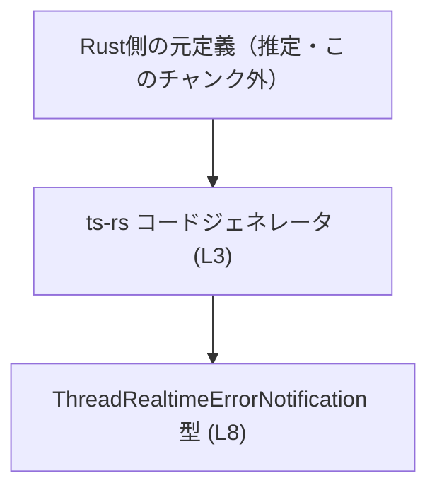
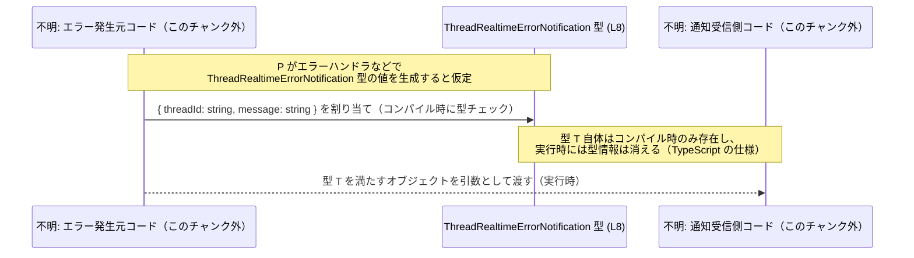

# app-server-protocol/schema/typescript/v2/ThreadRealtimeErrorNotification.ts

## 0. ざっくり一言

`threadId` と `message` を持つ「スレッドのリアルタイム処理で発生したエラー通知」を表す、ts-rs によって自動生成された TypeScript の型定義です。  
根拠: `ThreadRealtimeErrorNotification.ts:L1-3,5-8`

---

## 1. このモジュールの役割

### 1.1 概要

- このモジュールは、**「スレッドのリアルタイム処理でエラーが発生したときに送出される通知」** を表現する TypeScript 型を 1 つ提供します。  
  根拠: コメントで「EXPERIMENTAL - emitted when thread realtime encounters an error.」と記載 (`L5-7`)、それに続いて `ThreadRealtimeErrorNotification` 型が定義されている (`L8`)。
- コードは ts-rs により自動生成されており、手動での編集は想定されていません。  
  根拠: 「GENERATED CODE! DO NOT MODIFY BY HAND!」「This file was generated by [ts-rs]」というコメント (`L1-3`)。

### 1.2 アーキテクチャ内での位置づけ

- ファイルパスから、この型は **`app-server-protocol` の TypeScript 用スキーマ定義 (`schema/typescript/v2`) の一部** として配置されています（用途はファイルパスからのみ推測され、具体的な利用箇所はこのチャンクには現れません）。
- コメントから、この TypeScript 型は **ts-rs によるコード生成プロセスの出力**であり、元の定義（おそらく Rust 側）はこのチャンクには現れません。  
  根拠: ts-rs によって生成されたと明記 (`L3`)。

参考までに、生成プロセスの概念図を示します（Rust 側定義はこのチャンク外の概念です）。



> 注: A の「Rust側の元定義」は、ts-rs の一般的な利用形態からの推定であり、具体的な型名・ファイルはこのチャンクには現れません。

### 1.3 設計上のポイント

- **自動生成コード**  
  - 冒頭コメントで「GENERATED CODE! DO NOT MODIFY BY HAND!」と明示されており (`L1`)、直接編集しない前提のファイルです。
  - ts-rs による生成であることがコメントに明記されています (`L3`)。
- **純粋な型定義のみ**  
  - 実行時ロジック・関数・クラスは一切なく、`export type` による型エイリアス定義のみが存在します (`L8`)。
- **シンプルなオブジェクト構造**  
  - `threadId: string` と `message: string` の 2 プロパティを必須フィールドとして持つオブジェクト型です (`L8`)。
- **実験的 (EXPERIMENTAL) な通知であることの明示**  
  - JSDoc コメントで「EXPERIMENTAL」と明示されており (`L5-7`)、仕様の安定性や将来互換性については注意が必要であることが示唆されています。
- **言語固有の安全性 / エラー / 並行性**  
  - TypeScript の静的型付けにより、`threadId` と `message` に文字列以外を代入するとコンパイル時エラーになります (`L8`)。
  - 実行時のバリデーションやエラーハンドリングのコードは含まれていないため、このファイル単体ではランタイムの型安全性やエラー処理は提供しません (`L1-8`)。
  - 並行性（並列処理・スレッド安全性）に関する要素は、このファイルには現れません (`L1-8`)。

---

## 2. 主要な機能一覧

このファイルが提供する「機能」は、1 つの型定義に集約されています。

- `ThreadRealtimeErrorNotification` 型: スレッドのリアルタイム処理で発生したエラー通知を表すオブジェクト型。`threadId` と `message` の 2 つの文字列プロパティを持つ。  
  根拠: コメント (`L5-7`)、型定義 (`L8`)。

---

## 3. 公開 API と詳細解説

### 3.1 型一覧（構造体・列挙体など）

#### 型エイリアス

| 名前 | 種別 | フィールド | 役割 / 用途 | 根拠 |
|------|------|------------|-------------|------|
| `ThreadRealtimeErrorNotification` | 型エイリアス（オブジェクト型） | `threadId: string`, `message: string` | スレッドのリアルタイム処理でエラーが発生した際に送出される通知のペイロードを表す。TypeScript 側で構造を明示するために使われる。 | コメントと型定義 (`L5-8`) |

#### フィールド詳細

| フィールド名 | 型 | 必須/任意 | 説明 | 根拠 |
|-------------|----|----------|------|------|
| `threadId`  | `string` | 必須 | エラーが発生した対象スレッドを識別するための ID。具体的な形式はコードからは不明。 | 型定義内のプロパティ (`L8`) |
| `message`   | `string` | 必須 | エラー内容を説明するメッセージ文字列。フォーマットや言語はコードからは不明。 | 型定義内のプロパティ (`L8`) |

> 注: どちらのフィールドも `?` が付いておらず、オプショナルではないため、**この型を満たす値を作るには両方のプロパティが必須**です。  
> 根拠: `threadId: string, message: string` という記法で、`?` が無い (`L8`)。

### 3.2 関数詳細（最大 7 件）

このファイルには関数定義（通常の関数、メソッド、アロー関数、クラスメソッドなど）は存在しません。  
根拠: 唯一の実コードは `export type` による型定義のみであり (`L8`)、`function` や `=>`、`class` などの関数・クラス構文が現れない (`L1-8`)。

### 3.3 その他の関数

- 補助関数・ユーティリティ関数・ラッパー関数などは、このファイルには存在しません。  
  根拠: 前項と同じく、型定義以外の構文が無いことから (`L1-8`)。

---

## 4. データフロー

このファイルは型定義のみを提供し、**実行時の処理フローや関数呼び出し**は一切含まれません (`L1-8`)。  
そのため、ここでは **「型がどのようにコンパイル時チェックに関与するか」という観点の概念図** を示します。



- 上記図の P / C は、このチャンク外の任意のコードを概念的に表しています。実際にどのモジュールがこれを使うかは、このファイルからは分かりません。  
  根拠: import/export で他ファイル名が示されていない (`L1-8`)。
- `ThreadRealtimeErrorNotification` 型 (T) は、**コンパイル時の型チェックにのみ関与し、実行時には存在しません**。これは TypeScript 全体の仕様です。

---

## 5. 使い方（How to Use）

### 5.1 基本的な使用方法

このファイルの主な利用方法は、`ThreadRealtimeErrorNotification` 型を型注釈として用いることです。

```typescript
// 実際の import パスはこのチャンクからは分からないため、仮の書き方とします。
// import { ThreadRealtimeErrorNotification } from "app-server-protocol/schema/typescript/v2/ThreadRealtimeErrorNotification";

// ThreadRealtimeErrorNotification 型の値を作成する例
const notification: ThreadRealtimeErrorNotification = {   // notification は型により構造がチェックされる
    threadId: "thread-123",                               // string 型である必要がある（L8）
    message: "Connection lost",                           // string 型である必要がある（L8）
};

// 関数の引数として利用する例
function handleRealtimeError(
    notif: ThreadRealtimeErrorNotification,               // notif に threadId, message が必須と保証される（L8）
) {
    console.error(`[${notif.threadId}] ${notif.message}`); // 型安全にアクセスできる
}
```

- import パスは、このチャンクには現れないため、実際のプロジェクト構成に依存します。  
  根拠: このファイル内で自身のパスやバレルファイルへの再エクスポートは定義されていない (`L1-8`)。

### 5.2 よくある使用パターン

※ 以下は、この型の構造とコメントから「あり得る」利用方法を記述したもので、**具体的な利用コードはこのチャンクには現れません**。

1. **イベントリスナやコールバックの引数型として使う**  
   - 例: WebSocket や EventEmitter の「エラー通知イベント」のペイロード型。
   - メリット: `threadId` と `message` が常に存在し、IDE での補完が効く。

2. **API レスポンスの一部として使う**  
   - 例: REST / RPC のレスポンスボディ、あるいは GraphQL の型に対応する TS 型として。

いずれも、型の構造 (`threadId: string, message: string`) とコメント (`EXPERIMENTAL - emitted when thread realtime encounters an error.`) から想定される利用イメージです。  
根拠: 型定義とコメント (`L5-8`)。

### 5.3 よくある間違い

この型を使う際に起こり得る典型的な誤りと、その結果をまとめます。

```typescript
// 誤り例: 必須フィールドを省略している
const invalidNotification: ThreadRealtimeErrorNotification = {
    threadId: "thread-123",
    // message が無い: コンパイルエラーになる（L8）
    // Property 'message' is missing in type ...
};

// 誤り例: 型が一致しない
const invalidNotification2: ThreadRealtimeErrorNotification = {
    threadId: 123,                  // number を渡している: string でないためコンパイルエラー（L8）
    message: "Error",
};

// 正しい例
const validNotification: ThreadRealtimeErrorNotification = {
    threadId: "thread-123",
    message: "Error detail",
};
```

- これらの誤りは **コンパイル時に検出される** ため、実行前に修正できます。  
  根拠: TypeScript の型システムと、`threadId: string, message: string` の定義 (`L8`)。

### 5.4 使用上の注意点（まとめ）

- **フィールドは両方必須**  
  - `threadId` と `message` はオプショナルではないため、どちらか一方でも欠けるとコンパイルエラーになります。  
    根拠: `threadId: string, message: string` に `?` が付いていない (`L8`)。
- **文字列内容の制約は型では表現されていない**  
  - 空文字や特定フォーマット（UUID など）といった、より細かい制約は型には含まれておらず、必要であれば別途バリデーションが必要です。  
    根拠: 型が単純な `string` であり、リテラル型やテンプレートリテラル型などの追加制約が無い (`L8`)。
- **実行時の型検証は行われない**  
  - TypeScript の型情報はコンパイル時にのみ存在し、実行時には消えるため、外部から受け取る JSON などに対しては、ランタイムでの検証ロジックが別途必要です。  
    根拠: このファイルに実行時チェックの関数が存在しない (`L1-8`)。
- **セキュリティ上の留意点**  
  - `message` は自由形式の文字列であり、ログ出力や UI 表示に用いる場合、XSS やログ注入に対する対策（エスケープ等）は別途必要です。この型自体は安全性の担保は行いません。  
    根拠: `message: string` 以外の制約が一切ない (`L8`)。
- **並行性 / スレッド安全性**  
  - このファイルは純粋な型定義のみであり、共有状態やミューテーションは一切持たないため、並行性に関する問題はこのファイル単体では発生しません。  
    根拠: 関数・クラス・変数定義が無く、`export type` のみである (`L8`)。

---

## 6. 変更の仕方（How to Modify）

### 6.1 新しい機能を追加する場合

- 冒頭コメントに「GENERATED CODE! DO NOT MODIFY BY HAND!」とある通り、**この TypeScript ファイルを直接編集することは推奨されません**。  
  根拠: `L1-3`。
- ts-rs による自動生成であることから、型の追加・変更を行う場合は、**元となる定義（通常は Rust 側の構造体・型）を変更し、ts-rs のコード生成を再実行する**のが前提になります。  
  根拠: ts-rs による生成であると明記 (`L3`)。
- 具体的にどのファイル・型を編集すべきかは、このチャンクには現れません。

### 6.2 既存の機能を変更する場合

- `threadId` や `message` の型を変更したい場合も、同様に **元定義を変更 → ts-rs で再生成** する必要があります。  
  根拠: 自動生成コードであること (`L1-3`)。
- 変更時に注意すべき点:
  - この型を利用している全ての TypeScript コードでコンパイルエラーが発生する可能性があるため、**利用箇所の洗い出しと一括修正** が必要です（利用箇所自体はこのチャンクには現れません）。
  - 「EXPERIMENTAL」と明記されているため (`L5-7`)、将来的な互換性はもともと安定していない可能性がありますが、変更の影響範囲の確認は依然として必要です。

---

## 7. 関連ファイル

このファイル自体は他モジュールを import しておらず、また他モジュールへの export も型エイリアス 1 つのみです (`L8`)。  
そのため、**静的解析だけでは直接の関連ファイルは特定できません**。

推定される関連要素を、根拠を明示した上で整理します。

| パス / 要素 | 役割 / 関係 | 根拠 |
|------------|------------|------|
| `app-server-protocol/schema/typescript/v2/` ディレクトリ | このファイルが置かれているディレクトリ。プロトコル v2 の他の TypeScript スキーマ定義が存在する可能性が高いが、このチャンクには現れない。 | ユーザー指定のファイルパス |
| ts-rs の元定義（Rust 側ファイル、パス不明） | `ThreadRealtimeErrorNotification` 型生成の元になる定義。Rust 側でこの通知の構造が定義されていると推測されるが、具体的な位置・型名は不明。 | 「This file was generated by [ts-rs]」というコメント (`L3`) |
| この型を利用する TypeScript コード（ファイル名不明） | エラー通知を送受信するロジック・イベントハンドラ・API クライアントなど。この型を import しているはずだが、本チャンクには現れない。 | `export type` により外部から利用されることが前提になっている構造 (`L8`) |

---

### 付記: Bugs / Security / Edge Cases / Tests / パフォーマンス観点

- **Bugs の可能性**  
  - このファイル自体は単なる型定義であり、ロジックバグは含みません (`L1-8`)。  
  - ただし、`threadId` や `message` の意味が仕様と合っていない場合は、**仕様と実装の不整合** が発生し得ますが、それはこのチャンク外の問題です。
- **セキュリティ**  
  - `message` をそのまま HTML に埋め込むなどする場合、XSS のリスクがあります。この型はその対策を何も提供しません (`L8`)。
- **Contracts / Edge Cases**  
  - Contract: 「`ThreadRealtimeErrorNotification` 型の値には、`threadId` と `message` の 2 つの文字列プロパティが必ず存在する」 (`L8`)。  
  - Edge cases: 空文字・非常に長い文字列・不正フォーマットなどに対する扱いは、型からは読み取れません（別途ロジック側の仕様が必要）。
- **Tests**  
  - このファイル内にはテストコードは存在しません (`L1-8`)。型定義の妥当性は、元定義と ts-rs の動作、そして利用箇所の型チェックによって担保される想定です。
- **Performance / Scalability**  
  - 型定義のみであり、実行時コストにはほぼ影響しません (`L1-8`)。  
  - 利用箇所が増えても、コンパイル時の型チェックコストがわずかに増えるだけで、実行性能への影響は限定的です。

以上が、このチャンクから読み取れる `ThreadRealtimeErrorNotification` 型の客観的な解説になります。
