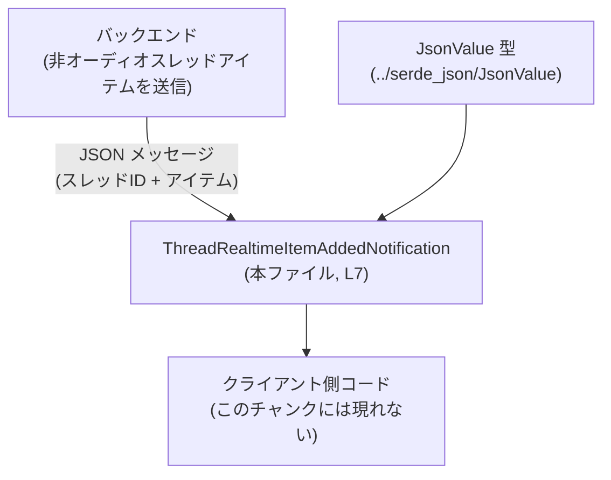
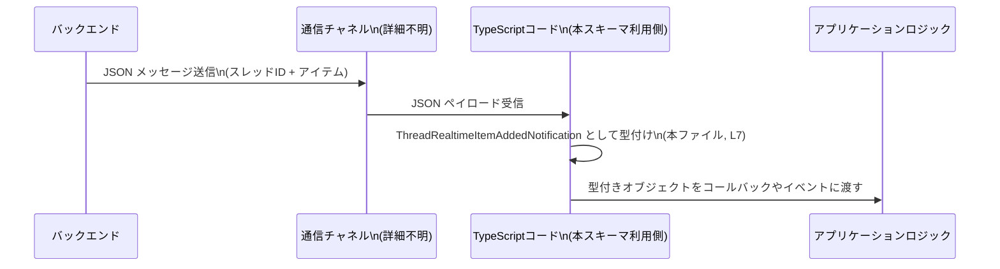

# app-server-protocol/schema/typescript/v2/ThreadRealtimeItemAddedNotification.ts

## 0. ざっくり一言

バックエンドが送信する「スレッドのリアルタイム非オーディオアイテム追加通知」を表現する、TypeScript のデータ型エイリアスを定義するファイルです（自動生成コード）です。

---

## 1. このモジュールの役割

### 1.1 概要

- このモジュールは、**バックエンドからリアルタイムに送られるスレッド関連イベント**のうち、「非オーディオのアイテムが追加された」という通知を型安全に扱うための型を提供します。
- コメントに「EXPERIMENTAL - raw non-audio thread realtime item emitted by the backend.」とあるため（`ThreadRealtimeItemAddedNotification.ts:L4-6`）、**実験的な生データ**であり、`item` フィールドは汎用的な JSON 値として扱われます。

### 1.2 アーキテクチャ内での位置づけ

- この型は**プロトコル層のスキーマ定義**の一部であり、バックエンドからの通知メッセージを TypeScript で表現するために使われます。
- `item` フィールドは `JsonValue` 型を利用しているため、JSON シリアライズされた任意のデータ構造を表せる設計になっています（`ThreadRealtimeItemAddedNotification.ts:L3,7`）。



※ 実際の通信経路（WebSocket, HTTP など）は、このチャンクには現れません。

### 1.3 設計上のポイント

- **自動生成コード**
  - ファイル先頭に「GENERATED CODE! DO NOT MODIFY BY HAND!」と明記されており（`ThreadRealtimeItemAddedNotification.ts:L1-2`）、[ts-rs](https://github.com/Aleph-Alpha/ts-rs) によって生成されていることが示されています（`ThreadRealtimeItemAddedNotification.ts:L2`）。
- **データのみ定義（状態・ロジックなし）**
  - 関数やクラスは存在せず、**純粋なデータ型エイリアス**のみを提供します（`ThreadRealtimeItemAddedNotification.ts:L7`）。
- **柔軟なペイロード**
  - `item` が `JsonValue` 型で定義されているため（`ThreadRealtimeItemAddedNotification.ts:L3,7`）、ペイロードの構造は固定されておらず、呼び出し側が必要に応じてバリデーションやパースを行う前提の設計と解釈できます。
- **言語固有の安全性**
  - TypeScript の型エイリアスにより、少なくとも `threadId` が `string` であること、`item` が JSON として表現可能な値であることがコンパイル時に保証されます。

---

## 2. 主要な機能一覧

このモジュールの「機能」は、すべて型定義に集約されています。

- `ThreadRealtimeItemAddedNotification` 型: バックエンドが送信する「スレッドに非オーディオアイテムが追加された」通知メッセージの構造を表す

---

## 3. 公開 API と詳細解説

### 3.1 型一覧（構造体・列挙体など）

| 名前 | 種別 | 役割 / 用途 | 定義 / 参照箇所 |
|------|------|-------------|------------------|
| `ThreadRealtimeItemAddedNotification` | 型エイリアス（オブジェクト型） | スレッドIDと、それに紐づく「非オーディオのリアルタイムアイテム」を表す通知メッセージを表現する | `ThreadRealtimeItemAddedNotification.ts:L7` |
| `JsonValue` | 型エイリアス or 型 | 一般的な JSON 値を表現する型。`item` フィールドの型として利用される | `ThreadRealtimeItemAddedNotification.ts:L3`（インポートのみ。定義はこのチャンクには現れません） |

#### `ThreadRealtimeItemAddedNotification`

```ts
export type ThreadRealtimeItemAddedNotification = {
    threadId: string;
    item: JsonValue;
};
```

**概要**

- バックエンドからの通知メッセージを TypeScript で表現する型です。
- 必須フィールドとして:
  - `threadId`: 対象スレッドを一意に識別する文字列
  - `item`: 追加されたアイテムの中身を表す JSON 値 (`JsonValue`)
  を持ちます（`ThreadRealtimeItemAddedNotification.ts:L7`）。

**フィールド**

| フィールド名 | 型 | 説明 |
|-------------|----|------|
| `threadId` | `string` | 対象スレッドの識別子。具体的な形式（UUID など）はこのチャンクには現れませんが、文字列であることは保証されます。 |
| `item` | `JsonValue` | スレッドに追加されたアイテムの中身を表す JSON 値。構造は固定されておらず、呼び出し側で解釈・検証が必要です。 |

**Errors / Panics**

- これは静的な型定義であり、**実行時のエラーやパニックを直接発生させる処理は含まれていません**。
- ただし、`item` が `JsonValue` であるため、呼び出し側が特定の構造を仮定してプロパティアクセスを行うと、**実行時に `undefined` アクセスなどのエラーにつながる可能性**があります（例: `notification.item.foo` と決め打ちでアクセスするなど）。

**Edge cases（エッジケース）**

この型自体は単純ですが、利用時の典型的なエッジケースとしては次が挙げられます。

- **`threadId` が空文字列**:
  - 型レベルでは許容されます（`string` である限りコンパイルは通る）が、アプリケーション上は無効な ID の可能性があります。
- **`item` が予期しない構造の JSON**:
  - `JsonValue` は JSON 全般を表せるため、想定していない構造（例: 文字列だけ、配列だけなど）が入ることがあります。
  - その場合、呼び出し側の処理ロジックが前提としている形との不整合から、実行時エラーやロジックバグにつながりやすくなります。

**使用上の注意点**

- `item` は汎用 JSON であるため、**利用前に必ず型ガードやスキーマバリデーションを行うことが望ましい**です。
- `threadId` の値の形式や制約（長さ、使用可能文字など）はこのチャンクには現れないため、上位レイヤーの仕様・ドキュメントを参照する必要があります。
- ファイル冒頭にある通り、**このファイルを直接編集してはいけません**（`ThreadRealtimeItemAddedNotification.ts:L1-2`）。

### 3.2 関数詳細

- このファイルには、関数・メソッドは定義されていません。
- したがって、関数のエラー条件・並行性・パフォーマンスなど、ロジックに関する情報はこのチャンクには現れません。

### 3.3 その他の関数

- 補助関数やユーティリティ関数も存在しません。

---

## 4. データフロー

この型が使われる典型的な流れを、バックエンドからクライアントまでのデータフローとして整理します（通信方式や上位コンポーネント名は、このチャンクに現れないため抽象的に記述します）。



**要点**

- バックエンドが送信する JSON 形式のメッセージは、クライアント側でパースされ、`ThreadRealtimeItemAddedNotification` 型として扱われます。
- 型定義は**コンパイル時の型安全性**を提供しますが、`item` の中身については **実行時バリデーションが依然として重要**です。
- 通信チャネルやイベント購読の仕組みそのものは、このファイルには含まれていません。

---

## 5. 使い方（How to Use）

### 5.1 基本的な使用方法

`ThreadRealtimeItemAddedNotification` 型を使って、通知ハンドラの引数に型を付ける例です。

```ts
// ThreadRealtimeItemAddedNotification 型をインポートする
import type { ThreadRealtimeItemAddedNotification } from "./schema/typescript/v2/ThreadRealtimeItemAddedNotification"; // パスは例示

// 通知を処理する関数の定義
function handleThreadItemAdded(
    notification: ThreadRealtimeItemAddedNotification, // 型エイリアスを利用して引数を型付け
): void {
    // スレッドIDは string 型として安全に扱える
    console.log("threadId:", notification.threadId); // string メソッドなどが補完される

    // item は JsonValue 型（任意の JSON）なので、そのままでは構造が分からない
    const item = notification.item;

    // 例: アイテムがオブジェクトであり、kind プロパティを持つことを期待するケース
    if (item && typeof item === "object" && "kind" in item) {
        // ここでは item を any にアサートしてプロパティにアクセスしている
        const kind = (item as any).kind as string; // 実運用ではより厳密なチェックが推奨
        console.log("item kind:", kind);
    } else {
        console.warn("予期しない item 形式の通知:", item);
    }
}
```

この例では、`threadId` は強く型付けされているため IDE 補完やリファクタリングに強くなります。一方、`item` の構造は `JsonValue` のままでは分からないため、必要に応じて型ガードやスキーマチェックを行う必要があります。

### 5.2 よくある使用パターン

1. **単純なロギング**

```ts
function logNotification(n: ThreadRealtimeItemAddedNotification): void {
    console.log(`[thread ${n.threadId}] item added:`, n.item); // そのままログに流す
}
```

- デバッグ用途では、`item` を詳細解析せずにそのままログ出力する使い方が適しています。

1. **アプリケーション独自型への変換**

`item` をアプリケーション固有の型に「パース」するパターンです。

```ts
// アプリケーション側で期待している構造の型を定義
type MyThreadItem = {
    kind: "text";
    content: string;
};

// item を MyThreadItem に変換する安全な関数
function parseMyThreadItem(item: JsonValue): MyThreadItem | null {
    // 最低限の構造チェックを行う
    if (
        item &&
        typeof item === "object" &&
        (item as any).kind === "text" &&
        typeof (item as any).content === "string"
    ) {
        return {
            kind: "text",
            content: (item as any).content,
        };
    }
    return null; // 期待した形式でない場合は null を返す
}

function handleNotification(
    n: ThreadRealtimeItemAddedNotification,
): void {
    const parsed = parseMyThreadItem(n.item);
    if (!parsed) {
        console.warn("未知の item 形式を受信:", n.item);
        return;
    }
    // ここから先は MyThreadItem として安全に扱える
    console.log(`[${n.threadId}] text item: ${parsed.content}`);
}
```

- `JsonValue` からアプリケーション固有型への**変換関数を用意**するのが、堅牢な設計につながります。

### 5.3 よくある間違い

**誤った例: 型チェックなしで `item` のプロパティに直接アクセスする**

```ts
function badHandler(n: ThreadRealtimeItemAddedNotification) {
    // NG: item が必ず { kind: string } だと決め打ちしている
    console.log(n.item.kind); // コンパイルは通るが、実行時に undefined.kind エラーになりうる
}
```

**正しい例: 構造を確認してからアクセスする**

```ts
function goodHandler(n: ThreadRealtimeItemAddedNotification) {
    const item = n.item;

    if (item && typeof item === "object" && "kind" in item) {
        console.log((item as any).kind); // 必要最小限のチェックを行ったあとアクセス
    } else {
        console.warn("予期しない item 構造:", item);
    }
}
```

### 5.4 使用上の注意点（まとめ）

- **このファイルは自動生成コードであり、直接編集してはいけません**（`ThreadRealtimeItemAddedNotification.ts:L1-2`）。
- `item` フィールドは `JsonValue` であり、**任意の JSON 構造が入りうる**ため、アプリケーション側で:
  - 構造チェック
  - 型ガード
  - スキーマバリデーション
  を行う前提で設計する必要があります。
- TypeScript の型情報は**コンパイル時のみ有効**であり、実行時には消えるため、`item` の安全な利用にはランタイムチェックが不可欠です。
- この型自体はスレッド安全性や並行性には関与しません。並行処理まわりの安全性は、この型を利用する上位レイヤーの設計に依存します。

---

## 6. 変更の仕方（How to Modify）

### 6.1 新しい機能を追加する場合

- ファイル先頭のコメントに明示されている通り、このファイルは ts-rs による**自動生成コード**です（`ThreadRealtimeItemAddedNotification.ts:L1-2`）。
- そのため、**このファイルに直接新しいフィールドや型を追加することは推奨されません**。代わりに:
  - 元となるスキーマ定義（ts-rs が参照している側。位置や形式はこのチャンクには現れません）に変更を加え、
  - 再度コード生成を実行する
  という手順が必要になります。

### 6.2 既存の機能を変更する場合

- 既存フィールド名 (`threadId`, `item`) や型 (`string`, `JsonValue`) を変更したい場合も、**このファイルを直接編集すべきではありません**。
- 変更時の注意点:
  - `threadId` の名前や型を変えると、**この型を利用しているすべてのクライアントコードに影響**します。
  - `item` の型をより具体的な型に変える場合、バックエンドのシリアライズ形式との整合性が重要になります。
- 実際に変更する際は:
  - 影響範囲を検索（リポジトリ全体で `ThreadRealtimeItemAddedNotification` を参照している箇所）
  - プロトコル仕様書（もしあれば）との整合性確認
  - バックエンドとの互換性（後方互換性）の検討
  が必要です。これらはこのチャンクからは分かりませんが、一般的な注意事項です。

---

## 7. 関連ファイル

このモジュールと直接関係することが、このチャンクから分かるファイルは次の通りです。

| パス | 役割 / 関係 |
|------|------------|
| `app-server-protocol/schema/typescript/serde_json/JsonValue.ts` または同名ファイル | `JsonValue` 型の定義元。`item` フィールドの型として利用される（`ThreadRealtimeItemAddedNotification.ts:L3`）。正確なパスやファイル名はこのチャンクには明示されていませんが、相対インポート `../serde_json/JsonValue` が存在します。 |

※ テストコードや、この型を実際に利用するハンドラ実装などは、このチャンクには現れません。そのため、テスト範囲・カバレッジ、実際の利用箇所については不明です。
