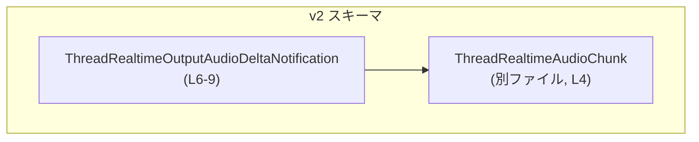
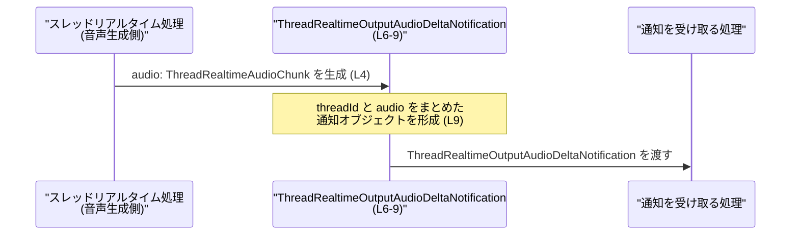

# app-server-protocol/schema/typescript/v2/ThreadRealtimeOutputAudioDeltaNotification.ts コード解説

## 0. ざっくり一言

スレッドのリアルタイム処理からストリーミングされる出力音声の「通知ペイロード」を表現するための、TypeScript 型エイリアス定義です（ThreadRealtimeOutputAudioDeltaNotification.ts:L6-9）。

---

## 1. このモジュールの役割

### 1.1 概要

- このモジュールは、**スレッドのリアルタイム処理から送出される出力音声の差分通知を表すオブジェクトの型**を定義します（ThreadRealtimeOutputAudioDeltaNotification.ts:L6-9）。
- 通知には、どのスレッドからの音声かを識別する `threadId` と、実際の音声データを表す `audio` が含まれます（ThreadRealtimeOutputAudioDeltaNotification.ts:L9-9）。

### 1.2 アーキテクチャ内での位置づけ

- ファイルパスから、この型は **app-server-protocol の TypeScript スキーマ (v2)** の一部として使われるメッセージ定義のひとつと位置付けられます（ファイルパス情報）。
- `audio` プロパティは、同じディレクトリ内の `ThreadRealtimeAudioChunk` 型に依存しています（ThreadRealtimeOutputAudioDeltaNotification.ts:L4-4, L9-9）。
- 実行ロジックは一切含まず、**クライアント／サーバー間のデータ構造を共有するための純粋な型定義**になっています（ThreadRealtimeOutputAudioDeltaNotification.ts:L4-9）。

依存関係のイメージは次のようになります。



### 1.3 設計上のポイント

- **自動生成コードであることが明示**されています  
  コメントで「GENERATED CODE」「ts-rs による生成」と記載され、手動編集禁止であることが分かります（ThreadRealtimeOutputAudioDeltaNotification.ts:L1-3）。
- **ドキュメンテーションコメントによる用途の明示**  
  「EXPERIMENTAL - streamed output audio emitted by thread realtime.」という説明が付いており、この型がスレッドリアルタイムからのストリーミング出力音声に関する実験的機能に属することが示されています（ThreadRealtimeOutputAudioDeltaNotification.ts:L6-8）。
- **純粋な型のみ**  
  `import type` と `export type` のみで構成されており、実行時コードや状態を持ちません（ThreadRealtimeOutputAudioDeltaNotification.ts:L4-4, L9-9）。
- **型レベルの契約**  
  `threadId` は `string`、`audio` は `ThreadRealtimeAudioChunk` で、いずれも必須プロパティとして定義されています（ThreadRealtimeOutputAudioDeltaNotification.ts:L9-9）。

---

## 2. 主要な機能一覧（コンポーネントインベントリー）

このファイルが提供する「機能」は型定義のみですが、プロトコル上の役割として整理します。

- **ThreadRealtimeOutputAudioDeltaNotification 型**:  
  - スレッド単位のリアルタイム出力音声の「差分通知」オブジェクトを表す（ThreadRealtimeOutputAudioDeltaNotification.ts:L6-9）。
  - 必須プロパティ:
    - `threadId: string` — 通知対象スレッドの識別子（ThreadRealtimeOutputAudioDeltaNotification.ts:L9-9）。
    - `audio: ThreadRealtimeAudioChunk` — 音声データのチャンク（ThreadRealtimeOutputAudioDeltaNotification.ts:L4-4, L9-9）。

---

## 3. 公開 API と詳細解説

### 3.1 型一覧（構造体・列挙体など）

| 名前 | 種別 | 役割 / 用途 | 根拠 |
|------|------|-------------|------|
| `ThreadRealtimeOutputAudioDeltaNotification` | 型エイリアス（オブジェクト型） | リアルタイムスレッドからストリーミングされる出力音声の差分通知ペイロードを表す。`threadId` と `audio` を必須プロパティとして持つ。 | 定義と JSDoc（ThreadRealtimeOutputAudioDeltaNotification.ts:L6-9） |
| `ThreadRealtimeAudioChunk` | 型（詳細不明、型専用インポート） | `audio` プロパティの型として利用される音声チャンク表現。具体的な構造は別ファイルに定義されている。 | 型専用インポート（ThreadRealtimeOutputAudioDeltaNotification.ts:L4-4） |

#### `ThreadRealtimeOutputAudioDeltaNotification` のフィールド構造

```ts
export type ThreadRealtimeOutputAudioDeltaNotification = {
    threadId: string;
    audio: ThreadRealtimeAudioChunk;
};
```

（フォーマットを整えたもの。元コードは 1 行で定義）（ThreadRealtimeOutputAudioDeltaNotification.ts:L9-9）

- `threadId: string`  
  - 通知がどのスレッドに紐づくかを示す識別子を表します（ThreadRealtimeOutputAudioDeltaNotification.ts:L9-9）。
  - 型は `string` のみで、空文字列や特定フォーマットの制約は型レベルでは定義されていません（ThreadRealtimeOutputAudioDeltaNotification.ts:L9-9）。
- `audio: ThreadRealtimeAudioChunk`  
  - 通知に含まれる音声データのチャンクです（ThreadRealtimeOutputAudioDeltaNotification.ts:L4-4, L9-9）。
  - 構造やエンコーディング方式などは、このファイルからは分かりません（ThreadRealtimeOutputAudioDeltaNotification.ts:L4-4）。

### 3.2 関数詳細（最大 7 件）

このファイルには **関数・メソッドは一切定義されていません**（ThreadRealtimeOutputAudioDeltaNotification.ts:L1-9）。  
したがって、このセクションで詳細テンプレートを適用できる対象はありません。

### 3.3 その他の関数

- なし（関数・メソッド定義が存在しません）（ThreadRealtimeOutputAudioDeltaNotification.ts:L1-9）。

---

## 4. データフロー

このファイル単体にはロジックはありませんが、型の役割から想定されるデータフローを抽象的に整理します。

1. 何らかの「スレッドリアルタイム処理」コンポーネントが、音声出力の一部（チャンク）を生成する（`ThreadRealtimeAudioChunk` 型）（ThreadRealtimeOutputAudioDeltaNotification.ts:L4-4, L6-8）。
2. そのチャンクと対象スレッドの識別子 `threadId` を組み合わせて、`ThreadRealtimeOutputAudioDeltaNotification` 型のオブジェクトが構築される（ThreadRealtimeOutputAudioDeltaNotification.ts:L6-9）。
3. 構築されたオブジェクトは、ネットワーク経由／メッセージキューなどを通じて「通知ハンドラ」に渡されると想定されますが、具体的な送受信経路はこのファイルからは分かりません（このチャンクには現れません）。

この流れをシーケンス図として表現すると次のようになります。



> 注意: 上記は型の意味から導いた抽象的なデータフローであり、具体的なトランスポート層（HTTP, WebSocket など）はこのファイルからは分かりません。

---

## 5. 使い方（How to Use）

### 5.1 基本的な使用方法

`ThreadRealtimeOutputAudioDeltaNotification` は、TypeScript コード上で通知オブジェクトの形を保証するために使います。

```typescript
// 型定義ファイルから Notification 型をインポートする                     // 本ファイルの型を利用する
import type { ThreadRealtimeOutputAudioDeltaNotification } from "./ThreadRealtimeOutputAudioDeltaNotification"; // (L9)
import type { ThreadRealtimeAudioChunk } from "./ThreadRealtimeAudioChunk";                                      // (L4)

// 何らかの方法で ThreadRealtimeAudioChunk を用意する                      // audio チャンクを生成または受信
const audioChunk: ThreadRealtimeAudioChunk = /* ... */;                                                          // 型は別ファイル定義

// 通知オブジェクトを構築する                                               // ThreadRealtimeOutputAudioDeltaNotification 型の値を作る
const notification: ThreadRealtimeOutputAudioDeltaNotification = {
    threadId: "thread-123",                                                                                      // スレッド識別子 (string)
    audio: audioChunk,                                                                                           // 音声チャンク
};

// 通知を処理する関数の例                                                   // この関数は通知の型に依存して処理を書く
function handleOutputAudioDelta(n: ThreadRealtimeOutputAudioDeltaNotification) {
    console.log("thread:", n.threadId);                                                                          // threadId にアクセス
    // playAudioChunk(n.audio);                                                                                  // audio チャンクを再生する処理などを呼び出す（擬似コード）
}
```

ポイント:

- `import type` を使うことで、この型がコンパイル時専用であり、バンドルに実行時コードを追加しないことを明示できます（ThreadRealtimeOutputAudioDeltaNotification.ts:L4-4, L9-9）。
- `notification` オブジェクトの構造は `ThreadRealtimeOutputAudioDeltaNotification` によってチェックされ、`threadId` や `audio` を欠かすとコンパイルエラーになります（ThreadRealtimeOutputAudioDeltaNotification.ts:L9-9）。

### 5.2 よくある使用パターン

#### 1. 受信した生データを型付けする

外部から受信した JSON を、この型に合わせてパース・検証するパターンです。

```typescript
import type { ThreadRealtimeOutputAudioDeltaNotification } from "./ThreadRealtimeOutputAudioDeltaNotification";

// 生の JSON データ（例: WebSocket メッセージなど）
const raw = JSON.parse(message) as unknown;

// ランタイムチェックを行い、型を絞り込む関数（例）                      // 実際には適切なバリデーションロジックが必要
function isThreadRealtimeOutputAudioDeltaNotification(
    value: unknown
): value is ThreadRealtimeOutputAudioDeltaNotification {
    if (
        typeof value === "object" &&
        value !== null &&
        "threadId" in value &&
        "audio" in value &&
        typeof (value as any).threadId === "string"
    ) {
        // audio の詳細検証は ThreadRealtimeAudioChunk の仕様に依存
        return true;
    }
    return false;
}

if (isThreadRealtimeOutputAudioDeltaNotification(raw)) {
    // ここでは raw は ThreadRealtimeOutputAudioDeltaNotification として扱える
    console.log(raw.threadId);
}
```

このように、**型エイリアス＋型ガード**を組み合わせることで、コンパイル時と実行時の両方で安全性を高めることができます。

### 5.3 よくある間違い

#### 1. 必須プロパティを省略する

```typescript
import type { ThreadRealtimeOutputAudioDeltaNotification } from "./ThreadRealtimeOutputAudioDeltaNotification";

const badNotification: ThreadRealtimeOutputAudioDeltaNotification = {
    // threadId: "thread-123",                          // ✗ 省略するとコンパイルエラー
    audio: {} as any,                                  // 仮の値
};
```

- `threadId` と `audio` はどちらも必須プロパティであり、省略すると TypeScript の型チェックでエラーになります（ThreadRealtimeOutputAudioDeltaNotification.ts:L9-9）。

#### 2. `threadId` の型を誤る

```typescript
const badNotification: ThreadRealtimeOutputAudioDeltaNotification = {
    threadId: 123,                                     // ✗ number は string に代入できない（コンパイルエラー）
    audio: {} as any,
};
```

- `threadId` は `string` 型で定義されているため、数値などを代入するとコンパイルエラーになります（ThreadRealtimeOutputAudioDeltaNotification.ts:L9-9）。

### 5.4 使用上の注意点（まとめ）

- **手動編集禁止**  
  コメントに明示されているように、「GENERATED CODE」「Do not edit this file manually」とあるため、このファイル自体を直接編集すると、再生成時に上書きされる可能性が高いです（ThreadRealtimeOutputAudioDeltaNotification.ts:L1-3）。
- **実験的機能であること**  
  ドキュメンテーションコメントに `EXPERIMENTAL` と書かれているため、この型の仕様が将来変更される可能性があります（ThreadRealtimeOutputAudioDeltaNotification.ts:L6-8）。安定 API 前提のコードでは、この点に留意する必要があります。
- **ランタイム検証は別途必要**  
  この型はコンパイル時の型チェックのみを提供し、ランタイムで値が妥当かどうかは別途検証する必要があります（ThreadRealtimeOutputAudioDeltaNotification.ts:L9-9）。
- **エラー・セキュリティ・並行性**  
  このファイルは型定義のみであり、実行ロジックや I/O を持たないため、このファイル内から直接的なバグ・セキュリティ問題・並行性問題を特定することはできません（ThreadRealtimeOutputAudioDeltaNotification.ts:L1-9）。それらは、この型を使う周辺コードの責務になります。

---

## 6. 変更の仕方（How to Modify）

### 6.1 新しい機能を追加する場合

このファイルは ts-rs によって生成されているため、**直接の編集は推奨されません**（ThreadRealtimeOutputAudioDeltaNotification.ts:L1-3）。

一般的な運用としては次のような流れになります（ts-rs の性質に基づく一般的な前提）:

1. **元となる Rust 側の型定義を探す**  
   - コメントに `ts-rs` が記載されており（ThreadRealtimeOutputAudioDeltaNotification.ts:L3-3）、ts-rs は Rust 型から TypeScript 型を生成するツールとして知られています。
2. **Rust 側の型にフィールドを追加・変更する**  
   - 例: Rust の構造体に新しいフィールドを追加するなど。
3. **ts-rs によるコード生成を再実行する**  
   - これにより、本 TypeScript ファイルも自動的に更新されます。

このファイルを直接編集すると、**再生成時に変更が失われる**危険があるため注意が必要です（ThreadRealtimeOutputAudioDeltaNotification.ts:L1-3）。

### 6.2 既存の機能を変更する場合

`threadId` や `audio` を変更する際に考慮すべき点:

- **`threadId` の型変更（例: string → number）**  
  - この型に依存するすべてのコードでコンパイルエラーが発生する可能性があります（ThreadRealtimeOutputAudioDeltaNotification.ts:L9-9）。
  - プロトコル上の互換性にも影響するため、慎重な検討が必要です。
- **`audio` の型変更**  
  - `ThreadRealtimeAudioChunk` 側の定義を変更すると、この型に依存するシリアライザ／デシリアライザや再生処理に影響します（ThreadRealtimeOutputAudioDeltaNotification.ts:L4-4, L9-9）。
- **影響範囲の確認**  
  - この型を利用している箇所（ハンドラ、テスト、クライアントコードなど）を全て検索し、前提条件（`threadId` の意味、`audio` の形式など）が崩れないか確認することが重要です。

---

## 7. 関連ファイル

| パス | 役割 / 関係 | 根拠 |
|------|------------|------|
| `app-server-protocol/schema/typescript/v2/ThreadRealtimeAudioChunk.ts` など | `ThreadRealtimeAudioChunk` 型の定義元。`audio` プロパティで利用される音声チャンクの構造を定義していると考えられます。 | 相対パス `"./ThreadRealtimeAudioChunk"` の型専用インポート（ThreadRealtimeOutputAudioDeltaNotification.ts:L4-4） |
| Rust 側の ts-rs 対象型（ファイル名不明） | この TypeScript 型の元となる Rust 型定義。変更時はここを編集して ts-rs により再生成する運用が想定されます。 | `ts-rs` による自動生成であることを示すコメント（ThreadRealtimeOutputAudioDeltaNotification.ts:L1-3） |

> 注: 具体的な Rust ファイル名・パス、`ThreadRealtimeAudioChunk` の詳細構造は、このチャンクの情報からは分かりません（このチャンクには現れません）。
