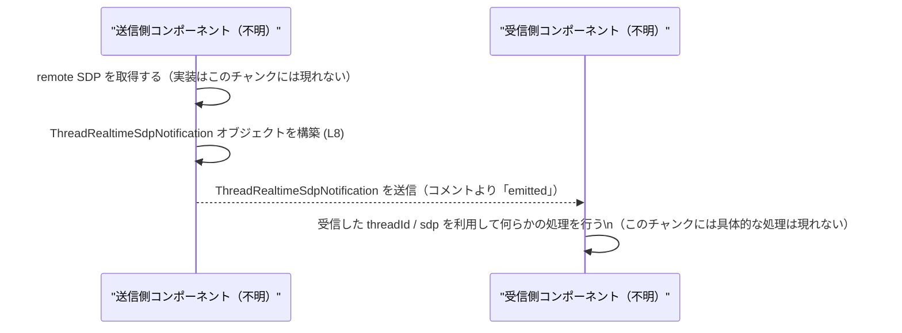

# app-server-protocol/schema/typescript/v2/ThreadRealtimeSdpNotification.ts コード解説

## 0. ざっくり一言

WebRTC リアルタイムセッションで「リモート SDP」を通知するためのペイロードを表す、TypeScript のオブジェクト型エイリアスです（コメントおよび型定義より判断, `ThreadRealtimeSdpNotification.ts:L5-8`）。

---

## 1. このモジュールの役割

### 1.1 概要

- このモジュールは、WebRTC リアルタイムセッションにおける **リモート SDP に関する通知** を表現するためのデータ構造を定義します（`ThreadRealtimeSdpNotification.ts:L5-7`）。
- `ThreadRealtimeSdpNotification` 型は、`threadId` と `sdp` という 2 つの文字列フィールドからなるオブジェクト型です（`ThreadRealtimeSdpNotification.ts:L8-8`）。
- モジュール内にはロジック（関数・メソッド）は存在せず、純粋なスキーマ定義のみが含まれます（`ThreadRealtimeSdpNotification.ts:L1-8`）。

### 1.2 アーキテクチャ内での位置づけ

- ファイルパス `app-server-protocol/schema/typescript/v2` から、この型は **アプリケーションサーバーのプロトコルスキーマ（v2）を TypeScript で表現したものの一部** と解釈できます（パス名に基づく解釈）。
- 先頭コメントより、このファイルは Rust 側の型から [`ts-rs`](https://github.com/Aleph-Alpha/ts-rs) によって自動生成されたことが分かります（`ThreadRealtimeSdpNotification.ts:L1-3`）。
  - したがって、**真のソース・オブ・トゥルース（元定義）は Rust 側の型** にあり、この TypeScript ファイルはその射影・ミラーです。

この位置づけを簡単な依存関係図で表すと、次のようになります。

```mermaid
graph TD
    %% コード範囲: ThreadRealtimeSdpNotification (L1-8)
    RustModel["Rust側モデル（ts-rs生成元, 実体はこのチャンクには現れない）"]
    Generator["ts-rs コードジェネレータ<br/>(コメントより)"]
    TSNotification["ThreadRealtimeSdpNotification 型 (L8)"]
    WebRTCSession["WebRTC リアルタイムセッションの利用側<br/>(コメントから推測, 実体は不明)"]

    RustModel -->|型定義| Generator
    Generator -->|自動生成 (L1-3)| TSNotification
    WebRTCSession -->|通知ペイロードとして利用 (L5-7 より推測)| TSNotification
```

- RustModel → Generator → TS 型という関係は、`ts-rs` による生成コメント（`ThreadRealtimeSdpNotification.ts:L1-3`）に基づくものです。
- `WebRTCSession` ノードは「remote SDP for a WebRTC realtime session」というコメント（`ThreadRealtimeSdpNotification.ts:L6-6`）からの推測であり、具体的なクラス・モジュール名はこのチャンクには現れません。

### 1.3 設計上のポイント

- **自動生成コード**  
  - 「GENERATED CODE」「Do not edit this file manually」と明示されており、手動編集が禁止されていることが分かります（`ThreadRealtimeSdpNotification.ts:L1-3`）。
- **純データ構造のみ**  
  - 型エイリアス 1 つのみをエクスポートし、状態や振る舞い（メソッド・関数）を持ちません（`ThreadRealtimeSdpNotification.ts:L8-8`）。
- **シンプルな必須フィールド**  
  - `threadId: string` と `sdp: string` が必須プロパティとして定義されており、オプショナル・Union などの複雑な型は使用していません（`ThreadRealtimeSdpNotification.ts:L8-8`）。
- **エラー／並行性の観点**  
  - このファイルには実行時ロジックが一切含まれないため、**エラー処理や並行性制御は、この型を利用する側のコードに委ねられています**（`ThreadRealtimeSdpNotification.ts:L1-8`）。

---

## 2. 主要な機能一覧

このモジュールが提供する「機能」はデータ定義のみです。

- `ThreadRealtimeSdpNotification`: WebRTC リアルタイムセッションに関連する「リモート SDP 通知」のペイロード構造を表す型（`ThreadRealtimeSdpNotification.ts:L5-8`）。

---

## 3. 公開 API と詳細解説

### 3.1 型一覧（構造体・列挙体など）

| 名前                           | 種別                       | 主なフィールド                                      | 役割 / 用途                                                                 | 根拠 |
|--------------------------------|----------------------------|-----------------------------------------------------|-----------------------------------------------------------------------------|------|
| `ThreadRealtimeSdpNotification` | 型エイリアス（オブジェクト型） | `threadId: string`, `sdp: string`                  | WebRTC リアルタイムセッションの「remote SDP」に関する通知ペイロードを表す | コメントと型定義（`ThreadRealtimeSdpNotification.ts:L5-8`） |

※ このモジュールに他の型定義や関数は存在しません（`ThreadRealtimeSdpNotification.ts:L1-8`）。

---

### 3.2 型詳細：`ThreadRealtimeSdpNotification`

```ts
export type ThreadRealtimeSdpNotification = {
    threadId: string,
    sdp: string,
};
```

（`ThreadRealtimeSdpNotification.ts:L8-8`）

**概要**

- WebRTC リアルタイムセッションにおいて、リモート側の SDP（Session Description Protocol の文字列）と、それに紐づくスレッド ID をまとめた通知オブジェクトの型です（コメントより, `ThreadRealtimeSdpNotification.ts:L5-7`）。

**フィールド**

| フィールド名 | 型      | 説明 |
|--------------|---------|------|
| `threadId`   | `string` | 通知が属するスレッド（会話・セッションなど）の識別子を表す文字列です（`ThreadRealtimeSdpNotification.ts:L8-8`）。具体的な形式はこのチャンクからは分かりません。 |
| `sdp`        | `string` | WebRTC のリモート SDP を表す文字列です（コメントからの解釈, `ThreadRealtimeSdpNotification.ts:L5-8`）。 |

**戻り値 / 生成物**

- 型エイリアスであり、関数のような戻り値の概念はありません。
- この型を使うことで、コンパイル時に「`threadId` と `sdp` が必須の `string` プロパティとして存在する」ことがチェックされます。

**内部処理の流れ（アルゴリズム）**

- この型は **純粋な型定義** であり、内部処理・アルゴリズムは存在しません（`ThreadRealtimeSdpNotification.ts:L8-8`）。
- 実際に通知が送信されるフロー（例: WebSocket, HTTP-SSE など）は、このファイルには一切記述されていません（`ThreadRealtimeSdpNotification.ts:L1-8`）。

**Examples（使用例）**

以下の例は、この型を用いた一般的な利用イメージです。  
送信方法やインポートパスなどの具体的なコンポーネントは、このチャンクには定義されていないため、あくまで参考例です。

```typescript
// ThreadRealtimeSdpNotification 型を利用する例
// （実際のインポートパスはプロジェクト構成に依存する）
import type { ThreadRealtimeSdpNotification } from "./ThreadRealtimeSdpNotification";

// WebRTC のシグナリング処理のどこかで remote SDP を受け取ったと仮定
const remoteSdp: string = getRemoteSdpFromSignalingServer();  // 実際の関数はこのチャンクには存在しない

// 型安全に通知オブジェクトを構築する
const notification: ThreadRealtimeSdpNotification = {
    threadId: "thread-1234",   // スレッド識別子（形式はこのチャンクからは不明）
    sdp: remoteSdp,            // WebRTC の SDP 文字列
};

// ここで notification を WebSocket 送信・イベント発火などに使うことが想定されるが、
// その処理はこのファイルには定義されていない。
```

**Errors / 型安全性**

- TypeScript の観点では、以下の場合に**コンパイル時エラー**となります（型エラー）:
  - `threadId` または `sdp` を省略したオブジェクトを `ThreadRealtimeSdpNotification` 型として扱おうとしたとき（必須プロパティの欠如）。
  - `threadId` または `sdp` に `number` や `null` など `string` 以外の型を割り当てたとき（型不一致）。
- この型自体は **実行時チェックを行わない** ため、
  - `any` や `unknown` からの代入
  - 外部から受け取った JSON の未検証なオブジェクト  
  などをそのまま `ThreadRealtimeSdpNotification` として扱うと、**実行時には不正な形のオブジェクトが紛れ込む可能性**があります（このファイルはそれを防ぐロジックを持ちません）。

**Edge cases（エッジケース）**

この型に関して、コンパイル時と実行時の代表的なエッジケースを整理します。

- **空オブジェクト `{}` を割り当てる**  
  - 型アノテーション付き変数に代入すると、コンパイル時エラーになります（必須プロパティ不足）。
- **`threadId` または `sdp` が `undefined` / `null`**  
  - 型定義上は `string` のみ許容されているため、厳密な型設定の場合はコンパイル時エラーになります。
  - ただし、`any` からの代入やランタイムでの生成などにより、実行時に `undefined` が紛れ込むことは技術的には可能であり、**このファイルだけでは防げません**。
- **未知の追加プロパティ**  
  - TypeScript の構造的型システムでは、基本的には余分なプロパティが存在しても割り当て可能な場合があります（コンパイラオプションによる）。
  - 余分なプロパティの扱いはコンパイラ設定（`exactOptionalPropertyTypes` など）に依存し、このファイルだけからは挙動を断定できません。

**使用上の注意点**

- **自動生成ファイルのため直接編集しない**  
  - 先頭コメントに「DO NOT MODIFY BY HAND」と明記されているため、フィールド追加・名称変更などは Rust 側の元定義を変更し、`ts-rs` による再生成で反映する必要があります（`ThreadRealtimeSdpNotification.ts:L1-3`）。
- **ランタイム検証は別途必要**  
  - 型はコンパイル時の型チェックのみを提供し、実行時バリデーションは行いません。外部入力（JSON 等）からこの型に変換する場合は、別途スキーマバリデーション等が必要になります。
- **並行性について**  
  - この型は単なる不変オブジェクトとして扱われることが想定され、スレッドセーフ・非スレッドセーフといった概念は直接関わりません。並行性に関する安全性は、この型を共有・変更する周辺コードの設計に依存します。
- **Security / Bugs の観点**  
  - SDP 文字列にはネットワークに関する情報（IP アドレス等）が含まれることが多く、誰に対してこの通知を送るかは利用側で慎重に制御する必要があります。このファイルはその制御を行いません。  
  - 型レベルでの典型的なバグは「`any` 多用による型チェックの回避」と「Rust 側定義と TS 側の生成物のバージョン不整合」であり、いずれもこのファイル単体では検出できません。

### 3.3 その他の関数

- このチャンクには関数定義は存在しません（`ThreadRealtimeSdpNotification.ts:L1-8`）。

| 関数名 | 役割（1 行） | 根拠 |
|--------|--------------|------|
| なし   | このファイルには関数・メソッドは定義されていません | `ThreadRealtimeSdpNotification.ts:L1-8` |

---

## 4. データフロー

このファイルには実際の処理フローは書かれていませんが、コメントにある

> `EXPERIMENTAL - emitted with the remote SDP for a WebRTC realtime session.`（`ThreadRealtimeSdpNotification.ts:L6-6`）

から、「remote SDP とともに何らかの形で発火／送信される通知ペイロード」であることが分かります。

その一般的な流れを、あくまで**コメントから読み取れる用途に基づく想定フロー**として表すと次のようになります。



- 実際の送信手段（WebSocket / HTTP / メッセージバス 等）や送信元・送信先の具体的な型・モジュールは、このファイルには定義されていません。
- 上記の図は、あくまで `ThreadRealtimeSdpNotification` が「remote SDP とともに emit される通知」であるというコメント（`ThreadRealtimeSdpNotification.ts:L5-7`）をビジュアル化したものです。

---

## 5. 使い方（How to Use）

### 5.1 基本的な使用方法

この型を用いる典型的なコードフローを示します。  
ここでは「型安全に通知オブジェクトを組み立てる」という点に焦点を当てています。

```typescript
// ThreadRealtimeSdpNotification 型の利用例
import type { ThreadRealtimeSdpNotification } from "./ThreadRealtimeSdpNotification"; // 実際のパスは構成に依存

// 何らかの方法で threadId と remote SDP を入手したと仮定
const threadId: string = "thread-1234";                     // スレッド識別子
const remoteSdp: string = getRemoteSdpSomehow();            // 実装はこのファイルには存在しない

// 型安全に通知オブジェクトを構築
const notification: ThreadRealtimeSdpNotification = {
    threadId,
    sdp: remoteSdp,
};

// 以降、notification をシグナリングチャンネル等に送信する処理は
// このファイルの外側で実装される
```

この例のポイント:

- `threadId` と `sdp` を定義する際に `string` 型を明示することで、型推論と補完が効きます。
- `ThreadRealtimeSdpNotification` 型を介することで、プロパティ名のタイプミスや不足がコンパイル時に検出されます。

### 5.2 よくある使用パターン

1. **外部から受け取った JSON の型付け**

   外部システムから JSON で通知を受け取った場合に、この型をアノテーションとして用いるパターンが考えられます。

   ```typescript
   import type { ThreadRealtimeSdpNotification } from "./ThreadRealtimeSdpNotification";

   // 例えば WebSocket で受信した JSON 文字列
   const rawJson: string = await receiveMessage();          // 実装はこのファイルには存在しない
   const parsed: unknown = JSON.parse(rawJson);

   // ランタイムバリデーションを行ったうえで型アサーション
   if (isThreadRealtimeSdpNotification(parsed)) {           // 自前の型ガード関数（別途実装が必要）
       const notif: ThreadRealtimeSdpNotification = parsed; // 型安全に利用できる
       console.log(notif.threadId, notif.sdp);
   }
   ```

   ※ `isThreadRealtimeSdpNotification` の実装はこのファイルには含まれません。  
   型ガードを用意することで、「実行時の形」と「コンパイル時の型」を揃え、バグやセキュリティ問題を軽減できます。

2. **送信用ペイロードの構築**

   シグナリングサーバーやアプリケーションサーバーからクライアントへ通知を送る際のペイロードとして利用することが想定されます（コメントより, `ThreadRealtimeSdpNotification.ts:L5-7`）。

### 5.3 よくある間違い

以下は、この型を使う際に起こりがちな誤用例と、その修正例です。

```typescript
import type { ThreadRealtimeSdpNotification } from "./ThreadRealtimeSdpNotification";

// 誤り例: 必須フィールドを欠いている
const wrong1: ThreadRealtimeSdpNotification = {
    threadId: "thread-1234",
    // sdp がないためコンパイル時エラー
};

// 誤り例: 型が一致していない
const wrong2: ThreadRealtimeSdpNotification = {
    threadId: 1234,                  // number は string ではないので型エラー
    sdp: "v=0..."                    // こちらは string なので問題なし
};

// 誤り例: any を経由して型チェックを回避してしまう
const payload: any = getPayloadFromSomewhere();
const notif: ThreadRealtimeSdpNotification = payload; // コンパイルは通るが、実行時に不整合の可能性
```

正しい例:

```typescript
// 正しい例: 型ガードやバリデーションを噛ませる
function isThreadRealtimeSdpNotification(
    value: any,                      // 外部入力は unknown/any になりやすい
): value is ThreadRealtimeSdpNotification {
    return (
        value != null &&
        typeof value.threadId === "string" &&
        typeof value.sdp === "string"
    );
}
```

### 5.4 使用上の注意点（まとめ）

- 自動生成ファイルのため、**直接編集しないこと**（`ThreadRealtimeSdpNotification.ts:L1-3`）。
- この型は **コンパイル時の構造保証** のみを提供し、**実行時のバリデーション・サニタイズは行いません**。
- `any` を多用するとこの型のメリット（型安全性）が失われるため、`unknown` + 型ガードによる安全な扱いが推奨されます。
- SDP 文字列にはネットワーク情報などセンシティブな情報が含まれる可能性があり、誰に対してこの通知を送るか・どこにログを出すかなどは利用側で慎重に扱う必要があります（このファイルはその制御を行いません）。

---

## 6. 変更の仕方（How to Modify）

### 6.1 新しい機能を追加する場合

このファイルは `ts-rs` により自動生成されるため、**直接ここにコードを追加することは推奨されません**（`ThreadRealtimeSdpNotification.ts:L1-3`）。

新しいフィールドや関連型を追加したい場合の一般的な手順は以下のとおりです（生成元コードはこのチャンクには現れないため、抽象的な説明になります）。

1. **Rust 側の元定義を変更する**  
   - `ts-rs` のターゲットとなっている Rust の構造体／型に、新しいフィールドや型を追加する。
   - どのファイルかはこのチャンクからは分かりません（不明）。
2. **`ts-rs` による再生成を行う**  
   - プロジェクトに用意されているスクリプト／ビルドステップを用いて TypeScript コードを再生成する（このチャンクには手順は記載されていません）。
3. **生成された TypeScript 側の変更を確認する**  
   - `ThreadRealtimeSdpNotification` に期待どおりのフィールドが現れていることを確認する（`ThreadRealtimeSdpNotification.ts:L8-8` が変更されるはずです）。
4. **利用箇所を更新する**  
   - 新しいフィールドの読み書きに対応するよう、型の利用箇所を更新する。利用箇所はこのチャンクには現れません。

### 6.2 既存の機能を変更する場合

- **フィールド名・型を変更する場合の注意点**
  - `threadId` / `sdp` の名前や型を変更すると、これを前提にしている全ての送受信コードに影響します。
  - 特に「ネットワーク越しのプロトコル」として利用されている場合、**クライアント／サーバの両側を同期して更新**する必要があります。
- **影響範囲の確認**
  - プロジェクト全体で `ThreadRealtimeSdpNotification` を検索し、すべての利用箇所に対して変更内容が妥当か確認するのが一般的です。  
    このチャンクには具体的な利用箇所が現れていないため、どこで使われているかは不明です。
- **テストの観点**
  - プロトコル変更に伴い、E2E テストやシグナリング関連のテストがある場合は更新・追加が必要です。  
    このファイル内にはテストコードは存在しません（`ThreadRealtimeSdpNotification.ts:L1-8`）。

---

## 7. 関連ファイル

このチャンクには、他ファイルへの `import` / `export` などの記述がないため、直接の依存関係は読み取れません（`ThreadRealtimeSdpNotification.ts:L1-8`）。

現時点でこのファイルから確実に言える範囲は以下のとおりです。

| パス / 種別 | 役割 / 関係 | 根拠 |
|------------|------------|------|
| Rust 側の元定義（具体的なパスは不明） | `ts-rs` による生成元。ここを変更することでこの TypeScript 型が変わる。 | 生成コメント（`ThreadRealtimeSdpNotification.ts:L1-3`） |
| `app-server-protocol/schema/typescript/v2` ディレクトリ内の他ファイル（具体名は不明） | 同じプロトコルバージョンの他のスキーマ型が配置されている可能性が高いが、このチャンクからファイル名は特定できない。 | ディレクトリ名・パス構造 |
| テストコード（不明） | この型を利用したシグナリング／SDP 通知処理のテストが存在する可能性があるが、このチャンクには現れない。 | 不明（推測の域を出ず、コードからは分からない） |

---

以上が、`app-server-protocol/schema/typescript/v2/ThreadRealtimeSdpNotification.ts` に関して、このチャンクから読み取れる公開 API・データ構造・データフロー・安全性／エッジケースの整理です。
