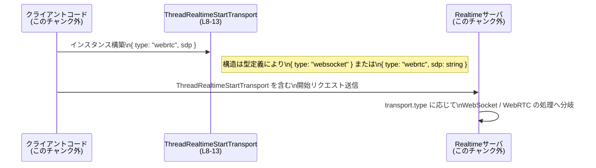

# app-server-protocol/schema/typescript/v2/ThreadRealtimeStartTransport.ts

## 0. ざっくり一言

`ThreadRealtimeStartTransport` は、スレッドの「リアルタイム」機能で使用されるトランスポート方式を、`"websocket"` または `"webrtc"` のどちらかとして表現する TypeScript の型エイリアスです（`ThreadRealtimeStartTransport.ts:L5-7, L8-13`）。

---

## 1. このモジュールの役割

### 1.1 概要

- このモジュールは、**thread realtime 機能で利用される通信トランスポートを型として表現する**ために存在します（コメントより、`EXPERIMENTAL - transport used by thread realtime.` と記載されています、`ThreadRealtimeStartTransport.ts:L5-7`）。
- トランスポートには現在 2 種類があり、
  - `type: "websocket"` の WebSocket 方式
  - `type: "webrtc"` と `sdp: string` を持つ WebRTC 方式  
  のどちらかを選べるようになっています（`ThreadRealtimeStartTransport.ts:L8-13`）。
- 型レベルでは **判別可能共用体（discriminated union）** を用いることで、`type` フィールドの値に応じて安全に分岐できる構造になっています（`ThreadRealtimeStartTransport.ts:L8-13`）。

### 1.2 アーキテクチャ内での位置づけ

このチャンクには、この型がどのリクエストやどのモジュールから参照されているかは記載されていません（利用元は不明です）。ただし、コメントと型名から、

- 「thread realtime 機能の開始処理のどこかで」
- 「どのトランスポートを使うかの指定として」

使われることが想定されます（根拠: `EXPERIMENTAL - transport used by thread realtime.`, `ThreadRealtimeStartTransport.ts:L5-7` および型名 `ThreadRealtimeStartTransport` `ThreadRealtimeStartTransport.ts:L8`）。

この想定上の位置づけをイメージするための依存関係図を示します（`ThreadRealtimeStartTransport` 以外のノードはこのチャンク外の概念です）。


> 注: `Client` や `thread realtime` 実装自体はこのファイルには存在せず、コメントと型名から推測される役割です。

### 1.3 設計上のポイント

- **自動生成コードであること**  
  冒頭に「GENERATED CODE」「Do not edit this file manually」と明記されており、このファイルは `ts-rs` によって Rust 側の型から生成されていることが分かります（`ThreadRealtimeStartTransport.ts:L1-3`）。
- **判別可能共用体によるモデル化**  
  - `export type ThreadRealtimeStartTransport = { "type": "websocket" } | { "type": "webrtc", sdp: string }` という定義で、`type` フィールドの文字列リテラルにより 2 バリアントを区別する設計になっています（`ThreadRealtimeStartTransport.ts:L8-13`）。
- **WebRTC SDP の意味づけがコメントで明示**  
  - `sdp` は「音声と realtime events data channel を設定した WebRTC RTCPeerConnection が生成した SDP offer」であると説明されており（`ThreadRealtimeStartTransport.ts:L9-12`）、**型は `string` でもドメイン上の意味は厳密に定義**されています。
- **状態やロジックは持たない、純粋なデータ型**  
  - 関数やクラスは定義されておらず、トランスポート指定を表す**不変のデータ構造**だけを提供するモジュールです（`ThreadRealtimeStartTransport.ts:L8-13`）。

---

## 2. 主要な機能一覧

このファイルが提供する機能は、主に 1 つの型定義に集約されています。

- `ThreadRealtimeStartTransport`:  
  thread realtime 機能で利用されるトランスポート方式を、`"websocket"` または `"webrtc"`（+ `sdp`）として表す判別可能共用体（`ThreadRealtimeStartTransport.ts:L5-7, L8-13`）。

---

## 3. 公開 API と詳細解説

### 3.1 型一覧（構造体・列挙体など）

このファイルに定義されている公開型は 1 つです。

| 名前 | 種別 | 役割 / 用途 | 定義位置 (行) |
|------|------|-------------|----------------|
| `ThreadRealtimeStartTransport` | 型エイリアス（判別可能共用体） | thread realtime 機能で使用されるトランスポート方式（WebSocket/WebRTC）と、WebRTC の場合の SDP 情報を表現する | `ThreadRealtimeStartTransport.ts:L5-7, L8-13` |

#### `ThreadRealtimeStartTransport` の詳細

**概要**

- `ThreadRealtimeStartTransport` は、2 つのオブジェクト型の **共用体（union）** です（`ThreadRealtimeStartTransport.ts:L8-13`）。
  - WebSocket 版: `{ "type": "websocket" }`
  - WebRTC 版: `{ "type": "webrtc", sdp: string }`
- `type` フィールドに文字列リテラル型を使っているため、TypeScript 上では **判別可能共用体** として利用できます。

**バリアント**

| バリアント名（便宜的） | 具体的な型 | 説明 | 根拠 |
|------------------------|------------|------|------|
| WebSocket バリアント | `{ "type": "websocket" }` | WebSocket をトランスポートとして使用する指定を表す。追加プロパティはありません。 | `ThreadRealtimeStartTransport.ts:L8` |
| WebRTC バリアント | `{ "type": "webrtc", sdp: string }` | WebRTC をトランスポートとして使用する指定を表し、その際の SDP offer を `sdp` に格納します。 | `ThreadRealtimeStartTransport.ts:L8-13` |

**フィールド**

| フィールド名 | 型 | 所属バリアント | 説明 | 根拠 |
|--------------|----|----------------|------|------|
| `type` | `"websocket"` | WebSocket | トランスポート種別を `"websocket"` として表す判別用フィールドです。 | `ThreadRealtimeStartTransport.ts:L8` |
| `type` | `"webrtc"` | WebRTC | トランスポート種別を `"webrtc"` として表す判別用フィールドです。 | `ThreadRealtimeStartTransport.ts:L8` |
| `sdp` | `string` | WebRTC | WebRTC RTCPeerConnection が、音声と realtime events data channel を設定した後に生成する SDP offer 文字列です。 | `ThreadRealtimeStartTransport.ts:L9-12, L13` |

**TypeScript の型安全性の観点**

- `type` が `"websocket"` と `"webrtc"` の文字列リテラルのユニオンになっているため、
  - `switch (transport.type)` で `"websocket"` と `"webrtc"` の 2 ケースを丁寧に書けば、`default` 分岐が不要なほど **網羅性チェック** が効きます。
  - `"webrtc"` ケース内では `transport.sdp` が必ず存在するとして扱うことができ、**型安全にアクセス**できます。  
    （これらは TypeScript の判別可能共用体の一般的な挙動であり、定義がそれに適した形であることが根拠です `ThreadRealtimeStartTransport.ts:L8-13`。）

**Examples（使用例）**

以下は、この型を引数に取る関数を仮に定義して利用する例です（この関数自体はこのファイルには存在しません）。

```typescript
// ThreadRealtimeStartTransport をインポートする例
// 実際のパスはプロジェクト構成によって異なります。
import type { ThreadRealtimeStartTransport } from "./ThreadRealtimeStartTransport";

// thread realtime を開始するための仮の関数
function startThreadRealtime(transport: ThreadRealtimeStartTransport) {
    switch (transport.type) {
        case "websocket": {
            // WebSocket で接続する処理を行う
            // transport には type 以外のフィールドはありません
            break;
        }
        case "webrtc": {
            // WebRTC 接続の初期化に SDP offer を使う
            const sdpOffer = transport.sdp;  // string として安全にアクセス可能
            // sdpOffer を RTCPeerConnection などに渡す処理を行う
            break;
        }
        // TypeScript の判別可能共用体のため、ここに default は不要
    }
}

// WebSocket で開始する例
const wsTransport: ThreadRealtimeStartTransport = {
    type: "websocket",
};

// WebRTC で開始する例
const webrtcTransport: ThreadRealtimeStartTransport = {
    type: "webrtc",
    sdp: "v=0\r\n...", // 実際には RTCPeerConnection から得た SDP 文字列を入れる
};

startThreadRealtime(wsTransport);
startThreadRealtime(webrtcTransport);
```

**Edge cases（エッジケース）**

この型そのものについて想定されるエッジケースは、主に **「型情報が失われる状況」** と **`sdp` の内容**に関するものです。

- **`any` / `unknown` からの代入**  
  - JSON を `any` としてパースし、そのまま `ThreadRealtimeStartTransport` に代入すると、型チェックをすり抜けて不正な形のデータが混入する可能性があります。  
    例: `{ type: "webrtc" }` に `sdp` が欠けていてもコンパイルは通ってしまう場合があります（型アサーションを乱用した場合など）。
- **`type` の誤った文字列**  
  - 型注釈のない生のオブジェクトや外部入力に対しては、`{ type: "webSocket" }` のような誤字が紛れ込む可能性があります。  
    TypeScript 型は `"websocket"` / `"webrtc"` のみを許容するよう定義されていますが（`ThreadRealtimeStartTransport.ts:L8`）、実行時に不正な値が入りうる点には注意が必要です。
- **`sdp` の内容は型レベルでは検証されない**  
  - `sdp` は単なる `string` 型であり（`ThreadRealtimeStartTransport.ts:L13`）、その中身が本当に SDP offer 文字列かどうかは **型では保証されません**。  
    実装側で SDP パーサや WebRTC API への投入時に適切な検証が必要です。

**使用上の注意点**

- **このファイルを直接編集しないこと**  
  - 冒頭コメントに「GENERATED CODE」「Do not edit this file manually」とある通り（`ThreadRealtimeStartTransport.ts:L1-3`）、このファイルは自動生成物です。  
    仕様変更が必要な場合は、Rust 側の元となる型定義や `ts-rs` の設定を変更し、再生成する必要があります（元定義の場所はこのチャンクからは分かりません）。
- **ランタイムバリデーションの必要性**  
  - TypeScript の型はコンパイル時のみ効力を持つため、外部から受け取った JSON などに対しては、`type` および `sdp` の存在・形式を実行時にも検証する必要があります。
- **セキュリティ上の注意 (SDP)**  
  - `sdp` 文字列には、一般的にネットワーク候補・IP アドレスなどの情報が含まれることが多いため、ログ出力や外部送信時には情報漏えいの観点から注意が必要です。  
    型自体はこれを制限しない `string` であるため（`ThreadRealtimeStartTransport.ts:L13`）、利用側での扱いが重要になります。
- **並行性について**  
  - この型は純粋なデータ構造であり、内部状態や共有可変状態を持たないため、型そのものには並行性に関する制約や問題はありません。  
    実際の WebSocket / WebRTC 通信の並行制御は、この型を利用する別モジュール側の責務です（このチャンクには記載されていません）。

### 3.2 関数詳細（最大 7 件）

このファイルには、関数・メソッドは定義されていません（`ThreadRealtimeStartTransport.ts:L1-13` 全体を確認しても `function` / `=>` などの定義は存在しません）。

### 3.3 その他の関数

- 該当なし（このファイルには補助関数・ラッパー関数も定義されていません）。

---

## 4. データフロー

このファイル単体では実際の処理フローは定義されていませんが、型の性質とコメントから、**典型的な利用シナリオ**は次のように整理できます。

1. クライアントコードが、WebSocket か WebRTC のどちらかのトランスポートを選択する。
2. 選択結果を `ThreadRealtimeStartTransport` として構築する（`ThreadRealtimeStartTransport.ts:L8-13`）。
3. その値を含む「thread realtime 開始リクエスト」をサーバに送信する（リクエスト型はこのチャンクには現れません）。
4. サーバ側では `type` を見て、WebSocket / WebRTC のどちらのハンドラを使うか分岐する。

この想定上のデータフローをシーケンス図として示します（`ThreadRealtimeStartTransport` 以外はこのチャンク外の概念です）。



> 注: サーバ側の実際の処理内容やリクエスト型はこのファイルには含まれていないため、上記は型から推測される一般的な利用イメージです。

---

## 5. 使い方（How to Use）

### 5.1 基本的な使用方法

`ThreadRealtimeStartTransport` を使用して、トランスポート指定を引数に取る関数を定義し、パターンマッチングで処理を分ける基本例です。

```typescript
import type { ThreadRealtimeStartTransport } from "./ThreadRealtimeStartTransport"; // 例: 同ディレクトリからの相対パス

// thread realtime を開始する処理を仮定した関数
function startThreadRealtime(transport: ThreadRealtimeStartTransport) {
    if (transport.type === "websocket") {
        // WebSocket での接続開始処理
        // transport には type 以外のフィールドは存在しない
    } else {
        // ここに入るのは type === "webrtc" の場合のみ
        // TypeScript の判別により、transport.sdp に安全にアクセスできる
        const sdpOffer: string = transport.sdp;
        // WebRTC での接続開始処理に sdpOffer を使用
    }
}

// 実際の呼び出し例
const transportWs: ThreadRealtimeStartTransport = { type: "websocket" };
const transportWebrtc: ThreadRealtimeStartTransport = {
    type: "webrtc",
    sdp: "v=0\r\n...", // RTCPeerConnection が生成した SDP offer を想定
};

startThreadRealtime(transportWs);
startThreadRealtime(transportWebrtc);
```

### 5.2 よくある使用パターン

1. **`switch` 文による網羅的分岐**

```typescript
function handleTransport(transport: ThreadRealtimeStartTransport) {
    switch (transport.type) {
        case "websocket":
            // WebSocket 用の処理
            break;
        case "webrtc":
            // WebRTC 用の処理
            console.log("SDP:", transport.sdp);
            break;
        // 他の値は型上存在しないので default は不要
    }
}
```

- `ThreadRealtimeStartTransport` が `"websocket"` / `"webrtc"` のみを許容するため、`switch` のケースが網羅的であることをコンパイラがチェックできます（`ThreadRealtimeStartTransport.ts:L8-13`）。

1. **外部からの JSON を安全にこの型に変換する**

```typescript
import type { ThreadRealtimeStartTransport } from "./ThreadRealtimeStartTransport";

function isThreadRealtimeStartTransport(
    v: unknown
): v is ThreadRealtimeStartTransport {
    if (typeof v !== "object" || v === null) return false;

    const maybe = v as { type?: unknown; sdp?: unknown };

    if (maybe.type === "websocket") {
        // sdp が存在しないことを許容
        return true;
    }

    if (maybe.type === "webrtc" && typeof maybe.sdp === "string") {
        return true;
    }

    return false;
}

// 使用例
const parsed: unknown = JSON.parse(someInput);

if (isThreadRealtimeStartTransport(parsed)) {
    // ここでは parsed は ThreadRealtimeStartTransport として扱える
    // 判別可能共用体として安全に利用可能
}
```

- このような **型ガード関数** を用意すると、実行時にも型の制約をチェックでき、`any` / 外部入力に対する安全性が高まります。

### 5.3 よくある間違い

```typescript
// 間違い例 1: WebRTC なのに sdp を指定していない
const badTransport1: ThreadRealtimeStartTransport = {
    // 型注釈を外す or any から代入するとコンパイル時に気づけないことがあります
    // type のみで sdp がないオブジェクト
    type: "webrtc",
    // sdp が不足
};

// 正しい例
const goodTransport: ThreadRealtimeStartTransport = {
    type: "webrtc",
    sdp: "v=0\r\n...", // sdp を必ず指定する
};
```

```typescript
// 間違い例 2: type の綴りを間違える
const badTransport2: ThreadRealtimeStartTransport = {
    // "websocket" が正しいが、"webSocket" と書いてしまう
    // 型注釈があればコンパイルエラーになりますが、
    // any からの代入や JSON 直後だと気付きにくくなります。
    // @ts-expect-error
    type: "webSocket",
};

// 正しい例
const okTransport: ThreadRealtimeStartTransport = {
    type: "websocket",
};
```

```typescript
// 間違い例 3: 型アサーションで無理やり通してしまう
const unsafe: ThreadRealtimeStartTransport = {
    type: "webrtc",
    // sdp を渡し忘れているが、as any でチェックをすり抜けてしまう
} as any as ThreadRealtimeStartTransport;

// 以降 unsafe.sdp を使うと、実行時に undefined でエラーになる可能性があります
```

### 5.4 使用上の注意点（まとめ）

- **自動生成ファイルを直接編集しない**  
  - 仕様追加（例: 新しいトランスポート種別の追加）を行う場合は、Rust 側の元定義と `ts-rs` の設定を変更し、このファイルを再生成する必要があります（`ThreadRealtimeStartTransport.ts:L1-3`）。
- **外部入力に対してはランタイムチェックを行う**  
  - TypeScript の型だけでは、実行時に `type` が他の値になっていたり、`sdp` が欠けているケースを防げないため、型ガード関数などでの検証を推奨できます。
- **SDP のログ・保存には注意**  
  - `sdp` は `string` 型で制約がないため（`ThreadRealtimeStartTransport.ts:L13`）、ログ出力や永続化の際に機微な情報が含まれうる点に注意が必要です。
- **並行性・パフォーマンス**  
  - 型自体は小さなプレーンオブジェクトであり、特別なパフォーマンス・並行性上の注意は必要ありません。  
    実際の WebSocket / WebRTC 通信のコストや並行制御は、この型を利用する別コンポーネント側の問題です。

---

## 6. 変更の仕方（How to Modify）

### 6.1 新しい機能を追加する場合

例として、「新しいトランスポート種別（例: `"sse"`）を追加したい」ようなケースを考えます。

1. **Rust 側の元定義を探す**  
   - このファイルは `ts-rs` により Rust から生成されていることがコメントに記載されています（`ThreadRealtimeStartTransport.ts:L1-3`）。  
   - 追加や変更を行うには、対応する Rust の型定義（`enum` や `struct` 等）を探す必要がありますが、その場所や名前はこのチャンクからは分かりません。
2. **Rust 型に新しいバリアントを追加**  
   - Rust 側で新しいトランスポートバリアント（例: `Sse`）を追加し、必要なフィールドを定義します。
3. **`ts-rs` の属性設定を確認**  
   - Rust 型に付与されている `ts-rs` の属性や derive 設定が適切か確認し、TypeScript への出力が意図した形になるよう調整します（`ts-rs` の詳細はリポジトリを参照する必要があります）。
4. **TypeScript コードの再生成**  
   - ビルドスクリプトや生成コマンドを実行して、このファイルを再生成します。
5. **利用箇所の更新**  
   - `ThreadRealtimeStartTransport` を利用している TypeScript コードで `switch` / `if` 分岐を行っている箇所を確認し、新しい `type` 値に対応する処理を追加します。  
   - 型が判別可能共用体であるため、`switch` 文の網羅性チェックにより、修正漏れの検知に役立ちます。

### 6.2 既存の機能を変更する場合

既存のバリアント（`"websocket"` / `"webrtc"`）の仕様を変更する際の注意点です。

- **`type` の文字列を変更する場合**  
  - 例えば `"websocket"` を `"ws"` に変えると、既存クライアント／サーバのすべての比較ロジックに影響します。  
  - 型レベルでは `ThreadRealtimeStartTransport` の定義行（`ThreadRealtimeStartTransport.ts:L8-13`）が変わるだけですが、JSON プロトコル互換性の問題となるため慎重な検討が必要です。
- **`sdp` の型や意味を変える場合**  
  - `sdp` をオプショナルにする、別フィールド名に変えるなどの変更は、WebRTC 系の利用箇所に広く影響します。  
  - コメントに「SDP offer generated by ...」と明記されていることから（`ThreadRealtimeStartTransport.ts:L9-12`）、プロトコルレベルの契約を破らないか確認する必要があります。
- **影響範囲の確認**  
  - プロジェクト全体で `ThreadRealtimeStartTransport` を検索し、`switch` / `if` で `type` を見ているコードや `sdp` を利用している箇所を確認することが重要です。
- **テストの更新**  
  - このファイルにテストコードは含まれていませんが（`ThreadRealtimeStartTransport.ts:L1-13`）、別ファイルに存在するテスト（もしあれば）を更新・追加する必要があります。  
    テストの所在はこのチャンクからは分かりません。

---

## 7. 関連ファイル

このチャンクだけからは、具体的なパスを持つ関連ファイルを特定することはできませんが、概念的に次のようなものが存在すると考えられます。

| パス（推定/不明） | 役割 / 関係 |
|------------------|------------|
| （Rust 側の元定義ファイル。パス不明） | `ts-rs` によってこの TypeScript 型が生成される元となる Rust の型定義。`ThreadRealtimeStartTransport.ts:L1-3` から存在が推測されます。 |
| （thread realtime API のリクエスト型。パス不明） | `ThreadRealtimeStartTransport` をフィールドとして含むと考えられる、thread realtime 開始リクエストの型。コメント `transport used by thread realtime`（`ThreadRealtimeStartTransport.ts:L5-7`）から存在が推測されます。 |

> これらの具体的なファイル名・ディレクトリ構成は、このチャンクの情報だけでは分からないため、「不明」と表記しています。
