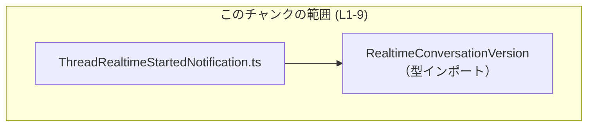
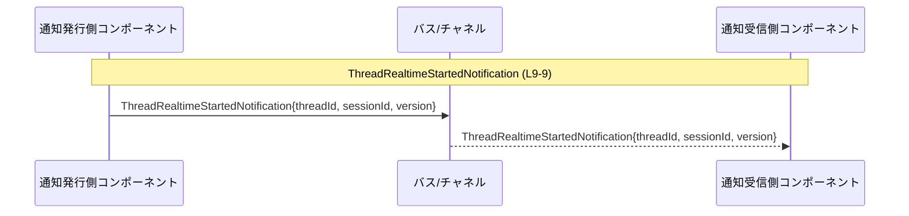

# app-server-protocol/schema/typescript/v2/ThreadRealtimeStartedNotification.ts コード解説

## 0. ざっくり一言

`ThreadRealtimeStartedNotification` は、「スレッドのリアルタイム開始が受理されたときに発行される通知」のペイロード構造を表す TypeScript の型エイリアスです（`app-server-protocol/schema/typescript/v2/ThreadRealtimeStartedNotification.ts:L6-7, L9-9`）。

---

## 1. このモジュールの役割

### 1.1 概要

- このモジュールは、スレッドのリアルタイム起動が受け入れられたタイミングで「どのような情報を通知するか」を型として定義します（コメントより: `L6-7`）。
- 型情報により、通知オブジェクトが必ず `threadId`, `sessionId`, `version` の 3 フィールドを持つことをコンパイル時に保証します（`L9-9`）。

### 1.2 アーキテクチャ内での位置づけ

このファイル自体は 1 つの型エイリアスを提供し、他のモジュールからインポートされて利用されることが想定されます。逆方向（どこから参照されるか）はこのチャンクには現れません。

依存関係は次の通りです。



- `RealtimeConversationVersion` を型としてインポートし（`L4-4`）、`version` フィールドの型に使用しています（`L9-9`）。
- `RealtimeConversationVersion` の中身や意味は、このチャンクには現れません。

### 1.3 設計上のポイント

- **自動生成コード**  
  - ファイル先頭に「GENERATED CODE! DO NOT MODIFY BY HAND!」とあり（`L1-1`）、`ts-rs` により生成されたことが明記されています（`L3-3`）。
  - 手動編集は前提とされていません。
- **純粋なデータ型定義**  
  - 関数やクラスはなく、通知データの構造のみを定義しています（`L9-9`）。
- **型安全性**  
  - `threadId: string` と明示することで、非文字列値の誤利用をコンパイル時に検出できます（`L9-9`）。
  - `sessionId: string | null` というユニオン型で、`null` を取りうることを明示しています（`L9-9`）。
  - `version: RealtimeConversationVersion` により、会話バージョンに関する型安全な扱いを可能にしています（`L4-4`, `L9-9`）。
- **並行性／エラー処理**  
  - 実行時処理（関数）やロジックは含まれていないため、このファイル単体では並行性制御やエラーハンドリングは行っていません（`L1-9`）。

---

## 2. 主要な機能一覧

このモジュールが提供する「機能」は、1 つの公開型です。

- `ThreadRealtimeStartedNotification`: スレッドのリアルタイム開始が受理されたときに発行される通知のペイロード型（`L6-7, L9-9`）。

---

## 3. 公開 API と詳細解説

### 3.1 型一覧（構造体・列挙体など）

このファイルで直接定義されている主要な型は 1 つです。

| 名前 | 種別 | 役割 / 用途 | 主なフィールド | 定義位置 |
|------|------|-------------|----------------|----------|
| `ThreadRealtimeStartedNotification` | 型エイリアス（オブジェクト型） | スレッドのリアルタイム起動が受理されたときに発行される通知の内容を表す | `threadId: string`, `sessionId: string \| null`, `version: RealtimeConversationVersion` | `app-server-protocol/schema/typescript/v2/ThreadRealtimeStartedNotification.ts:L9-9` |

依存している外部型:

| 名前 | 種別 | 役割 / 用途 | 定義位置 |
|------|------|-------------|----------|
| `RealtimeConversationVersion` | 型（詳細不明） | 通知対象のリアルタイム会話の「バージョン」を表す型として利用されている | インポートのみ: `app-server-protocol/schema/typescript/v2/ThreadRealtimeStartedNotification.ts:L4-4`（実体は別ファイルにあり、このチャンクには現れません） |

`ThreadRealtimeStartedNotification` のフィールド詳細:

| フィールド名 | 型 | 必須 / 任意 | 説明 | 根拠 |
|--------------|----|------------|------|------|
| `threadId` | `string` | 必須 | 対象スレッドの識別子。文字列として表現されます。 | `L9-9` |
| `sessionId` | `string \| null` | 必須（プロパティ自体は必須・値は文字列または null） | その通知に紐づくセッション ID。存在しない（もしくは関連付けない）場合は `null` で表現されます。`undefined` は許容されません。 | `L9-9` |
| `version` | `RealtimeConversationVersion` | 必須 | リアルタイム会話のバージョン情報。具体的なバージョン表現は別型に委ねられています。 | `L4-4, L9-9` |

### 3.2 関数詳細（最大 7 件）

このファイルには関数・メソッドは定義されていません（`L1-9`）。  
したがって、詳細解説対象の関数はありません。

### 3.3 その他の関数

- 補助的な関数やラッパー関数も定義されていません（`L1-9`）。

---

## 4. データフロー

このファイルには処理ロジックはありませんが、コメントから「通知として発行される」ことが読み取れます（`L6-7`）。  
そのため、型インスタンスの典型的な流れを概念的なシーケンス図で示します。



- この図はあくまで「型インスタンスがどのように渡されるか」の一般的なイメージです。
- 実際にどのコンポーネントが発行・受信するか、どのようなメッセージバスを介するかは、このチャンクには現れません。

---

## 5. 使い方（How to Use）

### 5.1 基本的な使用方法

`ThreadRealtimeStartedNotification` 型を使って、通知オブジェクトを型安全に扱う例です。

```typescript
// 型のインポート                                              // 通知型とバージョン型を読み込む
import type { ThreadRealtimeStartedNotification } from "./v2/ThreadRealtimeStartedNotification"; // パスは利用側に合わせて調整
import type { RealtimeConversationVersion } from "./v2/RealtimeConversationVersion";

// 通知を生成してハンドラに渡す例                             // 実行時にはこのオブジェクトが通知として扱われる
function handleRealtimeStarted(
    notification: ThreadRealtimeStartedNotification,        // 型アノテーションによりフィールド構造が保証される
) {
    console.log("thread started:", notification.threadId);  // threadId は string であることが保証される
    console.log("session:", notification.sessionId);        // string または null
    console.log("version:", notification.version);          // RealtimeConversationVersion 型
}

// どこか別の箇所で通知オブジェクトを構築する例
const version: RealtimeConversationVersion = /* ... */;     // 具体的内容は別型の定義に依存

const notification: ThreadRealtimeStartedNotification = {    // 3 フィールドすべての指定が必須
    threadId: "thread-123",                                 // string
    sessionId: null,                                        // string か null のどちらか
    version,                                                // RealtimeConversationVersion 型
};

handleRealtimeStarted(notification);                        // 型が一致しているのでコンパイルエラーにならない
```

- プロパティを 1 つでも省略するとコンパイルエラーになります（`threadId` などはオプションではないため）。
- `sessionId` に `undefined` を代入することは型的に許されません（`string | null` のみ許容）。

### 5.2 よくある使用パターン

1. **セッション ID が存在する場合**

```typescript
const notificationWithSession: ThreadRealtimeStartedNotification = {
    threadId: "thread-456",        // スレッド ID
    sessionId: "session-789",      // セッション ID が文字列で入るケース
    version: version,              // RealtimeConversationVersion 型
};
```

1. **セッション ID を持たない（`null`）ケース**

```typescript
const notificationWithoutSession: ThreadRealtimeStartedNotification = {
    threadId: "thread-456",        // スレッド ID
    sessionId: null,               // 明示的に null とすることで「セッションなし」を表現
    version: version,              // RealtimeConversationVersion 型
};
```

- どちらの場合も `sessionId` プロパティ自体は必須ですが、その中身が `string` か `null` かで状態を表現します（`L9-9`）。

### 5.3 よくある間違い

```typescript
import type { ThreadRealtimeStartedNotification } from "./v2/ThreadRealtimeStartedNotification";

// 間違い例 1: 必須フィールドの欠落
const badNotification1: ThreadRealtimeStartedNotification = {
    // threadId: "thread-123",     // ❌ 省略するとコンパイルエラー
    sessionId: "session-1",
    version: someVersion,
};

// 間違い例 2: sessionId を undefined にする
const badNotification2: ThreadRealtimeStartedNotification = {
    threadId: "thread-123",
    // sessionId: undefined,       // ❌ string | null なので undefined は許容されない
    sessionId: null,               // ✅ null を使う
    version: someVersion,
};

// 間違い例 3: version を別の型で代用
const badNotification3 = {
    threadId: "thread-123",
    sessionId: "session-1",
    version: "v2",                  // ❌ 型が RealtimeConversationVersion でない限りコンパイルエラー
} as ThreadRealtimeStartedNotification;
```

- 上記のような誤りは TypeScript の型チェックによって検出されます。
- `as` による型アサーションで無理に型を合わせると、実行時エラーの原因になり得ます（一般的な TypeScript の注意点）。

### 5.4 使用上の注意点（まとめ）

- **前提条件**
  - `threadId`, `sessionId`, `version` の 3 プロパティはすべて必須です（`L9-9`）。
  - `sessionId` は `string` または `null` であり、`undefined` や数値などは許容されません（`L9-9`）。
- **型安全性**
  - 型アサーション（`as any` や `as ThreadRealtimeStartedNotification`）で実態と異なるオブジェクトを扱うと、IDE・コンパイラの支援を失い、バグ発生率が高まります。
- **並行性**
  - この型は純粋なデータ型であり、並行処理そのものは扱いません。複数スレッド／タスクから共有される場合も、TypeScript レベルでは特別な制約はありません。
- **セキュリティ / 信頼性**
  - 一般的に、外部から受信した JSON などをこの型として扱う場合、実行時バリデーション（スキーマ検証など）を別途行う必要があります。このファイル自体は実行時検証機能を持ちません（`L1-9`）。

---

## 6. 変更の仕方（How to Modify）

### 6.1 新しい機能を追加する場合

このファイルは自動生成されており、手動変更は推奨されていません。

- `// GENERATED CODE! DO NOT MODIFY BY HAND!`（`L1-1`）
- `This file was generated by [ts-rs]... Do not edit this file manually.`（`L3-3`）

そのため:

1. **直接編集しない**  
   - このファイルを直接書き換えると、再生成時に上書きされます。
2. **元の定義を修正する**  
   - 変更・追加が必要な場合は、`ts-rs` が参照している元の定義（おそらく Rust 側の型定義）を修正する必要がありますが、その定義場所はこのチャンクには現れません。
3. **再生成する**
   - 元の定義変更後に `ts-rs` を用いて TypeScript コードを再生成します。

### 6.2 既存の機能を変更する場合

この型の「契約」（Contract）として、現在は次が保証されています（`L9-9`）。

- `threadId` は必ず存在し、文字列である。
- `sessionId` は必ず存在し、その値は `string` または `null`。
- `version` は必ず存在し、`RealtimeConversationVersion` 型である。

変更時の注意点:

- これらのフィールド名や型を変更すると、型に依存している全利用箇所が影響を受けます。
- 特に `sessionId` の `null` 取り扱いを変更する場合（例: オプショナルプロパティにする、`null` を廃止するなど）は、シリアライズフォーマットや後方互換性に影響しうるため、利用側との調整が必要です。
- テストコードや API 契約（Swagger/OpenAPI など）が存在する場合、それらも合わせて更新する必要がありますが、そうしたテストや仕様はこのチャンクには現れません。

---

## 7. 関連ファイル

このモジュールと直接関係のあるファイルは、インポートから 1 つだけ読み取れます。

| パス | 役割 / 関係 | 根拠 |
|------|------------|------|
| `app-server-protocol/schema/typescript/RealtimeConversationVersion`（正確な拡張子・パスは不明） | `RealtimeConversationVersion` 型の定義を提供し、本モジュールの `version` フィールド型として利用される | インポート文より: `app-server-protocol/schema/typescript/v2/ThreadRealtimeStartedNotification.ts:L4-4` |

- このほかにどのファイルが `ThreadRealtimeStartedNotification` を利用しているかは、このチャンクには現れません（不明）。

---

### コンポーネントインベントリーまとめ

最後に、このチャンクで確認できる型・依存コンポーネントを一覧します。

| 種別 | 名前 | 説明 | 定義 / 利用位置 |
|------|------|------|-----------------|
| 型エイリアス | `ThreadRealtimeStartedNotification` | スレッドのリアルタイム起動受理時の通知ペイロードを表すオブジェクト型 | 定義: `app-server-protocol/schema/typescript/v2/ThreadRealtimeStartedNotification.ts:L9-9` |
| インポート型 | `RealtimeConversationVersion` | 通知対象の会話のバージョンを表す型。`version` フィールドで利用される | インポート: `app-server-protocol/schema/typescript/v2/ThreadRealtimeStartedNotification.ts:L4-4` |

このファイルには関数・クラス・列挙体・テストコードなどは含まれていません（`L1-9`）。
