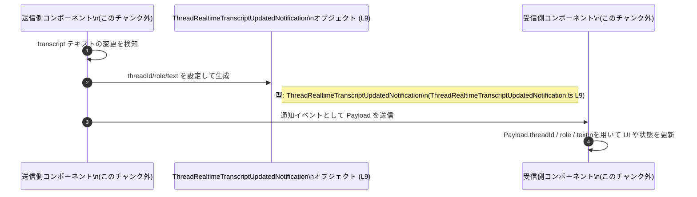

# app-server-protocol/schema/typescript/v2/ThreadRealtimeTranscriptUpdatedNotification.ts コード解説

---

## 0. ざっくり一言

リアルタイムのスレッド・トランスクリプト（文字起こし）テキストが更新されたときに発行される「更新通知メッセージ」の**ペイロード構造**を表す TypeScript のオブジェクト型を定義するファイルです。  
このファイルは ts-rs によって **自動生成された実験的（EXPERIMENTAL）な通知スキーマ**です（`ThreadRealtimeTranscriptUpdatedNotification.ts:L1-3, L5-7`）。

---

## 1. このモジュールの役割

### 1.1 概要

- このモジュールは、**リアルタイム transcript のテキスト変更が発生したときに発行される通知のデータ構造**を TypeScript の型として定義します（`ThreadRealtimeTranscriptUpdatedNotification.ts:L5-7, L9-9`）。
- 型情報を提供するだけで、**実行時ロジック（関数やクラス）は含まれていません**（`ThreadRealtimeTranscriptUpdatedNotification.ts:L1-9`）。
- ファイル先頭コメントから、この型は Rust 側の定義から **ts-rs によって自動生成されたコード**であり、手動編集しないことが前提です（`ThreadRealtimeTranscriptUpdatedNotification.ts:L1-3`）。

### 1.2 アーキテクチャ内での位置づけ

このファイルは「通知ペイロードの型定義レイヤー」に属し、以下のような流れの中で利用されることが想定されます。

- Rust 側の型定義（このチャンク外）から ts-rs が TypeScript 定義を生成する（`ThreadRealtimeTranscriptUpdatedNotification.ts:L1-3`）。
- 生成された `ThreadRealtimeTranscriptUpdatedNotification` 型を、TypeScript のアプリケーション側コードがインポートして利用する（このチャンクには利用コードは現れません）。


> Rust 側や利用コードの具体的なモジュール名・構造は、このチャンクには現れないため不明です。

### 1.3 設計上のポイント

- **自動生成コード**  
  - ファイル冒頭に「GENERATED CODE」「Do not edit this file manually」と明記されており（`ThreadRealtimeTranscriptUpdatedNotification.ts:L1, L3`）、元定義に対する機械的なミラーであることが分かります。
- **単一の型エイリアスのみを公開**  
  - このファイルには公開 API として `ThreadRealtimeTranscriptUpdatedNotification` 型のみが定義されており、追加の補助型・関数はありません（`ThreadRealtimeTranscriptUpdatedNotification.ts:L9-9`）。
- **実験的 API**  
  - JSDoc に「EXPERIMENTAL」とあり（`ThreadRealtimeTranscriptUpdatedNotification.ts:L5-7`）、仕様やフィールドが将来的に変更される可能性が高いことが示唆されています。
- **純粋なデータ型（副作用なし）**  
  - 型定義のみで状態やメソッドを持たないため、エラー処理・並行性・パフォーマンスの問題は、**この型を使う側のコードに委ねられます**。

---

## 2. 主要な機能一覧

このモジュールが提供する機能は、型レベルに限定されます。

- リアルタイム transcript 更新通知ペイロードの型定義:  
  `ThreadRealtimeTranscriptUpdatedNotification` 型が、通知オブジェクトの shape（`threadId`, `role`, `text` の3つの必須文字列フィールド）を表現します（`ThreadRealtimeTranscriptUpdatedNotification.ts:L9-9`）。

---

## 3. 公開 API と詳細解説

### 3.1 型一覧（コンポーネントインベントリー）

#### 型エイリアス一覧

| 名前 | 種別 | 役割 / 用途 | 定義位置 |
|------|------|-------------|----------|
| `ThreadRealtimeTranscriptUpdatedNotification` | 型エイリアス (`type`) | リアルタイムのスレッド transcript 更新通知メッセージのペイロードを表すオブジェクト型 | `ThreadRealtimeTranscriptUpdatedNotification.ts:L9-9` |

#### フィールド一覧

`ThreadRealtimeTranscriptUpdatedNotification` は次の 3 フィールドを持つオブジェクト型です（`ThreadRealtimeTranscriptUpdatedNotification.ts:L9-9`）。

| フィールド名 | 型 | 必須/任意 | 説明（このチャンクから読み取れる範囲） | 定義位置 |
|--------------|----|-----------|----------------------------------------|----------|
| `threadId`   | `string` | 必須 | 通知対象となるスレッドの識別子を表す文字列であると考えられますが、具体的なフォーマットはこのファイルからは分かりません。 | `ThreadRealtimeTranscriptUpdatedNotification.ts:L9-9` |
| `role`       | `string` | 必須 | 発話者やエージェントの「役割」を示す文字列である可能性がありますが、許可される値や意味はこのファイルからは分かりません。 | `ThreadRealtimeTranscriptUpdatedNotification.ts:L9-9` |
| `text`       | `string` | 必須 | transcript のテキスト内容を表す文字列であると読み取れますが、部分更新か全量かなどの詳細はこのファイルからは分かりません。 | `ThreadRealtimeTranscriptUpdatedNotification.ts:L9-9` |

> 意味に関する説明はフィールド名と JSDoc の文言からの **推測** を含みますが、値の制約やフォーマットなどの厳密な仕様は、このチャンクからは確定できません。

#### 契約 (Contracts) とエッジケース（型レベル）

- 契約（型システムが保証すること）
  - 3 つのプロパティ `threadId`, `role`, `text` が **すべて存在し、すべて `string` 型**であることを TypeScript コンパイラが保証します（`ThreadRealtimeTranscriptUpdatedNotification.ts:L9-9`）。
- 契約外（別ロジックの責任になること）
  - 文字列の中身（空文字列かどうか、長さ制限、文字種、構造など）は一切制約されません。  
    空文字列や非常に長い文字列も型レベルでは許容されます。
  - `threadId` が存在しない thread を指していないか、`role` の値が想定されたセット内か、`text` が特定のフォーマット（例: Markdown, JSON）に従っているかなどは、別のバリデーションロジックで扱う必要があります（このチャンクには現れません）。

### 3.2 関数詳細（最大 7 件）

このファイルには**関数・メソッド定義は存在しません**（`ThreadRealtimeTranscriptUpdatedNotification.ts:L1-9`）。  
したがって、関数の詳細テンプレートに沿った解説対象はありません。

### 3.3 その他の関数

- 該当なし（関数・メソッドは定義されていません）。

---

## 4. データフロー

### 4.1 代表的な処理シナリオ（概念レベル）

JSDoc コメントに「flat transcript delta emitted whenever realtime transcript text changes」とあることから（`ThreadRealtimeTranscriptUpdatedNotification.ts:L5-7`）、この型は概ね次のような流れの中で利用されると解釈できます。

1. あるコンポーネント（例: リアルタイム transcript を生成するサーバ側コンポーネント）が、対象スレッドの transcript テキスト変更を検知する（このチャンクには登場しません）。
2. 変更内容を表現するために、`threadId`, `role`, `text` を埋めた `ThreadRealtimeTranscriptUpdatedNotification` 型のオブジェクトを構築する（`ThreadRealtimeTranscriptUpdatedNotification.ts:L9-9`）。
3. そのオブジェクトを、イベントストリームや通知チャネル（具体的な手段はこのチャンクには現れません）を通じて受信側に送信する。
4. 受信側コンポーネントは、この型に基づいてオブジェクトを受け取り、表示や内部状態の更新を行う。

### 4.2 シーケンス図



> 通知チャネルの種類（WebSocket, SSE, メッセージキュー等）や送受信の実装は、このチャンクには含まれていません。

---

## 5. 使い方（How to Use）

### 5.1 基本的な使用方法

`ThreadRealtimeTranscriptUpdatedNotification` 型を用いて、通知オブジェクトを型安全に扱う基本例です。

```typescript
// 通知ペイロード型をインポートする（実際のパスはプロジェクト構成に依存します）
import type { ThreadRealtimeTranscriptUpdatedNotification } from "./ThreadRealtimeTranscriptUpdatedNotification"; // 例

// 通知を受け取って処理する関数の例
function handleTranscriptUpdate(                              // transcript 更新通知を処理する関数
  notification: ThreadRealtimeTranscriptUpdatedNotification  // 型安全にペイロードを受け取る
): void {
  // threadId に基づいて対象スレッドを特定する
  const threadId = notification.threadId;                    // string 型として保証されている

  // role や text も string 型として補完・型チェックが効く
  const role = notification.role;                            // 役割（具体的な値の制約は別ロジックで扱う）
  const text = notification.text;                            // 更新された transcript テキスト

  console.log(`[${threadId}] (${role}) ${text}`);            // ログ出力など
}

// 通知オブジェクトを作成して関数を呼び出す例
const notification: ThreadRealtimeTranscriptUpdatedNotification = {
  threadId: "thread-123",                                    // 任意の文字列
  role: "user",                                              // 任意の文字列（値の制約はこの型では表現されていない）
  text: "こんにちは、世界",                                   // 更新された transcript テキスト
};

handleTranscriptUpdate(notification);                        // 型安全に呼び出し可能
```

このように、型エイリアスによって IDE 補完やコンパイル時エラーチェックが働きます。

### 5.2 よくある使用パターン

1. **イベントハンドラの引数型として利用**

```typescript
type TranscriptUpdateHandler = (
  notif: ThreadRealtimeTranscriptUpdatedNotification
) => void;

function onTranscriptUpdate(
  handler: TranscriptUpdateHandler
) {
  // 実際には通知チャネルからメッセージを受信して handler を呼ぶ想定
  // このチャンクには具体的な実装は登場しません。
}
```

1. **通知種別のユニオン型の一部として利用**

他種の通知型と組み合わせて、通知の総称型を作ることもできます（他の型は例として定義しています）。

```typescript
type SomeOtherNotification = {                               // 仮の別通知型
  kind: "other";
};

type AnyNotification =
  | ThreadRealtimeTranscriptUpdatedNotification              // transcript 更新通知
  | SomeOtherNotification;                                   // 他の通知

function dispatchNotification(notification: AnyNotification) {
  // 'threadId' in notification のような存在チェックや
  // 型ガードを使って分岐処理を行うことができます。
}
```

※ `SomeOtherNotification` はドキュメント用の仮定義であり、このリポジトリに実在するとは限りません。

### 5.3 よくある間違い

#### 1. 必須フィールドの欠落

```typescript
// 間違い例: 必須フィールドを省略している
const badNotification: ThreadRealtimeTranscriptUpdatedNotification = {
  threadId: "thread-123",
  // role がない → コンパイルエラー
  // text がない → コンパイルエラー
};

// 正しい例: 3 フィールドすべてを指定する
const goodNotification: ThreadRealtimeTranscriptUpdatedNotification = {
  threadId: "thread-123",
  role: "assistant",
  text: "新しい transcript テキスト",
};
```

#### 2. `any` で型安全性を失う

```typescript
// 間違い例: any を使ってしまう
function handleAny(notif: any) {
  console.log(notif.threadId.toFixed(2)); // 実行時にエラーになる可能性がある
}

// 正しい例: 型エイリアスを使用する
function handleTyped(notif: ThreadRealtimeTranscriptUpdatedNotification) {
  console.log(notif.threadId);           // string なので toFixed は呼べない → コンパイル時に防げる
}
```

### 5.4 使用上の注意点（まとめ）

- **自動生成ファイルを直接変更しない**  
  - コメントに「GENERATED CODE」「Do not edit this file manually」とあるため（`ThreadRealtimeTranscriptUpdatedNotification.ts:L1-3`）、直接編集すると元の Rust 側定義との不整合が発生する可能性があります。
- **文字列内容のバリデーションは別途必要**  
  - 型は単に `string` であるため、空文字・極端に長い文字列・不正なフォーマットなどはコンパイル時に検出されません。  
    必要ならアプリケーション側でバリデーションを行う必要があります。
- **セキュリティ（XSS など）への注意**  
  - `text` がユーザ入力を含む場合、HTML に直接埋め込むと XSS のリスクがあります。  
    これは本ファイルの外の問題ですが、**「文字列をそのまま出力する箇所では、エスケープやサニタイズを行う」**ことが重要です。
- **並行性 / 同時実行の観点**  
  - この型自体は単なるデータ構造であり、並行アクセスに関する特別な制約や保護はありません。  
    並行処理中に同一オブジェクトをミュータブルに共有するかどうかは利用側の設計に依存します（Immutable に扱うのが安全です）。
- **EXPERIMENTAL であること**  
  - JSDoc に「EXPERIMENTAL」とあるため（`ThreadRealtimeTranscriptUpdatedNotification.ts:L5-7`）、将来的にフィールドが追加・変更・削除される可能性があります。  
    公開 API として依存する場合は、バージョン管理や互換性に注意が必要です。

---

## 6. 変更の仕方（How to Modify）

### 6.1 新しい機能を追加する場合（フィールド追加など）

このファイルは ts-rs による自動生成であるため（`ThreadRealtimeTranscriptUpdatedNotification.ts:L1-3`）、**通常はこのファイルを直接編集せず、元となる Rust 側の型定義を変更して再生成する**運用が想定されます。

一般的な手順（このリポジトリ固有の詳細はこのチャンクからは不明です）:

1. **Rust 側の元型にフィールドを追加**
   - 例: `timestamp: DateTime` に相当するフィールドを Rust 側の struct に追加し、ts-rs 用の属性を付与する（具体名はこのチャンクには現れません）。
2. **ts-rs を用いて TypeScript 定義を再生成**
   - ビルドスクリプトやコマンドで ts-rs を実行し、この `.ts` ファイルを更新する。
3. **TypeScript 側コードの更新**
   - 追加されたフィールドを利用する箇所で、型エラーが出ていればコードを修正する。
   - 既存コードで新フィールドが必須になった場合、その対応を行う。

### 6.2 既存の機能を変更する場合（フィールド名・型の変更など）

- **影響範囲の確認**
  - `ThreadRealtimeTranscriptUpdatedNotification` 型を参照しているすべての TypeScript ファイルが影響を受けます。  
    具体的な参照箇所はこのチャンクからは分かりませんが、IDE の参照検索などで確認する必要があります。
- **契約の変更に注意**
  - 例: `role: string` を enum の文字列リテラル型などに変更した場合、既存の文字列値が不正とみなされる可能性があります。
  - 変更前後の互換性（後方互換かどうか）を意識し、段階的な移行（deprecated フィールドを併存させる等）が必要になることがあります。
- **テストと検証**
  - このチャンクにはテストコードは現れませんが、実際には通知のシリアライズ/デシリアライズや UI 表示などのテストを更新・追加することが望ましいです。

---

## 7. 関連ファイル

このチャンクから直接分かる関連は限定的です。

| パス / 要素 | 役割 / 関係 |
|------------|------------|
| `app-server-protocol/schema/typescript/v2/ThreadRealtimeTranscriptUpdatedNotification.ts` | 本ドキュメントの対象ファイル。リアルタイム transcript 更新通知ペイロードの型定義を提供する（`ThreadRealtimeTranscriptUpdatedNotification.ts:L5-9`）。 |
| Rust 側の ts-rs 対象型（パス・名前不明） | 本 TypeScript 定義の元になると考えられる Rust の型。コメントから ts-rs により生成されていることのみ分かる（`ThreadRealtimeTranscriptUpdatedNotification.ts:L1-3`）。 |
| ts-rs（外部ツール） | Rust の型から TypeScript の型定義を生成するために用いられているツール。コメントに GitHub リンクが示される（`ThreadRealtimeTranscriptUpdatedNotification.ts:L3-3`）。 |

> これ以外の TypeScript ファイル（例: 通知を送受信するロジック、UI コンポーネントなど）は、このチャンクには現れないため特定できません。

---

### 付記: Bugs / Security / Performance / Observability について

- **Bugs**
  - このファイルは型定義のみであり、ロジックがないため、直接的なバグ（ロジックミス）は存在しません。
  - ただし、Rust 側定義と TypeScript 側利用コードの期待がズレている場合、実行時に不整合が起こる可能性があります（例: Rust 側では `role` に制約があるが、TS 型は単なる `string` のまま）。
- **Security**
  - `text` がユーザ入力を含む場合の XSS やログへの機微情報出力などは、**この型を利用するコード側の責任**になります。
- **Performance / Scalability**
  - オブジェクトはフィールド 3 つだけの軽量な構造であり、この型定義自体がパフォーマンス問題を引き起こすことは考えにくいです。
- **Observability**
  - ログ、メトリクス、トレースなどの観測可能性に関する仕組みはこのファイルには含まれていません。  
    必要に応じて、通知の送受信時にログ出力やメトリクス計測を追加するのは利用側コードの責務です。
