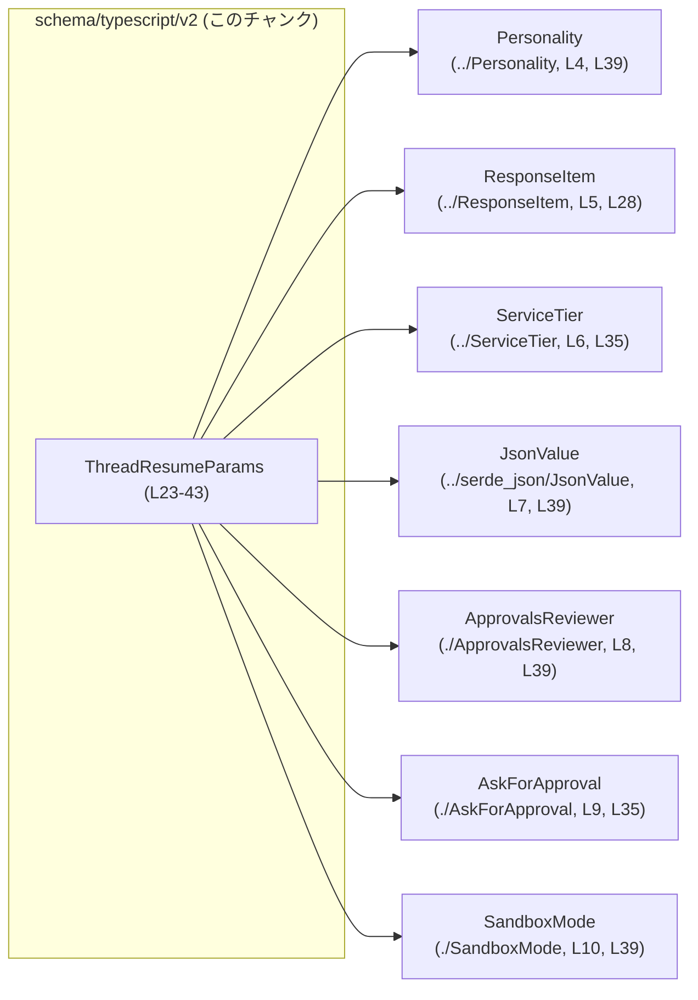
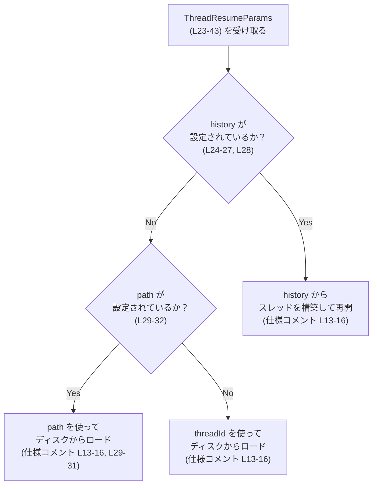
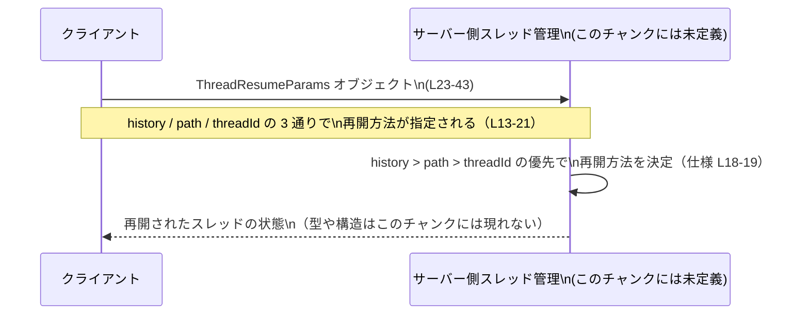

# app-server-protocol/schema/typescript/v2/ThreadResumeParams.ts コード解説

## 0. ざっくり一言

`ThreadResumeParams` は、「スレッドを再開するためにクライアントがサーバーに渡すパラメータ」の構造を表す TypeScript の型定義です（`export type`）（`app-server-protocol/schema/typescript/v2/ThreadResumeParams.ts:L23-43`）。

---

## 1. このモジュールの役割

### 1.1 概要

- このファイルは、Rust 側の型から [`ts-rs`](https://github.com/Aleph-Alpha/ts-rs) によって自動生成された TypeScript 型定義です（`L1-3`）。
- 3 通りの方法（`threadId` / `history` / `path`）で「スレッド再開」を指定できることと、その優先順位をコメントで仕様として示しています（`L13-21`）。
- 実際の再開処理ロジックはこのファイルには含まれておらず、あくまで「データの形」を定義しています。

### 1.2 アーキテクチャ内での位置づけ

このファイルから分かる事実は次の通りです。

- Rust から生成された TypeScript スキーマである（`L1-3`）。
- `ThreadResumeParams` は他の型 `Personality`, `ResponseItem`, `ServiceTier`, `JsonValue`, `ApprovalsReviewer`, `AskForApproval`, `SandboxMode` を参照しています（`L4-10`, `L28-39`）。
- どのモジュールがこの型を使っているか、どの API エンドポイントで利用されるかは、このチャンクには現れていません。

これをもとに、依存関係を簡略化して表すと次のようになります。



※各インポート型が内部でどう定義されているかは、このチャンクには現れていません。

### 1.3 設計上のポイント

コードから読み取れる設計上の特徴は次の通りです。

- **自動生成コード**  
  - 冒頭コメントに「GENERATED CODE! DO NOT MODIFY BY HAND!」「ts-rs によって生成」と明記されています（`L1-3`）。
  - 変更は元の Rust 型定義側で行い、このファイルは再生成する前提です。
- **データ型のみ（状態やロジックを持たない）**  
  - 関数やクラスは定義されておらず、`export type` による単一のオブジェクト型のみが公開されています（`L23-43`）。
- **3 つの再開手段と優先順位**  
  - コメントで、`threadId` / `history` / `path` による 3 通りの再開方法が説明され、その優先順位が `history > path > thread_id` と明示されています（`L13-21`）。
- **オプションフィールドと `null` の併用**  
  - 多くのプロパティが「プロパティ自体が省略可能（`?`）かつ値として `null` を取りうる」形で定義されています（`history`, `path`, `model`, `modelProvider`, `serviceTier`, `cwd`, `approvalPolicy`, `approvalsReviewer`, `sandbox`, `config`, `baseInstructions`, `developerInstructions`, `personality` など（`L28-39`））。
- **必須情報とブールフラグ**  
  - `threadId: string` と `persistExtendedHistory: boolean` は必須であり、`?` が付いていません（`L23`, `L43`）。

---

## 2. 主要な機能一覧（コンポーネントインベントリー）

このファイルには関数は存在せず、1 つの公開データ型と複数の関連型参照が登場します。

- `ThreadResumeParams`: スレッド再開要求を表す主要なオブジェクト型（`L23-43`）。
  - `threadId`: スレッドを一意に識別する ID（`L23`）。
  - `history`: `ResponseItem` の配列による履歴。指定された場合はディスクからではなくメモリ上の履歴から再開する、という仕様コメントがあります（`L24-27`, `L28`）。
  - `path`: ディスク上のパスによる再開指定。指定時は `thread_id` が無視されるとコメントされています（`L29-31`, `L32`）。
  - `model`, `modelProvider`, `serviceTier`: 再開時のモデルやサービスレベルなどの構成上のオーバーライドに関するフィールド（`L33-35`）。
  - `cwd`: 実行時のカレントディレクトリのような文脈を表しうる文字列（用途はこのチャンクでは明記されていません）（`L35`）。
  - `approvalPolicy`, `approvalsReviewer`: 承認ポリシーとレビュー先ルーティングに関する設定（`L35-39`）。
  - `sandbox`: サンドボックス実行モードを表す `SandboxMode` 型（`L39`）。
  - `config`: 文字列キーから `JsonValue` へのマップで、任意の追加設定を保持しうるフィールド（`L39`）。
  - `baseInstructions`, `developerInstructions`: モデルへの追加指示文を格納しうる文字列（`L39`）。
  - `personality`: `Personality` 型。詳細はこのチャンクには現れていません（`L4`, `L39`）。
  - `persistExtendedHistory`: 履歴の永続化を拡張するかどうかを制御するブールフラグ（`L40-41`, `L43`）。

---

## 3. 公開 API と詳細解説

### 3.1 型一覧（構造体・列挙体など）

このチャンクに現れる型の一覧です。

| 名前 | 種別 | 役割 / 用途 | 定義/使用行 |
|------|------|-------------|-------------|
| `ThreadResumeParams` | 型エイリアス（オブジェクト型） | スレッド再開時のパラメータ一式を表すメインの公開型です。 | `L23-43` |
| `Personality` | インポートされた型 | `personality` フィールドの型。詳細な構造はこのチャンクには現れていません。 | インポート `L4`, 使用 `L39` |
| `ResponseItem` | インポートされた型 | `history` 配列の要素型。1 ステップ分の応答やメッセージを表すと推測されますが、コードからは構造は不明です。 | インポート `L5`, 使用 `L28` |
| `ServiceTier` | インポートされた型 | `serviceTier` フィールドの型。サービスレベルに関係する enum 等である可能性がありますが、このチャンクからは断定できません。 | インポート `L6`, 使用 `L35` |
| `JsonValue` | インポートされた型 | 任意の JSON 値を表す型で、`config` プロパティの値として利用されています。 | インポート `L7`, 使用 `L39` |
| `ApprovalsReviewer` | インポートされた型 | `approvalsReviewer` フィールドの型。承認レビューのルーティング先に関する情報を表す可能性がありますが、詳細は不明です。 | インポート `L8`, 使用 `L39` |
| `AskForApproval` | インポートされた型 | `approvalPolicy` フィールドの型。承認をどのように求めるかの設定と解釈できますが、構造はこのチャンクにはありません。 | インポート `L9`, 使用 `L35` |
| `SandboxMode` | インポートされた型 | `sandbox` フィールドの型。どのようなサンドボックスモードがあるかは、このチャンクでは分かりません。 | インポート `L10`, 使用 `L39` |

> 補足: 上記「用途」のうち、「〜と推測されます」と明記した部分は名称からの解釈であり、厳密な構造や意味はこのチャンクには現れていません。

### 3.2 関数詳細

このファイルには関数・メソッドは定義されていません（`L1-43`）。  
そのため、「関数詳細」テンプレートに従って説明できる対象はありません。

### 3.3 その他の関数

- 該当なし（関数が 1 つも定義されていません）。

---

## 4. データフロー

ここでは、コメントに記載されている仕様（`L13-21`）から読み取れる「ThreadResumeParams を解釈するときの典型的なデータフロー」を示します。実際の実装コードはこのチャンクには存在しないため、処理主体（サーバー側ロジックなど）の関数名は仮置きのものとして扱います。

### 4.1 スレッド再開方法の選択フロー

コメントによると、スレッド再開には 3 通りの方法と優先順位が定義されています（`L13-21`）。

- 1. `thread_id` でディスクからロードして再開
- 1. `history` からメモリ上でスレッドを構築して再開
- 1. `path` でディスクからロードして再開
- 優先順位は `history > path > thread_id`（`L18`）
- `history` または `path` を使う場合、`thread_id` は無視される（`L19`）

これをもとに、利用側で想定される判断の流れを示すと以下のようになります。



※ 実際の関数名やモジュール構成はこのチャンクには現れないため、上記はコメント上の仕様に基づく「想定されるフロー」の図示に留まります。

### 4.2 クライアント〜サーバ間のイメージ（仕様レベル）

`ThreadResumeParams` がプロトコルスキーマに位置していることから（パス名より）、クライアントとサーバーのやり取りのイメージを示すと次のようになります。



---

## 5. 使い方（How to Use）

ここでは、`ThreadResumeParams` 型を利用する側の TypeScript コード例を示します。  
例中の `resumeThread` 関数や戻り値の型は、このチャンクには定義されていない仮の API 名です。「こういう形で `ThreadResumeParams` オブジェクトを構築して渡すことができる」という参考レベルの例として見なしてください。

### 5.1 基本的な使用方法（threadId で再開）

最も推奨される方法として、コメントには「Prefer using thread_id whenever possible.」とあります（`L21`）。  
`threadId` のみを使った最小構成の例です。

```typescript
import type { ThreadResumeParams } from "./schema/typescript/v2/ThreadResumeParams"; // パスは環境に応じて調整
// 仮の API。実際の関数名・場所はこのチャンクには現れません。
async function resumeThread(params: ThreadResumeParams): Promise<void> {
    // ... サーバーにリクエストを送るなどの処理 ...
}

// threadId でシンプルにスレッドを再開する例
const params: ThreadResumeParams = {
    threadId: "thread-123",          // 必須フィールド（L23）
    persistExtendedHistory: false,   // 必須ブール（L40-41, L43）
    // 他のフィールドは省略可能
};

resumeThread(params).catch(console.error);
```

### 5.2 history を用いた再開

`history` を指定すると、「ディスクからロードする代わりに提供された履歴で再開する」とコメントされています（`L24-27`）。

```typescript
import type { ThreadResumeParams } from "./schema/typescript/v2/ThreadResumeParams";
import type { ResponseItem } from "./schema/typescript/ResponseItem"; // 実際のパスは環境依存

async function resumeThread(params: ThreadResumeParams): Promise<void> {
    // ...
}

const history: ResponseItem[] = [
    // 適切な ResponseItem オブジェクトをここに並べる
];

const paramsWithHistory: ThreadResumeParams = {
    threadId: "thread-ignored-when-history", // コメント上は history 使用時は無視される（L19）
    history,                                 // Array<ResponseItem> | null（L28）
    persistExtendedHistory: true,           // 履歴をより豊富に再構築するためのフラグ（L40-41）
};

resumeThread(paramsWithHistory);
```

### 5.3 path を用いた再開

`path` を指定した場合も、コメント上は `thread_id` が無視されるとされています（`L29-31`）。

```typescript
const paramsWithPath: ThreadResumeParams = {
    threadId: "thread-ignored-when-path", // path 使用時は無視（コメント L29-31, L19）
    path: "/some/rollout/path.json",      // path?: string | null（L32）
    persistExtendedHistory: false,
};

resumeThread(paramsWithPath);
```

### 5.4 よくある間違い（想定）

コードから推測される誤用と、その正しい利用方法の対比です。

```typescript
// 誤りの可能性がある例: history と path の両方を指定し、threadId も使われると思い込む
const wrongParams: ThreadResumeParams = {
    threadId: "thread-123",
    history: [],                      // history > path > thread_id の優先（L18）
    path: "/some/path",
    persistExtendedHistory: false,
};

// コメント仕様に沿った解釈では、上記では history が最優先で使われ、
// path と threadId は無視されることになります（L18-19）。
// したがって、意図に応じてどれか一つの方法に絞る方が明確です。

// より明確な例（history を優先して使いたい場合）
const clearParams: ThreadResumeParams = {
    threadId: "thread-123", // history があるので実質的には無視される（コメント L19）
    history: [],
    persistExtendedHistory: false,
    // path は指定しない
};
```

### 5.5 使用上の注意点（まとめ）

- **生成コードの直接編集禁止**  
  - 冒頭コメントにある通り、このファイルは自動生成されており、直接編集しない前提です（`L1-3`）。
- **history/path と threadId の関係**  
  - コメント仕様上、`history` または `path` を指定すると `threadId` は無視されるとされています（`L18-19`, `L29-31`）。  
    呼び出し側で `threadId` も同時に意味があると期待すると、実際の挙動と齟齬が出る可能性があります。
- **オプション + null の二重の「未設定」表現**  
  - 多くのフィールドは「プロパティ自体が存在しない」状態と「存在するが値が `null`」の両方を取りうる設計です（`L28-39`）。  
    利用側で両者を区別する必要がある場合は、`in` 演算子や `== null` チェックなどで明確に扱う必要があります。
- **persistExtendedHistory の意味**  
  - コメントによると、`persistExtendedHistory` が `true` の場合は、後続の resume/fork/read のためにより豊かな履歴再構築に必要なイベントを追加で永続化する挙動が想定されています（`L40-41`）。  
    実際の永続化コストやストレージ影響は、このチャンクには現れていません。

---

## 6. 変更の仕方（How to Modify）

### 6.1 新しいフィールドを追加する場合

- このファイルは `ts-rs` によって生成されているため、直接編集しても次の生成時に上書きされます（`L1-3`）。
- 新しいフィールドを追加したい場合の一般的な流れは次の通りです（実際の Rust 側ファイル名等はこのチャンクには現れていません）:
  1. 元となる Rust の型定義（`ThreadResumeParams` に対応する構造体や型）にフィールドを追加する。
  2. `ts-rs` のコード生成プロセスを再実行し、この TypeScript ファイルを再生成する。
  3. TypeScript 側の利用コード（`ThreadResumeParams` 型を使っている箇所）を新フィールドに合わせて更新する。

### 6.2 既存のフィールドを変更する場合

変更時に注意すべき点を、このチャンクから分かる範囲で整理します。

- **フィールド名の変更**  
  - プロトコル互換性に影響する可能性があります。少なくとも TypeScript 側の全利用箇所で `threadId`, `history`, `path` などの名称を参照している部分を追従させる必要があります。
- **型の変更（例: null 許容の削除など）**  
  - 例えば `history?: Array<ResponseItem> | null` を `history: Array<ResponseItem>` に変更すると、既存の呼び出し側で `history` を省略しているコードがコンパイルエラーになります（`L28`）。
- **コメント仕様との整合性**  
  - `history > path > thread_id` の優先順位を変更する場合は、コメント（`L13-21`）と実装の両方を揃える必要があります。このファイルはコメントも生成元に依存していると考えられるため、Rust 側のドキュメントも合わせて修正する必要があります。

---

## 7. 関連ファイル

このモジュールと密接に関係するファイルは、インポートされている型定義ファイルです。

| パス | 役割 / 関係 |
|------|------------|
| `../Personality` | `Personality` 型を定義するファイルです。`ThreadResumeParams.personality` プロパティの型として参照されています（`L4`, `L39`）。 |
| `../ResponseItem` | `ResponseItem` 型を定義するファイルです。`history` 配列の要素型として利用されています（`L5`, `L28`）。 |
| `../ServiceTier` | `ServiceTier` 型を定義するファイルです。`serviceTier` プロパティの型として参照されています（`L6`, `L35`）。 |
| `../serde_json/JsonValue` | `JsonValue` 型を定義するファイルです。`config` の値として任意の JSON 値を保持するために利用されています（`L7`, `L39`）。 |
| `./ApprovalsReviewer` | `ApprovalsReviewer` 型を定義するファイルです。`approvalsReviewer` プロパティに使われています（`L8`, `L39`）。 |
| `./AskForApproval` | `AskForApproval` 型を定義するファイルです。`approvalPolicy` プロパティに使われています（`L9`, `L35`）。 |
| `./SandboxMode` | `SandboxMode` 型を定義するファイルです。`sandbox` プロパティに使われています（`L10`, `L39`）。 |

---

## 補足: 型レベルの安全性・エッジケース・セキュリティ観点

このチャンクから読み取れる範囲で、言語固有の観点をまとめます。

- **型安全性**  
  - TypeScript の型としては、各フィールドに明示的な型注釈が付いており、IDE などでの補完・型チェックに利用できます（`L23-43`）。
  - ただし `any` は使われておらず、`config` も `JsonValue` によって JSON 互換の値に制限されています（`L7`, `L39`）。
- **エッジケース**  
  - `history?: Array<ResponseItem> | null` のような形のため、呼び出し側は「プロパティがない」「あるが `null`」「空配列」といった状態を区別する必要があります（`L28`）。
  - `serviceTier?: ServiceTier | null | null` は、型としては `ServiceTier | null` と同じ意味であり、`| null | null` の二重指定は冗長ですが、動作上の差異はありません（`L35`）。
- **セキュリティ**  
  - `config?: { [key in string]?: JsonValue } | null` によって任意キーの設定を許容しているため、この値をどのように解釈しているか（コマンド実行・パス扱いなど）によっては、呼び出し側またはサーバー側で適切なバリデーションが必要となる可能性があります（`L39`）。  
    ただし、その実際の利用方法はこのチャンクには現れていません。
