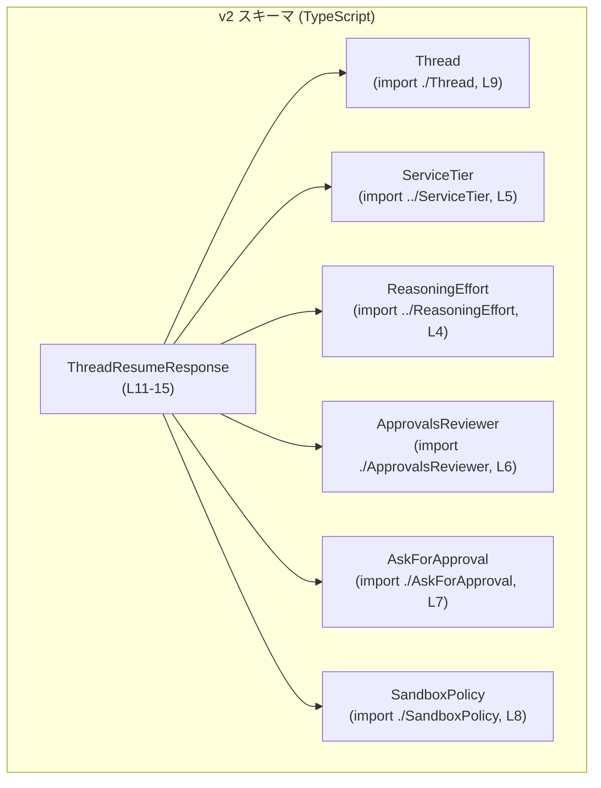
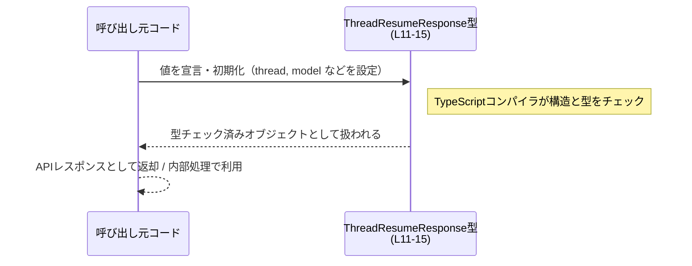

# app-server-protocol/schema/typescript/v2/ThreadResumeResponse.ts コード解説

## 0. ざっくり一言

- スレッド再開時のレスポンスの内容を表す **TypeScript のオブジェクト型エイリアス**です（`ThreadResumeResponse`）。  
- スレッド本体・使用モデル・承認ポリシー・サンドボックス設定・推論強度などを 1 つのオブジェクトでまとめて表現します（`ThreadResumeResponse.ts:L11-15`）。

---

## 1. このモジュールの役割

### 1.1 概要

- このモジュールは、`ThreadResumeResponse` という **レスポンスの型定義**のみを提供します（`ThreadResumeResponse.ts:L11-15`）。
- 型名から、スレッドを再開したときに返却される情報（スレッド状態、モデル情報、承認・サンドボックス設定など）をまとめた構造体的な役割と解釈できます（名前に基づく推測です）。

### 1.2 アーキテクチャ内での位置づけ

このファイルは TypeScript 側のスキーマ層に属し、他の型定義に依存しています。

- 依存先（`import type`）として、以下の型を参照します（`ThreadResumeResponse.ts:L4-9`）。
  - `ReasoningEffort`
  - `ServiceTier`
  - `ApprovalsReviewer`
  - `AskForApproval`
  - `SandboxPolicy`
  - `Thread`

Mermaid 図で依存関係を示します。



この図は、「`ThreadResumeResponse` 型がどの型に依存しているか」を表します。動的な処理フローではなく、静的な型依存です。

### 1.3 設計上のポイント

- **自動生成ファイルであること**  
  - `// GENERATED CODE! DO NOT MODIFY BY HAND!` というコメントがあり（`ThreadResumeResponse.ts:L1`）、  
    `ts-rs` によって生成されたファイルであると明示されています（`ThreadResumeResponse.ts:L3`）。
  - したがって、**手動で編集しない前提**のコードです。
- **型専用のモジュール**  
  - `import type` を使用しており（`ThreadResumeResponse.ts:L4-9`）、実行時依存は発生せず、コンパイル時の型情報のみに依存します。
- **構造化されたレスポンスオブジェクト**  
  - `export type ThreadResumeResponse = { ... }` の形で、プロパティを列挙したオブジェクト型を定義しています（`ThreadResumeResponse.ts:L11-15`）。
  - すべてのプロパティは「存在必須」であり、一部は `null` を取りうる型になっています（`serviceTier: ServiceTier | null`, `reasoningEffort: ReasoningEffort | null`）。
- **JSDoc による部分的なドキュメント**  
  - `approvalsReviewer` プロパティには JSDoc コメントが付いており、その役割が英語で説明されています（`ThreadResumeResponse.ts:L12-14`）。

---

## 2. 主要な機能一覧（＋コンポーネントインベントリー）

このファイルは関数を持たず、**1 つのエクスポートされた型**を提供するだけです。そのため「機能」は「どの情報をどの型で表すか」という観点で整理します。

### 2.1 コンポーネントインベントリー（型・依存）

| 名称 | 種別 | 役割 / 用途 | 定義/参照位置 |
|------|------|-------------|----------------|
| `ThreadResumeResponse` | 型エイリアス（オブジェクト型） | スレッド再開レスポンス全体の構造を表すメインの公開型 | `ThreadResumeResponse.ts:L11-15` |
| `Thread` | 型（別モジュール） | `thread` プロパティの型。スレッド自体のデータ構造を表していると解釈できる | `ThreadResumeResponse.ts:L9` |
| `ServiceTier` | 型（別モジュール） | `serviceTier` プロパティの型。サービス階層やプラン種別を表すと解釈できる | `ThreadResumeResponse.ts:L5` |
| `ReasoningEffort` | 型（別モジュール） | `reasoningEffort` プロパティの型。推論の強度・レベル等を表すと解釈できる | `ThreadResumeResponse.ts:L4` |
| `ApprovalsReviewer` | 型（別モジュール） | `approvalsReviewer` プロパティの型。「誰／何が承認レビューを行うか」を表す（JSDoc あり） | `ThreadResumeResponse.ts:L6, L12-15` |
| `AskForApproval` | 型（別モジュール） | `approvalPolicy` プロパティの型。承認の取得ポリシーを表すと解釈できる | `ThreadResumeResponse.ts:L7, L11-12` |
| `SandboxPolicy` | 型（別モジュール） | `sandbox` プロパティの型。サンドボックス実行に関するポリシーを表すと解釈できる | `ThreadResumeResponse.ts:L8, L15` |

> 注: 依存する型の具体的な中身はこのチャンクには現れません。「用途」は名前とプロパティ名からの解釈です。

### 2.2 構造的な「機能」

- スレッドの現在状態を提供する（`thread: Thread`）（`ThreadResumeResponse.ts:L11`）。
- 利用しているモデル名とモデル提供者を示す（`model: string`, `modelProvider: string`）（`ThreadResumeResponse.ts:L11`）。
- サービス階層（プランなど）を任意で示す（`serviceTier: ServiceTier | null`）（`ThreadResumeResponse.ts:L11`）。
- カレントディレクトリと思われるパス文字列を提供する（`cwd: string`）（`ThreadResumeResponse.ts:L11`）。
- 承認ポリシーと現在のレビュアーを示す（`approvalPolicy: AskForApproval`, `approvalsReviewer: ApprovalsReviewer`）（`ThreadResumeResponse.ts:L11-15`）。
- サンドボックス実行に関するポリシーを示す（`sandbox: SandboxPolicy`）（`ThreadResumeResponse.ts:L15`）。
- 推論強度またはリソース使用レベルなどを任意で示す（`reasoningEffort: ReasoningEffort | null`）（`ThreadResumeResponse.ts:L15`）。

---

## 3. 公開 API と詳細解説

### 3.1 型一覧（構造体・列挙体など）

このモジュールが外部に直接公開するのは `ThreadResumeResponse` 型のみです。

| 名前 | 種別 | 役割 / 用途 | フィールド概要 | 定義位置 |
|------|------|-------------|----------------|----------|
| `ThreadResumeResponse` | 型エイリアス（オブジェクト型） | スレッド再開レスポンス全体を表現するデータ構造 | `thread`, `model`, `modelProvider`, `serviceTier`, `cwd`, `approvalPolicy`, `approvalsReviewer`, `sandbox`, `reasoningEffort` の 9 プロパティを持つ | `ThreadResumeResponse.ts:L11-15` |

`ThreadResumeResponse` の各プロパティを展開すると、構造は次のようになります（フォーマットし直しのみで、意味は元コードと同じです）。

```typescript
// ThreadResumeResponse.ts:L11-15（整形）
export type ThreadResumeResponse = {
    thread: Thread;                             // スレッドデータ
    model: string;                              // 使用モデル名
    modelProvider: string;                      // モデル提供者名
    serviceTier: ServiceTier | null;           // サービス階層（ない場合は null）
    cwd: string;                                // 作業ディレクトリを示す文字列と解釈できる
    approvalPolicy: AskForApproval;            // 承認ポリシー
    /**
     * Reviewer currently used for approval requests on this thread.
     */
    approvalsReviewer: ApprovalsReviewer;      // 現在使用中のレビュアー
    sandbox: SandboxPolicy;                    // サンドボックスポリシー
    reasoningEffort: ReasoningEffort | null;   // 推論強度（ない場合は null）
};
```

> コメント「Reviewer currently used for approval requests on this thread.」はオリジナルの JSDoc です（`ThreadResumeResponse.ts:L12-14`）。

### 3.2 関数詳細

このファイルには **関数・メソッドは一切定義されていません**（`ThreadResumeResponse.ts:L1-15` 全体を見ても `function` や `=>` を伴う関数宣言は無し）。

そのため、「関数詳細テンプレート」に基づく詳細解説は該当なしです。

### 3.3 その他の関数

- 該当なし（このモジュールには関数がありません）。

---

## 4. データフロー

このファイル自体は型定義のみですが、「`ThreadResumeResponse` 型の値がどのような形で生成・利用されるか」という一般的なフローを、**型チェックの観点**で示します（あくまで典型例であり、このチャンクには具体的な使用コードは現れません）。



要点:

- `ThreadResumeResponse` 型は **コンパイル時の型チェックだけを提供**します。
  - `import type` により、実行時にはこの型情報は削除されます（`ThreadResumeResponse.ts:L4-9`）。
- 実際の値の生成・シリアライズ・ネットワーク送受信などは他のモジュールの責務であり、このチャンクからは分かりません。

---

## 5. 使い方（How to Use）

### 5.1 基本的な使用方法

もっとも基本的な使い方は、「API や内部処理の戻り値として `ThreadResumeResponse` を型注釈する」ことです。

```typescript
// ThreadResumeResponse 型をインポートする（相対パスはプロジェクト構成に応じて調整）
// ThreadResumeResponse.ts が同じディレクトリにある想定
import type { ThreadResumeResponse } from "./ThreadResumeResponse";   // 型だけをインポートする

// 他の依存型もどこかで用意されている前提（ここでは宣言だけ）
import type { Thread } from "./Thread";                               // スレッド本体の型
import type { AskForApproval } from "./AskForApproval";               // 承認ポリシーの型
import type { ApprovalsReviewer } from "./ApprovalsReviewer";         // レビュアーの型
import type { SandboxPolicy } from "./SandboxPolicy";                 // サンドボックスポリシーの型
import type { ServiceTier } from "../ServiceTier";                    // サービス階層の型
import type { ReasoningEffort } from "../ReasoningEffort";            // 推論強度の型

// ここでは「どこかから既に値が来ている」ものとして declare で仮置きします
declare const thread: Thread;
declare const approvalPolicy: AskForApproval;
declare const approvalsReviewer: ApprovalsReviewer;
declare const sandbox: SandboxPolicy;
declare const serviceTier: ServiceTier | null;
declare const reasoningEffort: ReasoningEffort | null;

// ThreadResumeResponse 型の値を組み立てる例
const response: ThreadResumeResponse = {
    thread,                        // Thread 型
    model: "my-model-v1",          // 使用するモデル名
    modelProvider: "my-provider",  // モデルの提供者
    serviceTier,                   // ServiceTier または null
    cwd: "/srv/app/workdir",       // カレントディレクトリを示す文字列（例）
    approvalPolicy,                // 承認ポリシー
    approvalsReviewer,             // 現在のレビュアー
    sandbox,                       // サンドボックスポリシー
    reasoningEffort,               // ReasoningEffort または null
};
```

このように、**すべてのプロパティを必ず指定する必要があります**（`?` が付いたオプショナルプロパティはありません）。  
ただし、`serviceTier` と `reasoningEffort` は `null` を許容するため、「情報がない状態」を `null` で表現できます。

### 5.2 よくある使用パターン

1. **API レスポンスの型注釈**

```typescript
// スレッド再開 API の戻り値の型として使う例
async function resumeThread(threadId: string): Promise<ThreadResumeResponse> {
    const res = await fetch(`/api/threads/${threadId}/resume`);
    // ここでは JSON の形が ThreadResumeResponse に合っている前提（実行時チェックは別途必要）
    return (await res.json()) as ThreadResumeResponse;  // 型アサーション
}
```

- TypeScript はコンパイル時チェックしか行わないため、`fetch().json()` の戻り値が本当に `ThreadResumeResponse` 構造かどうかは **ランタイムで別途検証が必要**です（型アサーションは実行時安全性を保証しません）。

1. **部分的な利用（プロパティの抽出）**

```typescript
function getModelInfo(response: ThreadResumeResponse): string {
    // モデル名とプロバイダをまとめて表示する例
    return `${response.model} @ ${response.modelProvider}`;
}
```

このように、`ThreadResumeResponse` を受け取り、必要なプロパティだけを利用するヘルパー関数を作るパターンが想定されます（このチャンクにはヘルパー定義はありません）。

### 5.3 よくある間違い

**1. 必須プロパティを省略する**

```typescript
// 間違い例: 必須プロパティ cwd を指定していない
const badResponse: ThreadResumeResponse = {
    // thread: thread,          // thread を省略してもコンパイルエラー
    thread,
    model: "my-model",
    modelProvider: "provider",
    serviceTier: null,
    // cwd: "/workdir",        // ← これを省略すると TypeScript がエラーにする
    approvalPolicy,
    approvalsReviewer,
    sandbox,
    reasoningEffort: null,
};
```

- TypeScript は `cwd` が存在しないことを検出し、「プロパティ 'cwd' が型に存在しない」旨のコンパイルエラーを出します。

**2. `null` でない場所に `null` を入れる**

```typescript
// 間違い例: model に null を入れてしまう
const badResponse2: ThreadResumeResponse = {
    thread,
    model: null as any,     // model: string なので本来 null は許されない
    modelProvider: "provider",
    serviceTier: null,
    cwd: "/workdir",
    approvalPolicy,
    approvalsReviewer,
    sandbox,
    reasoningEffort: null,
};
```

- `as any` で型をねじ曲げるとコンパイルは通りますが、**実行時に `string` と仮定した処理が壊れる危険**があります。
- `any` や乱用された型アサーションは TypeScript の型安全性を損なうため、慎重に使う必要があります。

### 5.4 使用上の注意点（まとめ）

- **型レベルの必須性と `null` 許容**  
  - プロパティ自体は全て必須ですが、`serviceTier` と `reasoningEffort` は `null` を許す設計です（`ThreadResumeResponse.ts:L11, L15`）。
  - 「値がない」という状態を表現するときは **プロパティを省略せずに `null` をセットする**必要があります。
- **実行時検証は別途必須**  
  - この型はコンパイル時にのみ存在し、ランタイムでの型チェックは行いません（`import type` のため、実行時には削除される。`ThreadResumeResponse.ts:L4-9`）。
  - 外部からの JSON をそのまま `ThreadResumeResponse` として扱う場合は、バリデーションライブラリ等で実際のデータ構造を検証する必要があります。
- **並行性 / スレッド安全性**  
  - TypeScript の型定義であり、オブジェクトは「単なるデータ」です。  
    JS 実行環境（通常はシングルスレッドのイベントループ）では競合状態の概念は限定的ですが、  
    Web Worker や Node.js の Worker Threads を利用する場合、**共有オブジェクトのミューテーション**には注意が必要です。
  - ただしこの型は「イミュータブルに扱うことが自然な単純データ」であり、**読み取り専用で共有する限り並行利用上の問題は起きにくい**と考えられます（一般論であり、このチャンクには共有処理は現れません）。
- **セキュリティ上の注意（`cwd` など）**  
  - `cwd` プロパティは名前から「current working directory」を示すと解釈できます（`ThreadResumeResponse.ts:L11`）。  
    実際にサーバーのディレクトリパスをクライアントに返す設計にする場合、  
    センシティブなパス情報が漏えいしないかを検討する必要があります。  
    このファイルからは、`cwd` の値がどのように使われるかまでは分かりません。

---

## 6. 変更の仕方（How to Modify）

### 6.1 新しい機能を追加する場合（プロパティ追加など）

このファイルは次のコメントにより、**手動編集が禁止されていることが明示されています**。

```typescript
// GENERATED CODE! DO NOT MODIFY BY HAND!   // ThreadResumeResponse.ts:L1
// This file was generated by [ts-rs](...)  // ThreadResumeResponse.ts:L3
```

したがって:

1. **直接この TypeScript ファイルを編集すべきではありません。**
2. 新しいプロパティを追加したい場合は、元となる Rust 側の型定義（`ts-rs` でエクスポートされている構造体など）を変更し、`ts-rs` のコード生成を再実行する必要があります。  
   - Rust 側の構造が変更されれば、`ThreadResumeResponse` 型も自動的に同期されます。
3. 追加したフィールドを利用するコード側では:
   - TypeScript への反映後、新フィールドを必須として扱うか、`null` / オプションにするかなど、**破壊的変更かどうか**を確認する必要があります。

### 6.2 既存の機能を変更する場合

既存プロパティの型や意味を変更する場合も同様に、**元のスキーマ（Rust 側）を修正**し、`ts-rs` を再実行する必要があります。

変更時の注意点:

- **影響範囲の確認**
  - `ThreadResumeResponse` を参照している TypeScript ファイルを全て検索し、どのプロパティがどのように使われているかを確認する必要があります。
- **契約の維持**
  - たとえば `serviceTier: ServiceTier | null` を `serviceTier: ServiceTier` に変えると、「null が返る可能性がある」という契約が変わります。
  - API クライアントが `null` を前提としている場合、ランタイムエラーにつながる可能性があります。
- **テスト**
  - このチャンクにはテストコードは含まれていませんが、変更後は API レスポンスのシリアライズ／デシリアライズが期待どおり動作するかをテストする必要があります（ユニットテストまたは統合テスト）。

---

## 7. 関連ファイル

このモジュールと密接に関係するファイル・ディレクトリは、主に `import type` されている型定義です（`ThreadResumeResponse.ts:L4-9`）。

| パス（相対） | 役割 / 関係 |
|--------------|------------|
| `../ReasoningEffort` | `ReasoningEffort` 型の定義を含むモジュール。`reasoningEffort` プロパティの型として利用される |
| `../ServiceTier` | `ServiceTier` 型の定義を含むモジュール。`serviceTier` プロパティの型として利用される |
| `./ApprovalsReviewer` | `ApprovalsReviewer` 型の定義を含むモジュール。`approvalsReviewer` プロパティの型として利用される |
| `./AskForApproval` | `AskForApproval` 型の定義を含むモジュール。`approvalPolicy` プロパティの型として利用される |
| `./SandboxPolicy` | `SandboxPolicy` 型の定義を含むモジュール。`sandbox` プロパティの型として利用される |
| `./Thread` | `Thread` 型の定義を含むモジュール。`thread` プロパティの型として利用される |

> これらのファイルの中身は、このチャンクには現れないため、具体的な構造や挙動は不明です。名前と文脈から用途を推測できる範囲のみを記述しました。

---

### 付記: Bugs / Security / Contracts / Edge Cases / Performance への簡潔な整理

- **潜在的なバグ要因（一般論）**
  - ランタイムで実際のレスポンスが `ThreadResumeResponse` の構造と食い違っているのに、`as ThreadResumeResponse` で型アサーションしてしまうと、実行時エラーや UI の不整合が発生しうる。
- **セキュリティ**
  - `cwd` などの環境情報を外部に返す設計とする場合、パス情報が機密情報にならないかの確認が必要（このファイルからは実際の利用方法は不明）。
- **Contracts（契約）**
  - すべてのプロパティが必須であること。
  - `serviceTier` と `reasoningEffort` は `null` を取りうること。
- **Edge Cases**
  - `serviceTier` / `reasoningEffort` が `null` の場合の処理分岐を呼び出し側で必ず実装する必要がある。
- **Performance / Scalability**
  - 型定義のみのため、これ自体がパフォーマンスやスケーラビリティのボトルネックになることはほぼありません。  
    ただし、大量のレスポンスオブジェクトを扱う場合は、シリアライズ／デシリアライズやネットワーク帯域が別途問題となります（このファイルからはその詳細は分かりません）。
