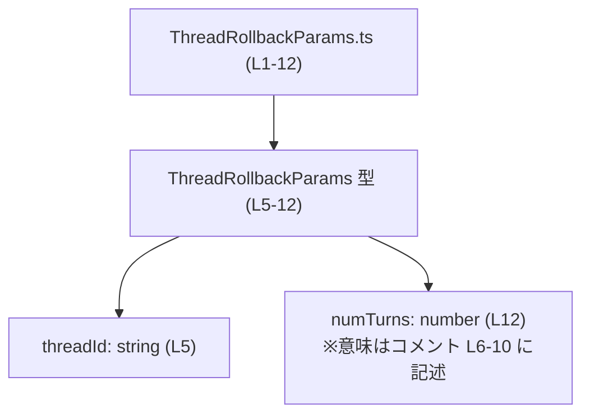
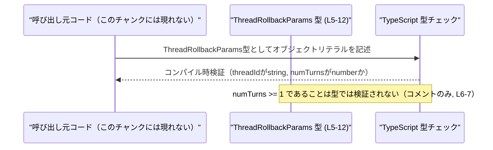

# app-server-protocol/schema/typescript/v2/ThreadRollbackParams.ts コード解説

## 0. ざっくり一言

`ThreadRollbackParams` 型は、「スレッドのロールバック」操作に必要なパラメータ（スレッドIDとロールバックするターン数）を表現するための、生成済み TypeScript 型定義です（ThreadRollbackParams.ts:L1-3, L5-12）。

---

## 1. このモジュールの役割

### 1.1 概要

- このファイルは、`ts-rs` によって自動生成された TypeScript スキーマであり、**スレッドを過去の状態に戻すためのパラメータ**を表現する型 `ThreadRollbackParams` を提供しています（ThreadRollbackParams.ts:L1-3, L5-12）。
- 型はオブジェクト型で、`threadId: string` と `numTurns: number` の2つのプロパティを持ちます（ThreadRollbackParams.ts:L5, L12）。
- コメントにより、`numTurns` は「スレッド末尾から削除するターン数」であり、**1以上であるべき**という契約が記述されています（ThreadRollbackParams.ts:L6-10）。この制約は型では表現されていません。

### 1.2 アーキテクチャ内での位置づけ

ファイルパスから、この型が「アプリケーションサーバプロトコルの TypeScript スキーマ (v2)」の一部であることが示唆されますが、**実際にどのモジュールから参照されているかは、このチャンクには現れません**。

このファイル内のコンポーネント関係を簡単に図示すると、次のようになります。



### 1.3 設計上のポイント（コードから読み取れる範囲）

- **自動生成コードであること**  
  - `// GENERATED CODE! DO NOT MODIFY BY HAND!`（ThreadRollbackParams.ts:L1）  
  - `ts-rs` による生成であり、**手で編集すべきではない**と明示されています（ThreadRollbackParams.ts:L1-3）。
- **純粋な型定義のみ**  
  - 関数・クラス・実行ロジックは一切なく、`export type` によるオブジェクト型エイリアスのみが定義されています（ThreadRollbackParams.ts:L5-12）。
  - したがって、**状態を持つオブジェクトや副作用を起こすコードは存在しません**。
- **契約（仕様）の一部がコメントにのみ存在**  
  - `numTurns` について「Must be >= 1」という条件がコメントで説明されていますが（ThreadRollbackParams.ts:L6-7）、型は単なる `number` であり、この制約は TypeScript の型システムでは表現されていません（ThreadRollbackParams.ts:L12）。
  - コメントには、「スレッドの履歴のみを変更し、エージェントが行ったローカルファイルの変更はロールバックしない」「ローカル変更のロールバックはクライアントの責任」といった仕様も記載されています（ThreadRollbackParams.ts:L8-10）。
- **言語固有の安全性・エラー・並行性の観点**
  - 型が `any` ではなく、`string` と `number` を用いているため、**コンパイル時に型の不一致は検出されます**（ThreadRollbackParams.ts:L5, L12）。
  - ただし、`numTurns >= 1` といったビジネスルールは**型ではチェックされず、実行時ロジック側の検証に委ねられます**。
  - このファイルには非同期処理や共有状態はなく、**並行性（Concurrency）に関する懸念は生じません**。

---

## 2. 主要な機能一覧

このファイルが提供する機能は、次の1点に集約されます（ThreadRollbackParams.ts:L5-12）。

- **スレッドロールバック用パラメータ型の提供**  
  - `ThreadRollbackParams`: スレッドIDとロールバックターン数を保持するオブジェクト型。

---

## 3. 公開 API と詳細解説

### 3.1 コンポーネント・型一覧

このファイル内のコンポーネント（型・プロパティ）のインベントリーです。

#### 型・オブジェクトレベル

| 名前                    | 種別                         | 役割 / 用途                                                                                 | 定義位置                     |
|-------------------------|------------------------------|----------------------------------------------------------------------------------------------|------------------------------|
| `ThreadRollbackParams`  | オブジェクト型エイリアス     | スレッドのロールバック操作に必要なパラメータ（スレッドIDとロールバックターン数）を表現する | ThreadRollbackParams.ts:L5-12 |

#### プロパティレベル

| 親型                  | プロパティ名 | 型       | 説明（コードに基づく）                                                                                                     | 根拠 |
|-----------------------|-------------|----------|----------------------------------------------------------------------------------------------------------------------------|------|
| `ThreadRollbackParams`| `threadId`  | `string` | ロールバック対象となるスレッドの識別子。文字列であることのみが型として保証される                                          | ThreadRollbackParams.ts:L5 |
| `ThreadRollbackParams`| `numTurns`  | `number` | スレッド末尾から削除するターン数。コメント上は「1以上」「スレッドの履歴のみを変更」「ローカルファイル変更は対象外」とされる | ThreadRollbackParams.ts:L6-10, L12 |

> コメントから読み取れる仕様:  
>
> - `numTurns` は「The number of turns to drop from the end of the thread. Must be >= 1.」（ThreadRollbackParams.ts:L6-7）  
> - 「スレッドの履歴のみを変更し、エージェントが行ったローカルファイル変更はロールバックしない」「ロールバックはクライアントの責任」（ThreadRollbackParams.ts:L8-10）

#### 言語固有の型安全性

- `threadId` に数値などを代入しようとすると、**コンパイル時にエラー**になります（`string` 指定のため、ThreadRollbackParams.ts:L5）。
- `numTurns` は `number` 型であり、整数/浮動小数点の区別や 1 以上であることは型では表現されていません（ThreadRollbackParams.ts:L12）。
  - そのため、`0` や `-1`、`1.5` なども、**型的には受け入れられます**。
  - これは仕様コメント（Must be >= 1）とのギャップを生みうる点です（ThreadRollbackParams.ts:L6-7）。

### 3.2 関数詳細

このファイルには、**関数・メソッドは一切定義されていません**（ThreadRollbackParams.ts:L1-12）。

- したがって、「関数詳細テンプレート」に該当する公開 API は存在しません。
- `ThreadRollbackParams` はあくまで **データ構造（型）のみ**を提供します。

### 3.3 その他の関数

- 補助関数やラッパー関数も、このチャンクには存在しません（ThreadRollbackParams.ts:L1-12）。

---

## 4. データフロー

このファイル単体には処理ロジックが存在しないため、**実際にどの関数やサービス間で `ThreadRollbackParams` がやり取りされるかは、このチャンクには現れません**。

ここでは、**TypeScript における型チェックを含む、`ThreadRollbackParams` の概念的な利用イメージ**をシーケンス図として示します（実際の実装詳細は不明であることを明記します）。



**要点**

- データの実際の流れ（どの API でどのように送受信されるか）は不明なので、「呼び出し元コード」は抽象的に表現しています。
- 型レベルでは、
  - `threadId` が文字列であること
  - `numTurns` が数値であること  
  のみが保証されます（ThreadRollbackParams.ts:L5, L12）。
- `numTurns >= 1` という業務的な制約や、「スレッド履歴だけが変更される」「ローカルファイルはクライアントがロールバックする」といった振る舞いは、**コメントにのみ記載されており、型やこのファイルのコードからは強制されません**（ThreadRollbackParams.ts:L6-10）。

---

## 5. 使い方（How to Use）

### 5.1 基本的な使用方法

このファイルは `export type` を提供しているため、他の TypeScript ファイルからインポートして利用することが想定されます。ただし、**実際のインポートパスはこのチャンクには現れません**。

以下は、概念的な使用例です。

```typescript
// 実際のパスはプロジェクト構成によって異なり、このチャンクからは分かりません。
import type { ThreadRollbackParams } from "./ThreadRollbackParams"; // パスは一例

// スレッドロールバック用のパラメータオブジェクトを作成する例
const params: ThreadRollbackParams = {
    threadId: "thread-123", // string 型である必要がある (L5)
    numTurns: 3,            // number 型 (L12)。コメント上は1以上 (L6-7)
};

// 例: どこかのロールバック関数に渡す（関数定義はこのチャンクには現れない）
// rollbackThread(params);
```

この例で TypeScript が保証すること:

- `threadId` に数値を入れるとコンパイルエラーになります。
- `numTurns` に文字列を入れるとコンパイルエラーになります。
- しかし、`numTurns: 0` や `numTurns: -5` を書いても**コンパイルは通る**点に注意が必要です（「Must be >= 1」はコメントのみ、ThreadRollbackParams.ts:L6-7）。

### 5.2 よくある使用パターン（想定される形）

具体的な関数定義はこのチャンクには現れませんが、`ThreadRollbackParams` は以下のような形でパラメータ型として利用されることが自然です（あくまでパターンであり、実在するかは不明です）。

```typescript
// ロールバック操作を行う関数のパラメータとして使うイメージ
function rollbackThread(params: ThreadRollbackParams): Promise<void> {
    // 実際の実装はこのチャンクには存在しない。
    // ここで params.threadId, params.numTurns を利用することが想定される。
    throw new Error("実装はこのチャンクには現れません");
}
```

ここでのポイント:

- 関数の呼び出し側は、`threadId` と `numTurns` を正しい型で渡すことがコンパイル時に保証されます。
- ただし、`numTurns` の値域（1以上であること）を守る責任は、**呼び出し側またはロールバック関数内の実装にあります**。

### 5.3 よくある間違い（起こりうる誤用）

#### 1. `numTurns` の制約を型が守ってくれると誤解する

```typescript
const params: ThreadRollbackParams = {
    threadId: "thread-123",
    numTurns: 0, // コメントの契約 (>= 1, L6-7) に反するが、型としては有効
};
```

- TypeScript は `numTurns` の値の範囲まではチェックしないため、**型エラーになりません**。
- 実際のロールバック処理側では、このような値に対してエラーを返したり、特別な扱いをする必要がある可能性がありますが、その挙動はこのチャンクには現れません。

#### 2. フロート（小数）を渡す

```typescript
const params: ThreadRollbackParams = {
    threadId: "thread-123",
    numTurns: 1.5, // number 型としてはOKだが、「ターン数」として妥当かは不明
};
```

- `number` 型には整数制約がないため、**小数も許されてしまいます**（ThreadRollbackParams.ts:L12）。
- コメント上も「整数であるべき」という明示はなく、「Must be >= 1」にとどまっています（ThreadRollbackParams.ts:L6-7）。  
  ただし、一般的な「ターン数」という意味からは整数が期待される可能性があり、その点は仕様設計に依存します（このチャンクからは断定不能）。

### 5.4 使用上の注意点（まとめ）

**契約・エッジケース**

- `threadId`
  - 空文字列 `""` や存在しないIDを渡した場合の扱いは、このファイルからは分かりません。
  - 型レベルでは「文字列である」ことのみが保証されます（ThreadRollbackParams.ts:L5）。
- `numTurns`
  - コメント上の契約: 「Must be >= 1」（ThreadRollbackParams.ts:L6-7）。
  - 型レベルでは、`number` であれば `0` や負数、小数も許容されます（ThreadRollbackParams.ts:L12）。
  - したがって、**呼び出し側で値域チェックを行うか、受け手側でバリデーションしてエラーを返す必要**があります。
- ローカルファイルの変更ロールバック
  - コメントに「This only modifies the thread's history and does not revert local file changes... Clients are responsible for reverting these changes.」（ThreadRollbackParams.ts:L8-10）とあります。
  - この型を使うクライアントは、「ロールバックAPIがファイル変更を戻してくれない」前提で設計する必要があります。

**言語・安全性・セキュリティ観点**

- 型が `any` ではないため、**基本的な型安全性は確保**されています（ThreadRollbackParams.ts:L5, L12）。
- ただし、値域の制約が型で表現されていないため、不適切な値がサーバや他コンポーネントに渡る可能性があります。
  - これはロジック側での入力検証の有無によっては、バグやセキュリティ問題（極端な大きな `numTurns` による負荷など）につながりうるため、**検証処理が別途存在するかどうかを確認する必要があります**が、このチャンクからは確認できません。
- 並行性・スレッド安全性の問題は、この型自体にはありません。単なるイミュータブルな値オブジェクト（とみなせる構造）です。

**テスト・観測性**

- このファイルにはテストコードやログ出力は含まれていません（ThreadRollbackParams.ts:L1-12）。
- `ThreadRollbackParams` を利用するロジックの単体テスト／統合テストで、`numTurns` の境界値（1, 0, 負数, 大きな値）や `threadId` の異常値を確認する必要がありますが、そのテスト実装はこのチャンクには現れません。

---

## 6. 変更の仕方（How to Modify）

### 6.1 新しい機能を追加する場合（例: フィールド追加）

このファイルは `ts-rs` によって生成されており、冒頭に **「DO NOT MODIFY BY HAND!」** と明記されています（ThreadRollbackParams.ts:L1-3）。

そのため、

- **直接この TypeScript ファイルを編集するのは前提として想定されていません。**
- 新しいフィールド（例: `reason: string` など）を追加したい場合は、
  - `ts-rs` の生成元となる Rust 側の型定義などを修正し、
  - スキーマ生成プロセスを再実行して、このファイルを再生成する  
  というフローになると考えられますが、生成元の構成はこのチャンクには現れません。

変更のステップ（このファイル単体から分かる範囲での一般論）:

1. 生成元（Rust 型など）に目的のフィールドを追加する。  
2. `ts-rs` のコード生成を実行し、新しい `ThreadRollbackParams.ts` を生成する。  
3. この型を使用している呼び出し側コードで、新フィールドの設定・利用を追加する。

### 6.2 既存の機能を変更する場合（例: 型や契約の変更）

`numTurns` の契約をより厳密にしたい、というようなケースを考えます。

- 例: `numTurns` を「1以上の整数」に限定したい場合
  - 現状は単純な `number` であり（ThreadRollbackParams.ts:L12）、コメントでしか制約が表現されていません（ThreadRollbackParams.ts:L6-7）。
  - 型レベルである程度表現したい場合、
    - ブランディング（ブランド型）などで「正の整数」として表現する、
    - `zod` などのバリデーションライブラリを組み合わせる、  
    といった設計が考えられますが、**そのような仕組みはこのファイルには存在しません**。

影響範囲を考えるうえでの注意点（一般論）:

- `ThreadRollbackParams` をパラメータとして受け取る全関数・API の呼び出しコードが影響を受けますが、
  - どのファイルがこの型を使用しているかは、このチャンクには現れません。
- 契約（例: `numTurns >= 1`）を変更する場合は、
  - コメント（ThreadRollbackParams.ts:L6-10）の更新
  - 実際のロールバックロジックやサーバサイド実装の更新
  - テストの更新  
  が必要になると考えられます。

---

## 7. 関連ファイル

このチャンクに現れる情報から、明確に参照できる関連ファイルはありません。

| パス / 種類                          | 役割 / 関係                                                                                  | 備考 |
|--------------------------------------|-----------------------------------------------------------------------------------------------|------|
| Rust 側の元定義ファイル（不明）      | `ts-rs` がこの TypeScript 型を生成する元になった Rust 型定義が存在するはずですが、パスは不明 | コメントから `ts-rs` 利用のみが分かる (L1-3) |
| 同ディレクトリ内の他の schema ファイル（不明） | `v2` スキーマの他の型定義が存在することが想定されますが、このチャンクには現れません          |      |
| `ThreadRollbackParams` を利用するコード（不明） | ロールバック API やサービス実装など。この型をパラメータとして受け取る側のコード               | このチャンクには現れない |

> まとめると、このファイルは **プロトコルスキーマの一部としての型定義のみ** を提供しており、実際のロジックや利用箇所は別ファイルに存在します。それらの構造や動作は、このチャンクだけからは分かりません。
