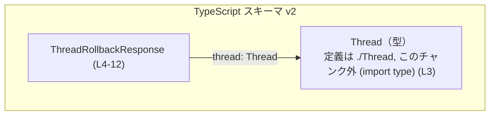
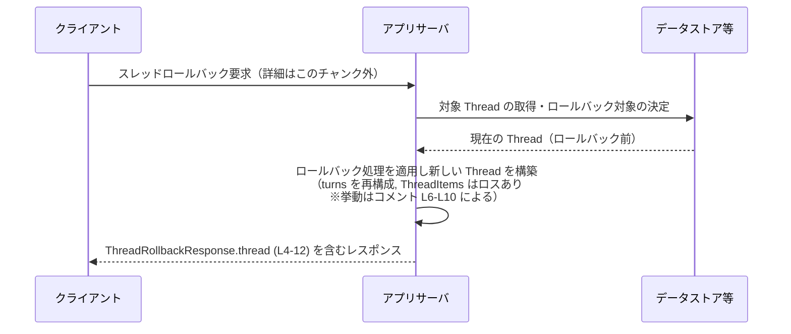

# app-server-protocol/schema/typescript/v2/ThreadRollbackResponse.ts コード解説

---

## 0. ざっくり一言

`ThreadRollbackResponse` は、スレッドのロールバック処理を行った結果として返される「更新済みの Thread」を 1 フィールドで運ぶ TypeScript のレスポンス型定義です（`thread: Thread`）。  
（根拠: `app-server-protocol/schema/typescript/v2/ThreadRollbackResponse.ts:L3-4,L12`）

---

## 1. このモジュールの役割

### 1.1 概要

- このモジュールは、アプリケーションサーバーのプロトコル定義（TypeScript スキーマ）の一部として、**スレッドロールバック処理のレスポンス形** を表現するために存在しています。  
  （根拠: ファイルパス `.../schema/typescript/v2/ThreadRollbackResponse.ts` と型名より）
- レスポンスには、ロールバック適用後の `Thread` が `thread` プロパティとして格納されます。  
  （根拠: L3, L4, L12）
- コメントから、この `Thread` には `turns` が埋められている一方で、各 `Turn` 内の `ThreadItems` は「一部のエージェントインタラクション（例: コマンド実行）」を保持しないロスのある表現であることが分かります。  
  （根拠: L6-L10）

### 1.2 アーキテクチャ内での位置づけ

このファイルは「サーバープロトコルの TypeScript スキーマ層」に属し、アプリケーションサーバーと TypeScript クライアント（フロントエンドや SDK）との間でやり取りされる JSON 等のペイロード形を表現します。  
（根拠: ディレクトリ名 `app-server-protocol/schema/typescript/v2`）

依存関係は次のようになります。



- `ThreadRollbackResponse` は `Thread` 型に依存します（`import type { Thread } from "./Thread";`）。  
  （根拠: L3）
- `Thread` 型の定義内容はこのチャンクには現れません。

### 1.3 設計上のポイント

- **生成コードであること**  
  - 先頭コメントで「GENERATED CODE」「Do not edit this file manually」と明記されています。  
    （根拠: L1-L2）
  - `ts-rs` によって Rust 側の型定義から生成される TypeScript 型であり、人手での編集は想定されていません。  
    （根拠: L2 の `This file was generated by [ts-rs]`）
- **純粋な型定義のみ**  
  - 実行時ロジックや関数は存在せず、`Thread` を含む 1 フィールドのオブジェクト型エイリアスのみをエクスポートしています。  
    （根拠: L3-L4,L12）
- **情報が「ロスのある」スナップショットであることを明示**  
  - コメントで、「各 `Turn` に格納される `ThreadItems` は、コマンド実行など一部のエージェントインタラクションを永続化していないためロスがある」と説明されています。  
    （根拠: L8-L10）
  - また、`thread/resume` と同じ挙動であると明記されていますが、そのエンドポイントの実装や詳細はこのチャンクには現れません。  
    （根拠: L10）
- **状態管理・並行性・エラーハンドリングはこの層では扱わない**  
  - 型定義のみのため、スレッドセーフティやエラー処理は、これを利用する上位レイヤー（API 実装、クライアントコード）側の責務になります。

---

## 2. 主要な機能一覧

このファイルは「機能」というより **データ構造の契約** を 1 つ提供します。

- `ThreadRollbackResponse`: ロールバック適用後の `Thread` を 1 フィールド `thread` に格納したレスポンス型。  
  （根拠: L4,L12）

---

## 3. 公開 API と詳細解説

### 3.1 型一覧（コンポーネントインベントリー）

この節はコンポーネントインベントリーとして、本ファイル内で定義・利用される主な型を一覧します。

| 名前                     | 種別                         | 役割 / 用途                                                                                                  | 定義位置 / 根拠 |
|--------------------------|------------------------------|---------------------------------------------------------------------------------------------------------------|-----------------|
| `ThreadRollbackResponse` | 型エイリアス（オブジェクト） | スレッドロールバック処理のレスポンスとして返される、「ロールバック後の Thread」を含むオブジェクト型         | `ThreadRollbackResponse.ts:L4-12` |
| `Thread`                 | import された型              | スレッド全体を表す型。`thread` フィールドの型として使用され、`turns` プロパティを持つことがコメントから示唆 | import: `ThreadRollbackResponse.ts:L3`（定義は `./Thread` モジュール） |

> ※ `Thread` や `ThreadItems` の構造は、このチャンクには定義がありません（コメント中に名前のみ登場: L6-L10）。

---

### 3.2 重要な型の詳細: `ThreadRollbackResponse`

#### 概要

`ThreadRollbackResponse` は、**ロールバック操作を適用した後のスレッド状態** を返すレスポンスオブジェクトです。フィールドは `thread` の 1 つのみで、その型は `Thread` です。  
（根拠: L3-L4,L6-L10,L12）

```typescript
// 定義（簡略表記）
export type ThreadRollbackResponse = {
    thread: Thread;  // ロールバック後の Thread
};
```

（構文は L4,L12 を読みやすく書き直したものです）

コメントによる補足:

- `thread` はロールバック適用後のスレッドであり、`turns` が埋められている。  
- 各 `Turn` に保存される `ThreadItems` はロスがあり、コマンド実行など一部のエージェントインタラクションは永続化されない。  
- これは `thread/resume` と同じ挙動。  
（根拠: L6-L10）

#### フィールド

| フィールド名 | 型      | 必須か | 説明                                                                                                                                                      | 根拠 |
|--------------|---------|--------|-----------------------------------------------------------------------------------------------------------------------------------------------------------|------|
| `thread`     | `Thread` | 必須   | ロールバック適用後のスレッド。`turns` プロパティが「埋められて」いるが、各 `Turn` 内の `ThreadItems` はコマンド実行など一部のエージェントインタラクションを含まないロスのある状態 | `ThreadRollbackResponse.ts:L4,L6-L10,L12` |

> `Thread` 型の具体的なフィールド構造（`turns` や `ThreadItems` の型定義など）はこのチャンクには現れません。

#### 使用例

この型を使った代表的な利用方法を示します。

##### 例1: API クライアントでレスポンスを受け取る

```typescript
// ThreadRollbackResponse 型をインポートする
import type { ThreadRollbackResponse } from "./ThreadRollbackResponse"; // 相対パスは利用側の構成に合わせて変更

// ロールバックレスポンスを処理する関数例
function handleRollbackResponse(response: ThreadRollbackResponse) {
    // ロールバック後の Thread にアクセスする
    const thread = response.thread;                            // thread は Thread 型

    // コメントから、thread.turns が埋められていると分かる
    // 実際のフィールド構造は ./Thread の定義に依存する（このチャンク外）
    // ここでは存在がコメントで示唆されている turns を読み取るイメージだけ示す
    // (注意: Thread 型に turns があるかどうかは ./Thread の定義で必ず確認すること)
    // console.log(thread.turns);
}
```

- この例では、`ThreadRollbackResponse` 型を使うことで、`response.thread` が必ず存在し `Thread` 型であることをコンパイル時に保証できます。  
  （根拠: L4,L12）

##### 例2: 関数の戻り値型として利用する

```typescript
import type { ThreadRollbackResponse } from "./ThreadRollbackResponse";

// ロールバックを行うラッパー関数の戻り値を型付けする例
async function rollbackThread(/* 引数は実装側で定義 */): Promise<ThreadRollbackResponse> {
    // 実際の API 呼び出しやロールバック処理はこのファイルには出てこないため、ここでは擬似コードのみ示す
    const raw = await someApiCall();                           // 実際の API 呼び出し
    const response = raw as ThreadRollbackResponse;            // 取得したデータを ThreadRollbackResponse として扱う
    return response;
}
```

- `Promise<ThreadRollbackResponse>` と明示することで、呼び出し側は `await rollbackThread()` の結果として `thread` が必ず存在する前提でコードを書けます。

#### Errors / Safety / 並行性

- この型自体は実行時ロジックを持たず、**エラーを直接表現するものではありません**。
  - エラーは別のプロトコル（例: HTTP ステータスコードやエラーレスポンス型）で表現される想定です。このチャンクにはそれらは現れません。
- TypeScript の型チェックにより、`thread` が省略されたオブジェクトを `ThreadRollbackResponse` として扱おうとするとコンパイル時に型エラーになります。  
  （型アノテーションによる安全性）
- 並行性・スレッドセーフティについて:
  - この型は単なるオブジェクトの型定義であり、JavaScript / TypeScript の通常のオブジェクトと同じく**共有・変更は自由**です。
  - 競合状態の制御などは、この型を利用するアプリケーションコード側で行う必要があります。

#### Edge cases（エッジケース）

この型レベルで意識すべき点は以下の通りです。

- **`thread` が欠けているレスポンス**  
  - 型上は `thread` が必須ですが、実際のネットワークレスポンスが欠損している可能性はあります。  
  - 型安全に扱うには、実行時にスキーマ検証（例: Zod, io-ts 等）を行うのが望ましいです。  
  - このファイル自体はその検証ロジックを含みません。
- **`ThreadItems` のロス**  
  - コメントにある通り、`ThreadItems` は全てのエージェントインタラクションを含まない「ロスのある」表現です（例: コマンド実行が永続化されない）。  
    （根拠: L8-L9）
  - そのため、**完全な監査ログや完全再現のための履歴**として `thread` を利用するのは適切ではありません。
- **`thread/resume` との一貫性**  
  - 「`thread/resume` と同じ挙動」とコメントされています（L10）が、このエンドポイントの形式や仕様はこのチャンクには定義されていません。
  - `ThreadRollbackResponse` を扱うコードが `thread/resume` のレスポンスも再利用する場合、両者の `Thread` の構造・意味が同じであることを前提にしている点に注意が必要です。

#### 使用上の注意点

- **生成コードを直接編集しない**  
  - L1-L2 に明示されている通り、このファイルは `ts-rs` によって生成されており、手動編集は想定されていません。
  - スキーマを変更したい場合は、**Rust 側の ts-rs 対象型**を変更してから再生成する必要があります（Rust 側の具体的なファイルや型名はこのチャンクには現れません）。
- **`Thread` 型の詳細を必ず確認すること**  
  - `thread.turns` や `ThreadItems` の構造は、`./Thread` モジュールで定義されています。このチャンクではコメントで名前が言及されるのみで、構造は不明です。  
  - 実装時には `Thread` 型の定義（別ファイル）を必ず参照する必要があります。
- **ロスのあるデータであることを前提に扱うこと**  
  - `ThreadItems` が完全ではないことから、**「すべてのエージェントの振る舞いがこのレスポンスに含まれている」と仮定しないこと**が重要です（監査・再実行・セキュリティ検証用途での過信は危険です）。  
    （根拠: L8-L9）

---

### 3.3 関数について

- このファイルには関数・メソッド・クラス定義は一切含まれていません。  
  （根拠: L1-L12 全体を見ても `function` や `class` 定義が存在しない）

---

## 4. データフロー

この型は「ロールバック処理の結果をクライアントに返す」シナリオで利用されると考えられます（型名とコメントからの推測であり、具体的なエンドポイント名や実装はこのチャンクには現れません）。

典型的なフローのイメージ:

1. クライアントがあるスレッドに対して「ロールバック」を要求する。
2. サーバー側のロジックが対象スレッドを取得し、指定されたポイントまでロールバックする。
3. ロールバック後の `Thread` を構築し、`thread` フィールドに格納して `ThreadRollbackResponse` としてシリアライズする。
4. クライアントはレスポンスをデシリアライズし、`thread` を UI などに反映する。

これをシーケンス図で表します（`ThreadRollbackResponse.thread` の定義範囲を明示）。



> 注意: 上記は「型名とコメントから読み取れる一般的な利用像」を示したものであり、実際のエンドポイント名・URL・認証方法等はこのチャンクには定義されていません。

---

## 5. 使い方（How to Use）

### 5.1 基本的な使用方法

`ThreadRollbackResponse` を利用する典型的な流れは、**API から受け取った JSON を型付けして扱う**ことです。

```typescript
// schema 側から型をインポートする
import type { ThreadRollbackResponse } from "./schema/typescript/v2/ThreadRollbackResponse"; // 実際のパスはプロジェクト構成に依存

// ロールバックレスポンスを処理するユーティリティ関数の例
function applyRollbackResult(raw: unknown): void {
    // 実運用ではここで JSON スキーマ検証を行うのが望ましい
    const res = raw as ThreadRollbackResponse;       // ThreadRollbackResponse として扱う（型アサーション）

    // ロールバック後の Thread を利用する
    const thread = res.thread;                       // thread は Thread 型

    // ここで thread を UI 状態に反映したり、ストアに保存したりする
    // thread のフィールド構造は ./Thread の定義に従う
}
```

- TypeScript の型アノテーションにより、`res.thread` が存在しないコードはコンパイル時に検出されます。
- ただし、実行時には `raw` の形が保証されないため、必要に応じてランタイムバリデーションを追加することが推奨されます（このファイルには含まれません）。

### 5.2 よくある使用パターン

1. **HTTP クライアントの戻り値型として利用**

   ```typescript
   import type { ThreadRollbackResponse } from "./schema/typescript/v2/ThreadRollbackResponse";

   // 実際のエンドポイントパスや引数はプロジェクト固有のため、ここでは抽象的に記述します
   async function fetchRollbackResult(/* params */): Promise<ThreadRollbackResponse> {
       const res = await fetch(/* API の URL */);
       if (!res.ok) {
           throw new Error("Rollback request failed");
       }

       const json = await res.json();
       // 実運用ではここでスキーマ検証を行う
       return json as ThreadRollbackResponse;
   }
   ```

2. **ストアや状態管理の型として利用**

   ```typescript
   import type { ThreadRollbackResponse } from "./schema/typescript/v2/ThreadRollbackResponse";

   interface RollbackState {
       lastResponse: ThreadRollbackResponse | null;  // 直近のロールバック結果
   }

   const state: RollbackState = {
       lastResponse: null,
   };
   ```

### 5.3 よくある間違い

```typescript
// 誤り例: ThreadRollbackResponse の構造を満たしていないオブジェクトに型アサーションだけ行う
const bad: ThreadRollbackResponse = {} as ThreadRollbackResponse;
// 実行時には bad.thread が undefined になりうる

// 正しい例: 実際に thread フィールドを持つオブジェクトを用意する
import type { Thread } from "./schema/typescript/v2/Thread";

const good: ThreadRollbackResponse = {
    thread: {} as Thread,               // Thread の実際の構造に合わせる必要がある（ここでは簡略化のため as Thread）
};
```

- **誤り**: 形の合っていないオブジェクトに対して `as ThreadRollbackResponse` とだけ書くと、TypeScript の型システムのチェックをすり抜けてしまい、実行時に `undefined` アクセスが発生する可能性があります。
- **注意**: 生成スキーマ型を使う場合、**実行時のバリデーション**を合わせて導入するのが安全です。

### 5.4 使用上の注意点（まとめ）

- `ThreadRollbackResponse` は **thread フィールドが必須**である契約を表現しているが、実行時データが常にその契約を満たすとは限らないため、必要に応じて JSON スキーマ検証を行う。
- `ThreadItems` がロスのあるデータであることから、このレスポンスを完全な履歴や監査ログとして扱わない。
- ファイル自体は `ts-rs` により生成されるため、**直接編集しない**（Rust 側の定義を変更して再生成する）。

---

## 6. 変更の仕方（How to Modify）

### 6.1 新しい機能を追加する場合

このファイルは生成コードであり、直接編集すべきではないことが明記されています。  
（根拠: L1-L2）

新しいフィールドを `ThreadRollbackResponse` に追加したい場合の一般的な流れは、次のようになります（Rust 側の構成はこのチャンクには出てこないため抽象的に記述します）。

1. **Rust 側の ts-rs 対象型を変更する**  
   - `ThreadRollbackResponse` に対応する Rust の構造体または型を探し、新しいフィールドを追加します。
2. **ts-rs による TypeScript 型の再生成を行う**  
   - プロジェクトで使用している ts-rs のビルドステップやスクリプトを実行し、`ThreadRollbackResponse.ts` を再生成します。
3. **TypeScript 側の利用コードを更新する**  
   - 新しいフィールドを利用するコードを追加し、コンパイラエラーが出ていないことを確認します。
   - 既存コードが新フィールドに依存しない場合は、そのままでもコンパイルは通るはずです。

### 6.2 既存の機能を変更する場合

- **`thread` の型や意味を変更する場合**  
  - `Thread` 型自体の変更は `./Thread` モジュール側で行われます（このチャンクにはその定義はありません）。  
  - `Thread` のフィールドを追加・削除・意味変更すると、`ThreadRollbackResponse.thread` を利用する全コードに影響します。
- **影響範囲の確認**  
  - TypeScript の型定義を変更した後は、コンパイルを実行し、`ThreadRollbackResponse` や `Thread` を使っている箇所でコンパイルエラーが発生していないか確認するのが有効です。
- **契約変更に伴う注意点**  
  - 例えば `thread` をオプショナル（`thread?: Thread`）に変更すると、クライアント側では `response.thread` の存在チェックが必須になります。
  - 逆に、いま必須であること（ロールバックが成功したときのみこのレスポンスが返る等）が重要な契約であれば、その前提が崩れないように注意する必要があります。
  - これらの仕様レベルの取り決めはこのファイルには書かれていないため、上位の API ドキュメントや実装を合わせて確認する必要があります。

---

## 7. 関連ファイル

| パス                                                         | 役割 / 関係                                                                                                                                     | 根拠 |
|--------------------------------------------------------------|--------------------------------------------------------------------------------------------------------------------------------------------------|------|
| `app-server-protocol/schema/typescript/v2/ThreadRollbackResponse.ts` | 本ドキュメントの対象ファイル。`ThreadRollbackResponse` 型を定義し、`thread: Thread` フィールドを持つ。                                         | 定義: L4-12 |
| `app-server-protocol/schema/typescript/v2/Thread.ts`（想定パス） | `ThreadRollbackResponse` が import している `Thread` 型の定義ファイル。スレッド構造や `turns`・`ThreadItems` の詳細はこのファイル側に存在する。 | import: L3（相対パス `"./Thread"` から推定） |

> 注: `Thread.ts` の具体的な内容や存在は、このチャンクには直接含まれていませんが、`import type { Thread } from "./Thread";`（L3）から、同一ディレクトリに `Thread` 型定義モジュールが存在すると判断できます。
