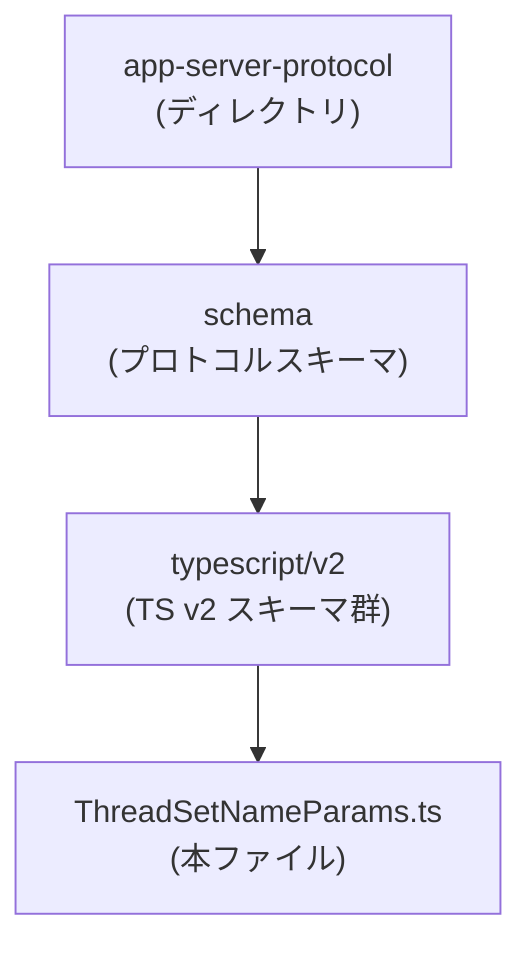
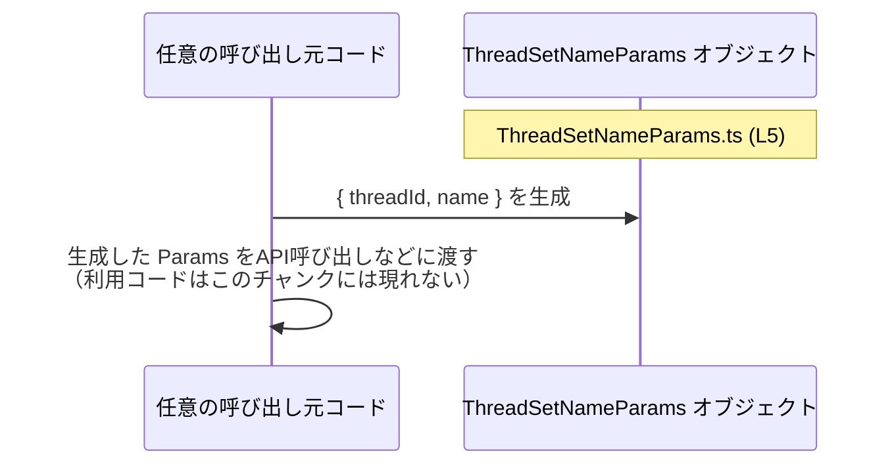

# app-server-protocol/schema/typescript/v2/ThreadSetNameParams.ts

## 0. ざっくり一言

- スレッドの名前を設定する際に使う、「スレッドID」と「新しい名前」をまとめた TypeScript のパラメータ型エイリアスです（自動生成ファイルです）。

---

## 1. このモジュールの役割

### 1.1 概要

- このモジュールは、アプリケーションサーバーのプロトコル層で使う **「スレッド名変更リクエストのパラメータ」** を表現するために存在しています。
- 型エイリアス `ThreadSetNameParams` は、`threadId` と `name` という 2 つの文字列フィールドを持つオブジェクト形状を定義します。  
  根拠: `ThreadSetNameParams.ts:L5-5`

### 1.2 アーキテクチャ内での位置づけ

コメントとファイルパスから、**プロトコルスキーマの TypeScript 表現の一部**であり、Rust 側の型定義から ts-rs によって自動生成されていることが分かります。

- 自動生成であること  
  根拠: `ThreadSetNameParams.ts:L1-3`



> このチャートは、**ディレクトリ構造**から分かる範囲のみを示しています。他モジュールとの依存や実際の呼び出し関係は、このチャンクには現れないため不明です。

### 1.3 設計上のポイント

- **自動生成ファイル**  
  - 冒頭コメントで「GENERATED CODE」「Do not edit this file manually」と明示されています。  
    根拠: `ThreadSetNameParams.ts:L1-3`
- **データ専用の型定義**  
  - 実行ロジックや関数は一切なく、データ形状のみを表現します。  
    根拠: `ThreadSetNameParams.ts:L5-5`
- **必須フィールドのみ**  
  - `threadId: string` と `name: string` の 2 フィールドがあり、オプショナル指定（`?`）はありません。  
    根拠: `ThreadSetNameParams.ts:L5-5`
- **公開 API**  
  - `export type` により、この型はモジュール外から利用されることが想定されています。  
    根拠: `ThreadSetNameParams.ts:L5-5`

---

## 2. 主要な機能一覧

このファイルは関数を持たず、次の 1 つの型だけを提供します。

- `ThreadSetNameParams`: スレッド名変更用のパラメータオブジェクトの形状を定義する型エイリアス。

---

## 3. 公開 API と詳細解説

### 3.1 型一覧（構造体・列挙体など）

#### コンポーネントインベントリー（このチャンク）

| 名前                  | 種別       | 役割 / 用途                                           | 定義位置                                   |
|-----------------------|------------|--------------------------------------------------------|--------------------------------------------|
| `ThreadSetNameParams` | 型エイリアス | スレッド名変更リクエストのパラメータオブジェクト形状 | `ThreadSetNameParams.ts:L5-5`              |

#### `ThreadSetNameParams`

```typescript
export type ThreadSetNameParams = { threadId: string, name: string, };
```

**概要**

- スレッドの識別子と、新しく設定したいスレッド名をまとめて渡すためのパラメータ型です。  
  根拠: `ThreadSetNameParams.ts:L5-5`

**フィールド一覧**

| フィールド名 | 型      | 説明                                             | 必須/任意 | 根拠                             |
|--------------|---------|--------------------------------------------------|-----------|----------------------------------|
| `threadId`   | string  | 対象スレッドを一意に識別する ID を表します       | 必須      | `ThreadSetNameParams.ts:L5-5`    |
| `name`       | string  | 設定したい新しいスレッド名を表します             | 必須      | `ThreadSetNameParams.ts:L5-5`    |

**型の性質（TypeScript 観点の安全性・エラー・並行性）**

- **型安全性**
  - コンパイル時に `threadId` と `name` が必ず `string` であることがチェックされます。
  - 片方を欠いたオブジェクトを `ThreadSetNameParams` として扱おうとすると、TypeScript コンパイラエラーになります。
- **実行時エラー**
  - この型定義自体には実行時処理がなく、直接的な例外やエラーは発生しません。
  - 実行時には型情報が消えるため、呼び出し側が不正な値（例: `null`, `undefined`, 異常フォーマットの文字列）を入れても、この型だけでは防げません。
- **並行性**
  - TypeScript/JavaScript の通常のオブジェクトと同じく、この型には並行性制御に関する特別な仕組みはありません。
  - 共有状態を書き換えるようなフィールドはなく、単なるデータスナップショットとして扱われます。

**エッジケース**

この型自体にロジックはありませんが、利用時に考えられる典型的なケースを挙げます。

- 空文字列:
  - `threadId: ""` や `name: ""` も `string` としては許容されます（静的型チェックでは弾かれません）。
- `null` や `undefined`:
  - `strictNullChecks` が `true` であれば、`threadId: null` のような代入はコンパイルエラーになります。
  - `strictNullChecks` が `false` なプロジェクトでは、`string` に `null` や `undefined` が代入可能になるため注意が必要です。
- フィールド不足:
  - `{ threadId: "id-only" }` のように `name` が欠けているとコンパイルエラーになります。

**使用上の注意点**

- このファイルはコメントで「手で編集しないこと」と明記されています。変更が必要な場合は **生成元（Rust 側など）で行う必要があります**。  
  根拠: `ThreadSetNameParams.ts:L1-3`
- 値の妥当性（文字列長、禁止文字、フォーマットなど）はこの型では表現されていません。必要であれば別途バリデーションロジックが必要です。
- `threadId` と `name` は両方必須であり、省略可能にしたい場合は、別の型エイリアスを定義するか、生成元で変更する必要があります。

### 3.2 関数詳細（最大 7 件）

- このファイルには関数・メソッドの定義は **ありません**。  
  根拠: ファイル全体 (`ThreadSetNameParams.ts:L1-5`) に `function` や `=>` などの関数定義は存在しません。

### 3.3 その他の関数

- 補助関数やラッパー関数も存在しません。

---

## 4. データフロー

このチャンクには `ThreadSetNameParams` をどこから・どのように使うかという呼び出しコードは含まれていません。そのため、**正確な呼び出し元・呼び出し先モジュールは特定できません**。

ここでは、**一般的な利用パターンの例**として、任意の呼び出し元コードがこの型を使う流れを抽象的に示します（本リポジトリ固有の仕様として断定はできません）。



要点:

- `ThreadSetNameParams` は、何らかの「スレッド名変更」用途の API・関数に渡されるパラメータであることが想定されますが、**具体的な API 名やエンドポイントはこのチャンクからは分かりません**。
- データの流れとしては、「呼び出し元コードでオブジェクト生成 → どこかの送信/処理ロジックへ渡す」という形になると考えられます（一般的なパラメータ型の使われ方としての説明です）。

---

## 5. 使い方（How to Use）

### 5.1 基本的な使用方法

同一ディレクトリからこの型を利用する、最小限の例です（**import パスは利用側ファイルの位置に応じて調整が必要です**）。

```typescript
// ThreadSetNameParams 型をインポートする
import type { ThreadSetNameParams } from "./ThreadSetNameParams";

// スレッド名を更新するためのパラメータオブジェクトを作成する
const params: ThreadSetNameParams = {
    threadId: "thread-1234",       // 対象スレッドのID
    name: "サポートチャット #1",   // 新しいスレッド名
};

// ここで params を実際の API 呼び出しやメッセージ送信に利用する
// sendThreadSetName(params);  // ※この関数はこのチャンクには存在しません（例示）
```

この例では、TypeScript の型システムにより:

- `threadId` または `name` を書き忘れるとコンパイルエラーになります。
- `threadId` や `name` に数値など非文字列型を代入するとコンパイルエラーになります。

### 5.2 よくある使用パターン

推測であることを明示したうえで、一般的に想定されるパターンを 2 点挙げます。

1. **同期/非同期 API 呼び出しのパラメータとして使う（一般的な例）**

   ```typescript
   async function renameThread(params: ThreadSetNameParams): Promise<void> {
       // 実際にはここで HTTP リクエストやソケット送信などを行うと想定されます
       // このチャンクには具体的な送信処理は含まれていません。
   }

   const params: ThreadSetNameParams = { threadId: "t-1", name: "新しい名前" };
   await renameThread(params);
   ```

2. **UI フォーム入力の結果を詰める（一般的な例）**

   ```typescript
   function buildParamsFromForm(threadId: string, inputName: string): ThreadSetNameParams {
       // ここで inputName のバリデーション等を行うのが一般的です
       return { threadId, name: inputName };
   }
   ```

> 上記の関数や処理は「一般的な利用パターン」の例であり、**本リポジトリ内にこれらの関数が存在することを意味しません**。

### 5.3 よくある間違い

```typescript
// 間違い例: 必須フィールド name を指定していない
const badParams1: ThreadSetNameParams = {
    threadId: "thread-1234",
    // name が欠けているためコンパイルエラー
};

// 間違い例: 型が一致していない
const badParams2: ThreadSetNameParams = {
    threadId: 1234,            // number は string 型に割り当てられない
    name: "サポートチャット",
};

// 正しい例
const goodParams: ThreadSetNameParams = {
    threadId: "thread-1234",
    name: "サポートチャット",
};
```

### 5.4 使用上の注意点（まとめ）

- **自動生成ファイルを直接編集しない**
  - コメントで「手で変更しない」と明示されています。変更は生成元（おそらく Rust 側の型定義）で行う必要があります。  
    根拠: `ThreadSetNameParams.ts:L1-3`
- **型は構造だけを保証し、値の妥当性は保証しない**
  - 空文字列や極端に長い文字列などを防ぐには、別途バリデーションが必要です。
- **`strictNullChecks` の有無に注意**
  - プロジェクト設定によっては `string` に `null` や `undefined` が割り当てられてしまうため、`tsconfig.json` の設定を確認する必要があります。
- **並行性・スレッドセーフティはこの型の関心事ではない**
  - どのスレッド（または非同期コンテキスト）からでも同じ形で利用できますが、同時に複数箇所から異なる値をセットするような競合状態の扱いは、呼び出し側のロジックに依存します。

---

## 6. 変更の仕方（How to Modify）

### 6.1 新しい機能を追加する場合

このファイルは ts-rs による自動生成であり、コメントに「Do not edit this file manually」とあるため、**直接の編集は推奨されません**。  
根拠: `ThreadSetNameParams.ts:L1-3`

一般的な変更手順（推測を含みますが、その旨明示します）:

1. **生成元の型定義を特定する（推測）**
   - ts-rs は Rust の struct/enum に `#[derive(TS)]` などを付与して TypeScript 型を生成するライブラリとして知られています。
   - 生成元の Rust 型定義を修正する必要がありますが、このチャンクにはその場所に関する情報はありません（**ファイル名・モジュール名は不明**）。
2. **生成元にフィールド等を追加・変更する**
   - 例: 新しいプロパティ `description: String` を追加するなど。
3. **コード生成を再実行する**
   - ビルドスクリプトや専用コマンドで ts-rs により TypeScript ファイルを再生成します。
   - この手順も、現チャンクからは具体的なコマンドは分かりません。

### 6.2 既存の機能を変更する場合

- `threadId`／`name` の型や必須性を変更したい場合も、**生成元の型定義を変更して再生成する**必要があります。
- 変更時に注意すべき点:
  - `ThreadSetNameParams` を参照している他の TypeScript ファイルすべてに影響しますが、このチャンクにはそれらの参照箇所は現れていないため、具体的な影響範囲は不明です。
  - 返り値やエラー型などの「契約」はこの型にはなく、**構造的契約（フィールド名と型）**のみが存在します。そのため、フィールド名の変更は後方互換性を壊す可能性があります。

---

## 7. 関連ファイル

このチャンクには import/export で他ファイルを参照する記述がなく、**直接の依存関係は特定できません**。

| パス / 名称                             | 役割 / 関係                                                                                       |
|----------------------------------------|----------------------------------------------------------------------------------------------------|
| （不明）Rust 側の元型定義（推測）      | コメントから ts-rs による自動生成であることが分かるため、Rust 側に対応する型が存在すると考えられますが、ファイルパスや型名はこのチャンクには現れません。 |
| （不明）呼び出し側 TypeScript コード   | `ThreadSetNameParams` を import して利用するコードが存在すると考えられますが、このチャンクには現れません。 |

> したがって、関連ファイルを調査するには、リポジトリ全体で `ThreadSetNameParams` を検索するなどの追加作業が必要になります。この情報は本ファイル単体からは取得できません。
