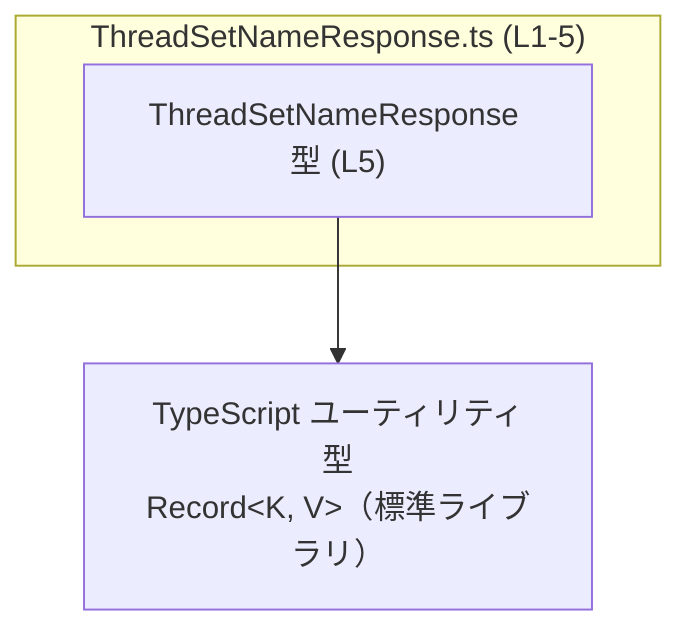
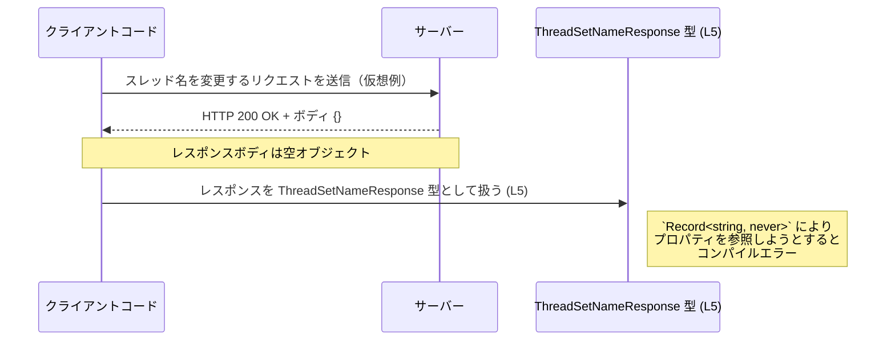

# app-server-protocol/schema/typescript/v2/ThreadSetNameResponse.ts

## 0. ざっくり一言

このファイルは、`ThreadSetNameResponse` という TypeScript の型エイリアスを 1 つだけ定義しており、その中身は `Record<string, never>`、つまりプロパティを持たないオブジェクト型として表現されています（`ThreadSetNameResponse.ts:L5-5`）。

---

## 1. このモジュールの役割

### 1.1 概要

- このモジュールは、`ThreadSetNameResponse` というレスポンス用と思われる型を TypeScript で表現するための **スキーマ定義ファイル**です（型名からの推測であり、用途自体はこのチャンクからは確定できません）。
- Rust から TypeScript 型を生成するツール `ts-rs` により自動生成されており、手動編集しないことが明示されています（`ThreadSetNameResponse.ts:L1-3`）。
- 実行時ロジックは一切持たず、**コンパイル時の型チェック専用**のモジュールです（`ThreadSetNameResponse.ts:L5-5`）。

### 1.2 アーキテクチャ内での位置づけ

- 依存関係として、TypeScript 標準ライブラリで提供されるユーティリティ型 `Record<K, V>` を利用しています（`ThreadSetNameResponse.ts:L5-5`）。
- 他のアプリケーションコード（API クライアント、サーバー実装など）からは、この型が戻り値やレスポンスボディの型として参照されることが想定されますが、その具体的な呼び出し元はこのチャンクには現れません。

依存関係を簡略化して図示すると、次のようになります。



### 1.3 設計上のポイント

- **自動生成コード**  
  - 冒頭コメントで「GENERATED CODE」「Do not edit this file manually」と明示されています（`ThreadSetNameResponse.ts:L1-3`）。
  - 設計・変更は元となる Rust 型定義および `ts-rs` の設定側で行う前提です。
- **状態を持たない**  
  - 実行時のクラスや関数は存在せず、型エイリアスのみです（`ThreadSetNameResponse.ts:L5-5`）。
  - したがって、このファイル単体では状態や副作用を扱いません。
- **空オブジェクトとしてのレスポンス表現**  
  - `Record<string, never>` により、「どの文字列キーのプロパティも存在しない」ことを型レベルで表現しています（`ThreadSetNameResponse.ts:L5-5`）。
- **エラーハンドリング／並行性**  
  - 実行時の処理がなく、エラーや並行処理（非同期処理・スレッド）の制御は一切行っていません。
  - 安全性は TypeScript の静的型検査にのみ依存しています。

---

## 2. 主要な機能一覧（コンポーネントインベントリー）

このファイルに含まれるコンポーネントは 1 つだけです。

| 名前                     | 種別              | 役割 / 用途                                                                 | 定義位置                          |
|--------------------------|-------------------|-----------------------------------------------------------------------------|-----------------------------------|
| `ThreadSetNameResponse` | 型エイリアス      | プロパティを持たないオブジェクト型としてレスポンスを表現するための型定義  | `ThreadSetNameResponse.ts:L5-5`   |

---

## 3. 公開 API と詳細解説

### 3.1 型一覧（構造体・列挙体など）

| 名前                     | 種別              | 役割 / 用途                                                                                 | 底層型 / フィールド概要                     | 定義位置                          |
|--------------------------|-------------------|---------------------------------------------------------------------------------------------|--------------------------------------------|-----------------------------------|
| `ThreadSetNameResponse` | 型エイリアス      | プロパティを持たないレスポンスオブジェクト型を表現（レスポンス用途は型名からの推測）       | `Record<string, never>`：任意キーが `never` 型 | `ThreadSetNameResponse.ts:L5-5`   |

**TypeScript 的な意味**

- `Record<string, never>` は「任意の文字列キーを持ちうるが、その値は `never` 型であるオブジェクト型」を意味します（`ThreadSetNameResponse.ts:L5-5`）。
- `never` 型には通常の値を代入できないため、実質的には「どのプロパティも存在しない」オブジェクト型として機能します。
- そのため TypeScript の構造的型システムの下では、「プロパティを持たない空オブジェクト」を表現するのに使われます。

### 3.2 関数詳細

このファイルには関数・メソッドは一切定義されていません（`ThreadSetNameResponse.ts:L1-5`）。  
そのため、「関数詳細テンプレート」を適用できる対象はありません。

### 3.3 その他の関数

| 関数名 | 役割（1 行） |
|--------|--------------|
| （なし） | このファイルには関数は定義されていません |

---

## 4. データフロー

### 4.1 型レベルでのデータフロー

このファイル自体は型定義のみで、実行時の処理フローは含まれていません。  
ここでは、**説明用の仮想例**として、`ThreadSetNameResponse` 型が API クライアントのレスポンス型として使われる場合のイメージを示します（実際のリポジトリ構成にこのコードが存在することを意味しません）。



この図は、「`ThreadSetNameResponse` 型（`ThreadSetNameResponse.ts:L5-5`）が空オブジェクトレスポンスを表すために使われる」という典型イメージを表しています。

---

## 5. 使い方（How to Use）

### 5.1 基本的な使用方法

ここでは、この型を API クライアント側で利用する**仮想的な例**を示します。

```typescript
// 説明用の仮想コード。実際のパスはプロジェクト構成に応じて変更が必要です。
import type { ThreadSetNameResponse } from "./schema/typescript/v2/ThreadSetNameResponse"; // ThreadSetNameResponse 型をインポート

// スレッド名を変更する API を呼び出す仮想関数
async function setThreadName(threadId: string, newName: string): Promise<ThreadSetNameResponse> {
    // fetch などでサーバーを呼び出す（詳細は説明用のダミー）
    const response = await fetch(`/api/threads/${threadId}/name`, {           // HTTP リクエストを送信
        method: "PUT",
        headers: { "Content-Type": "application/json" },
        body: JSON.stringify({ name: newName }),
    });

    // 空のレスポンスボディを期待する例
    if (!response.ok) {
        throw new Error("Failed to set thread name.");
    }

    // 通常は JSON をパースするが、この型は空オブジェクトを想定しているので、
    // ここでは空オブジェクトを返す例を示す
    const result: ThreadSetNameResponse = {};                                  // OK: {} は Record<string, never> と互換
    return result;                                                             // 呼び出し元に返す
}

// 呼び出し側の例
async function example() {
    const res = await setThreadName("thread-1", "新しい名前");                // res は ThreadSetNameResponse 型

    // res のプロパティを参照しようとするとコンパイルエラー
    // res.someField;  // エラー: プロパティ 'someField' は存在しない
}
```

この例から分かるポイント:

- `ThreadSetNameResponse` は「プロパティを参照できない」ことを型レベルで保証します。
- 実行時には `{}` のような空オブジェクトを扱うことが多くなります。
- TypeScript の型は **実行時に JSON の内容を検証しない**ため、実際にサーバーがどのようなボディを返すかは別途確認・バリデーションが必要です。

### 5.2 よくある使用パターン

この型の設計から想定される一般的なパターンを挙げます（本リポジトリ内で実際にそう使われているかは、このチャンクからは不明です）。

1. **「成功だが追加情報のない」操作のレスポンス型**

   - データを返さない API（例: 削除・更新）で、HTTP 200 などステータスコードのみが意味を持ち、ボディは `{}（空）` とする場合に対応する型として利用されます。
   - メリット:  
     - 呼び出し側がレスポンスのプロパティに依存しないことを TypeScript が保証します。
     - 「何も返さない」`void` ではなく、「空オブジェクトを返す」というプロトコル上の仕様を明示できます。

2. **高レベルラッパーの戻り値型**

   - 例えば、HTTP クライアントのラッパー関数が `Promise<ThreadSetNameResponse>` を返すようにし、「レスポンスボディに意味のある情報はない」ことを示す用途が考えられます。

### 5.3 よくある間違い（想定）

`ThreadSetNameResponse` の構造から起こりやすい誤用と、その修正版を示します。

```typescript
import type { ThreadSetNameResponse } from "./schema/typescript/v2/ThreadSetNameResponse";

// 間違い例: プロパティを持つオブジェクトを代入しようとしている
const bad: ThreadSetNameResponse = {
    success: true,          // エラー: 型 'boolean' を型 'never' に割り当てることはできない
};

// 正しい例: 空オブジェクトを代入する
const ok: ThreadSetNameResponse = {};   // OK: プロパティなしのオブジェクト
```

```typescript
declare const res: ThreadSetNameResponse;

// 間違い例: 存在しないプロパティにアクセスしようとしている
// const flag = res.success; // エラー: プロパティ 'success' は型 'ThreadSetNameResponse' に存在しない

// 正しい例: res は「何も持っていない」ことが前提なので、
// プロパティに依存したロジックを書かない。
```

### 5.4 使用上の注意点（まとめ）

- **プロパティを追加しない前提**  
  - `ThreadSetNameResponse` にプロパティを追加して使用することは想定されていません。`Record<string, never>` によりコンパイルエラーになります（`ThreadSetNameResponse.ts:L5-5`）。
- **実行時の JSON との整合性**  
  - TypeScript の型はコンパイル時のみ有効であり、実行時に「本当に空オブジェクトか」を検証しません。  
    API が実際にどのようなレスポンスを返すかは、別途仕様・テスト・バリデーションで確認する必要があります。
- **並行性・エラー処理は別レイヤー**  
  - 非同期処理（`async/await`）やエラーハンドリング（`try/catch`）は、この型ではなく呼び出し側のロジックで実装する必要があります。

---

## 6. 変更の仕方（How to Modify）

### 6.1 新しい機能を追加する場合

このファイルは自動生成コードであり、ヘッダーコメントに「Do not edit this file manually」と明記されています（`ThreadSetNameResponse.ts:L1-3`）。  
そのため、**直接この TypeScript ファイルを編集するのではなく、元になっている Rust 側の型定義を変更し、`ts-rs` で再生成する**必要があります。

一般的な手順（Rust 側があると仮定した場合のイメージ）:

1. **Rust 側の型を変更**  
   - 例えば `struct ThreadSetNameResponse { /* フィールド追加など */ }` のような定義を変更する（Rust 側の実際の型名・内容はこのチャンクには現れません）。
2. **`ts-rs` の派生属性を確認**  
   - Rust 型に `#[derive(TS)]` などが付いている場合、その設定を見直します（詳細は ts-rs のドキュメントに依存します）。
3. **コード生成を再実行**  
   - ビルドスクリプトや専用コマンドを実行し、`ThreadSetNameResponse.ts` を再生成します。
4. **TypeScript 側のコンパイルを実行**  
   - 変更された型に依存している TypeScript コードがコンパイルエラーになっていないか確認します。

### 6.2 既存の機能を変更する場合

「空オブジェクト型である」という前提を変更したい場合の注意点:

- **影響範囲の確認**
  - プロジェクト内で `ThreadSetNameResponse` を参照している場所をすべて検索し、「プロパティにアクセスしていないか」「空であることを前提にしていないか」を確認する必要があります。
- **契約（前提条件）の変化**
  - 現在は「プロパティを持たない」契約になっています（`Record<string, never>`）。  
    フィールドを追加する場合、この契約が変わるため、サーバー実装やクライアント実装、ドキュメントとの整合性を確認する必要があります。
- **テストの見直し**
  - API レスポンスを検証するテストがある場合、「空オブジェクト」を前提にしていないかを確認し、必要に応じて期待値を更新します。

---

## 7. 関連ファイル

このチャンクから確実に特定できるのは、「このファイルが `ts-rs` によって生成された」という点のみです（`ThreadSetNameResponse.ts:L1-3`）。  
元となる Rust ファイルや、実際にこの型を利用している TypeScript ファイルのパスは、このチャンクには現れません。

| パス / コンポーネント | 役割 / 関係 |
|------------------------|------------|
| （Rust 側の元型定義）  | `ts-rs` によって本ファイルを生成するためのソース。ファイル名・パスはこのチャンクでは不明。 |
| `ts-rs`（ツール）      | Rust 型から TypeScript 型定義を生成するツール。本ファイルの冒頭コメントに名前のみ登場（`ThreadSetNameResponse.ts:L3-3`）。 |
| （利用側 TypeScript コード） | `ThreadSetNameResponse` を import してレスポンス型として利用するコード。具体的なファイルはこのチャンクには現れません。 |

---

### Bugs / Security / Contracts / Edge Cases / Tests / パフォーマンス について

このファイルは 1 行の型エイリアス定義のみであり（`ThreadSetNameResponse.ts:L5-5`）、実行時ロジックを持たないため:

- **バグ・セキュリティ**  
  - 実行時のバグや脆弱性は、このファイル単体からは発生しません。  
  - ただし、サーバーが実際にはプロパティ付きの JSON を返すのに、この型が空オブジェクトを表す場合、**型定義と実体の不整合**がバグやセキュリティ問題（想定外データの無視など）の原因になりえます。
- **Contracts（契約）**  
  - 型レベルの契約は「プロパティを持たないオブジェクト」という点に集約されます（`Record<string, never>`）。
- **Edge Cases**  
  - 空オブジェクト `{}` を扱うこと自体はエッジケースではなく、「常に空であること」が前提です。
- **Tests**  
  - このファイル自体をテストすることは通常不要で、テストは「この型を使用するコード」や「API の実レスポンス」に対して行うことになります。
- **Performance / Scalability**  
  - コンパイル時の型定義のみであり、実行時パフォーマンスやスケーラビリティへの直接の影響はありません。

以上のように、このファイルは「プロトコル／スキーマの一部としての空レスポンス型」を TypeScript で表現するための最小限のコンポーネントとなっています。
