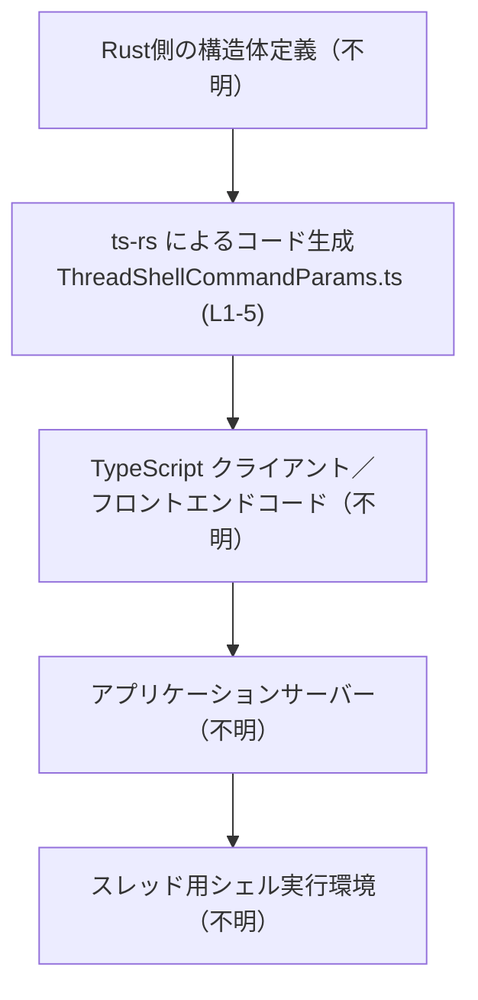
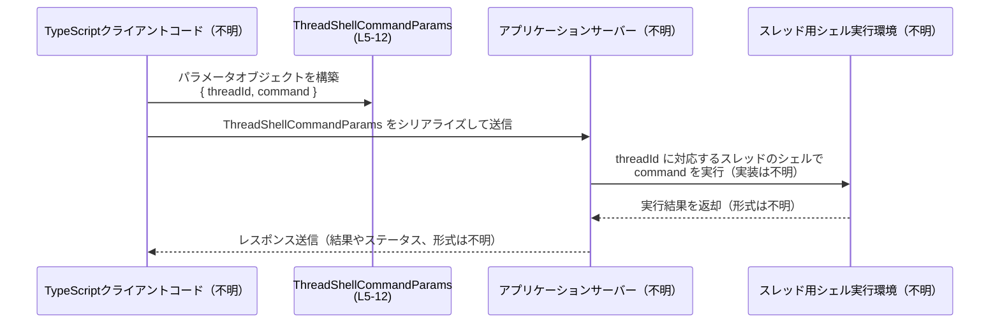

# app-server-protocol/schema/typescript/v2/ThreadShellCommandParams.ts

## 0. ざっくり一言

このファイルは、**スレッドに紐づいたシェルコマンド実行リクエストのパラメータ**を表す `ThreadShellCommandParams` 型（TypeScript）を定義する、自動生成コードです（ThreadShellCommandParams.ts:L1-5）。

---

## 1. このモジュールの役割

### 1.1 概要

- このモジュールは、アプリケーションサーバーとの間でやり取りされる**プロトコル用の型定義**です（パス `app-server-protocol/schema/typescript/v2` より判断）。
- `ThreadShellCommandParams` は、特定の「スレッド」に対して、そのスレッドのシェルで評価される**生のシェルコマンド文字列**を渡すためのパラメータ型です（ThreadShellCommandParams.ts:L5-12）。
- ファイル先頭にあるコメントから、**Rust 側の定義から ts-rs によって自動生成されるコード**であり、手動で編集しないことが前提になっています（ThreadShellCommandParams.ts:L1-3）。

### 1.2 アーキテクチャ内での位置づけ

このファイル自体は型定義のみを提供し、実際の通信処理やコマンド実行は他のモジュールが担う構造と解釈できます（通信処理・実行ロジックはこのチャンクには現れません）。

想定される位置づけ（概念図）は次のとおりです。



- Rust 側の型定義 → ts-rs により本ファイルが生成される（ThreadShellCommandParams.ts:L1-3）。
- TypeScript コードは `ThreadShellCommandParams` 型を用いて、サーバーにリクエストペイロードを構築する（ThreadShellCommandParams.ts:L5-12）。
- サーバー側でコマンドが実行されるが、その処理や戻り値はこのファイルからは分かりません。

### 1.3 設計上のポイント

- **自動生成コード**  
  - ファイル先頭で「GENERATED CODE! DO NOT MODIFY BY HAND!」と明示されており（ThreadShellCommandParams.ts:L1-3）、元の ts-rs 対象の Rust 型を修正して再生成する前提です。
- **シンプルなデータコンテナ**  
  - `ThreadShellCommandParams` は 2 つの文字列フィールドだけを持つプレーンなオブジェクト型です（ThreadShellCommandParams.ts:L5-12）。
- **シェル構文を保持するコマンド文字列**  
  - コメントで「パイプ、リダイレクト、クォートなどのシェル構文を意図的に保持する」と説明されています（ThreadShellCommandParams.ts:L7-9）。
- **サンドボックス外での実行を示唆**  
  - コメントで「スレッドのサンドボックスポリシーを継承せず、フルアクセスで実行される」と記載されており（ThreadShellCommandParams.ts:L9-10）、セキュリティ面で注意が必要な操作のパラメータであることが分かります。

---

## 2. 主要な機能一覧

このファイルに実装レベルの「関数」は存在せず、機能は型定義のみです（ThreadShellCommandParams.ts:L1-12）。

- `ThreadShellCommandParams` 型定義:  
  スレッド ID (`threadId`) と、そのスレッドのシェルで実行されるコマンド文字列 (`command`) をまとめたパラメータ型です（ThreadShellCommandParams.ts:L5-12）。

---

## 3. 公開 API と詳細解説

### 3.1 型一覧（構造体・列挙体など）

このチャンクに登場する型コンポーネントのインベントリーです。

| 名前                         | 種別                               | 役割 / 用途                                                                                                         | 定義位置                          |
|------------------------------|------------------------------------|----------------------------------------------------------------------------------------------------------------------|-----------------------------------|
| `ThreadShellCommandParams`   | 型エイリアス（オブジェクト型）     | スレッドのシェルに対して実行するコマンドを指定するためのパラメータ。`threadId` と `command` の 2 フィールドを持つ | ThreadShellCommandParams.ts:L5-12 |

`ThreadShellCommandParams` のフィールド構造は次のとおりです。

| フィールド名 | 型      | 説明 | 定義位置 |
|--------------|---------|------|----------|
| `threadId`   | string  | コマンドを実行する対象の「スレッド」を識別する ID。意味や形式（UUID かどうかなど）はこのファイルからは分かりません。 | ThreadShellCommandParams.ts:L5 |
| `command`    | string  | スレッドの設定済みシェルで評価されるシェルコマンド文字列。パイプ、リダイレクト、クォートなどの構文を保持し、スレッドのサンドボックスポリシーを継承せずにフルアクセスで実行されるとコメントされています。 | ThreadShellCommandParams.ts:L6-10,12 |

#### TypeScript における安全性・エラー・並行性

- **型安全性（compile-time）**  
  - `ThreadShellCommandParams` は TypeScript のオブジェクト型エイリアスであり、`threadId` と `command` の両方が `string` として必須です（ThreadShellCommandParams.ts:L5-12）。
  - そのため、型チェックが有効なコンパイル環境では、これらのフィールドが欠けていたり `number` など別の型が指定されるとコンパイルエラーになります。
- **実行時エラー**  
  - この型自体にはロジックが含まれていないため、実行時の例外は発生しません。
  - 実際のエラーは、`command` の内容をサーバーがどのように実行するかに依存します（たとえば、不正なコマンド文字列や権限の不足など）。その挙動はこのチャンクには現れません。
- **並行性 / 並列性**  
  - TypeScript の平文オブジェクトであり、内部にミュータブルな共有状態や同期処理は存在しません（ThreadShellCommandParams.ts:L5-12）。
  - 同一の `ThreadShellCommandParams` オブジェクト参照を複数の非同期処理で共有しても、オブジェクトを外部から書き換えない限り競合は発生しません。  
    ただし、どのように共有するかは利用側のコードに依存し、このファイルからは分かりません。

### 3.2 関数詳細（最大 7 件）

このファイルには関数定義が存在しません（コメントおよび `export type` のみで構成されているため、ThreadShellCommandParams.ts:L1-12）。  
そのため、このセクションで詳細解説すべき関数は「該当なし」となります。

### 3.3 その他の関数

| 関数名 | 役割（1 行） |
|--------|--------------|
| なし   | このファイルには関数は定義されていません（ThreadShellCommandParams.ts:L1-12）。 |

---

## 4. データフロー

このモジュール自体は型定義のみですが、`ThreadShellCommandParams` がどのようにデータフローに関わるかを概念的に示します。  
以下は、TypeScript クライアントがスレッドに対してシェルコマンドを実行させる典型的なフローの例です（通信先や実際の関数名はこのチャンクには現れないため、一般化した表現になっています）。



- **このチャンクから分かること**  
  - クライアント側で `ThreadShellCommandParams` 型のオブジェクトが構築されること（ThreadShellCommandParams.ts:L5-12）。
  - その `command` は「スレッドの設定済みシェルで評価される」こと（コメント、ThreadShellCommandParams.ts:L7-8）。
  - コマンド実行は「スレッドのサンドボックスポリシーを継承せず、フルアクセスで動作する」と説明されていること（ThreadShellCommandParams.ts:L9-10）。
- **このチャンクからは分からないこと**  
  - 実際に HTTP / WebSocket / RPC のどれで送信するか。
  - サーバー側のエンドポイント名、レスポンスの型、エラー処理方法。
  - スレッド「ID」がどのような概念（ユーザーセッション、ワーカー、LLM スレッドなど）を指すか。

---

## 5. 使い方（How to Use）

### 5.1 基本的な使用方法

`ThreadShellCommandParams` を用いて、特定スレッドに対してシェルコマンドをリクエストする TypeScript 側の典型的なコード例です。

```typescript
// ThreadShellCommandParams 型をインポートする
import type { ThreadShellCommandParams } from "./schema/typescript/v2/ThreadShellCommandParams";

// スレッド ID と実行したいシェルコマンドを指定してパラメータを作成する
const params: ThreadShellCommandParams = {
    threadId: "thread-1234",                   // 対象スレッドを識別する ID（具体的な形式は不明）
    command: "ls -la /var/log | grep error",   // パイプやリダイレクトを含むシェルコマンド
};

// 例として fetch でサーバーに送信する（エンドポイントやレスポンス形式は本チャンクには現れません）
await fetch("/api/threads/shell-exec", {
    method: "POST",
    headers: { "Content-Type": "application/json" },
    body: JSON.stringify(params),             // ThreadShellCommandParams を JSON シリアライズ
});
```

- `threadId` と `command` が `string` で必須のため、TypeScript の型チェックにより記述ミスを早期に検出できます（ThreadShellCommandParams.ts:L5-12）。

### 5.2 よくある使用パターン

1. **単純なコマンド実行**

```typescript
const params: ThreadShellCommandParams = {
    threadId: "thread-1",
    command: "whoami",                   // 単純なシェルコマンド
};
```

1. **シェル構文を活用したコマンド実行**

コメントにある通り、パイプやリダイレクトなどのシェル構文をそのまま保持して渡す設計です（ThreadShellCommandParams.ts:L7-9）。

```typescript
const params: ThreadShellCommandParams = {
    threadId: "thread-2",
    command: "cat /var/log/app.log | tail -n 100 > /tmp/app-log-tail.txt",
};
```

1. **クォートや環境変数を含むコマンド**

```typescript
const params: ThreadShellCommandParams = {
    threadId: "thread-3",
    command: "sh -c 'echo \"HOME is $HOME\" && env | sort'",
};
```

### 5.3 よくある間違い

この型は**サンドボックス外でフルアクセスで動作するコマンド**に使われるとコメントされています（ThreadShellCommandParams.ts:L9-10）。  
そのため、入力の扱いを誤ると、セキュリティ上の問題が生じやすい点に注意が必要です。

#### 誤用例: 生のユーザー入力をそのまま `command` に渡す

```typescript
// 例: フォーム入力をそのまま command に渡している
const userInput = form.commandInput.value;     // ユーザー提供の文字列

const params: ThreadShellCommandParams = {
    threadId: "thread-unsafe",
    command: userInput,                         // 任意のコマンドが実行されうる
};
```

- コメントにある「フルアクセスで実行される」という性質上（ThreadShellCommandParams.ts:L9-10）、任意のシェルコマンドが実行される可能性があります。

#### より安全なパターン（選択肢からマップする例）

```typescript
// ユーザーには「処理の種類」だけを選ばせ、実際のコマンドはサーバー側で決める／ホワイトリストから選ぶ
type AllowedAction = "showLogs" | "listHome";

function toCommand(action: AllowedAction): string {
    switch (action) {
        case "showLogs":
            return "tail -n 100 /var/log/app.log";
        case "listHome":
            return "ls -la $HOME";
    }
}

const action: AllowedAction = "showLogs";      // UI などで選択された値
const params: ThreadShellCommandParams = {
    threadId: "thread-safe",
    command: toCommand(action),                // アプリ側が定義した固定コマンドのみ使用
};
```

※ どこまで安全にするかはシステム設計全体の問題であり、このファイルだけからは最適解は分かりません。

### 5.4 使用上の注意点（まとめ）

- `threadId` / `command` は必須フィールドであり、`undefined` や `null` を許容しません（ThreadShellCommandParams.ts:L5-12）。
- `command` はシェル構文を保持した「そのままの文字列」であり、アプリケーション側でバリデーションやエスケープが行われる保証は、この型定義からは分かりません。
- コメントにあるように「サンドボックスポリシーを継承せずフルアクセスで実行」されるため（ThreadShellCommandParams.ts:L9-10）、**信頼できない入力を直接 `command` に渡さないこと**が重要です。
- この型は純粋なデータコンテナであり、非同期処理やスレッド安全性に関する内部ロジックは持ちません。並行実行時の安全性は、利用する側の設計に依存します。

---

## 6. 変更の仕方（How to Modify）

### 6.1 新しい機能を追加する場合

このファイルは ts-rs により生成されることが明記されているため（ThreadShellCommandParams.ts:L1-3）、**直接編集するのではなく、生成元の Rust 型を変更する**必要があります。

一般的な手順は次のようになります（生成元のファイルパスはこのチャンクには現れません）。

1. **生成元の Rust 型定義を特定する**  
   - ts-rs のアノテーション（例: `#[derive(TS)]`）が付与された構造体がどこかに存在すると考えられますが、このチャンクからは具体的な場所は分かりません。
2. **Rust 型にフィールドを追加・変更する**  
   - たとえば「作業ディレクトリ」や「タイムアウト秒数」などのフィールドを追加したい場合、Rust の構造体側に追加します。
3. **ts-rs によるコード生成を再実行する**  
   - ts-rs のビルドプロセスに従って TypeScript コードを再生成します。  
   - その結果として `ThreadShellCommandParams.ts` も更新されます。
4. **TypeScript 側の利用コードを更新する**  
   - 新しいフィールドが追加された場合、`ThreadShellCommandParams` を利用しているすべての箇所でオブジェクトリテラルを更新する必要があります。

### 6.2 既存の機能を変更する場合

- **フィールド名の変更**  
  - `threadId` や `command` の名称を変えると、TypeScript 側でこのフィールドを参照しているすべてのコードがコンパイルエラーになります。  
  - 影響範囲を確認するには、プロジェクト全体で該当フィールド名を検索する必要があります（使用箇所はこのチャンクには現れません）。
- **フィールド型の変更**  
  - 例えば `threadId: string` を `number` に変更すると、JSON シリアライズ／デシリアライズやサーバー側の受け取りロジックにも影響します。  
  - Rust 側の型、TypeScript 側の型、API ドキュメントのすべてを整合させる必要があります。
- **後方互換性**  
  - プロトコルの型であるため、既存クライアントとの互換性を保つかどうかを設計レベルで検討する必要があります。  
    （たとえば新フィールドをオプションにするなど。オプション化する場合は Rust 側で `Option<T>` にするなどの対応が必要ですが、このファイルからは詳細は分かりません。）

---

## 7. 関連ファイル

このチャンクには他ファイルの明示的な参照はありませんが、パス構造とコメントから、次のファイル・ディレクトリとの関係が考えられます。

| パス / 区分                                      | 役割 / 関係 |
|--------------------------------------------------|------------|
| `app-server-protocol/schema/typescript/v2/ThreadShellCommandParams.ts` | 本レポートの対象ファイル。`ThreadShellCommandParams` 型を定義する自動生成コード（ThreadShellCommandParams.ts:L1-12）。 |
| `app-server-protocol/schema/typescript/v2/`      | v2 バージョンのプロトコルに対応する TypeScript 型定義群を格納するディレクトリと考えられますが、他の具体的なファイルはこのチャンクには現れません。 |
| ts-rs の生成元となる Rust ファイル（パス不明）   | コメントから、ts-rs が生成元として利用する Rust 型定義がどこかに存在することが分かりますが、具体的なパスやモジュール名はこのチャンクには記載されていません（ThreadShellCommandParams.ts:L1-3）。 |

---

### まとめ（安全性・エッジケース・テスト・性能など）

- **安全性 / セキュリティ**  
  - `command` は「サンドボックス外でフルアクセス」のシェルコマンドとして扱われることがコメントから読み取れます（ThreadShellCommandParams.ts:L9-10）。  
  - そのため、利用側では信頼できない入力を直接 `command` に渡さないことが重要です。
- **契約 / エッジケース**  
  - 型レベルでは `threadId` / `command` が必須の `string` であることのみが契約です（ThreadShellCommandParams.ts:L5-12）。  
  - 空文字や不正な ID に対する扱いは、このファイルからは分かりません（サーバー側の実装依存）。
- **テスト**  
  - このファイル自体にはテストコードは含まれていません（ThreadShellCommandParams.ts:L1-12）。  
  - 一般には、通信レイヤーやサーバー側ロジックのテストで、この型に対応する JSON が正しく処理されるかを確認することになりますが、具体的なテストコードはこのチャンクには現れません。
- **性能 / スケーラビリティ**  
  - この型は単なる 2 フィールドのオブジェクトであり、性能への影響はごく小さいと考えられます。シリアライズ／デシリアライズコストも最低限です。
- **オブザーバビリティ**  
  - ログ出力やメトリクスに関する記述はこのファイルにはありません。  
  - 実際のログ出力は、`ThreadShellCommandParams` を受け取るサーバー側やクライアント側ロジックで実装されると考えられますが、このチャンクからは詳細は分かりません。
