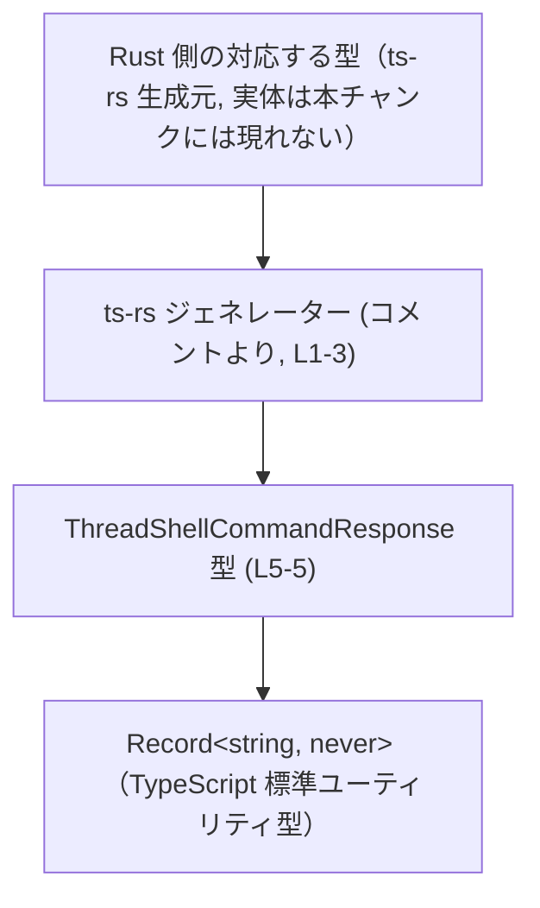

# app-server-protocol/schema/typescript/v2/ThreadShellCommandResponse.ts コード解説

## 0. ざっくり一言

- `ThreadShellCommandResponse` は、**プロパティを一切持たないオブジェクト** を表すための TypeScript 型エイリアスです。  
  `Record<string, never>` を使うことで、その性質を型レベルで厳密に表現しています (app-server-protocol/schema/typescript/v2/ThreadShellCommandResponse.ts:L5-5)。

---

## 1. このモジュールの役割

### 1.1 概要

- このモジュールは、`ThreadShellCommandResponse` という **1 つの公開型** を定義するだけのファイルです (L5-5)。
- 型の定義は `Record<string, never>` であり、「任意の文字列キーを取り得るが、その値の型が `never` なので実際にはプロパティが存在し得ないオブジェクト」を表します (L5-5)。
- ファイル先頭のコメントから、この型定義は Rust 側のコードから `ts-rs` によって**自動生成**されていることが分かります (L1-3)。

### 1.2 アーキテクチャ内での位置づけ

- ディレクトリ構造とコメントから、このファイルは「**アプリケーションサーバーのプロトコル定義（TypeScript v2 スキーマ）」の一部であり、Rust 側の型定義と同期するために生成されていると読み取れます (L1-3)。
- 具体的にどの Rust ファイル・型から生成されているか、またどの TypeScript コードから利用されているかは、このチャンクには記載されていません（不明）。

型定義まわりの関係を簡略化した図は次のとおりです。



### 1.3 設計上のポイント

- **自動生成コード**  
  - 冒頭コメントに「GENERATED CODE! DO NOT MODIFY BY HAND!」とあり、手動編集禁止であることが明示されています (L1, L3)。
- **純粋な型定義のみ**  
  - 実行時の関数・クラス・値は一切定義されておらず、型情報だけを提供します (L1-5)。
- **強い「空オブジェクト」制約**  
  - `Record<string, never>` により、「どのキーにも値を持てない」ことを型システムで強制しています (L5-5)。  
  - これにより、レスポンスにプロパティを追加しようとすると**コンパイル時エラー**になります。
- **エラーハンドリング・並行性への影響なし**  
  - 実行時コードがないため、ランタイムの例外や並行性（非同期処理・スレッド安全性など）には直接関与しません。

---

## 2. 主要な機能一覧

このファイルが提供する機能は 1 点です。

- `ThreadShellCommandResponse` 型の定義:  
  プロパティを持たないレスポンスオブジェクトを、`Record<string, never>` を用いて型レベルで表現する (L5-5)。

---

## 3. 公開 API と詳細解説

### 3.1 型一覧（構造体・列挙体など）

| 名前                         | 種別        | 役割 / 用途                                                                                 | 定義位置                                                                                           |
|------------------------------|-------------|----------------------------------------------------------------------------------------------|----------------------------------------------------------------------------------------------------|
| `ThreadShellCommandResponse` | 型エイリアス | 「任意の文字列キーを取り得るが、値が `never` であるため実質的にプロパティを持てないオブジェクト」の型 | app-server-protocol/schema/typescript/v2/ThreadShellCommandResponse.ts:L5-5 |

#### `ThreadShellCommandResponse` の詳細

```ts
export type ThreadShellCommandResponse = Record<string, never>;
```

- `Record<K, V>` は「キー型 `K` のすべてのキーに対して値型 `V` を持つオブジェクト」を表すユーティリティ型です。
- `V` に `never` を指定すると、「値として代入可能な型が存在しない」ため、実質的に**どのプロパティも持てないオブジェクト**になります。
  - TypeScript では `never` は「到達しない値」を表す**ボトム型**であり、ほぼあらゆる型から代入できません。
  - そのため、`{ anyKey: anyValue }` を `ThreadShellCommandResponse` に代入しようとすると、プロパティの値の型が `never` に代入できないためコンパイルエラーになります。

### 3.2 関数詳細（最大 7 件）

- このファイルには**関数・メソッド定義は存在しません** (L1-5)。  
  したがって、関数の詳細解説テンプレートを適用すべき対象もありません。

### 3.3 その他の関数

- 補助関数やラッパー関数も、このファイルには一切定義されていません (L1-5)。

---

## 4. データフロー（型レベル）

このファイルには実行時処理のコードがないため、「処理フロー」ではなく、**型チェック時のデータ構造の流れ**を示します。

### 4.1 型チェックの流れ（概念図）

呼び出し側コードが `ThreadShellCommandResponse` 型を使ったときの、型システム内でのチェックイメージです。

```mermaid
sequenceDiagram
    participant C as 呼び出し側コード
    participant T as ThreadShellCommandResponse 型 (L5-5)
    participant R as Record&lt;string, never&gt;

    C->>T: オブジェクトに ThreadShellCommandResponse 型を付ける
    T->>R: 各プロパティの値の型が never か検証
    alt プロパティが一切ない
        R-->>T: OK （型チェック成功）
    else 1つ以上のプロパティがある
        R-->>T: 型エラー（値の型が never ではない）
    end
```

- 実際にどの関数・モジュールから `ThreadShellCommandResponse` が使われているかは、このファイルからは分かりません（不明）。
- 図は TypeScript 型システム上の一般的な挙動を説明したものであり、特定の既存コードの呼び出し関係を示すものではありません。

---

## 5. 使い方（How to Use）

### 5.1 基本的な使用方法

`ThreadShellCommandResponse` は「プロパティを持たないオブジェクト」を表すための型として利用できます。

```ts
// 実際の import パスはプロジェクト構成に依存し、このチャンクからは特定できません。
// ここでは相対パスの一例を示します。
import type { ThreadShellCommandResponse } from "./ThreadShellCommandResponse";

// 空オブジェクトは ThreadShellCommandResponse として扱える
const ok: ThreadShellCommandResponse = {}; // OK

// プロパティを追加するとコンパイルエラーになる例
// const ng: ThreadShellCommandResponse = { exitCode: 0 };
//    ^ 型 '{ exitCode: number; }' を 'Record<string, never>' に割り当てることはできない（値の型が never ではないため）
```

この例から分かるように、

- **許可される値**: `{}`
- **許可されない値**: 何らかのプロパティを持つオブジェクト（`{ foo: 1 }` など）

となります。

### 5.2 よくある使用パターン

1. **「本文なしレスポンス」を明示する戻り値型として使う**

   何も情報を返さないが、「成功した」という事実だけを表したい非同期関数での使用例です。

   ```ts
   import type { ThreadShellCommandResponse } from "./ThreadShellCommandResponse";

   // 何も情報を返さないことを型で明示する戻り値
   async function runSomething(): Promise<ThreadShellCommandResponse> {
       // 何らかの処理...
       return {}; // 成功時は常に空オブジェクト
   }
   ```

   このコードは説明用の例であり、実際のプロジェクト内に同名関数が存在することを意味しません。

2. **Union 型の一部として利用する**

   他のレスポンス型と組み合わせて「このケースだけは何も返さない」ことを表したい場合の例です。

   ```ts
   import type { ThreadShellCommandResponse } from "./ThreadShellCommandResponse";

   type SomeOtherResponse = { result: string };

   type ApiResponse =
       | ThreadShellCommandResponse // 何も返さないケース
       | SomeOtherResponse;         // データを返すケース
   ```

   このように Union 型に含めると、「この分岐では空オブジェクトしか来ない」ということを型で表現できます。

### 5.3 よくある間違い

```ts
import type { ThreadShellCommandResponse } from "./ThreadShellCommandResponse";

// 間違い例: レスポンスに情報を持たせようとしている
// これは 'never' 型への代入となるため、コンパイルエラーになる
// const invalid: ThreadShellCommandResponse = {
//     exitCode: 0,          // 型 'number' を 'never' に代入できない
//     stdout: "ok",         // 型 'string' を 'never' に代入できない
// };

// 正しい例: 何も持たないことを前提としたコードにする
const valid: ThreadShellCommandResponse = {}; // これのみが安全に代入可能
```

- `ThreadShellCommandResponse` を「任意の JSON オブジェクト」を意味する汎用的な型だと誤解すると、型エラーに直面します。
- 実際には、**どんなプロパティも許可されない非常に強い制約の型**です。

### 5.4 使用上の注意点（まとめ）

- **前提条件**
  - `ThreadShellCommandResponse` 型の値は、**空オブジェクト `{}` のみが意図された利用**です (L5-5)。
- **禁止事項**
  - プロパティを持つオブジェクトをこの型として扱わないこと。  
    コンパイルエラーを避けるために `as any` や `// @ts-ignore` で無理に回避すると、型安全性が失われます。
- **エラー・パニック条件**
  - これは型定義だけなので、実行時の例外やパニックは関係ありません。誤用した場合でもエラーは**コンパイル時の型エラー**として現れます。
- **並行性・非同期性**
  - 型のみであり、非同期処理 (`Promise`, `async/await`) やスレッドセーフティに影響を与えません。  
    どのような並行処理の中でも安全に利用できます。
- **パフォーマンス**
  - TypeScript の型情報はコンパイル後に消えるため、ランタイムの性能への影響はありません。  
    ただし、非常に多くの箇所で複雑な型演算と組み合わせると、コンパイラの型チェック時間に影響する可能性はありますが、この型単体は極めて単純です (L5-5)。

---

## 6. 変更の仕方（How to Modify）

### 6.1 新しい機能を追加する場合

このファイルは **ts-rs による自動生成**であり、コメントで「手動で編集しないこと」が明示されています (L1-3)。そのため、変更方針は次のようになります。

1. **TypeScript 側を直接変更しない**
   - `ThreadShellCommandResponse.ts` に直接フィールドを追加・変更しても、生成プロセスの再実行時に上書きされます (L1, L3)。
2. **生成元（Rust 側）の型を変更する**
   - このファイルを生成している ts-rs 対象の Rust 型に、必要なフィールドや構造を追加します。  
   - 具体的な Rust のファイル名や型名は、このチャンクには現れていないため不明です。
3. **ts-rs のコード生成を再実行する**
   - Rust 側の型変更を反映させるため、ts-rs による TypeScript 生成処理を再度実行します。
4. **生成結果としての ThreadShellCommandResponse.ts を確認する**
   - 新しいフィールドが `interface` や `type` として出力される形に変化していることが期待されますが、具体的な生成フォーマットは ts-rs の設定と Rust 側定義次第です（このファイル単体からは断定できません）。

### 6.2 既存の機能を変更する場合

`ThreadShellCommandResponse` の意味や構造を変更したい場合の注意点です。

- **影響範囲の確認**
  - プロジェクト全体で `ThreadShellCommandResponse` を参照している箇所を検索し、どのような前提で使われているか確認する必要があります。  
    このファイル単体からは利用箇所は分かりません。
- **契約の変更**
  - 現在は「プロパティを一切持たない」という強い契約を持つ型です (L5-5)。  
    これを「いくつかのフィールドを持つ型」に変更すると、多数のコンパイルエラーや挙動変更が発生する可能性があります。
- **テスト**
  - このファイルにはテストは含まれていません (L1-5)。  
    変更後は、ThreadShellCommandResponse を利用している箇所のテスト（ユニットテストや統合テスト）が通るか確認する必要があります。
- **生成コードであることの再確認**
  - 変更は必ず生成元（Rust 側・ts-rs 設定）の方に加え、TypeScript 側は生成結果として扱う、という運用を維持する必要があります (L1-3)。

---

## 7. 関連ファイル

このチャンクから確実に分かる関連は、**生成元が ts-rs であること**のみです (L1-3)。具体的なパスやファイル名は書かれていません。

| パス / 名称                                   | 役割 / 関係                                                                                         |
|----------------------------------------------|------------------------------------------------------------------------------------------------------|
| 不明（ts-rs による生成元となる Rust 型定義） | この TypeScript ファイルを生成している元の Rust 型。ts-rs のコメントから存在が示唆されますが、パス不明 (L1-3)。 |
| `app-server-protocol/schema/typescript/v2/` ディレクトリ | 本ファイルを含む TypeScript v2 プロトコルスキーマ群のディレクトリと推定されますが、他ファイルの内容はこのチャンクには現れません。 |

---

### コンポーネントインベントリー（このファイルに存在する要素の一覧）

最後に、このチャンクに現れる型・関数のインベントリーをまとめます。

| 種別        | 名前                         | 定義 / 宣言位置 | 備考                                                                                                 |
|-------------|------------------------------|-----------------|------------------------------------------------------------------------------------------------------|
| 型エイリアス | `ThreadShellCommandResponse` | L5-5            | `Record<string, never>` を用いて「プロパティを持たないオブジェクト」を表す公開 API 型 (L5-5)。 |
| 関数        | なし                         | -               | このファイルには関数定義は存在しません (L1-5)。                                                     |

このファイルは非常に小さく、型 1 つのみを提供する構造になっていますが、その型は「何も返さない／何も持たない」という契約を TypeScript の型システムで強く表現する役割を持っています。
