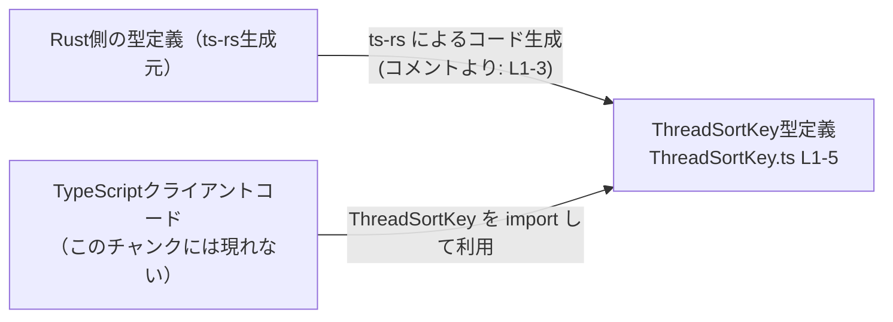
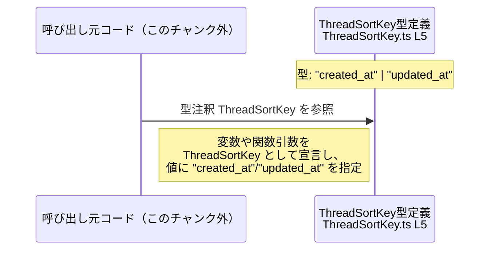

# app-server-protocol/schema/typescript/v2/ThreadSortKey.ts コード解説

## 0. ざっくり一言

スレッドのソートに使うキーを `"created_at"` または `"updated_at"` のどちらかに限定するための **文字列リテラル型エイリアス** を定義するファイルです（`ThreadSortKey.ts:L5-5`）。  
このファイルは ts-rs により自動生成され、手動編集しない前提になっています（`ThreadSortKey.ts:L1-3`）。

---

## 1. このモジュールの役割

### 1.1 概要

- このモジュールは、スレッドに関連するデータを並び替える際に使用する「ソートキー」の型を提供します（`ThreadSortKey.ts:L5-5`）。
- 型は `"created_at"` と `"updated_at"` の二つの文字列リテラルのユニオン型として定義されており、それ以外の文字列をコンパイル時に排除する役割を持ちます（`ThreadSortKey.ts:L5-5`）。
- ファイル全体が ts-rs による自動生成であり、TypeScript 側の型定義は Rust 側の定義に対応していることがコメントから読み取れます（`ThreadSortKey.ts:L1-3`）。

### 1.2 アーキテクチャ内での位置づけ

コメントから、Rust 側の型定義を ts-rs で TypeScript にエクスポートしている構成であることが分かります（`ThreadSortKey.ts:L1-3`）。  
このファイル自体は単に型をエクスポートするだけで、他モジュールへの依存や、他モジュールを呼び出すコードは含まれていません（`ThreadSortKey.ts:L1-5`）。

以下は、この型が関わる典型的な構造を **コメントに基づいて表現した図** です。



> 注: Rust 側の具体的な型名やファイル名、TypeScript 側の実際の import 元パスなどは、このチャンクには現れないため不明です。

### 1.3 設計上のポイント

- **自動生成コード**  
  - 「GENERATED CODE」「Do not edit manually」と明示されており（`ThreadSortKey.ts:L1-3`）、編集は生成元（Rust + ts-rs 側）で行う設計になっています。
- **状態を持たない純粋な型定義のみ**  
  - 関数・クラス・変数定義は存在せず、`export type` による型エイリアスのみが定義されています（`ThreadSortKey.ts:L5-5`）。
- **安全な値の制限（型レベル）**  
  - `"created_at"` と `"updated_at"` のみを許すユニオン型のため、ThreadSortKey 型を使う箇所ではその他の文字列をコンパイル時に禁止できます（`ThreadSortKey.ts:L5-5`）。
- **実行時のエラー処理・並行性は非対象**  
  - 実行時ロジックが存在しないため、このファイル単体ではエラー処理やスレッド安全性・並行性に関する挙動は発生しません（`ThreadSortKey.ts:L1-5`）。

---

## 2. 主要な機能一覧

このファイルに含まれる主要な要素は次の 1 点です。

- `ThreadSortKey` 型エイリアス: スレッドなどのソートに使うキーを `"created_at"` または `"updated_at"` に限定する型定義（`ThreadSortKey.ts:L5-5`）。

---

## 3. 公開 API と詳細解説

### 3.1 型一覧（構造体・列挙体など）

このチャンクで公開されている型は 1 つです。

| 名前             | 種別        | 役割 / 用途                                                                 | 定義箇所                     |
|------------------|-------------|------------------------------------------------------------------------------|------------------------------|
| `ThreadSortKey`  | 型エイリアス | `"created_at"` または `"updated_at"` のどちらかであることを表すソートキー型 | `ThreadSortKey.ts:L5-5`      |

#### `ThreadSortKey` の詳細

**定義**

```typescript
export type ThreadSortKey = "created_at" | "updated_at"; // ThreadSortKey.ts:L5
```

**概要**

- `ThreadSortKey` は TypeScript の **文字列リテラル型** のユニオンです。
- 許可される値は `"created_at"` と `"updated_at"` の 2 種類だけです（`ThreadSortKey.ts:L5-5`）。
- これにより、ソートキーを文字列で受け取る API などにおいて、誤ったキー名（例: `"title"` など）がコンパイル時に検出されるようになります。

**Bugs / Security 観点**

- この定義自体は型レベルの宣言のみであり、実行時の処理や副作用を持ちません（`ThreadSortKey.ts:L1-5`）。
- そのため、このファイル単体から直接的なバグやセキュリティ脆弱性は特定できません。
- ただし、呼び出し側で `any` からの代入や `as ThreadSortKey` のような無理な型アサーションを行うと、TypeScript の型安全性が低下する点に注意が必要です（これは一般的な TypeScript の性質であり、本ファイルの中にはそのようなコードは存在しません）。

**Contracts / Edge cases（契約とエッジケース）**

- **許可される値**  
  - コンパイル時の型として許されるのは `"created_at"` と `"updated_at"` のみです（`ThreadSortKey.ts:L5-5`）。
- **その他の文字列**  
  - 型注釈が `ThreadSortKey` である変数に `"created_at"` / `"updated_at"` 以外のリテラルを代入すると、TypeScript のコンパイルエラーになります。
- **空文字列 / `null` / `undefined`**  
  - これらは `ThreadSortKey` の定義に含まれていないため、型注釈が適切に付いている限りコンパイルエラーとなります。
- **実行時の入力**  
  - ランタイムの値は TypeScript 型システムでは保証できないため、外部入力からの文字列を `ThreadSortKey` に見なす場合は、実行時のバリデーションが別途必要になります。このファイルにはそうしたバリデーション処理は含まれていません（`ThreadSortKey.ts:L1-5`）。

**使用上の注意点**

- コメントに「Do not edit this file manually」とある通り（`ThreadSortKey.ts:L1-3`）、値を追加・変更する場合は TypeScript ファイルを直接ではなく、ts-rs の生成元定義（Rust 側）を更新する必要があります。
- `ThreadSortKey` を使う API で任意の文字列を許したい場合は、`string` 型を使うか、ユニオン型を拡張した新しい型を別に定義することが必要です（このファイルにはそのような拡張は定義されていません）。

### 3.2 関数詳細（最大 7 件）

このファイルには関数・メソッドは一切定義されていません（`ThreadSortKey.ts:L1-5`）。  
そのため、関数詳細テンプレートに基づいて説明できる対象は存在しません。

### 3.3 その他の関数

- 補助関数やラッパー関数も定義されていません（`ThreadSortKey.ts:L1-5`）。

---

## 4. データフロー

このファイルには実行時処理は含まれていないため、厳密な意味での「処理フロー」は存在しません。  
ここでは、`ThreadSortKey` 型を利用する際の **典型的なデータフローのイメージ** を、型名とリテラルから推測される範囲で示します（実際の呼び出し元コードはこのチャンクには現れません）。



- 呼び出し元コードで、例えば関数の引数やオブジェクトのプロパティに `ThreadSortKey` 型を指定することで、コンパイル時に許可される値が `"created_at"` と `"updated_at"` のみに制限されます（型定義は `ThreadSortKey.ts:L5-5`）。
- 実際のソート処理（例: データベースクエリや in-memory sort など）がどのように行われるかは、このチャンクには現れないため不明です。

---

## 5. 使い方（How to Use）

### 5.1 基本的な使用方法

`ThreadSortKey` を import して、ソートキーを受け取る関数の引数として利用する例です。  
import パスはプロジェクト構成に依存し、このチャンクからは正確なパスが分からないため、擬似的なパスをコメントで示しています。

```typescript
// ThreadSortKey 型をインポートする                         // 実際のパスはプロジェクト構成に依存（このチャンクからは不明）
import type { ThreadSortKey } from "./ThreadSortKey";      // ThreadSortKey.ts:L5 を利用する想定

// ThreadSortKey を使ってスレッド一覧のソートキーを受け取る関数
function fetchThreads(sortKey: ThreadSortKey) {            // sortKey は "created_at" または "updated_at"
    // ここで sortKey に応じてソート順を切り替えるなどの処理を行う想定
    // 実際の処理内容はこのファイルには定義されていない
}

// 使用例
const key: ThreadSortKey = "created_at";                   // OK: 定義済みリテラル
fetchThreads(key);                                         // コンパイル時に型安全が保証される
```

この例では、`sortKey` に `"created_at"` / `"updated_at"` 以外の文字列を渡そうとすると、TypeScript のコンパイル時エラーになります。

### 5.2 よくある使用パターン

1. **変数に対する型注釈として利用**

```typescript
import type { ThreadSortKey } from "./ThreadSortKey";      // ThreadSortKey.ts:L5

let sortKey: ThreadSortKey;                                // ソートキーは 2 通りに限定される
sortKey = "updated_at";                                    // OK
// sortKey = "title";                                      // NG: コンパイルエラー（ThreadSortKey ではない）
```

1. **オブジェクトのプロパティとして利用**

```typescript
import type { ThreadSortKey } from "./ThreadSortKey";      // ThreadSortKey.ts:L5

interface ThreadQueryOptions {                             // クエリオプションの例
    sortKey: ThreadSortKey;                                // ソートキー
    // 他のフィルタ条件など（このチャンクには現れない）
}

const options: ThreadQueryOptions = {
    sortKey: "created_at",                                 // 許可された値
};
```

### 5.3 よくある間違い

**誤用例: 汎用 `string` を使ってしまう**

```typescript
// 間違い例: string 型を使ってしまい、誤ったキー名も通ってしまう
function fetchThreadsWrong(sortKey: string) {              // どんな文字列でも受け入れてしまう
    // "cretaed_at" のようなタイプミスにも気づけない
}
```

**正しい例: `ThreadSortKey` を利用**

```typescript
import type { ThreadSortKey } from "./ThreadSortKey";      // ThreadSortKey.ts:L5

function fetchThreadsSafe(sortKey: ThreadSortKey) {        // ThreadSortKey によりキー名を制限
    // "created_at" または "updated_at" のみ許可
}
```

**誤用例: 無理な型アサーション**

```typescript
import type { ThreadSortKey } from "./ThreadSortKey";

// 間違い例: 外部入力をそのまま ThreadSortKey にキャストしてしまう
function fromUserInput(input: string): ThreadSortKey {
    return input as ThreadSortKey;                         // 実行時には不正な値が混入しうる
}
```

このような `as ThreadSortKey` によるアサーションは、型システムの安全性を損なうため注意が必要です。

### 5.4 使用上の注意点（まとめ）

- **自動生成ファイルであること**  
  - コメントにある通り、このファイルは ts-rs によって自動生成されており、手動での編集は想定されていません（`ThreadSortKey.ts:L1-3`）。
- **型による制約はコンパイル時のみ**  
  - `ThreadSortKey` は TypeScript の型であり、JavaScript にトランスパイルされると実体は残りません。実行時には `"created_at"` / `"updated_at"` 以外の文字列も技術的には流入しうるため、必要に応じてランタイムチェックが別途必要です。
- **並行性・パフォーマンス上の注意**  
  - このファイルは型定義のみであり、CPU やメモリを消費する処理を含まないため、並行性やパフォーマンスへの直接的な影響はほぼありません（`ThreadSortKey.ts:L1-5`）。

---

## 6. 変更の仕方（How to Modify）

### 6.1 新しい機能を追加する場合

例として、新しいソートキー `"title"` を許可したい状況を考えます。

- コメントから、このファイルは **「GENERATED CODE」「Do not edit manually」** と明示されているため（`ThreadSortKey.ts:L1-3`）、
  - `export type ThreadSortKey = "created_at" | "updated_at" | "title";`
  のような編集を **直接このファイルに行うのは前提に反します**。
- 追加を行う場合は、生成元である ts-rs の設定や Rust 側の型定義を変更し、再生成する必要があります。
  - 具体的な Rust 側の型や生成手順はこのチャンクには現れないため不明です。

変更時に確認すべき点:

- ThreadSortKey を使用しているすべての呼び出し元で、新しいキーに対応したロジック（ソート条件の追加など）が必要かどうかを確認する必要があります（呼び出し元コードはこのチャンクには現れません）。

### 6.2 既存の機能を変更する場合

例えば `"updated_at"` を別名に変更する、あるいは削除する場合:

- 直編集ではなく、やはり ts-rs の生成元を更新する必要があります（`ThreadSortKey.ts:L1-3`）。
- 既存の `"updated_at"` を使っている呼び出し元はコンパイルエラーとなるため、影響範囲の調査が必要です。
- `ThreadSortKey` に依存するテスト（存在する場合）は、新しい仕様に合わせて更新する必要があります。  
  ただし、このチャンクにはテストコードは現れないため、どのようなテストが存在するかは不明です。

---

## 7. 関連ファイル

このチャンクから直接分かる関連ファイル・モジュールは次の通りです。

| パス / 名称                      | 役割 / 関係 |
|----------------------------------|-------------|
| （Rust側 ts-rs 生成元ファイル）  | コメントより、この TypeScript ファイルは ts-rs により生成されていることが分かります（`ThreadSortKey.ts:L1-3`）。ただし具体的なパス・型名はこのチャンクには現れません。 |
| （ThreadSortKey の利用側コード） | `ThreadSortKey` を import して利用するクライアントコードが存在すると考えられますが、このチャンクには現れず、具体的な場所は不明です。 |

このファイル単体では、プロジェクト全体のどの部分で `ThreadSortKey` が使われているかを特定することはできません。
