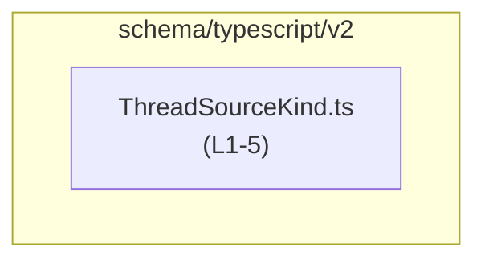
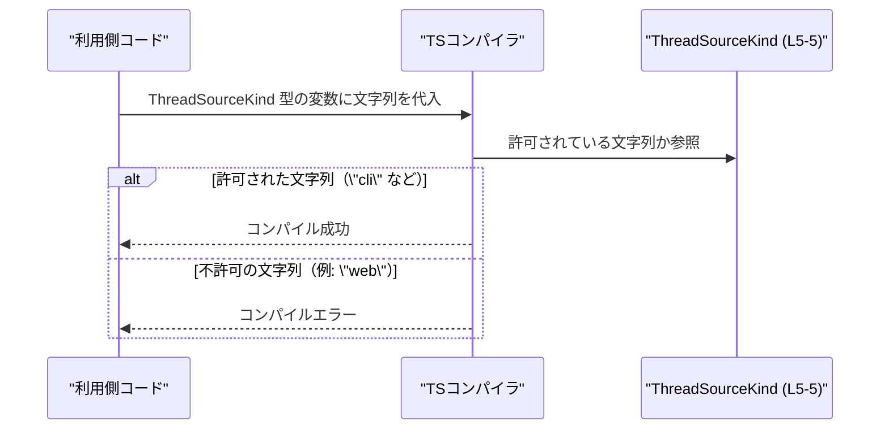

# app-server-protocol\schema\typescript\v2\ThreadSourceKind.ts

## 0. ざっくり一言

- アプリケーションサーバープロトコルの TypeScript スキーマの一部として、`ThreadSourceKind` という**文字列リテラル・ユニオン型**を 1 つ定義する自動生成ファイルです（`ThreadSourceKind.ts:L1-5`）。

---

## 1. このモジュールの役割

### 1.1 概要

- このモジュールは、`ThreadSourceKind` 型を通じて、ある値が  
  `"cli" | "vscode" | "exec" | "appServer" | "subAgent" | "subAgentReview" | "subAgentCompact" | "subAgentThreadSpawn" | "subAgentOther" | "unknown"` のいずれかの文字列であることを**コンパイル時に制約するための型**を提供します（`ThreadSourceKind.ts:L5-5`）。
- ファイル先頭コメントにより、この型定義は Rust から `ts-rs` を用いて自動生成されていることが示されています（`ThreadSourceKind.ts:L1-3`）。
- 型名やファイル名から、「スレッドの起点／由来」を分類する目的が想定されますが、このチャンクだけでは用途は断定できません（命名と列挙されている値からの推測です）。

### 1.2 アーキテクチャ内での位置づけ

- パス `app-server-protocol\schema\typescript\v2` から、このファイルが**アプリケーションサーバープロトコルの TypeScript 向けスキーマ定義群**の 1 つであることが分かります（パス情報による推定）。
- このファイルには `import` 文が存在せず（`ThreadSourceKind.ts:L1-5`）、他モジュールへの依存はありません。
- 逆に、この `export type ThreadSourceKind` が、他の TypeScript コードからインポートされて利用されることが想定されますが、具体的な利用箇所はこのチャンクには現れていません。

依存関係（このファイル単体で分かる範囲）を簡単な Mermaid 図で表すと次のようになります。



### 1.3 設計上のポイント

- **自動生成ファイル**  
  - 先頭コメントに「GENERATED CODE! DO NOT MODIFY BY HAND!」とあり、`ts-rs` による自動生成ファイルであることが明示されています（`ThreadSourceKind.ts:L1-3`）。
  - 変更は直接このファイルではなく、元になっている Rust 側の型定義で行う設計です（ts-rs の一般的な利用方針に基づく説明）。
- **列挙的な文字列リテラル型**  
  - 任意の `string` ではなく、10 個の決められた文字列リテラルだけを許可する**ユニオン型**として設計されています（`ThreadSourceKind.ts:L5-5`）。
- **ステートレス・ロジックなし**  
  - 関数・クラス・変数定義は存在せず、純粋に「型の宣言」のみで構成されています（`ThreadSourceKind.ts:L1-5`）。
  - 実行時の処理・エラーハンドリング・並行処理に関するロジックは一切ありません。
- **型安全性重視**  
  - ThreadSourceKind を使うことで、「取り得る文字列」をコンパイル時に限定でき、タイポや不正な値を型チェックで検出できる設計になっています（TypeScript の文字列リテラル・ユニオン型の仕様からの説明）。

---

## 2. 主要な機能一覧（コンポーネントインベントリー）

このファイルが提供する機能は 1 つの型定義のみです。

- `ThreadSourceKind` 型:  
  `"cli" | "vscode" | "exec" | "appServer" | "subAgent" | "subAgentReview" | "subAgentCompact" | "subAgentThreadSpawn" | "subAgentOther" | "unknown"` のいずれかであることをコンパイル時に保証する**文字列リテラル・ユニオン型**（`ThreadSourceKind.ts:L5-5`）。

---

## 3. 公開 API と詳細解説

### 3.1 型一覧（構造体・列挙体など）

| 名前              | 種別                           | 役割 / 用途                                                                                                                     | 定義場所                    |
|-------------------|--------------------------------|----------------------------------------------------------------------------------------------------------------------------------|-----------------------------|
| `ThreadSourceKind` | 型エイリアス（文字列リテラル・ユニオン型） | 値が 10 個の特定の文字列（`"cli"` など）のいずれかであることを型レベルで表現し、任意の `string` の代わりに使うことで型安全性を高める | `ThreadSourceKind.ts:L5-5` |

#### `ThreadSourceKind` が取り得る値（事実として列挙）

`ThreadSourceKind` は次の 10 種類の文字列リテラルのユニオン型です（`ThreadSourceKind.ts:L5-5`）。

- `"cli"`
- `"vscode"`
- `"exec"`
- `"appServer"`
- `"subAgent"`
- `"subAgentReview"`
- `"subAgentCompact"`
- `"subAgentThreadSpawn"`
- `"subAgentOther"`
- `"unknown"`

### 3.2 関数詳細（最大 7 件）

- このファイルには**関数・メソッド・クラスの公開 API は存在しません**（`ThreadSourceKind.ts:L1-5`）。  
  したがって、関数詳細テンプレートに基づく解説対象はありません。

### 3.3 その他の関数

- 補助関数・ユーティリティ関数も定義されていません（`ThreadSourceKind.ts:L1-5`）。

---

## 4. データフロー

このファイルには実行時ロジックがないため、**実行時のデータフロー**は存在しません。  
ここでは、TypeScript コンパイル時に `ThreadSourceKind` 型がどのように利用されるかという**型チェック上のフロー（概念図）**を示します。

- 前提: 別ファイルで `ThreadSourceKind` を利用していると仮定した一般的な流れです。  
  実際の利用箇所はこのチャンクからは分からないため、**典型的なイメージ**として示します。



要点:

- `ThreadSourceKind` は**型レベルの制約**であり、実行時に特別な処理は行いません。
- 許可されていない文字列を代入しようとすると、コンパイル時にエラーとなります（型チェック）。

---

## 5. 使い方（How to Use）

### 5.1 基本的な使用方法

基本的な使い方は、「任意の `string` の代わりに `ThreadSourceKind` 型を使う」ことです。  
以下は、`ThreadSourceKind` をインポートして値を扱う例です（インポートパスはプロジェクト構成に応じて調整が必要です）。

```typescript
import type { ThreadSourceKind } from "path/to/ThreadSourceKind";  // ThreadSourceKind型をインポート（実際のパスはプロジェクト依存）

// ThreadSourceKind 型の変数を宣言し、許可された文字列を代入
const fromCli: ThreadSourceKind = "cli";                           // OK: "cli" はユニオン型の一要素
const fromVsCode: ThreadSourceKind = "vscode";                     // OK: "vscode" も許可された値

// const invalid: ThreadSourceKind = "web";                        // NG: "web" はユニオン型に含まれないためコンパイルエラー
```

このコードにより:

- `fromCli`, `fromVsCode` は `ThreadSourceKind` として正しい値になります。
- コメントアウトされた `invalid` のように、定義されていない文字列を代入すると **コンパイルエラー**となり、不正な値を早期に検出できます。

### 5.2 よくある使用パターン

#### パターン1: メタデータのフィールド型として利用

`ThreadSourceKind` を持つメタデータ型を定義する例です。  
ここでの `ThreadMetadata` は**このファイルには存在しない例示用の型**です。

```typescript
import type { ThreadSourceKind } from "path/to/ThreadSourceKind";  // ThreadSourceKind型をインポート

// スレッドに関するメタデータを表す型（例示）
interface ThreadMetadata {                                         // ThreadMetadataインターフェースを定義
    id: string;                                                    // スレッドID
    sourceKind: ThreadSourceKind;                                  // 起点を ThreadSourceKind で表現
}

// 利用例
const meta: ThreadMetadata = {                                     // ThreadMetadata型のオブジェクトを作成
    id: "thread-123",                                              // 任意のID
    sourceKind: "appServer",                                       // 許可された値の1つを指定
};
```

- `sourceKind` に `ThreadSourceKind` を使うことで、誤った文字列やタイポをコンパイル時に防げます。

#### パターン2: switch 文での分岐（網羅性チェック）

`ThreadSourceKind` を使って分岐処理を行う場合、`switch` 文と `never` を併用することで、**すべてのケースを網羅しているか**をコンパイル時に確認できます。

```typescript
import type { ThreadSourceKind } from "path/to/ThreadSourceKind";  // ThreadSourceKind型をインポート

// ThreadSourceKind に応じてラベル文字列を返す関数（例示）
function labelForSource(kind: ThreadSourceKind): string {          // kind の型は ThreadSourceKind
    switch (kind) {                                                // kind の値に応じて分岐
        case "cli":               return "CLI";                    // CLI 起点
        case "vscode":            return "VS Code";                // VS Code 起点
        case "exec":              return "Exec";                   // exec 起点
        case "appServer":         return "App Server";             // アプリサーバー起点
        case "subAgent":          return "Sub Agent";              // サブエージェント
        case "subAgentReview":    return "Sub Agent Review";       // レビュー用途のサブエージェント
        case "subAgentCompact":   return "Sub Agent Compact";      // コンパクトモードのサブエージェント
        case "subAgentThreadSpawn": return "Sub Agent Thread Spawn"; // スレッド生成用サブエージェント
        case "subAgentOther":     return "Sub Agent Other";        // その他サブエージェント
        case "unknown":           return "Unknown";                // 不明
        default: {
            const _exhaustive: never = kind;                       // 将来の拡張時に未対応ケースがあればコンパイルエラー
            return _exhaustive;                                    // 実際には到達しない
        }
    }
}
```

- 新しい値が `ThreadSourceKind` に追加された場合、`default` 内の `never` への代入がコンパイルエラーとなり、分岐の追加漏れを検知できます。

### 5.3 よくある間違い

```typescript
// 間違い例: string 型をそのまま使ってしまう
type BadMetadata = {                                               // 不適切な例: sourceKind を string としている
    sourceKind: string;                                            // 任意の文字列が入ってしまう
};

// 間違い例: 型アサーションで強制的に ThreadSourceKind にする
declare const rawSource: string;                                   // どこかから来た任意の文字列
const forced: ThreadSourceKind = rawSource as ThreadSourceKind;    // NGパターン: 実際には不正な値でも通ってしまう

// 正しい例: ThreadSourceKind を直接使う
import type { ThreadSourceKind } from "path/to/ThreadSourceKind";  // ThreadSourceKind型をインポート
type GoodMetadata = {                                              // 適切な例
    sourceKind: ThreadSourceKind;                                  // 許可された値のみを受け付ける
};
```

- `string` 型を直接使うと、どんな文字列でも代入できてしまい、プロトコルの前提が崩れます。
- `as ThreadSourceKind` などの**安易な型アサーション**は、型安全性を形だけのものにしてしまうため注意が必要です。

### 5.4 使用上の注意点（まとめ）

- **前提条件 / 契約**
  - `ThreadSourceKind` 型の変数には、定義されている 10 個の文字列のいずれかだけを代入することが契約です（`ThreadSourceKind.ts:L5-5`）。
- **エッジケース**
  - それ以外の文字列（例: `"web"`）を直接代入すると**コンパイルエラー**になります。
  - ただし、`any` 型や `as ThreadSourceKind` などの型アサーションを使うとコンパイラ検査を回避できてしまうため、その場合は**実行時に不正値が紛れ込む可能性**があります。
- **セキュリティ / 信頼境界**
  - 外部から受け取った文字列（HTTP リクエストなど）を `ThreadSourceKind` として扱う場合、**実行時のバリデーション**（文字列がユニオンのいずれかかチェックする処理）が別途必要です。
- **並行性**
  - このファイルは純粋な型定義のみであり、スレッド安全性や非同期処理に関する懸念はありません。
- **テスト**
  - このファイル自身にはテストコードは含まれていません（`ThreadSourceKind.ts:L1-5`）。  
    型定義の正しさを検証する場合は、別ファイルで `ThreadSourceKind` を用いたコードに対するコンパイルテストやユニットテストを書くことになります。

---

## 6. 変更の仕方（How to Modify）

### 6.1 新しい機能を追加する場合（新しい値を追加する）

- ファイル先頭コメントにより、このファイルは `ts-rs` により自動生成されていると記載されています（`ThreadSourceKind.ts:L1-3`）。
- したがって、**直接このファイルを編集するのではなく**、元になっている Rust 側の型定義（おそらく `enum` や `struct`）を変更し、`ts-rs` で再生成する必要があります。
  - Rust 側の定義場所・型名はこのチャンクには現れていないため不明です。
- 変更の流れ（一般的な ts-rs 利用パターンに基づく手順）:
  1. Rust コード中の `ThreadSourceKind` に対応する型定義に新しいバリアント／値を追加する。
  2. `ts-rs` のコード生成コマンドを実行して TypeScript ファイルを再生成する。
  3. TypeScript 側で `ThreadSourceKind` を使っているコードのコンパイルを行い、新しい値への対応漏れがないか確認する。

### 6.2 既存の機能を変更する場合（値の削除・名前変更など）

- **値を削除する場合**
  - ユニオン型から値を削除すると、その値を使っている TypeScript コードはコンパイルエラーになります。
  - これは型安全性の観点では望ましい挙動ですが、既存利用コードが多い場合は影響範囲を事前に把握する必要があります。
- **値の名前を変更する場合**
  - 旧名を使っているすべての TypeScript コードがコンパイルエラーとなります。
  - 型の契約が変わるため、プロトコル利用側との合意が必要です。
- **`unknown` の扱い**
  - `ThreadSourceKind` には `"unknown"` という値が含まれています（`ThreadSourceKind.ts:L5-5`）。
  - これは「分類不能／未定義」のカテゴリとして使われている可能性がありますが、このチャンクからは方針は読み取れません。
  - `"unknown"` を削除・変更する際は、未分類ケースの取り扱い方針を別途決める必要があります。

変更時の注意:

- 変更は Rust 側 → TypeScript 再生成 → TypeScript 側のコンパイル・テストという順序で行う必要があります。
- 文字列リテラル型は、変更が直接的にコンパイルエラーとして現れるため、**影響範囲の把握と修正をしやすい**という特徴があります。

---

## 7. 関連ファイル

このチャンクには他ファイルへの `import` がなく、関連ファイルの具体名は現れていません（`ThreadSourceKind.ts:L1-5`）。  
推測ではなく、コードから分かる範囲だけを整理します。

| パス         | 役割 / 関係 |
|--------------|-------------|
| （不明）     | `ThreadSourceKind` を利用する TypeScript ファイル（インターフェースやリクエスト／レスポンス型など）は、このチャンクには現れていません。 |
| （不明）     | `ts-rs` によりこのファイルを生成している Rust 側の型定義ファイル。コメントから存在は分かりますが、具体的なパス・型名は不明です（`ThreadSourceKind.ts:L1-3`）。 |

---

### まとめ（契約 / エッジケース / バグ・セキュリティ観点）

- **契約**: `ThreadSourceKind` 型の値は、10 個の特定の文字列リテラルのいずれかであること（`ThreadSourceKind.ts:L5-5`）。
- **エッジケース**:
  - それ以外の文字列はコンパイルエラー。
  - `any` や型アサーションでこの契約を破ることは技術的には可能だが、実行時不具合を招く可能性がある。
- **バグ / セキュリティ**:
  - このファイル自体には実行時ロジックがなく、直接的なバグやセキュリティ脆弱性は含まれていません。
  - ただし、型を信頼して実行時チェックを省略しているコードがある場合、外部入力に対するバリデーション不足が間接的なリスクとなり得ます（一般的な TypeScript の注意点）。
- **並行性**: 型定義のみのため、並行性・スレッド安全性に関する懸念事項はありません。
