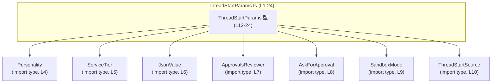
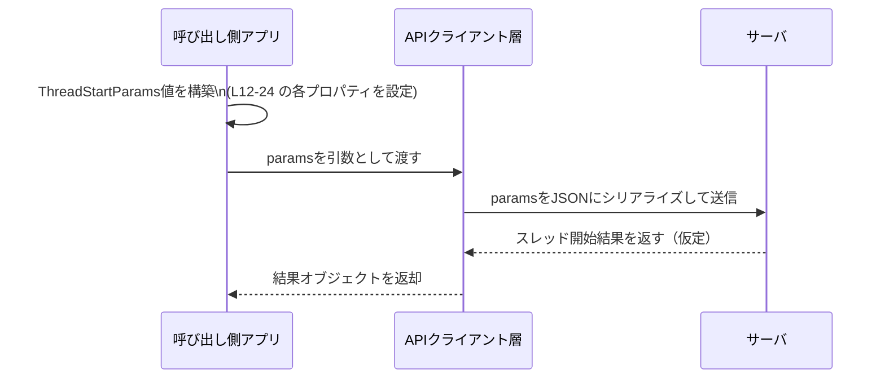

# app-server-protocol/schema/typescript/v2/ThreadStartParams.ts

## 0. ざっくり一言

- スレッド開始時に指定できる各種オプション設定をまとめた **パラメータオブジェクト `ThreadStartParams` の型定義**です（`ThreadStartParams.ts:L12-24`）。
- Rust 側の型から `ts-rs` によって自動生成された **API スキーマの一部**です（`ThreadStartParams.ts:L1-3`）。

---

## 1. このモジュールの役割

### 1.1 概要

- このモジュールは、アプリケーションサーバのプロトコルにおける「スレッド開始リクエスト」に相当する設定項目を TypeScript 型として表現します（`ThreadStartParams.ts:L12-24`）。
- 具体的には、モデル名・サービスティア・承認ポリシー・サンドボックス設定・各種インストラクション・パーソナリティ・履歴保存方針などを 1 つのオブジェクトにまとめるための型です。
- ファイル先頭のコメントから、この型は Rust 側の定義から `ts-rs` により自動生成されており、**手動編集は想定されていません**（`ThreadStartParams.ts:L1-3`）。

### 1.2 アーキテクチャ内での位置づけ

このファイル自体は型定義のみを提供し、実行時ロジックは含みません。TypeScript 側のコードはこの型を用いて、スレッド開始 API のリクエストオブジェクトを型安全に構築します。

依存関係（型レベルのみ）は次のようになっています。



- すべて `import type` で読み込まれているため、**型チェック専用の依存**であり、生成される JavaScript には影響しません（`ThreadStartParams.ts:L4-10`）。

### 1.3 設計上のポイント

- **自動生成コード**  
  - ファイル先頭に「GENERATED CODE」「Do not edit this file manually」と明示されており（`ThreadStartParams.ts:L1-3`）、設計上このファイルは別言語（Rust）側の単一ソースオブトゥルースから派生するものとして扱われます。
- **単一の公開型 `ThreadStartParams`**  
  - このファイルで公開されるのは `export type ThreadStartParams = { ... }` 1 つだけであり（`ThreadStartParams.ts:L12-24`）、責務が明確です。
- **オプショナルプロパティ + `null` の併用**  
  - 多くのフィールドが `prop?: T | null` のように「プロパティ自体が存在しない」状態と「存在するが値が `null`」の両方を表現しています（例: `model?: string | null` など、`ThreadStartParams.ts:L12-16`）。
  - これは Rust 側の `Option<T>` などと JSON `null` を区別する設計の反映と考えられますが、詳細な意図はこのチャンクからは分かりません。
- **必須ブール値の採用**  
  - `experimentalRawEvents` と `persistExtendedHistory` は `boolean` で必須プロパティとして定義されています（`ThreadStartParams.ts:L20-24`）。  
    型上、呼び出し側は常にこれらを明示的に指定する必要があります。
- **型レベルの安全性のみ提供**  
  - 実行時チェック・バリデーションは一切含まれておらず、**型チェックは TypeScript コンパイル時にのみ行われます**。  
    ランタイムでの不正値対策は、別の層（サーバ側やバリデーションロジック）で行う必要があります。

---

## 2. 主要な機能一覧（コンポーネントインベントリー）

このファイルは「機能（関数）」ではなく、**型とそのフィールドによる構造定義**が主な内容です。

### 2.1 このファイルで定義される型

| 名前                | 種別       | 役割 / 用途                                                                                             | 根拠 |
|---------------------|------------|----------------------------------------------------------------------------------------------------------|------|
| `ThreadStartParams` | 型エイリアス | スレッド開始時に指定可能なすべての設定項目をまとめたオブジェクトの形を定義します。                      | `ThreadStartParams.ts:L12-24` |

### 2.2 このファイルが参照する外部型

定義は別ファイルであり、このチャンクには中身は現れません。

| 名前               | 種別       | 役割 / 用途（名前から読み取れる範囲）                                                         | 根拠 |
|--------------------|------------|----------------------------------------------------------------------------------------------|------|
| `Personality`      | 型（詳細不明） | スレッドに適用する「パーソナリティ」設定を表す型として使われています（`personality` フィールド）。 | `ThreadStartParams.ts:L4,16` |
| `ServiceTier`      | 型（詳細不明） | `serviceTier` フィールドで使用されるサービス提供レベルを表す型と解釈できます。               | `ThreadStartParams.ts:L5,12` |
| `JsonValue`        | 型（詳細不明） | `config` の値として使われる JSON 互換値を表す型と推測されます。定義は別ファイルです。       | `ThreadStartParams.ts:L6,16` |
| `ApprovalsReviewer`| 型（詳細不明） | `approvalsReviewer` フィールドで、承認レビューの送り先を表す型として利用されています。      | `ThreadStartParams.ts:L7,16` |
| `AskForApproval`   | 型（詳細不明） | `approvalPolicy` フィールドで、承認を求めるポリシーを表す型として利用されています。        | `ThreadStartParams.ts:L8,12` |
| `SandboxMode`      | 型（詳細不明） | `sandbox` フィールドで、サンドボックス実行モードを表す型として利用されています。          | `ThreadStartParams.ts:L9,16` |
| `ThreadStartSource`| 型（詳細不明） | `sessionStartSource` フィールドで、スレッド開始の起点種別を表す型として利用されています。 | `ThreadStartParams.ts:L10,16` |

### 2.3 フィールドレベルでの主なグループ

`ThreadStartParams` の主なフィールド群（目的は名前とコメントから読み取れる範囲です）。

- モデル・サービス関連（`ThreadStartParams.ts:L12`）
  - `model?: string | null`
  - `modelProvider?: string | null`
  - `serviceTier?: ServiceTier | null | null`
- 実行環境・サービス識別（`ThreadStartParams.ts:L12`）
  - `cwd?: string | null`
  - `sandbox?: SandboxMode | null`
  - `config?: { [key in string]?: JsonValue } | null`
  - `serviceName?: string | null`
- 承認フロー（`ThreadStartParams.ts:L12-16`）
  - `approvalPolicy?: AskForApproval | null`
  - `approvalsReviewer?: ApprovalsReviewer \| null`  
    （説明コメント付き、`ThreadStartParams.ts:L13-16`）
- 指示・パーソナリティ（`ThreadStartParams.ts:L16`）
  - `baseInstructions?: string | null`
  - `developerInstructions?: string | null`
  - `personality?: Personality | null`
- セッション特性・履歴管理（`ThreadStartParams.ts:L16,20-24`）
  - `ephemeral?: boolean | null`
  - `sessionStartSource?: ThreadStartSource | null`
  - `experimentalRawEvents: boolean`（説明コメント付き、`ThreadStartParams.ts:L17-20`）
  - `persistExtendedHistory: boolean`（説明コメント付き、`ThreadStartParams.ts:L21-24`）

---

## 3. 公開 API と詳細解説

### 3.1 型一覧（構造体・列挙体など）

`ThreadStartParams` 自体の構造を、主要フィールドの観点で整理します。

| プロパティ名            | 型                                      | 必須/任意           | 説明（コードから読み取れる範囲）                                                                                             | 根拠 |
|-------------------------|-----------------------------------------|---------------------|------------------------------------------------------------------------------------------------------------------------------|------|
| `model`                 | `string \| null`                        | 任意（`?` 付き）    | 使用するモデルを文字列で指定する項目と解釈できます。値として `null` も許容されます。                                         | `ThreadStartParams.ts:L12` |
| `modelProvider`         | `string \| null`                        | 任意                | モデルの提供者（プロバイダ）名と解釈できます。                                                                              | `ThreadStartParams.ts:L12` |
| `serviceTier`           | `ServiceTier \| null \| null`           | 任意                | サービスティアを表す外部型。`null` が重複しているのは生成過程の結果で、実質 `ServiceTier \| null` と同義です。             | `ThreadStartParams.ts:L12` |
| `cwd`                   | `string \| null`                        | 任意                | カレントディレクトリ（current working directory）を表すと考えられます。                                                    | `ThreadStartParams.ts:L12` |
| `approvalPolicy`        | `AskForApproval \| null`                | 任意                | 承認を求めるポリシーを表す外部型です。                                                                                      | `ThreadStartParams.ts:L12` |
| `approvalsReviewer`     | `ApprovalsReviewer \| null`             | 任意                | コメントに「このスレッドおよび後続ターンの承認リクエストの送り先を上書きする」と記載されています。                        | `ThreadStartParams.ts:L13-16` |
| `sandbox`               | `SandboxMode \| null`                   | 任意                | サンドボックス実行モードを表す外部型です。                                                                                  | `ThreadStartParams.ts:L16` |
| `config`                | `{ [key in string]?: JsonValue } \| null` | 任意              | 文字列キーから `JsonValue` へのマップを表す設定オブジェクトです。プロパティごともオプションです。                         | `ThreadStartParams.ts:L16` |
| `serviceName`           | `string \| null`                        | 任意                | サービス名を表す文字列と解釈できます。                                                                                      | `ThreadStartParams.ts:L16` |
| `baseInstructions`      | `string \| null`                        | 任意                | 全体的な指示（インストラクション）を表すと考えられます。                                                                    | `ThreadStartParams.ts:L16` |
| `developerInstructions` | `string \| null`                        | 任意                | 開発者向けの追加インストラクションを表すと考えられます。                                                                    | `ThreadStartParams.ts:L16` |
| `personality`           | `Personality \| null`                   | 任意                | スレッドに適用するパーソナリティ設定を表す外部型です。                                                                      | `ThreadStartParams.ts:L16` |
| `ephemeral`             | `boolean \| null`                       | 任意                | 一時的（ephemeral）なスレッドかどうかを示すフラグと解釈できます。値に `null` も許容されます。                              | `ThreadStartParams.ts:L16` |
| `sessionStartSource`    | `ThreadStartSource \| null`             | 任意                | セッション開始の起点・ソースを表す外部型です。                                                                              | `ThreadStartParams.ts:L16` |
| `experimentalRawEvents` | `boolean`                               | 必須                | コメントでは「イベントストリームに生の Responses API item を流すことに opt-in するフラグ。内部用途（Codex Cloud 用）」と説明されています。 | `ThreadStartParams.ts:L17-20` |
| `persistExtendedHistory`| `boolean`                               | 必須                | コメントでは「再開・フォーク・読み取り時によりリッチなスレッド履歴を再構築するための追加イベントを永続化するかどうか」を示すと説明されています。 | `ThreadStartParams.ts:L21-24` |

#### 契約とエッジケース（型レベル）

- 多くのプロパティが **「存在しない」 (`undefined`) と「`null`」を区別**できるようになっています (`prop?: T \| null`)。
  - 例: `ephemeral` には少なくとも次の状態があります。
    - プロパティが存在しない（型的には `undefined`）  
    - `ephemeral: true`  
    - `ephemeral: false`  
    - `ephemeral: null`
  - これらの意味付けはこのチャンクだけでは分かりませんが、呼び出し側・受信側はこれらすべてのケースに対応する必要があります。
- `config` は二重にオプショナルです（`config` 自体が任意 + `config` 内の各キーも任意、`ThreadStartParams.ts:L16`）。
  - `params.config` が `null` または `undefined` の場合もあり、存在しても特定のキーが存在しない場合があります。
- `experimentalRawEvents` / `persistExtendedHistory` は **必須かつ `null` 非許容**のため、呼び出し側は明示的に `true` / `false` を選択しなければなりません（`ThreadStartParams.ts:L20-24`）。

### 3.2 関数詳細

- このファイルには **関数定義が存在しません**（全体がコメント・import と型エイリアスのみ、`ThreadStartParams.ts:L1-24`）。
- したがって、「関数詳細」のテンプレートに従って説明すべき対象はありません。

### 3.3 その他の関数

- 補助関数・メソッドなども一切定義されていません（`ThreadStartParams.ts:L1-24`）。

---

## 4. データフロー

このファイル自体には処理ロジックはありませんが、`ThreadStartParams` 型の値がどのように利用されるかの **代表的な利用フロー（想定例）** を示します。  
※これは型名とディレクトリ構成からの一般的な利用イメージであり、実際の実装はこのチャンクからは確認できません。



- `Caller` はアプリケーションコードで、`ThreadStartParams` を型注釈として利用します。
- `Client` は HTTP クライアントや SDK 等で、`ThreadStartParams` を JSON に変換してサーバに送信する役割を持つと考えられます。
- このファイル単体では、シリアライズや送信処理は定義されていません。

---

## 5. 使い方（How to Use）

### 5.1 基本的な使用方法

`ThreadStartParams` は、スレッド開始 API を呼び出す際のパラメータオブジェクトとして使う想定です。  
TypeScript での基本的な利用例:

```typescript
// ThreadStartParams 型をインポートする
import type { ThreadStartParams } from "./ThreadStartParams";  // 実際のパスはプロジェクト構成に依存する

// 最小限のパラメータで ThreadStartParams を構築する例
const params: ThreadStartParams = {
    // 必須のブール値は必ず指定する必要がある
    experimentalRawEvents: false,          // 生のイベントは不要
    persistExtendedHistory: true,          // 拡張履歴は永続化する
};
```

- `experimentalRawEvents` / `persistExtendedHistory` を指定しないと、コンパイルエラーになります（必須プロパティのため、`ThreadStartParams.ts:L20-24`）。
- ほかのプロパティはすべてオプショナルなので、省略可能です（`ThreadStartParams.ts:L12-16`）。

### 5.2 よくある使用パターン

#### パターン 1: モデルとサービス設定を指定する

```typescript
import type { ThreadStartParams } from "./ThreadStartParams";

const params: ThreadStartParams = {
    model: "gpt-4.1-mini",                 // 使用するモデル名
    modelProvider: "openai",               // モデルプロバイダ（例示）
    serviceTier: null,                     // 明示的にティア未指定を表現（意味は実装依存）
    cwd: "/workspace/project",             // 作業ディレクトリ（例示）
    experimentalRawEvents: false,
    persistExtendedHistory: true,
};
```

- `serviceTier` に `null` を設定するか、プロパティ自体を省略するかは、サーバ側での扱いが異なる可能性があります（型上は区別できるため、`ThreadStartParams.ts:L12`）。

#### パターン 2: 承認フローとサンドボックスを設定する

```typescript
import type { ThreadStartParams } from "./ThreadStartParams";
import type { AskForApproval } from "./AskForApproval";
import type { ApprovalsReviewer } from "./ApprovalsReviewer";
import type { SandboxMode } from "./SandboxMode";

const approvalPolicy: AskForApproval = /* ... */;     // 実際の値は別ファイルの定義に従う
const reviewer: ApprovalsReviewer = /* ... */;
const sandboxMode: SandboxMode = /* ... */;

const params: ThreadStartParams = {
    approvalPolicy,                    // 承認を求める条件や方法
    approvalsReviewer: reviewer,       // コメントにある「承認リクエストの送り先」（L13-16）
    sandbox: sandboxMode,              // サンドボックスモード指定
    experimentalRawEvents: true,       // 生イベントを有効化（内部用途）
    persistExtendedHistory: false,     // 拡張履歴は保存しない
};
```

- コメントどおり、`approvalsReviewer` は「このスレッドおよび後続ターンで、承認リクエストをどこに送るか」を上書きするものとして扱われます（`ThreadStartParams.ts:L13-16`）。

#### パターン 3: 設定マップ `config` の利用

```typescript
import type { ThreadStartParams } from "./ThreadStartParams";
import type { JsonValue } from "../serde_json/JsonValue";

const config: { [key: string]: JsonValue } = {
    // 各キーの値の型は JsonValue の定義に依存する（このチャンクには定義は無い）
    featureFlagA: true as JsonValue,
    maxItems: 100 as JsonValue,
};

const params: ThreadStartParams = {
    config,                               // 任意のキーで設定を渡す
    experimentalRawEvents: false,
    persistExtendedHistory: true,
};
```

- `config` 自体が `null` や `undefined` の場合も許容されるため、利用側では `params.config?.someKey` のようにオプショナルチェーンでアクセスするのが安全です（`ThreadStartParams.ts:L16`）。

### 5.3 よくある間違い

#### 間違い例 1: 必須プロパティの指定漏れ

```typescript
import type { ThreadStartParams } from "./ThreadStartParams";

const params: ThreadStartParams = {
    // experimentalRawEvents を指定し忘れている
    persistExtendedHistory: true,
};

// コンパイルエラー:
// Property 'experimentalRawEvents' is missing in type '{ persistExtendedHistory: boolean; }'
// but required in type 'ThreadStartParams'.
```

- `experimentalRawEvents` / `persistExtendedHistory` は必須プロパティのため、省略できません（`ThreadStartParams.ts:L20-24`）。

#### 間違い例 2: `null` と未指定の意味を混同する

```typescript
const paramsA: ThreadStartParams = {
    model: null,                          // 明示的に null
    experimentalRawEvents: false,
    persistExtendedHistory: true,
};

const paramsB: ThreadStartParams = {
    // model プロパティが存在しない
    experimentalRawEvents: false,
    persistExtendedHistory: true,
};
```

- 型上、`paramsA.model` は存在していて値が `null`、`paramsB.model` は存在しない（`undefined`）という**別の状態**です（`ThreadStartParams.ts:L12`）。
- これらの違いをサーバ側がどう解釈するかは、このファイルからは分かりませんが、一般には異なる意味を持つことが多いため、意図に応じて使い分ける必要があります。

### 5.4 使用上の注意点（まとめ）

- **型安全性**
  - すべてのプロパティ型が明示されており、TypeScript のコンパイル時チェックにより、誤った型の値を渡すことを防げます（`ThreadStartParams.ts:L12-24`）。
  - ただし、`as ThreadStartParams` のような型アサーションを多用すると、この安全性を損ないます。
- **オプション + `null` による 3 値ロジック**
  - `prop?: T \| null` の形になっているプロパティは「未指定」「null」「有効値」の 3 状態を取り得ます。  
    利用側は `prop === undefined` と `prop === null` を区別するかどうか、仕様に基づいて決める必要があります。
- **ランタイムバリデーションは別途必要**
  - このファイルには実行時のバリデーションロジックが含まれていないため、ネットワーク等で受け取った「型不明のオブジェクト」が `ThreadStartParams` だと仮定する場合は、別途チェックが必要です。
- **セキュリティ・プライバシ**
  - `config`・`baseInstructions`・`developerInstructions`・`personality` など、ユーザーやシステムの挙動に大きく影響しうる値がありますが、これらがどのように利用されるかはこのチャンクには現れていません。  
    一般論として、外部入力をそのままこれらのフィールドに入れる場合は、サーバ側で適切なサニタイズやアクセス制御が必要です（※このファイル単体からは具体的なリスクは判断できません）。
- **並行性**
  - このファイルは型定義のみであり、スレッドや非同期処理を直接扱いません。  
    `ThreadStartParams` はただのプレーンオブジェクトなので、JavaScript/TypeScript の通常のオブジェクト共有と同様の注意（ミュータブル共有による予期しない変更など）のみが必要です。

---

## 6. 変更の仕方（How to Modify）

### 6.1 新しい機能を追加する場合

このファイルは `ts-rs` による自動生成コードであり、コメントで「手動で編集しないように」と明言されています（`ThreadStartParams.ts:L1-3`）。  
**直接このファイルを変更することは推奨されません。**

新しいフィールドや機能を追加したい場合の一般的な手順（このコメントに基づく推定手順であり、実際のリポジトリ構成はこのチャンクからは不明です）:

1. **生成元（Rust 側）の型定義を探す**
   - `ThreadStartParams` に対応する Rust の構造体や型を見つけます（`ts-rs` のドキュメントでは `#[derive(TS)]` などでマークされていることが多い）。
2. **Rust 側の型にフィールドを追加・変更する**
   - 例: 新しい設定 `newField` を追加したい場合、Rust 構造体に `new_field: Option<...>` などを追加します。
3. **コード生成を再実行する**
   - プロジェクトで採用されているビルド・コード生成手順に従い、`ts-rs` を再実行して TypeScript ファイルを再生成します。
4. **TypeScript 側の利用コードを更新する**
   - 追加されたフィールドを使うコードを追加し、必要に応じて既存の呼び出し側にも値を設定するようにします。
5. **サーバ側・クライアント側の整合性を確認する**
   - プロトコルの変更になるため、サーバ・クライアント双方で新しいフィールドを適切に扱えているか確認する必要があります。

### 6.2 既存の機能を変更する場合

`ThreadStartParams` のフィールドを変更する際の注意点（型レベルの契約に基づく一般的な注意です）:

- **必須/任意の変更**
  - 例: `experimentalRawEvents` をオプションに変更すると、既存の TypeScript 呼び出しコードがコンパイルエラーにならなくなる一方で、サーバ側は「指定なし」のパターンを新たに扱う必要が出ます。
  - このような契約変更は、プロトコルの後方互換性に影響します。
- **型の変更**
  - 例: `string \| null` を `string` のみに変更すると、これまで `null` を渡せていたコードがコンパイルエラーとなります。
  - 逆に `string` を `string \| null` に拡張する場合、サーバ側で `null` の扱いを追加する必要があります。
- **削除**
  - フィールドを削除すると、それを利用しているすべての TypeScript コードがコンパイルエラーになります。  
    段階的な移行のために一時的に非推奨マークを付けるなどの戦略は、この自動生成ファイルではなく生成元の設計側で検討することになります。
- **テスト**
  - このチャンクにはテストコードは含まれていません。  
    プロトコルの変更に伴って、サーバ側・クライアント側の統合テストやスナップショットテストなどで、期待される JSON 形状が維持されているか確認する必要があります（※テストコードの位置はこのチャンクからは不明です）。

---

## 7. 関連ファイル

このファイルと密接に関係する（型レベルで参照されている）ファイルは次のとおりです。  
内容はこのチャンクには現れませんが、`ThreadStartParams` を理解・拡張する際の参照候補になります。

| パス                                      | 役割 / 関係                                                                                 | 根拠 |
|-------------------------------------------|----------------------------------------------------------------------------------------------|------|
| `app-server-protocol/schema/typescript/v2/Personality.ts`        | `Personality` 型の定義ファイルと推測されます。`personality` フィールドで利用されています。        | `ThreadStartParams.ts:L4,16` |
| `app-server-protocol/schema/typescript/v2/ServiceTier.ts`        | `ServiceTier` 型の定義ファイルと推測されます。`serviceTier` フィールドで利用されています。        | `ThreadStartParams.ts:L5,12` |
| `app-server-protocol/schema/typescript/serde_json/JsonValue.ts`  | `JsonValue` 型の定義ファイルと推測されます。`config` フィールドの値型として利用されています。     | `ThreadStartParams.ts:L6,16` |
| `app-server-protocol/schema/typescript/v2/ApprovalsReviewer.ts`  | `ApprovalsReviewer` 型の定義ファイルと推測されます。`approvalsReviewer` で利用されています。      | `ThreadStartParams.ts:L7,16` |
| `app-server-protocol/schema/typescript/v2/AskForApproval.ts`     | `AskForApproval` 型の定義ファイルと推測されます。`approvalPolicy` で利用されています。            | `ThreadStartParams.ts:L8,12` |
| `app-server-protocol/schema/typescript/v2/SandboxMode.ts`        | `SandboxMode` 型の定義ファイルと推測されます。`sandbox` で利用されています。                    | `ThreadStartParams.ts:L9,16` |
| `app-server-protocol/schema/typescript/v2/ThreadStartSource.ts`  | `ThreadStartSource` 型の定義ファイルと推測されます。`sessionStartSource` で利用されています。     | `ThreadStartParams.ts:L10,16` |

※ パスはファイル内の相対 import から逆算したものであり、実際のリポジトリ構造はこのチャンクだけでは完全には確定できませんが、少なくともこれらの相対パスで型を import していることはコードから読み取れます（`ThreadStartParams.ts:L4-10`）。
