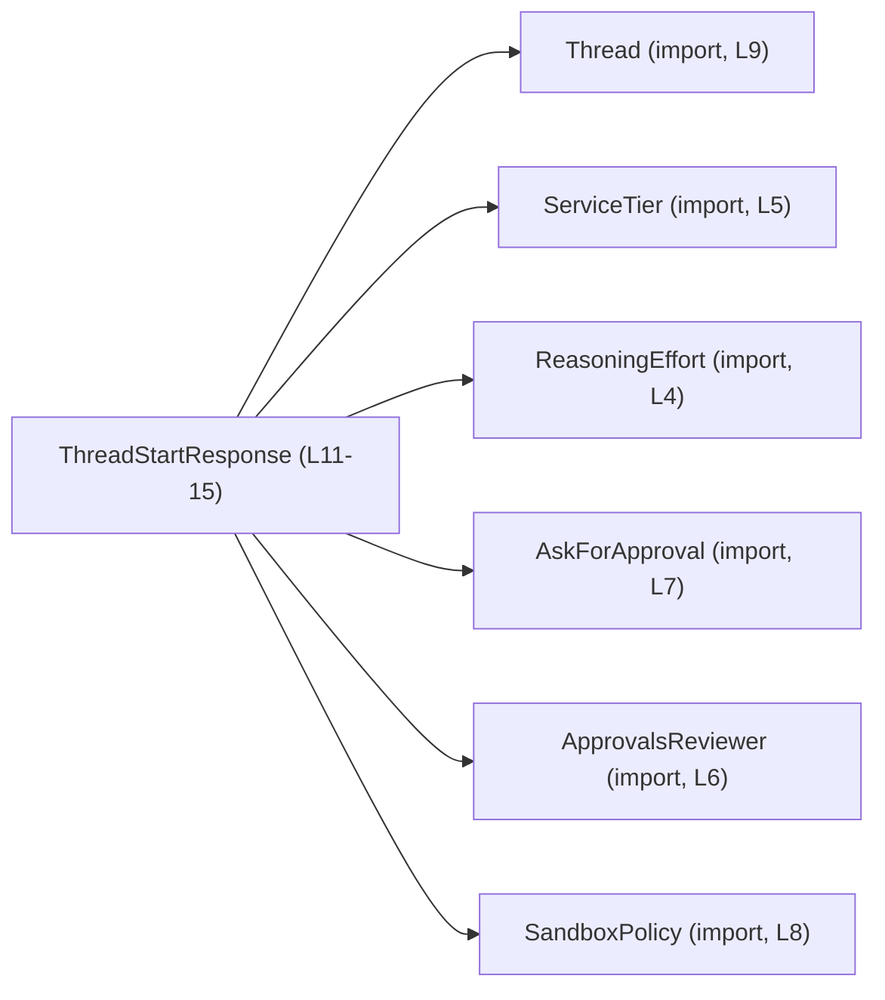
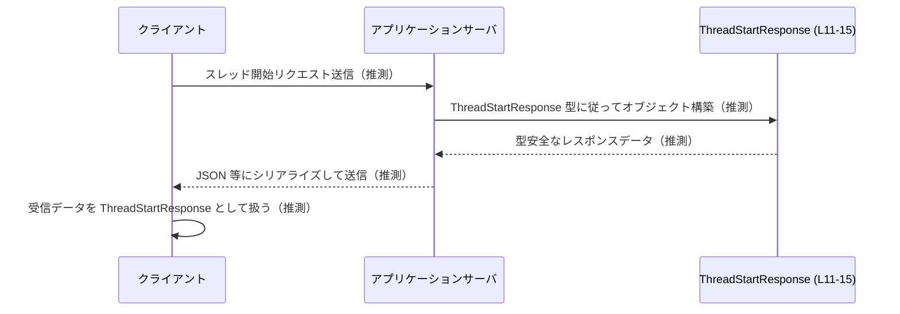

# app-server-protocol/schema/typescript/v2/ThreadStartResponse.ts コード解説

## 0. ざっくり一言

- スレッド開始時のレスポンスペイロードを表す **TypeScript 型エイリアス** `ThreadStartResponse` を定義するファイルです（`ThreadStartResponse.ts:L11-15`）。
- 他のスキーマ型（`Thread`, `ServiceTier`, `AskForApproval` など）を組み合わせた、型安全なレスポンス構造を提供します。

---

## 1. このモジュールの役割

### 1.1 概要

- このモジュールは、スレッド開始操作の結果として返されるレスポンスの構造を TypeScript の型として表現するために存在します。
- `ThreadStartResponse` 型には、開始されたスレッド情報、使用モデル、サービスティア、承認ポリシー、サンドボックス設定、推論負荷などが含まれます（`ThreadStartResponse.ts:L11-15`）。
- ファイル先頭コメントから、この型は Rust から `ts-rs` によって自動生成されていることが分かります（`ThreadStartResponse.ts:L1-3`）。

### 1.2 アーキテクチャ内での位置づけ

このファイル内では、`ThreadStartResponse` が以下の型に依存していることが分かります（`ThreadStartResponse.ts:L4-9, L11-15`）。



- 依存関係の方向は、「`ThreadStartResponse` がこれらの型をフィールドとして参照する」という一方向です。
- これらの型の中身は、このチャンクには現れないため不明です（`ThreadStartResponse.ts:L4-9`）。

### 1.3 設計上のポイント

- **自動生成コード**  
  - 冒頭コメントに「GENERATED CODE! DO NOT MODIFY BY HAND!」とあり、`ts-rs` による自動生成であることが明示されています（`ThreadStartResponse.ts:L1-3`）。
  - 仕様変更は元のスキーマ（Rust 側など）を更新する設計になっています。

- **純粋なデータ型**  
  - このファイルには関数やクラスはなく、`export type` による型エイリアスのみが定義されています（`ThreadStartResponse.ts:L11-15`）。
  - 副作用やロジックは持たず、**データ構造の定義専用**です。

- **NULL を含む型設計**  
  - `serviceTier: ServiceTier | null` と `reasoningEffort: ReasoningEffort | null` の 2 フィールドは `null` を許容します（`ThreadStartResponse.ts:L11, L15`）。
  - 利用側はこれらのフィールドを扱う際に **null チェックが必須**になる設計です（TypeScript の型安全性の観点）。

- **ドキュメンテーションコメント**  
  - `approvalsReviewer` フィールドには JSDoc コメントが付与されており、「このスレッドで承認要求に使用されるレビュアーである」と説明されています（`ThreadStartResponse.ts:L12-14`）。

- **並行性／エラー処理**  
  - このファイルには非同期処理やエラー処理、並行処理に関するロジックは存在しません（関数・クラスがないため）。
  - TypeScript の型定義のみであり、実行時エラーや並行性の制御は、このファイルの外側のコードで行われる前提です。

### 1.4 コンポーネント一覧（インベントリー）

このチャンクに登場する型・要素の一覧です。

| 名前                 | 種別              | 役割 / 用途（このチャンクから読み取れる範囲）                          | 定義位置 / 根拠 |
|----------------------|-------------------|-------------------------------------------------------------------------|-----------------|
| `ThreadStartResponse`| 型エイリアス      | スレッド開始レスポンス全体の構造を表す                                | `ThreadStartResponse.ts:L11-15` |
| `Thread`             | 外部型（import）  | `thread` フィールドの型。スレッド情報を表す型であると推測されるが、中身は不明 | `ThreadStartResponse.ts:L9` |
| `ServiceTier`        | 外部型（import）  | `serviceTier` フィールドの型。サービス層またはグレードを表すと思われるが、詳細不明 | `ThreadStartResponse.ts:L5` |
| `ReasoningEffort`    | 外部型（import）  | `reasoningEffort` フィールドの型。推論に関する負荷/強度を表す可能性があるが、詳細不明 | `ThreadStartResponse.ts:L4` |
| `ApprovalsReviewer`  | 外部型（import）  | `approvalsReviewer` フィールドの型。コメントより「このスレッドの承認要求に使用するレビュアー」を表す | `ThreadStartResponse.ts:L6, L12-14` |
| `AskForApproval`     | 外部型（import）  | `approvalPolicy` フィールドの型。承認をどのように求めるかのポリシーを表すと推測される | `ThreadStartResponse.ts:L7, L11` |
| `SandboxPolicy`      | 外部型（import）  | `sandbox` フィールドの型。サンドボックス動作のポリシーと推測される    | `ThreadStartResponse.ts:L8, L15` |

※ 外部型についてはインポートされていることだけが分かり、具体的な構造・列挙値などはこのチャンクには現れません。

---

## 2. 主要な機能一覧

このファイルは型定義のみを提供しており、機能は以下に集約されます。

- `ThreadStartResponse` 型の提供:  
  スレッド開始時のレスポンスペイロードを型安全に表現するための構造定義（`ThreadStartResponse.ts:L11-15`）。

---

## 3. 公開 API と詳細解説

### 3.1 型一覧（構造体・列挙体など）

#### 公開型

| 名前                 | 種別       | 役割 / 用途 | フィールド概要（このチャンクから読み取れる範囲） | 定義位置 |
|----------------------|------------|-------------|--------------------------------------------------|----------|
| `ThreadStartResponse`| 型エイリアス | スレッド開始レスポンスの全体構造 | `thread`, `model`, `modelProvider`, `serviceTier`, `cwd`, `approvalPolicy`, `approvalsReviewer`, `sandbox`, `reasoningEffort` を持つオブジェクト | `ThreadStartResponse.ts:L11-15` |

#### `ThreadStartResponse` フィールド一覧

`ThreadStartResponse` の各フィールドと型は、次のように定義されています（`ThreadStartResponse.ts:L11-15`）。

| フィールド名         | 型                            | null 許容 | 説明（根拠付き） |
|----------------------|-------------------------------|-----------|------------------|
| `thread`             | `Thread`                      | 不可      | スレッド情報。型名と `Thread` のインポート（`ThreadStartResponse.ts:L9, L11`）から、開始されたスレッドの状態を保持するオブジェクトと推測されますが、構造は不明です。 |
| `model`              | `string`                      | 不可      | 使用モデル名を表す文字列と考えられます。型は `string` のみで、制約はこのチャンクには現れません（`ThreadStartResponse.ts:L11`）。 |
| `modelProvider`      | `string`                      | 不可      | モデルを提供するプロバイダ名（例: ベンダー名）と推測されますが、文字列型以外の制約は不明です（`ThreadStartResponse.ts:L11`）。 |
| `serviceTier`        | `ServiceTier \| null`         | 可        | サービスティアを表す外部型 `ServiceTier` か、値なしを表す `null`。`null` を許容するため、利用側は null チェックが必要です（`ThreadStartResponse.ts:L5, L11`）。 |
| `cwd`                | `string`                      | 不可      | カレントワーキングディレクトリ（current working directory）パスを表すと推測されますが、コメント等はないため断定はできません（`ThreadStartResponse.ts:L11`）。 |
| `approvalPolicy`     | `AskForApproval`              | 不可      | 承認をどのように求めるかを表すポリシー型と推測されます。外部型 `AskForApproval` に依存します（`ThreadStartResponse.ts:L7, L11`）。 |
| `approvalsReviewer`  | `ApprovalsReviewer`           | 不可      | JSDoc コメントにより「このスレッドでの承認リクエストに使用されるレビュアー」であることが明記されています（`ThreadStartResponse.ts:L6, L12-15`）。 |
| `sandbox`            | `SandboxPolicy`               | 不可      | サンドボックスの動作ポリシーを表す型と推測されますが、中身は不明です（`ThreadStartResponse.ts:L8, L15`）。 |
| `reasoningEffort`    | `ReasoningEffort \| null`     | 可        | 推論の「努力度」や計算量レベルを表す型 `ReasoningEffort` か `null`。`null` の場合、明示されていないことを意味すると推測されます（`ThreadStartResponse.ts:L4, L15`）。 |

### 3.2 関数詳細

- このファイルには **関数が定義されていません**（`ThreadStartResponse.ts:L1-15`）。
- したがって、このセクションで詳細に説明すべき関数は存在しません。

### 3.3 その他の関数

- ヘルパー関数やラッパー関数も定義されていません（このチャンクには現れません）。

---

## 4. データフロー

このチャンクには `ThreadStartResponse` を生成・送受信する関数やメソッドが含まれていないため、**実際の処理フローはコードからは分かりません**。

ただし、型名とパス（`app-server-protocol/schema/typescript/v2/ThreadStartResponse.ts`）から、「アプリケーションサーバのプロトコルにおけるスレッド開始レスポンス」を表すと考えられます。  
以下は、その **典型的な利用イメージ（推測）** を示したものです。



- 上記のフローは **このチャンクには現れない外部コードの挙動を想定したもの**であり、実装がこの通りであるとは断定できません。
- この型を利用するコードでは、少なくとも `serviceTier` と `reasoningEffort` が `null` かどうかを判定しながら扱うことが想定されます（`ThreadStartResponse.ts:L11, L15`）。

---

## 5. 使い方（How to Use）

### 5.1 基本的な使用方法

`ThreadStartResponse` はオブジェクトの型として利用します。  
ここでは、この型をインポートして値を構築する典型的なコード例を示します（外部型の具体的な構築方法はこのチャンクにはないため、プレースホルダを使っています）。

```typescript
// ThreadStartResponse 型をインポートする（実際のパスはプロジェクト構成による）
import type { ThreadStartResponse } from "./schema/typescript/v2/ThreadStartResponse"; // 例

// 事前に用意された外部型の値（実際にはそれぞれの定義元で構築する）
import type { Thread } from "./schema/typescript/v2/Thread";
import type { ServiceTier } from "./schema/typescript/ServiceTier";
import type { ReasoningEffort } from "./schema/typescript/ReasoningEffort";
import type { AskForApproval } from "./schema/typescript/v2/AskForApproval";
import type { ApprovalsReviewer } from "./schema/typescript/v2/ApprovalsReviewer";
import type { SandboxPolicy } from "./schema/typescript/v2/SandboxPolicy";

// ここでは仮に既に生成済みの値があると仮定する
declare const thread: Thread;
declare const serviceTier: ServiceTier | null;
declare const approvalPolicy: AskForApproval;
declare const approvalsReviewer: ApprovalsReviewer;
declare const sandbox: SandboxPolicy;
declare const reasoningEffort: ReasoningEffort | null;

// ThreadStartResponse 型の値を組み立てる
const response: ThreadStartResponse = {
  thread,                       // Thread 型（必須）
  model: "gpt-4.1",             // string 型（必須）
  modelProvider: "openai",      // string 型（必須）
  serviceTier,                  // ServiceTier | null 型（null 許容）
  cwd: "/workspace/project",    // string 型（必須）
  approvalPolicy,               // AskForApproval 型（必須）
  approvalsReviewer,            // ApprovalsReviewer 型（必須）
  sandbox,                      // SandboxPolicy 型（必須）
  reasoningEffort,              // ReasoningEffort | null 型（null 許容）
};
```

- この例は、型整合性の確認に TypeScript を利用する典型的な使い方を示しています。
- 文字列フィールド (`model`, `modelProvider`, `cwd`) は `string` であれば何でもよく、このチャンクにはフォーマット制約は現れません（`ThreadStartResponse.ts:L11`）。

### 5.2 よくある使用パターン

#### パターン 1: `null` 許容フィールドのハンドリング

`serviceTier` と `reasoningEffort` は `null` になりうるため、使用前にチェックする必要があります（`ThreadStartResponse.ts:L11, L15`）。

```typescript
function describeResponse(res: ThreadStartResponse): string {
  // serviceTier の有無に応じた表示
  const tierText =
    res.serviceTier !== null
      ? `Service tier: ${String(res.serviceTier)}`
      : "Service tier: (not specified)";

  // reasoningEffort の有無に応じた表示
  const effortText =
    res.reasoningEffort !== null
      ? `Reasoning effort: ${String(res.reasoningEffort)}`
      : "Reasoning effort: (not specified)";

  return [
    `Model: ${res.model} (provider: ${res.modelProvider})`,
    tierText,
    effortText,
    `CWD: ${res.cwd}`,
  ].join("\n");
}
```

- TypeScript の型システムにより、`res.serviceTier` と `res.reasoningEffort` を使用する際に `null` チェックをしないとコンパイルエラーになる設定（`strictNullChecks` 有効）も想定できます。

#### パターン 2: 承認ポリシーとレビュアの利用

コメントに基づき、`approvalsReviewer` を承認フローの説明に使う例です（`ThreadStartResponse.ts:L12-14`）。

```typescript
function getApprovalInfo(res: ThreadStartResponse) {
  // approvalPolicy や approvalsReviewer の具体的な構造はこのチャンクからは不明だが、
  // それらを別の処理に引き渡すことは型レベルで保証される。
  return {
    policy: res.approvalPolicy,
    reviewer: res.approvalsReviewer, // 「このスレッドの承認要求に使用されるレビュアー」（コメントより）
  };
}
```

### 5.3 よくある間違い（想定）

このチャンクから推測できる誤用パターンと、その修正例です。

```typescript
// 誤り例: null チェックなしで reasoningEffort を文字列連結しようとしている
function formatEffortWrong(res: ThreadStartResponse): string {
  // return "Effort: " + res.reasoningEffort; // strictNullChecks 下ではコンパイルエラーになる可能性
  throw new Error("例示のため、この行はコメントアウトすべきです");
}

// 正しい例: null を考慮する
function formatEffort(res: ThreadStartResponse): string {
  if (res.reasoningEffort === null) {
    return "Effort: (not specified)";
  }
  return "Effort: " + String(res.reasoningEffort);
}
```

- `ServiceTier | null` や `ReasoningEffort | null` をそのまま使用すると、実行時に `null` が混入する可能性があります。
- TypeScript のコンパイラ設定によっては、このようなコードはコンパイル段階で検出されます。

### 5.4 使用上の注意点（まとめ）

- **自動生成コードである点**  
  - このファイル自体は直接編集しないことが前提です（`ThreadStartResponse.ts:L1-3`）。
  - 型の変更は元のスキーマ（Rust 側など）を変更し、`ts-rs` の再生成を行う必要があります。

- **ランタイム検証が必要な点**  
  - TypeScript の型はコンパイル時のチェックのみであり、実行時に外部から受け取った JSON が本当に `ThreadStartResponse` に従っているかどうかは別途検証が必要です。
  - 特にセキュリティ上、信頼できない入力に対して型のみを信じてそのまま使用するのは危険です。

- **null 許容フィールドの取り扱い**  
  - `serviceTier` と `reasoningEffort` は `null` を取りうるため、利用時に `null` チェックを行う前提でコードを書く必要があります（`ThreadStartResponse.ts:L11, L15`）。

- **並行性について**  
  - この型は単なるデータコンテナであり、並行性の制御（ロック、スレッドセーフティなど）は担いません。
  - JavaScript / TypeScript のランタイム特性上、並行性の問題は呼び出し側の非同期処理設計に依存します。

---

## 6. 変更の仕方（How to Modify）

### 6.1 新しい機能を追加する場合（フィールド追加など）

- ファイル先頭に「GENERATED CODE! DO NOT MODIFY BY HAND!」と明記されているため（`ThreadStartResponse.ts:L1-3`）、**このファイルを直接編集するべきではありません**。
- 新しいフィールドを `ThreadStartResponse` に追加したい場合の一般的な手順は次の通りです（このチャンクから具体的な元定義ファイルは分かりません）。

  1. Rust など、`ts-rs` の入力になっている元の型定義を特定する（場所はこのチャンクからは不明）。
  2. 元の型に新しいフィールドを追加する。
  3. `ts-rs` を実行し、TypeScript スキーマを再生成する。
  4. 生成された `ThreadStartResponse.ts` に新しいフィールドが反映されていることを確認する。

- 追加するフィールドが `null` 許容かどうかにより、利用側コードへの影響（null チェックの必要性）が変わる点に注意が必要です。

### 6.2 既存の機能を変更する場合（フィールド削除・型変更など）

- 変更の影響範囲を把握するには、プロジェクト全体で `ThreadStartResponse` を参照している箇所を検索する必要があります（このチャンクから使用箇所は分かりません）。
- 変更時の注意点:

  - **フィールド削除**  
    - 既存コードがそのフィールドを参照している場合、コンパイルエラーや実行時エラーの原因になります。
  - **型変更（例: `string` → 列挙型）**  
    - 呼び出し側の型注釈や値の生成方法を合わせて変更する必要があります。
  - **NULL 許容の変更**  
    - `ServiceTier | null` を `ServiceTier` に変更するなど、null 許容性を変えると、利用側の null チェックロジックを見直す必要があります。

- 変更後は、`ts-rs` による再生成と、関連テスト（存在する場合）の実行が必要です。このチャンクにはテストコードは現れません。

---

## 7. 関連ファイル

このモジュールと密接に関係するファイルは、インポートから次のように推定できます。

| パス                                    | 役割 / 関係（このチャンクから分かる範囲） |
|-----------------------------------------|------------------------------------------|
| `../ReasoningEffort`                    | `ReasoningEffort` 型の定義ファイル。`reasoningEffort` フィールドで利用される（`ThreadStartResponse.ts:L4, L15`）。 |
| `../ServiceTier`                        | `ServiceTier` 型の定義ファイル。`serviceTier` フィールドで利用される（`ThreadStartResponse.ts:L5, L11`）。 |
| `./ApprovalsReviewer`                   | `ApprovalsReviewer` 型の定義ファイル。`approvalsReviewer` フィールドで利用され、コメントにより「承認要求に用いるレビュアー」であることが分かる（`ThreadStartResponse.ts:L6, L12-15`）。 |
| `./AskForApproval`                      | `AskForApproval` 型の定義ファイル。`approvalPolicy` フィールドの型として利用される（`ThreadStartResponse.ts:L7, L11`）。 |
| `./SandboxPolicy`                       | `SandboxPolicy` 型の定義ファイル。`sandbox` フィールドの型として利用される（`ThreadStartResponse.ts:L8, L15`）。 |
| `./Thread`                              | `Thread` 型の定義ファイル。`thread` フィールドの型として利用される（`ThreadStartResponse.ts:L9, L11`）。 |

- これらのファイルの中身は、このチャンクには現れないため不明です。
- プロトコル全体の理解や変更には、これら関連ファイルの型定義も合わせて確認する必要があります。

---

### 安全性・エラー・並行性の観点（補足）

- **安全性（型安全）**  
  - TypeScript による静的型チェックにより、`ThreadStartResponse` のフィールド名や型のミスはコンパイル時に検出しやすくなります（`ThreadStartResponse.ts:L11-15`）。
  - ただし、外部から受け取ったデータの実行時検証は別途必要です。

- **エラー**  
  - このファイルにはエラー処理ロジックはありませんが、`null` 許容フィールドの未検査利用や、入力データの未検証利用は実行時エラーやバグにつながる可能性があります。

- **並行性**  
  - この型自体は不変/可変の制約を持たず、並行性制御も行いません。複数の非同期タスクから同じオブジェクトを変更するかどうかは、呼び出し側の設計に依存します。
